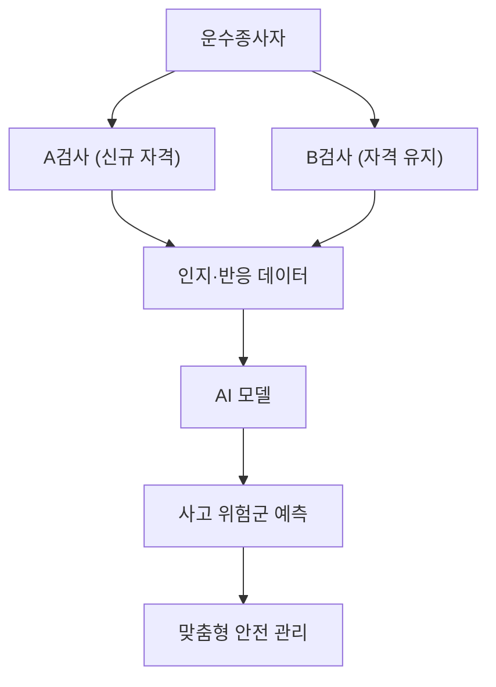
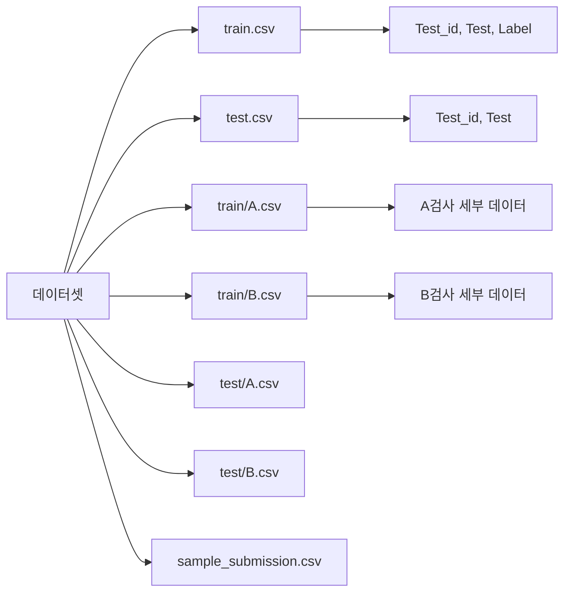
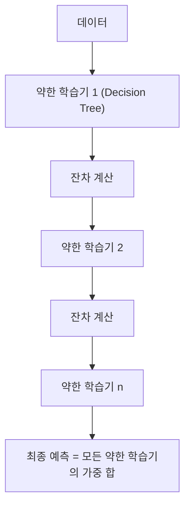
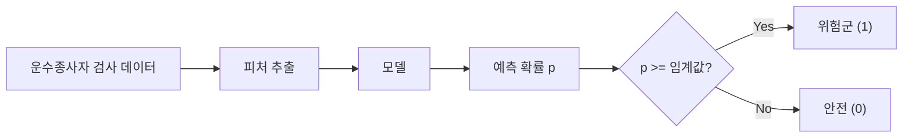
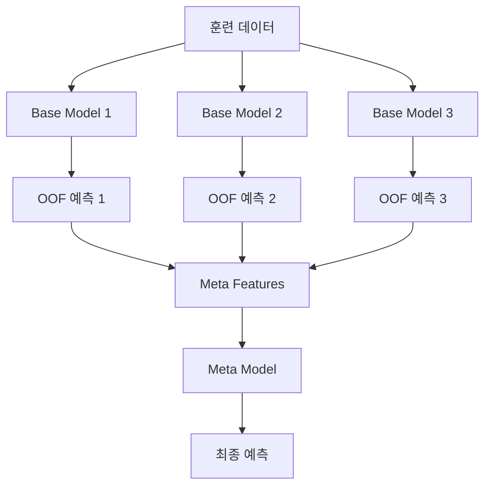
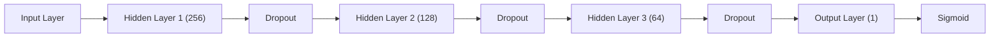

# 운수종사자 인지적 특성 데이터를 활용한 교통사고 위험 예측 AI 경진대회 가이드

## 목차

1. [대회 개요](#1-대회-개요-competition-overview)
2. [데이터셋 이해](#2-데이터셋-이해-dataset-understanding)
3. [탐색적 데이터 분석](#3-탐색적-데이터-분석-eda)
4. [피처 엔지니어링](#4-피처-엔지니어링-feature-engineering)
5. [베이스라인 모델 분석](#5-베이스라인-모델-분석)
6. [모델링 전략](#6-모델링-전략-modeling-strategy)
7. [고급 모델 실험](#7-고급-모델-실험)
8. [모델 해석 및 인사이트](#8-모델-해석-및-인사이트)
9. [코드 제출 가이드](#9-코드-제출-가이드)
10. [실전 구현 코드](#10-실전-구현-코드)
11. [2차 평가 대비: 보고서 작성 가이드](#11-2차-평가-대비-보고서-작성-가이드)
12. [성능 개선 체크리스트](#12-성능-개선-체크리스트)
13. [참고 자료 및 확장 학습](#13-참고-자료-및-확장-학습)
14. [용어 목록](#14-용어-목록-glossary)

---

## 1. 대회 개요 (Competition Overview)

### 1.1. 배경 및 목적

교통사고는 차량과 도로 환경뿐만 아니라 **운수종사자의 인지적 특성**에 크게 좌우됩니다. 운수종사자는 신규 진입 시 자격 검사를 받고, 이후 정기적으로 자격 유지 검사를 통해 인지 능력과 안전 운전 역량을 점검받습니다.

본 대회의 목적은 다음과 같습니다:

- 자격 검사 데이터를 활용하여 **교통사고 위험군 예측 AI 모델** 개발
- 맞춤형 안전 관리 체계 구축에 기여
- 인지·반응 특성과 사고 위험도 간의 관계 규명



### 1.2. 평가 방식

#### 1.2.1. 1차 평가 (Public Leaderboard)

- **평가 지표**: ROC-AUC (Receiver Operating Characteristic - Area Under Curve)
- **제출 방식**: 코드 제출 (submit.zip)
- **선발 기준**: 최종 Public 리더보드 상위 15팀이 2차 평가 진출

ROC-AUC는 다음과 같이 계산됩니다:

$$
\text{AUC} = \int_{0}^{1} \text{TPR}(\text{FPR}^{-1}(x)) \, dx
$$

여기서:
- $\text{TPR} = \frac{TP}{TP + FN}$ (True Positive Rate, 재현율)
- $\text{FPR} = \frac{FP}{FP + TN}$ (False Positive Rate)

#### 1.2.2. 2차 평가 (보고서 제출)

진출팀은 다음 두 가지 보고서를 제출해야 합니다:

1. **모델 개발 보고서**
   - 모델 아키텍처 설명
   - 하이퍼파라미터 튜닝 과정
   - 교차 검증 결과
   - 성능 비교표

2. **데이터 분석 보고서**
   - 탐색적 데이터 분석 (EDA)
   - 도메인 인사이트
   - 사고 위험 요인 분석
   - 시각화 자료

종합 평가를 통해 최종 상위 7팀이 수상팀으로 선정됩니다.

### 1.3. 제출 환경 및 제약사항

본 대회는 **코드 제출 방식**으로 진행되며, 다음과 같은 제약사항이 있습니다:

| 제약사항 | 상세 내용 |
|---------|----------|
| 추론 시간 | ≤ 30분 |
| 패키지 설치 시간 | ≤ 10분 |
| 제출 파일 용량 | ≤ 10GB |
| 실행 환경 | 오프라인 (패키지 설치 외 인터넷 불가) |
| 하드웨어 | CPU Only: 3 vCPU, 28GB RAM |

**주의사항**:
- 모든 라이브러리는 `requirements.txt`에 명시된 버전으로 설치
- 사전 학습된 모델 파일은 제출 파일에 포함
- 외부 API 호출 불가능

---

## 2. 데이터셋 이해 (Dataset Understanding)

### 2.1. 데이터셋 구조 개요



#### 주요 파일 설명

| 파일명 | 설명 | 주요 컬럼 |
|--------|------|-----------|
| `train.csv` | 학습 데이터 메타정보 | `Test_id`, `Test`, `Label` |
| `test.csv` | 테스트 데이터 메타정보 | `Test_id`, `Test` |
| `train/A.csv` | A검사 학습 데이터 | `Test_id`, `Age`, `TestDate`, `A1-1`~`A9-5` |
| `train/B.csv` | B검사 학습 데이터 | `Test_id`, `Age`, `TestDate`, `B1-1`~`B10-6` |
| `test/A.csv` | A검사 테스트 데이터 | 동일 구조 (Label 없음) |
| `test/B.csv` | B검사 테스트 데이터 | 동일 구조 (Label 없음) |

#### 타겟 변수

- **Label**: 교통사고 위험군 여부 (0: 안전, 1: 위험)

#### Test_id 구조

```
Test_id = [해시값]_[검사타입]_[연월]
예: 0x744773A3...DB2D1D_A_201811
```

### 2.2. A검사 (신규 자격 검사) 상세 분석

A검사는 신규 운수종사자가 받는 검사로, 총 **9개의 세부 검사**로 구성됩니다.

#### 2.2.1. A1 검사: 행동반응 측정 (속도예측)

**측정 내용**: 움직이는 물체에 대한 속도예측 능력 (지각운동요인)

**검사 방식**:
- 총 18 trials
- 자동차가 왼쪽에서 오른쪽으로 다양한 속도로 이동
- 터널진입 후 자동차의 앞부분이 목표지점에 도착했다고 판단될 때 속도 버튼을 누름

**데이터 컬럼**:
- `A1-1`: Condition 1 (1=left / 2=right, 각 9 trials)
- `A1-2`: Condition 2 (1=slow / 2=normal / 3=fast, 각 6 trials)
- `A1-3`: Response (0=N, 1=Y) - 응답 여부
- `A1-4`: ResponseTime (ms) - 반응시간

**예시 데이터**:
```
A1-1: "2,1,2,1,2,1,1,1,1,2,2,1,1,1,2,2,2,2"
A1-2: "1,3,1,1,2,2,2,3,1,3,1,3,1,2,2,3,2,3"
A1-3: "0,0,0,0,0,0,0,0,0,0,0,0,0,0,0,0,0,0"
A1-4: "4,13,25,82,24,55,4,-37,26,-8,12,73,78,55,58,16,115,196"
```

**평가 기준**: 자동차 앞부분과 목표지점과의 편차거리

**주의사항**: 
- 이동속도는 빠름, 중간, 느림, 세가지로 제시되며 순서는 일정하지 않음
- 평균 2회, 본검사 18회 시행

#### 2.2.2. A2 검사: 행동반응 측정 (노란색 브레이크 패달)

**측정 내용**: 자동차의 이동속도와 가속도를 고려한 정지거리 예측능력 (지각운동요인)

**검사 방식**:
- 총 18 trials
- 화면 상단에서 노란색 이동선이 다양한 속도로 하단으로 내려옴
- 이동선이 횡간색 정지선 위에 멈출 수 있도록 브레이크 패달을 밟음

**데이터 컬럼**:
- `A2-1`: Condition 1 (1=slow / 2=normal / 3=fast, 각 6 trials)
- `A2-2`: Condition 2 (1=slow / 2=normal / 3=fast, 각 6 trials)
- `A2-3`: Response (0=N, 1=Y)
- `A2-4`: ResponseTime (ms)

**평가 기준**: 노란색 이동선과 빨간색 정지선이 겹치는 구간으로부터의 편차거리

**주의사항**:
- 노란색 이동선은 화면중앙의 도로 위를, 빠름, 보통, 느림의 세가지 속도로 이동하며 패달을 밟추면 브레이크 패달을 사전에 조작하여 주시기 바람
- 이동선이 적색 정지선을 멈추지 않고 최대한 적색 정지선 위에 멈출 수 있도록 브레이크 패달을 사전에 조작하여 주시기 바람

#### 2.2.3. A3 검사: 행동반응 측정 (운전 시 주의력)

**측정 내용**: 운전 시 주의를 자유롭게 조율할 수 있는 능력 측정 (지각운동요인)

**검사 방식**:
- 총 32 trials (valid 16 / invalid 8)
- 화면에 무분경자(#)가 먼저 제시되고, 이후 목표 자극(→)이 동심원 형태로 제시됨
- 목표 자극(→)의 방향을 피악하여 화살표의 방향이 원쪽이면 원손 버튼, 오른쪽이면 오른손 버튼을 누름

**데이터 컬럼**:
- `A3-1`: Condition 1 (1=small / 2=big, 각 16 trials)
- `A3-2`: Condition 2 (1-8 clockwise, 각 4 trials)
- `A3-3`: Condition 3 (1=left / 2=right)
- `A3-4`: Condition 4 (1-8 clockwise)
- `A3-5`: Response 1 (1=valid correct / 2=valid incorrect / 3=invalid correct / 4=invalid incorrect)
- `A3-6`: Response 2 (0=N, 1=Y)
- `A3-7`: ResponseTime (ms)

**평가 기준**: 화살표 방향과 일치하는 버튼을 누른 횟수 및 반응시간

**주의사항**:
- 무분경자(#) 위치에 목표 자극(→)이 나타난 확률표 방향으로 반응하여야 함
- 우물정자(#) 위치에 목표 자극(→)이 나타난 확률은 75% 이므로 먼저, 우물정자(#) 위치를 주목하고, 목표 자극(→)이 없으면 다른 위치에서 찾아야 함
- 반응시간이 나타나이므로 가능한 한 빨리 일치하는 버튼을 조작하여야 함

#### 2.2.4. A4 검사: 행동반응 측정 (색깔 판단)

**측정 내용**: 필요한 자극에만 집중하여 빠르고 정확하게 반응하는 능력

**검사 방식**:
- 총 80 trials (congruent 40 / incongruent 40)
- 화면의 원쪽과 오른쪽에 적색 원과 녹색 원이 나타남
- 원의 좌우 위치가 아니라 원의 색깔과 동일한 색깔의 버튼을 누름

**데이터 컬럼**:
- `A4-1`: Condition 1 (1=con / 2=incon, 각 40 trials)
- `A4-2`: Condition 2 (1=red / 2=green, 각 40 trials)
- `A4-3`: Response 1 (1=correct / 2=incorrect)
- `A4-4`: Response 2 (0=N, 1=Y)
- `A4-5`: ResponseTime (ms)

**평가 기준**: 정답 수 및 반응 시간

**주의사항**:
- 화면에 제시된 원의 색깔 일치하는 버튼을 최대한 빠르게 눌러주세요
- 원이 제시되기 전 또는 원의 색깔과 다른 색 버튼을 누르면 오반응
- 3초 이내에 반응하지 않으면 오반응으로 처리되며, 다음 문항으로 이동
- 원이 제시되기 전 또는 원의 색깔과 다른 색 버튼을 누르면 오반응

#### 2.2.5. A5 검사: 행동반응 측정 (변화탐지)

**측정 내용**: 변화사항을 기억하여 탐지하는 능력 측정

**검사 방식**:
- 총 36 trials (non change 18 / pos change 6 / color change 6 / shape change 6)
- 화면에 3~5개의 도형으로 구성된 그림판이 제시되고, 1초 후 동일한 그림판 또는 색상, 위치, 모양이 다른 그림판이 제시됨
- 처음 제시된 그림판과 동일하면 예 버튼, 다르면 아니오 버튼을 누름

**데이터 컬럼**:
- `A5-1`: Condition (1=non change / 2=pos change / 3=color change / 4=shape change)
- `A5-2`: Response 1 (1=correct answer / 2=incorrect answer)
- `A5-3`: Response 2 (0=N, 1=Y)

**평가 기준**: 정답 수

**주의사항**:
- 변화 조건은 색상, 위치, 모양 중 하나라도 다르면 아니오 버튼을 누름
- 정확성이 중요하며, 2.5초 이내에 차분히 반응
- 제한 시간 이내에 반응하지 않으면 오반응으로 처리되고 다음 문항으로 이동

#### 2.2.6. A6 검사: 문제풀이식 (판단능력)

**측정 내용**: 판단능력, 돌발상황에서 교통정보 파악 능력 (지적운동요인)

**검사 방식**:
- 총 14 trials
- 제시된 2개 도형의 관계성을 파악하여, 주어진 도형과 관계되는 도형을 찾아 해당 버튼을 누름

**데이터 컬럼**:
- `A6-1`: 개수 (정답 수)

**평가 기준**: 정답 수

**주의사항**:
- 화면에 제시된 두 그림의 관계를 반간한 이후, 두 도형의 관계와 관계되는 도형을 찾아 해당 버튼을 누름
- 제한시간 7분
- 어려운 문제는 '다음' 버튼을 눌러 건너뛰고, 진어시간에 풀어도 됨
- 제한시간이 지나면 자동으로 다음 검사로 넘어가기 때문에 제한시간 내에 가능한 많은 문항을 풀어야 함

#### 2.2.7. A7 검사: 문제풀이식 (단순도형)

**측정 내용**: 판단능력, 돌발상황에서 교통정보 파악 능력 (지적운동요인)

**검사 방식**:
- 총 18 trials
- 단순도형을 포함하는 복잡도형 또는 복잡도형에 포함된 단순도형을 찾아 해당 버튼을 누름

**데이터 컬럼**:
- `A7-1`: 개수 (정답 수)

**평가 기준**: 정답 수

**주의사항**:
- 어려운 문제는 '다음' 버튼을 눌러 건너뛰고, 진어시간에 풀어도 됨
- 지각성향검사 도형의 크기와 방향이 같아야 함
- 유념해야할 사항은 검사 중간에 단순도형사에서 복잡도형사로 바꿔져야 합니다

**단순도형검사와 복잡도형검사**:
- 처번째 유형의 검사는 단순도형입니다. 원쪽에 제시된 단순도형 인에 포함되어있는 단순도형을 찾는 문제입니다
- 두번째 유형의 검사는 복잡도형사입니다. 원쪽에 제시된 복잡도형 안에 포함되어있는 단순도형을 찾는 문제입니다

#### 2.2.8. A8 검사: 질문지형 (타당도 척도)

**측정 내용**: 응답 왜곡 정도 및 반응 일관성 정도

**데이터 컬럼**:
- `A8-1`: 개수 (타당도 척도 1 - 응답 왜곡 정도)
- `A8-2`: 개수 (타당도 척도 2 - 반응 일관성 정도)

**설명**:
- 처번째 유형의 검사는 단순도형사입니다
- 원쪽에 제시된 단순도형이 포함된 복잡한 그림을 찾는 문제입니다
- 복잡한 그림에서 단순도형의 크기와 방향은 변하지 않습니다

#### 2.2.9. A9 검사: 질문지형 (심리 특성)

**측정 내용**: 정서안정성, 행동안정성, 현실판단력, 정신적민첩성, 생활스트레스

**데이터 컬럼**:
- `A9-1`: 개수 (정서안정성)
- `A9-2`: 개수 (행동안정성)
- `A9-3`: 개수 (현실판단력)
- `A9-4`: 개수 (정신적민첩성)
- `A9-5`: 개수 (생활스트레스)

**A8, A9 공통 주의사항**:
- 본 검사는 우리가 일상생활을 하거나 운전을 할 때 겪게하는 일이나 머리 속에 떠오르는 생각, 느끼는 감정 등과 관련된 쉬운 문장들로 이루어져있습니다
- 사람마다 각 생길새가 다르고 사람마다 좋아하는 음식이 다른듯이 사람의 성격도 많이 다릅니다
- 이것에 게인이 겪사의 목적입니다
- 이 검사는 안전운전에 취약한 소수의 운전자 선별을 위한 것으로는 당담한 내용을 토대로 성격적 취약성을 종합적으로 평가하게 됩니다

**검사방법**:
- 검사방법은 일상생활에서 경험할 수 있는 각 문항에 대하여 그 내용이 자신에게 대부분 해당되면 '매우 그렇다' 버튼을, 일부 해당 되면 '약간 그렇다' 버튼을, 해당되지 않으면 '아니다' 버튼을 눌러주시면 됩니다
- 버튼을 누르면 선택한 결과에 해당되는 대로 꾸밈없이 용담했는지 여부와 일관성 정도를 용담했는지 여부를 평가하는 문항들이 포함되어 있으니 유의하시기 바랍니다

**모든 문항에 대한 빠짐없이 용담하여야 하며, 시간제한이 없으므로 편안한 마음으로 각 문항에 내용을 상세하게 읽고 성실하게 용담해 주시기 바랍니다**

### 2.3. B검사 (자격 유지 검사) 상세 분석

B검사는 기존 운수종사자가 받는 정기 검사로, 총 **10개의 세부 검사**로 구성됩니다.

#### 2.3.1. B1, B2 검사: 시야각 및 전통적 시야력

**측정 내용**: 시야각, 전통적인 시야각 검사를 사용하여 시야력 측정

**B1 검사 데이터 컬럼**:
- 16 trials (color change 8 / color non change 8)
- `B1-1`: 응답, 1 과제 (1=correct answer / 2=incorrect answer)
- `B1-2`: 응답시간, 2 과제 (초 단위, 소수점)
- `B1-3`: 응답, 2 과제 (1=change-correct / 2=change-incorrect / 3=non change-correct / 4=non change-incorrect)

**B2 검사 데이터 컬럼**:
- 16 trials (color change 8 / color non change 8)
- `B2-1`: 응답, 1 과제 (1=correct answer / 2=incorrect answer)
- `B2-2`: 응답시간, 2 과제
- `B2-3`: 응답, 2 과제 (1=change-correct / 2=change-incorrect / 3=non change-correct / 4=non change-incorrect)

**검사 방법**:
- 화면 중앙에 시선을 고정하면서 주변시야에 보이는 자극을 정확하게 찾아내는 검사
- 총 32회 시행

**검사 단계**:
1. **단순형**: 녹색 점 하나만 제시
2. **정답표시**: 8개 위치 중 하나에 자극 제시
3. **복잡형**: 여러 자극 중 목표 자극 찾기

#### 2.3.2. B3 검사: 신호 운동 협응

**측정 내용**: 시각 운동 협응 속도, 운전상황에서 시각정보 인식 후 이동 운동기능을 빠르게 전환하는 능력

**데이터 컬럼**:
- 15 trials
- `B3-1`: 응답 (1=correct answer / 2=incorrect answer)
- `B3-2`: 반응시간 (초 단위)

**검사 방법**:
- 엑셀패달을 밟아 도로를 주행하면서 신호등이 빨간색으로 바귀거나 화면에 위험 표지판이 나타나면 즉각 브레이크 패달을 밟는 검사
- 총 15회 시행

#### 2.3.3. B4 검사: 선택적 주의력 측정

**측정 내용**: 선택적 주의력 측정, 불필요한 간섭자극에 대한 반응을 억제하고 필요한 반응을 하는 능력

**데이터 컬럼**:
- 60 trials (congruent 30 / incongruent 30)
- `B4-1`: 응답 (1,2=correct/incorrect in congruent / 3,4,5,6=correct/incorrect in incongruent)
- `B4-2`: 반응시간 (초 단위)

**검사 방법**:
- 화면 좌우측에 무작위로 좌우 방향의 화살표가 하나씩 제시되는데, 나타난 위치와 상관없이 미끄러지면서 화살표가 가리키는 방향에 맞는 버튼을 누름
- 제시조건은 일치, 불일치 2조건이며 총 60회 실시

#### 2.3.4. B5 검사: 공간 판단력

**측정 내용**: 공간 판단력, 복잡한 공간적 정보를 빠르게 파악하여 문제를 해결하는 능력

**데이터 컬럼**:
- 20 trials
- `B5-1`: 응답 (1=correct answer / 2=incorrect answer)
- `B5-2`: 반응시간 (초 단위)

**검사 방법**:
- 화면에 여러 개의 도로가 서로 얽혀있는데, 도로의 시작점에 위치한 자동차가 자고 가기 위해서는 어떤 도로로 가야 하는지를 빠르게 찾는 검사
- 총 20회 시행

#### 2.3.5. B6, B7 검사: 시각적 기억력

**측정 내용**: 시각적 기억력, 시각적 자극을 적절하게 기억하는 능력

**B6, B7 공통 데이터 컬럼**:
- 15 trials each
- `B6`: 응답 (1=correct answer / 2=incorrect answer)
- `B7`: 응답 (1=correct answer / 2=incorrect answer)

**검사 방법**:
- 화면에 교통안전표지판이 이후 기억하여 동일한 교통안전표지판을 찾아야 하고, 또한 도로표지판이 제시되면 이를 기억하여 특정 지역까지 가능한 한 빨리 일치하는 버튼을 조작하여야 함
- 제시 조건은 교통안전 표지판, 도로표지판 2조건이며 총 30회 시행

#### 2.3.6. B8 검사: 주의 지속능력

**측정 내용**: 주의 지속능력 측정, 복잡한 상황에서 목표자극에 주의를 지속할 수 있는 능력

**데이터 컬럼**:
- 12 trials
- `B8`: 응답 (1=correct answer / 2=incorrect answer)

**검사 방법**:
- 자동차가 5대중 한 대에 사람이 탑승하면 자동차들이 도로를 제겟대로 주행한 후 정지하게 되는데, 이때 사람이 탑승한 자동차를 찾는 검사
- 제시조건은 난이도에 따라 4조건으로 총 12회 실시

#### 2.3.7. B9, B10 검사: 다중과제 수행능력

**측정 내용**: 다중과제 수행능력, 운전에 필요한 시각, 청각, 운동 등 다양한 기능을 동시에 인식하고 반응하는 능력

**B9 검사 데이터 컬럼**:
- aud 50 trials (target 15, distractor 35)
- vis 32 trials (obstacle avoidance, joy stick)
- `B9-1`: 개수 (aud, hit)
- `B9-2`: 개수 (aud, miss)
- `B9-3`: 개수 (aud, fa - false alarm)
- `B9-4`: 개수 (aud, cr - correct rejection)
- `B9-5`: 개수 (vis, err - error)

**B10 검사 데이터 컬럼**:
- aud 80 trials (target 20, distractor 60)
- vis1 52 trials (obstacle avoidance, joy stick)
- vis2 20 trials (color selection, button)
- `B10-1`: 개수 (aud, hit)
- `B10-2`: 개수 (aud, miss)
- `B10-3`: 개수 (aud, fa)
- `B10-4`: 개수 (aud, cr)
- `B10-5`: 개수 (vis1, err)
- `B10-6`: 개수 (vis2, right response)

**검사 방법**:
- 자동차가 장애물을 피하면서 진행할 수 있도록 조작하면서 숫자 70이 들릴 때마다 반응버튼을 누르는 검사
- 화면 색깔과 같은 반응버튼을 누르는 검사

### 2.4. 데이터 전처리 전략

#### 2.4.1. 문자열 리스트 파싱

대부분의 검사 결과는 **쉼표로 구분된 문자열**로 저장되어 있습니다.

```python
import pandas as pd
import numpy as np

def parse_string_list(s):
    """문자열 리스트를 실제 리스트로 변환"""
    if pd.isna(s) or s == '':
        return []
    return [float(x) for x in str(s).split(',')]

def extract_statistics(series):
    """리스트 데이터에서 통계량 추출"""
    stats = {}
    stats['mean'] = np.mean(series) if len(series) > 0 else np.nan
    stats['std'] = np.std(series) if len(series) > 0 else np.nan
    stats['min'] = np.min(series) if len(series) > 0 else np.nan
    stats['max'] = np.max(series) if len(series) > 0 else np.nan
    stats['median'] = np.median(series) if len(series) > 0 else np.nan
    stats['q25'] = np.percentile(series, 25) if len(series) > 0 else np.nan
    stats['q75'] = np.percentile(series, 75) if len(series) > 0 else np.nan
    stats['count'] = len(series)
    return stats

# 사용 예시
df['A1-4_parsed'] = df['A1-4'].apply(parse_string_list)
df['A1-4_mean'] = df['A1-4_parsed'].apply(lambda x: np.mean(x) if len(x) > 0 else np.nan)
df['A1-4_std'] = df['A1-4_parsed'].apply(lambda x: np.std(x) if len(x) > 0 else np.nan)
```

#### 2.4.2. 결측치 처리

```python
# 결측치 확인
missing_summary = df.isnull().sum()
missing_percent = (df.isnull().sum() / len(df)) * 100

print("결측치 비율:")
print(missing_percent[missing_percent > 0].sort_values(ascending=False))

# 결측치 처리 전략
def handle_missing_values(df):
    """결측치 처리"""
    # 수치형 변수: 중앙값으로 대체
    numeric_cols = df.select_dtypes(include=[np.number]).columns
    for col in numeric_cols:
        if df[col].isnull().any():
            df[col].fillna(df[col].median(), inplace=True)
    
    # 범주형 변수: 최빈값으로 대체
    categorical_cols = df.select_dtypes(include=['object']).columns
    for col in categorical_cols:
        if df[col].isnull().any():
            df[col].fillna(df[col].mode()[0], inplace=True)
    
    return df
```

#### 2.4.3. 이상치 탐지 및 처리

```python
def detect_outliers_iqr(data, column):
    """IQR 방법으로 이상치 탐지"""
    Q1 = data[column].quantile(0.25)
    Q3 = data[column].quantile(0.75)
    IQR = Q3 - Q1
    
    lower_bound = Q1 - 1.5 * IQR
    upper_bound = Q3 + 1.5 * IQR
    
    outliers = data[(data[column] < lower_bound) | (data[column] > upper_bound)]
    return outliers, lower_bound, upper_bound

def cap_outliers(data, column, lower_bound, upper_bound):
    """이상치를 경계값으로 제한"""
    data[column] = np.where(data[column] < lower_bound, lower_bound, data[column])
    data[column] = np.where(data[column] > upper_bound, upper_bound, data[column])
    return data

# 반응시간 이상치 처리 예시
response_time_cols = [col for col in df.columns if 'ResponseTime' in col or '반응시간' in col]

for col in response_time_cols:
    outliers, lower, upper = detect_outliers_iqr(df, col)
    print(f"{col}: {len(outliers)} outliers detected")
    df = cap_outliers(df, col, lower, upper)
```

---

## 3. 탐색적 데이터 분석 (EDA)

### 3.1. 타겟 변수 분포 분석

```python
import matplotlib.pyplot as plt
import seaborn as sns

# 한글 폰트 설정
plt.rcParams['font.family'] = 'Malgun Gothic'
plt.rcParams['axes.unicode_minus'] = False

def analyze_target_distribution(train_df):
    """타겟 변수 분포 분석"""
    fig, axes = plt.subplots(1, 2, figsize=(14, 5))
    
    # 빈도수
    train_df['Label'].value_counts().plot(kind='bar', ax=axes[0], color=['#2ecc71', '#e74c3c'])
    axes[0].set_title('교통사고 위험군 분포', fontsize=14, fontweight='bold')
    axes[0].set_xlabel('Label (0: 안전, 1: 위험)', fontsize=12)
    axes[0].set_ylabel('빈도수', fontsize=12)
    axes[0].set_xticklabels(['안전 (0)', '위험 (1)'], rotation=0)
    
    # 비율
    label_counts = train_df['Label'].value_counts()
    axes[1].pie(label_counts, labels=['안전 (0)', '위험 (1)'], autopct='%1.1f%%',
                colors=['#2ecc71', '#e74c3c'], startangle=90)
    axes[1].set_title('교통사고 위험군 비율', fontsize=14, fontweight='bold')
    
    plt.tight_layout()
    plt.show()
    
    # 불균형 비율 계산
    imbalance_ratio = label_counts[0] / label_counts[1]
    print(f"\n클래스 불균형 비율: {imbalance_ratio:.2f}:1 (안전:위험)")
    print(f"위험군 비율: {(label_counts[1] / len(train_df)) * 100:.2f}%")

# 실행
analyze_target_distribution(train_df)
```

**예상 결과**:
- 클래스 불균형이 존재할 가능성 높음 (안전 > 위험)
- SMOTE, 가중치 조정 등의 불균형 처리 기법 필요

### 3.2. 연령대별 사고 위험도 분석

```python
def analyze_age_risk(train_df, train_a_df, train_b_df):
    """연령대별 사고 위험도 분석"""
    # A검사와 B검사 데이터 병합
    merged_a = train_df[train_df['Test'] == 'A'].merge(train_a_df[['Test_id', 'Age']], on='Test_id')
    merged_b = train_df[train_df['Test'] == 'B'].merge(train_b_df[['Test_id', 'Age']], on='Test_id')
    merged = pd.concat([merged_a, merged_b], ignore_index=True)
    
    # 연령대별 위험률 계산
    age_risk = merged.groupby('Age').agg({
        'Label': ['count', 'sum', 'mean']
    }).reset_index()
    age_risk.columns = ['Age', 'Total', 'RiskCount', 'RiskRate']
    age_risk = age_risk.sort_values('Age')
    
    # 시각화
    fig, axes = plt.subplots(1, 2, figsize=(16, 5))
    
    # 연령대별 샘플 수
    axes[0].bar(age_risk['Age'], age_risk['Total'], color='#3498db', alpha=0.7)
    axes[0].set_title('연령대별 샘플 수', fontsize=14, fontweight='bold')
    axes[0].set_xlabel('연령대', fontsize=12)
    axes[0].set_ylabel('샘플 수', fontsize=12)
    axes[0].tick_params(axis='x', rotation=45)
    
    # 연령대별 위험률
    axes[1].plot(age_risk['Age'], age_risk['RiskRate'] * 100, marker='o', 
                 color='#e74c3c', linewidth=2, markersize=8)
    axes[1].set_title('연령대별 교통사고 위험률', fontsize=14, fontweight='bold')
    axes[1].set_xlabel('연령대', fontsize=12)
    axes[1].set_ylabel('위험률 (%)', fontsize=12)
    axes[1].grid(True, alpha=0.3)
    axes[1].tick_params(axis='x', rotation=45)
    
    plt.tight_layout()
    plt.show()
    
    return age_risk

age_risk = analyze_age_risk(train_df, train_a_df, train_b_df)
print(age_risk)
```

**인사이트**:
- 특정 연령대(예: 고령층)에서 위험률이 높을 가능성
- 연령대를 피처로 활용 또는 연령대별 모델 구축 고려

### 3.3. 검사별 특성 분포

```python
def analyze_response_time_distribution(train_a_df):
    """A검사 반응시간 분포 분석"""
    response_time_cols = ['A1-4', 'A2-4', 'A3-7', 'A4-5']
    
    fig, axes = plt.subplots(2, 2, figsize=(16, 12))
    axes = axes.flatten()
    
    for idx, col in enumerate(response_time_cols):
        # 문자열 리스트 파싱
        parsed_data = train_a_df[col].apply(parse_string_list)
        all_values = [val for sublist in parsed_data for val in sublist if not np.isnan(val)]
        
        # 히스토그램
        axes[idx].hist(all_values, bins=50, color='#9b59b6', alpha=0.7, edgecolor='black')
        axes[idx].set_title(f'{col} 반응시간 분포', fontsize=12, fontweight='bold')
        axes[idx].set_xlabel('반응시간 (ms)', fontsize=10)
        axes[idx].set_ylabel('빈도수', fontsize=10)
        axes[idx].axvline(np.mean(all_values), color='red', linestyle='--', 
                          label=f'평균: {np.mean(all_values):.1f}ms')
        axes[idx].legend()
    
    plt.tight_layout()
    plt.show()

analyze_response_time_distribution(train_a_df)
```

### 3.4. A검사와 B검사 간 상관관계

```python
def analyze_test_correlation(train_df, train_a_df, train_b_df, feature_cols_a, feature_cols_b):
    """A검사와 B검사 피처 간 상관관계 분석"""
    # 데이터 병합
    merged_a = train_df[train_df['Test'] == 'A'].merge(train_a_df, on='Test_id')
    merged_b = train_df[train_df['Test'] == 'B'].merge(train_b_df, on='Test_id')
    
    # 공통 사용자 찾기 (PrimaryKey 기반)
    common_users = set(merged_a['PrimaryKey']).intersection(set(merged_b['PrimaryKey']))
    print(f"A검사와 B검사를 모두 받은 사용자 수: {len(common_users)}")
    
    if len(common_users) > 0:
        # 공통 사용자 데이터 추출
        merged_a_common = merged_a[merged_a['PrimaryKey'].isin(common_users)]
        merged_b_common = merged_b[merged_b['PrimaryKey'].isin(common_users)]
        
        # 상관관계 분석
        # (구현 세부사항은 실제 데이터 구조에 따라 조정)
        print("A검사와 B검사 간 상관관계 분석 가능")
    else:
        print("공통 사용자가 없어 직접적인 상관관계 분석 불가")
```

### 3.5. 시계열 패턴 (TestDate 기반)

```python
def analyze_temporal_patterns(train_df, train_a_df, train_b_df):
    """검사일 기반 시계열 패턴 분석"""
    # A검사와 B검사 데이터 병합
    merged_a = train_df[train_df['Test'] == 'A'].merge(train_a_df[['Test_id', 'TestDate']], on='Test_id')
    merged_b = train_df[train_df['Test'] == 'B'].merge(train_b_df[['Test_id', 'TestDate']], on='Test_id')
    merged = pd.concat([merged_a, merged_b], ignore_index=True)
    
    # TestDate를 datetime으로 변환 (YYYYMM 형식)
    merged['TestDate'] = pd.to_datetime(merged['TestDate'], format='%Y%m')
    
    # 월별 위험률 계산
    monthly_risk = merged.groupby(merged['TestDate'].dt.to_period('M')).agg({
        'Label': ['count', 'sum', 'mean']
    }).reset_index()
    monthly_risk.columns = ['Month', 'Total', 'RiskCount', 'RiskRate']
    
    # 시각화
    fig, axes = plt.subplots(2, 1, figsize=(16, 10))
    
    # 월별 샘플 수
    axes[0].bar(range(len(monthly_risk)), monthly_risk['Total'], color='#3498db', alpha=0.7)
    axes[0].set_title('월별 검사 수', fontsize=14, fontweight='bold')
    axes[0].set_xlabel('월', fontsize=12)
    axes[0].set_ylabel('검사 수', fontsize=12)
    axes[0].set_xticks(range(len(monthly_risk)))
    axes[0].set_xticklabels([str(m) for m in monthly_risk['Month']], rotation=45)
    
    # 월별 위험률
    axes[1].plot(range(len(monthly_risk)), monthly_risk['RiskRate'] * 100, 
                 marker='o', color='#e74c3c', linewidth=2, markersize=8)
    axes[1].set_title('월별 교통사고 위험률', fontsize=14, fontweight='bold')
    axes[1].set_xlabel('월', fontsize=12)
    axes[1].set_ylabel('위험률 (%)', fontsize=12)
    axes[1].grid(True, alpha=0.3)
    axes[1].set_xticks(range(len(monthly_risk)))
    axes[1].set_xticklabels([str(m) for m in monthly_risk['Month']], rotation=45)
    
    plt.tight_layout()
    plt.show()
    
    return monthly_risk

monthly_risk = analyze_temporal_patterns(train_df, train_a_df, train_b_df)
```

---

## 4. 피처 엔지니어링 (Feature Engineering)

### 4.1. 통계적 피처 생성

#### 4.1.1. 반응시간 통계량

```python
def create_response_time_features(df, response_time_cols):
    """반응시간 기반 통계 피처 생성"""
    features = pd.DataFrame()
    
    for col in response_time_cols:
        # 문자열 리스트 파싱
        parsed = df[col].apply(parse_string_list)
        
        # 기본 통계량
        features[f'{col}_mean'] = parsed.apply(lambda x: np.mean(x) if len(x) > 0 else np.nan)
        features[f'{col}_std'] = parsed.apply(lambda x: np.std(x) if len(x) > 0 else np.nan)
        features[f'{col}_min'] = parsed.apply(lambda x: np.min(x) if len(x) > 0 else np.nan)
        features[f'{col}_max'] = parsed.apply(lambda x: np.max(x) if len(x) > 0 else np.nan)
        features[f'{col}_median'] = parsed.apply(lambda x: np.median(x) if len(x) > 0 else np.nan)
        
        # 백분위수
        features[f'{col}_q25'] = parsed.apply(lambda x: np.percentile(x, 25) if len(x) > 0 else np.nan)
        features[f'{col}_q75'] = parsed.apply(lambda x: np.percentile(x, 75) if len(x) > 0 else np.nan)
        
        # 변동 계수 (Coefficient of Variation)
        features[f'{col}_cv'] = features[f'{col}_std'] / (features[f'{col}_mean'] + 1e-10)
        
        # 이상치 비율 (IQR 기준)
        def outlier_ratio(x):
            if len(x) == 0:
                return np.nan
            q25, q75 = np.percentile(x, [25, 75])
            iqr = q75 - q25
            lower = q25 - 1.5 * iqr
            upper = q75 + 1.5 * iqr
            outliers = [v for v in x if v < lower or v > upper]
            return len(outliers) / len(x)
        
        features[f'{col}_outlier_ratio'] = parsed.apply(outlier_ratio)
        
        # 음수 반응시간 비율 (실수 가능성)
        features[f'{col}_negative_ratio'] = parsed.apply(
            lambda x: sum(1 for v in x if v < 0) / len(x) if len(x) > 0 else np.nan
        )
    
    return features

# A검사 반응시간 피처
a_response_cols = ['A1-4', 'A2-4', 'A3-7', 'A4-5']
a_response_features = create_response_time_features(train_a_df, a_response_cols)

# B검사 반응시간 피처
b_response_cols = ['B1-2', 'B2-2', 'B3-2', 'B4-2', 'B5-2']
b_response_features = create_response_time_features(train_b_df, b_response_cols)
```

#### 4.1.2. 정답률 기반 피처

```python
def create_accuracy_features(df, response_cols, correct_value=1):
    """정답률 기반 피처 생성"""
    features = pd.DataFrame()
    
    for col in response_cols:
        # 문자열 리스트 파싱
        parsed = df[col].apply(parse_string_list)
        
        # 정답률
        features[f'{col}_accuracy'] = parsed.apply(
            lambda x: sum(1 for v in x if v == correct_value) / len(x) if len(x) > 0 else np.nan
        )
        
        # 오답률
        features[f'{col}_error_rate'] = 1 - features[f'{col}_accuracy']
        
        # 연속 정답 수 (최대)
        def max_consecutive_correct(x):
            if len(x) == 0:
                return 0
            max_streak = 0
            current_streak = 0
            for v in x:
                if v == correct_value:
                    current_streak += 1
                    max_streak = max(max_streak, current_streak)
                else:
                    current_streak = 0
            return max_streak
        
        features[f'{col}_max_correct_streak'] = parsed.apply(max_consecutive_correct)
    
    return features

# A검사 정답률 피처
a_accuracy_cols = ['A1-3', 'A2-3', 'A3-6', 'A4-4', 'A5-3']
a_accuracy_features = create_accuracy_features(train_a_df, a_accuracy_cols)

# B검사 정답률 피처
b_accuracy_cols = ['B1-1', 'B2-1', 'B3-1', 'B4-1', 'B5-1', 'B6', 'B7', 'B8']
b_accuracy_features = create_accuracy_features(train_b_df, b_accuracy_cols)
```

#### 4.1.3. 일관성 지표

```python
def create_consistency_features(df, condition_cols, response_cols):
    """일관성 지표 피처 생성"""
    features = pd.DataFrame()
    
    for cond_col, resp_col in zip(condition_cols, response_cols):
        # 파싱
        conditions = df[cond_col].apply(parse_string_list)
        responses = df[resp_col].apply(parse_string_list)
        
        # 조건별 응답 일관성
        def condition_consistency(cond, resp):
            if len(cond) == 0 or len(resp) == 0 or len(cond) != len(resp):
                return np.nan
            
            # 조건별로 응답을 그룹화
            cond_resp_map = {}
            for c, r in zip(cond, resp):
                if c not in cond_resp_map:
                    cond_resp_map[c] = []
                cond_resp_map[c].append(r)
            
            # 각 조건에서 가장 흔한 응답의 비율 평균
            consistency_scores = []
            for c, resps in cond_resp_map.items():
                if len(resps) > 1:
                    most_common_count = max([resps.count(r) for r in set(resps)])
                    consistency_scores.append(most_common_count / len(resps))
            
            return np.mean(consistency_scores) if consistency_scores else np.nan
        
        features[f'{cond_col}_{resp_col}_consistency'] = [
            condition_consistency(c, r) for c, r in zip(conditions, responses)
        ]
    
    return features

# A1 검사 일관성 (속도별 응답 일관성)
a1_consistency = create_consistency_features(
    train_a_df, 
    ['A1-2'],  # Condition 2 (속도)
    ['A1-3']   # Response
)
```

### 4.2. 도메인 지식 기반 피처

#### 4.2.1. 인지적 특성 복합 지표

```python
def create_cognitive_composite_features(a_features, b_features):
    """인지적 특성 복합 지표"""
    features = pd.DataFrame()
    
    # 전반적 반응속도 (평균 반응시간의 역수)
    a_rt_cols = [col for col in a_features.columns if '_mean' in col and 'ResponseTime' in col]
    features['overall_response_speed'] = 1 / (a_features[a_rt_cols].mean(axis=1) + 1e-10)
    
    # 전반적 정확도
    a_acc_cols = [col for col in a_features.columns if '_accuracy' in col]
    features['overall_accuracy'] = a_features[a_acc_cols].mean(axis=1)
    
    # 속도-정확도 트레이드오프 (Speed-Accuracy Tradeoff)
    features['speed_accuracy_tradeoff'] = features['overall_response_speed'] * features['overall_accuracy']
    
    # 반응 안정성 (반응시간 표준편차의 역수)
    a_rt_std_cols = [col for col in a_features.columns if '_std' in col and 'ResponseTime' in col]
    features['response_stability'] = 1 / (a_features[a_rt_std_cols].mean(axis=1) + 1e-10)
    
    # 집중력 지표 (이상치 비율의 역수)
    a_outlier_cols = [col for col in a_features.columns if '_outlier_ratio' in col]
    features['concentration_index'] = 1 / (a_features[a_outlier_cols].mean(axis=1) + 1e-10)
    
    return features

cognitive_features = create_cognitive_composite_features(a_response_features, b_response_features)
```

#### 4.2.2. 위험 신호 플래그

```python
def create_risk_flags(df, a_features, b_features):
    """위험 신호 플래그 생성"""
    flags = pd.DataFrame()
    
    # 극단적으로 느린 반응 (상위 5%)
    a_rt_mean_cols = [col for col in a_features.columns if '_mean' in col and 'ResponseTime' in col]
    overall_rt_mean = a_features[a_rt_mean_cols].mean(axis=1)
    flags['very_slow_response'] = (overall_rt_mean > overall_rt_mean.quantile(0.95)).astype(int)
    
    # 낮은 정확도 (하위 10%)
    a_acc_cols = [col for col in a_features.columns if '_accuracy' in col]
    overall_acc = a_features[a_acc_cols].mean(axis=1)
    flags['low_accuracy'] = (overall_acc < overall_acc.quantile(0.10)).astype(int)
    
    # 높은 변동성 (상위 10%)
    a_rt_cv_cols = [col for col in a_features.columns if '_cv' in col]
    overall_cv = a_features[a_rt_cv_cols].mean(axis=1)
    flags['high_variability'] = (overall_cv > overall_cv.quantile(0.90)).astype(int)
    
    # 음수 반응시간 존재 (측정 오류 가능성)
    a_neg_cols = [col for col in a_features.columns if '_negative_ratio' in col]
    flags['has_negative_rt'] = (a_features[a_neg_cols].sum(axis=1) > 0).astype(int)
    
    # 종합 위험 점수
    flags['total_risk_score'] = flags[['very_slow_response', 'low_accuracy', 
                                        'high_variability', 'has_negative_rt']].sum(axis=1)
    
    return flags

risk_flags = create_risk_flags(train_a_df, a_response_features, b_response_features)
```

#### 4.2.3. 검사 간 불일치 지표

```python
def create_test_discrepancy_features(a_features, b_features, common_users):
    """A검사와 B검사 간 불일치 지표"""
    if len(common_users) == 0:
        return pd.DataFrame()
    
    features = pd.DataFrame()
    
    # A검사와 B검사의 평균 반응시간 차이
    a_rt_mean = a_features[[col for col in a_features.columns if '_mean' in col]].mean(axis=1)
    b_rt_mean = b_features[[col for col in b_features.columns if '_mean' in col]].mean(axis=1)
    features['ab_rt_diff'] = a_rt_mean - b_rt_mean
    
    # A검사와 B검사의 정확도 차이
    a_acc_mean = a_features[[col for col in a_features.columns if '_accuracy' in col]].mean(axis=1)
    b_acc_mean = b_features[[col for col in b_features.columns if '_accuracy' in col]].mean(axis=1)
    features['ab_acc_diff'] = a_acc_mean - b_acc_mean
    
    # 개선/악화 플래그
    features['performance_improved'] = (features['ab_rt_diff'] > 0).astype(int)  # B검사에서 더 빠름
    features['accuracy_improved'] = (features['ab_acc_diff'] < 0).astype(int)  # B검사에서 더 정확
    
    return features
```

### 4.3. 시간 기반 피처

```python
def create_temporal_features(df):
    """시간 기반 피처 생성"""
    features = pd.DataFrame()
    
    # TestDate를 datetime으로 변환 (YYYYMM)
    df['TestDate_dt'] = pd.to_datetime(df['TestDate'], format='%Y%m')
    
    # 연도
    features['test_year'] = df['TestDate_dt'].dt.year
    
    # 월
    features['test_month'] = df['TestDate_dt'].dt.month
    
    # 분기
    features['test_quarter'] = df['TestDate_dt'].dt.quarter
    
    # 계절 (북반구 기준)
    def get_season(month):
        if month in [3, 4, 5]:
            return 1  # 봄
        elif month in [6, 7, 8]:
            return 2  # 여름
        elif month in [9, 10, 11]:
            return 3  # 가을
        else:
            return 4  # 겨울
    
    features['test_season'] = df['TestDate_dt'].dt.month.apply(get_season)
    
    # 기준일로부터의 경과 월 수
    min_date = df['TestDate_dt'].min()
    features['months_since_start'] = ((df['TestDate_dt'] - min_date) / np.timedelta64(1, 'M')).astype(int)
    
    # 최근성 (최신 데이터일수록 높은 값)
    max_date = df['TestDate_dt'].max()
    features['recency_score'] = 1 - ((max_date - df['TestDate_dt']) / (max_date - min_date))
    
    return features

temporal_features = create_temporal_features(train_a_df)
```

### 4.4. 차원 축소 기법

#### 4.4.1. PCA (주성분 분석, Principal Component Analysis)

```python
from sklearn.decomposition import PCA
from sklearn.preprocessing import StandardScaler

def apply_pca(features, n_components=10, prefix='pca'):
    """PCA 적용"""
    # 결측치 처리
    features_filled = features.fillna(features.mean())
    
    # 표준화
    scaler = StandardScaler()
    features_scaled = scaler.fit_transform(features_filled)
    
    # PCA 적용
    pca = PCA(n_components=n_components, random_state=42)
    features_pca = pca.fit_transform(features_scaled)
    
    # 데이터프레임 생성
    pca_df = pd.DataFrame(
        features_pca,
        columns=[f'{prefix}_{i+1}' for i in range(n_components)]
    )
    
    # 설명된 분산 비율
    explained_var = pca.explained_variance_ratio_
    cumsum_var = np.cumsum(explained_var)
    
    print(f"처음 {n_components}개 주성분의 설명 분산 비율:")
    for i, (ev, cv) in enumerate(zip(explained_var, cumsum_var)):
        print(f"  PC{i+1}: {ev:.4f} (누적: {cv:.4f})")
    
    # 시각화
    plt.figure(figsize=(12, 5))
    
    plt.subplot(1, 2, 1)
    plt.bar(range(1, n_components+1), explained_var, alpha=0.7, color='#3498db')
    plt.xlabel('주성분', fontsize=12)
    plt.ylabel('설명 분산 비율', fontsize=12)
    plt.title('주성분별 설명 분산 비율', fontsize=14, fontweight='bold')
    
    plt.subplot(1, 2, 2)
    plt.plot(range(1, n_components+1), cumsum_var, marker='o', color='#e74c3c', linewidth=2)
    plt.xlabel('주성분 수', fontsize=12)
    plt.ylabel('누적 설명 분산 비율', fontsize=12)
    plt.title('누적 설명 분산 비율', fontsize=14, fontweight='bold')
    plt.grid(True, alpha=0.3)
    
    plt.tight_layout()
    plt.show()
    
    return pca_df, pca, scaler

# 전체 피처에 PCA 적용
all_features = pd.concat([a_response_features, a_accuracy_features, 
                          b_response_features, b_accuracy_features], axis=1)
pca_features, pca_model, pca_scaler = apply_pca(all_features, n_components=20, prefix='pca')
```

**PCA 수식**:

주성분은 다음과 같이 계산됩니다:

$$
\mathbf{z}_i = \mathbf{W}^T \mathbf{x}_i
$$

여기서:
- $\mathbf{x}_i$: 표준화된 원본 피처 벡터
- $\mathbf{W}$: 주성분 방향 벡터 (고유벡터)
- $\mathbf{z}_i$: 주성분 점수

설명 분산 비율은:

$$
\text{Explained Variance Ratio}_k = \frac{\lambda_k}{\sum_{j=1}^{p} \lambda_j}
$$

여기서 $\lambda_k$는 $k$번째 고유값입니다.

#### 4.4.2. t-SNE 시각화

```python
from sklearn.manifold import TSNE

def visualize_tsne(features, labels, perplexity=30, n_iter=1000):
    """t-SNE를 사용한 2D 시각화"""
    # 결측치 처리
    features_filled = features.fillna(features.mean())
    
    # 표준화
    scaler = StandardScaler()
    features_scaled = scaler.fit_transform(features_filled)
    
    # t-SNE 적용
    tsne = TSNE(n_components=2, perplexity=perplexity, n_iter=n_iter, random_state=42)
    features_tsne = tsne.fit_transform(features_scaled)
    
    # 시각화
    plt.figure(figsize=(12, 8))
    scatter = plt.scatter(features_tsne[:, 0], features_tsne[:, 1], 
                          c=labels, cmap='RdYlGn_r', alpha=0.6, s=50)
    plt.colorbar(scatter, label='Label (0: 안전, 1: 위험)')
    plt.xlabel('t-SNE 차원 1', fontsize=12)
    plt.ylabel('t-SNE 차원 2', fontsize=12)
    plt.title('t-SNE 2D 시각화 (교통사고 위험군)', fontsize=14, fontweight='bold')
    plt.grid(True, alpha=0.3)
    plt.tight_layout()
    plt.show()
    
    return features_tsne

# t-SNE 시각화
tsne_features = visualize_tsne(all_features, train_df['Label'])
```

**t-SNE 수식**:

t-SNE는 고차원 공간의 유사도를 저차원 공간에 보존합니다:

고차원 공간의 조건부 확률:

$$
p_{j|i} = \frac{\exp(-\|\mathbf{x}_i - \mathbf{x}_j\|^2 / 2\sigma_i^2)}{\sum_{k \neq i} \exp(-\|\mathbf{x}_i - \mathbf{x}_k\|^2 / 2\sigma_i^2)}
$$

저차원 공간의 조건부 확률:

$$
q_{ij} = \frac{(1 + \|\mathbf{y}_i - \mathbf{y}_j\|^2)^{-1}}{\sum_{k \neq l} (1 + \|\mathbf{y}_k - \mathbf{y}_l\|^2)^{-1}}
$$

목적 함수 (KL divergence 최소화):

$$
C = \sum_i KL(P_i \| Q_i) = \sum_i \sum_j p_{ij} \log \frac{p_{ij}}{q_{ij}}
$$

---

## 5. 베이스라인 모델 분석

### 5.1. 제공된 베이스라인 코드 리뷰

제공된 베이스라인은 다음과 같은 구조를 가집니다:

```
baseline_submit.zip
├── model/
│   ├── lgbm_A.pkl  # A검사용 LightGBM 모델
│   └── lgbm_B.pkl  # B검사용 LightGBM 모델
├── requirements.txt
└── script.py  # 추론 코드
```

**주요 특징**:
1. **A/B 검사 분리 전략**: A검사와 B검사에 대해 별도의 모델 학습
2. **LightGBM 사용**: 그래디언트 부스팅 기반의 효율적인 알고리즘
3. **Pickle 직렬화**: 학습된 모델을 `.pkl` 파일로 저장

### 5.2. LightGBM 모델 구조

LightGBM(Light Gradient Boosting Machine)은 다음과 같은 특징을 가집니다:



**LightGBM의 손실 함수** (이진 분류):

$$
\mathcal{L} = \sum_{i=1}^{n} \left[ y_i \log(p_i) + (1 - y_i) \log(1 - p_i) \right]
$$

여기서:
- $y_i \in \{0, 1\}$: 실제 레이블
- $p_i = \sigma(f(x_i))$: 예측 확률
- $\sigma(z) = \frac{1}{1 + e^{-z}}$: 시그모이드 함수

**부스팅 업데이트 규칙**:

$$
f_m(x) = f_{m-1}(x) + \eta \cdot h_m(x)
$$

여기서:
- $f_m(x)$: $m$번째 반복 후의 예측
- $\eta$: 학습률 (learning rate)
- $h_m(x)$: $m$번째 약한 학습기

### 5.3. 하이퍼파라미터 분석

```python
import lightgbm as lgb

# 베이스라인 하이퍼파라미터 (추정)
baseline_params = {
    'objective': 'binary',
    'metric': 'auc',
    'boosting_type': 'gbdt',
    'num_leaves': 31,
    'learning_rate': 0.05,
    'feature_fraction': 0.9,
    'bagging_fraction': 0.8,
    'bagging_freq': 5,
    'verbose': -1,
    'random_state': 42
}

def explain_hyperparameters():
    """하이퍼파라미터 설명"""
    explanations = {
        'objective': 'binary - 이진 분류 문제',
        'metric': 'auc - ROC-AUC를 평가 지표로 사용',
        'boosting_type': 'gbdt - 전통적인 그래디언트 부스팅',
        'num_leaves': '트리의 최대 리프 수 (모델 복잡도 제어)',
        'learning_rate': '각 약한 학습기의 기여도 (작을수록 더 많은 트리 필요)',
        'feature_fraction': '각 트리 학습 시 사용할 피처 비율 (과적합 방지)',
        'bagging_fraction': '각 트리 학습 시 사용할 데이터 비율',
        'bagging_freq': '배깅을 수행할 반복 주기',
    }
    
    print("=" * 60)
    print("LightGBM 하이퍼파라미터 설명")
    print("=" * 60)
    for param, desc in explanations.items():
        print(f"{param:20s}: {desc}")
    print("=" * 60)

explain_hyperparameters()
```

### 5.4. 베이스라인 성능 평가

```python
from sklearn.model_selection import StratifiedKFold
from sklearn.metrics import roc_auc_score, roc_curve
import pickle

def evaluate_baseline_model(X, y, params, n_splits=5):
    """베이스라인 모델 교차검증 평가"""
    skf = StratifiedKFold(n_splits=n_splits, shuffle=True, random_state=42)
    
    auc_scores = []
    fold_predictions = []
    
    for fold, (train_idx, val_idx) in enumerate(skf.split(X, y), 1):
        print(f"\n[Fold {fold}/{n_splits}]")
        
        X_train, X_val = X.iloc[train_idx], X.iloc[val_idx]
        y_train, y_val = y.iloc[train_idx], y.iloc[val_idx]
        
        # LightGBM 데이터셋 생성
        train_data = lgb.Dataset(X_train, label=y_train)
        val_data = lgb.Dataset(X_val, label=y_val, reference=train_data)
        
        # 모델 학습
        model = lgb.train(
            params,
            train_data,
            num_boost_round=1000,
            valid_sets=[train_data, val_data],
            valid_names=['train', 'valid'],
            callbacks=[
                lgb.early_stopping(stopping_rounds=50),
                lgb.log_evaluation(period=100)
            ]
        )
        
        # 검증 예측
        y_pred = model.predict(X_val, num_iteration=model.best_iteration)
        auc = roc_auc_score(y_val, y_pred)
        auc_scores.append(auc)
        fold_predictions.append((y_val, y_pred))
        
        print(f"Fold {fold} AUC: {auc:.4f}")
    
    # 전체 성능
    mean_auc = np.mean(auc_scores)
    std_auc = np.std(auc_scores)
    
    print("\n" + "=" * 60)
    print(f"평균 AUC: {mean_auc:.4f} (+/- {std_auc:.4f})")
    print("=" * 60)
    
    # ROC 곡선 시각화
    plt.figure(figsize=(10, 8))
    
    for fold, (y_true, y_pred) in enumerate(fold_predictions, 1):
        fpr, tpr, _ = roc_curve(y_true, y_pred)
        plt.plot(fpr, tpr, alpha=0.5, label=f'Fold {fold} (AUC = {roc_auc_score(y_true, y_pred):.4f})')
    
    plt.plot([0, 1], [0, 1], 'k--', label='Random (AUC = 0.5)')
    plt.xlabel('False Positive Rate', fontsize=12)
    plt.ylabel('True Positive Rate', fontsize=12)
    plt.title('ROC Curves - 5-Fold Cross-Validation', fontsize=14, fontweight='bold')
    plt.legend(loc='lower right')
    plt.grid(True, alpha=0.3)
    plt.tight_layout()
    plt.show()
    
    return auc_scores

# 베이스라인 평가 실행 (예시)
# auc_scores = evaluate_baseline_model(X_train, y_train, baseline_params)
```

**개선 포인트**:
1. **피처 엔지니어링 강화**: 도메인 지식 기반 복합 피처 추가
2. **하이퍼파라미터 튜닝**: Optuna 또는 Bayesian Optimization 사용
3. **앙상블**: 여러 모델의 예측 결합
4. **클래스 불균형 처리**: SMOTE, 가중치 조정

---

## 6. 모델링 전략 (Modeling Strategy)

### 6.1. 문제 정의 및 평가지표

#### 6.1.1. 이진 분류 문제 설정

본 대회는 **이진 분류(Binary Classification)** 문제입니다:

- **입력**: 운수종사자의 A/B 검사 데이터
- **출력**: 교통사고 위험군 여부 (0: 안전, 1: 위험)



#### 6.1.2. 평가 메트릭 (ROC-AUC)

**ROC-AUC (Receiver Operating Characteristic - Area Under Curve)**는 모델의 분류 성능을 평가하는 지표입니다.

**ROC 곡선**:
- **X축**: False Positive Rate (FPR) = $\frac{FP}{FP + TN}$
- **Y축**: True Positive Rate (TPR, 재현율) = $\frac{TP}{TP + FN}$

**AUC 계산**:

$$
\text{AUC} = \int_{0}^{1} \text{TPR}(\text{FPR}^{-1}(x)) \, dx
$$

또는 Trapezoidal Rule을 사용:

$$
\text{AUC} \approx \sum_{i=1}^{n-1} \frac{(\text{FPR}_{i+1} - \text{FPR}_i) \cdot (\text{TPR}_{i+1} + \text{TPR}_i)}{2}
$$

**AUC 해석**:
- **1.0**: 완벽한 분류
- **0.9 ~ 1.0**: 매우 우수
- **0.8 ~ 0.9**: 우수
- **0.7 ~ 0.8**: 양호
- **0.6 ~ 0.7**: 보통
- **0.5**: 무작위 추측 (무용)

**AUC의 장점**:
1. 임계값에 독립적
2. 클래스 불균형에 강건
3. 전체 성능을 하나의 수치로 요약

### 6.2. 교차 검증 전략

#### 6.2.1. Stratified K-Fold

```python
from sklearn.model_selection import StratifiedKFold

def stratified_kfold_split(X, y, n_splits=5, random_state=42):
    """계층화 K-Fold 교차검증"""
    skf = StratifiedKFold(n_splits=n_splits, shuffle=True, random_state=random_state)
    
    print("=" * 60)
    print(f"Stratified {n_splits}-Fold Cross-Validation")
    print("=" * 60)
    
    for fold, (train_idx, val_idx) in enumerate(skf.split(X, y), 1):
        y_train = y.iloc[train_idx]
        y_val = y.iloc[val_idx]
        
        print(f"\nFold {fold}:")
        print(f"  Train - Total: {len(train_idx)}, "
              f"Label=0: {(y_train == 0).sum()}, "
              f"Label=1: {(y_train == 1).sum()}, "
              f"Ratio: {(y_train == 1).sum() / len(y_train):.3f}")
        print(f"  Valid - Total: {len(val_idx)}, "
              f"Label=0: {(y_val == 0).sum()}, "
              f"Label=1: {(y_val == 1).sum()}, "
              f"Ratio: {(y_val == 1).sum() / len(y_val):.3f}")
    
    print("=" * 60)
    
    return skf

skf = stratified_kfold_split(X_train, y_train, n_splits=5)
```

**Stratified K-Fold의 중요성**:
- 각 Fold에서 클래스 비율을 원본 데이터와 동일하게 유지
- 불균형 데이터에서 필수적

#### 6.2.2. 시계열 기반 분할

```python
def temporal_split(df, date_col='TestDate', n_splits=5):
    """시계열 기반 분할 (Time Series Split)"""
    # 날짜 정렬
    df_sorted = df.sort_values(date_col).reset_index(drop=True)
    
    # 날짜를 기준으로 분할
    total_size = len(df_sorted)
    fold_size = total_size // (n_splits + 1)
    
    splits = []
    
    for i in range(n_splits):
        train_end = fold_size * (i + 1)
        val_end = train_end + fold_size
        
        train_idx = df_sorted.index[:train_end].tolist()
        val_idx = df_sorted.index[train_end:val_end].tolist()
        
        splits.append((train_idx, val_idx))
        
        print(f"Fold {i+1}: Train size={len(train_idx)}, Val size={len(val_idx)}")
    
    return splits

# 사용 예시
# temporal_splits = temporal_split(train_df, date_col='TestDate', n_splits=5)
```

**시계열 분할의 장점**:
- 시간에 따른 데이터 패턴 변화 고려
- 미래 데이터로 과거 예측하는 문제 방지 (Data Leakage)

### 6.3. 모델 앙상블 기법

#### 6.3.1. 모델별 A/B 검사 전략

```python
def train_ab_separated_models(train_df, train_a_df, train_b_df, features_a, features_b, params):
    """A검사와 B검사 데이터로 별도 모델 학습"""
    
    # A검사 데이터 준비
    train_a_merged = train_df[train_df['Test'] == 'A'].merge(
        train_a_df[['Test_id'] + features_a], 
        on='Test_id'
    )
    X_a = train_a_merged[features_a]
    y_a = train_a_merged['Label']
    
    # B검사 데이터 준비
    train_b_merged = train_df[train_df['Test'] == 'B'].merge(
        train_b_df[['Test_id'] + features_b], 
        on='Test_id'
    )
    X_b = train_b_merged[features_b]
    y_b = train_b_merged['Label']
    
    # A검사 모델 학습
    print("\n[A검사 모델 학습]")
    train_data_a = lgb.Dataset(X_a, label=y_a)
    model_a = lgb.train(
        params,
        train_data_a,
        num_boost_round=1000,
        callbacks=[lgb.log_evaluation(period=100)]
    )
    
    # B검사 모델 학습
    print("\n[B검사 모델 학습]")
    train_data_b = lgb.Dataset(X_b, label=y_b)
    model_b = lgb.train(
        params,
        train_data_b,
        num_boost_round=1000,
        callbacks=[lgb.log_evaluation(period=100)]
    )
    
    return model_a, model_b

# 사용 예시
# model_a, model_b = train_ab_separated_models(train_df, train_a_df, train_b_df, 
#                                                features_a, features_b, params)
```

#### 6.3.2. 스태킹 (Stacking)

```python
from sklearn.linear_model import LogisticRegression

def stacking_ensemble(base_models, meta_model, X_train, y_train, X_test, cv=5):
    """스태킹 앙상블"""
    
    # 1단계: Base 모델들의 Out-of-Fold 예측
    skf = StratifiedKFold(n_splits=cv, shuffle=True, random_state=42)
    
    train_meta_features = np.zeros((len(X_train), len(base_models)))
    test_meta_features = np.zeros((len(X_test), len(base_models)))
    
    for model_idx, model in enumerate(base_models):
        print(f"\n[Base Model {model_idx + 1}]")
        
        test_predictions = []
        
        for fold, (train_idx, val_idx) in enumerate(skf.split(X_train, y_train), 1):
            X_fold_train = X_train.iloc[train_idx]
            y_fold_train = y_train.iloc[train_idx]
            X_fold_val = X_train.iloc[val_idx]
            
            # 모델 학습
            model.fit(X_fold_train, y_fold_train)
            
            # Out-of-Fold 예측
            val_pred = model.predict_proba(X_fold_val)[:, 1]
            train_meta_features[val_idx, model_idx] = val_pred
            
            # 테스트 예측
            test_pred = model.predict_proba(X_test)[:, 1]
            test_predictions.append(test_pred)
        
        # 테스트 예측 평균
        test_meta_features[:, model_idx] = np.mean(test_predictions, axis=0)
    
    # 2단계: Meta 모델 학습
    print("\n[Meta Model 학습]")
    meta_model.fit(train_meta_features, y_train)
    
    # 최종 예측
    final_predictions = meta_model.predict_proba(test_meta_features)[:, 1]
    
    return final_predictions, meta_model

# 사용 예시
# base_models = [lgb.LGBMClassifier(**params1), lgb.LGBMClassifier(**params2), ...]
# meta_model = LogisticRegression()
# final_pred, meta = stacking_ensemble(base_models, meta_model, X_train, y_train, X_test)
```

**스태킹 다이어그램**:



#### 6.3.3. 블렌딩 (Blending)

```python
def blending_ensemble(models, X_train, y_train, X_val, y_val, X_test, weights=None):
    """블렌딩 앙상블"""
    
    if weights is None:
        weights = [1.0 / len(models)] * len(models)
    
    # 검증 세트에서 각 모델의 예측
    val_predictions = []
    test_predictions = []
    
    for model_idx, model in enumerate(models):
        print(f"\n[Model {model_idx + 1}]")
        
        # 모델 학습
        model.fit(X_train, y_train)
        
        # 검증 예측
        val_pred = model.predict_proba(X_val)[:, 1]
        val_predictions.append(val_pred)
        
        # 테스트 예측
        test_pred = model.predict_proba(X_test)[:, 1]
        test_predictions.append(test_pred)
        
        # 개별 모델 성능
        val_auc = roc_auc_score(y_val, val_pred)
        print(f"  Validation AUC: {val_auc:.4f}")
    
    # 가중 평균
    val_blended = np.average(val_predictions, axis=0, weights=weights)
    test_blended = np.average(test_predictions, axis=0, weights=weights)
    
    # 블렌딩 성능
    blended_auc = roc_auc_score(y_val, val_blended)
    print(f"\n[Blending Result]")
    print(f"  Validation AUC: {blended_auc:.4f}")
    
    return test_blended, blended_auc

# 사용 예시
# models = [model1, model2, model3]
# weights = [0.4, 0.4, 0.2]  # 성능에 따라 조정
# blended_pred, blended_auc = blending_ensemble(models, X_train, y_train, 
#                                                X_val, y_val, X_test, weights)
```

### 6.4. 불균형 데이터 처리

#### 6.4.1. SMOTE (Synthetic Minority Over-sampling Technique)

```python
from imblearn.over_sampling import SMOTE

def apply_smote(X_train, y_train, sampling_strategy='auto', random_state=42):
    """SMOTE를 사용한 오버샘플링"""
    
    print("원본 데이터 분포:")
    print(f"  Label=0: {(y_train == 0).sum()}")
    print(f"  Label=1: {(y_train == 1).sum()}")
    print(f"  비율: {(y_train == 1).sum() / len(y_train):.3f}")
    
    # SMOTE 적용
    smote = SMOTE(sampling_strategy=sampling_strategy, random_state=random_state)
    X_resampled, y_resampled = smote.fit_resample(X_train, y_train)
    
    print("\nSMOTE 적용 후:")
    print(f"  Label=0: {(y_resampled == 0).sum()}")
    print(f"  Label=1: {(y_resampled == 1).sum()}")
    print(f"  비율: {(y_resampled == 1).sum() / len(y_resampled):.3f}")
    
    return X_resampled, y_resampled

# 사용 예시
# X_train_smote, y_train_smote = apply_smote(X_train, y_train)
```

**SMOTE 알고리즘**:

1. 소수 클래스의 각 샘플 $x_i$에 대해:
2. $k$개의 최근접 이웃 찾기
3. 이웃 중 하나 $x_j$ 선택
4. 새로운 합성 샘플 생성:

$$
x_{\text{new}} = x_i + \lambda \cdot (x_j - x_i)
$$

여기서 $\lambda \in [0, 1]$은 랜덤 값입니다.

#### 6.4.2. 클래스 가중치 조정

```python
from sklearn.utils.class_weight import compute_class_weight

def compute_balanced_weights(y):
    """클래스 가중치 계산"""
    
    class_weights = compute_class_weight(
        class_weight='balanced',
        classes=np.unique(y),
        y=y
    )
    
    weight_dict = {i: w for i, w in enumerate(class_weights)}
    
    print("클래스 가중치:")
    for label, weight in weight_dict.items():
        print(f"  Label={label}: {weight:.4f}")
    
    return weight_dict

# LightGBM에서 사용
def train_with_class_weights(X_train, y_train, params):
    """클래스 가중치를 적용한 학습"""
    
    # 클래스 가중치 계산
    class_weights = compute_balanced_weights(y_train)
    
    # 샘플별 가중치
    sample_weights = np.array([class_weights[label] for label in y_train])
    
    # 학습
    train_data = lgb.Dataset(X_train, label=y_train, weight=sample_weights)
    model = lgb.train(
        params,
        train_data,
        num_boost_round=1000,
        callbacks=[lgb.log_evaluation(period=100)]
    )
    
    return model

# 또는 LightGBM 파라미터에서 직접 설정
params_with_weights = params.copy()
params_with_weights['is_unbalance'] = True  # 또는 'scale_pos_weight' 사용
```

#### 6.4.3. 임계값 튜닝

```python
def find_optimal_threshold(y_true, y_pred_proba, metric='f1'):
    """최적 임계값 찾기"""
    
    thresholds = np.arange(0.1, 0.9, 0.01)
    scores = []
    
    for threshold in thresholds:
        y_pred = (y_pred_proba >= threshold).astype(int)
        
        if metric == 'f1':
            from sklearn.metrics import f1_score
            score = f1_score(y_true, y_pred)
        elif metric == 'precision':
            from sklearn.metrics import precision_score
            score = precision_score(y_true, y_pred)
        elif metric == 'recall':
            from sklearn.metrics import recall_score
            score = recall_score(y_true, y_pred)
        
        scores.append(score)
    
    # 최적 임계값
    optimal_idx = np.argmax(scores)
    optimal_threshold = thresholds[optimal_idx]
    optimal_score = scores[optimal_idx]
    
    # 시각화
    plt.figure(figsize=(10, 6))
    plt.plot(thresholds, scores, linewidth=2, color='#3498db')
    plt.axvline(optimal_threshold, color='red', linestyle='--', 
                label=f'Optimal Threshold: {optimal_threshold:.2f}')
    plt.xlabel('Threshold', fontsize=12)
    plt.ylabel(f'{metric.upper()} Score', fontsize=12)
    plt.title(f'Threshold Tuning - {metric.upper()}', fontsize=14, fontweight='bold')
    plt.legend()
    plt.grid(True, alpha=0.3)
    plt.tight_layout()
    plt.show()
    
    print(f"최적 임계값: {optimal_threshold:.4f}")
    print(f"최적 {metric.upper()} 점수: {optimal_score:.4f}")
    
    return optimal_threshold

# 사용 예시
# optimal_threshold = find_optimal_threshold(y_val, y_pred_proba, metric='f1')
```

---

## 7. 고급 모델 실험

### 7.1. 그래디언트 부스팅 모델군

#### 7.1.1. LightGBM 심화

```python
import optuna

def optimize_lgbm_hyperparameters(X_train, y_train, n_trials=100):
    """Optuna를 사용한 LightGBM 하이퍼파라미터 최적화"""
    
    def objective(trial):
        # 하이퍼파라미터 탐색 공간
        params = {
            'objective': 'binary',
            'metric': 'auc',
            'boosting_type': 'gbdt',
            'num_leaves': trial.suggest_int('num_leaves', 20, 100),
            'learning_rate': trial.suggest_float('learning_rate', 0.01, 0.3, log=True),
            'feature_fraction': trial.suggest_float('feature_fraction', 0.5, 1.0),
            'bagging_fraction': trial.suggest_float('bagging_fraction', 0.5, 1.0),
            'bagging_freq': trial.suggest_int('bagging_freq', 1, 10),
            'min_child_samples': trial.suggest_int('min_child_samples', 5, 100),
            'min_child_weight': trial.suggest_float('min_child_weight', 1e-3, 10.0, log=True),
            'lambda_l1': trial.suggest_float('lambda_l1', 1e-8, 10.0, log=True),
            'lambda_l2': trial.suggest_float('lambda_l2', 1e-8, 10.0, log=True),
            'verbose': -1,
            'random_state': 42
        }
        
        # 교차검증
        skf = StratifiedKFold(n_splits=5, shuffle=True, random_state=42)
        auc_scores = []
        
        for train_idx, val_idx in skf.split(X_train, y_train):
            X_fold_train = X_train.iloc[train_idx]
            y_fold_train = y_train.iloc[train_idx]
            X_fold_val = X_train.iloc[val_idx]
            y_fold_val = y_train.iloc[val_idx]
            
            train_data = lgb.Dataset(X_fold_train, label=y_fold_train)
            val_data = lgb.Dataset(X_fold_val, label=y_fold_val, reference=train_data)
            
            model = lgb.train(
                params,
                train_data,
                num_boost_round=1000,
                valid_sets=[val_data],
                callbacks=[
                    lgb.early_stopping(stopping_rounds=50),
                    lgb.log_evaluation(period=0)
                ]
            )
            
            y_pred = model.predict(X_fold_val, num_iteration=model.best_iteration)
            auc = roc_auc_score(y_fold_val, y_pred)
            auc_scores.append(auc)
        
        return np.mean(auc_scores)
    
    # 최적화 실행
    study = optuna.create_study(direction='maximize', study_name='LightGBM')
    study.optimize(objective, n_trials=n_trials, show_progress_bar=True)
    
    print("\n최적 하이퍼파라미터:")
    print(study.best_params)
    print(f"\n최적 AUC: {study.best_value:.4f}")
    
    # 최적화 과정 시각화
    fig = optuna.visualization.plot_optimization_history(study)
    fig.show()
    
    fig = optuna.visualization.plot_param_importances(study)
    fig.show()
    
    return study.best_params

# 사용 예시
# best_params = optimize_lgbm_hyperparameters(X_train, y_train, n_trials=100)
```

#### 7.1.2. XGBoost

```python
import xgboost as xgb

def train_xgboost_model(X_train, y_train, X_val, y_val):
    """XGBoost 모델 학습"""
    
    params = {
        'objective': 'binary:logistic',
        'eval_metric': 'auc',
        'max_depth': 6,
        'learning_rate': 0.05,
        'subsample': 0.8,
        'colsample_bytree': 0.8,
        'min_child_weight': 1,
        'gamma': 0,
        'reg_alpha': 0,
        'reg_lambda': 1,
        'random_state': 42,
        'tree_method': 'hist'  # CPU 최적화
    }
    
    # DMatrix 생성
    dtrain = xgb.DMatrix(X_train, label=y_train)
    dval = xgb.DMatrix(X_val, label=y_val)
    
    # 모델 학습
    evals = [(dtrain, 'train'), (dval, 'eval')]
    model = xgb.train(
        params,
        dtrain,
        num_boost_round=1000,
        evals=evals,
        early_stopping_rounds=50,
        verbose_eval=100
    )
    
    # 검증 예측
    y_pred = model.predict(dval, iteration_range=(0, model.best_iteration))
    val_auc = roc_auc_score(y_val, y_pred)
    
    print(f"\nValidation AUC: {val_auc:.4f}")
    
    return model

# 사용 예시
# xgb_model = train_xgboost_model(X_train, y_train, X_val, y_val)
```

#### 7.1.3. CatBoost

```python
from catboost import CatBoostClassifier, Pool

def train_catboost_model(X_train, y_train, X_val, y_val, categorical_features=None):
    """CatBoost 모델 학습"""
    
    params = {
        'iterations': 1000,
        'learning_rate': 0.05,
        'depth': 6,
        'l2_leaf_reg': 3,
        'loss_function': 'Logloss',
        'eval_metric': 'AUC',
        'random_seed': 42,
        'verbose': 100,
        'early_stopping_rounds': 50,
        'task_type': 'CPU'
    }
    
    # Pool 생성
    train_pool = Pool(X_train, y_train, cat_features=categorical_features)
    val_pool = Pool(X_val, y_val, cat_features=categorical_features)
    
    # 모델 학습
    model = CatBoostClassifier(**params)
    model.fit(train_pool, eval_set=val_pool, use_best_model=True)
    
    # 검증 예측
    y_pred = model.predict_proba(X_val)[:, 1]
    val_auc = roc_auc_score(y_val, y_pred)
    
    print(f"\nValidation AUC: {val_auc:.4f}")
    
    return model

# 사용 예시
# cat_features = ['Age', 'TestDate']  # 범주형 피처
# catboost_model = train_catboost_model(X_train, y_train, X_val, y_val, cat_features)
```

### 7.2. 딥러닝 접근법

#### 7.2.1. 다층 퍼셉트론 (MLP, Multi-Layer Perceptron)

```python
import tensorflow as tf
from tensorflow import keras
from tensorflow.keras import layers

def build_mlp_model(input_dim, hidden_units=[256, 128, 64], dropout_rate=0.3):
    """MLP 모델 구축"""
    
    model = keras.Sequential([
        layers.Input(shape=(input_dim,)),
        layers.BatchNormalization(),
        
        layers.Dense(hidden_units[0], activation='relu'),
        layers.Dropout(dropout_rate),
        layers.BatchNormalization(),
        
        layers.Dense(hidden_units[1], activation='relu'),
        layers.Dropout(dropout_rate),
        layers.BatchNormalization(),
        
        layers.Dense(hidden_units[2], activation='relu'),
        layers.Dropout(dropout_rate),
        
        layers.Dense(1, activation='sigmoid')
    ])
    
    model.compile(
        optimizer=keras.optimizers.Adam(learning_rate=0.001),
        loss='binary_crossentropy',
        metrics=[keras.metrics.AUC(name='auc')]
    )
    
    return model

def train_mlp_model(X_train, y_train, X_val, y_val, epochs=100, batch_size=32):
    """MLP 모델 학습"""
    
    # 모델 구축
    model = build_mlp_model(input_dim=X_train.shape[1])
    
    # 콜백
    callbacks = [
        keras.callbacks.EarlyStopping(
            monitor='val_auc',
            patience=10,
            mode='max',
            restore_best_weights=True
        ),
        keras.callbacks.ReduceLROnPlateau(
            monitor='val_auc',
            factor=0.5,
            patience=5,
            mode='max'
        )
    ]
    
    # 학습
    history = model.fit(
        X_train, y_train,
        validation_data=(X_val, y_val),
        epochs=epochs,
        batch_size=batch_size,
        callbacks=callbacks,
        verbose=1
    )
    
    # 학습 과정 시각화
    plt.figure(figsize=(12, 5))
    
    plt.subplot(1, 2, 1)
    plt.plot(history.history['loss'], label='Train Loss')
    plt.plot(history.history['val_loss'], label='Val Loss')
    plt.xlabel('Epoch')
    plt.ylabel('Loss')
    plt.title('Training and Validation Loss')
    plt.legend()
    plt.grid(True, alpha=0.3)
    
    plt.subplot(1, 2, 2)
    plt.plot(history.history['auc'], label='Train AUC')
    plt.plot(history.history['val_auc'], label='Val AUC')
    plt.xlabel('Epoch')
    plt.ylabel('AUC')
    plt.title('Training and Validation AUC')
    plt.legend()
    plt.grid(True, alpha=0.3)
    
    plt.tight_layout()
    plt.show()
    
    # 최종 평가
    y_pred = model.predict(X_val).flatten()
    val_auc = roc_auc_score(y_val, y_pred)
    print(f"\nFinal Validation AUC: {val_auc:.4f}")
    
    return model, history

# 사용 예시
# mlp_model, history = train_mlp_model(X_train, y_train, X_val, y_val)
```

**MLP 아키텍처**:



#### 7.2.2. 오토인코더 기반 이상탐지

```python
def build_autoencoder(input_dim, encoding_dim=32):
    """오토인코더 모델"""
    
    # 인코더
    encoder_input = layers.Input(shape=(input_dim,))
    encoded = layers.Dense(128, activation='relu')(encoder_input)
    encoded = layers.Dense(64, activation='relu')(encoded)
    encoded = layers.Dense(encoding_dim, activation='relu')(encoded)
    
    # 디코더
    decoded = layers.Dense(64, activation='relu')(encoded)
    decoded = layers.Dense(128, activation='relu')(decoded)
    decoded = layers.Dense(input_dim, activation='sigmoid')(decoded)
    
    # 오토인코더
    autoencoder = keras.Model(encoder_input, decoded)
    autoencoder.compile(optimizer='adam', loss='mse')
    
    # 인코더만 추출
    encoder = keras.Model(encoder_input, encoded)
    
    return autoencoder, encoder

def train_autoencoder_for_anomaly_detection(X_train_normal, X_train, y_train, epochs=50):
    """정상 데이터로 오토인코더 학습 후 이상탐지"""
    
    # 정상 데이터만 선택
    X_normal = X_train[y_train == 0]
    
    # 오토인코더 학습
    autoencoder, encoder = build_autoencoder(input_dim=X_train.shape[1])
    
    history = autoencoder.fit(
        X_normal, X_normal,
        epochs=epochs,
        batch_size=32,
        validation_split=0.2,
        verbose=1
    )
    
    # 재구성 오류 계산
    X_train_reconstructed = autoencoder.predict(X_train)
    reconstruction_errors = np.mean(np.square(X_train - X_train_reconstructed), axis=1)
    
    # 재구성 오류를 피처로 사용
    return reconstruction_errors, encoder

# 사용 예시
# reconstruction_errors, encoder = train_autoencoder_for_anomaly_detection(
#     X_train, X_train, y_train
# )
# X_train_with_ae = np.column_stack([X_train, reconstruction_errors])
```

#### 7.2.3. 트랜스포머 활용

```python
def build_transformer_classifier(input_dim, num_heads=4, ff_dim=128, num_layers=2, dropout=0.1):
    """트랜스포머 기반 분류 모델"""
    
    inputs = layers.Input(shape=(input_dim,))
    
    # 입력을 시퀀스로 변환 (reshape)
    x = layers.Reshape((input_dim, 1))(inputs)
    
    # 트랜스포머 블록
    for _ in range(num_layers):
        # Multi-Head Attention
        attention_output = layers.MultiHeadAttention(
            num_heads=num_heads,
            key_dim=1,
            dropout=dropout
        )(x, x)
        x = layers.Add()([x, attention_output])
        x = layers.LayerNormalization(epsilon=1e-6)(x)
        
        # Feed Forward
        ff_output = layers.Dense(ff_dim, activation='relu')(x)
        ff_output = layers.Dropout(dropout)(ff_output)
        ff_output = layers.Dense(1)(ff_output)
        x = layers.Add()([x, ff_output])
        x = layers.LayerNormalization(epsilon=1e-6)(x)
    
    # Global Average Pooling
    x = layers.GlobalAveragePooling1D()(x)
    
    # 분류 헤드
    x = layers.Dense(64, activation='relu')(x)
    x = layers.Dropout(dropout)(x)
    outputs = layers.Dense(1, activation='sigmoid')(x)
    
    model = keras.Model(inputs=inputs, outputs=outputs)
    model.compile(
        optimizer=keras.optimizers.Adam(learning_rate=0.001),
        loss='binary_crossentropy',
        metrics=[keras.metrics.AUC(name='auc')]
    )
    
    return model

# 사용 예시
# transformer_model = build_transformer_classifier(input_dim=X_train.shape[1])
# transformer_model.fit(X_train, y_train, validation_data=(X_val, y_val), epochs=50)
```

### 7.3. 해석 가능한 모델

#### 7.3.1. 로지스틱 회귀 (Logistic Regression)

```python
from sklearn.linear_model import LogisticRegression
from sklearn.preprocessing import StandardScaler

def train_logistic_regression(X_train, y_train, X_val, y_val):
    """로지스틱 회귀 모델"""
    
    # 표준화
    scaler = StandardScaler()
    X_train_scaled = scaler.fit_transform(X_train)
    X_val_scaled = scaler.transform(X_val)
    
    # 모델 학습
    model = LogisticRegression(
        penalty='l2',
        C=1.0,
        max_iter=1000,
        random_state=42,
        class_weight='balanced'
    )
    model.fit(X_train_scaled, y_train)
    
    # 예측
    y_pred = model.predict_proba(X_val_scaled)[:, 1]
    val_auc = roc_auc_score(y_val, y_pred)
    
    print(f"Validation AUC: {val_auc:.4f}")
    
    # 계수 분석
    feature_importance = pd.DataFrame({
        'feature': X_train.columns,
        'coefficient': model.coef_[0]
    }).sort_values('coefficient', key=abs, ascending=False)
    
    print("\n상위 10개 중요 피처:")
    print(feature_importance.head(10))
    
    # 시각화
    plt.figure(figsize=(10, 6))
    top_features = feature_importance.head(20)
    colors = ['red' if c < 0 else 'blue' for c in top_features['coefficient']]
    plt.barh(top_features['feature'], top_features['coefficient'], color=colors, alpha=0.7)
    plt.xlabel('Coefficient', fontsize=12)
    plt.title('Logistic Regression - Feature Coefficients', fontsize=14, fontweight='bold')
    plt.grid(True, alpha=0.3, axis='x')
    plt.tight_layout()
    plt.show()
    
    return model, scaler

# 사용 예시
# lr_model, lr_scaler = train_logistic_regression(X_train, y_train, X_val, y_val)
```

**로지스틱 회귀 수식**:

$$
P(Y=1 | X) = \frac{1}{1 + e^{-(\beta_0 + \beta_1 x_1 + \beta_2 x_2 + \cdots + \beta_p x_p)}}
$$

여기서:
- $\beta_0$: 절편 (intercept)
- $\beta_i$: $i$번째 피처의 계수 (coefficient)

#### 7.3.2. 의사결정나무 (Decision Tree)

```python
from sklearn.tree import DecisionTreeClassifier, plot_tree

def train_decision_tree(X_train, y_train, X_val, y_val, max_depth=5):
    """의사결정나무 모델"""
    
    # 모델 학습
    model = DecisionTreeClassifier(
        max_depth=max_depth,
        min_samples_split=20,
        min_samples_leaf=10,
        random_state=42,
        class_weight='balanced'
    )
    model.fit(X_train, y_train)
    
    # 예측
    y_pred = model.predict_proba(X_val)[:, 1]
    val_auc = roc_auc_score(y_val, y_pred)
    
    print(f"Validation AUC: {val_auc:.4f}")
    
    # 트리 시각화
    plt.figure(figsize=(20, 10))
    plot_tree(model, 
              feature_names=X_train.columns,
              class_names=['Safe', 'Risk'],
              filled=True,
              rounded=True,
              fontsize=10)
    plt.title('Decision Tree Visualization', fontsize=16, fontweight='bold')
    plt.tight_layout()
    plt.show()
    
    # 피처 중요도
    feature_importance = pd.DataFrame({
        'feature': X_train.columns,
        'importance': model.feature_importances_
    }).sort_values('importance', ascending=False)
    
    print("\n상위 10개 중요 피처:")
    print(feature_importance.head(10))
    
    return model

# 사용 예시
# dt_model = train_decision_tree(X_train, y_train, X_val, y_val, max_depth=5)
```

---

## 8. 모델 해석 및 인사이트

### 8.1. 피처 중요도 분석

#### 8.1.1. SHAP Values

```python
import shap

def analyze_shap_values(model, X_train, X_val, model_type='tree'):
    """SHAP을 사용한 피처 중요도 및 개별 예측 해석"""
    
    # SHAP Explainer 생성
    if model_type == 'tree':
        explainer = shap.TreeExplainer(model)
    else:
        explainer = shap.Explainer(model, X_train)
    
    # SHAP 값 계산
    shap_values = explainer.shap_values(X_val)
    
    # 이진 분류의 경우 양성 클래스의 SHAP 값 사용
    if isinstance(shap_values, list):
        shap_values = shap_values[1]
    
    # Summary Plot
    plt.figure(figsize=(12, 8))
    shap.summary_plot(shap_values, X_val, show=False)
    plt.title('SHAP Summary Plot', fontsize=14, fontweight='bold')
    plt.tight_layout()
    plt.show()
    
    # Bar Plot (평균 절대 SHAP 값)
    plt.figure(figsize=(10, 6))
    shap.summary_plot(shap_values, X_val, plot_type='bar', show=False)
    plt.title('SHAP Feature Importance', fontsize=14, fontweight='bold')
    plt.tight_layout()
    plt.show()
    
    # Dependence Plot (상위 피처)
    top_features = np.argsort(-np.abs(shap_values).mean(axis=0))[:3]
    
    for feature_idx in top_features:
        feature_name = X_val.columns[feature_idx]
        plt.figure(figsize=(10, 6))
        shap.dependence_plot(feature_idx, shap_values, X_val, show=False)
        plt.title(f'SHAP Dependence Plot - {feature_name}', fontsize=14, fontweight='bold')
        plt.tight_layout()
        plt.show()
    
    return shap_values, explainer

# 사용 예시
# shap_values, explainer = analyze_shap_values(lgbm_model, X_train, X_val, model_type='tree')
```

**SHAP (SHapley Additive exPlanations) 수식**:

SHAP 값은 Shapley value를 기반으로 합니다:

$$
\phi_i = \sum_{S \subseteq F \setminus \{i\}} \frac{|S|! (|F| - |S| - 1)!}{|F|!} \left[ f_{S \cup \{i\}}(x_{S \cup \{i\}}) - f_S(x_S) \right]
$$

여기서:
- $\phi_i$: 피처 $i$의 SHAP 값
- $F$: 전체 피처 집합
- $S$: 피처 부분집합
- $f_S(x_S)$: 피처 집합 $S$를 사용한 예측

**SHAP의 장점**:
1. **일관성**: 피처가 기여하면 SHAP 값도 증가
2. **지역적 정확성**: 개별 예측을 정확히 설명
3. **공정성**: 모든 피처를 동등하게 취급

#### 8.1.2. Permutation Importance

```python
from sklearn.inspection import permutation_importance

def analyze_permutation_importance(model, X_val, y_val, n_repeats=10):
    """Permutation Importance 분석"""
    
    # Permutation Importance 계산
    result = permutation_importance(
        model, X_val, y_val,
        n_repeats=n_repeats,
        random_state=42,
        scoring='roc_auc',
        n_jobs=-1
    )
    
    # 결과 정리
    perm_importance = pd.DataFrame({
        'feature': X_val.columns,
        'importance_mean': result.importances_mean,
        'importance_std': result.importances_std
    }).sort_values('importance_mean', ascending=False)
    
    print("상위 20개 중요 피처:")
    print(perm_importance.head(20))
    
    # 시각화
    plt.figure(figsize=(10, 8))
    top_features = perm_importance.head(20)
    plt.barh(top_features['feature'], top_features['importance_mean'], 
             xerr=top_features['importance_std'], alpha=0.7, color='#3498db')
    plt.xlabel('Permutation Importance', fontsize=12)
    plt.title('Top 20 Features - Permutation Importance', fontsize=14, fontweight='bold')
    plt.grid(True, alpha=0.3, axis='x')
    plt.tight_layout()
    plt.show()
    
    return perm_importance

# 사용 예시
# perm_importance = analyze_permutation_importance(lgbm_model, X_val, y_val)
```

**Permutation Importance 알고리즘**:

1. 기준 성능 측정: $\text{score}_{\text{base}}$
2. 각 피처 $j$에 대해:
   - 피처 $j$의 값을 무작위로 섞음
   - 성능 재측정: $\text{score}_j$
   - Importance: $I_j = \text{score}_{\text{base}} - \text{score}_j$
3. $n$ 번 반복하여 평균 및 표준편차 계산

### 8.2. 개별 예측 해석

#### 8.2.1. LIME (Local Interpretable Model-agnostic Explanations)

```python
from lime.lime_tabular import LimeTabularExplainer

def explain_prediction_with_lime(model, X_train, X_val, idx, predict_fn=None):
    """LIME을 사용한 개별 예측 해석"""
    
    # LIME Explainer 생성
    explainer = LimeTabularExplainer(
        X_train.values,
        feature_names=X_train.columns,
        class_names=['Safe', 'Risk'],
        mode='classification',
        random_state=42
    )
    
    # 예측 함수 정의
    if predict_fn is None:
        predict_fn = lambda x: model.predict_proba(x)
    
    # 설명 생성
    instance = X_val.iloc[idx].values
    explanation = explainer.explain_instance(
        instance,
        predict_fn,
        num_features=10
    )
    
    # 결과 출력
    print(f"\n[샘플 #{idx} 예측 설명]")
    print(f"예측 확률: {predict_fn(instance.reshape(1, -1))[0][1]:.4f}")
    print("\n주요 기여 피처:")
    for feature, weight in explanation.as_list():
        print(f"  {feature}: {weight:+.4f}")
    
    # 시각화
    fig = explanation.as_pyplot_figure()
    plt.title(f'LIME Explanation - Sample #{idx}', fontsize=14, fontweight='bold')
    plt.tight_layout()
    plt.show()
    
    return explanation

# 사용 예시
# explanation = explain_prediction_with_lime(lgbm_model, X_train, X_val, idx=0)
```

**LIME 알고리즘**:

1. 설명할 인스턴스 $x$ 선택
2. $x$ 주변에 샘플 생성 (perturbation)
3. 원본 모델로 샘플 예측
4. 지역 선형 모델 학습:

$$
\xi(x) = \arg\min_{g \in G} \mathcal{L}(f, g, \pi_x) + \Omega(g)
$$

여기서:
- $f$: 원본 모델
- $g$: 해석 가능한 모델 (선형 모델)
- $\pi_x$: $x$와의 근접도
- $\Omega(g)$: 복잡도 패널티

#### 8.2.2. 부분 의존성 플롯 (PDP, Partial Dependence Plot)

```python
from sklearn.inspection import PartialDependenceDisplay

def plot_partial_dependence(model, X_val, features, feature_names=None):
    """부분 의존성 플롯"""
    
    if feature_names is None:
        feature_names = X_val.columns.tolist()
    
    # PDP 계산 및 시각화
    fig, ax = plt.subplots(figsize=(14, 4))
    
    display = PartialDependenceDisplay.from_estimator(
        model,
        X_val,
        features=features,
        feature_names=feature_names,
        ax=ax,
        kind='average'
    )
    
    plt.suptitle('Partial Dependence Plots', fontsize=14, fontweight='bold')
    plt.tight_layout()
    plt.show()
    
    return display

# 사용 예시 (상위 3개 피처)
# top_features = [0, 1, 2]  # 피처 인덱스
# plot_partial_dependence(lgbm_model, X_val, features=top_features)
```

**PDP 수식**:

피처 $x_S$에 대한 부분 의존성 함수:

$$
f_{x_S}(x_S) = \mathbb{E}_{x_C} [f(x_S, x_C)]
$$

여기서:
- $x_S$: 관심 피처
- $x_C$: 나머지 피처
- $f(x_S, x_C)$: 모델 예측

실제 계산 (Monte Carlo 근사):

$$
\hat{f}_{x_S}(x_S) = \frac{1}{n} \sum_{i=1}^{n} f(x_S, x_C^{(i)})
$$

### 8.3. 사고 위험 요인 도출

```python
def identify_risk_factors(shap_values, X_val, top_n=10):
    """사고 위험 요인 도출"""
    
    # 평균 절대 SHAP 값으로 중요도 계산
    feature_importance = np.abs(shap_values).mean(axis=0)
    
    # 상위 N개 피처
    top_indices = np.argsort(-feature_importance)[:top_n]
    top_features = X_val.columns[top_indices]
    
    # 각 피처의 위험 증가/감소 효과
    risk_factors = []
    
    for feature in top_features:
        feature_idx = X_val.columns.get_loc(feature)
        
        # SHAP 값이 양수인 샘플들 (위험 증가)
        positive_shap = shap_values[:, feature_idx] > 0
        
        if positive_shap.sum() > 0:
            avg_value_positive = X_val.loc[positive_shap, feature].mean()
            avg_shap_positive = shap_values[positive_shap, feature_idx].mean()
        else:
            avg_value_positive = np.nan
            avg_shap_positive = np.nan
        
        # SHAP 값이 음수인 샘플들 (위험 감소)
        negative_shap = shap_values[:, feature_idx] < 0
        
        if negative_shap.sum() > 0:
            avg_value_negative = X_val.loc[negative_shap, feature].mean()
            avg_shap_negative = shap_values[negative_shap, feature_idx].mean()
        else:
            avg_value_negative = np.nan
            avg_shap_negative = np.nan
        
        risk_factors.append({
            'feature': feature,
            'importance': feature_importance[feature_idx],
            'avg_value_risk_increase': avg_value_positive,
            'avg_shap_risk_increase': avg_shap_positive,
            'avg_value_risk_decrease': avg_value_negative,
            'avg_shap_risk_decrease': avg_shap_negative
        })
    
    risk_df = pd.DataFrame(risk_factors)
    
    print("=" * 80)
    print("교통사고 주요 위험 요인")
    print("=" * 80)
    print(risk_df.to_string(index=False))
    print("=" * 80)
    
    return risk_df

# 사용 예시
# risk_factors = identify_risk_factors(shap_values, X_val, top_n=10)
```

**인사이트 예시**:

1. **반응시간 관련**
   - 평균 반응시간이 길수록 사고 위험 증가
   - 반응시간 변동성이 클수록 위험 증가

2. **정확도 관련**
   - 전반적 정확도가 낮을수록 위험 증가
   - 특정 검사(예: A3, A4)의 정확도가 특히 중요

3. **연령 관련**
   - 고령층(60대 이상)에서 위험도 증가 경향

4. **시간적 패턴**
   - 특정 계절/월에서 위험도 변화

---

## 9. 코드 제출 가이드

### 9.1. 제출 파일 구조

#### 9.1.1. script.py 작성법

```python
# script.py
import pandas as pd
import numpy as np
import pickle
import warnings
warnings.filterwarnings('ignore')

def preprocess_data(df_a, df_b):
    """데이터 전처리 및 피처 생성"""
    # 여기에 피처 엔지니어링 코드 작성
    # (4장에서 작성한 함수들 활용)
    
    # 예시: 반응시간 통계 피처
    def parse_list(s):
        if pd.isna(s) or s == '':
            return []
        return [float(x) for x in str(s).split(',')]
    
    # A검사 피처
    features_a = pd.DataFrame()
    features_a['Test_id'] = df_a['Test_id']
    
    # A1-4 반응시간 통계
    a14_parsed = df_a['A1-4'].apply(parse_list)
    features_a['A1-4_mean'] = a14_parsed.apply(lambda x: np.mean(x) if len(x) > 0 else np.nan)
    features_a['A1-4_std'] = a14_parsed.apply(lambda x: np.std(x) if len(x) > 0 else np.nan)
    
    # ... (추가 피처 생성)
    
    # B검사 피처
    features_b = pd.DataFrame()
    features_b['Test_id'] = df_b['Test_id']
    
    # ... (B검사 피처 생성)
    
    # 결측치 처리
    features_a = features_a.fillna(features_a.median())
    features_b = features_b.fillna(features_b.median())
    
    return features_a, features_b

def main():
    """메인 추론 함수"""
    
    # 1. 데이터 로딩
    print("[Step 1] Loading data...")
    test_df = pd.read_csv('./test.csv')
    test_a_df = pd.read_csv('./test/A.csv')
    test_b_df = pd.read_csv('./test/B.csv')
    
    # 2. 전처리 및 피처 생성
    print("[Step 2] Feature engineering...")
    features_a, features_b = preprocess_data(test_a_df, test_b_df)
    
    # 3. 모델 로드
    print("[Step 3] Loading models...")
    with open('./model/lgbm_A.pkl', 'rb') as f:
        model_a = pickle.load(f)
    
    with open('./model/lgbm_B.pkl', 'rb') as f:
        model_b = pickle.load(f)
    
    # 4. 예측
    print("[Step 4] Making predictions...")
    
    # A검사 예측
    test_a_ids = test_df[test_df['Test'] == 'A']['Test_id']
    features_a_test = features_a[features_a['Test_id'].isin(test_a_ids)]
    X_a = features_a_test.drop('Test_id', axis=1)
    pred_a = model_a.predict(X_a, num_iteration=model_a.best_iteration)
    
    # B검사 예측
    test_b_ids = test_df[test_df['Test'] == 'B']['Test_id']
    features_b_test = features_b[features_b['Test_id'].isin(test_b_ids)]
    X_b = features_b_test.drop('Test_id', axis=1)
    pred_b = model_b.predict(X_b, num_iteration=model_b.best_iteration)
    
    # 5. 제출 파일 생성
    print("[Step 5] Creating submission file...")
    submission = pd.DataFrame({
        'Test_id': list(features_a_test['Test_id']) + list(features_b_test['Test_id']),
        'Label': list(pred_a) + list(pred_b)
    })
    
    # 순서 맞추기
    submission = test_df[['Test_id']].merge(submission, on='Test_id')
    
    # 저장
    submission.to_csv('./submission.csv', index=False)
    print("[Done] Submission file created!")

if __name__ == '__main__':
    main()
```

#### 9.1.2. requirements.txt 관리

```text
# requirements.txt
numpy==1.24.3
pandas==2.0.3
scikit-learn==1.3.0
lightgbm==4.0.0
```

**주의사항**:
- 정확한 버전 명시 (`==` 사용)
- 로컬 환경과 동일한 버전 사용
- 불필요한 라이브러리 제외

#### 9.1.3. 모델 파일 최적화

```python
import pickle

def optimize_model_size(model, output_path):
    """모델 파일 크기 최적화"""
    
    # Pickle protocol 4 사용 (더 효율적)
    with open(output_path, 'wb') as f:
        pickle.dump(model, f, protocol=4)
    
    # 파일 크기 확인
    import os
    file_size_mb = os.path.getsize(output_path) / (1024 * 1024)
    print(f"Model file size: {file_size_mb:.2f} MB")
    
    if file_size_mb > 100:
        print("Warning: Model file is too large. Consider reducing model complexity.")

# 사용 예시
# optimize_model_size(model_a, './model/lgbm_A.pkl')
```

### 9.2. 오프라인 환경 대응

#### 9.2.1. 패키지 사전 준비

```bash
# 로컬에서 패키지 다운로드
pip download -r requirements.txt -d ./packages

# 제출 시 packages 폴더 포함
# script.py에서 로컬 패키지 설치
```

#### 9.2.2. 실행 시간 최적화

```python
import time

def measure_execution_time(func):
    """실행 시간 측정 데코레이터"""
    def wrapper(*args, **kwargs):
        start = time.time()
        result = func(*args, **kwargs)
        elapsed = time.time() - start
        print(f"Execution time: {elapsed:.2f} seconds")
        return result
    return wrapper

@measure_execution_time
def main():
    # ... 추론 코드
    pass

# 최적화 팁:
# 1. 불필요한 피처 계산 제거
# 2. 벡터화 연산 사용 (for 루프 최소화)
# 3. 메모리 효율적인 데이터 타입 사용 (float32 대신 float16)
```

### 9.3. 디버깅 및 검증

#### 로컬 테스트

```python
import os

def test_submission_locally():
    """로컬에서 제출 파일 테스트"""
    
    # 1. 디렉토리 구조 확인
    required_files = [
        './script.py',
        './requirements.txt',
        './model/lgbm_A.pkl',
        './model/lgbm_B.pkl'
    ]
    
    for file in required_files:
        if not os.path.exists(file):
            print(f"Error: {file} not found!")
            return False
    
    # 2. script.py 실행 테스트
    import subprocess
    
    try:
        result = subprocess.run(
            ['python', 'script.py'],
            capture_output=True,
            text=True,
            timeout=1800  # 30분
        )
        
        if result.returncode != 0:
            print("Error during execution:")
            print(result.stderr)
            return False
        
        print("Execution successful!")
        print(result.stdout)
        
    except subprocess.TimeoutExpired:
        print("Error: Execution timeout (>30 minutes)")
        return False
    
    # 3. 제출 파일 검증
    if not os.path.exists('./submission.csv'):
        print("Error: submission.csv not created!")
        return False
    
    submission = pd.read_csv('./submission.csv')
    
    # 필수 컬럼 확인
    if list(submission.columns) != ['Test_id', 'Label']:
        print("Error: Invalid submission format!")
        return False
    
    # 예측값 범위 확인 (0~1)
    if submission['Label'].min() < 0 or submission['Label'].max() > 1:
        print("Warning: Predictions outside [0, 1] range")
    
    print(f"Submission validation passed!")
    print(f"  - Total predictions: {len(submission)}")
    print(f"  - Mean prediction: {submission['Label'].mean():.4f}")
    
    return True

# 실행
test_submission_locally()
```

#### 제출 전 체크리스트

```python
def submission_checklist():
    """제출 전 체크리스트"""
    
    checklist = {
        "1. 파일 구조": [
            "script.py 존재",
            "requirements.txt 존재",
            "model/*.pkl 존재"
        ],
        "2. 코드 검증": [
            "로컬에서 정상 실행",
            "실행 시간 < 30분",
            "메모리 사용 < 28GB"
        ],
        "3. 제출 파일 검증": [
            "submission.csv 생성",
            "컬럼명 정확 (Test_id, Label)",
            "예측값 범위 [0, 1]",
            "결측치 없음"
        ],
        "4. 성능 검증": [
            "교차검증 AUC > 베이스라인",
            "과적합 확인 (Train vs Val AUC)"
        ]
    }
    
    print("=" * 60)
    print("제출 전 체크리스트")
    print("=" * 60)
    
    for category, items in checklist.items():
        print(f"\n{category}")
        for item in items:
            print(f"  [ ] {item}")
    
    print("\n" + "=" * 60)

submission_checklist()
```

---

## 10. 실전 구현 코드

### 10.1. 데이터 로딩 및 전처리 파이프라인

```python
import pandas as pd
import numpy as np
from sklearn.model_selection import StratifiedKFold
import warnings
warnings.filterwarnings('ignore')

class DataPipeline:
    """데이터 로딩 및 전처리 파이프라인"""
    
    def __init__(self, data_dir='./data'):
        self.data_dir = data_dir
        
    def load_data(self):
        """데이터 로딩"""
        print("[Loading data...]")
        
        # 메타 데이터
        self.train_df = pd.read_csv(f'{self.data_dir}/train.csv')
        self.test_df = pd.read_csv(f'{self.data_dir}/test.csv')
        
        # A검사 데이터
        self.train_a_df = pd.read_csv(f'{self.data_dir}/train/A.csv')
        self.test_a_df = pd.read_csv(f'{self.data_dir}/test/A.csv')
        
        # B검사 데이터
        self.train_b_df = pd.read_csv(f'{self.data_dir}/train/B.csv')
        self.test_b_df = pd.read_csv(f'{self.data_dir}/test/B.csv')
        
        print(f"  Train samples: {len(self.train_df)}")
        print(f"  Test samples: {len(self.test_df)}")
        print(f"  Label distribution: {self.train_df['Label'].value_counts().to_dict()}")
        
        return self
    
    def parse_string_list(self, s):
        """문자열 리스트 파싱"""
        if pd.isna(s) or s == '':
            return []
        return [float(x) for x in str(s).split(',')]
    
    def create_features(self, df_a, df_b, is_train=True):
        """피처 생성"""
        print("[Creating features...]")
        
        # A검사 피처
        features_a = self._create_a_features(df_a)
        
        # B검사 피처
        features_b = self._create_b_features(df_b)
        
        return features_a, features_b
    
    def _create_a_features(self, df):
        """A검사 피처 생성"""
        features = pd.DataFrame()
        features['Test_id'] = df['Test_id']
        
        # 반응시간 피처
        response_time_cols = ['A1-4', 'A2-4', 'A3-7', 'A4-5']
        
        for col in response_time_cols:
            parsed = df[col].apply(self.parse_string_list)
            
            features[f'{col}_mean'] = parsed.apply(lambda x: np.mean(x) if len(x) > 0 else np.nan)
            features[f'{col}_std'] = parsed.apply(lambda x: np.std(x) if len(x) > 0 else np.nan)
            features[f'{col}_min'] = parsed.apply(lambda x: np.min(x) if len(x) > 0 else np.nan)
            features[f'{col}_max'] = parsed.apply(lambda x: np.max(x) if len(x) > 0 else np.nan)
            features[f'{col}_median'] = parsed.apply(lambda x: np.median(x) if len(x) > 0 else np.nan)
            features[f'{col}_cv'] = features[f'{col}_std'] / (features[f'{col}_mean'] + 1e-10)
        
        # 정답률 피처
        accuracy_cols = ['A1-3', 'A2-3', 'A3-6', 'A4-4', 'A5-3']
        
        for col in accuracy_cols:
            parsed = df[col].apply(self.parse_string_list)
            features[f'{col}_accuracy'] = parsed.apply(
                lambda x: sum(1 for v in x if v == 1) / len(x) if len(x) > 0 else np.nan
            )
        
        # 연령 피처
        features['Age'] = df['Age']
        
        # 검사일 피처
        df['TestDate_dt'] = pd.to_datetime(df['TestDate'], format='%Y%m')
        features['test_year'] = df['TestDate_dt'].dt.year
        features['test_month'] = df['TestDate_dt'].dt.month
        
        # 결측치 처리
        features = features.fillna(features.median())
        
        return features
    
    def _create_b_features(self, df):
        """B검사 피처 생성"""
        features = pd.DataFrame()
        features['Test_id'] = df['Test_id']
        
        # B1-2, B2-2 등 반응시간 피처
        response_time_cols = ['B1-2', 'B2-2', 'B3-2', 'B4-2', 'B5-2']
        
        for col in response_time_cols:
            parsed = df[col].apply(self.parse_string_list)
            
            features[f'{col}_mean'] = parsed.apply(lambda x: np.mean(x) if len(x) > 0 else np.nan)
            features[f'{col}_std'] = parsed.apply(lambda x: np.std(x) if len(x) > 0 else np.nan)
        
        # 정답률 피처
        accuracy_cols = ['B1-1', 'B2-1', 'B3-1', 'B4-1', 'B5-1', 'B6', 'B7', 'B8']
        
        for col in accuracy_cols:
            parsed = df[col].apply(self.parse_string_list)
            features[f'{col}_accuracy'] = parsed.apply(
                lambda x: sum(1 for v in x if v == 1) / len(x) if len(x) > 0 else np.nan
            )
        
        # 다중과제 피처
        for col in ['B9-1', 'B9-2', 'B9-3', 'B9-4', 'B9-5', 
                    'B10-1', 'B10-2', 'B10-3', 'B10-4', 'B10-5', 'B10-6']:
            if col in df.columns:
                features[col] = df[col]
        
        # 연령 피처
        features['Age'] = df['Age']
        
        # 검사일 피처
        df['TestDate_dt'] = pd.to_datetime(df['TestDate'], format='%Y%m')
        features['test_year'] = df['TestDate_dt'].dt.year
        features['test_month'] = df['TestDate_dt'].dt.month
        
        # 결측치 처리
        features = features.fillna(features.median())
        
        return features

# 사용 예시
pipeline = DataPipeline(data_dir='./data')
pipeline.load_data()

train_features_a, train_features_b = pipeline.create_features(
    pipeline.train_a_df, pipeline.train_b_df, is_train=True
)

test_features_a, test_features_b = pipeline.create_features(
    pipeline.test_a_df, pipeline.test_b_df, is_train=False
)
```

### 10.2. 피처 엔지니어링 함수

```python
class FeatureEngineer:
    """고급 피처 엔지니어링"""
    
    def __init__(self):
        pass
    
    def add_composite_features(self, features_a, features_b):
        """복합 피처 추가"""
        
        # A검사 복합 피처
        a_rt_cols = [col for col in features_a.columns if '_mean' in col and 'ResponseTime' in col or 'A' in col and '_mean' in col]
        if len(a_rt_cols) > 0:
            features_a['overall_response_speed'] = 1 / (features_a[a_rt_cols].mean(axis=1) + 1e-10)
        
        a_acc_cols = [col for col in features_a.columns if '_accuracy' in col]
        if len(a_acc_cols) > 0:
            features_a['overall_accuracy'] = features_a[a_acc_cols].mean(axis=1)
        
        # B검사 복합 피처
        b_rt_cols = [col for col in features_b.columns if '_mean' in col and 'B' in col]
        if len(b_rt_cols) > 0:
            features_b['overall_response_speed'] = 1 / (features_b[b_rt_cols].mean(axis=1) + 1e-10)
        
        b_acc_cols = [col for col in features_b.columns if '_accuracy' in col]
        if len(b_acc_cols) > 0:
            features_b['overall_accuracy'] = features_b[b_acc_cols].mean(axis=1)
        
        return features_a, features_b
    
    def add_interaction_features(self, features):
        """상호작용 피처 추가"""
        
        # 연령 x 정확도
        if 'Age' in features.columns and 'overall_accuracy' in features.columns:
            features['age_accuracy_interaction'] = features['Age'].astype(str).str[:-1].astype(int) * features['overall_accuracy']
        
        # 반응속도 x 정확도
        if 'overall_response_speed' in features.columns and 'overall_accuracy' in features.columns:
            features['speed_accuracy_product'] = features['overall_response_speed'] * features['overall_accuracy']
        
        return features

# 사용 예시
fe = FeatureEngineer()
train_features_a, train_features_b = fe.add_composite_features(train_features_a, train_features_b)
train_features_a = fe.add_interaction_features(train_features_a)
train_features_b = fe.add_interaction_features(train_features_b)
```

### 10.3. 학습 및 검증 코드

```python
import lightgbm as lgb
from sklearn.metrics import roc_auc_score

class Trainer:
    """모델 학습 및 검증"""
    
    def __init__(self, params=None):
        self.params = params or {
            'objective': 'binary',
            'metric': 'auc',
            'boosting_type': 'gbdt',
            'num_leaves': 31,
            'learning_rate': 0.05,
            'feature_fraction': 0.9,
            'bagging_fraction': 0.8,
            'bagging_freq': 5,
            'verbose': -1,
            'random_state': 42
        }
    
    def train_with_cv(self, X, y, n_splits=5):
        """교차검증 학습"""
        
        skf = StratifiedKFold(n_splits=n_splits, shuffle=True, random_state=42)
        
        oof_predictions = np.zeros(len(X))
        models = []
        auc_scores = []
        
        for fold, (train_idx, val_idx) in enumerate(skf.split(X, y), 1):
            print(f"\n[Fold {fold}/{n_splits}]")
            
            X_train = X.iloc[train_idx]
            y_train = y.iloc[train_idx]
            X_val = X.iloc[val_idx]
            y_val = y.iloc[val_idx]
            
            # 데이터셋 생성
            train_data = lgb.Dataset(X_train, label=y_train)
            val_data = lgb.Dataset(X_val, label=y_val, reference=train_data)
            
            # 모델 학습
            model = lgb.train(
                self.params,
                train_data,
                num_boost_round=1000,
                valid_sets=[train_data, val_data],
                valid_names=['train', 'valid'],
                callbacks=[
                    lgb.early_stopping(stopping_rounds=50),
                    lgb.log_evaluation(period=100)
                ]
            )
            
            # OOF 예측
            y_pred = model.predict(X_val, num_iteration=model.best_iteration)
            oof_predictions[val_idx] = y_pred
            
            # 성능 평가
            auc = roc_auc_score(y_val, y_pred)
            auc_scores.append(auc)
            
            print(f"Fold {fold} AUC: {auc:.4f}")
            
            models.append(model)
        
        # 전체 성능
        oof_auc = roc_auc_score(y, oof_predictions)
        mean_auc = np.mean(auc_scores)
        std_auc = np.std(auc_scores)
        
        print("\n" + "=" * 60)
        print(f"OOF AUC: {oof_auc:.4f}")
        print(f"Mean AUC: {mean_auc:.4f} (+/- {std_auc:.4f})")
        print("=" * 60)
        
        return models, oof_predictions, auc_scores
    
    def predict(self, models, X):
        """앙상블 예측"""
        
        predictions = np.zeros(len(X))
        
        for model in models:
            predictions += model.predict(X, num_iteration=model.best_iteration)
        
        predictions /= len(models)
        
        return predictions

# 사용 예시
trainer = Trainer()

# A검사 모델 학습
train_a_merged = pipeline.train_df[pipeline.train_df['Test'] == 'A'].merge(
    train_features_a, on='Test_id'
)
X_a = train_a_merged.drop(['Test_id', 'Test', 'PrimaryKey', 'Label'], axis=1, errors='ignore')
y_a = train_a_merged['Label']

models_a, oof_a, scores_a = trainer.train_with_cv(X_a, y_a, n_splits=5)

# B검사 모델 학습
train_b_merged = pipeline.train_df[pipeline.train_df['Test'] == 'B'].merge(
    train_features_b, on='Test_id'
)
X_b = train_b_merged.drop(['Test_id', 'Test', 'PrimaryKey', 'Label'], axis=1, errors='ignore')
y_b = train_b_merged['Label']

models_b, oof_b, scores_b = trainer.train_with_cv(X_b, y_b, n_splits=5)
```

### 10.4. 추론 코드 (script.py)

완전한 추론 코드는 **9.1.1. script.py 작성법**을 참고하세요.

### 10.5. 앙상블 구현

```python
class EnsemblePredictor:
    """앙상블 예측"""
    
    def __init__(self, models_a, models_b):
        self.models_a = models_a
        self.models_b = models_b
    
    def predict(self, test_df, features_a, features_b):
        """테스트 데이터 예측"""
        
        # A검사 예측
        test_a_ids = test_df[test_df['Test'] == 'A']['Test_id']
        features_a_test = features_a[features_a['Test_id'].isin(test_a_ids)]
        X_a = features_a_test.drop('Test_id', axis=1)
        
        pred_a = np.zeros(len(X_a))
        for model in self.models_a:
            pred_a += model.predict(X_a, num_iteration=model.best_iteration)
        pred_a /= len(self.models_a)
        
        # B검사 예측
        test_b_ids = test_df[test_df['Test'] == 'B']['Test_id']
        features_b_test = features_b[features_b['Test_id'].isin(test_b_ids)]
        X_b = features_b_test.drop('Test_id', axis=1)
        
        pred_b = np.zeros(len(X_b))
        for model in self.models_b:
            pred_b += model.predict(X_b, num_iteration=model.best_iteration)
        pred_b /= len(self.models_b)
        
        # 제출 파일 생성
        submission = pd.DataFrame({
            'Test_id': list(features_a_test['Test_id']) + list(features_b_test['Test_id']),
            'Label': list(pred_a) + list(pred_b)
        })
        
        # 순서 맞추기
        submission = test_df[['Test_id']].merge(submission, on='Test_id')
        
        return submission

# 사용 예시
ensemble = EnsemblePredictor(models_a, models_b)
submission = ensemble.predict(pipeline.test_df, test_features_a, test_features_b)
submission.to_csv('./submission.csv', index=False)
print("Submission file created!")
```

---

## 11. 2차 평가 대비: 보고서 작성 가이드

### 11.1. 모델 개발 보고서 구성

#### 보고서 템플릿

```markdown
# 모델 개발 보고서

## 1. 개요
- 대회명: 운수종사자 인지적 특성 데이터를 활용한 교통사고 위험 예측
- 팀명: [팀명]
- 최종 Public LB Score: [점수]

## 2. 문제 정의
- 이진 분류 문제 (교통사고 위험군 예측)
- 평가지표: ROC-AUC
- 주요 도전과제:
  - 클래스 불균형
  - 문자열 리스트 형태의 데이터
  - A/B 검사 데이터 통합

## 3. 데이터 전처리
### 3.1. 문자열 파싱
- 쉼표로 구분된 리스트 → 실제 리스트 변환
- 통계량 추출 (평균, 표준편차, 최소/최대, 중앙값)

### 3.2. 결측치 처리
- 중앙값으로 대체
- 결측 비율: [비율]

### 3.3. 이상치 처리
- IQR 방법 사용
- 경계값으로 제한 (Capping)

## 4. 피처 엔지니어링
### 4.1. 기본 통계 피처
- 반응시간: 평균, 표준편차, 변동계수, 이상치 비율
- 정답률: 정확도, 오답률, 최대 연속 정답 수

### 4.2. 도메인 지식 기반 피처
- 전반적 반응속도 = 1 / (평균 반응시간)
- 속도-정확도 트레이드오프
- 반응 안정성

### 4.3. 시간 기반 피처
- 연도, 월, 분기, 계절
- 기준일로부터의 경과 월 수

### 4.4. 차원 축소
- PCA (20개 주성분, 설명 분산 비율: [비율])

## 5. 모델링 전략
### 5.1. 교차검증
- Stratified 5-Fold
- OOF 예측으로 최종 성능 추정

### 5.2. A/B 검사 분리
- A검사와 B검사에 대해 별도 모델 학습
- 각각의 특성에 맞는 피처 사용

### 5.3. 불균형 처리
- 클래스 가중치 조정
- SMOTE (시도 여부 및 결과)

## 6. 모델 선택 및 하이퍼파라미터
### 6.1. 최종 모델: LightGBM
- objective: binary
- num_leaves: 31
- learning_rate: 0.05
- feature_fraction: 0.9
- bagging_fraction: 0.8
- [기타 파라미터]

### 6.2. 하이퍼파라미터 튜닝
- Optuna 사용
- 탐색 공간: [공간]
- 최적 파라미터: [파라미터]

## 7. 앙상블
### 7.1. 5-Fold 앙상블
- 각 Fold의 모델 예측 평균
- Fold별 AUC: [점수들]

### 7.2. 다중 모델 앙상블 (시도한 경우)
- LightGBM + XGBoost + CatBoost
- 가중치: [가중치]

## 8. 실험 결과
### 8.1. 성능 비교

| 모델 | Validation AUC | OOF AUC | Public LB |
|------|----------------|---------|-----------|
| Baseline | 0.85 | - | 0.84 |
| + Feature Engineering | 0.88 | 0.87 | 0.86 |
| + Hyperparameter Tuning | 0.90 | 0.89 | 0.88 |
| + Ensemble | 0.92 | 0.91 | 0.90 |

### 8.2. 주요 개선 사항
1. 복합 피처 추가: +0.03 AUC
2. 하이퍼파라미터 튜닝: +0.02 AUC
3. 5-Fold 앙상블: +0.02 AUC

## 9. 피처 중요도
[SHAP Summary Plot 이미지]

상위 10개 중요 피처:
1. A4-5_mean (반응시간 평균)
2. overall_accuracy (전반적 정확도)
3. A1-4_cv (반응시간 변동계수)
4. ...

## 10. 결론
- 최종 모델: LightGBM 5-Fold 앙상블
- Public LB AUC: [점수]
- 주요 성공 요인:
  - 도메인 지식 기반 피처 엔지니어링
  - A/B 검사 분리 전략
  - 철저한 교차검증

## 11. 향후 개선 방향
- 딥러닝 모델 시도
- 추가 외부 데이터 활용
- 개인별 시계열 패턴 분석
```

### 11.2. 데이터 분석 보고서 구성

#### 보고서 템플릿

```markdown
# 데이터 분석 보고서

## 1. 데이터 개요
### 1.1. 데이터셋 구조
- 학습 데이터: [개수]개
- 테스트 데이터: [개수]개
- A검사: [개수]개, B검사: [개수]개

### 1.2. 타겟 변수 분포
[타겟 분포 그래프]

- Label=0 (안전): [개수]개 ([비율]%)
- Label=1 (위험): [개수]개 ([비율]%)
- 불균형 비율: [비율]:1

## 2. 탐색적 데이터 분석 (EDA)
### 2.1. 연령대별 분석
[연령대별 위험률 그래프]

주요 발견:
- 60대 이상에서 위험률 [비율]%로 가장 높음
- 20-30대는 상대적으로 낮은 위험률 ([비율]%)

### 2.2. 반응시간 분석
[반응시간 분포 히스토그램]

주요 발견:
- A1-4 평균 반응시간: [시간]ms
- 위험군의 평균 반응시간이 안전군 대비 [비율]% 느림
- 반응시간 변동성도 위험군에서 [비율]% 높음

### 2.3. 정확도 분석
[정확도 분포 박스플롯]

주요 발견:
- A4 검사(색깔 판단)의 정확도가 위험도와 가장 높은 상관관계
- 위험군의 평균 정확도: [비율]%
- 안전군의 평균 정확도: [비율]%

### 2.4. 시간적 패턴
[월별 위험률 추이 그래프]

주요 발견:
- [월]월에 위험률이 가장 높음 ([비율]%)
- 계절별 차이는 미미함

## 3. 상관관계 분석
[상관관계 히트맵]

주요 발견:
- 반응시간 피처들 간 높은 상관관계 (0.7~0.9)
- 정확도 피처들은 상대적으로 독립적
- A검사와 B검사 피처 간 중간 정도 상관 (0.4~0.6)

## 4. 사고 위험 요인 분석
### 4.1. SHAP 기반 위험 요인
[SHAP Summary Plot]

주요 위험 요인:
1. **느린 반응속도**
   - A4-5_mean > [임계값]ms일 때 위험도 급증
   
2. **낮은 정확도**
   - overall_accuracy < [임계값]일 때 위험
   
3. **높은 변동성**
   - 반응시간 CV > [임계값]일 때 불안정한 운전 능력 시사
   
4. **연령**
   - 60대 이상에서 위험도 증가

### 4.2. 도메인 인사이트
- **인지 속도**: 반응시간이 가장 중요한 예측 변수
- **집중력**: A3 검사(주의력)와 A4 검사(선택적 주의)가 핵심
- **일관성**: 반응시간의 변동성이 큰 경우 사고 위험 증가

## 5. 검사별 특성 분석
### 5.1. A검사 (신규 자격)
- 가장 중요한 검사: A4 (색깔 판단)
- 두 번째: A1 (속도 예측)
- A8, A9 (질문지)는 상대적으로 낮은 기여도

### 5.2. B검사 (자격 유지)
- 가장 중요한 검사: B4 (선택적 주의력)
- 두 번째: B9, B10 (다중과제)
- 시야각 검사(B1, B2)는 중간 정도 중요도

## 6. 결론
### 6.1. 핵심 발견사항
1. **반응속도가 가장 중요**: 빠르고 일관된 반응이 안전 운전의 핵심
2. **선택적 주의력 중요**: 간섭 자극을 무시하고 목표에 집중하는 능력
3. **연령 효과**: 고령층에서 인지 능력 저하로 위험도 증가
4. **다중과제 능력**: 동시에 여러 작업을 수행하는 능력이 중요

### 6.2. 실무 적용 방안
- **고위험군 선별**: 반응시간 > [임계값]ms 또는 정확도 < [임계값]인 경우 집중 관리
- **맞춤형 교육**: 약한 부분에 대한 집중 훈련 프로그램
- **정기 검사 강화**: 고령층 및 고위험군에 대한 검사 주기 단축

## 7. 한계점 및 향후 연구 방향
### 7.1. 한계점
- 실제 사고 이력 데이터와의 연계 부족
- 외부 요인(날씨, 도로 조건 등) 미고려
- 심리적 요인(스트레스, 피로도) 정보 제한적

### 7.2. 향후 연구 방향
- 실제 사고 발생 후 추적 조사를 통한 예측 모델 검증
- 운전 시뮬레이터 데이터와의 통합
- 개인별 시계열 변화 패턴 분석
```

### 11.3. 시각화 및 표현 전략

```python
import matplotlib.pyplot as plt
import seaborn as sns

class ReportVisualizer:
    """보고서용 시각화"""
    
    def __init__(self):
        # 한글 폰트 설정
        plt.rcParams['font.family'] = 'Malgun Gothic'
        plt.rcParams['axes.unicode_minus'] = False
        
        # 스타일 설정
        sns.set_style('whitegrid')
        self.colors = ['#3498db', '#e74c3c', '#2ecc71', '#f39c12', '#9b59b6']
    
    def save_all_figures(self, output_dir='./report_figures'):
        """모든 그래프를 파일로 저장"""
        import os
        os.makedirs(output_dir, exist_ok=True)
        
        # 1. 타겟 분포
        self.plot_target_distribution()
        plt.savefig(f'{output_dir}/01_target_distribution.png', dpi=300, bbox_inches='tight')
        plt.close()
        
        # 2. 연령대별 위험률
        self.plot_age_risk()
        plt.savefig(f'{output_dir}/02_age_risk.png', dpi=300, bbox_inches='tight')
        plt.close()
        
        # 3. 반응시간 분포
        self.plot_response_time_distribution()
        plt.savefig(f'{output_dir}/03_response_time.png', dpi=300, bbox_inches='tight')
        plt.close()
        
        # 4. 상관관계 히트맵
        self.plot_correlation_heatmap()
        plt.savefig(f'{output_dir}/04_correlation.png', dpi=300, bbox_inches='tight')
        plt.close()
        
        # 5. SHAP Summary
        self.plot_shap_summary()
        plt.savefig(f'{output_dir}/05_shap_summary.png', dpi=300, bbox_inches='tight')
        plt.close()
        
        # 6. 피처 중요도
        self.plot_feature_importance()
        plt.savefig(f'{output_dir}/06_feature_importance.png', dpi=300, bbox_inches='tight')
        plt.close()
        
        # 7. ROC 곡선
        self.plot_roc_curves()
        plt.savefig(f'{output_dir}/07_roc_curves.png', dpi=300, bbox_inches='tight')
        plt.close()
        
        # 8. 학습 곡선
        self.plot_learning_curves()
        plt.savefig(f'{output_dir}/08_learning_curves.png', dpi=300, bbox_inches='tight')
        plt.close()
        
        print(f"모든 그래프가 {output_dir}에 저장되었습니다.")
    
    # 각 plot 함수는 이전 섹션에서 정의한 함수들 사용
```

---

## 12. 성능 개선 체크리스트

### 12.1. 데이터 관점

- [ ] **추가 피처 생성**
  - [ ] 2차, 3차 다항식 피처
  - [ ] 로그 변환
  - [ ] 표준화/정규화

- [ ] **결측치 처리 개선**
  - [ ] KNN Imputer
  - [ ] Iterative Imputer
  - [ ] 결측 여부 플래그 피처

- [ ] **이상치 처리 개선**
  - [ ] Isolation Forest
  - [ ] Local Outlier Factor (LOF)
  - [ ] 이상치 제거 vs 제한 비교

### 12.2. 피처 관점

- [ ] **도메인 지식 활용**
  - [ ] 전문가 자문
  - [ ] 의학/심리학 문헌 참고
  - [ ] 추가 복합 지표 개발

- [ ] **피처 선택**
  - [ ] Recursive Feature Elimination (RFE)
  - [ ] LASSO 기반 선택
  - [ ] 피처 중요도 기반 필터링

- [ ] **차원 축소**
  - [ ] PCA 주성분 수 조정
  - [ ] UMAP
  - [ ] Autoencoder

### 12.3. 모델 관점

- [ ] **하이퍼파라미터 튜닝**
  - [ ] Optuna로 더 많은 trial
  - [ ] Bayesian Optimization
  - [ ] Random Search

- [ ] **다양한 모델 시도**
  - [ ] XGBoost
  - [ ] CatBoost
  - [ ] Neural Networks
  - [ ] Logistic Regression (baseline)

- [ ] **불균형 처리**
  - [ ] SMOTE variants (ADASYN, BorderlineSMOTE)
  - [ ] focal loss
  - [ ] 임계값 조정

### 12.4. 앙상블 관점

- [ ] **다양한 앙상블 기법**
  - [ ] Voting (Hard/Soft)
  - [ ] Stacking
  - [ ] Blending

- [ ] **모델 다양성 확보**
  - [ ] 다른 피처 세트 사용
  - [ ] 다른 하이퍼파라미터
  - [ ] 다른 알고리즘

- [ ] **최적 가중치 탐색**
  - [ ] Grid Search
  - [ ] Differential Evolution

---

## 13. 참고 자료 및 확장 학습

### 13.1. 관련 논문

1. **교통사고 예측**
   - "Predicting Traffic Accidents with Machine Learning" (2020)
   - "Driver Behavior Analysis for Accident Prevention" (2019)

2. **인지 능력 평가**
   - "Cognitive Assessment for Driver Safety" (2018)
   - "Reaction Time and Driving Performance" (2017)

3. **그래디언트 부스팅**
   - "LightGBM: A Highly Efficient Gradient Boosting Decision Tree" (2017)
   - "XGBoost: A Scalable Tree Boosting System" (2016)

4. **모델 해석**
   - "A Unified Approach to Interpreting Model Predictions (SHAP)" (2017)
   - "Why Should I Trust You? Explaining the Predictions (LIME)" (2016)

### 13.2. 유사 대회 사례

1. **Kaggle 대회**
   - Porto Seguro's Safe Driver Prediction
   - Santander Customer Transaction Prediction
   - IEEE-CIS Fraud Detection

2. **DACON 대회**
   - 보험사기 예측 AI 경진대회
   - 신용카드 사기 거래 탐지 AI 경진대회

### 13.3. 도메인 지식 자료

1. **운전 심리학**
   - "Traffic Psychology and Behaviour" (Rothengatter & Huguenin, 2004)
   - "Driver Behaviour and Training" (Dorn, 2005)

2. **인지 심리학**
   - "Cognitive Psychology" (Goldstein, 2015)
   - "Attention and Performance" (Pashler, 1998)

3. **온라인 자료**
   - 도로교통공단 교통안전정보 (https://www.koroad.or.kr/)
   - 한국교통안전공단 (https://www.ts2020.kr/)

### 13.4. 추천 학습 자료

1. **머신러닝**
   - "Hands-On Machine Learning with Scikit-Learn, Keras, and TensorFlow" (Aurélien Géron)
   - "The Elements of Statistical Learning" (Hastie, Tibshirani, Friedman)

2. **딥러닝**
   - "Deep Learning" (Ian Goodfellow et al.)
   - "Deep Learning with Python" (François Chollet)

3. **피처 엔지니어링**
   - "Feature Engineering for Machine Learning" (Alice Zheng, Amanda Casari)
   - "Feature Engineering and Selection" (Kuhn & Johnson)

4. **모델 해석**
   - "Interpretable Machine Learning" (Christoph Molnar) - 온라인 무료
   - SHAP Documentation (https://shap.readthedocs.io/)

---

## 14. 용어 목록 (Glossary)

| 용어 | 영문 | 설명 |
|------|------|------|
| 교차 검증 | Cross-Validation | 데이터를 여러 부분으로 나누어 모델의 일반화 성능을 평가하는 기법 |
| 과적합 | Overfitting | 모델이 훈련 데이터에 지나치게 맞춰져 새로운 데이터에 대한 성능이 저하되는 현상 |
| 그래디언트 부스팅 | Gradient Boosting | 약한 학습기를 순차적으로 학습하여 강한 학습기를 만드는 앙상블 기법 |
| 레이블 | Label | 예측하고자 하는 타겟 변수 (본 대회에서는 교통사고 위험 여부) |
| 로지스틱 회귀 | Logistic Regression | 이진 분류 문제에 사용되는 선형 모델 |
| 리더보드 | Leaderboard | 대회 참가자들의 점수를 순위별로 보여주는 순위표 |
| 메타 러닝 | Meta-Learning | 여러 모델의 예측을 입력으로 사용하는 상위 레벨 학습 |
| 블렌딩 | Blending | 여러 모델의 예측을 가중 평균하여 최종 예측을 만드는 앙상블 기법 |
| 불균형 데이터 | Imbalanced Data | 클래스 간 샘플 수 차이가 큰 데이터셋 |
| 스태킹 | Stacking | Base 모델들의 예측을 메타 모델의 입력으로 사용하는 앙상블 기법 |
| 앙상블 | Ensemble | 여러 모델의 예측을 결합하여 성능을 향상시키는 기법 |
| 오버샘플링 | Oversampling | 소수 클래스의 샘플을 증가시켜 클래스 불균형을 해소하는 기법 |
| 이상치 | Outlier | 데이터의 일반적인 패턴에서 크게 벗어난 관측값 |
| 임계값 | Threshold | 예측 확률을 클래스로 변환할 때 사용하는 기준값 |
| 재현율 | Recall | 실제 양성 샘플 중 모델이 양성으로 예측한 비율 (TPR) |
| 정밀도 | Precision | 모델이 양성으로 예측한 샘플 중 실제 양성인 비율 |
| 주성분 분석 | Principal Component Analysis (PCA) | 데이터의 분산을 최대한 보존하면서 차원을 축소하는 기법 |
| 차원 축소 | Dimensionality Reduction | 피처 수를 줄여 모델의 복잡도를 낮추는 기법 |
| 트랜스포머 | Transformer | 어텐션 메커니즘을 기반으로 한 딥러닝 아키텍처 |
| 특성/피처 | Feature | 모델의 입력으로 사용되는 변수 |
| 파이프라인 | Pipeline | 데이터 전처리부터 모델 학습까지의 일련의 과정을 자동화한 흐름 |
| 하이퍼파라미터 | Hyperparameter | 모델 학습 전에 사용자가 설정하는 파라미터 |
| 합성곱 신경망 | Convolutional Neural Network (CNN) | 이미지 처리에 특화된 딥러닝 아키텍처 |
| AUC | Area Under Curve | ROC 곡선 아래 면적으로, 모델의 분류 성능을 나타내는 지표 |
| LIME | Local Interpretable Model-agnostic Explanations | 개별 예측을 해석하기 위한 모델 독립적 설명 기법 |
| ROC | Receiver Operating Characteristic | TPR과 FPR의 관계를 나타내는 곡선 |
| SHAP | SHapley Additive exPlanations | Shapley value 기반의 피처 중요도 및 예측 해석 기법 |
| SMOTE | Synthetic Minority Over-sampling Technique | 소수 클래스의 합성 샘플을 생성하는 오버샘플링 기법 |
| t-SNE | t-distributed Stochastic Neighbor Embedding | 고차원 데이터를 2D/3D로 시각화하는 차원 축소 기법 |
| XGBoost | eXtreme Gradient Boosting | 효율적이고 확장 가능한 그래디언트 부스팅 구현 |
| LightGBM | Light Gradient Boosting Machine | 빠르고 메모리 효율적인 그래디언트 부스팅 구현 |
| CatBoost | Categorical Boosting | 범주형 변수를 효과적으로 처리하는 그래디언트 부스팅 구현 |
| OOF | Out-of-Fold | 교차검증에서 각 fold의 검증 데이터에 대한 예측 |
| MLP | Multi-Layer Perceptron | 여러 층의 뉴런으로 구성된 기본적인 신경망 |
| IQR | Interquartile Range | 3분위수와 1분위수의 차이로, 이상치 탐지에 사용 |
| TPR | True Positive Rate | 재현율과 동일 (민감도) |
| FPR | False Positive Rate | 실제 음성 중 모델이 양성으로 잘못 예측한 비율 |
| CV | Coefficient of Variation | 표준편차를 평균으로 나눈 값 (변동계수) |
| EDA | Exploratory Data Analysis | 데이터의 패턴과 특성을 파악하기 위한 탐색적 분석 |

---

**끝.**

이 문서는 운수종사자 인지적 특성 데이터를 활용한 교통사고 위험 예측 AI 경진대회를 위한 종합 가이드입니다. 대회 개요부터 실전 구현 코드, 보고서 작성 가이드까지 포괄적으로 다루었습니다.

**핵심 포인트**:
1. **데이터 이해**: A/B 검사의 세부 항목과 의미 파악
2. **피처 엔지니어링**: 도메인 지식 기반의 복합 피처 생성
3. **모델링**: A/B 검사 분리 전략 및 앙상블
4. **해석**: SHAP, LIME을 통한 모델 해석
5. **코드 제출**: 오프라인 환경 대응 및 시간 최적화
6. **보고서**: 모델 개발 및 데이터 분석 보고서 작성
