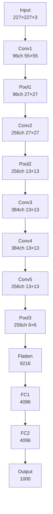

# AlexNet - 딥러닝 혁명을 일으킨 CNN

## 개요

AlexNet은 2012년 Alex Krizhevsky, Ilya Sutskever, Geoffrey Hinton에 의해 개발된 합성곱 신경망입니다. ImageNet Large Scale Visual Recognition Challenge (ILSVRC) 2012에서 압도적인 성능(Top-5 에러율 15.3%)으로 우승하며 딥러닝 붐을 일으킨 역사적인 모델입니다.

## AlexNet의 혁신적 특징
-
- **입력 크기**: 227×227×3 컬러 이미지
- **출력**: 1000개 클래스 (ImageNet)
- **활성화 함수**: ReLU 최초 도입
- **정규화**: Dropout, Local Response Normalization (LRN) 사용
- **하드웨어**: GPU 병렬 처리 활용
- **총 파라미터**: 약 6천만개

## AlexNet vs LeNet 비교

| 특징 | LeNet (1998) | AlexNet (2012) |
|------|-------------|----------------|
| 입력 크기 | 32×32×1 | 227×227×3 |
| 깊이 | 7레이어 | 8레이어 |
| 파라미터 | ~60K | ~60M |
| 활성화 함수 | Sigmoid/Tanh | ReLU |
| 정규화 | 없음 | Dropout, LRN |
| 하드웨어 | CPU | GPU |

## AlexNet 구조

### 전체 네트워크 구조 다이어그램



### 레이어별 상세 구조

```mermaid
graph TD
    subgraph "Feature Extraction"
    A[Input Layer<br/>227×227×3] --> B[Conv1<br/>Kernel: 11×11, Stride: 4<br/>Filters: 96<br/>Output: 55×55×96]
        B --> B1[ReLU + LRN]
        B1 --> C[Max Pool1<br/>Pool: 3×3, Stride: 2<br/>Output: 27×27×96]
        
        C --> D[Conv2<br/>Kernel: 5×5, Stride: 1, Pad: 2<br/>Filters: 256<br/>Output: 27×27×256]
        D --> D1[ReLU + LRN]
        D1 --> E[Max Pool2<br/>Pool: 3×3, Stride: 2<br/>Output: 13×13×256]
        
        E --> F[Conv3<br/>Kernel: 3×3, Stride: 1, Pad: 1<br/>Filters: 384<br/>Output: 13×13×384]
        F --> F1[ReLU]
        
        F1 --> G[Conv4<br/>Kernel: 3×3, Stride: 1, Pad: 1<br/>Filters: 384<br/>Output: 13×13×384]
        G --> G1[ReLU]
        
        G1 --> H[Conv5<br/>Kernel: 3×3, Stride: 1, Pad: 1<br/>Filters: 256<br/>Output: 13×13×256]
        H --> H1[ReLU]
        H1 --> I[Max Pool3<br/>Pool: 3×3, Stride: 2<br/>Output: 6×6×256]
    end
    
    subgraph "Classification"
        I --> J[Flatten<br/>Output: 9216]
        J --> K[FC1<br/>4096 + Dropout]
        K --> K1[ReLU]
        K1 --> L[FC2<br/>4096 + Dropout]
        L --> L1[ReLU]
        L1 --> M[Output<br/>1000 + Softmax]
    end
```



## 각 레이어 상세 설명

### 1. 입력 레이어 (Input Layer)
- **크기**: 227×227×3
- **설명**: RGB 컬러 이미지를 입력으로 받습니다.

### 2. 첫 번째 합성곱 레이어 (Conv1)
- **필터 크기**: 11×11
- **필터 개수**: 96개
- **스트라이드**: 4
- **패딩**: 없음
- **출력 크기**: 55×55×96
- **계산**: (227-11)/4 + 1 = 55
- **특징**: 큰 필터로 저수준 특성 추출

### 3. 첫 번째 풀링 레이어 (Pool1)
- **타입**: Max Pooling
- **풀 크기**: 3×3
- **스트라이드**: 2
- **출력 크기**: 27×27×96

### 4. 두 번째 합성곱 레이어 (Conv2)
- **필터 크기**: 5×5
- **필터 개수**: 256개
- **스트라이드**: 1
- **패딩**: 2
- **출력 크기**: 27×27×256

### 5. 두 번째 풀링 레이어 (Pool2)
- **타입**: Max Pooling
- **풀 크기**: 3×3
- **스트라이드**: 2
- **출력 크기**: 13×13×256

### 6. 세 번째 합성곱 레이어 (Conv3)
- **필터 크기**: 3×3
- **필터 개수**: 384개
- **스트라이드**: 1
- **패딩**: 1
- **출력 크기**: 13×13×384

### 7. 네 번째 합성곱 레이어 (Conv4)
- **필터 크기**: 3×3
- **필터 개수**: 384개
- **스트라이드**: 1
- **패딩**: 1
- **출력 크기**: 13×13×384

### 8. 다섯 번째 합성곱 레이어 (Conv5)
- **필터 크기**: 3×3
- **필터 개수**: 256개
- **스트라이드**: 1
- **패딩**: 1
- **출력 크기**: 13×13×256

### 9. 세 번째 풀링 레이어 (Pool3)
- **타입**: Max Pooling
- **풀 크기**: 3×3
- **스트라이드**: 2
- **출력 크기**: 6×6×256

### 10. 완전 연결 레이어들 (Fully Connected)
- **FC1**: 9216 → 4096 뉴런 (Dropout 0.5)
- **FC2**: 4096 → 4096 뉴런 (Dropout 0.5)
- **출력층**: 4096 → 1000 뉴런 (ImageNet 클래스)

## PyTorch 구현 예제

```python
import torch
import torch.nn as nn

class AlexNet(nn.Module):
    def __init__(self, num_classes=1000):
        super(AlexNet, self).__init__()
        
        # 특성 추출 부분
        self.features = nn.Sequential(
            # Conv1
            nn.Conv2d(3, 96, kernel_size=11, stride=4, padding=0),
            nn.ReLU(inplace=True),
            nn.LocalResponseNorm(size=5, alpha=0.0001, beta=0.75, k=2),
            nn.MaxPool2d(kernel_size=3, stride=2),
            
            # Conv2
            nn.Conv2d(96, 256, kernel_size=5, stride=1, padding=2),
            nn.ReLU(inplace=True),
            nn.LocalResponseNorm(size=5, alpha=0.0001, beta=0.75, k=2),
            nn.MaxPool2d(kernel_size=3, stride=2),
            
            # Conv3
            nn.Conv2d(256, 384, kernel_size=3, stride=1, padding=1),
            nn.ReLU(inplace=True),
            
            # Conv4
            nn.Conv2d(384, 384, kernel_size=3, stride=1, padding=1),
            nn.ReLU(inplace=True),
            
            # Conv5
            nn.Conv2d(384, 256, kernel_size=3, stride=1, padding=1),
            nn.ReLU(inplace=True),
            nn.MaxPool2d(kernel_size=3, stride=2),
            # 고정된 Flatten 크기를 보장하기 위해 추가 (입력 크기와 무관)
            nn.AdaptiveAvgPool2d((6, 6)),
        )
        
        # 분류 부분
        self.classifier = nn.Sequential(
            nn.Dropout(0.5),
            nn.Linear(256 * 6 * 6, 4096),
            nn.ReLU(inplace=True),
            nn.Dropout(0.5),
            nn.Linear(4096, 4096),
            nn.ReLU(inplace=True),
            nn.Linear(4096, num_classes),
        )
    
    def forward(self, x):
        x = self.features(x)
        x = torch.flatten(x, 1)
        x = self.classifier(x)
        return x

# 모델 초기화
model = AlexNet(num_classes=1000)
print(model)

# 모델 파라미터 수 확인
total_params = sum(p.numel() for p in model.parameters())
trainable_params = sum(p.numel() for p in model.parameters() if p.requires_grad)
print(f"총 파라미터 수: {total_params:,}")
print(f"학습 가능한 파라미터 수: {trainable_params:,}")

# 입력 텐서로 테스트
# AlexNet 원본 크기(227)를 사용하거나 AdaptiveAvgPool 덕분에 224도 동작합니다. 여기서는 227로 테스트합니다.
x = torch.randn(1, 3, 227, 227)
output = model(x)
print(f"출력 크기: {output.shape}")
```

## 간단한 학습 예제 (CIFAR-10)

```python
import torch
import torch.nn as nn
import torch.optim as optim
from torchvision import datasets, transforms
from torch.utils.data import DataLoader

# AlexNet을 CIFAR-10에 맞게 수정
class AlexNetCIFAR(nn.Module):
    def __init__(self, num_classes=10):
        super(AlexNetCIFAR, self).__init__()
        
        self.features = nn.Sequential(
            # Conv1 (CIFAR-10에 맞게 조정)
            nn.Conv2d(3, 64, kernel_size=3, stride=1, padding=1),
            nn.ReLU(inplace=True),
            nn.MaxPool2d(kernel_size=2, stride=2),
            
            # Conv2
            nn.Conv2d(64, 192, kernel_size=3, stride=1, padding=1),
            nn.ReLU(inplace=True),
            nn.MaxPool2d(kernel_size=2, stride=2),
            
            # Conv3
            nn.Conv2d(192, 384, kernel_size=3, stride=1, padding=1),
            nn.ReLU(inplace=True),
            
            # Conv4
            nn.Conv2d(384, 256, kernel_size=3, stride=1, padding=1),
            nn.ReLU(inplace=True),
            
            # Conv5
            nn.Conv2d(256, 256, kernel_size=3, stride=1, padding=1),
            nn.ReLU(inplace=True),
            nn.MaxPool2d(kernel_size=2, stride=2),
        )
        
        self.classifier = nn.Sequential(
            nn.Dropout(0.5),
            nn.Linear(256 * 4 * 4, 1024),
            nn.ReLU(inplace=True),
            nn.Dropout(0.5),
            nn.Linear(1024, 512),
            nn.ReLU(inplace=True),
            nn.Linear(512, num_classes),
        )
    
    def forward(self, x):
        x = self.features(x)
        x = torch.flatten(x, 1)
        x = self.classifier(x)
        return x

# 데이터 전처리
transform_train = transforms.Compose([
    transforms.RandomHorizontalFlip(p=0.5),
    transforms.RandomRotation(10),
    transforms.ToTensor(),
    transforms.Normalize((0.4914, 0.4822, 0.4465), (0.2023, 0.1994, 0.2010))
])

transform_test = transforms.Compose([
    transforms.ToTensor(),
    transforms.Normalize((0.4914, 0.4822, 0.4465), (0.2023, 0.1994, 0.2010))
])

# CIFAR-10 데이터셋 로드
train_dataset = datasets.CIFAR10('./data', train=True, download=True, transform=transform_train)
test_dataset = datasets.CIFAR10('./data', train=False, transform=transform_test)

train_loader = DataLoader(train_dataset, batch_size=128, shuffle=True, num_workers=2)
test_loader = DataLoader(test_dataset, batch_size=100, shuffle=False, num_workers=2)

# 모델, 손실함수, 옵티마이저 초기화
device = torch.device('cuda' if torch.cuda.is_available() else 'cpu')
model = AlexNetCIFAR(num_classes=10).to(device)
criterion = nn.CrossEntropyLoss()
optimizer = optim.SGD(model.parameters(), lr=0.01, momentum=0.9, weight_decay=5e-4)
scheduler = optim.lr_scheduler.StepLR(optimizer, step_size=30, gamma=0.1)

# 학습 함수
def train(epoch):
    model.train()
    running_loss = 0.0
    correct = 0
    total = 0
    
    for batch_idx, (data, target) in enumerate(train_loader):
        data, target = data.to(device), target.to(device)
        
        optimizer.zero_grad()
        output = model(data)
        loss = criterion(output, target)
        loss.backward()
        optimizer.step()
        
        running_loss += loss.item()
        _, predicted = output.max(1)
        total += target.size(0)
        correct += predicted.eq(target).sum().item()
        
        if batch_idx % 100 == 0:
            print(f'Epoch {epoch}, Batch {batch_idx}, '
                  f'Loss: {running_loss/(batch_idx+1):.4f}, '
                  f'Acc: {100.*correct/total:.2f}%')

# 테스트 함수
def test():
    model.eval()
    test_loss = 0
    correct = 0
    total = 0
    
    with torch.no_grad():
        for data, target in test_loader:
            data, target = data.to(device), target.to(device)
            output = model(data)
            test_loss += criterion(output, target).item()
            _, predicted = output.max(1)
            total += target.size(0)
            correct += predicted.eq(target).sum().item()
    
    test_loss /= len(test_loader)
    accuracy = 100. * correct / total
    print(f'Test Loss: {test_loss:.4f}, Test Accuracy: {accuracy:.2f}%')
    return accuracy

# 학습 실행
best_acc = 0
for epoch in range(1, 51):
    train(epoch)
    acc = test()
    scheduler.step()
    
    if acc > best_acc:
        best_acc = acc
        torch.save(model.state_dict(), 'alexnet_cifar10_best.pth')
        
print(f'Best Test Accuracy: {best_acc:.2f}%')
```

## AlexNet의 혁신적 기술들

### 1. ReLU 활성화 함수
```python
# 기존: Sigmoid/Tanh
def sigmoid(x):
    return 1 / (1 + torch.exp(-x))

# AlexNet: ReLU
def relu(x):
    return torch.max(0, x)
```

### 2. Dropout 정규화
```python
# 학습 시
x = F.dropout(x, p=0.5, training=True)

# 추론 시
x = F.dropout(x, p=0.5, training=False)  # 실제로는 아무것도 하지 않음
```

### 3. Local Response Normalization (LRN)
```python
# PyTorch에서 LRN 사용
lrn = nn.LocalResponseNorm(size=5, alpha=0.0001, beta=0.75, k=2)
x = lrn(x)
```

### 4. Data Augmentation
```python
transform_augment = transforms.Compose([
    transforms.RandomHorizontalFlip(),
    transforms.RandomCrop(227, padding=4),
    transforms.ColorJitter(brightness=0.2, contrast=0.2),
    transforms.ToTensor(),
    transforms.Normalize(mean=[0.485, 0.456, 0.406], 
                        std=[0.229, 0.224, 0.225])
])
```

## AlexNet의 의의와 영향

### 혁신적 기여
- **딥러닝 재부상**: ImageNet 2012 우승으로 딥러닝 붐 촉발
- **GPU 활용**: 대규모 CNN 학습을 위한 GPU 병렬 처리 도입
- **ReLU 도입**: Gradient Vanishing 문제 해결
- **Dropout**: 오버피팅 방지를 위한 정규화 기법
- **Data Augmentation**: 데이터 증강을 통한 일반화 성능 향상

### 한계점
- **큰 필터 크기**: 11×11 필터는 계산 비효율적
- **LRN**: Batch Normalization으로 대체됨
- **깊이 제한**: 8레이어로 제한적 (현재 기준)

## 현대 CNN과의 비교

| 특징 | AlexNet (2012) | 현대 CNN |
|------|---------------|----------|
| 깊이 | 8레이어 | 수백 레이어 |
| 정규화 | LRN, Dropout | Batch/Layer Norm |
| 연결 방식 | Sequential | Skip Connection |
| 최적화 | SGD | Adam, AdamW |
| 구조 | 단순 순차 | ResNet, Transformer |

## 결론

AlexNet은 현대 딥러닝의 출발점이 된 역사적인 모델입니다. 비록 현재 기준으로는 단순한 구조이지만, ReLU, Dropout, GPU 활용 등 현재까지도 사용되는 핵심 기술들을 도입했습니다. CNN의 발전사를 이해하고 딥러닝의 기초를 다지는 데 필수적인 모델입니다.

---
