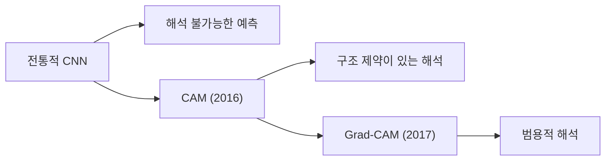
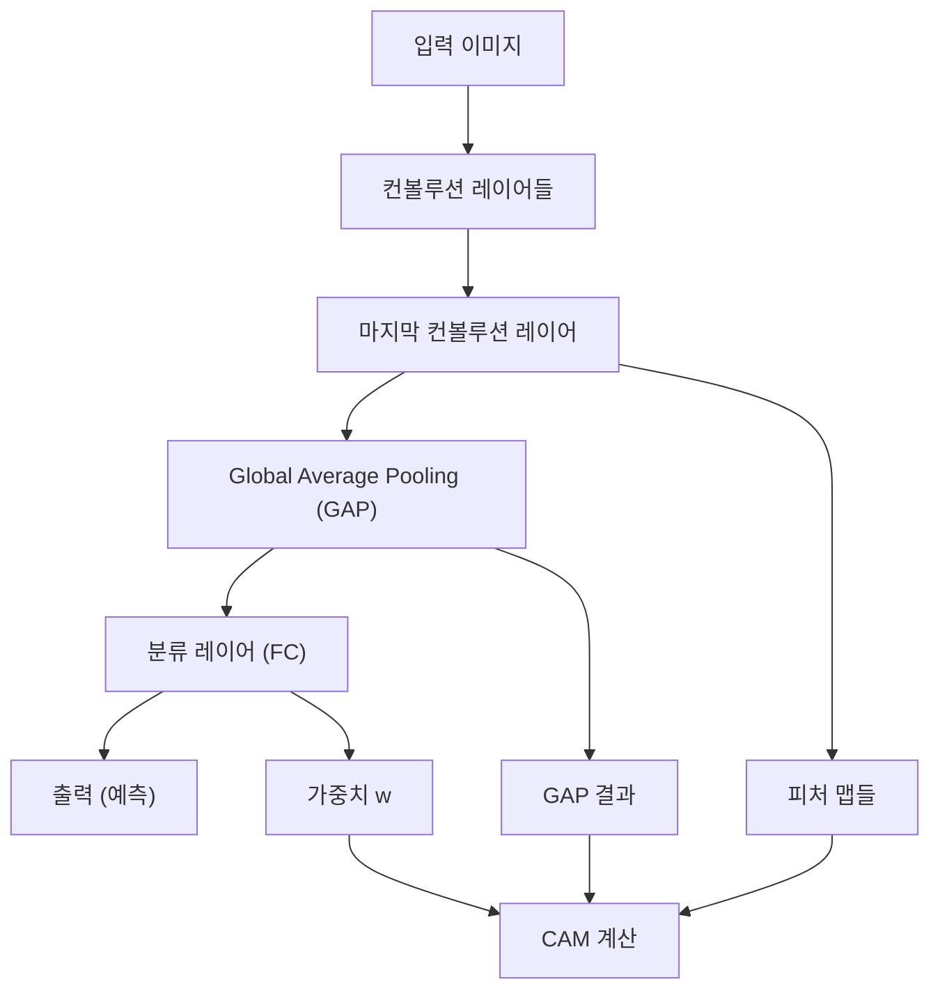
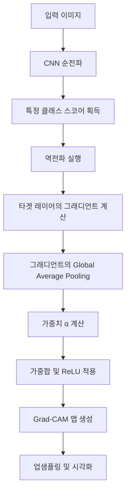
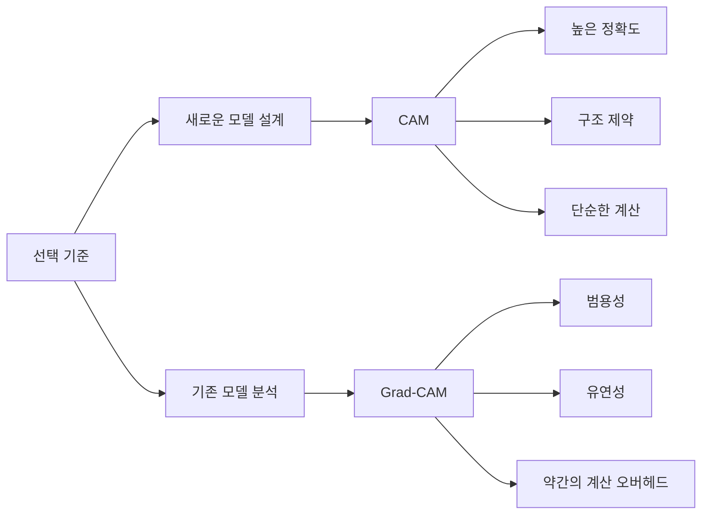

# CAM & Grad-CAM

## 목차

1. [개요](#1-개요)<br/>
   1.1. [시각적 해석 가능성의 중요성](#11-시각적-해석-가능성의-중요성)<br/>
   1.2. [CNN 기반 해석 기법의 발전](#12-cnn-기반-해석-기법의-발전)<br/>

2. [CAM (Class Activation Mapping)](#2-cam-class-activation-mapping)<br/>
   2.1. [기본 개념 및 원리](#21-기본-개념-및-원리)<br/>
   2.2. [수학적 정의](#22-수학적-정의)<br/>
   2.3. [구현 요구사항](#23-구현-요구사항)<br/>
   2.4. [장점과 한계](#24-장점과-한계)

3. [Grad-CAM (Gradient-weighted Class Activation Mapping)](#3-grad-cam-gradient-weighted-class-activation-mapping)<br/>
   3.1. [기본 개념 및 동기](#31-기본-개념-및-동기)<br/>
   3.2. [수학적 정의](#32-수학적-정의)<br/>
   3.3. [알고리즘 과정](#33-알고리즘-과정)<br/>
   3.4. [장점과 한계](#34-장점과-한계)<br/>

4. [비교 분석](#4-비교-분석)<br/>
   4.1. [핵심 차이점](#41-핵심-차이점)<br/>
   4.2. [성능 및 적용성](#42-성능-및-적용성)<br/>

5. [실용적 응용](#5-실용적-응용)<br/>
   5.1. [의료 영상 분석](#51-의료-영상-분석)<br/>
   5.2. [자율 주행 시스템](#52-자율-주행-시스템)<br/>
   5.3. [품질 검사 자동화](#53-품질-검사-자동화)

6. [구현 예제](#6-구현-예제)<br/>
   6.1. [CAM 구현](#61-cam-구현)<br/>
   6.2. [Grad-CAM 구현](#62-grad-cam-구현)

7. [용어 목록](#7-용어-목록)

---

## 1. 개요

### 1.1. 시각적 해석 가능성의 중요성

딥러닝 모델, 특히 CNN(Convolutional Neural Network)은 뛰어난 성능을 보이지만 "블랙박스" 특성으로 인해 모델의 의사결정 과정을 이해하기 어렵다는 한계가 있습니다. 이러한 문제를 해결하기 위해 모델이 입력 이미지의 어떤 영역에 주목하는지 시각화하는 기법들이 개발되었습니다.

### 1.2. CNN 기반 해석 기법의 발전



---

## 2. CAM (Class Activation Mapping)

### 2.1. 기본 개념 및 원리

CAM(Class Activation Mapping)은 CNN 모델의 마지막 컨볼루션 레이어(convolutional layer)를 활용하여 모델이 주목하는 영역을 시각화하는 기법입니다. 특정 클래스의 액티베이션(activation) 맵을 생성하여 모델의 예측 근거를 직관적으로 이해할 수 있도록 합니다.

### 2.2. 수학적 정의

CAM의 핵심은 Global Average Pooling(GAP)과 선형 결합을 통한 클래스별 액티베이션 맵 생성입니다.

주어진 클래스 $c$에 대한 CAM은 다음과 같이 계산됩니다:

$$M_c(x, y) = \sum_k w_k^c \cdot f_k(x, y)$$

여기서:
- $M_c(x, y)$: 클래스 $c$에 대한 위치 $(x, y)$의 액티베이션 값
- $w_k^c$: 클래스 $c$와 피처 맵 $k$에 대한 가중치
- $f_k(x, y)$: 마지막 컨볼루션 레이어의 $k$번째 피처 맵의 $(x, y)$ 위치 값

### 2.3. 구현 요구사항

CAM을 적용하기 위해서는 다음 아키텍처(architecture) 조건이 필요합니다:



### 2.4. 장점과 한계

**장점:**
- 단순한 구조 변경(GAP 도입)만으로 해석 가능
- 모델의 결정 과정에서 어떤 영역이 기여했는지 직관적으로 확인 가능
- 계산 복잡도가 상대적으로 단순

**제한 사항:**
- 네트워크 구조에 GAP가 반드시 포함되어야 함
- 완전 연결층(Fully Connected Layer)을 사용하는 기존 모델에는 바로 적용하기 어려움
- 모델 아키텍처 변경이 불가피하여 레거시(legacy) 모델 활용 제한

---

## 3. Grad-CAM (Gradient-weighted Class Activation Mapping)

### 3.1. 기본 개념 및 동기

Grad-CAM은 그래디언트(gradient) 정보를 활용하여 모델이 특정 예측을 할 때 중요하게 본 영역을 강조하는 기법입니다. 기존 CAM의 구조적 제약을 해결하여 사전 학습된 다양한 CNN 모델에도 적용 가능합니다.

### 3.2. 수학적 정의

Grad-CAM은 역전파(backpropagation)를 통해 얻은 그래디언트의 공간적 평균값을 가중치로 활용합니다.

클래스 $c$에 대한 Grad-CAM은 다음과 같이 계산됩니다:

$$\alpha_k^c = \frac{1}{Z} \sum_i \sum_j \frac{\partial y^c}{\partial A_{ij}^k}$$

$$L_{Grad-CAM}^c = ReLU\left(\sum_k \alpha_k^c A^k\right)$$

여기서:
- $\alpha_k^c$: 클래스 $c$에 대한 피처 맵 $k$의 중요도
- $y^c$: 클래스 $c$에 대한 스코어
- $A^k$: $k$번째 피처 맵
- $Z$: 정규화 상수(피처 맵의 크기)
- $ReLU$: 양수 값만 유지하는 활성화 함수

### 3.3. 알고리즘 과정



### 3.4. 장점과 한계

**장점:**
- **모델 구조 무관성**: 마지막 컨볼루션 레이어만 있으면 적용 가능
- **직관적 시각화**: 클래스 예측에 기여한 영역을 명확히 표시
- **디버깅 도구**: 예측 오류나 편향(bias) 식별에 활용 가능
- **범용성**: 다양한 CNN 아키텍처(ResNet, VGG, Inception 등)에 적용

**제한 사항:**
- **모델 출력 의존성**: 역전파를 통한 그래디언트 계산으로 인해 모델의 출력 스케일이나 비선형 활성화 함수 특성에 영향받음
- **노이즈 민감성**: 그래디언트에 포함된 노이즈로 인해 시각화 결과가 불안정할 수 있음
- **양의 기여만 고려**: ReLU 적용으로 인해 네거티브(negative) 기여도는 제거되어 억제 효과에 대한 정보 손실

---

## 4. 비교 분석

### 4.1. 핵심 차이점

| 항목 | CAM | Grad-CAM |
|------|-----|----------|
| **구조 의존성** | GAP 등 특정 구조(마지막에 GAP를 적용한 모델)에 한정됨 | 네트워크 구조에 구애받지 않음 |
| **해석 방법** | 학습된 가중치와 피처 맵의 선형 조합 | 역전파로 얻은 그래디언트의 공간적 평균값을 가중치로 활용 |
| **적용 범위** | 제한적: 전결합층 대신 GAP가 사용된 모델에서만 적용 가능 | 범용적: 다양한 CNN 아키텍처 및 태스크에 적용 가능 |
| **계산 복잡도** | 상대적으로 단순 | 역전파를 추가로 계산해야 하므로 약간의 추가 연산 필요 |

### 4.2. 성능 및 적용성



---

## 5. 실용적 응용

### 5.1. 의료 영상 분석

의료 영상에서 Grad-CAM은 진단 근거를 시각화하여 의료진의 판단을 보조합니다:
- **방사선학**: X-ray, CT, MRI 이미지에서 병변 영역 하이라이팅(highlighting)
- **병리학**: 조직 슬라이드에서 암세포 영역 식별
- **안과학**: 망막 이미지에서 질환 부위 탐지

### 5.2. 자율 주행 시스템

자율 주행에서는 모델의 의사결정 투명성이 안전과 직결됩니다:
- **객체 탐지**: 보행자, 차량, 신호등 인식 근거 시각화
- **차선 인식**: 차선 검출 알고리즘의 집중 영역 확인
- **위험 상황 판단**: 긴급 상황에서의 모델 반응 분석

### 5.3. 품질 검사 자동화

제조업에서 결함 탐지 시스템의 신뢰성 향상:
- **반도체 검사**: 웨이퍼 표면 결함 위치 정확도 검증
- **식품 검사**: 이물질 탐지 영역의 정확성 확인
- **텍스타일**: 직물 품질 평가에서 결함 영역 식별

---

## 6. 구현 예제

### 6.1. CAM 구현

```python
import torch
import torch.nn as nn
import torch.nn.functional as F
import numpy as np

class CAM_Model(nn.Module):
    def __init__(self, num_classes):
        super(CAM_Model, self).__init__()
        self.features = nn.Sequential(
            # 컨볼루션 레이어들
            nn.Conv2d(3, 64, 3, padding=1),
            nn.ReLU(),
            # ... 추가 레이어들
        )
        self.gap = nn.AdaptiveAvgPool2d(1)  # Global Average Pooling
        self.classifier = nn.Linear(feature_dim, num_classes)
    
    def forward(self, x):
        feature_maps = self.features(x)  # 피처 맵 추출
        gap_output = self.gap(feature_maps)  # GAP 적용
        gap_output = gap_output.view(gap_output.size(0), -1)
        output = self.classifier(gap_output)
        return output, feature_maps

def generate_cam(feature_maps, weights, class_idx):
    """CAM 생성 함수"""
    cam = np.zeros(feature_maps.shape[2:])  # H x W
    for i, w in enumerate(weights[class_idx]):
        cam += w * feature_maps[0, i, :, :]  # 가중합
    return cam
```

### 6.2. Grad-CAM 구현

```python
class GradCAM:
    def __init__(self, model, target_layer):
        self.model = model
        self.target_layer = target_layer
        self.gradients = None
        self.activations = None
        
        # 훅 등록
        self.target_layer.register_forward_hook(self.save_activation)
        self.target_layer.register_backward_hook(self.save_gradient)
    
    def save_activation(self, module, input, output):
        self.activations = output
    
    def save_gradient(self, module, grad_input, grad_output):
        self.gradients = grad_output[0]
    
    def generate_cam(self, input_image, class_idx):
        # 순전파
        output = self.model(input_image)
        
        # 역전파
        self.model.zero_grad()
        class_score = output[:, class_idx].sum()
        class_score.backward(retain_graph=True)
        
        # 가중치 계산 (그래디언트의 공간적 평균)
        weights = torch.mean(self.gradients, dim=[2, 3])
        
        # Grad-CAM 계산
        cam = torch.zeros(self.activations.shape[2:])
        for i, w in enumerate(weights[0]):
            cam += w * self.activations[0, i, :, :]
        
        # ReLU 적용
        cam = F.relu(cam)
        
        return cam.detach().numpy()

# 사용 예제
model = YourCNNModel()
gradcam = GradCAM(model, target_layer=model.features[-1])
cam = gradcam.generate_cam(input_tensor, class_idx=predicted_class)
```

---

## 7. 용어 목록

| 용어 | 영문 | 발음 | 설명 |
|------|------|------|------|
| **액티베이션** | Activation | 액티베이션 | 신경망에서 뉴런의 출력값 |
| **컨볼루션** | Convolution | 컨볼루션 | 합성곱 연산을 통한 특징 추출 |
| **그래디언트** | Gradient | 그래디언트 | 손실함수의 기울기, 역전파 시 사용 |
| **백프로퍼게이션** | Backpropagation | 백프로퍼게이션 | 역전파 알고리즘 |
| **피처 맵** | Feature Map | 피처 맵 | 컨볼루션 레이어의 출력 결과 |
| **글로벌 애버리지 풀링** | Global Average Pooling | 글로벌 애버리지 풀링 | 전체 피처 맵의 평균값을 구하는 풀링 방법 |
| **아키텍처** | Architecture | 아키텍처 | 신경망의 구조와 설계 |
| **하이퍼파라미터** | Hyperparameter | 하이퍼파라미터 | 학습 전에 설정하는 모델 매개변수 |
| **옵티마이저** | Optimizer | 옵티마이저 | 가중치 업데이트를 위한 최적화 알고리즘 |
| **렉티파이어** | Rectifier (ReLU) | 렉티파이어 | 음수를 0으로 만드는 활성화 함수 |
| **리셉티브 필드** | Receptive Field | 리셉티브 필드 | 하나의 뉴런이 영향을 받는 입력 영역의 크기 |
| **엔트로피** | Entropy | 엔트로피 | 정보량이나 불확실성의 측도 |
| **서포트 벡터** | Support Vector | 서포트 벡터 | 결정 경계에 가장 가까운 데이터 포인트 |
| **임베딩** | Embedding | 임베딩 | 고차원 데이터를 저차원 벡터로 표현 |
| **어텐션** | Attention | 어텐션 | 입력의 중요한 부분에 집중하는 메커니즘 |

---

**참고문헌:**
- Zhou, B., Khosla, A., Lapedriza, A., Oliva, A., & Torralba, A. (2016). Learning deep features for discriminative localization. CVPR.
- Selvaraju, R. R., Cogswell, M., Das, A., Vedantam, R., Parikh, D., & Batra, D. (2017). Grad-CAM: Visual explanations from deep networks via gradient-based localization. ICCV.