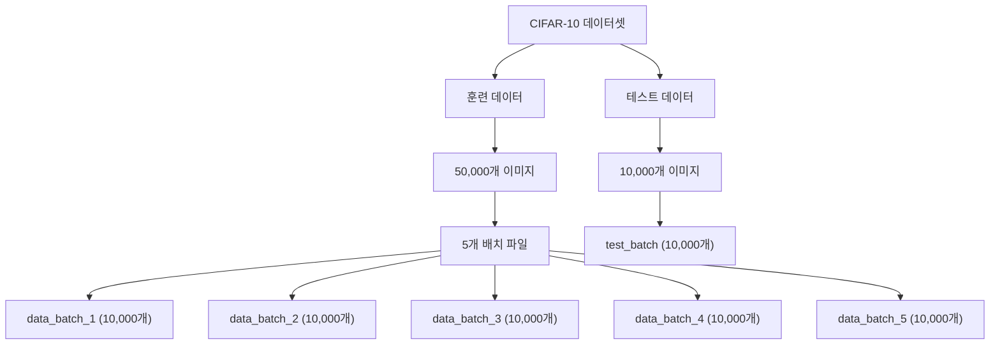
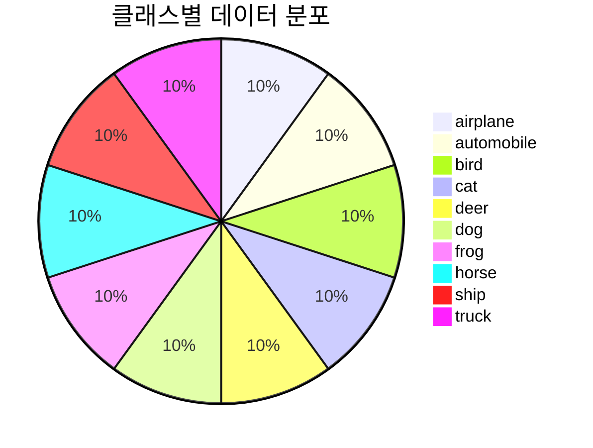
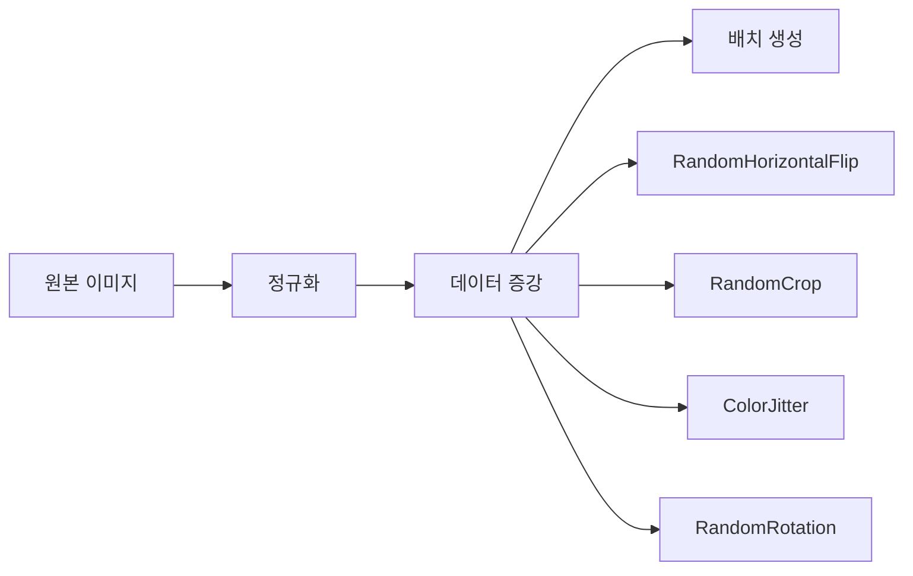

# CIFAR-10 데이터셋

## 목차
- [CIFAR-10 데이터셋](#cifar-10-데이터셋)
  - [목차](#목차)
  - [CIFAR-10 개요](#cifar-10-개요)
    - [주요 특징](#주요-특징)
  - [데이터셋 특성](#데이터셋-특성)
    - [이미지 규격](#이미지-규격)
    - [통계적 특성](#통계적-특성)
  - [데이터 구조](#데이터-구조)
  - [클래스 분포](#클래스-분포)
  - [데이터 로딩 방법](#데이터-로딩-방법)
    - [1. PyTorch를 사용한 데이터 로딩](#1-pytorch를-사용한-데이터-로딩)
    - [2. TensorFlow/Keras를 사용한 데이터 로딩](#2-tensorflowkeras를-사용한-데이터-로딩)
    - [3. 원본 바이너리 파일에서 직접 로딩](#3-원본-바이너리-파일에서-직접-로딩)
  - [시각화 예제](#시각화-예제)
  - [딥러닝에서의 활용](#딥러닝에서의-활용)
    - [데이터 전처리 전략](#데이터-전처리-전략)
    - [일반적인 성능 벤치마크](#일반적인-성능-벤치마크)
    - [학습 시 고려사항](#학습-시-고려사항)
    - [추천 데이터 증강 기법](#추천-데이터-증강-기법)

## CIFAR-10 개요

CIFAR-10(Canadian Institute For Advanced Research-10)은 컴퓨터 비전 분야에서 가장 널리 사용되는 벤치마크 데이터셋 중 하나입니다. Alex Krizhevsky, Vinod Nair, Geoffrey Hinton에 의해 2009년에 수집되었으며, 딥러닝 모델의 성능을 평가하고 비교하는 표준 데이터셋으로 자리잡았습니다.

### 주요 특징
- **10개 클래스**의 자연 이미지 분류 데이터셋
- **60,000개**의 32×32 픽셀 컬러 이미지
- 훈련용 50,000개, 테스트용 10,000개로 구성
- 각 클래스당 정확히 6,000개의 이미지

## 데이터셋 특성

### 이미지 규격
- **해상도**: 32 × 32 픽셀
- **채널**: RGB 3채널
- **데이터 타입**: uint8 (0-255 범위)
- **총 픽셀 수**: 3,072개 (32 × 32 × 3)

### 통계적 특성
각 채널별 정규화를 위한 통계값:

$$\text{Mean} = \begin{bmatrix} 0.4914 \\ 0.4822 \\ 0.4465 \end{bmatrix}, \quad \text{Std} = \begin{bmatrix} 0.2470 \\ 0.2435 \\ 0.2616 \end{bmatrix}$$

정규화 공식:
$$x_{\text{normalized}} = \frac{x - \mu}{\sigma}$$

여기서 $x$는 원본 픽셀값, $\mu$는 평균, $\sigma$는 표준편차입니다.

## 데이터 구조



## 클래스 분포

CIFAR-10은 다음 10개 클래스로 구성되어 있습니다:

| 클래스 ID | 클래스 명 | 한글명 | 이미지 수 |
|-----------|-----------|--------|-----------|
| 0 | airplane | 비행기 | 6,000 |
| 1 | automobile | 자동차 | 6,000 |
| 2 | bird | 새 | 6,000 |
| 3 | cat | 고양이 | 6,000 |
| 4 | deer | 사슴 | 6,000 |
| 5 | dog | 개 | 6,000 |
| 6 | frog | 개구리 | 6,000 |
| 7 | horse | 말 | 6,000 |
| 8 | ship | 배 | 6,000 |
| 9 | truck | 트럭 | 6,000 |



## 데이터 로딩 방법

### 1. PyTorch를 사용한 데이터 로딩

```python
import torch
import torchvision
import torchvision.transforms as transforms
import matplotlib.pyplot as plt
import numpy as np

# 데이터 변환 정의
transform = transforms.Compose([
    transforms.ToTensor(),
    transforms.Normalize((0.4914, 0.4822, 0.4465), 
                        (0.2470, 0.2435, 0.2616))
])

# CIFAR-10 데이터셋 다운로드 및 로딩
trainset = torchvision.datasets.CIFAR10(
    root='./data', 
    train=True,
    download=True, 
    transform=transform
)

testset = torchvision.datasets.CIFAR10(
    root='./data', 
    train=False,
    download=True, 
    transform=transform
)

# 데이터 로더 생성
trainloader = torch.utils.data.DataLoader(
    trainset, 
    batch_size=32,
    shuffle=True, 
    num_workers=2
)

testloader = torch.utils.data.DataLoader(
    testset, 
    batch_size=32,
    shuffle=False, 
    num_workers=2
)

# 데이터셋 정보 출력
print(f"훈련 데이터 크기: {len(trainset)}")
print(f"테스트 데이터 크기: {len(testset)}")
print(f"이미지 형태: {trainset[0][0].shape}")
print(f"클래스 수: {len(trainset.classes)}")
```

### 2. TensorFlow/Keras를 사용한 데이터 로딩

```python
import tensorflow as tf
from tensorflow import keras
import numpy as np
import matplotlib.pyplot as plt

# CIFAR-10 데이터셋 로딩
(x_train, y_train), (x_test, y_test) = keras.datasets.cifar10.load_data()

# 데이터 정보 출력
print(f"훈련 이미지 형태: {x_train.shape}")
print(f"훈련 레이블 형태: {y_train.shape}")
print(f"테스트 이미지 형태: {x_test.shape}")
print(f"테스트 레이블 형태: {y_test.shape}")

# 픽셀값을 0-1 범위로 정규화
x_train = x_train.astype('float32') / 255.0
x_test = x_test.astype('float32') / 255.0

# 클래스 이름 정의
class_names = ['airplane', 'automobile', 'bird', 'cat', 'deer',
               'dog', 'frog', 'horse', 'ship', 'truck']

print(f"클래스: {class_names}")
```

### 3. 원본 바이너리 파일에서 직접 로딩

```python
import pickle
import numpy as np

def load_cifar10_batch(file):
    """CIFAR-10 배치 파일을 로딩하는 함수"""
    with open(file, 'rb') as fo:
        dict = pickle.load(fo, encoding='bytes')
    return dict

def load_cifar10_data(data_dir):
    """전체 CIFAR-10 데이터를 로딩하는 함수"""
    # 훈련 데이터 로딩
    x_train = []
    y_train = []
    
    for i in range(1, 6):
        batch = load_cifar10_batch(f'{data_dir}/data_batch_{i}')
        x_train.append(batch[b'data'])
        y_train.extend(batch[b'labels'])
    
    x_train = np.concatenate(x_train)
    x_train = x_train.reshape(50000, 3, 32, 32).transpose(0, 2, 3, 1)
    y_train = np.array(y_train)
    
    # 테스트 데이터 로딩
    test_batch = load_cifar10_batch(f'{data_dir}/test_batch')
    x_test = test_batch[b'data']
    x_test = x_test.reshape(10000, 3, 32, 32).transpose(0, 2, 3, 1)
    y_test = np.array(test_batch[b'labels'])
    
    return (x_train, y_train), (x_test, y_test)

# 사용 예시
# (x_train, y_train), (x_test, y_test) = load_cifar10_data('./cifar-10-batches-py')
```

## 시각화 예제

```python
import matplotlib.pyplot as plt
import numpy as np

def show_cifar10_samples(x_data, y_data, class_names, num_samples=10):
    """CIFAR-10 샘플 이미지들을 시각화"""
    plt.figure(figsize=(15, 6))
    
    for i in range(num_samples):
        plt.subplot(2, 5, i + 1)
        
        # 이미지가 정규화된 경우 역정규화
        img = x_data[i]
        if img.max() <= 1.0:
            img = img * 255
        img = img.astype(np.uint8)
        
        plt.imshow(img)
        plt.title(f'{class_names[y_data[i]]}')
        plt.axis('off')
    
    plt.tight_layout()
    plt.show()

# 클래스별 샘플 보기
def show_class_samples(x_data, y_data, class_names):
    """각 클래스별로 샘플 이미지 하나씩 표시"""
    plt.figure(figsize=(12, 6))
    
    for class_id in range(10):
        # 해당 클래스의 첫 번째 이미지 찾기
        indices = np.where(y_data == class_id)[0]
        img = x_data[indices[0]]
        
        plt.subplot(2, 5, class_id + 1)
        plt.imshow(img)
        plt.title(f'{class_names[class_id]}')
        plt.axis('off')
    
    plt.tight_layout()
    plt.show()

# 사용 예시 (PyTorch)
class_names = ['airplane', 'automobile', 'bird', 'cat', 'deer',
               'dog', 'frog', 'horse', 'ship', 'truck']

# 첫 번째 배치 가져오기
dataiter = iter(trainloader)
images, labels = next(dataiter)

# 정규화 해제
def denormalize(tensor):
    mean = torch.tensor([0.4914, 0.4822, 0.4465]).view(3, 1, 1)
    std = torch.tensor([0.2470, 0.2435, 0.2616]).view(3, 1, 1)
    return tensor * std + mean

# 이미지 시각화
images_denorm = denormalize(images)
show_cifar10_samples(images_denorm.permute(0, 2, 3, 1).numpy(), 
                     labels.numpy(), class_names)
```

## 딥러닝에서의 활용

### 데이터 전처리 전략



### 일반적인 성능 벤치마크

| 모델 | 정확도 (%) | 년도 |
|------|------------|------|
| AlexNet | ~80 | 2012 |
| VGG-16 | ~92 | 2014 |
| ResNet-18 | ~93 | 2015 |
| ResNet-50 | ~95 | 2015 |
| DenseNet | ~96 | 2016 |
| Vision Transformer | ~97+ | 2020 |

### 학습 시 고려사항

1. **작은 이미지 크기**: 32×32 픽셀로 매우 작아서 fine-grained feature 학습이 어려움
2. **클래스 간 유사성**: 일부 클래스(cat vs dog, automobile vs truck)는 구분이 어려움
3. **데이터 증강 필수**: 작은 데이터셋 크기로 인해 overfitting 방지가 중요
4. **정규화 중요성**: 각 채널별 적절한 정규화가 수렴 속도와 성능에 큰 영향

### 추천 데이터 증강 기법

```python
# PyTorch 데이터 증강 예시
transform_train = transforms.Compose([
    transforms.RandomCrop(32, padding=4),
    transforms.RandomHorizontalFlip(),
    transforms.ToTensor(),
    transforms.Normalize((0.4914, 0.4822, 0.4465), 
                        (0.2470, 0.2435, 0.2616)),
])

transform_test = transforms.Compose([
    transforms.ToTensor(),
    transforms.Normalize((0.4914, 0.4822, 0.4465), 
                        (0.2470, 0.2435, 0.2616)),
])
```

CIFAR-10은 딥러닝 입문자부터 고급 연구자까지 널리 사용되는 표준 데이터셋으로, 새로운 아키텍처나 훈련 기법을 빠르게 실험해볼 수 있는 이상적인 테스트베드입니다.