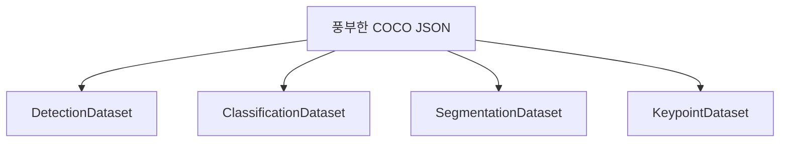

# CocoDetection 데이터셋 구성 및 활용 가이드

## 목차
1. [COCO 데이터셋 개요](#1-coco-데이터셋-개요) <br/>
2. [데이터 구조](#2-데이터-구조) <br/>
   - 2.1. [파일 구조](#21-파일-구조) <br/>
   - 2.2. [JSON 구조](#22-json-구조) <br/>
3. [PyTorch CocoDetection 사용법](#3-pytorch-cocodetection-사용법) <br/>
   - 3.1. [기본 사용법](#31-기본-사용법) <br/>
   - 3.2. [데이터셋 정보 확인](#32-데이터셋-정보-확인) <br/>
4. [커스터마이징 전략](#4-커스터마이징-전략) <br/>
   - 4.1. [Detection 데이터셋](#41-detection-데이터셋) <br/>
   - 4.2. [Classification 데이터셋](#42-classification-데이터셋) <br/>
   - 4.3. [데이터셋 팩토리 패턴](#43-데이터셋-팩토리-패턴) <br/>
5. [실용적 팁](#5-실용적-팁) <br/>
   - 5.1. [풍부한 라벨링 전략](#51-풍부한-라벨링-전략) <br/>
   - 5.2. [검증 및 시각화](#52-검증-및-시각화) <br/>

---

## 1. COCO 데이터셋 개요

COCO(Common Objects in Context) 포맷은 컴퓨터 비전 태스크를 위한 표준 어노테이션(annotation) 포맷입니다.

**주요 특징:**
- Object Detection, Instance Segmentation, Keypoint Detection 지원
- JSON 기반의 구조화된 어노테이션
- PyTorch에서 기본 지원
- 확장 가능한 속성(attribute) 구조

**PyTorch CocoDetection 클래스의 장점:**
- COCO API 자동 로드
- 표준화된 데이터 접근 인터페이스(interface)
- 상속을 통한 유연한 커스터마이징

---

## 2. 데이터 구조

### 2.1. 파일 구조

```
dataset/
├── images/
│   ├── train/
│   │   ├── 000001.jpg
│   │   ├── 000002.jpg
│   │   └── ...
│   └── val/
│       ├── 000001.jpg
│       └── ...
└── annotations/
    ├── instances_train.json
    └── instances_val.json
```

### 2.2. JSON 구조

COCO JSON 파일의 기본 구조:

```json
{
    "info": {
        "description": "My Dataset",
        "version": "1.0",
        "year": 2024
    },
    "images": [
        {
            "id": 1,
            "width": 640,
            "height": 480,
            "file_name": "000001.jpg"
        }
    ],
    "annotations": [
        {
            "id": 1,
            "image_id": 1,
            "category_id": 1,
            "bbox": [100, 150, 200, 100],
            "area": 20000,
            "iscrowd": 0
        }
    ],
    "categories": [
        {
            "id": 1,
            "name": "person",
            "supercategory": "human"
        }
    ]
}
```

**필드 설명:**
- `bbox`: `[x, y, width, height]` 형태의 바운딩 박스(bounding box)
- `area`: 객체의 픽셀(pixel) 면적
- `iscrowd`: 군집 객체 여부 (0: 개별, 1: 군집)
- `category_id`: 카테고리(category) 식별자

**고급 필드 (선택사항):**
```json
{
    "annotations": [
        {
            "id": 1,
            "image_id": 1,
            "category_id": 1,
            "bbox": [100, 150, 200, 100],
            "segmentation": [[x1, y1, x2, y2, ...]],
            "area": 20000,
            "iscrowd": 0,
            "visibility": 2,
            "attributes": {
                "difficulty": "easy",
                "pose": "frontal",
                "occluded": false
            }
        }
    ]
}
```

---

## 3. PyTorch CocoDetection 사용법

### 3.1. 기본 사용법

```python
from torchvision.datasets import CocoDetection
from torchvision.transforms import ToTensor

# 데이터셋 로드
dataset = CocoDetection(
    root='./data/images',
    annFile='./data/annotations.json',
    transform=ToTensor()
)

# 샘플 로드
image, targets = dataset[0]
print(f"이미지 크기: {image.shape}")
print(f"객체 수: {len(targets)}")
```

### 3.2. 데이터셋 정보 확인

```python
def print_dataset_info(dataset):
    """데이터셋 기본 정보 출력"""
    
    print("=== 데이터셋 정보 ===")
    print(f"총 이미지 수: {len(dataset)}")
    print(f"총 카테고리 수: {len(dataset.coco.cats)}")
    
    # 카테고리 목록
    print("\n=== 카테고리 목록 ===")
    for cat_id, cat_info in dataset.coco.cats.items():
        print(f"ID {cat_id}: {cat_info['name']}")
    
    # 첫 번째 샘플 정보
    image, targets = dataset[0]
    print(f"\n=== 첫 번째 샘플 ===")
    print(f"이미지 크기: {image.shape}")
    print(f"객체 수: {len(targets)}")
    
    if targets:
        target = targets[0]
        print(f"첫 번째 객체:")
        print(f"  카테고리 ID: {target['category_id']}")
        print(f"  바운딩 박스: {target['bbox']}")
        print(f"  면적: {target['area']}")

# 사용 예제
dataset = CocoDetection(root='./data/images', annFile='./data/annotations.json')
print_dataset_info(dataset)
```

---

## 4. 커스터마이징 전략

### 4.1. Detection 데이터셋

```python
import torch
from torchvision.datasets import CocoDetection

class DetectionDataset(CocoDetection):
    """Object Detection용 데이터셋"""
    
    def __getitem__(self, index):
        image, targets = super().__getitem__(index)
        
        boxes = []
        labels = []
        
        for target in targets:
            # bbox를 [x1, y1, x2, y2] 형태로 변환
            x, y, w, h = target['bbox']
            boxes.append([x, y, x + w, y + h])
            labels.append(target['category_id'])
        
        return image, {
            'boxes': torch.FloatTensor(boxes),
            'labels': torch.LongTensor(labels)
        }

# 사용
detection_dataset = DetectionDataset(
    root='./data/images',
    annFile='./data/annotations.json'
)
```

### 4.2. Classification 데이터셋

```python
class ClassificationDataset(CocoDetection):
    """Image Classification용 데이터셋"""
    
    def __getitem__(self, index):
        image, targets = super().__getitem__(index)
        
        # 이미지에 포함된 모든 클래스 수집
        labels = list(set(target['category_id'] for target in targets))
        
        return image, {
            'labels': labels,
            'num_objects': len(targets)
        }

# 사용
classification_dataset = ClassificationDataset(
    root='./data/images',
    annFile='./data/annotations.json'
)
```

### 4.3. 데이터셋 팩토리 패턴

```python
class DatasetFactory:
    """태스크별 데이터셋 생성 팩토리"""
    
    @staticmethod
    def create_dataset(task_type, root, ann_file, transform=None):
        """태스크에 따른 데이터셋 생성"""
        
        if task_type == 'detection':
            return DetectionDataset(root, ann_file, transform)
        elif task_type == 'classification':
            return ClassificationDataset(root, ann_file, transform)
        else:
            return CocoDetection(root, ann_file, transform)

# 사용 예제
detection_ds = DatasetFactory.create_dataset(
    'detection', 
    './data/images', 
    './data/annotations.json'
)

classification_ds = DatasetFactory.create_dataset(
    'classification', 
    './data/images', 
    './data/annotations.json'
)
```

---

## 5. 실용적 팁

### 5.1. 풍부한 라벨링 전략

**핵심 아이디어:** 처음에 풍부한 정보를 포함하여 라벨링하고, 필요에 따라 CocoDetection을 상속받아 선택적으로 활용합니다.



**풍부한 라벨링 예제:**
```json
{
    "annotations": [
        {
            "id": 1,
            "image_id": 1,
            "category_id": 1,
            "bbox": [100, 150, 200, 100],
            "segmentation": [[...]],
            "area": 20000,
            "iscrowd": 0,
            "visibility": 2,
            "attributes": {
                "difficulty": "easy",
                "pose": "frontal",
                "occluded": false,
                "truncated": false,
                "quality": "high"
            }
        }
    ]
}
```

**커스터마이징 예제:**
```python
class AttributeAwareDataset(CocoDetection):
    """속성 정보를 활용하는 데이터셋"""
    
    def __init__(self, root, annFile, difficulty_filter=None, transform=None):
        super().__init__(root, annFile, transform)
        self.difficulty_filter = difficulty_filter
    
    def __getitem__(self, index):
        image, targets = super().__getitem__(index)
        
        # 어려움 정도에 따른 필터링
        if self.difficulty_filter:
            filtered_targets = []
            for target in targets:
                attrs = target.get('attributes', {})
                difficulty = attrs.get('difficulty', 'medium')
                
                if difficulty == self.difficulty_filter:
                    filtered_targets.append(target)
            
            targets = filtered_targets
        
        # Detection 형태로 변환
        boxes = []
        labels = []
        difficulties = []
        
        for target in targets:
            x, y, w, h = target['bbox']
            boxes.append([x, y, x + w, y + h])
            labels.append(target['category_id'])
            
            attrs = target.get('attributes', {})
            difficulty = attrs.get('difficulty', 'medium')
            diff_map = {'easy': 0, 'medium': 1, 'hard': 2}
            difficulties.append(diff_map[difficulty])
        
        return image, {
            'boxes': torch.FloatTensor(boxes),
            'labels': torch.LongTensor(labels),
            'difficulties': torch.LongTensor(difficulties)
        }

# 사용 - 쉬운 샘플만 선택
easy_dataset = AttributeAwareDataset(
    root='./data/images',
    annFile='./data/annotations.json',
    difficulty_filter='easy'
)
```

### 5.2. 검증 및 시각화

**간단한 검증:**
```python
def validate_dataset(dataset, max_samples=100):
    """데이터셋 기본 검증"""
    
    print("=== 데이터셋 검증 ===")
    errors = 0
    
    for i in range(min(max_samples, len(dataset))):
        try:
            image, targets = dataset[i]
            
            # 기본 형태 확인
            if not hasattr(image, 'shape'):
                print(f"샘플 {i}: 이미지 형태 오류")
                errors += 1
                
            if not isinstance(targets, (list, dict)):
                print(f"샘플 {i}: 타겟 형태 오류")
                errors += 1
                
        except Exception as e:
            print(f"샘플 {i}: 오류 - {e}")
            errors += 1
    
    print(f"검증 완료: {errors}개 오류 발견")
    return errors == 0
```

**간단한 시각화:**
```python
import matplotlib.pyplot as plt
import matplotlib.patches as patches

def show_sample(dataset, index):
    """샘플 시각화"""
    
    image, targets = dataset[index]
    
    # 텐서(tensor)를 numpy로 변환
    if hasattr(image, 'permute'):
        img_np = image.permute(1, 2, 0).numpy()
    else:
        img_np = image
    
    plt.figure(figsize=(10, 8))
    plt.imshow(img_np)
    
    # 바운딩 박스 그리기
    if isinstance(targets, dict) and 'boxes' in targets:
        boxes = targets['boxes']
        for box in boxes:
            x1, y1, x2, y2 = box
            rect = patches.Rectangle(
                (x1, y1), x2-x1, y2-y1, 
                linewidth=2, edgecolor='red', facecolor='none'
            )
            plt.gca().add_patch(rect)
    
    elif isinstance(targets, list):
        for target in targets:
            if 'bbox' in target:
                x, y, w, h = target['bbox']
                rect = patches.Rectangle(
                    (x, y), w, h, 
                    linewidth=2, edgecolor='red', facecolor='none'
                )
                plt.gca().add_patch(rect)
    
    plt.title(f"Sample {index}")
    plt.axis('off')
    plt.show()

# 사용 예제
dataset = DetectionDataset(root='./data/images', annFile='./data/annotations.json')
validate_dataset(dataset)
show_sample(dataset, 0)
```

---

## 용어 목록

| 용어 | 설명 |
|------|------|
| Annotation | 이미지에 대한 라벨링 정보 |
| Attribute | 객체의 추가 속성 정보 |
| Bbox | Bounding Box, 객체를 둘러싸는 사각형 |
| Category | 객체의 클래스 분류 |
| COCO | Common Objects in Context 데이터셋 포맷 |
| Interface | 프로그램 간 상호작용 접점 |
| Pixel | 이미지의 최소 단위 |
| Segmentation | 픽셀 단위 객체 영역 구분 |
| Tensor | 다차원 배열 데이터 구조 |