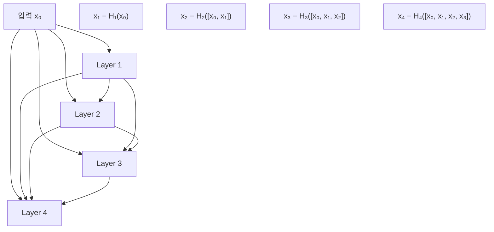
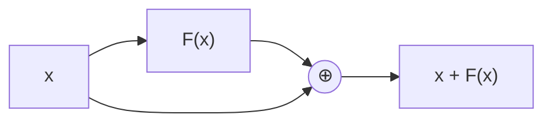
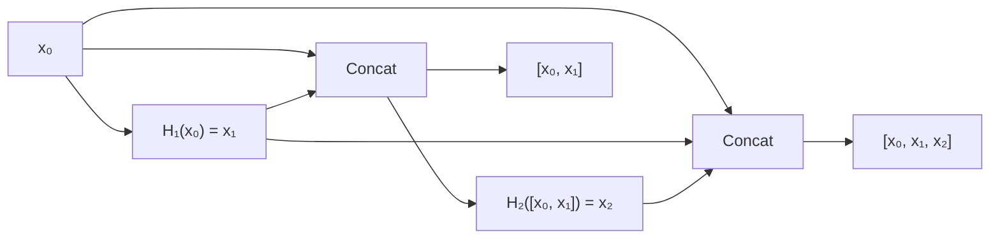
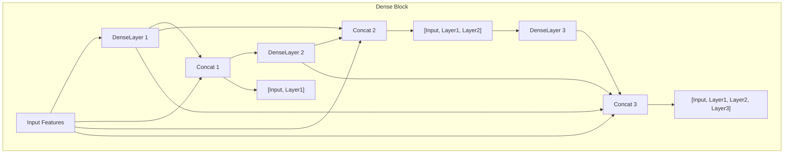
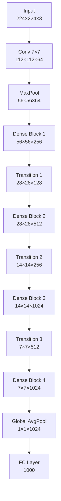
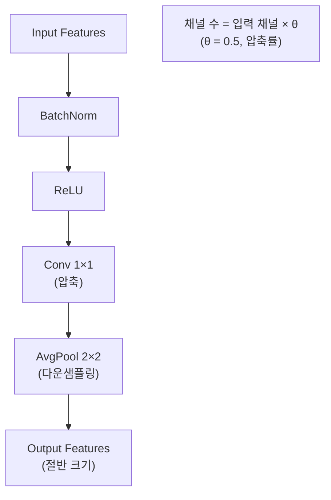

# DenseNet - Dense Connection으로 특성을 재사용하는 CNN

## 개요

DenseNet(Densely Connected Convolutional Networks)은 2017년 Cornell University에서 Gao Huang 등에 의해 개발된 합성곱 신경망입니다. "Densely Connected Convolutional Networks" 논문으로 발표되었으며, CVPR 2017에서 Best Paper Award를 수상했습니다. 모든 레이어가 이후의 모든 레이어와 연결되는 Dense Connection을 통해 특성 재사용을 극대화한 혁신적인 구조입니다.

## DenseNet의 핵심 아이디어

### ResNet의 한계
- **Skip Connection**: x + F(x) 형태의 element-wise addition
- **정보 손실**: 덧셈 연산으로 인한 정보 결합
- **중복 특성**: 비슷한 특성을 여러 레이어에서 재학습

### DenseNet의 해결책
- **Dense Connection**: 모든 이전 레이어의 특성을 연결(concatenation)
- **특성 재사용**: 한 번 학습한 특성을 계속 활용
- **파라미터 효율성**: 적은 파라미터로 높은 성능



## DenseNet vs ResNet 비교

### ResNet (Residual Connection)


### DenseNet (Dense Connection)


## DenseNet 모델 종류

| 모델 | 레이어 수 | Growth Rate | 블록 구성 | 파라미터 수 | Top-1 Error |
|------|-----------|-------------|-----------|-------------|-------------|
| DenseNet-121 | 121 | 32 | [6,12,24,16] | 8.0M | 25.35% |
| DenseNet-169 | 169 | 32 | [6,12,32,32] | 14.1M | 24.00% |
| DenseNet-201 | 201 | 32 | [6,12,48,32] | 20.0M | 22.80% |
| DenseNet-264 | 264 | 32 | [6,12,64,48] | 33.3M | 22.15% |

## Dense Block과 Transition Layer

### Dense Block 구조



### DenseNet 전체 구조



### Transition Layer 구조



## 각 구성 요소 상세 설명

### 1. Growth Rate (k)
- **정의**: 각 Dense Layer가 생성하는 특성 맵의 수
- **일반적 값**: 12, 24, 32
- **의미**: 네트워크의 "성장" 속도 결정

### 2. Dense Layer
- **구성**: BN → ReLU → Conv1×1 → BN → ReLU → Conv3×3
- **출력**: k개의 특성 맵
- **입력**: 이전 모든 레이어의 특성 맵 concatenation

### 3. Transition Layer
- **목적**: 특성 맵 크기 축소 및 채널 수 압축
- **압축률 θ**: 일반적으로 0.5 (절반으로 감소)
- **다운샘플링**: Average Pooling 2×2, stride=2

### 4. Bottleneck Layer
- **목적**: 계산 효율성 향상
- **구조**: 1×1 conv → 3×3 conv
- **채널 수**: 1×1 conv에서 4×k개 채널 생성

## PyTorch 구현 예제

```python
# 필요한 import (예제별로 상단에 추가해 두면 블록 단위 실행 시 NameError를 줄일 수 있습니다)
import torch
import torch.nn as nn
import torch.nn.functional as F
import torch.optim as optim
from collections import OrderedDict
from torchvision import models, datasets, transforms
from torch.utils.data import DataLoader
```

### Dense Layer 구현

```python
import torch
import torch.nn as nn
import torch.nn.functional as F
from collections import OrderedDict

class _DenseLayer(nn.Module):
    def __init__(self, num_input_features, growth_rate, bn_size, drop_rate):
        super(_DenseLayer, self).__init__()
        
        # Bottleneck layers
        self.norm1 = nn.BatchNorm2d(num_input_features)
        self.relu1 = nn.ReLU(inplace=True)
        self.conv1 = nn.Conv2d(num_input_features, bn_size * growth_rate,
                              kernel_size=1, stride=1, bias=False)
        
        # 3x3 convolution
        self.norm2 = nn.BatchNorm2d(bn_size * growth_rate)
        self.relu2 = nn.ReLU(inplace=True)
        self.conv2 = nn.Conv2d(bn_size * growth_rate, growth_rate,
                              kernel_size=3, stride=1, padding=1, bias=False)
        
        self.drop_rate = drop_rate
    
    def forward(self, x):
        # x는 이전 모든 레이어의 특성들이 concatenated된 상태
        if isinstance(x, torch.Tensor):
            concat_features = x
        else:
            concat_features = torch.cat(x, 1)
            
        # Bottleneck
        bottleneck_output = self.conv1(self.relu1(self.norm1(concat_features)))
        
        # 3x3 convolution
        new_features = self.conv2(self.relu2(self.norm2(bottleneck_output)))
        
        # Dropout
        if self.drop_rate > 0:
            new_features = F.dropout(new_features, p=self.drop_rate, training=self.training)
        
        return new_features
```

### Dense Block 구현

```python
class _DenseBlock(nn.Module):
    def __init__(self, num_layers, num_input_features, bn_size, growth_rate, drop_rate):
        super(_DenseBlock, self).__init__()
        
        for i in range(num_layers):
            layer = _DenseLayer(
                num_input_features + i * growth_rate,
                growth_rate=growth_rate,
                bn_size=bn_size,
                drop_rate=drop_rate
            )
            self.add_module(f'denselayer{i+1}', layer)
    
    def forward(self, init_features):
        features = [init_features]
        
        for name, layer in self.named_children():
            new_features = layer(features)
            features.append(new_features)
        
        return torch.cat(features, 1)
```

### Transition Layer 구현

```python
class _Transition(nn.Module):
    def __init__(self, num_input_features, num_output_features):
        super(_Transition, self).__init__()
        
        self.norm = nn.BatchNorm2d(num_input_features)
        self.relu = nn.ReLU(inplace=True)
        self.conv = nn.Conv2d(num_input_features, num_output_features,
                             kernel_size=1, stride=1, bias=False)
        self.pool = nn.AvgPool2d(kernel_size=2, stride=2)
    
    def forward(self, x):
        x = self.conv(self.relu(self.norm(x)))
        x = self.pool(x)
        return x
```

### 완전한 DenseNet 구현

```python
class DenseNet(nn.Module):
    def __init__(self, growth_rate=32, block_config=(6, 12, 24, 16),
                 num_init_features=64, bn_size=4, drop_rate=0,
                 num_classes=1000):
        super(DenseNet, self).__init__()
        
        # Initial convolution
        self.features = nn.Sequential(OrderedDict([
            ('conv0', nn.Conv2d(3, num_init_features, kernel_size=7, stride=2,
                               padding=3, bias=False)),
            ('norm0', nn.BatchNorm2d(num_init_features)),
            ('relu0', nn.ReLU(inplace=True)),
            ('pool0', nn.MaxPool2d(kernel_size=3, stride=2, padding=1)),
        ]))
        
        # Dense blocks
        num_features = num_init_features
        for i, num_layers in enumerate(block_config):
            block = _DenseBlock(
                num_layers=num_layers,
                num_input_features=num_features,
                bn_size=bn_size,
                growth_rate=growth_rate,
                drop_rate=drop_rate
            )
            self.features.add_module(f'denseblock{i+1}', block)
            num_features = num_features + num_layers * growth_rate
            
            # Transition layer (except for the last block)
            if i != len(block_config) - 1:
                trans = _Transition(num_input_features=num_features,
                                  num_output_features=num_features // 2)
                self.features.add_module(f'transition{i+1}', trans)
                num_features = num_features // 2
        
        # Final batch norm
        self.features.add_module('norm5', nn.BatchNorm2d(num_features))
        
        # Classifier
        self.classifier = nn.Linear(num_features, num_classes)
        
        # Weight initialization
        for m in self.modules():
            if isinstance(m, nn.Conv2d):
                nn.init.kaiming_normal_(m.weight)
            elif isinstance(m, nn.BatchNorm2d):
                nn.init.constant_(m.weight, 1)
                nn.init.constant_(m.bias, 0)
            elif isinstance(m, nn.Linear):
                nn.init.constant_(m.bias, 0)
    
    def forward(self, x):
        features = self.features(x)
        out = F.relu(features, inplace=True)
        out = F.adaptive_avg_pool2d(out, (1, 1))
        out = torch.flatten(out, 1)
        out = self.classifier(out)
        return out

# 다양한 DenseNet 모델 생성 함수들
def densenet121(num_classes=1000):
    return DenseNet(growth_rate=32, block_config=(6, 12, 24, 16), num_classes=num_classes)

def densenet169(num_classes=1000):
    return DenseNet(growth_rate=32, block_config=(6, 12, 32, 32), num_classes=num_classes)

def densenet201(num_classes=1000):
    return DenseNet(growth_rate=32, block_config=(6, 12, 48, 32), num_classes=num_classes)

def densenet264(num_classes=1000):
    return DenseNet(growth_rate=32, block_config=(6, 12, 64, 48), num_classes=num_classes)

# 사용 예제
model = densenet121(num_classes=1000)
print(f"총 파라미터 수: {sum(p.numel() for p in model.parameters()):,}")

# 입력 테스트
x = torch.randn(1, 3, 224, 224)
output = model(x)
print(f"출력 크기: {output.shape}")
```

## Growth Rate의 효과 분석

### Growth Rate에 따른 특성 맵 변화

```python
def analyze_growth_rate():
    """Growth Rate가 네트워크에 미치는 영향 분석"""
    
    # Dense Block에서 레이어별 특성 맵 수 계산
    def calculate_features(num_layers, input_features, growth_rate):
        features_per_layer = []
        current_features = input_features
        
        for i in range(num_layers):
            features_per_layer.append(current_features)
            current_features += growth_rate
        
        return features_per_layer, current_features
    
    # 다양한 Growth Rate로 분석
    growth_rates = [12, 24, 32, 48]
    num_layers = 6
    input_features = 64
    
    print("Growth Rate별 특성 맵 수 변화:")
    for gr in growth_rates:
        layer_features, final_features = calculate_features(num_layers, input_features, gr)
        print(f"Growth Rate {gr}: {layer_features} → {final_features}")
        print(f"  파라미터 증가: {((final_features - input_features) / input_features * 100):.1f}%")
        print()

analyze_growth_rate()
```

## CIFAR-10 학습 예제

```python
import torch.optim as optim
from torchvision import datasets, transforms
from torch.utils.data import DataLoader

# CIFAR-10용 DenseNet (입력 크기 조정)
class DenseNetCIFAR(nn.Module):
    def __init__(self, growth_rate=12, block_config=(16, 16, 16), 
                 compression=0.5, num_init_features=24, 
                 bn_size=4, drop_rate=0, num_classes=10):
        super(DenseNetCIFAR, self).__init__()
        
        # Initial convolution (CIFAR-10에 맞게 조정)
        self.features = nn.Sequential(OrderedDict([
            ('conv0', nn.Conv2d(3, num_init_features, kernel_size=3, stride=1,
                               padding=1, bias=False)),
            ('norm0', nn.BatchNorm2d(num_init_features)),
            ('relu0', nn.ReLU(inplace=True)),
        ]))
        
        # Dense blocks
        num_features = num_init_features
        for i, num_layers in enumerate(block_config):
            block = _DenseBlock(
                num_layers=num_layers,
                num_input_features=num_features,
                bn_size=bn_size,
                growth_rate=growth_rate,
                drop_rate=drop_rate
            )
            self.features.add_module(f'denseblock{i+1}', block)
            num_features = num_features + num_layers * growth_rate
            
            # Transition layer (except for the last block)
            if i != len(block_config) - 1:
                trans = _Transition(
                    num_input_features=num_features,
                    num_output_features=int(num_features * compression)
                )
                self.features.add_module(f'transition{i+1}', trans)
                num_features = int(num_features * compression)
        
        # Final batch norm
        self.features.add_module('norm_final', nn.BatchNorm2d(num_features))
        
        # Classifier
        self.classifier = nn.Linear(num_features, num_classes)
    
    def forward(self, x):
        features = self.features(x)
        out = F.relu(features, inplace=True)
        out = F.adaptive_avg_pool2d(out, (1, 1))
        out = torch.flatten(out, 1)
        out = self.classifier(out)
        return out

# 데이터 전처리
transform_train = transforms.Compose([
    transforms.RandomCrop(32, padding=4),
    transforms.RandomHorizontalFlip(),
    transforms.ToTensor(),
    transforms.Normalize((0.4914, 0.4822, 0.4465), (0.2023, 0.1994, 0.2010))
])

transform_test = transforms.Compose([
    transforms.ToTensor(),
    transforms.Normalize((0.4914, 0.4822, 0.4465), (0.2023, 0.1994, 0.2010))
])

# 데이터셋 로드
train_dataset = datasets.CIFAR10('./data', train=True, download=True, transform=transform_train)
test_dataset = datasets.CIFAR10('./data', train=False, transform=transform_test)

train_loader = DataLoader(train_dataset, batch_size=64, shuffle=True, num_workers=2)
test_loader = DataLoader(test_dataset, batch_size=100, shuffle=False, num_workers=2)

# 모델 및 학습 설정
device = torch.device('cuda' if torch.cuda.is_available() else 'cpu')
model = DenseNetCIFAR(growth_rate=12, block_config=(16, 16, 16), num_classes=10).to(device)
criterion = nn.CrossEntropyLoss()
optimizer = optim.SGD(model.parameters(), lr=0.1, momentum=0.9, weight_decay=1e-4)
scheduler = optim.lr_scheduler.MultiStepLR(optimizer, milestones=[150, 225], gamma=0.1)

# 학습 함수
def train_epoch(epoch):
    model.train()
    train_loss = 0
    correct = 0
    total = 0
    
    for batch_idx, (data, target) in enumerate(train_loader):
        data, target = data.to(device), target.to(device)
        
        optimizer.zero_grad()
        output = model(data)
        loss = criterion(output, target)
        loss.backward()
        optimizer.step()
        
        train_loss += loss.item()
        _, predicted = output.max(1)
        total += target.size(0)
        correct += predicted.eq(target).sum().item()
        
        if batch_idx % 200 == 0:
            print(f'Epoch {epoch}, Batch {batch_idx}, '
                  f'Loss: {train_loss/(batch_idx+1):.4f}, '
                  f'Acc: {100.*correct/total:.2f}%')

# 테스트 함수
def test():
    model.eval()
    test_loss = 0
    correct = 0
    total = 0
    
    with torch.no_grad():
        for data, target in test_loader:
            data, target = data.to(device), target.to(device)
            output = model(data)
            test_loss += criterion(output, target).item()
            _, predicted = output.max(1)
            total += target.size(0)
            correct += predicted.eq(target).sum().item()
    
    accuracy = 100. * correct / total
    print(f'Test Accuracy: {accuracy:.2f}%')
    return accuracy

# 학습 실행
best_acc = 0
for epoch in range(300):
    train_epoch(epoch)
    acc = test()
    scheduler.step()
    
    if acc > best_acc:
        best_acc = acc
        torch.save(model.state_dict(), 'densenet_cifar10_best.pth')

print(f'Best Test Accuracy: {best_acc:.2f}%')
```

## DenseNet의 핵심 기술들

### 1. Feature Reuse (특성 재사용)

```python
def visualize_feature_reuse():
    """DenseNet의 특성 재사용 패턴 시각화"""
    
    # 각 레이어가 참조하는 이전 레이어들
    layer_connections = {
        'Layer 1': ['Input'],
        'Layer 2': ['Input', 'Layer 1'],
        'Layer 3': ['Input', 'Layer 1', 'Layer 2'],
        'Layer 4': ['Input', 'Layer 1', 'Layer 2', 'Layer 3'],
        'Layer 5': ['Input', 'Layer 1', 'Layer 2', 'Layer 3', 'Layer 4']
    }
    
    total_connections = 0
    for layer, connections in layer_connections.items():
        print(f"{layer}: {len(connections)} connections")
        total_connections += len(connections)
    
    print(f"총 연결 수: {total_connections}")
    print(f"일반적인 CNN 연결 수: {len(layer_connections)}")
    print(f"연결 증가율: {total_connections / len(layer_connections):.1f}배")
```

### 2. Memory Efficiency

```python
def analyze_memory_efficiency():
    """DenseNet의 메모리 효율성 분석"""
    
    # 메모리 효율적인 구현
    class _DenseLayerEfficient(nn.Module):
        def __init__(self, num_input_features, growth_rate, bn_size, drop_rate):
            super(_DenseLayerEfficient, self).__init__()
            
            # Shared convolutions
            self.conv1 = nn.Conv2d(num_input_features, bn_size * growth_rate,
                                  kernel_size=1, stride=1, bias=False)
            self.conv2 = nn.Conv2d(bn_size * growth_rate, growth_rate,
                                  kernel_size=3, stride=1, padding=1, bias=False)
            
        def forward(self, *prev_features):
            # Efficient concatenation using checkpointing
            concat_features = torch.cat(prev_features, 1)
            
            # Use checkpoint to save memory during backward pass
            from torch.utils.checkpoint import checkpoint
            
            def conv_forward(x):
                x = F.relu(self.conv1(x))
                x = F.relu(self.conv2(x))
                return x
            
            if self.training:
                new_features = checkpoint(conv_forward, concat_features)
            else:
                new_features = conv_forward(concat_features)
                
            return new_features
```

### 3. Compression Factor

```python
def analyze_compression():
    """압축률(θ)이 성능에 미치는 영향 분석"""
    
    compression_factors = [0.3, 0.5, 0.7, 1.0]
    
    for theta in compression_factors:
        print(f"압축률 θ = {theta}")
        
        # Dense Block 후 특성 맵 수 계산
        input_features = 256
        growth_rate = 32
        num_layers = 6
        
        features_after_block = input_features + num_layers * growth_rate
        features_after_transition = int(features_after_block * theta)
        
        reduction = (1 - theta) * 100
        
        print(f"  Dense Block 후: {features_after_block} 채널")
        print(f"  Transition 후: {features_after_transition} 채널")
        print(f"  압축률: {reduction:.1f}% 감소")
        print(f"  파라미터 절약: ~{reduction:.1f}%")
        print()
```

## DenseNet 변형들

### 1. DenseNet-BC (Bottleneck + Compression)

```python
class DenseNetBC(nn.Module):
    """DenseNet with Bottleneck and Compression"""
    def __init__(self, growth_rate=32, block_config=(6, 12, 24, 16),
                 compression=0.5, num_init_features=64, bn_size=4,
                 drop_rate=0, num_classes=1000):
        super(DenseNetBC, self).__init__()
        
        # Bottleneck factor: bn_size = 4
        # Compression factor: compression = 0.5
        # 기본 DenseNet과 동일하지만 압축률 명시적 설정
        
    # NOTE: 이 클래스는 문서상 예시용으로 남겨두었습니다.
    # 실제 사용하려면 기본 DenseNet 구현을 복사한 뒤
    # compression/ bn_size 등의 파라미터를 적용해 완성하세요.
    # TODO: 구현 필요 (간단한 스텁을 원하면 요청해 주세요)
    raise NotImplementedError("DenseNetBC는 문서 예시이며 아직 구현되어 있지 않습니다.")
```

### 2. Multi-Scale DenseNet

```python
class MultiScaleDenseNet(nn.Module):
    """다중 스케일 특성을 활용하는 DenseNet"""
    def __init__(self, num_classes=1000):
        super(MultiScaleDenseNet, self).__init__()
        
        # 기본 DenseNet backbone
        self.backbone = densenet121()
        
        # 다중 스케일 특성 추출
        self.side_outputs = nn.ModuleList([
            nn.Conv2d(256, 128, 1),   # Dense Block 1 출력
            nn.Conv2d(512, 128, 1),   # Dense Block 2 출력
            nn.Conv2d(1024, 128, 1),  # Dense Block 3 출력
            nn.Conv2d(1024, 128, 1),  # Dense Block 4 출력
        ])
        
        # 최종 분류기
        self.classifier = nn.Linear(128 * 4, num_classes)
    
    def forward(self, x):
        features = []
        x = self.backbone.features.conv0(x)
        x = self.backbone.features.norm0(x)
        x = self.backbone.features.relu0(x)
        x = self.backbone.features.pool0(x)
        
        # Dense blocks에서 특성 추출
        for i in range(1, 5):
            x = getattr(self.backbone.features, f'denseblock{i}')(x)
            side_feat = self.side_outputs[i-1](x)
            side_feat = F.adaptive_avg_pool2d(side_feat, (1, 1))
            features.append(side_feat.flatten(1))
            
            if i < 4:  # 마지막 블록이 아니면 transition
                x = getattr(self.backbone.features, f'transition{i}')(x)
        
        # 모든 스케일 특성 결합
        combined_features = torch.cat(features, dim=1)
        output = self.classifier(combined_features)
        
        return output
```

## DenseNet의 수학적 분석

### 1. 파라미터 수 계산

```python
def calculate_parameters():
    """DenseNet의 파라미터 수 분석"""
    
    def dense_block_params(num_layers, input_features, growth_rate, bn_size=4):
        total_params = 0
        current_features = input_features
        
        for i in range(num_layers):
            # Bottleneck layer (1x1 conv)
            bottleneck_params = current_features * (bn_size * growth_rate)
            
            # 3x3 convolution
            conv3x3_params = (bn_size * growth_rate) * growth_rate * 9
            
            layer_params = bottleneck_params + conv3x3_params
            total_params += layer_params
            
            current_features += growth_rate
            
            print(f"  Layer {i+1}: {layer_params:,} params, Total features: {current_features}")
        
        return total_params, current_features
    
    # DenseNet-121 분석
    print("DenseNet-121 파라미터 분석:")
    
    initial_features = 64
    growth_rate = 32
    block_config = (6, 12, 24, 16)
    
    total_params = 0
    current_features = initial_features
    
    for i, num_layers in enumerate(block_config):
        print(f"\nDense Block {i+1} ({num_layers} layers):")
        block_params, current_features = dense_block_params(
            num_layers, current_features, growth_rate
        )
        total_params += block_params
        
        # Transition layer
        if i < len(block_config) - 1:
            transition_params = current_features * (current_features // 2)
            total_params += transition_params
            current_features = current_features // 2
            print(f"  Transition {i+1}: {transition_params:,} params")
    
    # Final classifier
    classifier_params = current_features * 1000
    total_params += classifier_params
    
    print(f"\nClassifier: {classifier_params:,} params")
    print(f"총 파라미터 수: {total_params:,}")

calculate_parameters()
```

### 2. 메모리 사용량 분석

```python
def analyze_memory_usage():
    """DenseNet의 메모리 사용량 분석"""
    
    def calculate_memory(batch_size, height, width, num_features):
        # Float32 기준 (4 bytes per element)
        memory_bytes = batch_size * height * width * num_features * 4
        memory_mb = memory_bytes / (1024 * 1024)
        return memory_mb
    
    print("DenseNet-121 메모리 사용량 분석 (배치 크기 32):")
    print("=" * 50)
    
    batch_size = 32
    current_h, current_w = 224, 224
    current_features = 64
    growth_rate = 32
    
    total_memory = 0
    
    # Initial conv
    memory = calculate_memory(batch_size, current_h//2, current_w//2, current_features)
    total_memory += memory
    print(f"Initial Conv: {memory:.1f} MB")
    
    current_h, current_w = current_h//4, current_w//4  # After maxpool
    
    block_config = (6, 12, 24, 16)
    for i, num_layers in enumerate(block_config):
        print(f"\nDense Block {i+1}:")
        
        for layer in range(num_layers):
            current_features += growth_rate
            memory = calculate_memory(batch_size, current_h, current_w, current_features)
            total_memory += memory
            print(f"  After layer {layer+1}: {current_features} features, {memory:.1f} MB")
        
        # Transition layer
        if i < len(block_config) - 1:
            current_features = current_features // 2
            current_h, current_w = current_h//2, current_w//2
            memory = calculate_memory(batch_size, current_h, current_w, current_features)
            total_memory += memory
            print(f"  After transition: {current_features} features, {memory:.1f} MB")
    
    print(f"\n총 메모리 사용량: {total_memory:.1f} MB")
    print(f"GPU 메모리 권장사항: {total_memory * 2:.1f} MB (순전파 + 역전파)")

analyze_memory_usage()
```

## 성능 비교 및 벤치마크

### DenseNet vs 다른 모델들

```python
def performance_comparison():
    """주요 CNN 모델들과의 성능 비교"""
    
    models_comparison = {
        'Model': ['ResNet-50', 'ResNet-101', 'DenseNet-121', 'DenseNet-169', 'DenseNet-201'],
        'Parameters': ['25.6M', '44.5M', '8.0M', '14.1M', '20.0M'],
        'Top-1 Error': [23.85, 22.63, 25.35, 24.00, 22.80],
        'Top-5 Error': [7.13, 6.44, 7.83, 7.00, 6.43],
        'FLOPs': ['4.1G', '7.8G', '2.9G', '3.4G', '4.3G']
    }
    
    import pandas as pd
    df = pd.DataFrame(models_comparison)
    print("CNN 모델 성능 비교:")
    print(df.to_string(index=False))
    
    print("\nDenseNet의 장점:")
    print("1. 파라미터 효율성: ResNet-50의 1/3 파라미터로 비슷한 성능")
    print("2. 계산 효율성: 적은 FLOPs로 높은 성능")
    print("3. 특성 재사용: 중복 학습 최소화")

performance_comparison()
```

### 실제 성능 측정

```python
def benchmark_models():
    """실제 추론 속도 및 메모리 벤치마크"""
    
    import time
    import torch.utils.benchmark as benchmark
    
    device = torch.device('cuda' if torch.cuda.is_available() else 'cpu')
    
    models = {
        'DenseNet-121': densenet121(),
        'DenseNet-169': densenet169(),
        'DenseNet-201': densenet201()
    }
    
    batch_sizes = [1, 8, 32]
    
    for batch_size in batch_sizes:
        print(f"\n배치 크기: {batch_size}")
        print("-" * 40)
        
        for name, model in models.items():
            model = model.to(device).eval()
            
            # 추론 시간 측정
            timer = benchmark.Timer(
                stmt='model(x)',
                setup='import torch',
                globals={
                    'model': model, 
                    'x': torch.randn(batch_size, 3, 224, 224).to(device)
                }
            )
            
            result = timer.timeit(100)
            throughput = batch_size / result.mean
            
            print(f"{name:15} | {result.mean*1000:.2f}ms | {throughput:.1f} imgs/sec")
            
            # GPU 메모리 사용량
            if torch.cuda.is_available():
                torch.cuda.reset_peak_memory_stats()
                with torch.no_grad():
                    _ = model(torch.randn(batch_size, 3, 224, 224).to(device))
                memory_mb = torch.cuda.max_memory_allocated() / 1024 / 1024
                print(f"{'':15} | GPU Memory: {memory_mb:.1f}MB")

benchmark_models()
```

## 실무 활용 가이드

### 1. 전이 학습 (Transfer Learning)

```python
import torchvision.models as models

def setup_transfer_learning(num_classes, freeze_features=True):
    """DenseNet을 이용한 전이 학습 설정"""
    
    # 사전 훈련된 DenseNet 로드
    model = models.densenet121(pretrained=True)
    
    if freeze_features:
        # Feature extractor 고정
        for param in model.features.parameters():
            param.requires_grad = False
    
    # 새로운 분류기 설정
    num_features = model.classifier.in_features
    model.classifier = nn.Linear(num_features, num_classes)
    
    # 학습률 설정 (분류기는 높게, 특성 추출기는 낮게)
    if not freeze_features:
        optimizer = optim.SGD([
            {'params': model.features.parameters(), 'lr': 1e-4},
            {'params': model.classifier.parameters(), 'lr': 1e-2}
        ], momentum=0.9, weight_decay=1e-4)
    else:
        optimizer = optim.SGD(
            model.classifier.parameters(), 
            lr=1e-2, momentum=0.9, weight_decay=1e-4
        )
    
    return model, optimizer

# 사용 예제
model, optimizer = setup_transfer_learning(num_classes=10, freeze_features=False)
print("전이 학습 모델 설정 완료")
```

### 2. 특성 추출기로 활용

```python
class DenseNetFeatureExtractor(nn.Module):
    """DenseNet을 특성 추출기로 사용"""
    
    def __init__(self, model_name='densenet121', pretrained=True):
        super(DenseNetFeatureExtractor, self).__init__()
        
        if model_name == 'densenet121':
            self.backbone = models.densenet121(pretrained=pretrained)
        elif model_name == 'densenet169':
            self.backbone = models.densenet169(pretrained=pretrained)
        elif model_name == 'densenet201':
            self.backbone = models.densenet201(pretrained=pretrained)
        
        # 분류기 제거
        self.features = self.backbone.features
        self.num_features = self.backbone.classifier.in_features
    
    def forward(self, x):
        features = self.features(x)
        features = F.relu(features, inplace=True)
        features = F.adaptive_avg_pool2d(features, (1, 1))
        features = torch.flatten(features, 1)
        return features
    
    def get_feature_dim(self):
        return self.num_features

# 사용 예제
feature_extractor = DenseNetFeatureExtractor('densenet121')
features = feature_extractor(torch.randn(4, 3, 224, 224))
print(f"추출된 특성 차원: {features.shape}")  # [4, 1024]
```

### 3. 메모리 최적화

```python
class MemoryEfficientDenseNet(nn.Module):
    """메모리 효율적인 DenseNet 구현"""
    
    def __init__(self, growth_rate=32, block_config=(6, 12, 24, 16), 
                 num_classes=1000, memory_efficient=True):
        super(MemoryEfficientDenseNet, self).__init__()
        
        self.memory_efficient = memory_efficient
        
        # 기본 구조는 동일
        self.features = self._make_features(growth_rate, block_config)
        self.classifier = nn.Linear(self._get_num_features(), num_classes)
    
    def _make_features(self, growth_rate, block_config):
        # DenseNet features 구성
        # memory_efficient가 True이면 checkpointing 사용
        pass
    
    def forward(self, x):
        if self.memory_efficient and self.training:
            # Gradient checkpointing 사용
            from torch.utils.checkpoint import checkpoint_sequential
            
            # 메모리 절약을 위해 순차적 체크포인팅
            features = checkpoint_sequential(self.features, 4, x)
        else:
            features = self.features(x)
        
        out = F.relu(features, inplace=True)
        out = F.adaptive_avg_pool2d(out, (1, 1))
        out = torch.flatten(out, 1)
        out = self.classifier(out)
        
        return out

# 메모리 절약 모드로 학습
model = MemoryEfficientDenseNet(memory_efficient=True)
```

## 고급 기법 및 최적화

### 1. Mixed Precision Training

```python
def train_with_mixed_precision():
    """Mixed Precision으로 DenseNet 학습"""
    
    from torch.cuda.amp import GradScaler, autocast
    
    model = densenet121().cuda()
    optimizer = optim.SGD(model.parameters(), lr=0.1, momentum=0.9)
    scaler = GradScaler()
    
    for epoch in range(num_epochs):
        for batch_idx, (data, target) in enumerate(train_loader):
            data, target = data.cuda(), target.cuda()
            
            optimizer.zero_grad()
            
            # Autocast로 mixed precision 적용
            with autocast():
                output = model(data)
                loss = criterion(output, target)
            
            # Gradient scaling
            scaler.scale(loss).backward()
            scaler.step(optimizer)
            scaler.update()
            
            if batch_idx % 100 == 0:
                print(f"Epoch {epoch}, Loss: {loss.item():.4f}")

# Mixed precision으로 메모리 사용량 50% 절약 가능
```

### 2. Knowledge Distillation

```python
class DenseNetDistillation(nn.Module):
    """DenseNet Teacher-Student 구조"""
    
    def __init__(self, teacher_model, student_model, temperature=4.0):
        super(DenseNetDistillation, self).__init__()
        self.teacher = teacher_model
        self.student = student_model
        self.temperature = temperature
        
        # Teacher 모델 고정
        for param in self.teacher.parameters():
            param.requires_grad = False
    
    def forward(self, x):
        with torch.no_grad():
            teacher_logits = self.teacher(x)
        
        student_logits = self.student(x)
        
        return student_logits, teacher_logits
    
    def distillation_loss(self, student_logits, teacher_logits, labels, alpha=0.7):
        # Soft target loss (teacher guidance)
        soft_teacher = F.softmax(teacher_logits / self.temperature, dim=1)
        soft_student = F.log_softmax(student_logits / self.temperature, dim=1)
        soft_loss = F.kl_div(soft_student, soft_teacher, reduction='batchmean')
        soft_loss = soft_loss * (self.temperature ** 2)
        
        # Hard target loss (ground truth)
        hard_loss = F.cross_entropy(student_logits, labels)
        
        # 가중 합
        total_loss = alpha * soft_loss + (1 - alpha) * hard_loss
        
        return total_loss

# Teacher: DenseNet-201 (pretrained), Student: DenseNet-121 (from torchvision)
teacher = models.densenet201(pretrained=True)
student = models.densenet121(pretrained=False)
distill_model = DenseNetDistillation(teacher, student)
```

### 3. 구조 탐색 및 최적화

```python
def find_optimal_growth_rate():
    """최적의 Growth Rate 탐색"""
    
    growth_rates = [12, 16, 24, 32, 40, 48]
    results = {}
    
    for gr in growth_rates:
        model = DenseNetCIFAR(growth_rate=gr, block_config=(12, 12, 12))
        
        # 파라미터 수 계산
        params = sum(p.numel() for p in model.parameters())
        
        # 이론적 성능 추정 (실제로는 학습 필요)
        theoretical_acc = 85 + (gr - 12) * 0.5 - (params / 1e6) * 0.1
        
        results[gr] = {
            'params': params,
            'theoretical_acc': min(theoretical_acc, 95)  # 상한선 설정
        }
        
        print(f"Growth Rate {gr}: {params:,} params, "
              f"예상 정확도 {theoretical_acc:.1f}%")
    
    # 파라미터 대비 성능이 가장 좋은 설정 찾기
    best_gr = max(results.keys(), 
                  key=lambda x: results[x]['theoretical_acc'] / (results[x]['params'] / 1e6))
    
    print(f"\n최적 Growth Rate: {best_gr}")
    return best_gr

optimal_gr = find_optimal_growth_rate()
```

## 시각화 및 해석

### 1. Dense Connection 시각화

```python
def visualize_dense_connections():
    """Dense Connection 패턴 시각화"""
    
    import matplotlib.pyplot as plt
    import numpy as np
    
    # 5개 레이어 Dense Block 연결 패턴
    num_layers = 5
    connection_matrix = np.zeros((num_layers, num_layers))
    
    for i in range(num_layers):
        for j in range(i):
            connection_matrix[i, j] = 1
    
    plt.figure(figsize=(8, 6))
    plt.imshow(connection_matrix, cmap='Blues', interpolation='nearest')
    plt.xlabel('이전 레이어 (입력)')
    plt.ylabel('현재 레이어 (출력)')
    plt.title('DenseNet Dense Connection 패턴')
    
    # 연결 표시
    for i in range(num_layers):
        for j in range(i):
            plt.text(j, i, '1', ha='center', va='center', fontweight='bold')
    
    plt.colorbar()
    plt.tight_layout()
    plt.show()
    
    # 총 연결 수 계산
    total_connections = sum(range(num_layers))
    regular_connections = num_layers - 1
    
    print(f"Dense Connection 수: {total_connections}")
    print(f"일반 CNN 연결 수: {regular_connections}")
    print(f"연결 증가 비율: {total_connections / regular_connections:.1f}배")

visualize_dense_connections()
```

### 2. 특성 맵 변화 추적

```python
def track_feature_evolution():
    """Dense Block에서 특성 맵 진화 과정 추적"""
    
    model = models.densenet121(pretrained=True)
    model.eval()
    
    # Hook으로 중간 특성 추출
    features = {}
    
    def hook_fn(name):
        def hook(module, input, output):
            features[name] = output.detach()
        return hook
    
    # Dense Block의 각 레이어에 hook 설정
    hooks = []
    for name, module in model.features.named_modules():
        if 'denselayer' in name:
            hook = module.register_forward_hook(hook_fn(name))
            hooks.append(hook)
    
    # 샘플 이미지로 테스트
    sample_input = torch.randn(1, 3, 224, 224)
    
    with torch.no_grad():
        _ = model(sample_input)
    
    # 특성 맵 수 변화 추적
    print("Dense Block 1의 특성 맵 진화:")
    for name in sorted(features.keys()):
        if 'denseblock1' in name:
            feat_shape = features[name].shape
            print(f"{name}: {feat_shape[1]} channels")
    
    # Hook 정리
    for hook in hooks:
        hook.remove()

track_feature_evolution()
```

## DenseNet의 이론적 통찰

### 1. Information Flow Analysis

```python
def analyze_information_flow():
    """DenseNet의 정보 흐름 분석"""
    
    print("DenseNet vs ResNet 정보 흐름 비교:")
    print("=" * 50)
    
    # ResNet: 각 레이어는 이전 레이어와 몇 개 레이어 전에서만 정보 수신
    print("ResNet:")
    print("  x₁ = H₁(x₀)")
    print("  x₂ = H₂(x₁) + x₀  (skip connection)")
    print("  x₃ = H₃(x₂)")
    print("  → 제한적 정보 흐름")
    
    print("\nDenseNet:")
    print("  x₁ = H₁(x₀)")
    print("  x₂ = H₂([x₀, x₁])")
    print("  x₃ = H₃([x₀, x₁, x₂])")
    print("  → 완전한 정보 흐름")
    
    # 이론적 장점
    print("\n이론적 장점:")
    print("1. Gradient Flow: 모든 레이어가 loss에 직접 연결")
    print("2. Feature Reuse: 저수준 특성의 지속적 활용") 
    print("3. Implicit Ensemble: 다양한 깊이의 암시적 앙상블")
    print("4. Regularization: 특성 재사용으로 인한 자연스러운 정규화")

analyze_information_flow()
```

### 2. 수학적 모델링

```python
def mathematical_modeling():
    """DenseNet의 수학적 모델링"""
    
    print("DenseNet 수학적 표현:")
    print("=" * 30)
    
    print("일반적인 L레이어 네트워크:")
    print("  x_l = H_l(x_{l-1})")
    print("  여기서 H_l은 l번째 레이어의 변환 함수")
    
    print("\nResNet:")
    print("  x_l = H_l(x_{l-1}) + x_{l-1}")
    print("  → Identity mapping 추가")
    
    print("\nDenseNet:")
    print("  x_l = H_l([x_0, x_1, ..., x_{l-1}])")
    print("  여기서 [x_0, x_1, ..., x_{l-1}]는 concatenation")
    
    print("\n특성 맵 크기 계산:")
    print("  l번째 레이어의 특성 맵 수 = k_0 + k × l")
    print("  k_0: 초기 특성 맵 수")
    print("  k: growth rate")
    print("  l: 레이어 깊이")
    
    # 구체적 예시
    k0, k, l = 64, 32, 6
    features = k0 + k * l
    print(f"\n예시 (k_0={k0}, k={k}, l={l}):")
    print(f"  최종 특성 맵 수: {features}")

mathematical_modeling()
```

## 결론

DenseNet은 Dense Connection이라는 간단하면서도 강력한 아이디어로 CNN 설계에 새로운 패러다임을 제시한 모델입니다. 특성 재사용을 통해 파라미터 효율성과 성능 모두를 향상시켰으며, 현재까지도 많은 응용 분야에서 활용되고 있습니다.

### 핵심 기여
- **Dense Connection**: 모든 레이어가 이후 레이어와 연결되어 특성 재사용 극대화
- **파라미터 효율성**: 적은 파라미터로 높은 성능 달성
- **Gradient Flow**: 모든 레이어가 loss에 직접 연결되어 안정적 학습
- **특성 재사용**: 중복 학습 최소화로 효율적 표현 학습

### 학습 포인트
1. **구조적 이해**: Dense Connection의 원리와 구현 방법
2. **효율성**: Growth Rate와 Compression의 역할
3. **실무 활용**: 전이 학습, 특성 추출, 메모리 최적화
4. **이론적 통찰**: 정보 흐름과 수학적 모델링

DenseNet은 단순히 성능이 좋은 모델을 넘어서, "어떻게 하면 효율적으로 정보를 활용할 수 있을까?"라는 근본적 질문에 대한 훌륭한 답을 제시한 모델입니다. 현대 딥러닝 아키텍처 설계의 중요한 영감을 제공하는 필수 학습 모델입니다.

---
