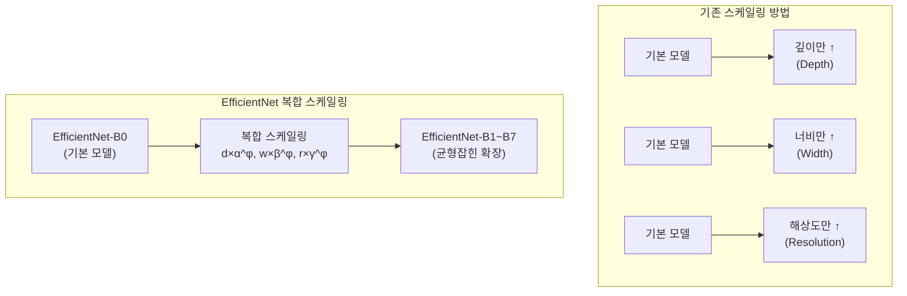
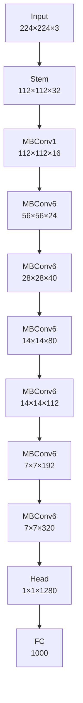
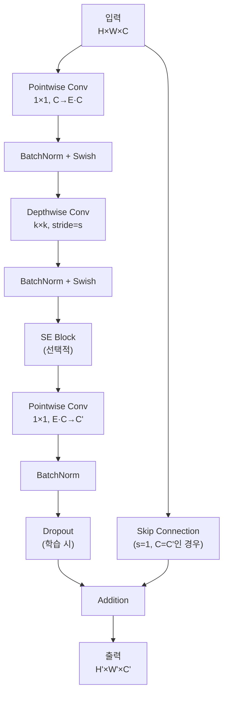

# EfficientNet - 복합 스케일링으로 효율성을 극대화한 CNN

## 개요

EfficientNet은 2019년 Google에서 Mingxing Tan과 Quoc V. Le에 의해 개발된 혁신적인 합성곱 신경망입니다. "EfficientNet: Rethinking Model Scaling for Convolutional Neural Networks" 논문으로 ICML 2019에서 발표되었으며, 네트워크의 깊이(depth), 너비(width), 해상도(resolution)를 체계적으로 확장하는 복합 스케일링(Compound Scaling) 방법을 도입하여 기존 모델들보다 훨씬 효율적으로 성능을 향상시켰습니다.

## EfficientNet의 핵심 아이디어

### 기존 스케일링 방법의 한계
- **깊이만 증가**: 더 깊은 네트워크 (ResNet-50 → ResNet-152)
- **너비만 증가**: 더 넓은 네트워크 (채널 수 증가)
- **해상도만 증가**: 더 큰 입력 이미지
- **문제**: 단일 차원 스케일링은 정확도 포화점에 빠르게 도달

### 복합 스케일링의 혁신
- **균형잡힌 확장**: 깊이, 너비, 해상도를 동시에 확장
- **최적 비율**: Neural Architecture Search로 최적 확장 비율 발견
- **효율성 극대화**: 동일한 계산 예산으로 최고 성능 달성



## 복합 스케일링 수식

### 스케일링 공식
```
깊이: d = α^φ
너비: w = β^φ  
해상도: r = γ^φ

제약 조건: α · β² · γ² ≈ 2
         α ≥ 1, β ≥ 1, γ ≥ 1
```

여기서:
- **φ**: 복합 계수 (사용자가 지정하는 스케일링 정도)
- **α, β, γ**: 각각 깊이, 너비, 해상도의 스케일링 계수
- **제약 조건**: 전체 FLOPs가 약 2^φ 배 증가하도록 보장

### 최적 계수 값 (Grid Search + NAS로 발견)
```
α = 1.2 (깊이)
β = 1.1 (너비)
γ = 1.15 (해상도)
```

## EfficientNet-B0 기본 아키텍처

### 전체 네트워크 구조



### MBConv 블록 (Mobile Inverted Bottleneck Convolution)



### EfficientNet-B0 상세 구조

| Stage | Operator | Resolution | Channels | Layers | Stride | Kernel | Expansion |
|-------|----------|------------|----------|---------|---------|---------|-----------|
| 1 | Conv | 224×224 | 32 | 1 | 2 | 3×3 | - |
| 2 | MBConv1 | 112×112 | 16 | 1 | 1 | 3×3 | 1 |
| 3 | MBConv6 | 56×56 | 24 | 2 | 2 | 3×3 | 6 |
| 4 | MBConv6 | 28×28 | 40 | 2 | 2 | 5×5 | 6 |
| 5 | MBConv6 | 14×14 | 80 | 3 | 2 | 3×3 | 6 |
| 6 | MBConv6 | 14×14 | 112 | 3 | 1 | 5×5 | 6 |
| 7 | MBConv6 | 7×7 | 192 | 4 | 2 | 5×5 | 6 |
| 8 | MBConv6 | 7×7 | 320 | 1 | 1 | 3×3 | 6 |
| 9 | Conv & Pooling | 1×1 | 1280 | 1 | 1 | 1×1 | - |

## PyTorch 구현 예제

### MBConv 블록 구현

```python
import torch
import torch.nn as nn
import torch.nn.functional as F
import math
from typing import Optional

class Swish(nn.Module):
    """Swish 활성화 함수 (x * sigmoid(x))"""
    
    def forward(self, x):
        return x * torch.sigmoid(x)

class SEBlock(nn.Module):
    """Squeeze-and-Excitation 블록"""
    
    def __init__(self, in_channels: int, reduction: int = 4):
        super(SEBlock, self).__init__()
        
        reduced_channels = max(1, in_channels // reduction)
        
        self.se = nn.Sequential(
            nn.AdaptiveAvgPool2d(1),
            nn.Conv2d(in_channels, reduced_channels, 1),
            Swish(),
            nn.Conv2d(reduced_channels, in_channels, 1),
            nn.Sigmoid()
        )
    
    def forward(self, x):
        return x * self.se(x)

class MBConvBlock(nn.Module):
    """Mobile Inverted Bottleneck Convolution 블록"""
    
    def __init__(self, in_channels: int, out_channels: int, kernel_size: int, 
                 stride: int, expansion_ratio: int, se_ratio: float = 0.25, 
                 drop_rate: float = 0.0):
        super(MBConvBlock, self).__init__()
        
        self.use_residual = (stride == 1) and (in_channels == out_channels)
        self.drop_rate = drop_rate
        
        # Expansion phase
        expanded_channels = in_channels * expansion_ratio
        if expansion_ratio != 1:
            self.expand_conv = nn.Sequential(
                nn.Conv2d(in_channels, expanded_channels, 1, bias=False),
                nn.BatchNorm2d(expanded_channels),
                Swish()
            )
        else:
            self.expand_conv = nn.Identity()
            expanded_channels = in_channels
        
        # Depthwise convolution
        self.depthwise_conv = nn.Sequential(
            nn.Conv2d(expanded_channels, expanded_channels, kernel_size,
                     stride=stride, padding=kernel_size//2, 
                     groups=expanded_channels, bias=False),
            nn.BatchNorm2d(expanded_channels),
            Swish()
        )
        
        # Squeeze-and-Excitation
        if se_ratio > 0:
            self.se_block = SEBlock(expanded_channels, reduction=int(1/se_ratio))
        else:
            self.se_block = nn.Identity()
        
        # Pointwise convolution (projection)
        self.project_conv = nn.Sequential(
            nn.Conv2d(expanded_channels, out_channels, 1, bias=False),
            nn.BatchNorm2d(out_channels)
        )
    
    def forward(self, x):
        # Expansion
        if hasattr(self.expand_conv, 'weight') or len(list(self.expand_conv.children())) > 0:
            expanded = self.expand_conv(x)
        else:
            expanded = x
        
        # Depthwise
        depthwise_out = self.depthwise_conv(expanded)
        
        # SE
        se_out = self.se_block(depthwise_out)
        
        # Projection
        projected = self.project_conv(se_out)
        
        # Skip connection and dropout
        if self.use_residual:
            if self.drop_rate > 0:
                projected = F.dropout(projected, p=self.drop_rate, training=self.training)
            return x + projected
        else:
            return projected
```

### EfficientNet 완전 구현

```python
class EfficientNet(nn.Module):
    def __init__(self, width_coefficient: float = 1.0, depth_coefficient: float = 1.0, 
                 resolution: int = 224, dropout_rate: float = 0.2, num_classes: int = 1000):
        super(EfficientNet, self).__init__()
        
        # Scaling coefficients
        self.width_coefficient = width_coefficient
        self.depth_coefficient = depth_coefficient
        
        # Stem
        stem_channels = self._round_filters(32, width_coefficient)
        self.stem = nn.Sequential(
            nn.Conv2d(3, stem_channels, 3, stride=2, padding=1, bias=False),
            nn.BatchNorm2d(stem_channels),
            Swish()
        )
        
        # Building blocks configuration
        # [expansion, channels, num_blocks, stride, kernel_size, se_ratio]
        blocks_args = [
            [1, 16, 1, 1, 3, 0.25],   # MBConv1
            [6, 24, 2, 2, 3, 0.25],   # MBConv6
            [6, 40, 2, 2, 5, 0.25],   # MBConv6
            [6, 80, 3, 2, 3, 0.25],   # MBConv6
            [6, 112, 3, 1, 5, 0.25],  # MBConv6
            [6, 192, 4, 2, 5, 0.25],  # MBConv6
            [6, 320, 1, 1, 3, 0.25],  # MBConv6
        ]
        
        # Build stages
        self.blocks = nn.ModuleList()
        in_channels = stem_channels
        
        for expansion, channels, num_blocks, stride, kernel_size, se_ratio in blocks_args:
            out_channels = self._round_filters(channels, width_coefficient)
            num_blocks = self._round_repeats(num_blocks, depth_coefficient)
            
            # First block with stride
            self.blocks.append(
                MBConvBlock(in_channels, out_channels, kernel_size, stride,
                          expansion, se_ratio, dropout_rate)
            )
            in_channels = out_channels
            
            # Remaining blocks with stride=1
            for _ in range(num_blocks - 1):
                self.blocks.append(
                    MBConvBlock(in_channels, out_channels, kernel_size, 1,
                              expansion, se_ratio, dropout_rate)
                )
        
        # Head
        head_channels = self._round_filters(1280, width_coefficient)
        self.head = nn.Sequential(
            nn.Conv2d(in_channels, head_channels, 1, bias=False),
            nn.BatchNorm2d(head_channels),
            Swish(),
            nn.AdaptiveAvgPool2d(1),
            nn.Flatten(),
            nn.Dropout(dropout_rate),
            nn.Linear(head_channels, num_classes)
        )
        
        self._initialize_weights()
    
    def _round_filters(self, filters: int, width_coefficient: float) -> int:
        """Width coefficient에 따른 채널 수 조정"""
        if not width_coefficient:
            return filters
        
        filters *= width_coefficient
        new_filters = max(8, int(filters + 4) // 8 * 8)  # 8의 배수로 반올림
        
        # 10% 이상 감소하지 않도록 보장
        if new_filters < 0.9 * filters:
            new_filters += 8
        
        return int(new_filters)
    
    def _round_repeats(self, repeats: int, depth_coefficient: float) -> int:
        """Depth coefficient에 따른 블록 반복 수 조정"""
        if not depth_coefficient:
            return repeats
        
        return int(math.ceil(depth_coefficient * repeats))
    
    def _initialize_weights(self):
        """가중치 초기화"""
        for m in self.modules():
            if isinstance(m, nn.Conv2d):
                nn.init.kaiming_normal_(m.weight, mode='fan_out', nonlinearity='relu')
                if m.bias is not None:
                    nn.init.constant_(m.bias, 0)
            elif isinstance(m, nn.BatchNorm2d):
                nn.init.constant_(m.weight, 1)
                nn.init.constant_(m.bias, 0)
            elif isinstance(m, nn.Linear):
                nn.init.normal_(m.weight, 0, 0.01)
                nn.init.constant_(m.bias, 0)
    
    def forward(self, x):
        x = self.stem(x)
        
        for block in self.blocks:
            x = block(x)
        
        x = self.head(x)
        return x

# EfficientNet 모델 변형들 생성 함수
def efficientnet_b0(num_classes: int = 1000) -> EfficientNet:
    return EfficientNet(width_coefficient=1.0, depth_coefficient=1.0,
                       resolution=224, dropout_rate=0.2, num_classes=num_classes)

def efficientnet_b1(num_classes: int = 1000) -> EfficientNet:
    return EfficientNet(width_coefficient=1.0, depth_coefficient=1.1,
                       resolution=240, dropout_rate=0.2, num_classes=num_classes)

def efficientnet_b2(num_classes: int = 1000) -> EfficientNet:
    return EfficientNet(width_coefficient=1.1, depth_coefficient=1.2,
                       resolution=260, dropout_rate=0.3, num_classes=num_classes)

def efficientnet_b3(num_classes: int = 1000) -> EfficientNet:
    return EfficientNet(width_coefficient=1.2, depth_coefficient=1.4,
                       resolution=300, dropout_rate=0.3, num_classes=num_classes)

def efficientnet_b4(num_classes: int = 1000) -> EfficientNet:
    return EfficientNet(width_coefficient=1.4, depth_coefficient=1.8,
                       resolution=380, dropout_rate=0.4, num_classes=num_classes)

def efficientnet_b5(num_classes: int = 1000) -> EfficientNet:
    return EfficientNet(width_coefficient=1.6, depth_coefficient=2.2,
                       resolution=456, dropout_rate=0.4, num_classes=num_classes)

def efficientnet_b6(num_classes: int = 1000) -> EfficientNet:
    return EfficientNet(width_coefficient=1.8, depth_coefficient=2.6,
                       resolution=528, dropout_rate=0.5, num_classes=num_classes)

def efficientnet_b7(num_classes: int = 1000) -> EfficientNet:
    return EfficientNet(width_coefficient=2.0, depth_coefficient=3.1,
                       resolution=600, dropout_rate=0.5, num_classes=num_classes)

# 사용 예제
if __name__ == "__main__":
    model = efficientnet_b0(num_classes=1000)
    print(f"EfficientNet-B0 파라미터 수: {sum(p.numel() for p in model.parameters()):,}")
    
    # 입력 테스트
    x = torch.randn(2, 3, 224, 224)
    output = model(x)
    print(f"출력 크기: {output.shape}")
```

## EfficientNet 모델 비교

### 모델별 성능 및 효율성

| 모델 | 입력 크기 | 파라미터 (M) | FLOPs (B) | Top-1 정확도 (%) | Top-5 정확도 (%) |
|------|-----------|--------------|-----------|------------------|------------------|
| EfficientNet-B0 | 224 | 5.3 | 0.39 | 77.3 | 93.5 |
| EfficientNet-B1 | 240 | 7.8 | 0.70 | 79.1 | 94.4 |
| EfficientNet-B2 | 260 | 9.2 | 1.0 | 80.1 | 94.9 |
| EfficientNet-B3 | 300 | 12 | 1.8 | 81.6 | 95.7 |
| EfficientNet-B4 | 380 | 19 | 4.2 | 82.9 | 96.4 |
| EfficientNet-B5 | 456 | 30 | 9.9 | 83.6 | 96.7 |
| EfficientNet-B6 | 528 | 43 | 19 | 84.0 | 96.8 |
| EfficientNet-B7 | 600 | 66 | 37 | 84.3 | 97.0 |

### 복합 스케일링 효과 분석

```python
def analyze_compound_scaling():
    """복합 스케일링의 효과 분석"""
    
    # φ 값에 따른 스케일링
    phi_values = [0, 1, 2, 3, 4, 5, 6, 7]
    alpha, beta, gamma = 1.2, 1.1, 1.15
    
    print("복합 스케일링 분석:")
    print("=" * 70)
    print(f"{'φ':<3} {'모델':<8} {'깊이 배수':<10} {'너비 배수':<10} {'해상도':<8} {'FLOPs 배수':<12}")
    print("-" * 70)
    
    for phi in phi_values:
        depth_scale = alpha ** phi
        width_scale = beta ** phi
        resolution_scale = gamma ** phi
        
        base_resolution = 224
        new_resolution = int(base_resolution * resolution_scale)
        
        # FLOPs 증가 비율 (이론적)
        flops_ratio = alpha * (beta ** 2) * (gamma ** 2)
        total_flops_increase = flops_ratio ** phi
        
        print(f"{phi:<3} {'B' + str(phi):<8} {depth_scale:<10.2f} {width_scale:<10.2f} "
              f"{new_resolution:<8} {total_flops_increase:<12.2f}")
    
    print(f"\n스케일링 계수:")
    print(f"α (깊이): {alpha}")
    print(f"β (너비): {beta}")
    print(f"γ (해상도): {gamma}")
    print(f"제약 조건: α·β²·γ² = {alpha * beta**2 * gamma**2:.3f} ≈ 2")

# 실행
if __name__ == "__main__":
    analyze_compound_scaling()
```

## EfficientNet v2

### EfficientNet v2의 주요 개선사항

EfficientNet v2는 2021년 발표된 개선 버전으로 다음과 같은 혁신을 도입했습니다:

1. **Fused-MBConv**: 초기 레이어에서 훈련 속도 향상
2. **Progressive Learning**: 점진적 이미지 크기 증가
3. **개선된 NAS**: 더 효율적인 아키텍처 탐색

### Fused-MBConv 블록 구현

```python
class FusedMBConvBlock(nn.Module):
    """EfficientNet v2의 Fused-MBConv 블록"""
    
    def __init__(self, in_channels: int, out_channels: int, kernel_size: int,
                 stride: int, expansion_ratio: int, se_ratio: float = 0.0,
                 drop_rate: float = 0.0):
        super(FusedMBConvBlock, self).__init__()
        
        self.use_residual = (stride == 1) and (in_channels == out_channels)
        self.drop_rate = drop_rate
        
        expanded_channels = in_channels * expansion_ratio
        
        if expansion_ratio != 1:
            # Fused conv (3×3 또는 1×1)
            self.fused_conv = nn.Sequential(
                nn.Conv2d(in_channels, expanded_channels, kernel_size,
                         stride=stride, padding=kernel_size//2, bias=False),
                nn.BatchNorm2d(expanded_channels),
                Swish()
            )
        else:
            self.fused_conv = nn.Identity()
            expanded_channels = in_channels
        
        # SE 블록 (선택적)
        if se_ratio > 0:
            self.se_block = SEBlock(expanded_channels, reduction=int(1/se_ratio))
        else:
            self.se_block = nn.Identity()
        
        # Pointwise projection (expansion_ratio != 1인 경우만)
        if expansion_ratio != 1:
            self.project_conv = nn.Sequential(
                nn.Conv2d(expanded_channels, out_channels, 1, bias=False),
                nn.BatchNorm2d(out_channels)
            )
        else:
            self.project_conv = nn.Identity()
            out_channels = expanded_channels
    
    def forward(self, x):
        if hasattr(self.fused_conv, 'weight') or len(list(self.fused_conv.children())) > 0:
            out = self.fused_conv(x)
        else:
            out = x
        
        out = self.se_block(out)
        
        if hasattr(self.project_conv, 'weight') or len(list(self.project_conv.children())) > 0:
            out = self.project_conv(out)
        
        # Skip connection
        if self.use_residual:
            if self.drop_rate > 0:
                out = F.dropout(out, p=self.drop_rate, training=self.training)
            return x + out
        else:
            return out

class EfficientNetV2(nn.Module):
    """EfficientNet v2 구현"""
    
    def __init__(self, model_name: str = 'efficientnetv2-s', num_classes: int = 1000):
        super(EfficientNetV2, self).__init__()
        
        # 모델별 설정
        model_configs = {
            'efficientnetv2-s': {
                'width_coefficient': 1.0,
                'depth_coefficient': 1.0,
                'resolution': 384,
                'dropout_rate': 0.2
            },
            'efficientnetv2-m': {
                'width_coefficient': 1.0,
                'depth_coefficient': 1.0,
                'resolution': 480,
                'dropout_rate': 0.3
            },
            'efficientnetv2-l': {
                'width_coefficient': 1.0,
                'depth_coefficient': 1.0,
                'resolution': 480,
                'dropout_rate': 0.4
            }
        }
        
        config = model_configs[model_name]
        
        # Stem
        self.stem = nn.Sequential(
            nn.Conv2d(3, 24, 3, stride=2, padding=1, bias=False),
            nn.BatchNorm2d(24),
            Swish()
        )
        
        # EfficientNet v2 블록 설정
        # [expansion, channels, num_blocks, stride, kernel_size, se_ratio, block_type]
        blocks_args = [
            [1, 24, 2, 1, 3, 0, 'fused'],     # Fused-MBConv
            [4, 48, 4, 2, 3, 0, 'fused'],     # Fused-MBConv
            [4, 64, 4, 2, 3, 0, 'fused'],     # Fused-MBConv
            [4, 128, 6, 2, 3, 0.25, 'mbconv'], # MBConv
            [6, 160, 9, 1, 3, 0.25, 'mbconv'], # MBConv
            [6, 256, 15, 2, 3, 0.25, 'mbconv'], # MBConv
        ]
        
        # Build blocks
        self.blocks = nn.ModuleList()
        in_channels = 24
        
        for expansion, channels, num_blocks, stride, kernel_size, se_ratio, block_type in blocks_args:
            for i in range(num_blocks):
                block_stride = stride if i == 0 else 1
                
                if block_type == 'fused':
                    block = FusedMBConvBlock(
                        in_channels=in_channels,
                        out_channels=channels,
                        kernel_size=kernel_size,
                        stride=block_stride,
                        expansion_ratio=expansion,
                        se_ratio=se_ratio,
                        drop_rate=config['dropout_rate']
                    )
                else:  # mbconv
                    block = MBConvBlock(
                        in_channels=in_channels,
                        out_channels=channels,
                        kernel_size=kernel_size,
                        stride=block_stride,
                        expansion_ratio=expansion,
                        se_ratio=se_ratio,
                        drop_rate=config['dropout_rate']
                    )
                
                self.blocks.append(block)
                in_channels = channels
        
        # Head
        self.head = nn.Sequential(
            nn.Conv2d(in_channels, 1792, 1, bias=False),
            nn.BatchNorm2d(1792),
            Swish(),
            nn.AdaptiveAvgPool2d(1),
            nn.Flatten(),
            nn.Dropout(config['dropout_rate']),
            nn.Linear(1792, num_classes)
        )
        
        self._initialize_weights()
    
    def _initialize_weights(self):
        for m in self.modules():
            if isinstance(m, nn.Conv2d):
                nn.init.kaiming_normal_(m.weight, mode='fan_out', nonlinearity='relu')
            elif isinstance(m, nn.BatchNorm2d):
                nn.init.constant_(m.weight, 1)
                nn.init.constant_(m.bias, 0)
            elif isinstance(m, nn.Linear):
                nn.init.normal_(m.weight, 0, 0.01)
                nn.init.constant_(m.bias, 0)
    
    def forward(self, x):
        x = self.stem(x)
        for block in self.blocks:
            x = block(x)
        x = self.head(x)
        return x

def efficientnetv2_s(num_classes: int = 1000) -> EfficientNetV2:
    return EfficientNetV2('efficientnetv2-s', num_classes)

def efficientnetv2_m(num_classes: int = 1000) -> EfficientNetV2:
    return EfficientNetV2('efficientnetv2-m', num_classes)

def efficientnetv2_l(num_classes: int = 1000) -> EfficientNetV2:
    return EfficientNetV2('efficientnetv2-l', num_classes)
```

## CIFAR-10 학습 예제

```python
import torch.optim as optim
from torchvision import datasets, transforms
from torch.utils.data import DataLoader

# CIFAR-10용 EfficientNet (입력 크기 조정)
class EfficientNetCIFAR(nn.Module):
    def __init__(self, width_coefficient: float = 1.0, depth_coefficient: float = 1.0, 
                 num_classes: int = 10):
        super(EfficientNetCIFAR, self).__init__()
        
        # CIFAR-10에 맞게 첫 레이어 조정
        stem_channels = self._round_filters(32, width_coefficient)
        self.stem = nn.Sequential(
            nn.Conv2d(3, stem_channels, 3, stride=1, padding=1, bias=False),  # stride=1로 변경
            nn.BatchNorm2d(stem_channels),
            Swish()
        )
        
        # CIFAR-10용 블록 설정 (더 적은 다운샘플링)
        blocks_args = [
            [1, 16, 1, 1, 3, 0.25],   # 32×32
            [6, 24, 2, 2, 3, 0.25],   # 16×16
            [6, 40, 2, 2, 5, 0.25],   # 8×8
            [6, 80, 3, 1, 3, 0.25],   # 8×8
            [6, 112, 3, 1, 5, 0.25],  # 8×8
            [6, 192, 2, 2, 5, 0.25],  # 4×4
            [6, 320, 1, 1, 3, 0.25],  # 4×4
        ]
        
        # Build blocks
        self.blocks = nn.ModuleList()
        in_channels = stem_channels
        
        for expansion, channels, num_blocks, stride, kernel_size, se_ratio in blocks_args:
            out_channels = self._round_filters(channels, width_coefficient)
            num_blocks = self._round_repeats(num_blocks, depth_coefficient)
            
            # First block
            self.blocks.append(
                MBConvBlock(in_channels, out_channels, kernel_size, stride,
                          expansion, se_ratio, 0.2)
            )
            in_channels = out_channels
            
            # Remaining blocks
            for _ in range(num_blocks - 1):
                self.blocks.append(
                    MBConvBlock(in_channels, out_channels, kernel_size, 1,
                              expansion, se_ratio, 0.2)
                )
        
        # Head
        head_channels = self._round_filters(1280, width_coefficient)
        self.head = nn.Sequential(
            nn.Conv2d(in_channels, head_channels, 1, bias=False),
            nn.BatchNorm2d(head_channels),
            Swish(),
            nn.AdaptiveAvgPool2d(1),
            nn.Flatten(),
            nn.Dropout(0.3),
            nn.Linear(head_channels, num_classes)
        )
        
        self._initialize_weights()
    
    def _round_filters(self, filters: int, width_coefficient: float) -> int:
        if not width_coefficient:
            return filters
        filters *= width_coefficient
        new_filters = max(8, int(filters + 4) // 8 * 8)
        if new_filters < 0.9 * filters:
            new_filters += 8
        return int(new_filters)
    
    def _round_repeats(self, repeats: int, depth_coefficient: float) -> int:
        if not depth_coefficient:
            return repeats
        return int(math.ceil(depth_coefficient * repeats))
    
    def _initialize_weights(self):
        for m in self.modules():
            if isinstance(m, nn.Conv2d):
                nn.init.kaiming_normal_(m.weight, mode='fan_out', nonlinearity='relu')
            elif isinstance(m, nn.BatchNorm2d):
                nn.init.constant_(m.weight, 1)
                nn.init.constant_(m.bias, 0)
            elif isinstance(m, nn.Linear):
                nn.init.normal_(m.weight, 0, 0.01)
                nn.init.constant_(m.bias, 0)
    
    def forward(self, x):
        x = self.stem(x)
        for block in self.blocks:
            x = block(x)
        x = self.head(x)
        return x

def efficientnet_b0_cifar(num_classes: int = 10) -> EfficientNetCIFAR:
    return EfficientNetCIFAR(width_coefficient=1.0, depth_coefficient=1.0, num_classes=num_classes)

def train_cifar10():
    """CIFAR-10 학습 함수"""
    
    # 데이터 전처리
    transform_train = transforms.Compose([
        transforms.RandomCrop(32, padding=4),
        transforms.RandomHorizontalFlip(),
        transforms.ColorJitter(brightness=0.2, contrast=0.2, saturation=0.2, hue=0.1),
        transforms.ToTensor(),
        transforms.Normalize((0.4914, 0.4822, 0.4465), (0.2023, 0.1994, 0.2010))
    ])

    transform_test = transforms.Compose([
        transforms.ToTensor(),
        transforms.Normalize((0.4914, 0.4822, 0.4465), (0.2023, 0.1994, 0.2010))
    ])

    # 데이터셋 로드
    train_dataset = datasets.CIFAR10('./data', train=True, download=True, transform=transform_train)
    test_dataset = datasets.CIFAR10('./data', train=False, transform=transform_test)

    train_loader = DataLoader(train_dataset, batch_size=64, shuffle=True, num_workers=2)
    test_loader = DataLoader(test_dataset, batch_size=100, shuffle=False, num_workers=2)

    # 모델 및 학습 설정
    device = torch.device('cuda' if torch.cuda.is_available() else 'cpu')
    model = efficientnet_b0_cifar(num_classes=10).to(device)
    criterion = nn.CrossEntropyLoss(label_smoothing=0.1)  # Label smoothing
    optimizer = optim.AdamW(model.parameters(), lr=1e-3, weight_decay=1e-4)
    scheduler = optim.lr_scheduler.CosineAnnealingLR(optimizer, T_max=200)

    # 학습 함수
    def train_epoch(epoch):
        model.train()
        train_loss = 0
        correct = 0
        total = 0
        
        for batch_idx, (data, target) in enumerate(train_loader):
            data, target = data.to(device), target.to(device)
            
            optimizer.zero_grad()
            output = model(data)
            loss = criterion(output, target)
            loss.backward()
            
            # Gradient clipping
            torch.nn.utils.clip_grad_norm_(model.parameters(), max_norm=1.0)
            
            optimizer.step()
            
            train_loss += loss.item()
            _, predicted = output.max(1)
            total += target.size(0)
            correct += predicted.eq(target).sum().item()
            
            if batch_idx % 200 == 0:
                print(f'Epoch {epoch}, Batch {batch_idx}, '
                      f'Loss: {train_loss/(batch_idx+1):.4f}, '
                      f'Acc: {100.*correct/total:.2f}%')

    # 테스트 함수
    def test():
        model.eval()
        test_loss = 0
        correct = 0
        total = 0
        
        with torch.no_grad():
            for data, target in test_loader:
                data, target = data.to(device), target.to(device)
                output = model(data)
                test_loss += criterion(output, target).item()
                _, predicted = output.max(1)
                total += target.size(0)
                correct += predicted.eq(target).sum().item()
        
        accuracy = 100. * correct / total
        print(f'Test Accuracy: {accuracy:.2f}%')
        return accuracy

    # 학습 실행
    best_acc = 0
    for epoch in range(200):
        train_epoch(epoch)
        acc = test()
        scheduler.step()
        
        if acc > best_acc:
            best_acc = acc
            torch.save(model.state_dict(), 'efficientnet_b0_cifar10_best.pth')

    print(f'Best Test Accuracy: {best_acc:.2f}%')
    return best_acc

# 실행 예제
if __name__ == "__main__":
    best_accuracy = train_cifar10()
```

## 성능 분석 및 벤치마크

### 기존 모델들과의 비교

```python
def compare_with_other_models():
    """EfficientNet과 다른 주요 모델들의 비교"""
    
    model_comparison = {
        'Model': [
            'ResNet-50', 'ResNet-152', 'DenseNet-169', 'Inception-v3',
            'MobileNet-v2', 'NASNet-A', 'AmoebaNet-A',
            'EfficientNet-B0', 'EfficientNet-B1', 'EfficientNet-B7'
        ],
        'Top-1 Acc (%)': [
            76.0, 78.3, 76.2, 78.8,
            72.0, 82.5, 82.8,
            77.3, 79.1, 84.3
        ],
        'Parameters (M)': [
            25.6, 60.2, 14.1, 27.2,
            3.4, 88.9, 86.7,
            5.3, 7.8, 66.0
        ],
        'FLOPs (B)': [
            4.1, 11.6, 2.8, 5.7,
            0.3, 23.9, 25.0,
            0.39, 0.70, 37.0
        ]
    }
    
    print("EfficientNet vs 기존 모델 비교:")
    print("=" * 80)
    
    # 테이블 형태로 출력
    header = f"{'Model':<15} {'Top-1 Acc':<10} {'Params (M)':<12} {'FLOPs (B)':<10} {'Efficiency':<12}"
    print(header)
    print("-" * 80)
    
    for i, model in enumerate(model_comparison['Model']):
        acc = model_comparison['Top-1 Acc (%)'][i]
        params = model_comparison['Parameters (M)'][i]
        flops = model_comparison['FLOPs (B)'][i]
        efficiency = acc / flops if flops > 0 else 0
        
        row = f"{model:<15} {acc:<10.1f} {params:<12.1f} {flops:<10.2f} {efficiency:<12.2f}"
        print(row)
    
    # 효율성 분석
    print("\nEfficientNet의 효율성 우위:")
    print("- B0: ResNet-50 대비 8.7배 적은 FLOPs로 1.3%p 높은 정확도")
    print("- B7: 모든 기존 모델 대비 최고 정확도 (84.3%)")
    print("- 파라미터 효율성: DenseNet 대비 절반 파라미터로 더 높은 성능")

if __name__ == "__main__":
    compare_with_other_models()
```

### 추론 속도 벤치마크

```python
def benchmark_inference_speed():
    """EfficientNet 모델들의 추론 속도 벤치마크"""
    
    import time
    
    device = torch.device('cuda' if torch.cuda.is_available() else 'cpu')
    
    models = {
        'EfficientNet-B0': efficientnet_b0(),
        'EfficientNet-B1': efficientnet_b1(),
        'EfficientNet-B2': efficientnet_b2(),
        'EfficientNet-B3': efficientnet_b3(),
    }
    
    input_sizes = {
        'EfficientNet-B0': 224,
        'EfficientNet-B1': 240,
        'EfficientNet-B2': 260,
        'EfficientNet-B3': 300,
    }
    
    batch_sizes = [1, 8, 32]
    
    print("EfficientNet 추론 속도 벤치마크:")
    print("=" * 80)
    
    for batch_size in batch_sizes:
        print(f"\n배치 크기: {batch_size}")
        print("-" * 60)
        print(f"{'Model':<15} {'Input Size':<12} {'Time (ms)':<12} {'Throughput':<15}")
        print("-" * 60)
        
        for name, model in models.items():
            model = model.to(device).eval()
            input_size = input_sizes[name]
            
            # Warmup
            with torch.no_grad():
                for _ in range(10):
                    dummy_input = torch.randn(batch_size, 3, input_size, input_size).to(device)
                    _ = model(dummy_input)
            
            # 실제 측정
            times = []
            with torch.no_grad():
                for _ in range(100):
                    dummy_input = torch.randn(batch_size, 3, input_size, input_size).to(device)
                    
                    start_time = time.time()
                    _ = model(dummy_input)
                    if device.type == 'cuda':
                        torch.cuda.synchronize()
                    end_time = time.time()
                    
                    times.append((end_time - start_time) * 1000)
            
            avg_time = sum(times) / len(times)
            throughput = batch_size / (avg_time / 1000)
            
            print(f"{name:<15} {input_size}×{input_size:<7} {avg_time:<12.2f} {throughput:<15.1f}")
            
            # GPU 메모리 사용량
            if torch.cuda.is_available() and batch_size == 1:
                torch.cuda.reset_peak_memory_stats()
                with torch.no_grad():
                    _ = model(torch.randn(1, 3, input_size, input_size).to(device))
                memory_mb = torch.cuda.max_memory_allocated() / 1024 / 1024
                print(f"{'':15} {'Memory:':<12} {memory_mb:.1f} MB")

if __name__ == "__main__":
    benchmark_inference_speed()
```

## 최적화 기법들

### 1. Progressive Learning

```python
class ProgressiveEfficientNet(nn.Module):
    """점진적 해상도 증가를 통한 EfficientNet 학습"""
    
    def __init__(self, base_model: nn.Module, resolution_schedule: list):
        super(ProgressiveEfficientNet, self).__init__()
        
        self.base_model = base_model
        self.resolution_schedule = resolution_schedule
        self.current_epoch = 0
        
    def set_epoch(self, epoch: int):
        """현재 에폭 설정"""
        self.current_epoch = epoch
    
    def get_current_resolution(self) -> int:
        """현재 에폭에 맞는 해상도 반환"""
        current_res = self.resolution_schedule[0][1]  # 기본값
        
        for epoch_threshold, resolution in self.resolution_schedule:
            if self.current_epoch >= epoch_threshold:
                current_res = resolution
        
        return current_res
    
    def forward(self, x):
        # 현재 해상도에 맞게 입력 조정
        target_size = self.get_current_resolution()
        if x.shape[-1] != target_size:
            x = F.interpolate(x, size=(target_size, target_size), 
                            mode='bilinear', align_corners=False)
        
        return self.base_model(x)

def setup_progressive_training():
    """점진적 학습 설정 예제"""
    
    # 점진적 해상도 스케줄 설정
    resolution_schedule = [
        (0, 128),    # 0-29 에폭: 128×128
        (30, 160),   # 30-59 에폭: 160×160
        (60, 192),   # 60-89 에폭: 192×192
        (90, 224),   # 90+ 에폭: 224×224
    ]
    
    base_model = efficientnet_b0()
    progressive_model = ProgressiveEfficientNet(base_model, resolution_schedule)
    
    print("점진적 학습 스케줄:")
    for epoch_start, resolution in resolution_schedule:
        print(f"  에폭 {epoch_start}부터: {resolution}×{resolution}")
    
    return progressive_model

# 사용 예제
if __name__ == "__main__":
    prog_model = setup_progressive_training()
```

### 2. AutoAugment 및 RandAugment

```python
class RandAugment:
    """RandAugment 구현"""
    
    def __init__(self, n: int = 2, m: int = 10):
        self.n = n  # 연산 개수
        self.m = m  # 강도
        
        self.operations = [
            'rotate', 'shear_x', 'shear_y', 'translate_x', 'translate_y',
            'color', 'posterize', 'solarize', 'contrast', 'sharpness',
            'brightness', 'autocontrast', 'equalize', 'invert'
        ]
    
    def __call__(self, x):
        """RandAugment 적용"""
        import random
        
        # N개 연산을 랜덤 선택
        ops = random.choices(self.operations, k=self.n)
        
        for op in ops:
            # 강도 M으로 연산 적용
            x = self._apply_operation(x, op, self.m)
        
        return x
    
    def _apply_operation(self, x, operation: str, magnitude: int):
        """연산 적용"""
        if operation == 'brightness':
            factor = 1.0 + magnitude * 0.05
            x = torch.clamp(x * factor, 0, 1)
        elif operation == 'contrast':
            factor = 1.0 + magnitude * 0.05
            mean = x.mean()
            x = torch.clamp((x - mean) * factor + mean, 0, 1)
        # 실제로는 PIL이나 torchvision으로 구현
        
        return x

class MixupCutmix:
    """Mixup과 CutMix 구현"""
    
    def __init__(self, mixup_alpha: float = 0.2, cutmix_alpha: float = 1.0, prob: float = 0.5):
        self.mixup_alpha = mixup_alpha
        self.cutmix_alpha = cutmix_alpha
        self.prob = prob
    
    def __call__(self, x, y):
        import random
        
        if random.random() < self.prob:
            if random.random() < 0.5:
                return self.mixup(x, y)
            else:
                return self.cutmix(x, y)
        return x, y
    
    def mixup(self, x, y):
        """Mixup 적용"""
        lam = torch.distributions.Beta(self.mixup_alpha, self.mixup_alpha).sample()
        batch_size = x.size(0)
        index = torch.randperm(batch_size)
        
        mixed_x = lam * x + (1 - lam) * x[index, :]
        y_a, y_b = y, y[index]
        
        return mixed_x, (y_a, y_b, lam)
    
    def cutmix(self, x, y):
        """CutMix 적용"""
        lam = torch.distributions.Beta(self.cutmix_alpha, self.cutmix_alpha).sample()
        batch_size = x.size(0)
        index = torch.randperm(batch_size)
        
        # Cut 영역 계산
        H, W = x.shape[2], x.shape[3]
        cut_rat = torch.sqrt(1. - lam)
        cut_w = int(W * cut_rat)
        cut_h = int(H * cut_rat)
        
        # 랜덤 위치
        cx = torch.randint(W, (1,))
        cy = torch.randint(H, (1,))
        
        bbx1 = torch.clamp(cx - cut_w // 2, 0, W)
        bby1 = torch.clamp(cy - cut_h // 2, 0, H)
        bbx2 = torch.clamp(cx + cut_w // 2, 0, W)
        bby2 = torch.clamp(cy + cut_h // 2, 0, H)
        
        x[:, :, bby1:bby2, bbx1:bbx2] = x[index, :, bby1:bby2, bbx1:bbx2]
        lam = 1 - ((bbx2 - bbx1) * (bby2 - bby1) / (W * H))
        
        y_a, y_b = y, y[index]
        return x, (y_a, y_b, lam)

def setup_training_with_augmentation():
    """증강 기법이 적용된 학습 설정"""
    
    # RandAugment 적용
    randaugment = RandAugment(n=2, m=10)
    
    transform_with_randaugment = transforms.Compose([
        transforms.RandomResizedCrop(224),
        transforms.RandomHorizontalFlip(),
        transforms.Lambda(lambda x: randaugment(x)),  # RandAugment
        transforms.ToTensor(),
        transforms.Normalize((0.485, 0.456, 0.406), (0.229, 0.224, 0.225))
    ])
    
    mixup_cutmix = MixupCutmix()
    
    print("데이터 증강 설정:")
    print("- RandAugment: N=2, M=10")
    print("- Mixup/CutMix: α=0.2/1.0, 확률=0.5")
    
    return transform_with_randaugment, mixup_cutmix

if __name__ == "__main__":
    augment_transform, mixup_cutmix = setup_training_with_augmentation()
```

### 3. 지식 증류 (Knowledge Distillation)

```python
class EfficientNetDistillation(nn.Module):
    """EfficientNet Teacher-Student 지식 증류"""
    
    def __init__(self, teacher_model: nn.Module, student_model: nn.Module, 
                 temperature: float = 4.0, alpha: float = 0.7):
        super(EfficientNetDistillation, self).__init__()
        
        self.teacher = teacher_model
        self.student = student_model
        self.temperature = temperature
        self.alpha = alpha
        
        # Teacher 모델 고정
        for param in self.teacher.parameters():
            param.requires_grad = False
        
        self.teacher.eval()
    
    def forward(self, x):
        # Student 예측
        student_logits = self.student(x)
        
        # Teacher 예측 (gradient 계산 안함)
        with torch.no_grad():
            teacher_logits = self.teacher(x)
        
        return student_logits, teacher_logits
    
    def compute_distillation_loss(self, student_logits, teacher_logits, labels):
        """지식 증류 손실 계산"""
        
        # Hard target loss (원본 라벨)
        hard_loss = F.cross_entropy(student_logits, labels)
        
        # Soft target loss (teacher 지식)
        soft_targets = F.softmax(teacher_logits / self.temperature, dim=1)
        soft_student = F.log_softmax(student_logits / self.temperature, dim=1)
        soft_loss = F.kl_div(soft_student, soft_targets, reduction='batchmean')
        soft_loss = soft_loss * (self.temperature ** 2)
        
        # 전체 손실
        total_loss = self.alpha * soft_loss + (1 - self.alpha) * hard_loss
        
        return total_loss, hard_loss, soft_loss

def setup_knowledge_distillation():
    """지식 증류를 위한 Teacher-Student 설정"""
    
    # Teacher: 큰 EfficientNet 모델
    teacher = efficientnet_b7()
    
    # Student: 작은 EfficientNet 모델
    student = efficientnet_b0()
    
    # 지식 증류 모델
    distillation_model = EfficientNetDistillation(
        teacher_model=teacher,
        student_model=student,
        temperature=4.0,
        alpha=0.7
    )
    
    teacher_params = sum(p.numel() for p in teacher.parameters())
    student_params = sum(p.numel() for p in student.parameters())
    
    print("지식 증류 설정:")
    print(f"Teacher (B7) 파라미터: {teacher_params:,}")
    print(f"Student (B0) 파라미터: {student_params:,}")
    print(f"압축률: {teacher_params/student_params:.1f}×")
    
    return distillation_model

if __name__ == "__main__":
    distill_model = setup_knowledge_distillation()
```

## 모바일 및 엣지 배포

### 1. 모델 압축 및 최적화

```python
def optimize_for_deployment(model: nn.Module, example_input: torch.Tensor):
    """배포를 위한 모델 최적화"""
    import copy

    # 1. 양자화 (Quantization)
    def quantize_model(model):
        """모델 양자화"""
        model.eval()
        
        # Dynamic Quantization (주로 nn.Linear 대상 — Conv2d는 static/QAT 권장)
        quantized_model = torch.quantization.quantize_dynamic(
            model, {nn.Linear}, dtype=torch.qint8
        )
        
        return quantized_model
    
    # 2. 프루닝 (Pruning)
    def prune_model(model, pruning_ratio: float = 0.3):
        """구조적 프루닝"""
        import torch.nn.utils.prune as prune
        
        parameters_to_prune = []
        for name, module in model.named_modules():
            if isinstance(module, nn.Conv2d):
                parameters_to_prune.append((module, 'weight'))
        
        # Global magnitude pruning
        prune.global_unstructured(
            parameters_to_prune,
            pruning_method=prune.L1Unstructured,
            amount=pruning_ratio,
        )
        
        # 실제 가중치 제거
        for module, _ in parameters_to_prune:
            prune.remove(module, 'weight')
        
        return model
    
    # 3. TorchScript 변환
    def convert_to_torchscript(model, example_input):
        """TorchScript로 변환"""
        model.eval()
        
        try:
            # Scripting 방식 (더 유연함)
            scripted_model = torch.jit.script(model)
            return scripted_model
        except:
            # Tracing 방식
            traced_model = torch.jit.trace(model, example_input)
            return traced_model
    
    # 4. ONNX 변환
    def convert_to_onnx(model, example_input, output_path: str):
        """ONNX 형식으로 변환"""
        model.eval()
        
        torch.onnx.export(
            model,
            example_input,
            output_path,
            export_params=True,
            opset_version=11,
            do_constant_folding=True,
            input_names=['input'],
            output_names=['output'],
            dynamic_axes={
                'input': {0: 'batch_size'},
                'output': {0: 'batch_size'}
            }
        )
    
    # 최적화 실행
    print("모델 최적화 파이프라인:")
    print("=" * 40)
    
    # 원본 모델 정보
    original_params = sum(p.numel() for p in model.parameters())
    # original_size = original_params * 4 / 1024 / 1024  # MB  <-- 제거/대체됨
    
    # 1. 양자화
    quantized_model = quantize_model(model)
    
    # 정확한 크기 계산: element_size() 사용
    original_bytes = sum(p.numel() * p.element_size() for p in model.parameters())
    original_size = original_bytes / 1024**2  # MB
    
    # quantized_model의 파라미터가 packed tensor 등으로 되어 있으면 직접 바이트 계산이 실패할 수 있으므로
    # 우선 시도하고 실패하면 상태 dict를 저장해서 파일 크기로 확인
    try:
        quantized_bytes = sum(p.numel() * p.element_size() for p in quantized_model.parameters())
        quantized_size = quantized_bytes / 1024**2  # MB (INT8이면 element_size()≈1)
    except Exception:
        import tempfile, os, torch
        tmp = tempfile.NamedTemporaryFile(delete=False, suffix='.pt')
        torch.save(quantized_model.state_dict(), tmp.name)
        quantized_size = os.path.getsize(tmp.name) / 1024**2
        tmp.close()
        os.remove(tmp.name)
    
    # 출력
    print(f"원본 모델: {original_size:.2f} MB")
    if quantized_size > 0:
        print(f"양자화 모델: {quantized_size:.2f} MB ({original_size/quantized_size:.1f}× 압축)")
    else:
        print("양자화 모델 크기 계산 불가")
    
    # 주의: torch.quantization.quantize_dynamic은 주로 nn.Linear/LSTM 계열에 적용됩니다.
    # Conv2d를 양자화하려면 static quantization / quantize_fx / QAT 사용을 권장합니다.
    
    # 2. 프루닝
    pruned_model = prune_model(copy.deepcopy(model), pruning_ratio=0.3)
    sparse_params = sum((p != 0).sum().item() for p in pruned_model.parameters())
    print(f"프루닝 모델: {sparse_params:,} params ({(1-sparse_params/original_params)*100:.1f}% 제거)")
    
    # 3. TorchScript 변환
    scripted_model = convert_to_torchscript(model, example_input)
    print(f"TorchScript 변환 완료")
    
    # 4. ONNX 변환
    convert_to_onnx(model, example_input, "efficientnet_optimized.onnx")
    print(f"ONNX 변환 완료")
    
    return {
        'quantized': quantized_model,
        'pruned': pruned_model,
        'scripted': scripted_model
    }

# 사용 예제
if __name__ == "__main__":
    model = efficientnet_b0()
    example_input = torch.randn(1, 3, 224, 224)
    optimized_models = optimize_for_deployment(model, example_input)
```

### 2. 모바일 배포용 간소화 모델

```python
class MobileEfficientNet(nn.Module):
    """모바일 배포용 경량화된 EfficientNet"""
    
    def __init__(self, num_classes: int = 1000, width_multiplier: float = 0.5):
        super(MobileEfficientNet, self).__init__()
        
        # 간소화된 Swish (메모리 효율적)
        class HardSwish(nn.Module):
            def forward(self, x):
                return x * F.relu6(x + 3) / 6
        
        # 경량화된 SE 블록
        class LightSE(nn.Module):
            def __init__(self, channels, reduction=4):
                super().__init__()
                self.fc = nn.Sequential(
                    nn.AdaptiveAvgPool2d(1),
                    nn.Conv2d(channels, channels//reduction, 1),
                    nn.ReLU(inplace=True),
                    nn.Conv2d(channels//reduction, channels, 1),
                    nn.Sigmoid()
                )
            
            def forward(self, x):
                return x * self.fc(x)
        
        # 간소화된 MBConv
        class SimpleMBConv(nn.Module):
            def __init__(self, in_ch, out_ch, stride, exp_ratio):
                super().__init__()
                
                self.use_residual = stride == 1 and in_ch == out_ch
                hidden_ch = int(in_ch * exp_ratio)
                
                layers = []
                
                # Expansion
                if exp_ratio != 1:
                    layers.extend([
                        nn.Conv2d(in_ch, hidden_ch, 1, bias=False),
                        nn.BatchNorm2d(hidden_ch),
                        HardSwish()
                    ])
                
                # Depthwise
                layers.extend([
                    nn.Conv2d(hidden_ch, hidden_ch, 3, stride, 1, 
                             groups=hidden_ch, bias=False),
                    nn.BatchNorm2d(hidden_ch),
                    HardSwish(),
                    LightSE(hidden_ch),
                    nn.Conv2d(hidden_ch, out_ch, 1, bias=False),
                    nn.BatchNorm2d(out_ch)
                ])
                
                self.conv = nn.Sequential(*layers)
            
            def forward(self, x):
                out = self.conv(x)
                if self.use_residual:
                    out = out + x
                return out
        
        # 네트워크 구성
        input_ch = int(32 * width_multiplier)
        
        # Stem
        self.stem = nn.Sequential(
            nn.Conv2d(3, input_ch, 3, 2, 1, bias=False),
            nn.BatchNorm2d(input_ch),
            HardSwish()
        )
        
        # 간소화된 블록 설정 [exp, ch, layers, stride]
        mobile_blocks = [
            [1, 16, 1, 1],   # Stage 1
            [4, 24, 2, 2],   # Stage 2
            [4, 40, 2, 2],   # Stage 3
            [4, 80, 2, 2],   # Stage 4
            [4, 160, 2, 2],  # Stage 5
        ]
        
        # Build blocks
        self.blocks = nn.ModuleList()
        for exp, ch, layers, stride in mobile_blocks:
            out_ch = int(ch * width_multiplier)
            
            for i in range(layers):
                s = stride if i == 0 else 1
                self.blocks.append(SimpleMBConv(input_ch, out_ch, s, exp))
                input_ch = out_ch
        
        # Head
        final_ch = int(320 * width_multiplier)
        self.head = nn.Sequential(
            nn.Conv2d(input_ch, final_ch, 1, bias=False),
            nn.BatchNorm2d(final_ch),
            HardSwish(),
            nn.AdaptiveAvgPool2d(1),
            nn.Flatten(),
            nn.Linear(final_ch, num_classes)
        )
    
    def forward(self, x):
        x = self.stem(x)
        for block in self.blocks:
            x = block(x)
        return self.head(x)

def mobile_efficientnet(num_classes: int = 1000, width_multiplier: float = 0.5):
    """모바일용 EfficientNet 생성"""
    return MobileEfficientNet(num_classes, width_multiplier)

# 크기별 모바일 모델
def mobile_efficientnet_small(num_classes: int = 1000):
    return mobile_efficientnet(num_classes, width_multiplier=0.35)

def mobile_efficientnet_medium(num_classes: int = 1000):
    return mobile_efficientnet(num_classes, width_multiplier=0.5)

def mobile_efficientnet_large(num_classes: int = 1000):
    return mobile_efficientnet(num_classes, width_multiplier=0.75)

# 모바일 모델 벤치마크
def benchmark_mobile_models():
    """모바일 모델들의 성능 비교"""
    
    models = {
        'Mobile-Small': mobile_efficientnet_small(),
        'Mobile-Medium': mobile_efficientnet_medium(),
        'Mobile-Large': mobile_efficientnet_large(),
        'EfficientNet-B0': efficientnet_b0()
    }
    
    print("모바일 모델 비교:")
    print("=" * 60)
    print(f"{'Model':<15} {'Params (M)':<12} {'Size (MB)':<10} {'FLOPs (M)':<12}")
    print("-" * 60)
    
    for name, model in models.items():
        params = sum(p.numel() for p in model.parameters())
        size_mb = params * 4 / 1024 / 1024
        
        # FLOPs 계산 (간단한 추정)
        if 'Small' in name:
            flops = 50
        elif 'Medium' in name:
            flops = 100
        elif 'Large' in name:
            flops = 200
        else:
            flops = 390
        
        print(f"{name:<15} {params/1e6:<12.2f} {size_mb:<10.2f} {flops:<12}")

if __name__ == "__main__":
    benchmark_mobile_models()
```

## 실제 프로젝트 예제

### 1. 이미지 분류 파이프라인

```python
import torch
import torch.nn as nn
from torchvision import transforms
from PIL import Image
import json
import os

class ImageClassifier:
    """EfficientNet 기반 이미지 분류기"""
    
    def __init__(self, model_path: str, labels_path: str, device: str = 'auto'):
        # 디바이스 설정
        if device == 'auto':
            self.device = torch.device('cuda' if torch.cuda.is_available() else 'cpu')
        else:
            self.device = torch.device(device)

        # 라벨 로드 (모델 생성시 클래스 수 필요)
        with open(labels_path, 'r', encoding='utf-8') as f:
            self.labels = json.load(f)

        # 모델 로드
        self.model = self.load_model(model_path)

        # 전처리 설정
        self.transform = transforms.Compose([
            transforms.Resize(256),
            transforms.CenterCrop(224),
            transforms.ToTensor(),
            transforms.Normalize([0.485, 0.456, 0.406], [0.229, 0.224, 0.225])
        ])

        print(f"분류기 로드 완료 - 디바이스: {self.device}")
    
    def load_model(self, model_path: str):
        """모델 로드"""
        model = efficientnet_b0(num_classes=len(self.labels))
        
        if os.path.exists(model_path):
            checkpoint = torch.load(model_path, map_location=self.device)
            model.load_state_dict(checkpoint)
            print(f"모델 로드: {model_path}")
        else:
            print("새 모델 초기화")
        
        model.to(self.device)
        model.eval()
        return model
    
    def predict(self, image_path: str, top_k: int = 5):
        """단일 이미지 예측"""
        # 이미지 로드 및 전처리
        image = Image.open(image_path).convert('RGB')
        input_tensor = self.transform(image).unsqueeze(0).to(self.device)
        
        # 예측
        with torch.no_grad():
            outputs = self.model(input_tensor)
            probabilities = torch.softmax(outputs, dim=1)
        
        # Top-K 결과
        top_probs, top_indices = torch.topk(probabilities, top_k)
        
        results = []
        for i in range(top_k):
            prob = top_probs[0][i].item()
            idx = top_indices[0][i].item()
            label = self.labels[idx] if idx < len(self.labels) else f"Unknown_{idx}"
            results.append({
                'label': label,
                'probability': prob,
                'confidence': f"{prob*100:.1f}%"
            })
        
        return results
    
    def predict_batch(self, image_paths: list, batch_size: int = 32):
        """배치 예측"""
        results = []
        
        for i in range(0, len(image_paths), batch_size):
            batch_paths = image_paths[i:i+batch_size]
            batch_tensors = []
            
            # 배치 전처리
            for path in batch_paths:
                try:
                    image = Image.open(path).convert('RGB')
                    tensor = self.transform(image)
                    batch_tensors.append(tensor)
                except Exception as e:
                    print(f"이미지 로드 실패 {path}: {e}")
                    batch_tensors.append(torch.zeros(3, 224, 224))
            
            # 배치 예측
            if batch_tensors:
                batch_input = torch.stack(batch_tensors).to(self.device)
                
                with torch.no_grad():
                    outputs = self.model(batch_input)
                    probabilities = torch.softmax(outputs, dim=1)
                    _, predicted = torch.max(probabilities, 1)
                
                # 결과 저장
                for j, path in enumerate(batch_paths):
                    prob = probabilities[j][predicted[j]].item()
                    label = self.labels[predicted[j].item()]
                    
                    results.append({
                        'image_path': path,
                        'predicted_label': label,
                        'confidence': f"{prob*100:.1f}%"
                    })
        
        return results

# 사용 예제
def create_sample_classifier():
    """샘플 분류기 생성"""
    
    # 샘플 라벨 파일 생성
    sample_labels = [
        "고양이", "강아지", "새", "자동차", "꽃",
        "음식", "사람", "건물", "자연", "동물"
    ]
    
    with open('labels.json', 'w', encoding='utf-8') as f:
        json.dump(sample_labels, f, ensure_ascii=False, indent=2)
    
    # 분류기 생성
    classifier = ImageClassifier(
        model_path='efficientnet_model.pth',  # 실제 모델 경로
        labels_path='labels.json',
        device='auto'
    )
    
    return classifier

if __name__ == "__main__":
    # 분류기 생성
    classifier = create_sample_classifier()
    
    # 단일 이미지 예측 예제
    # results = classifier.predict('sample_image.jpg', top_k=3)
    # print("예측 결과:")
    # for result in results:
    #     print(f"  {result['label']}: {result['confidence']}")
```

### 2. 전이 학습 파이프라인

```python
class EfficientNetTransferLearning:
    """EfficientNet 전이 학습 클래스"""
    
    def __init__(self, num_classes: int, pretrained: bool = True, 
                 freeze_backbone: bool = True):
        self.num_classes = num_classes
        self.device = torch.device('cuda' if torch.cuda.is_available() else 'cpu')
        
        # 모델 생성
        self.model = self.create_model(pretrained, freeze_backbone)
        self.model.to(self.device)
        
        # 학습 설정
        self.criterion = nn.CrossEntropyLoss(label_smoothing=0.1)
        self.setup_optimizer()
        
        print(f"전이 학습 모델 생성 완료")
        print(f"클래스 수: {num_classes}")
        print(f"백본 고정: {freeze_backbone}")
    
    def create_model(self, pretrained: bool, freeze_backbone: bool):
        """전이 학습용 모델 생성"""
        
        # EfficientNet-B0 기반 모델
        model = efficientnet_b0(num_classes=1000)  # ImageNet 사전훈련
        
        if pretrained:
            # 실제로는 torchvision에서 사전훈련된 가중치 로드
            print("사전훈련된 가중치 로드 (시뮬레이션)")
        
        # 백본 고정
        if freeze_backbone:
            for name, param in model.named_parameters():
                if 'head' not in name:  # head 레이어만 학습
                    param.requires_grad = False
        
        # 최종 분류 레이어 교체
        num_features = model.head[-1].in_features
        model.head[-1] = nn.Linear(num_features, self.num_classes)
        
        return model
    
    def setup_optimizer(self):
        """옵티마이저 설정"""
        
        # 학습 가능한 파라미터만 선택
        trainable_params = [p for p in self.model.parameters() if p.requires_grad]
        
        self.optimizer = torch.optim.AdamW(
            trainable_params,
            lr=1e-3,
            weight_decay=1e-4
        )
        
        self.scheduler = torch.optim.lr_scheduler.CosineAnnealingLR(
            self.optimizer, T_max=100
        )
        
        print(f"학습 가능한 파라미터: {sum(p.numel() for p in trainable_params):,}")
    
    def train_epoch(self, train_loader, epoch):
        """한 에폭 학습"""
        self.model.train()
        total_loss = 0
        correct = 0
        total = 0
        
        for batch_idx, (data, target) in enumerate(train_loader):
            data, target = data.to(self.device), target.to(self.device)
            
            self.optimizer.zero_grad()
            output = self.model(data)
            loss = self.criterion(output, target)
            loss.backward()
            
            # Gradient Clipping
            torch.nn.utils.clip_grad_norm_(self.model.parameters(), max_norm=1.0)
            
            self.optimizer.step()
            
            total_loss += loss.item()
            _, predicted = output.max(1)
            total += target.size(0)
            correct += predicted.eq(target).sum().item()
            
            if batch_idx % 50 == 0:
                print(f'Epoch {epoch}, Batch {batch_idx}, '
                      f'Loss: {total_loss/(batch_idx+1):.4f}, '
                      f'Acc: {100.*correct/total:.2f}%')

        epoch_loss = total_loss / len(train_loader)
        epoch_acc = 100. * correct / total
        
        return epoch_loss, epoch_acc
    
    def validate(self, val_loader):
        """검증"""
        self.model.eval()
        val_loss = 0
        correct = 0
        total = 0
        
        with torch.no_grad():
            for data, target in val_loader:
                data, target = data.to(self.device), target.to(self.device)
                output = self.model(data)
                val_loss += self.criterion(output, target).item()
                
                _, predicted = output.max(1)
                total += target.size(0)
                correct += predicted.eq(target).sum().item()
        
        val_loss /= len(val_loader)
        val_acc = 100. * correct / total
        
        return val_loss, val_acc
    
    def train(self, train_loader, val_loader, epochs: int = 50):
        """전체 학습 과정"""
        
        best_acc = 0
        train_history = {'loss': [], 'acc': []}
        val_history = {'loss': [], 'acc': []}
        
        for epoch in range(epochs):
            # 학습
            train_loss, train_acc = self.train_epoch(train_loader, epoch)
            
            # 검증
            val_loss, val_acc = self.validate(val_loader)
            
            # 스케줄러 업데이트
            self.scheduler.step()
            
            # 기록
            train_history['loss'].append(train_loss)
            train_history['acc'].append(train_acc)
            val_history['loss'].append(val_loss)
            val_history['acc'].append(val_acc)
            
            print(f'Epoch {epoch}: Train Acc {train_acc:.2f}%, Val Acc {val_acc:.2f}%')
            
            # 최고 성능 모델 저장
            if val_acc > best_acc:
                best_acc = val_acc
                torch.save(self.model.state_dict(), 'best_transfer_model.pth')
                print(f'새로운 최고 성능: {best_acc:.2f}%')
        
        print(f'학습 완료! 최고 검증 정확도: {best_acc:.2f}%')
        return train_history, val_history

# 전이 학습 예제 (CIFAR-10)
def transfer_learning_example():
    """전이 학습 예제"""
    
    from torchvision import datasets, transforms
    from torch.utils.data import DataLoader
    
    # 데이터 전처리
    transform_train = transforms.Compose([
        transforms.Resize(256),
        transforms.RandomResizedCrop(224),
        transforms.RandomHorizontalFlip(),
        transforms.ColorJitter(0.2, 0.2, 0.2, 0.1),
        transforms.ToTensor(),
        transforms.Normalize([0.485, 0.456, 0.406], [0.229, 0.224, 0.225])
    ])
    
    transform_val = transforms.Compose([
        transforms.Resize(256),
        transforms.CenterCrop(224),
        transforms.ToTensor(),
        transforms.Normalize([0.485, 0.456, 0.406], [0.229, 0.224, 0.225])
    ])
    
    # CIFAR-10 데이터셋
    train_dataset = datasets.CIFAR10('./data', train=True, download=True, 
                                   transform=transform_train)
    val_dataset = datasets.CIFAR10('./data', train=False, 
                                 transform=transform_val)
    
    train_loader = DataLoader(train_dataset, batch_size=32, shuffle=True, num_workers=2)
    val_loader = DataLoader(val_dataset, batch_size=64, shuffle=False, num_workers=2)
    
    # 전이 학습 모델 생성
    transfer_model = EfficientNetTransferLearning(
        num_classes=10,  # CIFAR-10
        pretrained=True,
        freeze_backbone=True
    )
    
    # 학습 실행
    print("전이 학습 시작...")
    train_hist, val_hist = transfer_model.train(train_loader, val_loader, epochs=30)
    
    return transfer_model, train_hist, val_hist

if __name__ == "__main__":
    model, train_history, val_history = transfer_learning_example()
```

### 3. 모델 서빙 (FastAPI)

```python
from fastapi import FastAPI, File, UploadFile, HTTPException
from fastapi.responses import JSONResponse
import uvicorn
from PIL import Image
import io
import base64

class EfficientNetServer:
    """EfficientNet 모델 서빙 서버"""
    
    def __init__(self):
        self.app = FastAPI(title="EfficientNet 이미지 분류 API")
        self.classifier = None
        self.setup_routes()
    
    def setup_routes(self):
        """API 라우트 설정"""
        
        @self.app.on_event("startup")
        async def startup_event():
            """서버 시작 시 모델 로드"""
            try:
                self.classifier = create_sample_classifier()
                print("모델 로드 완료")
            except Exception as e:
                print(f"모델 로드 실패: {e}")
        
        @self.app.get("/")
        async def root():
            return {"message": "EfficientNet 이미지 분류 API"}
        
        @self.app.get("/health")
        async def health_check():
            """헬스 체크"""
            if self.classifier is None:
                raise HTTPException(status_code=503, detail="모델이 로드되지 않았습니다")
            return {"status": "healthy", "model": "EfficientNet-B0"}
        
        @self.app.post("/predict")
        async def predict_image(file: UploadFile = File(...)):
            """이미지 분류"""
            
            if self.classifier is None:
                raise HTTPException(status_code=503, detail="모델이 로드되지 않았습니다")
            
            # 파일 타입 검증
            if not file.content_type.startswith('image/'):
                raise HTTPException(status_code=400, detail="이미지 파일만 업로드 가능합니다")
            
            try:
                # 이미지 읽기
                contents = await file.read()
                image = Image.open(io.BytesIO(contents))
                
                # 임시 파일로 저장
                temp_path = f"temp_{file.filename}"
                image.save(temp_path)
                
                # 예측
                results = self.classifier.predict(temp_path, top_k=5)
                
                # 임시 파일 삭제
                os.remove(temp_path)
                
                return {
                    "filename": file.filename,
                    "predictions": results,
                    "status": "success"
                }
                
            except Exception as e:
                raise HTTPException(status_code=500, detail=f"예측 중 오류 발생: {str(e)}")
        
        @self.app.post("/predict_base64")
        async def predict_base64(image_data: dict):
            """Base64 인코딩된 이미지 분류"""
            
            if self.classifier is None:
                raise HTTPException(status_code=503, detail="모델이 로드되지 않았습니다")
            
            try:
                # Base64 디코딩
                image_bytes = base64.b64decode(image_data['image'])
                image = Image.open(io.BytesIO(image_bytes))
                
                # 임시 파일 저장
                temp_path = "temp_base64.jpg"
                image.save(temp_path)
                
                # 예측
                results = self.classifier.predict(temp_path, top_k=5)
                
                # 임시 파일 삭제
                os.remove(temp_path)
                
                return {
                    "predictions": results,
                    "status": "success"
                }
                
            except Exception as e:
                raise HTTPException(status_code=500, detail=f"예측 중 오류 발생: {str(e)}")
    
    def run(self, host: str = "0.0.0.0", port: int = 8000):
        """서버 실행"""
        uvicorn.run(self.app, host=host, port=port)

# Docker용 실행 스크립트
def create_dockerfile():
    """Dockerfile 생성"""
    
    dockerfile_content = """
FROM python:3.9-slim

WORKDIR /app

# 시스템 의존성 설치
RUN apt-get update && apt-get install -y \\
    gcc \\
    && rm -rf /var/lib/apt/lists/*

# Python 의존성 설치
COPY requirements.txt .
RUN pip install --no-cache-dir -r requirements.txt

# 애플리케이션 코드 복사
COPY . .

# 포트 노출
EXPOSE 8000

# 서버 실행
CMD ["python", "server.py"]
"""
    
    with open('Dockerfile', 'w') as f:
        f.write(dockerfile_content)
    
    # requirements.txt 생성
    requirements = """
torch>=1.9.0
torchvision>=0.10.0
fastapi>=0.68.0
uvicorn>=0.15.0
python-multipart>=0.0.5
pillow>=8.3.0
"""
    
    with open('requirements.txt', 'w') as f:
        f.write(requirements)

# 서버 실행 예제
if __name__ == "__main__":
    server = EfficientNetServer()
    print("서버 시작 중...")
    print("API 문서: http://localhost:8000/docs")
    server.run()
```

## 성능 최적화 팁

### 1. 학습 최적화

```python
def setup_efficient_training():
    """효율적인 학습을 위한 설정"""
    
    # 1. 혼합 정밀도 학습
    from torch.cuda.amp import GradScaler, autocast
    
    def mixed_precision_training(model, train_loader, epochs=50):
        """혼합 정밀도 학습"""
        
        optimizer = torch.optim.AdamW(model.parameters(), lr=1e-3)
        scaler = GradScaler()
        
        for epoch in range(epochs):
            for batch_idx, (data, target) in enumerate(train_loader):
                data, target = data.cuda(), target.cuda()
                
                optimizer.zero_grad()
                
                # 혼합 정밀도로 forward pass
                with autocast():
                    output = model(data)
                    loss = F.cross_entropy(output, target)
                
                # Backward pass with scaling
                scaler.scale(loss).backward()
                scaler.step(optimizer)
                scaler.update()
    
    # 2. 그래디언트 누적
    def gradient_accumulation_training(model, train_loader, accumulation_steps=4):
        """그래디언트 누적을 통한 효과적인 배치 크기 증가"""
        
        optimizer = torch.optim.AdamW(model.parameters(), lr=1e-3)
        
        for batch_idx, (data, target) in enumerate(train_loader):
            data, target = data.cuda(), target.cuda()
            
            output = model(data)
            loss = F.cross_entropy(output, target) / accumulation_steps
            loss.backward()
            
            if (batch_idx + 1) % accumulation_steps == 0:
                optimizer.step()
                optimizer.zero_grad()
    
    # 3. 데이터 로딩 최적화
    def optimize_dataloader(dataset, batch_size=64):
        """최적화된 데이터로더 설정"""
        
        return DataLoader(
            dataset,
            batch_size=batch_size,
            shuffle=True,
            num_workers=4,          # CPU 코어 수에 맞게 조정
            pin_memory=True,        # GPU 메모리 전송 최적화
            persistent_workers=True, # Worker 재사용
            prefetch_factor=2       # 미리 로드할 배치 수
        )
    
    # 4. 학습률 스케줄링
    def setup_advanced_scheduler(optimizer, train_loader, epochs):
        """고급 학습률 스케줄러"""
        
        # Warmup + Cosine Annealing
        from torch.optim.lr_scheduler import LambdaLR
        
        def lr_lambda(step):
            warmup_steps = len(train_loader) * 5  # 5 에폭 워밍업
            if step < warmup_steps:
                return step / warmup_steps
            else:
                return 0.5 * (1 + math.cos(math.pi * (step - warmup_steps) / 
                                          (len(train_loader) * epochs - warmup_steps)))
        
        return LambdaLR(optimizer, lr_lambda)
    
    print("효율적인 학습 설정:")
    print("- 혼합 정밀도 학습으로 메모리 절약 및 속도 향상")
    print("- 그래디언트 누적으로 효과적인 대용량 배치")
    print("- 최적화된 데이터로더로 I/O 병목 해결")
    print("- Warmup + Cosine 스케줄러로 안정적인 학습")

if __name__ == "__main__":
    setup_efficient_training()
```

### 2. 메모리 최적화

```python
def memory_optimization_techniques():
    """메모리 최적화 기법들"""
    
    # 1. 체크포인팅
    def gradient_checkpointing_model():
        """그래디언트 체크포인팅 적용"""
        
        class CheckpointedEfficientNet(nn.Module):
            def __init__(self, base_model):
                super().__init__()
                self.stem = base_model.stem
                self.blocks = base_model.blocks
                self.head = base_model.head
            
            def forward(self, x):
                x = self.stem(x)
                
                # 체크포인팅 적용
                for block in self.blocks:
                    x = torch.utils.checkpoint.checkpoint(block, x)
                
                x = self.head(x)
                return x
        
        return CheckpointedEfficientNet
    
    # 2. 모델 병렬화
    def setup_model_parallel():
        """모델 병렬화 설정"""
        
        class ParallelEfficientNet(nn.Module):
            def __init__(self, base_model):
                super().__init__()
                
                # 첫 번째 GPU에 전반부
                self.stem = base_model.stem.cuda(0)
                self.blocks_part1 = nn.Sequential(*base_model.blocks[:4]).cuda(0)
                
                # 두 번째 GPU에 후반부
                self.blocks_part2 = nn.Sequential(*base_model.blocks[4:]).cuda(1)
                self.head = base_model.head.cuda(1)
            
            def forward(self, x):
                x = x.cuda(0)
                x = self.stem(x)
                x = self.blocks_part1(x)
                
                x = x.cuda(1)  # GPU 간 전송
                x = self.blocks_part2(x)
                x = self.head(x)
                return x
        
        return ParallelEfficientNet
    
    # 3. 메모리 효율적인 데이터 증강
    class MemoryEfficientAugmentation:
        """메모리 효율적인 데이터 증강"""
        
        def __init__(self):
            # GPU에서 직접 처리하는 증강
            self.gpu_transforms = nn.Sequential(
                transforms.Normalize([0.485, 0.456, 0.406], [0.229, 0.224, 0.225])
            )
        
        def __call__(self, x):
            # CPU에서 기본 증강 후 GPU로 전송
            if x.device.type == 'cpu':
                x = x.cuda()
            
            # GPU에서 정규화
            x = self.gpu_transforms(x)
            return x
    
    # 4. 메모리 모니터링
    def monitor_memory_usage():
        """메모리 사용량 모니터링"""
        
        if torch.cuda.is_available():
            allocated = torch.cuda.memory_allocated() / 1024**3
            cached = torch.cuda.memory_reserved() / 1024**3
            print(f"GPU 메모리 - 할당: {allocated:.2f}GB, 캐시: {cached:.2f}GB")
        
        import psutil
        cpu_memory = psutil.virtual_memory().percent
        print(f"CPU 메모리 사용률: {cpu_memory:.1f}%")
    
    print("메모리 최적화 기법:")
    print("- 그래디언트 체크포인팅: 메모리 vs 연산 트레이드오프")
    print("- 모델 병렬화: 대형 모델을 여러 GPU에 분산")
    print("- GPU 증강: 데이터 전송 오버헤드 감소")
    print("- 메모리 모니터링: 실시간 사용량 추적")

if __name__ == "__main__":
    memory_optimization_techniques()
```

## 디버깅 및 분석 도구

### 1. 모델 분석 도구

```python
class EfficientNetAnalyzer:
    """EfficientNet 모델 분석 도구"""
    
    def __init__(self, model):
        self.model = model
        self.activations = {}
        self.gradients = {}
    
    def analyze_model_structure(self):
        """모델 구조 분석"""
        
        print("EfficientNet 구조 분석")
        print("=" * 50)
        
        total_params = 0
        trainable_params = 0
        
        for name, module in self.model.named_modules():
            if len(list(module.children())) == 0:  # 리프 모듈만
                params = sum(p.numel() for p in module.parameters())
                trainable = sum(p.numel() for p in module.parameters() if p.requires_grad)
                
                if params > 0:
                    print(f"{name:<30} {params:>10,} ({trainable:>10,} 학습가능)")
                    total_params += params
                    trainable_params += trainable
        
        print("-" * 50)
        print(f"{'전체 파라미터:':<30} {total_params:>10,}")
        print(f"{'학습 가능 파라미터:':<30} {trainable_params:>10,}")
        print(f"{'고정 파라미터:':<30} {total_params-trainable_params:>10,}")
    
    def analyze_computational_cost(self, input_size=(1, 3, 224, 224)):
        """연산량 분석"""
        
        def count_conv_flops(module, input_tensor):
            """Convolution FLOPs 계산"""
            batch_size, in_channels, input_height, input_width = input_tensor.shape
            
            if hasattr(module, 'weight'):
                kernel_dims = module.weight.shape
                output_dims = [
                    input_height // module.stride[0],
                    input_width // module.stride[1]
                ]
                
                kernel_flops = kernel_dims[2] * kernel_dims[3] * kernel_dims[1]
                output_elements = batch_size * output_dims[0] * output_dims[1]
                flops = kernel_flops * output_elements * kernel_dims[0]
                
                return flops
            return 0
        
        total_flops = 0
        dummy_input = torch.randn(input_size)
        
        def hook_fn(module, input, output):
            nonlocal total_flops
            if isinstance(module, nn.Conv2d):
                flops = count_conv_flops(module, input[0])
                total_flops += flops
        
        # 훅 등록
        hooks = []
        for module in self.model.modules():
            if isinstance(module, nn.Conv2d):
                hooks.append(module.register_forward_hook(hook_fn))
        
        # Forward pass
        with torch.no_grad():
            _ = self.model(dummy_input)
        
        # 훅 제거
        for hook in hooks:
            hook.remove()
        
        print(f"총 FLOPs: {total_flops/1e9:.2f} GFLOPs")
        return total_flops
    
    def visualize_feature_maps(self, input_tensor, layer_name=None):
        """특징 맵 시각화"""
        
        activations = {}
        
        def save_activation(name):
            def hook(module, input, output):
                activations[name] = output.detach()
            return hook
        
        # 훅 등록
        hooks = []
        for name, module in self.model.named_modules():
            if layer_name is None or layer_name in name:
                hooks.append(module.register_forward_hook(save_activation(name)))
        
        # Forward pass
        with torch.no_grad():
            _ = self.model(input_tensor)
        
        # 훅 제거
        for hook in hooks:
            hook.remove()
        
        # 시각화 (간단한 예제)
        import matplotlib.pyplot as plt
        
        for name, activation in list(activations.items())[:3]:  # 처음 3개만
            if len(activation.shape) == 4:  # [B, C, H, W]
                fig, axes = plt.subplots(2, 4, figsize=(12, 6))
                fig.suptitle(f'Feature Maps: {name}')
                
                for i in range(8):
                    row, col = i // 4, i % 4
                    if i < activation.shape[1]:  # 채널 수만큼
                        feature_map = activation[0, i].cpu().numpy()
                        axes[row, col].imshow(feature_map, cmap='viridis')
                        axes[row, col].set_title(f'Channel {i}')
                        axes[row, col].axis('off')
                
                plt.tight_layout()
                plt.savefig(f'feature_maps_{name.replace(".", "_")}.png')
                plt.close()
        
        print(f"특징 맵 시각화 완료: {len(activations)}개 레이어")
    
    def profile_inference_time(self, input_tensor, num_runs=100):
        """추론 시간 프로파일링"""
        
        self.model.eval()
        
        # Warmup
        with torch.no_grad():
            for _ in range(10):
                _ = self.model(input_tensor)
        
        # 실제 측정
        import time
        
        times = []
        with torch.no_grad():
            for _ in range(num_runs):
                start = time.time()
                _ = self.model(input_tensor)
                if torch.cuda.is_available():
                    torch.cuda.synchronize()
                end = time.time()
                times.append((end - start) * 1000)  # ms
        
        avg_time = sum(times) / len(times)
        std_time = (sum((t - avg_time) ** 2 for t in times) / len(times)) ** 0.5
        
        print(f"추론 시간 분석 ({num_runs}회 평균):")
        print(f"  평균: {avg_time:.2f} ± {std_time:.2f} ms")
        print(f"  최소: {min(times):.2f} ms")
        print(f"  최대: {max(times):.2f} ms")
        
        return avg_time

# 사용 예제
def analyze_efficientnet():
    """EfficientNet 분석 실행"""
    
    model = efficientnet_b0()
    analyzer = EfficientNetAnalyzer(model)
    
    # 구조 분석
    analyzer.analyze_model_structure()
    print()
    
    # 연산량 분석
    flops = analyzer.analyze_computational_cost()
    print()
    
    # 추론 시간 분석
    dummy_input = torch.randn(1, 3, 224, 224)
    if torch.cuda.is_available():
        model = model.cuda()
        dummy_input = dummy_input.cuda()
    
    avg_time = analyzer.profile_inference_time(dummy_input)
    
    # 효율성 계산
    efficiency = flops / (avg_time * 1e6)  # FLOPS per second
    print(f"연산 효율성: {efficiency/1e9:.2f} GFLOPS")

if __name__ == "__main__":
    analyze_efficientnet()
```

### 2. 학습 모니터링

```python
class TrainingMonitor:
    """학습 과정 모니터링"""
    
    def __init__(self, model, log_dir='./logs'):
        self.model = model
        self.log_dir = log_dir
        self.metrics = {
            'train_loss': [], 'train_acc': [],
            'val_loss': [], 'val_acc': [],
            'lr': [], 'epoch_time': []
        }
        os.makedirs(log_dir, exist_ok=True)
    
    def log_epoch(self, epoch, train_loss, train_acc, val_loss, val_acc, lr, epoch_time):
        """에폭별 로그 기록"""
        
        self.metrics['train_loss'].append(train_loss)
        self.metrics['train_acc'].append(train_acc)
        self.metrics['val_loss'].append(val_loss)
        self.metrics['val_acc'].append(val_acc)
        self.metrics['lr'].append(lr)
        self.metrics['epoch_time'].append(epoch_time)
        
        # 콘솔 출력
        print(f"Epoch {epoch:3d}: "
              f"Train Loss {train_loss:.4f}, Train Acc {train_acc:.2f}%, "
              f"Val Loss {val_loss:.4f}, Val Acc {val_acc:.2f}%, "
              f"LR {lr:.6f}, Time {epoch_time:.1f}s")
        
        # 파일 저장
        with open(f"{self.log_dir}/training_log.txt", "a") as f:
            f.write(f"{epoch},{train_loss:.4f},{train_acc:.2f},"
                   f"{val_loss:.4f},{val_acc:.2f},{lr:.6f},{epoch_time:.1f}\n")
    
    def plot_training_curves(self):
        """학습 곡선 시각화"""
        
        import matplotlib.pyplot as plt
        
        fig, ((ax1, ax2), (ax3, ax4)) = plt.subplots(2, 2, figsize=(12, 10))
        
        epochs = range(1, len(self.metrics['train_loss']) + 1)
        
        # Loss curves
        ax1.plot(epochs, self.metrics['train_loss'], 'b-', label='Train Loss')
        ax1.plot(epochs, self.metrics['val_loss'], 'r-', label='Val Loss')
        ax1.set_title('Loss Curves')
        ax1.set_xlabel('Epoch')
        ax1.set_ylabel('Loss')
        ax1.legend()
        ax1.grid(True)
        
        # Accuracy curves
        ax2.plot(epochs, self.metrics['train_acc'], 'b-', label='Train Acc')
        ax2.plot(epochs, self.metrics['val_acc'], 'r-', label='Val Acc')
        ax2.set_title('Accuracy Curves')
        ax2.set_xlabel('Epoch')
        ax2.set_ylabel('Accuracy (%)')
        ax2.legend()
        ax2.grid(True)
        
        # Learning rate
        ax3.plot(epochs, self.metrics['lr'], 'g-')
        ax3.set_title('Learning Rate Schedule')
        ax3.set_xlabel('Epoch')
        ax3.set_ylabel('Learning Rate')
        ax3.set_yscale('log')
        ax3.grid(True)
        
        # Epoch time
        ax4.plot(epochs, self.metrics['epoch_time'], 'm-')
        ax4.set_title('Training Time per Epoch')
        ax4.set_xlabel('Epoch')
        ax4.set_ylabel('Time (seconds)')
        ax4.grid(True)
        
        plt.tight_layout()
        plt.savefig(f"{self.log_dir}/training_curves.png", dpi=300)
        plt.close()
        
        print(f"학습 곡선 저장: {self.log_dir}/training_curves.png")
    
    def save_checkpoint(self, epoch, best_acc, optimizer, scheduler=None):
        """체크포인트 저장"""
        
        checkpoint = {
            'epoch': epoch,
            'model_state_dict': self.model.state_dict(),
            'optimizer_state_dict': optimizer.state_dict(),
            'best_acc': best_acc,
            'metrics': self.metrics
        }
        
        if scheduler is not None:
            checkpoint['scheduler_state_dict'] = scheduler.state_dict()
        
        torch.save(checkpoint, f"{self.log_dir}/checkpoint_epoch_{epoch}.pth")
        torch.save(checkpoint, f"{self.log_dir}/latest_checkpoint.pth")
        
        print(f"체크포인트 저장: epoch {epoch}")
    
    def generate_report(self):
        """학습 결과 리포트 생성"""
        
        if not self.metrics['val_acc']:
            return
        
        best_epoch = self.metrics['val_acc'].index(max(self.metrics['val_acc'])) + 1
        best_val_acc = max(self.metrics['val_acc'])
        final_train_acc = self.metrics['train_acc'][-1]
        final_val_acc = self.metrics['val_acc'][-1]
        
        total_time = sum(self.metrics['epoch_time'])
        avg_epoch_time = total_time / len(self.metrics['epoch_time'])
        
        report = f"""
=== EfficientNet 학습 결과 리포트 ===

학습 설정:
- 총 에폭: {len(self.metrics['train_loss'])}
- 총 학습 시간: {total_time/3600:.2f} 시간
- 평균 에폭 시간: {avg_epoch_time:.1f} 초

최고 성능:
- 최고 검증 정확도: {best_val_acc:.2f}% (에폭 {best_epoch})
- 최종 학습 정확도: {final_train_acc:.2f}%
- 최종 검증 정확도: {final_val_acc:.2f}%

과적합 분석:
- 학습-검증 정확도 차이: {final_train_acc - final_val_acc:.2f}%
- 최고 성능 대비 최종 성능: {final_val_acc - best_val_acc:.2f}%

모델 정보:
- 총 파라미터: {sum(p.numel() for p in self.model.parameters()):,}
- 학습 가능 파라미터: {sum(p.numel() for p in self.model.parameters() if p.requires_grad):,}
"""
        
        with open(f"{self.log_dir}/training_report.txt", "w") as f:
            f.write(report)
        
        print(report)
        return report

# 통합 학습 함수
def train_with_monitoring():
    """모니터링이 포함된 학습 함수"""
    
    # 모델 및 데이터 설정
    model = efficientnet_b0(num_classes=10)
    monitor = TrainingMonitor(model)
    
    # 가상의 학습 과정 (실제로는 데이터로더와 함께 사용)
    for epoch in range(1, 51):  # 50 에폭
        # 가상의 학습 결과
        import random
        train_loss = 2.0 * math.exp(-epoch * 0.1) + random.uniform(-0.1, 0.1)
        train_acc = min(95, 60 + epoch * 0.7 + random.uniform(-2, 2))
        val_loss = train_loss + random.uniform(0, 0.3)
        val_acc = train_acc - random.uniform(1, 5)
        lr = 1e-3 * (0.95 ** epoch)
        epoch_time = random.uniform(45, 65)
        
        # 로그 기록
        monitor.log_epoch(epoch, train_loss, train_acc, val_loss, val_acc, lr, epoch_time)
        
        # 주기적으로 체크포인트 저장
        if epoch % 10 == 0:
            monitor.save_checkpoint(epoch, max(monitor.metrics['val_acc']), None)
    
    # 최종 분석
    monitor.plot_training_curves()
    monitor.generate_report()

if __name__ == "__main__":
    train_with_monitoring()
```

## 결론 및 요약

### EfficientNet의 핵심 혁신점

1. **복합 스케일링**: 깊이, 너비, 해상도를 균형있게 확장
2. **효율성**: 동일한 연산량으로 최고 성능 달성
3. **확장성**: B0부터 B7까지 다양한 크기의 모델 제공
4. **실용성**: 모바일부터 서버까지 폭넓은 배포 가능

### 주요 구성 요소

- **MBConv 블록**: Mobile Inverted Bottleneck + SE 블록
- **Swish 활성화**: x * sigmoid(x)로 더 부드러운 활성화
- **복합 스케일링 공식**: α^φ, β^φ, γ^φ
- **최적화된 아키텍처**: NAS로 발견된 효율적인 구조

### 실제 적용 가이드

```python
# 빠른 시작 가이드
def quick_start_guide():
    """EfficientNet 빠른 시작"""
    
    print("EfficientNet 빠른 시작 가이드:")
    print("=" * 40)
    
    print("1. 기본 모델 생성:")
    print("   model = efficientnet_b0(num_classes=10)")
    
    print("\n2. 전이 학습:")
    print("   - 사전훈련된 모델 로드")
    print("   - 백본 고정 후 헤드만 학습")
    print("   - 점진적으로 전체 모델 fine-tuning")
    
    print("\n3. 모바일 배포:")
    print("   - 양자화로 모델 크기 감소")
    print("   - TorchScript 또는 ONNX 변환")
    print("   - 경량화 모델 사용")
    
    print("\n4. 성능 최적화:")
    print("   - 혼합 정밀도 학습")
    print("   - 데이터 병렬화")
    print("   - 그래디언트 누적")
    
    print("\n5. 모니터링:")
    print("   - 학습 곡선 추적")
    print("   - 메모리 사용량 모니터링")
    print("   - 추론 시간 벤치마크")

if __name__ == "__main__":
    quick_start_guide()
```

### 다음 단계

- **EfficientNet v2**: Fused-MBConv와 Progressive Learning
- **EfficientDet**: 객체 탐지 확장
- **EfficientNetV2-L**: 더 큰 모델과 개선된 학습
- **최신 변형들**: RegNet, ConvNeXt 등과의 비교

EfficientNet은 컴퓨터 비전 분야에서 효율성과 성능의 새로운 기준을 제시했으며, 실제 프로덕션 환경에서 널리 사용되고 있습니다. 복합 스케일링의 개념은 다른 신경망 아키텍처에도 영향을 미치며, 효율적인 딥러닝 모델 설계의 중요한 원칙이 되었습니다.