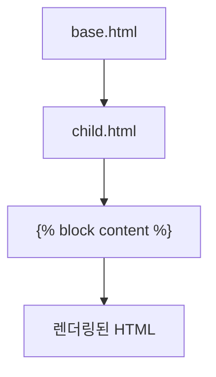

# Jinja2 HTML 템플릿 API 종합 문서

## 1. Jinja2 개요 (Overview)

Jinja2(진자투)는 Python 기반의 강력한 템플릿 엔진으로, HTML 파일 내에서 동적 데이터를 삽입하고 제어 구조를 사용할 수 있게 해줍니다. Flask, FastAPI, Django(일부) 등 다양한 웹 프레임워크에서 사용됩니다.

---

## 1.1. 기본 구분자 (Delimiters)

Jinja2는 세 가지 주요 구분자를 사용합니다.

- **출력(Expression/Output):** `{{ ... }}`
- **제어(Statements/Control):** ``
- **주석(Comment):** `{# ... #}`

---

## 1.2. 출력 구문 (Expression/Output)

### 1.2.1. 변수 출력
```html
<p>{{ username }}</p>
<p>{{ product.name }}</p>
```

### 1.2.2. 연산
```html
<p>{{ 10 + 20 }}</p>
<p>{{ price * quantity }}</p>
```

### 1.2.3. 함수 호출
```html
<p>{{ user.get_full_name() }}</p>
```

---

## 1.3. 제어 구문 (Statements/Control)

### 1.3.1. 조건문 (if, elif, else)
```html

  <p>관리자</p>

  <p>스태프</p>

  <p>일반 사용자</p>

```

### 1.3.2. 반복문 (for)
```html
<ul>

  <li>{{ loop.index }}. {{ item }}</li>

  <li>항목 없음</li>

</ul>
```

#### 1.3.2.1. loop 특수 변수
- `loop.index` / `loop.index0`
- `loop.revindex` / `loop.revindex0`
- `loop.first` / `loop.last`
- `loop.length`

### 1.3.3. set 구문 (변수 정의)
```html

<p>총합: {{ total }}</p>
```

### 1.3.4. with 구문 (지역 변수 블록)
```html

  
    <p>{{ msg }}</p>
  

```

### 1.3.5. macro 구문 (매크로 정의)
```html

  <input name="{{ name }}" type="{{ type }}">

```

### 1.3.6. include 구문 (템플릿 삽입)
```html

```

### 1.3.7. extends / block 구문 (상속)
```html


  <h1>홈</h1>

```

### 1.3.8. import 구문 (매크로 불러오기)
```html

{{ forms.input("email") }}
```

### 1.3.9. filter 구문 (블록 필터링)
```html

  이 텍스트는 대문자로 변환됩니다.

```

### 1.3.10. call 구문 (매크로 호출 블록)
```html

  <textarea name="comment"></textarea>

```

---

## 1.4. 주석 (Comments)

```html
{# 이 주석은 렌더링되지 않습니다. #}
```

---

## 1.5. 필터 (Filters)

### 1.5.1. 기본 필터
- `default(value)`
- `length`
- `trim`
- `lower`
- `upper`
- `capitalize`
- `safe`
- `striptags`
- `int`
- `list`

### 1.5.2. 예시
```html
<p>{{ "hello" | upper }}</p>
<p>{{ my_list | length }}</p>
```

---

## 1.6. 테스트 (Tests)

### 1.6.1. 기본 테스트
- `defined`
- `none`
- `even`
- `odd`
- `string`
- `iterable`

### 1.6.2. 예시
```html

  <p>사용자: {{ username }}</p>

```

---

## 1.7. 전역 함수 (Global Functions)

- `range(n)`
- `lipsum(n)`
- `cycler(...)`
- `joiner(...)`
- `dict(...)`

```html

  <p>{{ i }}</p>

```

---

## 1.8. 고급 기능

### 1.8.1. whitespace control (공백 제어)
```html
{{- variable -}}

```

### 1.8.2. super() (부모 블록 내용 가져오기)
```html

  {{ super() }}
  <link rel="stylesheet" href="/static/style.css">

```

### 1.8.3. raw 구문 (Jinja2 해석 방지)
```html

  {{ 이 부분은 Jinja2가 해석하지 않습니다 }}

```

---

## 1.9. FastAPI 특수 변수

- `request`
- `request.url`
- `request.query_params`
- `request.path_params`
- `request.headers`

---

## 1.10. Mermaid 다이어그램



---

## 1.11. 수식 표현

$$
\text{total} = \sum_{i=1}^{n} p_i \cdot q_i
$$

---

## 1.12. 전체 API 체크리스트

- 출력: `{{ ... }}`
- 제어: ``, ``, ``, ``, ``, ``, ``, ``, ``, ``, ``, ``
- 주석: `{# ... #}`
- 필터: `upper`, `lower`, `length`, `default`, `safe`, `striptags`, `int`, `list`, ...
- 테스트: `defined`, `none`, `even`, `odd`, `string`, `iterable`
- 전역 함수: `range`, `lipsum`, `cycler`, `joiner`, `dict`
- 특수 변수: `loop`, `super()`, `request`

---

## 1.13. 결론

Jinja2는 HTML 템플릿에서 **변수 출력, 제어 구조, 상속, 매크로, 필터, 테스트, 전역 함수** 등 다양한 API를 제공합니다. FastAPI와 함께 사용할 때는 `Jinja2Templates`를 통해 환경을 구성하고, `TemplateResponse`로 데이터를 전달하면 됩니다.  

이 문서는 Jinja2의 **모든 주요 API**를 포함하여, HTML 템플릿 작성 시 필요한 모든 기능을 체계적으로 정리했습니다.