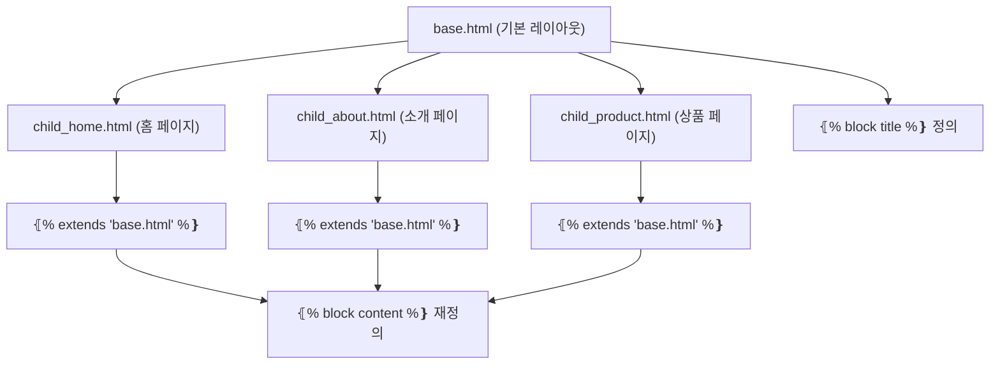

## 1\. FastAPI와 Jinja2 연동 개요 (FastAPI and Jinja2 Integration Overview)

FastAPI는 기본적으로 HTML 템플릿 렌더링 기능을 내장하고 있지 않지만, `jinja2` 라이브러리와 `python-multipart` 라이브러리를 설치하고 `fastapi.templating.Jinja2Templates` 클래스를 사용하여 쉽게 연동할 수 있습니다.

  * **필수 라이브러리 설치:**

    ```bash
    pip install jinja2 python-multipart
    ```

  * **FastAPI 애플리케이션 설정:**

    ```python
    from fastapi import FastAPI, Request
    from fastapi.templating import Jinja2Templates
    from fastapi.responses import HTMLResponse

    app = FastAPI()

    # 템플릿 파일이 저장된 디렉토리 지정 (예: "./templates" 디렉토리)
    templates = Jinja2Templates(directory="templates")

    @app.get("/", response_class=HTMLResponse)
    def read_root(request: Request):
        # templates.TemplateResponse를 사용하여 템플릿 렌더링
        # "request" 객체는 필수 컨텍스트 변수입니다.
        return templates.TemplateResponse(
            name="index.html",
            context=⦃"request": request, "title": "홈 페이지", "data": "FastAPI Jinja2 연동 성공!"❵
        )
    ```

    > **참고:** `TemplateResponse`를 사용할 때 `context` 딕셔너리에 **반드시** `request` 객체를 포함해야 합니다.

-----

## 2\. Jinja2 템플릿 문법 (Jinja2 Template Syntax)

Jinja2 템플릿 파일(일반적으로 `.html` 확장자 사용) 내에서 데이터를 출력하고, 제어 흐름을 관리하며, 코드 블록을 정의하는 데 사용되는 세 가지 주요 구분자 (Delimiter, 구분자)가 있습니다.

### 2.1. 출력 구문 (Expression/Output)

템플릿으로 전달된 변수의 값을 출력하거나, 함수 호출 및 계산 결과를 삽입할 때 사용됩니다.

  * **구문:** `⦃⦃ ... ❵❵`

  * **용도:** 변수 값 출력, 연산 결과 출력, 함수 호출 결과 출력.

  * **예시:**

    ```html
    <h1>⦃⦃ title ❵❵</h1>
    <p>현재 연도: ⦃⦃ 2024 - 1 + 1 ❵❵</p>
    <p>데이터 길이: ⦃⦃ data_list|length ❵❵</p>
    ```

### 2.2. 제어 구문 (Statement/Control Structure)

`if` 문, `for` 루프 등 프로그래밍의 제어 흐름을 구현할 때 사용됩니다.

  * **구문:** `⦃% ... %❵`

  * **용도:** 조건문 (Conditionals), 반복문 (Loops), 템플릿 상속 및 포함 (Inheritance and Includes) 등의 제어 흐름 정의.

  * **예시:**

    ```html
    ⦃% if user.is_authenticated %❵
        <p>환영합니다, ⦃⦃ user.username ❵❵!</p>
    ⦃% else %❵
        <p><a href="/login">로그인</a>이 필요합니다.</p>
    ⦃% endif %❵

    ⦃% for item in item_list %❵
        <li>⦃⦃ item.name ❵❵ (⦃⦃ loop.index ❵❵)</li>
    ⦃% endfor %❵
    ```

### 2.3. 주석 구문 (Comment)

렌더링된 최종 HTML에는 포함되지 않고, 템플릿 작성자만 볼 수 있는 메모를 남길 때 사용됩니다.

  * **구문:** `⦃# ... #❵`

  * **용도:** 템플릿 코드에 대한 설명이나 비활성화된 코드 블록 표시.

  * **예시:**

    ```html
    ⦃# 이 주석은 최종 HTML에 나타나지 않습니다. #❵
    <div class="content">...</div>
    ```

-----

## 3\. 핵심 Jinja2 키워드 및 기능 (Core Jinja2 Keywords and Features)

### 3.1. 제어 흐름 키워드 (Control Flow Keywords)

#### 3.1.1. 조건문 (`if`, `elif`, `else`, `endif`)

  * 주어진 조건에 따라 템플릿의 특정 부분을 렌더링할지 결정합니다.

    ```html
    ⦃% if temperature > 30 %❵
        <p class="warning">매우 더움</p>
    ⦃% elif temperature > 20 %❵
        <p class="normal">쾌적함</p>
    ⦃% else %❵
        <p class="cold">추움</p>
    ⦃% endif %❵
    ```

#### 3.1.2. 반복문 (`for`, `in`, `endfor`)

  * 리스트(List), 딕셔너리(Dictionary), 튜플(Tuple) 등의 컬렉션 요소를 순회하며 렌더링합니다.

    ```html
    <ul>
    ⦃% for user in users %❵
        <li>⦃⦃ user.name ❵❵ (⦃⦃ user.email ❵❵)</li>
    ⦃% else %❵
        <li>등록된 사용자가 없습니다.</li>
    ⦃% endfor %❵
    </ul>
    ```

  * **루프 특수 변수 (`loop`):** `for` 루프 내에서 사용 가능한 특별한 변수로, 현재 루프 상태 정보를 제공합니다.

    | 속성 (Attribute) | 설명 (Description) |
    | :--- | :--- |
    | `loop.index` | 현재 루프의 1부터 시작하는 인덱스 |
    | `loop.index0` | 현재 루프의 0부터 시작하는 인덱스 |
    | `loop.revindex` | 루프 끝에서부터 1부터 시작하는 인덱스 |
    | `loop.revindex0` | 루프 끝에서부터 0부터 시작하는 인덱스 |
    | `loop.first` | 현재가 첫 번째 반복인지 여부 (Boolean) |
    | `loop.last` | 현재가 마지막 반복인지 여부 (Boolean) |
    | `loop.length` | 전체 시퀀스(Sequence)의 길이 |

### 3.2. 템플릿 상속 및 재사용 (Template Inheritance and Reusability)

템플릿 상속은 웹사이트의 레이아웃(Layout)을 정의하는 데 있어 가장 중요한 기능입니다. 반복되는 HTML 구조 (헤더, 푸터, 내비게이션 바 등)를 최소화할 수 있습니다.

#### 3.2.1. 기본 템플릿 정의 (`base.html`)

  * **`⦃% block block_name %❵`:** 자식 템플릿에서 재정의할 수 있는 영역을 정의합니다. 기본 내용은 여기에 들어갑니다.

    ```html
    <!DOCTYPE html>
    <html lang="ko">
    <head>
        <title>⦃% block title %❵기본 타이틀⦃% endblock %❵</title>
    </head>
    <body>
        <div id="header">FastAPI Application</div>
        <div id="content">
            ⦃% block content %❵
                ⦃% endblock %❵
        </div>
        <div id="footer">&copy; 2024</div>
    </body>
    </html>
    ```

#### 3.2.2. 자식 템플릿 (`child.html`)

  * **`⦃% extends "base.html" %❵`:** 이 템플릿이 상속받을 부모 템플릿을 지정합니다. **템플릿의 첫 번째 구문**이어야 합니다.

  * **`⦃% block block_name %❵`:** 부모 템플릿의 해당 블록을 덮어쓰거나, 내용을 추가합니다.

    ```html
    ⦃% extends "base.html" %❵

    ⦃% block title %❵내 소개 페이지 - ⦃⦃ super() ❵❵⦃% endblock %❵

    ⦃% block content %❵
        <h2>안녕하세요, 저는 ⦃⦃ name ❵❵입니다.</h2>
        <p>이 내용은 base.html의 content 블록을 대체합니다.</p>
        
        ⦃# 부모 블록의 내용을 가져오고 싶다면: #❵
        ⦃# ⦃⦃ super() ❵❵ #❵
    ⦃% endblock %❵
    ```

    > **참고:** `⦃⦃ super() ❵❵`는 부모 블록의 내용을 가져와 현재 블록에 삽입합니다.

#### 3.2.3. 템플릿 포함 (`include`)

  * **`⦃% include "snippet.html" %❵`:** 다른 템플릿 파일의 내용을 현재 템플릿에 삽입합니다. 이는 **매크로가 아닌 단순한 HTML 조각**을 재사용할 때 유용합니다 (예: 작은 카드 UI, 광고 배너 등).

    ```html
    <div id="sidebar">
        ⦃% include "sidebar_nav.html" %❵
    </div>
    ```

### 3.3. 매크로 (Macros)

매크로는 Jinja2 템플릿 내에서 재사용 가능한 함수를 정의하는 방법입니다. HTML 마크업을 반복적으로 생성하는 경우에 유용합니다.

  * **정의:** `⦃% macro macro_name(arg1, arg2, ...) %❵`로 시작하고 `⦃% endmacro %❵`로 끝납니다.

  * **사용:** `⦃⦃ macro_name(value1, value2) ❵❵` 형식으로 호출합니다.

  * **예시 (정의):**

    ```html
    ⦃% macro input_field(name, label, type="text", value="") %❵
    <div class="form-group">
        <label for="⦃⦃ name ❵❵">⦃⦃ label ❵❵</label>
        <input type="⦃⦃ type ❵❵" id="⦃⦃ name ❵❵" name="⦃⦃ name ❵❵" value="⦃⦃ value ❵❵" class="form-control">
    </div>
    ⦃% endmacro %❵
    ```

  * **예시 (호출 및 가져오기):**
    다른 파일(`forms.html`)에 정의된 매크로를 사용하려면 `import` 구문을 사용해야 합니다.

    ```html
    ⦃% import "forms.html" as forms %❵

    <form method="post">
        ⦃⦃ forms.input_field(name="username", label="사용자 이름") ❵❵
        ⦃⦃ forms.input_field(name="password", label="비밀번호", type="password") ❵❵
        <button type="submit">제출</button>
    </form>
    ```

### 3.4. 필터 (Filters)

필터는 변수의 값을 변형하거나 포맷팅하는 데 사용됩니다. 출력 구문 `⦃⦃ ... ❵❵` 내에서 파이프 연산자 (`|`)를 사용하여 적용합니다.

  * **구문:** `⦃⦃ variable | filter_name(argument1, argument2) ❵❵`

| 필터 이름 (Filter Name) | 설명 (Description) | 예시 (Example) | 결과 (Result) |
| :--- | :--- | :--- | :--- |
| `default(value)` | 변수가 정의되지 않았거나 `None`일 때 기본값 설정 | `⦃⦃ username | default('Guest') ❵❵` | `username`이 없으면 'Guest' 출력 |
| `length` | 시퀀스(Sequence)나 맵(Map)의 길이 반환 | `⦃⦃ my_list | length ❵❵` | 리스트 요소의 개수 출력 |
| `trim` | 문자열의 앞뒤 공백 제거 | `⦃⦃ "  Hello  " | trim ❵❵` | "Hello" |
| `lower` | 문자열을 모두 소문자로 변환 | `⦃⦃ "HELLO" | lower ❵❵` | "hello" |
| `upper` | 문자열을 모두 대문자로 변환 | `⦃⦃ "hello" | upper ❵❵` | "HELLO" |
| `capitalize` | 문자열의 첫 글자만 대문자로 변환 | `⦃⦃ "fastapi" | capitalize ❵❵` | "Fastapi" |
| `safe` | 문자열의 HTML 이스케이프 (Escape)를 비활성화 | `⦃⦃ html_content | safe ❵❵` | HTML 태그를 그대로 렌더링 |
| `striptags` | 문자열에서 모든 HTML 태그를 제거 | `⦃⦃ "<p>text</p>" | striptags ❵❵` | "text" |
| `int` | 값을 정수(Integer)로 변환 | `⦃⦃ "123" | int ❵❵` | 정수 123 |
| `list` | 이터러블(Iterable)을 리스트로 변환 | `⦃⦃ my_set | list ❵❵` | 세트를 리스트로 변환 |

### 3.5. 전역 함수 (Global Functions)

Jinja2 템플릿에서 직접 사용할 수 있는 내장 함수들입니다.

| 함수 이름 (Function Name) | 설명 (Description) | 예시 (Example) |
| :--- | :--- | :--- |
| `range(...)` | 파이썬의 `range()`와 동일하게 숫자 시퀀스 생성 | `⦃% for i in range(5) %❵...⦃% endfor %❵` |
| `lipsum(n, html=True, ...)` | 테스트용 더미 텍스트 (Lorem Ipsum)를 생성 | `⦃⦃ lipsum(5) ❵❵` (5개 문단 생성) |
| `cycler(...)` | 반복되는 값의 시퀀스를 관리 (예: 테이블 행 색상 교차) | `⦃% set row_class = cycler('odd', 'even') %❵` |
| `url_for(name, **kwargs)` | (FastAPI 연동 시) FastAPI 라우트 이름으로 URL을 생성 | `⦃⦃ url_for('read_root') ❵❵` |

### 3.6. 테스트 (Tests)

변수가 특정 조건을 충족하는지 확인할 때 사용됩니다. `is` 연산자와 함께 사용합니다.

  * **구문:** `⦃% if variable is test_name %❵`

| 테스트 이름 (Test Name) | 설명 (Description) | 예시 (Example) |
| :--- | :--- | :--- |
| `defined` | 변수가 정의되었는지 확인 | `⦃% if username is defined %❵` |
| `none` | 변수가 `None`인지 확인 | `⦃% if user is none %❵` |
| `even` | 숫자가 짝수인지 확인 | `⦃% if loop.index is even %❵` |
| `odd` | 숫자가 홀수인지 확인 | `⦃% if loop.index is odd %❵` |
| `string` | 변수가 문자열 타입인지 확인 | `⦃% if data_type is string %❵` |
| `iterable` | 변수가 순회 가능한지 확인 | `⦃% if items is iterable %❵` |

-----

## 4\. FastAPI에서 Jinja2 사용 시 특수 변수 (FastAPI-Specific Variables)

FastAPI의 `Jinja2Templates`를 사용하여 렌더링할 때, `context=⦃"request": request, ...❵`를 통해 전달되는 `request` 객체를 템플릿 내에서 활용할 수 있습니다.

| 변수 (Variable) | 설명 (Description) | 예시 (Example) |
| :--- | :--- | :--- |
| `request` | FastAPI `Request` 객체 전체 | `⦃⦃ request.method ❵❵` (요청 HTTP 메서드) |
| `request.url` | 현재 요청의 전체 URL | `<link rel="canonical" href="⦃⦃ request.url ❵❵">` |
| `request.query_params` | 쿼리 파라미터 (Query Parameters) | `⦃% if 'sort' in request.query_params %❵` |
| `request.path_params` | 경로 파라미터 (Path Parameters) | `⦃⦃ request.path_params.get('item_id') ❵❵` |
| `request.headers` | 요청 헤더 (Headers) | `⦃⦃ request.headers.get('user-agent') ❵❵` |

-----

## 5\. Jinja2 템플릿 로더 및 환경 구성 (Template Loader and Environment Configuration)

FastAPI에서 `Jinja2Templates` 객체를 생성하는 것은 사실상 Jinja2 환경(Environment)을 구성하는 것입니다.

$$
\text⦃Jinja2Templates❵ \xrightarrow⦃\text⦃extends❵❵ \text⦃Jinja2 Environment❵
$$

### 5.1. 템플릿 로더 (Template Loader)

  * `Jinja2Templates(directory="templates")`에서 `directory` 인수는 기본적으로 `FileSystemLoader`를 사용하게 설정합니다. 이는 지정된 디렉토리에서 템플릿 파일을 찾습니다.

### 5.2. 환경 설정 (Environment Configuration)

`Jinja2Templates` 인스턴스의 `env` 속성을 통해 Jinja2 환경에 직접 접근하고 사용자 정의 설정을 추가할 수 있습니다.

  * **커스텀 필터 추가:**

    ```python
    def format_price(value):
        return f"⦃value:,.0f❵원"

    templates = Jinja2Templates(directory="templates")
    # env 속성을 통해 환경에 접근
    templates.env.filters["price"] = format_price

    # 템플릿 사용 예: ⦃⦃ product.price | price ❵❵
    ```

  * **전역 변수 추가:**
    모든 템플릿에서 자동으로 사용 가능한 변수를 설정합니다.

    ```python
    templates.env.globals['current_version'] = '1.2.3'

    # 템플릿 사용 예: <p>버전: ⦃⦃ current_version ❵❵</p>
    ```

### 5.3. 자동 이스케이프 (Autoescaping)

Jinja2는 기본적으로 **자동 이스케이프(Autoescaping)** 기능을 활성화하여, 템플릿 변수에 포함된 HTML 코드를 안전하게 처리합니다 (예: `<`를 `&lt;`로 변환). 이는 XSS (Cross-Site Scripting, 교차 사이트 스크립팅) 공격을 방지하는 데 필수적입니다.

  * **자동 이스케이프 비활성화:** 변수에 포함된 HTML을 그대로 렌더링해야 할 경우, 위에서 언급된 `safe` 필터를 사용해야 합니다.

    ```html
    <div class="user-content">⦃⦃ user_input | safe ❵❵</div>
    ```

-----

## 6\. Mermaid 다이어그램: Jinja2 템플릿 상속 구조

FastAPI에서 Jinja2 템플릿 상속이 작동하는 방식을 시각화한 다이어그램입니다.


