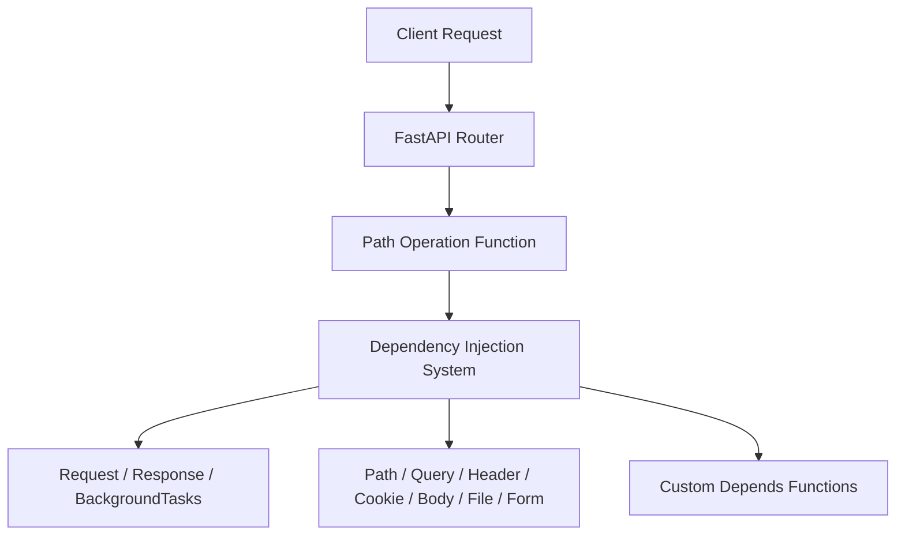

# FastAPI 의존성 주입(Dependency Injection) 종합 문서

FastAPI(패스트API)는 Starlette(스타렛)을 기반으로 구축된 현대적인 Python 웹 프레임워크입니다. FastAPI의 가장 큰 특징 중 하나는 **의존성 주입 시스템(Dependency Injection System)**입니다. 엔드포인트 함수(경로 작동 함수, Path Operation Function)에서 특정 파라미터를 선언하기만 하면, FastAPI가 자동으로 해당 객체를 생성하거나 값을 추출하여 전달합니다. 이 덕분에 개발자는 복잡한 요청/응답 처리 로직을 직접 작성하지 않고도 다양한 시스템 파라미터를 활용할 수 있습니다.

---

## 1. HTTP 통신 관련 객체

### 1.1. Request
- **설명:** 현재 들어온 모든 HTTP 요청 정보를 담고 있는 객체입니다.
- **사용 예시:**
  ```python
  from fastapi import FastAPI, Request

  app = FastAPI()

  @app.get("/info")
  async def get_info(request: Request):
      client_host = request.client.host
      user_agent = request.headers.get("user-agent")
      return ⦃"client": client_host, "agent": user_agent❵
  ```

### 1.2. Response
- **설명:** 응답 헤더를 직접 수정하거나 쿠키를 설정할 때 사용합니다.
- **사용 예시:**
  ```python
  from fastapi import Response

  @app.get("/set-cookie")
  async def set_cookie(response: Response):
      response.set_cookie(key="session_id", value="abc123")
      return ⦃"message": "쿠키가 설정되었습니다"❵
  ```

### 1.3. BackgroundTasks
- **설명:** 응답을 먼저 보낸 후, 백그라운드에서 실행할 작업을 예약할 수 있습니다.
- **사용 예시:**
  ```python
  from fastapi import BackgroundTasks

  def write_log(message: str):
      with open("log.txt", "a") as f:
          f.write(message + "\n")

  @app.post("/submit")
  async def submit(background_tasks: BackgroundTasks):
      background_tasks.add_task(write_log, "새로운 요청이 들어왔습니다")
      return ⦃"message": "요청이 접수되었습니다"❵
  ```

---

## 2. 클라이언트 데이터 (매개변수)

FastAPI는 URL 경로, 쿼리 스트링, 헤더, 쿠키, 바디 등 다양한 입력 데이터를 자동으로 파싱하여 함수 파라미터로 전달합니다.

### 2.1. Path (경로 변수)
- **설명:** URL 경로에 포함된 변수를 추출합니다.
- **예시:** `/items/⦃item_id❵`
  ```python
  @app.get("/items/⦃item_id❵")
  async def read_item(item_id: int):
      return ⦃"item_id": item_id❵
  ```

### 2.2. Query (쿼리 스트링)
- **설명:** URL 뒤에 붙는 쿼리 스트링을 추출합니다.
- **예시:** `/search?q=fastapi`
  ```python
  @app.get("/search")
  async def search(q: str = None):
      return ⦃"query": q❵
  ```

### 2.3. Header (HTTP 헤더)
- **설명:** HTTP 요청 헤더 값을 추출합니다.
  ```python
  from fastapi import Header

  @app.get("/agent")
  async def get_agent(user_agent: str = Header(None)):
      return ⦃"User-Agent": user_agent❵
  ```

### 2.4. Cookie
- **설명:** 브라우저 쿠키 값을 추출합니다.
  ```python
  from fastapi import Cookie

  @app.get("/cookie")
  async def read_cookie(session_id: str = Cookie(None)):
      return ⦃"session_id": session_id❵
  ```

### 2.5. Body (JSON 바디 데이터)
- **설명:** 요청 본문(JSON)을 파싱합니다. Pydantic 모델을 사용하지 않는 경우 직접 타입을 지정할 수 있습니다.
  ```python
  from fastapi import Body

  @app.post("/items")
  async def create_item(data: dict = Body(...)):
      return ⦃"data": data❵
  ```

### 2.6. File / UploadFile (파일 업로드)
- **설명:** 파일 업로드를 처리합니다.
  ```python
  from fastapi import File, UploadFile

  @app.post("/upload")
  async def upload_file(file: UploadFile = File(...)):
      contents = await file.read()
      return ⦃"filename": file.filename, "size": len(contents)❵
  ```

### 2.7. Form (HTML `<form>` 데이터)
- **설명:** `application/x-www-form-urlencoded` 방식으로 전송된 데이터를 처리합니다.
  ```python
  from fastapi import Form

  @app.post("/login")
  async def login(username: str = Form(...), password: str = Form(...)):
      return ⦃"username": username, "password": password❵
  ```

---

## 3. 의존성 주입 시스템 (Dependency Injection System)

FastAPI는 단순히 Request/Response 객체를 주입하는 것뿐만 아니라, **복잡한 의존성 그래프**를 자동으로 관리할 수 있습니다.

### 3.1. Depends
- **설명:** `Depends`를 사용하면 특정 함수나 클래스를 의존성으로 선언할 수 있습니다.
- **예시:**
  ```python
  from fastapi import Depends

  def get_token_header(x_token: str = Header(...)):
      if x_token != "secret-token":
          raise HTTPException(status_code=400, detail="Invalid Token")
      return x_token

  @app.get("/secure")
  async def secure_endpoint(token: str = Depends(get_token_header)):
      return ⦃"token": token❵
  ```

### 3.2. 클래스 기반 의존성
- **설명:** 클래스의 `__call__` 메서드를 정의하면 의존성으로 사용할 수 있습니다.
  ```python
  class CommonQueryParams:
      def __init__(self, q: str = None, page: int = 1, size: int = 10):
          self.q = q
          self.page = page
          self.size = size

      def __call__(self):
          return self

  @app.get("/items/")
  async def read_items(commons: CommonQueryParams = Depends(CommonQueryParams)):
      return ⦃"q": commons.q, "page": commons.page, "size": commons.size❵
  ```

### 3.3. 중첩 의존성
- **설명:** 의존성 함수 안에서 또 다른 의존성을 선언할 수 있습니다.
  ```python
  def query_extractor(q: str = None):
      return q

  def query_or_cookie_extractor(
      q: str = Depends(query_extractor), last_query: str = Cookie(None)
  ):
      return q or last_query

  @app.get("/items/")
  async def read_query(query: str = Depends(query_or_cookie_extractor)):
      return ⦃"query": query❵
  ```

---

## 4. 고급 기능

### 4.1. Security 의존성
- **설명:** 인증/인가를 위한 의존성을 정의할 수 있습니다.
  ```python
  from fastapi.security import OAuth2PasswordBearer

  oauth2_scheme = OAuth2PasswordBearer(tokenUrl="token")

  @app.get("/users/me")
  async def read_users_me(token: str = Depends(oauth2_scheme)):
      return ⦃"token": token❵
  ```

### 4.2. Context 관리
- **설명:** `request.state`를 사용하여 요청 단위의 상태를 저장할 수 있습니다.
  ```python
  @app.middleware("http")
  async def add_process_time_header(request: Request, call_next):
      request.state.process_start = time.time()
      response = await call_next(request)
      response.headers["X-Process-Time"] = str(time.time() - request.state.process_start)
      return response
  ```

---

## 5. 의존성 주입 흐름



---

## 6. 수식 표현: 의존성 그래프 모델

$$
DependencyGraph = \⦃ Node_i \mid Node_i \in (Request, Response, BackgroundTasks, Path, Query, Header, Cookie, Body, File, Form, Depends) \❵
$$

---

## 7. 결론

FastAPI의 의존성 주입 시스템은 단순히 HTTP 요청 데이터를 파싱하는 수준을 넘어, **복잡한 의존성 그래프를 자동으로 관리**하고, **보안, 데이터 검증, 상태 관리**까지 확장할 수 있습니다.  
- **HTTP 객체:** Request, Response, BackgroundTasks  
- **클라이언트 데이터:** Path, Query, Header, Cookie, Body, File, Form  
- **의존성 관리:** Depends, 클래스 기반, 중첩 의존성, Security  

이 모든 기능을 통해 FastAPI는 **유연하면서도 강력한 웹 애플리케이션 개발 환경**을 제공합니다.  
