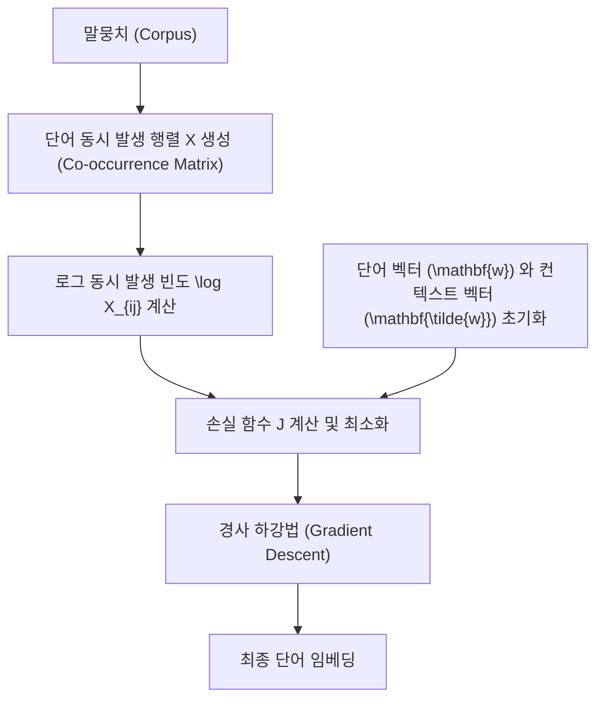

## GloVe (Global Vectors for Word Representation) 설명

---

### 1\. GloVe 개요 (글러브 개요)

**GloVe**는 **Global Vectors for Word Representation**의 약자로, 단어들을 벡터 공간에 표현하는, 즉 \*\*단어 임베딩 (Word Embedding)\*\*을 생성하는 알고리즘 중 하나입니다.

#### 1.1. 단어 임베딩의 목적

자연어 처리(NLP)에서 단어 임베딩의 주된 목적은 컴퓨터가 단어의 의미를 이해하고 계산할 수 있도록 **단어들을 실수(real number)의 밀집 벡터 (dense vector)로 변환**하는 것입니다. 이 벡터 공간에서는 의미적으로 유사한 단어들 (예: '남자'와 '왕')이 서로 가까운 위치에 놓이게 되며, 이는 벡터 연산을 통해 단어 간의 관계 (예: $king - man + woman \approx queen$)를 파악할 수 있게 합니다.

#### 1.2. GloVe의 특징

GloVe는 기존의 주요 단어 임베딩 방법론인 \*\*Word2Vec (워드투벡터)\*\*과 \*\*LSA (잠재 의미 분석, Latent Semantic Analysis)\*\*의 장점을 결합하려고 시도합니다.

  * **Word2Vec**: 주변 단어와의 관계, 즉 \*\*지역적 정보 (local context information)\*\*를 활용하는 '예측 기반 (prediction-based)' 모델입니다.
  * **LSA**: 전체 말뭉치(corpus)의 통계, 즉 \*\*전역적 정보 (global matrix factorization)\*\*를 활용하는 '행렬 분해 기반 (matrix factorization-based)' 모델입니다.
  * **GloVe**: 전체 말뭉치에서 \*\*단어 동시 발생 행렬 (Word Co-occurrence Matrix)\*\*을 생성하고, 이 행렬에 기반하여 전역적인 통계 정보를 손실 함수에 통합하여 학습하는 방식입니다.

-----

### 2\. GloVe의 핵심 아이디어: 동시 발생 확률 비율

GloVe의 핵심은 \*\*단어 동시 발생 확률의 비율 (ratios of word co-occurrence probabilities)\*\*이 단어 간의 의미적 관계를 인코딩하는 데 매우 효과적이라는 관찰에서 시작합니다.

#### 2.1. 동시 발생 행렬 ($X$)

말뭉치에서 특정 단어 $i$와 다른 단어 $j$가 같은 문맥(context) 내에서 함께 나타나는 횟수를 세어 \*\*동시 발생 행렬 $X$\*\*를 만듭니다. 행렬 $X$의 원소 $X_{ij}$는 단어 $i$와 단어 $j$가 동시에 등장한 횟수입니다.

#### 2.2. 동시 발생 확률 ($P_{ij}$)

단어 $i$와 $j$가 동시에 나타날 확률 $P_{ij}$는 다음과 같이 정의됩니다.

$$P_{ij} = P(j|i) = \frac{X_{ij}}{X_i}$$

여기서 $X_i$는 행렬 $X$에서 단어 $i$의 모든 동시 발생 횟수의 합, 즉 $\sum_{k} X_{ik}$입니다. 이는 단어 $i$가 나타났을 때 단어 $j$가 문맥에 포함될 확률을 나타냅니다.

#### 2.3. 비율의 의미론적 중요성

GloVe는 두 단어 $i$와 $j$에 대한 확률 $P_{ik}$와 $P_{jk}$의 **비율**을 통해 단어 $k$가 $i$와 $j$ 사이의 관계를 얼마나 잘 나타내는지를 파악합니다.

  * **예시:**
      * **$i = ice$ (얼음), $j = steam$ (증기), $k = solid$ (고체)**
          * $\frac{P_{ik}}{P_{jk}} = \frac{P(\text{solid}|\text{ice})}{P(\text{solid}|\text{steam})}$ : 이 비율은 **높게** 나옵니다. 왜냐하면 'solid'는 'ice'와는 자주 나오지만, 'steam'과는 드물게 나오기 때문입니다.
      * **$i = ice$ (얼음), $j = steam$ (증기), $k = gas$ (기체)**
          * $\frac{P_{ik}}{P_{jk}} = \frac{P(\text{gas}|\text{ice})}{P(\text{gas}|\text{steam})}$ : 이 비율은 **낮게** 나옵니다. 'gas'는 'steam'과는 자주 나오지만, 'ice'와는 드물게 나오기 때문입니다.
      * **$i = ice$ (얼음), $j = steam$ (증기), $k = water$ (물)**
          * $\frac{P_{ik}}{P_{jk}} = \frac{P(\text{water}|\text{ice})}{P(\text{water}|\text{steam})}$ : 이 비율은 **1에 가깝게** 나옵니다. 'water'는 두 단어와 모두 자주 관련되기 때문입니다.

이러한 **확률 비율**의 패턴은 단어 간의 \*\*의미적 차이 (semantic difference)\*\*를 효과적으로 포착한다는 것이 GloVe의 핵심 통찰입니다.

-----

### 3\. GloVe의 손실 함수 (Loss Function) 및 학습

GloVe는 위의 비율 관계를 벡터 공간에서 재현하도록 학습됩니다.

#### 3.1. 관계 함수 가정

GloVe는 두 단어 벡터 $\mathbf{w}_i$와 $\mathbf{w}_j$의 차이, 즉 $\mathbf{w}_i - \mathbf{w}_j$가 동시 발생 확률의 비율을 나타내는 함수 $F$와 관련되어 있다고 가정합니다.

$$F(\mathbf{w}_i, \mathbf{w}_j, \mathbf{w}_k) = \frac{P_{ik}}{P_{jk}}$$

저자들은 여러 수학적 제약 조건을 통해 이 함수 $F$를 다음과 같이 유도합니다 (유도 과정은 복잡하니 결과만 제시합니다).

$$\mathbf{w}_i^T \mathbf{\tilde{w}}_j + b_i + \tilde{b}_j = \log(X_{ij})$$

여기서:

  * $\mathbf{w}_i$: 단어 $i$의 벡터 (메인 단어)
  * $\mathbf{\tilde{w}}_j$: 단어 $j$의 컨텍스트 벡터 (주변 단어)
  * $b_i, \tilde{b}_j$: 편향 (bias) 항입니다.
  * $\log(X_{ij})$: 동시 발생 횟수에 로그를 취한 값입니다.

#### 3.2. 손실 함수 (Cost Function)

GloVe는 위의 관계를 최소화하는 **최소 제곱 오차 (squared error)** 형태의 손실 함수 $J$를 사용합니다.

$$J = \sum_{i=1}^{V} \sum_{j=1}^{V} f(X_{ij}) (\mathbf{w}_i^T \mathbf{\tilde{w}}_j + b_i + \tilde{b}_j - \log X_{ij})^2$$

여기서:

  * $V$: 전체 단어의 개수 (어휘 집합 크기, **Vocabulary Size**)
  * $f(X_{ij})$: 가중치 함수 (Weighting Function). 동시 발생 횟수 $X_{ij}$가 **클수록 더 큰 가중치**를 부여하고, 너무 크면 상한선을 두어 **균형**을 맞춥니다. 이는 드물게 등장하는 단어에 과도하게 학습되는 것을 방지하고, 빈번하게 등장하는 단어에도 적절한 가중치를 주기 위함입니다.

이 손실 함수를 \*\*경사 하강법 (Gradient Descent)\*\*으로 최소화하여 단어 벡터 $\mathbf{w}_i$와 컨텍스트 벡터 $\mathbf{\tilde{w}}_j$를 학습합니다. 학습 후에는 두 벡터를 더하거나 ( $\mathbf{w}_i + \mathbf{\tilde{w}}_i$ ) 혹은 $\mathbf{w}_i$만 사용합니다.

-----

### 4\. 시각적 표현 (Mermaid Diagram)

GloVe의 학습 과정을 간단히 시각화하여 표현할 수 있습니다.

-----

### 5\. GloVe의 장점

  * **전역 정보 활용**: Word2Vec과 달리 전체 말뭉치의 통계 정보(동시 발생 행렬)를 직접적으로 반영하여 학습의 효율성과 정확성을 높입니다.
  * **빠른 수렴**: Word2Vec의 Negative Sampling 같은 복잡한 기법 없이, 행렬 분해 기반의 접근법을 사용하여 비교적 빠르게 수렴합니다.
  * **뛰어난 성능**: 특히 작은 말뭉치(corpus)에서도 Word2Vec보다 좋은 성능을 보이며, 다양한 NLP task에서 우수한 결과를 나타냅니다.

-----

### 용어 목록

| 용어 | 설명 |
| :--- | :--- |
| **GloVe** | Global Vectors for Word Representation. 단어 임베딩 알고리즘. |
| **단어 임베딩** | Word Embedding. 단어를 컴퓨터가 처리할 수 있는 실수 벡터로 변환하는 기법. |
| **Word2Vec** | Word to Vector. 예측 기반의 단어 임베딩 모델. |
| **LSA** | Latent Semantic Analysis. 전역 통계를 이용하는 행렬 분해 기반의 모델. |
| **단어 동시 발생 행렬** | Word Co-occurrence Matrix. 말뭉치에서 두 단어가 함께 나타나는 횟수를 기록한 행렬. |
| **동시 발생 확률 비율** | Ratios of Word Co-occurrence Probabilities. GloVe의 핵심 통찰로, 단어 관계를 인코딩함. |
| **밀집 벡터** | Dense Vector. 대부분의 원소가 0이 아닌 실수로 채워진 벡터. |
| **손실 함수** | Loss Function (or Cost Function). 모델의 예측 값과 실제 값 사이의 오차를 계산하는 함수. |
| **경사 하강법** | Gradient Descent. 손실 함수를 최소화하는 방향으로 모델의 매개변수를 갱신하는 최적화 알고리즘. |
| **어휘 집합 크기** | Vocabulary Size. 말뭉치에 존재하는 고유한 단어의 개수. |