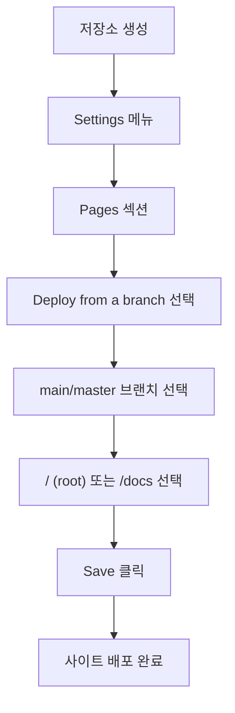
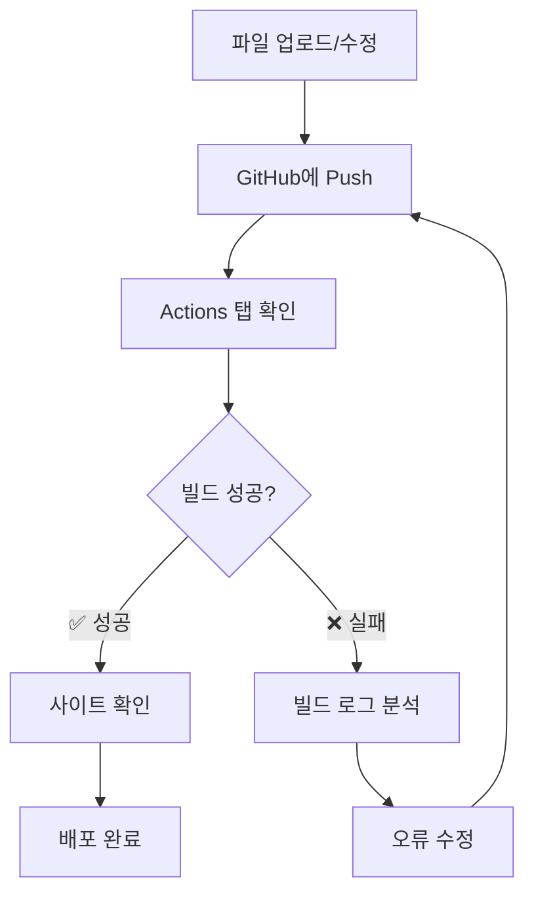
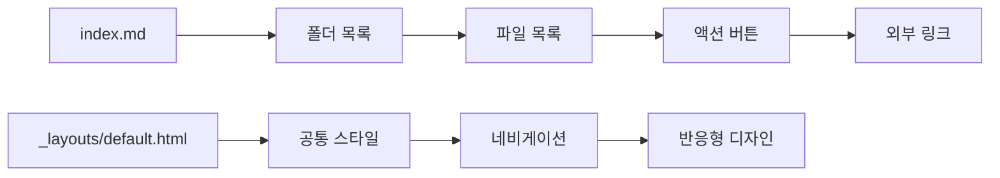

# 🌐 GitHub Pages 활용 가이드

> **무료로 웹사이트를 호스팅하고 동적 콘텐츠 관리하기**

---

## 목차

1. [GitHub Pages란?](#github-pages란)
2. [기본 설정 및 시작하기](#기본-설정-및-시작하기)
3. [Jekyll을 활용한 동적 사이트 구축](#jekyll을-활용한-동적-사이트-구축)
4. [파일 구조 및 동적 로딩](#파일-구조-및-동적-로딩)
5. [빌드 상태 확인 및 디버깅](#빌드-상태-확인-및-디버깅)
6. [실제 사례 및 팁](#실제-사례-및-팁)
7. [주의사항 및 제한사항](#주의사항-및-제한사항)
8. [부록: GitHub Actions](#부록-github-actions)

---

## GitHub Pages란?

GitHub Pages는 GitHub 저장소에서 직접 정적 웹사이트를 호스팅할 수 있는 **무료 서비스**입니다.

### 🌟 주요 특징
- **완전 무료** (공개 저장소 기준)
- **SSL 인증서** 자동 제공
- **커스텀 도메인** 연결 가능
- **Jekyll 내장** 지원
- **자동 배포** 시스템

### 💡 활용 사례
- 개인 블로그 및 포트폴리오
- 프로젝트 문서화
- 학습 자료 정리
- 팀 위키 및 가이드

---

## 기본 설정 및 시작하기

### 1단계: 저장소 생성
```
📁 저장소 이름 옵션:
- username.github.io (개인 메인 사이트)
- repository-name (프로젝트 사이트)
```

### 2단계: GitHub Pages 활성화



### 3단계: 첫 페이지 생성
```markdown
<!-- index.md -->
---
layout: default
title: 홈페이지
---

# 환영합니다!

GitHub Pages로 만든 첫 번째 사이트입니다.
```

---

## Jekyll을 활용한 동적 사이트 구축

### Jekyll이란?
Jekyll은 GitHub Pages에 내장된 **정적 사이트 생성기**로, 마크다운을 HTML로 변환하고 템플릿을 적용합니다.

### 기본 구조
```
📁 프로젝트 루트/
├── 📄 _config.yml          # 사이트 설정
├── 📁 _layouts/            # 레이아웃 템플릿
│   └── 📄 default.html
├── 📁 _includes/           # 재사용 컴포넌트
├── 📁 assets/              # CSS, JS, 이미지
├── 📄 index.md             # 홈페이지
└── 📁 docs/                # 문서들
```

### _config.yml 기본 설정
```yaml
title: "내 사이트"
description: "GitHub Pages로 만든 사이트"
baseurl: "/repository-name"  # 프로젝트 사이트인 경우
url: "https://username.github.io"

# Jekyll 설정
markdown: kramdown
highlighter: rouge
plugins:
  - jekyll-feed
  - jekyll-sitemap
```

---

## 파일 구조 및 동적 로딩

### 🔍 중요한 발견사항
> **주의**: Jekyll의 `site.static_files`는 **하위 폴더의 모든 파일**을 읽어옵니다!
> 처음에는 폴더별로 구분될 것으로 예상했지만, 실제로는 전체 하위 구조를 탐색합니다.

### 동적 파일 로딩 구현

```
<!-- 현재 폴더의 파일만 필터링 -->



<!-- 깊이 체크로 직접 파일만 선택 -->

  
  
  
    <!-- 직접 파일만 처리 -->
  

```

### 파일 타입별 아이콘 및 액션 설정
```

  
  <a href="https://colab.research.google.com/github/username/repo/blob/master/{{ file_name }}" target="_blank">🚀</a>

  
  <a href="https://username.github.io/repo/{{ file_name | remove: '.md' }}" target="_blank">🌐</a>

```

---

## 빌드 상태 확인 및 디버깅

### ⚠️ 중요: 파일 업로드 후 반드시 확인할 것!



### 🔍 GitHub Actions에서 빌드 상태 확인

#### 1단계: Actions 탭 이동
1. GitHub 저장소 → **Actions 탭** 클릭
2. 최근 워크플로우 실행 목록 확인
3. **✅ 초록색**: 성공, **❌ 빨간색**: 실패

#### 2단계: 빌드 로그 상세 확인
```bash
# 성공 시 로그 예시
✅ Checkout
✅ Setup Ruby
✅ Build with Jekyll
✅ Upload artifact
✅ Deploy to GitHub Pages

# 실패 시 로그 예시
❌ Build with Jekyll
   Error: Liquid syntax error (line 45)
   Error: Invalid YAML front matter
```

### 🐛 일반적인 빌드 오류 및 해결법

#### 1. Liquid 템플릿 문법 오류
```
# ❌ 잘못된 예시
{% for file in files
  {{ file.name }}


# ✅ 올바른 예시  

  {{ file.name }}

```

#### 2. YAML Front Matter 오류
```yaml
# ❌ 잘못된 예시 (들여쓰기 오류)
---
title: My Page
layout:default
date: 2024-01-15
---

# ✅ 올바른 예시
---
title: "My Page"
layout: default
date: 2024-01-15
---
```

#### 3. Mermaid 다이어그램 문법 오류
```markdown
<!-- ❌ 잘못된 예시 (따옴표 없음) -->
graph TD
    A[한글 노드] --> B[다음 단계]

<!-- ✅ 올바른 예시 (한글은 따옴표 필수) -->
graph TD
    A["한글 노드"] --> B["다음 단계"]
```

#### 4. 파일 인코딩 문제 (참고만-리눅스)
```bash
# 한글 파일 인코딩 확인
file -I filename.md
# 결과: filename.md: text/plain; charset=utf-8

# UTF-8이 아닌 경우 변환
iconv -f cp949 -t utf-8 filename.md > filename_utf8.md
```

### 🔧 빌드 오류 디버깅 단계별 가이드

#### Step 1: 오류 위치 파악
```bash
# Actions 로그에서 오류 메시지 확인
Error: Liquid syntax error in '스프린트미션_완료/index.md' (line 45)
```

#### Step 2: 로컬에서 Jekyll 테스트 (참고만)
```bash
# 로컬 Jekyll 설치 및 테스트
gem install jekyll bundler
bundle init
bundle add jekyll

# 로컬 서버 실행
bundle exec jekyll serve --livereload

# 오류 시 상세 로그 확인
bundle exec jekyll build --verbose
```

#### Step 3: 단계별 문제 해결
```markdown
1. **문법 검사**: Liquid 템플릿 문법 확인
2. **YAML 검증**: YAML 온라인 파서로 확인
3. **인코딩 확인**: 파일이 UTF-8인지 검증
4. **특수문자**: 따옴표, 대괄호 등 이스케이프 처리
```

### 🔧 브라우저 디버깅 활용법

#### 디버깅 JavaScript 추가
Jekyll 템플릿에 디버깅 코드를 삽입하여 파일 로딩 과정을 모니터링할 수 있습니다.

```
<script>
console.group('🔍 파일 목록 디버깅');
console.log('Current folder:', '{{ current_folder }}');
console.log('Static files found:', {{ static_files.size }});


  
  
  console.log('File: {{ file.path }}', {
    name: '{{ file.name }}',
    depth: {{ file_depth }},
    included: {{ file_depth == 1 }}
  });

console.groupEnd();
</script>
```

#### 브라우저 개발자 도구 활용
1. **F12** 또는 **우클릭 → 검사** 열기
2. **Console 탭** 이동
3. 디버깅 메시지 확인
4. **Network 탭**에서 리소스 로딩 상태 확인

#### 실시간 디버깅 팁
```
<script>
// 파일 필터링 결과 확인
console.table({{ all_files | jsonify }});

// 깊이 계산 검증

console.log('{{ file.path }}', '깊이: {{ file_depth }}');

</script>
```

### 📋 빌드 체크리스트

파일을 업로드한 후 **반드시** 다음 사항들을 확인하세요:

- [ ] **Actions 탭**에서 빌드 성공 확인
- [ ] **빌드 시간** 정상 범위 내 (보통 1-3분)
- [ ] **배포 URL**에서 변경사항 반영 확인
- [ ] **브라우저 캐시** 클리어 후 재확인 (Ctrl+F5)
- [ ] **모바일 디스플레이** 정상 작동 확인
- [ ] **링크 및 버튼** 동작 테스트

---

## 실제 사례 및 팁

### 참고 사이트 분석

#### 1. [c0z0c.github.io/blog](https://c0z0c.github.io/blog)
- 개인 블로그 형태
- 카테고리별 포스트 분류
- 깔끔한 네비게이션

#### 2. [c0z0c/sprint_mission](https://github.com/c0z0c/sprint_mission)
- 프로젝트 문서화
- 파일 타입별 액션 버튼
- 동적 파일 목록 생성

#### 3. [c0z0c/jupyter_hangul](https://github.com/c0z0c/jupyter_hangul)
- Jupyter 노트북 호스팅
- Colab 연동 버튼
- 한글 처리 예제

### 💡 효과적인 구조 설계



### 🎯 실용적인 팁

1. **파일명 규칙 통일**
   ```
   ✅ 좋은 예: 2024-01-15-project-name.md
   ❌ 나쁜 예: 프로젝트 이름(최종).md
   ```

2. **메타데이터 활용**
   ```yaml
   ---
   layout: default
   title: "페이지 제목"
   date: 2024-01-15
   categories: [development, guide]
   tags: [github, pages, jekyll]
   ---
   ```

3. **이미지 최적화**
   ```markdown
   {:width="500px"}
   ```

---

## 주의사항 및 제한사항

### 🚫 제한사항
| 항목 | 제한 |
|------|------|
| **저장소 크기** | 1GB |
| **월 대역폭** | 100GB |
| **시간당 빌드** | 10회 |
| **파일 크기** | 100MB |
| **사이트 빌드 시간** | 10분 |

### ⚡ 성능 최적화

1. **이미지 압축**
   - PNG → WebP 변환
   - 적절한 해상도 사용
   - 지연 로딩 구현

2. **CSS/JS 최소화**
   ```
   <!-- 인라인 스타일 최소화 -->
   <link rel="stylesheet" href="{{ '/assets/css/main.css' | relative_url }}">
   ```

3. **캐시 활용**
   ```yaml
   # _config.yml
   plugins:
     - jekyll-sitemap
     - jekyll-feed
   
   sass:
     style: compressed
   ```

### 🔒 보안 주의사항

1. **민감 정보 제외**
   ```gitignore
   # .gitignore
   _config_local.yml
   .env
   *.key
   ```

2. **공개 저장소 주의**
   - API 키, 비밀번호 제외
   - 개인정보 보호
   - 라이선스 명시

### 🛠️ 고급 디버깅 기법

#### Jekyll 빌드 상세 분석
```bash
# 로컬에서 상세 빌드 로그 확인
JEKYLL_ENV=production bundle exec jekyll build --verbose --trace

# 특정 플러그인 오류 확인
bundle exec jekyll doctor

# 의존성 문제 해결
bundle update
bundle install
```

#### GitHub Actions 워크플로우 디버깅 (참고만)
```yaml
# .github/workflows/debug.yml
- name: Debug Build
  run: |
    echo "Ruby version: $(ruby -v)"
    echo "Jekyll version: $(bundle exec jekyll -v)"
    ls -la _site/
    find . -name "*.md" -exec head -5 {} \;
```

### 🔄 빌드 실패 시 대응 절차

#### 1. 즉시 확인사항
```markdown
1. **최근 변경사항** 되돌려보기
2. **Actions 탭** 빌드 로그 전체 읽기
3. **비슷한 오류** 이전에 있었는지 확인
4. **파일 크기** 100MB 제한 확인
```

#### 2. 긴급 복구 방법
```bash
# 이전 커밋으로 되돌리기
git revert HEAD
git push origin main

# 특정 파일만 되돌리기
git checkout HEAD~1 -- problematic-file.md
git commit -m "Fix problematic file"
git push origin main
```

### 🐛 일반적인 문제 해결

#### 사이트가 업데이트되지 않을 때
1. **Actions 탭에서 빌드 성공 확인** ⚠️ **가장 중요**
2. **브라우저 캐시 클리어** (Ctrl+F5)
3. **_config.yml 구문 검사**
4. **파일 인코딩** 확인 (UTF-8)
5. **배포 완료까지 대기** (보통 5-10분)

#### 한글 파일명 문제
```
# _config.yml
encoding: utf-8
```

#### Mermaid 다이어그램 오류
```
<!-- 올바른 형식 -->
graph TD
    A["한글 노드"] --> B["다음 단계"]
    
<!-- 잘못된 형식 -->
graph TD
    A[한글 노드] --> B[다음 단계]
```

### 🚨 빌드 실패 응급처치

```markdown
**빌드가 실패했다면 즉시:**

1. **당황하지 말고** Actions 탭으로 이동
2. **빌드 로그** 끝까지 읽어보기
3. **오류 라인 번호** 확인하기
4. **해당 파일** 직접 수정하기
5. **다시 커밋**하여 재빌드 트리거
6. **여전히 실패하면** 이전 버전으로 되돌리기
```

---

## 부록: GitHub Actions

### GitHub Actions란?
CI/CD 파이프라인을 통한 **자동화된 배포** 시스템입니다.

### 기본 워크플로우
```yaml
# .github/workflows/pages.yml
name: Deploy Jekyll site to Pages

on:
  push:
    branches: ["main"]
  workflow_dispatch:

jobs:
  build:
    runs-on: ubuntu-latest
    steps:
      - name: Checkout
        uses: actions/checkout@v4
      
      - name: Setup Ruby
        uses: ruby/setup-ruby@v1
        with:
          ruby-version: '3.1'
          bundler-cache: true
      
      - name: Build with Jekyll
        run: bundle exec jekyll build
      
      - name: Upload artifact
        uses: actions/upload-pages-artifact@v2

  deploy:
    environment:
      name: github-pages
      url: ${{ steps.deployment.outputs.page_url }}
    runs-on: ubuntu-latest
    needs: build
    steps:
      - name: Deploy to GitHub Pages
        id: deployment
        uses: actions/deploy-pages@v2
```

### Actions vs Branch Deploy 비교

| 방식 | 장점 | 단점 |
|------|------|------|
| **Branch Deploy** | 간단한 설정, 즉시 적용 | 제한된 Jekyll 플러그인 |
| **GitHub Actions** | 모든 플러그인 사용 가능, 세밀한 제어 | 복잡한 설정, 빌드 시간 |

---

## 마무리

### 📈 GitHub Pages의 장점 요약
- **💰 완전 무료** 호스팅
- **🔄 자동 배포** 시스템
- **📱 반응형** 디자인 지원
- **🔍 SEO** 최적화 가능
- **🌐 커스텀 도메인** 연결

### 🚀 다음 단계 제안
1. **개인 프로젝트**에 GitHub Pages 적용
2. **팀 문서화**를 위한 위키 구축
3. **포트폴리오 사이트** 개발
4. **블로그** 시작하기

### 📚 추가 학습 자료
- [Jekyll 공식 문서](https://jekyllrb.com/)
- [GitHub Pages 가이드](https://docs.github.com/pages)
- [Liquid 템플릿 언어](https://shopify.github.io/liquid/)
- [Markdown 가이드](https://www.markdownguide.org/)

---

## 💬 Q&A

**Q: 비공개 저장소에서도 GitHub Pages를 사용할 수 있나요?**
A: GitHub Pro 이상의 유료 플랜에서 가능합니다.

**Q: 사이트 빌드가 실패했을 때 어떻게 해야 하나요?**
A: Repository의 Actions 탭에서 빌드 로그를 확인하고, 오류 메시지를 바탕으로 수정합니다.

**Q: Jekyll 없이 순수 HTML로만 사용할 수 있나요?**
A: 네, 정적 HTML/CSS/JS 파일만으로도 호스팅 가능합니다.

---

**🎯 오늘부터 당신도 GitHub Pages 마스터!**