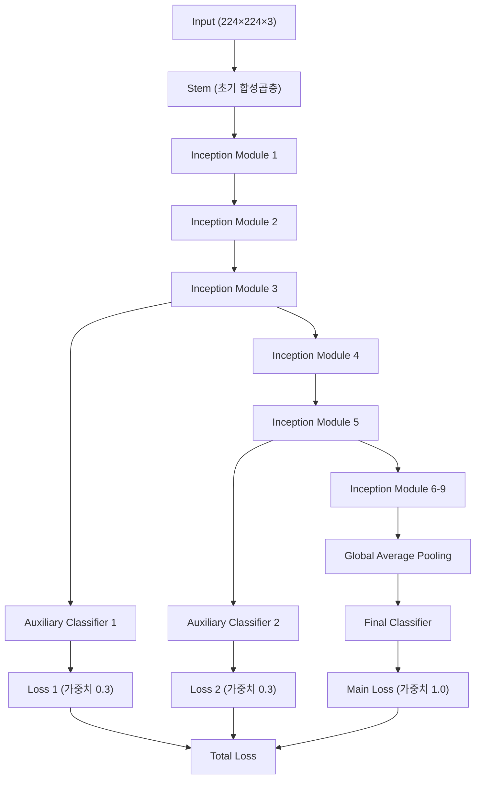
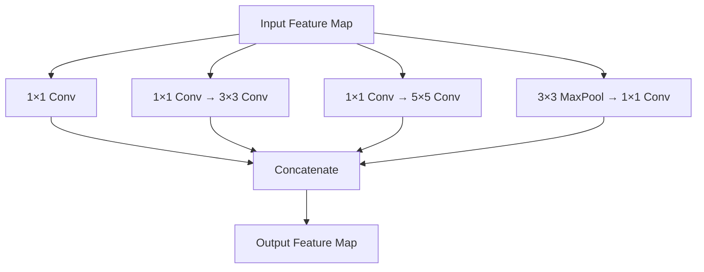
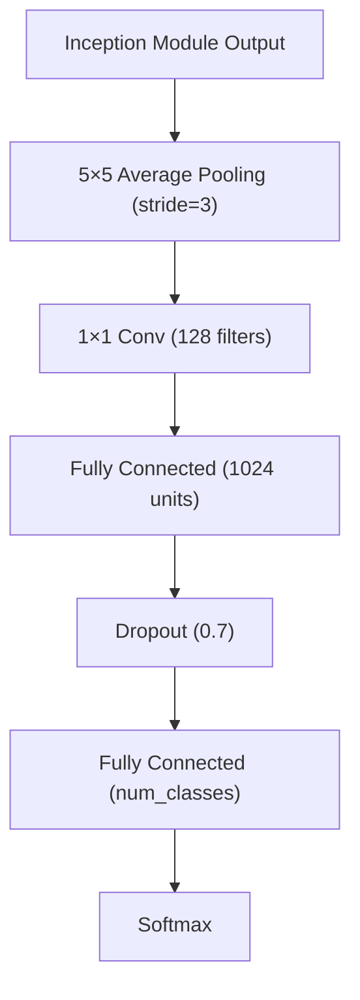
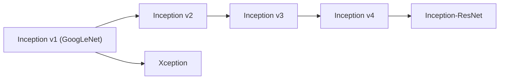

# GoogleNet (Inception v1) 분석

## 수식 목차
1. [Inception 모듈의 계산 복잡도](#1-inception-모듈의-계산-복잡도)
   1.1. [기본 합성곱 연산](#11-기본-합성곱-연산)
   1.2. [1×1 합성곱을 이용한 차원 축소](#12-1×1-합성곱을-이용한-차원-축소)
2. [보조 분류기의 손실 함수](#2-보조-분류기의-손실-함수)
   2.1. [전체 손실 함수](#21-전체-손실-함수)
   2.2. [가중치 설정](#22-가중치-설정)

## 1. GoogleNet 개요

### 1.1. 기본 정보
GoogleNet(공식적으로는 Inception v1)은 2014년 구글에서 개발한 깊은 합성곱 신경망 아키텍처입니다. ImageNet Large-Scale Visual Recognition Challenge 2014(ILSVRC14)에서 우승하며 6.67%의 top-5 오류율을 달성했습니다.

### 1.2. 핵심 특징
- **깊이**: 22개 층 (풀링 층 포함 시 27개 층)
- **파라미터 수**: AlexNet 대비 12배 적은 파라미터 사용
- **핵심 혁신**: Inception 모듈 도입
- **훈련 안정화**: 보조 분류기(Auxiliary Classifier) 사용

## 2. Inception 모듈

### 2.1. Inception 모듈의 구조

Inception 모듈은 GoogleNet의 핵심 혁신으로, 서로 다른 크기의 필터를 병렬로 적용하여 다중 스케일 특징을 추출합니다.

### 2.2. 설계 원리

Inception 모듈의 설계는 다음과 같은 문제를 해결하기 위해 고안되었습니다:

1. **최적 필터 크기 선택의 어려움**: 이미지 내 객체의 크기가 다양하여 적절한 필터 크기를 선택하기 어려움
2. **계산 비용**: 큰 필터를 사용할 경우 계산 비용이 급격히 증가
3. **네트워크 깊이와 너비의 균형**: 성능 향상을 위해 깊이와 너비를 동시에 증가시킬 필요

## 3. 수식 분석

### 3.1. Inception 모듈의 계산 복잡도

#### 3.1.1. 기본 합성곱 연산

일반적인 합성곱 연산의 계산 복잡도는 다음과 같습니다:

$$\text{연산량} = H \times W \times C_{in} \times C_{out} \times K^2$$

여기서:
- $H, W$: 입력 특징맵의 높이와 너비
- $C_{in}$: 입력 채널 수
- $C_{out}$: 출력 채널 수  
- $K$: 필터 크기

#### 3.1.2. 1×1 합성곱을 이용한 차원 축소

Inception 모듈에서는 1×1 합성곱을 사용하여 차원을 축소합니다:

**차원 축소 전 (5×5 합성곱 직접 적용):**
$$\text{연산량}_{\text{직접}} = H \times W \times C_{in} \times C_{out} \times 25$$

**차원 축소 후 (1×1 → 5×5):**
$$\text{연산량}_{\text{축소}} = H \times W \times C_{in} \times C_{reduce} \times 1 + H \times W \times C_{reduce} \times C_{out} \times 25$$

여기서 $C_{reduce} \ll C_{in}$일 때 상당한 계산량 절약이 가능합니다.

### 3.2. 보조 분류기의 손실 함수

#### 3.2.1. 전체 손실 함수

GoogleNet의 전체 손실 함수는 메인 분류기와 두 개의 보조 분류기의 손실을 가중합으로 계산합니다:

$$L_{total} = L_{main} + \alpha_1 L_{aux1} + \alpha_2 L_{aux2}$$

#### 3.2.2. 가중치 설정

원논문에서 사용된 가중치는 다음과 같습니다:
- $\alpha_1 = \alpha_2 = 0.3$
- 메인 손실의 가중치는 1.0 (암시적)

따라서:
$$L_{total} = L_{main} + 0.3 L_{aux1} + 0.3 L_{aux2}$$

## 4. 보조 분류기 (Auxiliary Classifier)

### 4.1. 도입 배경과 목적

**학생의 추측에 대한 검토:**
> "내생각에는 연구성과를 위하여 잔뜩 보조 계산을 집어 넣고 실제로 과적합이 발생하니 잔뜩 드롭아웃 했다 일것 같아."

이 추측은 **부분적으로 맞지만 핵심을 놓쳤습니다**. 올바른 설명은 다음과 같습니다:

### 4.2. 실제 도입 이유

보조 분류기는 **기울기 소실 문제(Vanishing Gradient Problem)** 해결을 위해 도입되었습니다:

1. **기울기 소실 문제**: 22층의 깊은 네트워크에서 역전파 시 기울기가 초기 층에 도달할 때까지 급격히 감소
2. **해결 방법**: 중간 층에서 추가적인 기울기 신호를 제공하여 전체 네트워크의 훈련 안정화
3. **정규화 효과**: 부수적으로 과적합 방지에도 기여 (하지만 주 목적은 아님)

### 4.3. 보조 분류기의 구조

각 보조 분류기는 다음과 같이 구성됩니다:

### 4.4. 작동 방식

1. **훈련 시**: 보조 분류기가 활성화되어 추가적인 기울기 신호 제공
2. **추론 시**: 보조 분류기는 제거되고 메인 분류기만 사용
3. **배치**: Inception(4a)와 Inception(4d) 모듈 출력에 각각 하나씩 배치

## 5. 드롭아웃 사용 현황

### 5.1. 드롭아웃 적용 위치

GoogleNet에서 드롭아웃은 제한적으로 사용되었습니다:

1. **보조 분류기**: 0.7 비율의 드롭아웃 적용
2. **메인 분류기**: Global Average Pooling 사용으로 드롭아웃 필요성 감소

### 5.2. Global Average Pooling의 역할

전통적인 Fully Connected 층 대신 Global Average Pooling을 사용하여:
- **파라미터 수 대폭 감소**: 과적합 위험 자연스럽게 감소
- **드롭아웃 의존도 감소**: 구조적 정규화 효과

## 6. 혁신적 특징

### 6.1. 계산 효율성

1. **1×1 합성곱**: 차원 축소를 통한 계산량 절약
2. **파라미터 효율성**: AlexNet 대비 12배 적은 파라미터로 더 나은 성능
3. **Global Average Pooling**: FC 층 제거로 파라미터 수 급격한 감소

### 6.2. 다중 스케일 특징 추출

Inception 모듈을 통해 다양한 크기의 필터를 병렬 적용:
- **1×1**: 점별 특징
- **3×3**: 중간 크기 특징
- **5×5**: 큰 영역 특징
- **MaxPooling**: 공간적 불변성

## 7. 후속 발전

### 7.1. Inception 계열의 발전

### 7.2. 각 버전의 주요 개선사항

1. **Inception v2 (2015)**: 
   - Batch Normalization 도입
   - 드롭아웃 및 Local Response Normalization 제거

2. **Inception v3 (2016)**:
   - 인수분해 합성곱 (Factorized Convolutions) 사용
   - 5×5 → 3×3 + 3×3 분해

3. **Inception v4 & Inception-ResNet**:
   - ResNet의 잔차 연결 결합

## 8. 성능 및 의의

### 8.1. ILSVRC 2014 결과

- **Top-5 오류율**: 6.67%
- **이전 우승자 대비**: 거의 절반 수준의 오류율
- **효율성**: 더 적은 파라미터로 더 나은 성능

### 8.2. 딥러닝 발전에 미친 영향

1. **아키텍처 설계 패러다임 변화**: Stem-Body-Head 구조의 정립
2. **효율적인 네트워크 설계**: 파라미터 효율성과 성능의 균형
3. **다중 스케일 처리**: 현대 CNN의 표준 기법으로 자리잡음

## 9. 결론

### 9.1. 검토

1. **보조 분류기의 주 목적**: 과적합 방지가 아닌 **기울기 소실 문제 해결**
2. **드롭아웃 사용**: "잔뜩" 사용하지 않고 보조 분류기에만 제한적 적용
3. **과적합 방지**: 주로 Global Average Pooling과 적은 파라미터 수로 해결

### 9.2. GoogleNet의 핵심 가치

GoogleNet은 단순히 성능만을 추구한 것이 아니라:
- **효율성과 성능의 균형**
- **혁신적 아키텍처 설계**
- **실용적 해결책 제시**

를 통해 딥러닝 발전에 큰 기여를 했습니다.

---

**참고문헌**
- Szegedy, C., et al. (2015). "Going deeper with convolutions." CVPR.
- 각종 딥러닝 교재 및 온라인 자료