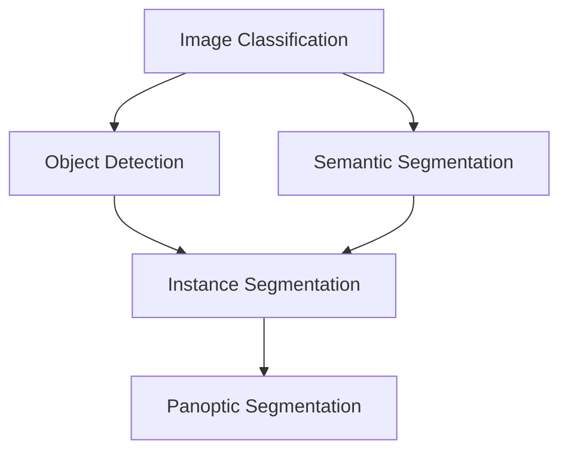
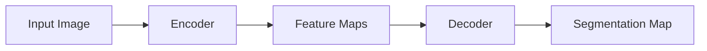

# 1. Image Segmentation 기초 이론

## 목차
1. [Image Segmentation 개요](#1-image-segmentation-개요) 
   1. 1.1. [정의와 목적](#11-정의와-목적) 
   1. 1.2. [컴퓨터 비전에서의 위치](#12-컴퓨터-비전에서의-위치) 
   1. 1.3. [세그멘테이션의 도전 과제](#13-세그멘테이션의-도전-과제) 

2. [수학적 정의](#2-수학적-정의) 
   2. 2.1. [픽셀 분류 문제로서의 접근](#21-픽셀-분류-문제로서의-접근) 
   2. 2.2. [공간 분할 이론](#22-공간-분할-이론) 
   2. 2.3. [확률론적 해석](#23-확률론적-해석) 

3. [전통적 방법 vs 딥러닝 방법](#3-전통적-방법-vs-딥러닝-방법) 
   3. 3.1. [전통적 세그멘테이션 기법](#31-전통적-세그멘테이션-기법) 
   3. 3.2. [딥러닝의 패러다임 전환](#32-딥러닝의-패러다임-전환) 
   3. 3.3. [성능 비교와 장단점](#33-성능-비교와-장단점) 

4. [평가 지표](#4-평가-지표) 
   4. 4.1. [픽셀 정확도 기반 지표](#41-픽셀-정확도-기반-지표) 
   4. 4.2. [IoU와 Dice 계수](#42-iou와-dice-계수) 
   4. 4.3. [경계선 정확도 평가](#43-경계선-정확도-평가) 

5. [손실 함수 설계](#5-손실-함수-설계) 
   5. 5.1. [Cross-Entropy Loss](#51-cross-entropy-loss) 
   5. 5.2. [클래스 불균형 문제](#52-클래스-불균형-문제) 
   5. 5.3. [공간 정보를 고려한 손실 함수](#53-공간-정보를-고려한-손실-함수) 

---

## 1. Image Segmentation 개요

### 1.1. 정의와 목적

Image Segmentation(이미지 세그멘테이션)은 디지털 이미지를 의미 있는 영역들로 분할하는 과정이다. 수학적으로 표현하면, 주어진 이미지 $I: \Omega \rightarrow \mathbb{R}^d$를 $k$개의 상호 배타적인(mutually exclusive) 영역 $\{R_1, R_2, ..., R_k\}$로 분할하는 것이다.

$$\Omega = \bigcup_{i=1}^{k} R_i, \quad R_i \cap R_j = \emptyset \text{ for } i \neq j$$

여기서 $\Omega \subset \mathbb{R}^2$는 이미지 도메인(domain)이고, $d$는 채널 수(RGB의 경우 $d=3$)이다.

세그멘테이션의 주요 목적은:
- **의미적 이해**: 각 픽셀이 어떤 객체나 영역에 속하는지 파악
- **공간 정보 보존**: 객체의 모양과 경계 정보 유지
- **계층적 분석**: 전체 이미지에서 부분 영역까지의 다층적 정보 추출

### 1.2. 컴퓨터 비전에서의 위치

컴퓨터 비전 태스크(task)의 계층 구조에서 세그멘테이션은 중간 단계에 위치한다:

- **Image Classification**: 전체 이미지에 하나의 라벨 할당
- **Object Detection**: 객체의 위치(bounding box)와 클래스 예측
- **Semantic Segmentation**: 모든 픽셀을 클래스별로 분류
- **Instance Segmentation**: 동일 클래스 내 개별 객체 구분
- **Panoptic Segmentation**: 의미적 분할과 개체 분할의 통합

### 1.3. 세그멘테이션의 도전 과제

세그멘테이션이 어려운 이유는 다음과 같은 본질적 문제들 때문이다:

1. **스케일 변화**: 동일 객체가 다양한 크기로 나타남
2. **조명 변화**: 명암과 그림자로 인한 외형 변화
3. **가림 현상(Occlusion)**: 객체 간 겹침으로 인한 부분 관측
4. **내부 변화**: 동일 클래스 내에서도 다양한 외형
5. **경계 모호성**: 객체 간 경계가 불분명한 경우

## 2. 수학적 정의

### 2.1. 픽셀 분류 문제로서의 접근

세그멘테이션은 각 픽셀을 특정 클래스로 분류하는 문제로 볼 수 있다. 이미지 $I$의 각 픽셀 위치 $(i,j)$에서 클래스 $c$에 속할 확률을 예측하는 함수 $f$를 학습한다:

$$f: \mathbb{R}^{H \times W \times d} \rightarrow \mathbb{R}^{H \times W \times C}$$

여기서:
- $H, W$: 이미지의 높이와 너비
- $d$: 입력 채널 수
- $C$: 클래스 수

각 픽셀 $(i,j)$에서의 예측은 소프트맥스(Softmax) 함수를 통해 확률 분포로 변환된다:

$$P(y_{i,j} = c | I) = \frac{\exp(f_c(I)_{i,j})}{\sum_{k=1}^{C} \exp(f_k(I)_{i,j})}$$

### 2.2. 공간 분할 이론

전통적인 영역 분할 이론에서 좋은 분할은 다음 조건을 만족해야 한다:

1. **동질성(Homogeneity)**: 각 영역 내 픽셀들은 유사한 특성을 가져야 함
   $$\forall (i,j), (p,q) \in R_k: |I(i,j) - I(p,q)| < \tau$$

2. **연결성(Connectivity)**: 각 영역은 연결된 구성요소여야 함

3. **완전성(Completeness)**: 모든 픽셀은 정확히 하나의 영역에 속해야 함

### 2.3. 확률론적 해석

베이즈 정리(Bayes' theorem)를 적용하면:

$$P(y_{i,j} = c | I) = \frac{P(I | y_{i,j} = c) \cdot P(y_{i,j} = c)}{P(I)}$$

여기서:
- $P(y_{i,j} = c)$: 클래스 $c$의 사전 확률
- $P(I | y_{i,j} = c)$: 클래스 $c$가 주어졌을 때의 이미지 우도(likelihood)
- $P(I)$: 이미지의 주변 확률

## 3. 전통적 방법 vs 딥러닝 방법

### 3.1. 전통적 세그멘테이션 기법

#### 3.1.1. Threshold 기반 방법
가장 단순한 형태로, 픽셀 강도(intensity)를 기준으로 분할:

$$S(i,j) = \begin{cases}
1 & \text{if } I(i,j) > \tau \\
0 & \text{otherwise}
\end{cases}$$

#### 3.1.2. Graph Cut 알고리즘
이미지를 그래프로 모델링하여 최소 컷(minimum cut)을 찾는 방법:

에너지 함수 $E$를 최소화:
$$E = \sum_{(i,j)} D_{i,j}(f_{i,j}) + \lambda \sum_{(i,j) \in \mathcal{N}} V_{i,j}(f_{i,j}, f_{p,q})$$

여기서:
- $D_{i,j}$: 데이터 항 (픽셀의 클래스 소속 비용)
- $V_{i,j}$: 평활화 항 (인접 픽셀 간 불일치 페널티)
- $\lambda$: 두 항 간의 가중치

#### 3.1.3. Watershed 알고리즘
지형학적 메타포를 사용하여 이미지를 분수령으로 분할하는 방법

### 3.2. 딥러닝의 패러다임 전환

딥러닝 방법은 다음과 같은 근본적 변화를 가져왔다:

1. **Feature Learning**: 수동 특징 추출 → 자동 특징 학습
2. **End-to-End Learning**: 단계별 최적화 → 전체 파이프라인 공동 최적화
3. **Context Modeling**: 지역 정보 → 전역 맥락 정보 활용

딥러닝 세그멘테이션의 일반적 구조:

### 3.3. 성능 비교와 장단점

| 측면 | 전통적 방법 | 딥러닝 방법 |
|------|-------------|-------------|
| **정확도** | 제한적 | 높음 |
| **일반화** | 도메인 특화적 | 강한 일반화 |
| **계산 복잡도** | 낮음 | 높음 |
| **데이터 요구량** | 적음 | 많음 |
| **해석 가능성** | 높음 | 낮음 |

## 4. 평가 지표

### 4.1. 픽셀 정확도 기반 지표

#### Pixel Accuracy (PA)
전체 픽셀 중 올바르게 분류된 픽셀의 비율:

$$PA = \frac{\sum_{i=1}^{C} T_i}{\sum_{i=1}^{C} \sum_{j=1}^{C} M_{i,j}}$$

여기서 $T_i$는 클래스 $i$의 true positive, $M_{i,j}$는 confusion matrix의 원소

#### Mean Pixel Accuracy (MPA)
각 클래스별 정확도의 평균:

$$MPA = \frac{1}{C} \sum_{i=1}^{C} \frac{T_i}{\sum_{j=1}^{C} M_{i,j}}$$

### 4.2. IoU와 Dice 계수

#### Intersection over Union (IoU)
예측과 실제 영역의 교집합을 합집합으로 나눈 값:

$$IoU_i = \frac{T_i}{T_i + F_i + N_i}$$

여기서:
- $T_i$: True Positive (올바른 양성 예측)
- $F_i$: False Positive (잘못된 양성 예측)  
- $N_i$: False Negative (놓친 양성)

#### Mean IoU (mIoU)
모든 클래스의 IoU 평균:

$$mIoU = \frac{1}{C} \sum_{i=1}^{C} IoU_i$$

#### Dice 계수
F1-score와 동일하며, 두 집합의 유사도를 측정:

$$Dice_i = \frac{2T_i}{2T_i + F_i + N_i} = \frac{2|A \cap B|}{|A| + |B|}$$

### 4.3. 경계선 정확도 평가

#### Boundary IoU
객체 경계 근처의 픽셀만을 고려한 IoU:

경계에서 거리 $d$ 내의 픽셀들에 대해서만 IoU 계산

#### Average Symmetric Surface Distance (ASSD)
예측 경계와 실제 경계 간 평균 거리:

$$ASSD = \frac{1}{2}\left(\frac{1}{|S_p|}\sum_{s \in S_p} d(s, S_{gt}) + \frac{1}{|S_{gt}|}\sum_{s \in S_{gt}} d(s, S_p)\right)$$

## 5. 손실 함수 설계

### 5.1. Cross-Entropy Loss

픽셀별 다중 클래스 분류를 위한 표준 손실 함수:

$$\mathcal{L}_{CE} = -\frac{1}{H \times W} \sum_{i=1}^{H} \sum_{j=1}^{W} \sum_{c=1}^{C} y_{i,j,c} \log(\hat{y}_{i,j,c})$$

여기서:
- $y_{i,j,c}$: 실제 라벨 (one-hot encoding)
- $\hat{y}_{i,j,c}$: 예측 확률

### 5.2. 클래스 불균형 문제

실제 데이터에서는 클래스 분포가 불균형한 경우가 많다. 이를 해결하기 위한 방법들:

#### Weighted Cross-Entropy
클래스별 가중치를 적용:

$$\mathcal{L}_{WCE} = -\frac{1}{H \times W} \sum_{i,j,c} w_c \cdot y_{i,j,c} \log(\hat{y}_{i,j,c})$$

가중치는 보통 역빈도로 설정: $w_c = \frac{1}{freq_c}$ 또는 $w_c = \frac{N}{C \cdot freq_c}$

#### Focal Loss
어려운 예시에 더 집중하도록 설계:

$$\mathcal{L}_{FL} = -\frac{1}{H \times W} \sum_{i,j,c} \alpha_c (1-\hat{y}_{i,j,c})^\gamma y_{i,j,c} \log(\hat{y}_{i,j,c})$$

여기서 $\gamma$는 focusing parameter, $\alpha_c$는 클래스 가중치

### 5.3. 공간 정보를 고려한 손실 함수

#### Dice Loss
Dice 계수의 미분 가능한 버전:

$$\mathcal{L}_{Dice} = 1 - \frac{2\sum_{i,j} y_{i,j} \hat{y}_{i,j} + \epsilon}{\sum_{i,j} y_{i,j} + \sum_{i,j} \hat{y}_{i,j} + \epsilon}$$

$\epsilon$은 수치 안정성을 위한 작은 값

#### Boundary Loss
경계선의 정확도를 직접 최적화:

$$\mathcal{L}_{Boundary} = \sum_{i,j} D_{i,j} \cdot \hat{y}_{i,j}$$

여기서 $D_{i,j}$는 픽셀 $(i,j)$에서 실제 경계까지의 거리 변환(distance transform)

---

## 용어 목록

- **Annotation**: 어노테이션 - 데이터에 라벨을 붙이는 작업
- **Bounding Box**: 바운딩 박스 - 객체를 둘러싸는 직사각형 영역
- **Cross-Entropy**: 크로스 엔트로피 - 두 확률 분포 간의 차이를 측정하는 함수
- **Domain**: 도메인 - 함수의 정의역, 여기서는 이미지 공간
- **End-to-End**: 엔드투엔드 - 입력부터 출력까지 전체를 하나로 학습하는 방식
- **Feature Learning**: 피처 러닝 - 데이터에서 자동으로 특징을 추출하는 학습
- **Ground Truth**: 그라운드 트루스 - 정답 데이터, 실제 라벨
- **Homogeneity**: 호모지니어티 - 동질성, 같은 영역 내 픽셀들의 유사성
- **Intensity**: 인텐시티 - 픽셀의 밝기 강도
- **Intersection over Union (IoU)**: 인터섹션 오버 유니언 - 교집합을 합집합으로 나눈 비율
- **Likelihood**: 라이클리후드 - 우도, 주어진 모델에서 데이터가 관측될 가능성
- **Mutually Exclusive**: 뮤추얼리 익스클루시브 - 상호 배타적, 동시에 일어날 수 없는
- **Occlusion**: 어클루전 - 가림 현상, 객체가 다른 객체에 의해 가려지는 현상
- **Prior Probability**: 프라이어 프로버빌리티 - 사전 확률
- **Receptive Field**: 리셉티브 필드 - 하나의 뉴런이 영향을 받는 입력 영역
- **Softmax**: 소프트맥스 - 벡터를 확률 분포로 변환하는 함수
- **Threshold**: 쓰레숄드 - 임계값, 분류를 위한 기준값
- **Watershed**: 워터셰드 - 분수령 알고리즘