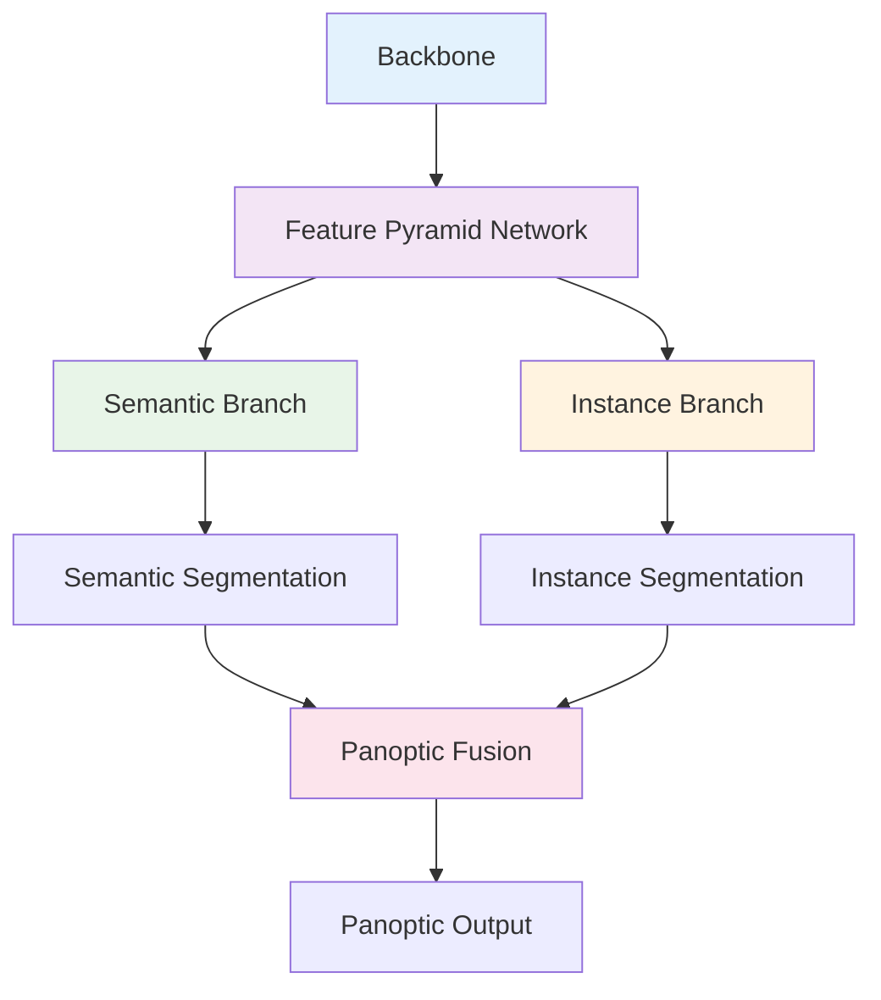
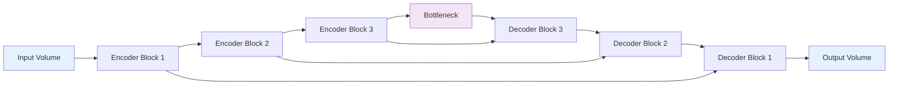

# 3. Segmentation 유형별 분석

## 목차
1. [Semantic Segmentation 심화 분석](#1-semantic-segmentation-심화-분석) 
   1. 1.1. [정의와 수학적 모델링](#11-정의와-수학적-모델링) 
   1. 1.2. [픽셀별 다중 클래스 분류](#12-픽셀별-다중-클래스-분류) 
   1. 1.3. [Dense Prediction 문제](#13-dense-prediction-문제) 

2. [Instance Segmentation 분석](#2-instance-segmentation-분석) 
   2. 2.1. [검출과 분할의 결합](#21-검출과-분할의-결합) 
   2. 2.2. [Proposal 기반 vs Proposal-free 방법](#22-proposal-기반-vs-proposal-free-방법) 
   2. 2.3. [마스크 생성과 후처리](#23-마스크-생성과-후처리) 

3. [Panoptic Segmentation 통합 이론](#3-panoptic-segmentation-통합-이론) 
   3. 3.1. [Stuff와 Things의 수학적 정의](#31-stuff와-things의-수학적-정의) 
   3. 3.2. [Panoptic Quality 메트릭](#32-panoptic-quality-메트릭) 
   3. 3.3. [통합 아키텍처 설계](#33-통합-아키텍처-설계) 

4. [Video Segmentation 시공간 분석](#4-video-segmentation-시공간-분석) 
   4. 4.1. [시간적 일관성 모델링](#41-시간적-일관성-모델링) 
   4. 4.2. [옵티컬 플로우와 추적](#42-옵티컬-플로우와-추적) 
   4. 4.3. [메모리 기반 세그멘테이션](#43-메모리-기반-세그멘테이션) 

5. [3D Segmentation 공간 확장](#5-3d-segmentation-공간-확장) 
   5. 5.1. [3D 컨볼루션과 볼륨 처리](#51-3d-컨볼루션과-볼륨-처리) 
   5. 5.2. [포인트 클라우드 세그멘테이션](#52-포인트-클라우드-세그멘테이션) 
   5. 5.3. [의료 영상에서의 3D 분할](#53-의료-영상에서의-3d-분할)

---

## 1. Semantic Segmentation 심화 분석

### 1.1. 정의와 수학적 모델링

#### 1.1.1. 기본 정의

Semantic Segmentation은 이미지의 모든 픽셀을 사전 정의된 클래스 중 하나로 분류하는 태스크이다. 수학적으로 다음과 같이 정의된다:

주어진 입력 이미지 $I \in \mathbb{R}^{H \times W \times 3}$에 대해, 함수 $f$를 학습하여:

$$f: \mathbb{R}^{H \times W \times 3} \rightarrow \{1, 2, ..., C\}^{H \times W}$$

여기서 $C$는 클래스 수이다.

#### 1.1.2. 확률론적 해석

각 픽셀 $(i,j)$에서 클래스 $c$에 속할 조건부 확률을 모델링:

$$p(y_{i,j} = c | I, \theta) = \text{softmax}(f_\theta(I)_{i,j,c})$$

전체 이미지에 대한 우도(likelihood):

$$p(Y | I, \theta) = \prod_{i=1}^{H} \prod_{j=1}^{W} p(y_{i,j} | I, \theta)$$

이는 픽셀 간의 독립성을 가정한다.

#### 1.1.3. 에너지 함수 관점

Semantic segmentation을 에너지 최소화 문제로 볼 수 있다:

$$E(Y) = \sum_{i,j} \psi_u(y_{i,j}, x_{i,j}) + \lambda \sum_{(i,j) \in \mathcal{N}} \psi_p(y_{i,j}, y_{p,q})$$

여기서:
- $\psi_u$: 단항 위치 함수 (unary potential) - 픽셀별 분류 비용
- $\psi_p$: 쌍항 위치 함수 (pairwise potential) - 인접 픽셀 간 일관성 비용
- $\mathcal{N}$: 인접 픽셀 집합

### 1.2. 픽셀별 다중 클래스 분류

#### 1.2.1. 소프트맥스 분류기

각 픽셀에서 $C$개 클래스에 대한 점수 벡터 $z \in \mathbb{R}^C$가 주어질 때:

$$p(y = c | z) = \frac{e^{z_c}}{\sum_{k=1}^{C} e^{z_k}}$$

이는 다음 성질을 만족한다:
- $\sum_{c=1}^{C} p(y = c | z) = 1$ (확률의 합이 1)
- $p(y = c | z) > 0$ (모든 확률이 양수)

#### 1.2.2. 클래스 불균형 해결

실제 데이터에서는 배경 클래스가 대부분을 차지한다. 이를 해결하기 위한 방법:

**가중 손실 함수**:
$$\mathcal{L}_{weighted} = -\frac{1}{N} \sum_{i,j} w_{y_{i,j}} \log p(y_{i,j} | I)$$

가중치 계산:
- 역빈도 가중치: $w_c = \frac{N}{N_c}$
- 균형 가중치: $w_c = \frac{1}{2} \frac{1}{freq_c}$

**Focal Loss**:
$$\mathcal{L}_{focal} = -\alpha_c (1-p_c)^\gamma \log p_c$$

여기서 $\gamma$는 focusing parameter로, 쉬운 예제의 기여도를 줄인다.

#### 1.2.3. Label Smoothing

Hard label 대신 부드러운 라벨을 사용:

$$y'_{smooth} = (1-\epsilon) y_{true} + \frac{\epsilon}{C}$$

이는 과신(overconfidence)을 방지하고 일반화 성능을 향상시킨다.

### 1.3. Dense Prediction 문제

#### 1.3.1. Receptive Field 이론

각 출력 픽셀이 영향을 받는 입력 영역의 크기:

$$RF_l = RF_{l-1} + (K_l - 1) \times \prod_{i=1}^{l-1} S_i$$

여기서:
- $RF_l$: $l$번째 층의 receptive field
- $K_l$: 커널 크기
- $S_i$: $i$번째 층의 스트라이드

충분한 맥락 정보를 얻기 위해서는 receptive field가 객체 크기보다 커야 한다.

#### 1.3.2. Multi-Scale Context

서로 다른 스케일의 정보를 활용하기 위한 방법:

**Image Pyramid**:
$$\{I_{scale_1}, I_{scale_2}, ..., I_{scale_k}\}$$

각 스케일에서 독립적으로 예측한 후 융합.

**Feature Pyramid**:
서로 다른 층의 특징을 결합:
$$F_{fused} = \text{Concat}(F_{low}, \text{Upsample}(F_{high}))$$

#### 1.3.3. Spatial Consistency 보장

공간적 일관성을 위한 후처리 방법:

**조건부 랜덤 필드 (Conditional Random Field, CRF)**:

$p(Y | I) = \frac{1}{Z(I)} \exp\left(-\sum_{i} \psi_u(y_i) - \sum_{i,j} \psi_p(y_i, y_j)\right)$

여기서:
- $\psi_u(y_i) = -\log p(y_i | x_i)$ (unary potential)
- $\psi_p(y_i, y_j) = \mu(y_i, y_j) \sum_{m=1}^{M} w_m k_m(x_i, x_j)$ (pairwise potential)

**Bilateral Kernel**:
$k_{bilateral}(x_i, x_j) = \exp\left(-\frac{||p_i - p_j||^2}{2\sigma_\alpha^2} - \frac{||I_i - I_j||^2}{2\sigma_\beta^2}\right)$

위치 유사성과 색상 유사성을 모두 고려한다.

## 2. Instance Segmentation 분석

### 2.1. 검출과 분할의 결합

#### 2.1.1. 문제 정의

Instance Segmentation은 동일한 클래스에 속하는 개별 객체들을 구분한다:

$f: \mathbb{R}^{H \times W \times 3} \rightarrow \{(b_i, m_i, c_i)\}_{i=1}^{N}$

여기서:
- $b_i$: 바운딩 박스 좌표 $(x_1, y_1, x_2, y_2)$
- $m_i$: 이진 마스크 $\{0,1\}^{H \times W}$
- $c_i$: 클래스 라벨 $\{1, 2, ..., C\}$
- $N$: 검출된 인스턴스 수

#### 2.1.2. 두 단계 접근법 (Two-Stage Approach)

**1단계: 객체 검출**
Region Proposal Network(RPN)를 통해 후보 영역 생성:

$p_{objectness} = \sigma(W_{cls} \cdot f + b_{cls})$
$t = W_{reg} \cdot f + b_{reg}$

여기서 $t = (t_x, t_y, t_w, t_h)$는 바운딩 박스 회귀 파라미터이다.

**2단계: 마스크 예측**
각 후보 영역에 대해 이진 마스크 생성:

$m_{i,j} = \sigma(f_{mask}(RoI_k)_{i,j})$

#### 2.1.3. 한 단계 접근법 (One-Stage Approach)

YOLACT와 같은 방법에서는 프로토타입 마스크와 계수를 예측:

**프로토타입 생성**:
$P = \{P_1, P_2, ..., P_k\} \in \mathbb{R}^{H \times W \times k}$

**계수 예측**:
$C = \{c_1, c_2, ..., c_n\} \in \mathbb{R}^{n \times k}$

**최종 마스크**:
$M_i = \sigma(C_i \cdot P^T)$

### 2.2. Proposal 기반 vs Proposal-free 방법

#### 2.2.1. Proposal 기반 방법의 수학적 분석

**Mask R-CNN의 멀티태스크 손실**:

$\mathcal{L} = \mathcal{L}_{cls} + \mathcal{L}_{box} + \mathcal{L}_{mask}$

각 구성요소:
- $\mathcal{L}_{cls} = -\log p_{cls}$ (분류 손실)
- $\mathcal{L}_{box} = \sum_{i \in \{x,y,w,h\}} \text{smooth}_{L1}(t_i - t_i^*)$ (박스 회귀 손실)
- $\mathcal{L}_{mask} = -\frac{1}{m^2} \sum_{i,j} [y_{ij} \log \hat{y}_{ij}^k + (1-y_{ij}) \log(1-\hat{y}_{ij}^k)]$ (마스크 손실)

#### 2.2.2. Proposal-free 방법의 장점

**계산 효율성**:
- RPN 과정 생략으로 추론 속도 향상
- End-to-end 학습 가능

**메모리 효율성**:
- ROI pooling/align 과정 불필요
- 고정된 메모리 사용량

#### 2.2.3. 성능 비교

| 측면 | Proposal 기반 | Proposal-free |
|------|---------------|---------------|
| **정확도** | 높음 | 중간 |
| **속도** | 느림 | 빠름 |
| **메모리** | 많음 | 적음 |
| **복잡도** | 복잡 | 단순 |

### 2.3. 마스크 생성과 후처리

#### 2.3.1. ROI Align의 수학적 원리

ROI Pooling의 양자화 오차를 해결하기 위해 bilinear interpolation 사용:

$f(x,y) = f(x_1,y_1)(x_2-x)(y_2-y) + f(x_2,y_1)(x-x_1)(y_2-y)$
$+ f(x_1,y_2)(x_2-x)(y-y_1) + f(x_2,y_2)(x-x_1)(y-y_1)$

여기서 $(x_1,y_1), (x_2,y_1), (x_1,y_2), (x_2,y_2)$는 $(x,y)$ 주변의 격자점이다.

#### 2.3.2. 마스크 후처리

**Non-Maximum Suppression (NMS)**:
IoU 기준으로 중복 검출 제거:

$\text{keep} = \{i : \max_{j \neq i} IoU(m_i, m_j) < \tau_{NMS}\}$

**Soft-NMS**:
점수를 부드럽게 감소시킴:

$s_i = s_i \cdot e^{-\frac{IoU(m_i, m_j)^2}{\sigma}}$

#### 2.3.3. 마스크 정제

**GrabCut 알고리즘**:
예측된 마스크를 초기 추정으로 사용하여 정제:

$E = \sum_{n} D_n(\alpha_n, k_n, \theta, z_n) + \gamma \sum_{(m,n) \in C} V(\alpha_m, \alpha_n)$

여기서:
- $\alpha_n \in \{0,1\}$: 픽셀 $n$의 전경/배경 라벨
- $D_n$: 데이터 항
- $V$: 평활화 항

## 3. Panoptic Segmentation 통합 이론

### 3.1. Stuff와 Things의 수학적 정의

#### 3.1.1. 개념적 구분

**Things**: 셀 수 있는 객체 (자동차, 사람, 동물 등)
- 명확한 경계를 가짐
- 개별 인스턴스로 구분 가능

**Stuff**: 셀 수 없는 영역 (하늘, 잔디, 도로 등)
- 형태가 일정하지 않음
- 개별 인스턴스 구분이 의미 없음

#### 3.1.2. 수학적 표현

Panoptic segmentation의 출력:

$P: \Omega \rightarrow \mathcal{L} \times \mathbb{N}$

여기서:
- $\Omega$: 이미지 도메인
- $\mathcal{L} = \mathcal{L}_{stuff} \cup \mathcal{L}_{thing}$: 모든 클래스 라벨
- $\mathbb{N}$: 인스턴스 ID (stuff의 경우 0)

각 픽셀 $(i,j)$는 $(class\_id, instance\_id)$ 튜플로 표현된다.

#### 3.1.3. 제약 조건

1. **유일성**: 각 픽셀은 정확히 하나의 세그먼트에 속함
2. **완전성**: 모든 픽셀이 분할되어야 함
3. **stuff 제약**: stuff 클래스는 인스턴스 ID가 0

### 3.2. Panoptic Quality 메트릭

#### 3.2.1. PQ 메트릭 정의

$PQ = \frac{\sum_{(p,g) \in TP} IoU(p,g)}{|TP| + \frac{1}{2}|FP| + \frac{1}{2}|FN|}$

이를 분해하면:
$PQ = \underbrace{\frac{\sum_{(p,g) \in TP} IoU(p,g)}{|TP|}}_{SQ} \times \underbrace{\frac{|TP|}{|TP| + \frac{1}{2}|FP| + \frac{1}{2}|FN|}}_{RQ}$

여기서:
- $SQ$ (Segmentation Quality): 매칭된 세그먼트의 평균 IoU
- $RQ$ (Recognition Quality): 인식 품질

#### 3.2.2. 매칭 알고리즘

예측 세그먼트 $p$와 Ground Truth 세그먼트 $g$ 간의 매칭:

$\text{match}(p,g) = \begin{cases}
True & \text{if } IoU(p,g) > 0.5 \text{ and same class} \\
False & \text{otherwise}
\end{cases}$

#### 3.2.3. 클래스별 PQ

Things와 Stuff을 별도로 평가:

$PQ^{th} = \frac{1}{|\mathcal{C}^{th}|} \sum_{c \in \mathcal{C}^{th}} PQ_c$
$PQ^{st} = \frac{1}{|\mathcal{C}^{st}|} \sum_{c \in \mathcal{C}^{st}} PQ_c$

### 3.3. 통합 아키텍처 설계

#### 3.3.1. Feature Pyramid Network 기반 설계

#### 3.3.2. 융합 알고리즘

**우선순위 기반 융합**:
1. Instance 마스크를 신뢰도 순으로 정렬
2. 높은 신뢰도부터 순차적으로 배치
3. 겹치는 영역은 높은 신뢰도가 우선
4. 남은 영역을 semantic 결과로 채움

**수식 표현**:
$panoptic(i,j) = \begin{cases}
(c_{inst}, id_{inst}) & \text{if } \exists \text{ instance mask covers } (i,j) \\
(c_{sem}, 0) & \text{otherwise}
\end{cases}$

#### 3.3.3. 엔드투엔드 학습

**통합 손실 함수**:
$\mathcal{L}_{panoptic} = \mathcal{L}_{semantic} + \lambda_{inst} \mathcal{L}_{instance} + \lambda_{panoptic} \mathcal{L}_{panoptic}$

여기서 $\mathcal{L}_{panoptic}$는 융합 과정의 일관성을 보장하는 손실이다.

## 4. Video Segmentation 시공간 분석

### 4.1. 시간적 일관성 모델링

#### 4.1.1. 3D 컨볼루션 확장

시공간 특징 추출을 위한 3D 컨볼루션:

$(I * K)(x,y,t) = \sum_{i=0}^{k_x-1} \sum_{j=0}^{k_y-1} \sum_{l=0}^{k_t-1} I(x+i,y+j,t+l) K(i,j,l)$

여기서 $(k_x, k_y, k_t)$는 공간-시간 커널 크기이다.

#### 4.1.2. 시간적 정규화

연속 프레임 간의 일관성을 위한 정규화 항:

$\mathcal{L}_{temporal} = \frac{1}{T-1} \sum_{t=1}^{T-1} ||S^{(t+1)} - W(S^{(t)}, F^{(t \rightarrow t+1)})||^2$

여기서:
- $S^{(t)}$: $t$ 시점의 세그멘테이션 결과
- $W(\cdot, \cdot)$: 워핑(warping) 함수
- $F^{(t \rightarrow t+1)}$: 옵티컬 플로우

#### 4.1.3. 상태 공간 모델

Hidden Markov Model로 시간적 의존성 모델링:

$p(S^{(1:T)} | I^{(1:T)}) = p(S^{(1)}) \prod_{t=2}^{T} p(S^{(t)} | S^{(t-1)}) p(I^{(t)} | S^{(t)})$

### 4.2. 옵티컬 플로우와 추적

#### 4.2.1. 옵티컬 플로우 추정

Lucas-Kanade 방법의 기본 가정:
$I(x,y,t) = I(x+dx, y+dy, t+dt)$

1차 테일러 전개:
$I_x \frac{dx}{dt} + I_y \frac{dy}{dt} + I_t = 0$

즉, $I_x u + I_y v + I_t = 0$ (여기서 $u = dx/dt, v = dy/dt$)

#### 4.2.2. 플로우 기반 워핑

$W(I^{(t)}, F) = I^{(t)}(x + F_x(x,y), y + F_y(x,y))$

이때 bilinear interpolation을 사용하여 연속 좌표를 처리한다.

#### 4.2.3. 다중 객체 추적

**헝가리안 알고리즘**을 사용한 최적 할당:

비용 행렬 $C_{ij} = cost(detection_i, track_j)$에 대해:
$\min \sum_{i,j} C_{ij} x_{ij}$

제약 조건:
- $\sum_j x_{ij} \leq 1$ (각 검출은 최대 하나의 트랙에 할당)
- $\sum_i x_{ij} \leq 1$ (각 트랙은 최대 하나의 검출에 할당)

### 4.3. 메모리 기반 세그멘테이션

#### 4.3.1. 메모리 뱅크 구조

$M = \{(k_1, v_1), (k_2, v_2), ..., (k_n, v_n)\}$

여기서:
- $k_i \in \mathbb{R}^d$: 특징 키 벡터
- $v_i \in \mathbb{R}^c$: 라벨 값 벡터

#### 4.3.2. Attention 기반 읽기

쿼리 $q$에 대한 메모리 읽기:

$w_i = \frac{\exp(f(q, k_i))}{\sum_j \exp(f(q, k_j))}$

$output = \sum_i w_i v_i$

여기서 $f(q, k) = q^T k / \sqrt{d}$는 attention 함수이다.

#### 4.3.3. 점진적 메모리 업데이트

새로운 프레임에서 메모리 업데이트:

$M_{t+1} = M_t \cup \{(k_{new}, v_{new})\}$

메모리 크기 제한을 위한 삭제 전략:
- FIFO (First In, First Out)
- LRU (Least Recently Used)  
- 중요도 기반 샘플링

## 5. 3D Segmentation 공간 확장

### 5.1. 3D 컨볼루션과 볼륨 처리

#### 5.1.1. 3D 컨볼루션 연산

$O(x,y,z) = \sum_{i=0}^{k_x-1} \sum_{j=0}^{k_y-1} \sum_{l=0}^{k_z-1} I(x+i,y+j,z+l) W(i,j,l)$

3D 컨볼루션의 파라미터 수: $k_x \times k_y \times k_z \times C_{in} \times C_{out}$

#### 5.1.2. 메모리 효율적 3D 처리

**Factorized 3D Convolution**:
$(k \times k \times k)$ 커널을 $(k \times 1 \times 1)$, $(1 \times k \times 1)$, $(1 \times 1 \times k)$로 분해

파라미터 감소: $k^3 \rightarrow 3k$

**Depthwise Separable 3D Convolution**:
공간과 채널을 분리하여 처리

#### 5.1.3. 다해상도 3D 처리

**3D U-Net 구조**:

### 5.2. 포인트 클라우드 세그멘테이션

#### 5.2.1. 포인트 클라우드 표현

포인트 클라우드 $P = \{p_1, p_2, ..., p_n\}$, 여기서 $p_i \in \mathbb{R}^3$ (또는 추가 특징 포함 시 $\mathbb{R}^d$)

순서에 불변인 함수 필요:
$f(\{p_1, p_2, ..., p_n\}) = f(\{p_{\pi(1)}, p_{\pi(2)}, ..., p_{\pi(n)}\})$

#### 5.2.2. PointNet 아키텍처

**대칭 함수 사용**:
$f(\{p_1, ..., p_n\}) = \gamma \left( \text{MAX}_{i=1}^n \{\phi(p_i)\} \right)$

여기서:
- $\phi: \mathbb{R}^d \rightarrow \mathbb{R}^{k}$: 포인트별 변환
- $\gamma: \mathbb{R}^k \rightarrow \mathbb{R}^{m}$: 집합 함수

#### 5.2.3. Graph Convolution

포인트 간의 관계를 그래프로 모델링:

$f'(v_i) = \text{AGGREGATE}(\{f(v_j) : v_j \in \mathcal{N}(v_i)\})$

여기서 $\mathcal{N}(v_i)$는 포인트 $v_i$의 이웃집합이다.

**Edge Convolution**:
$e_{ij} = \text{ReLU}(\theta \cdot (f(v_i) || f(v_j) - f(v_i)))$

### 5.3. 의료 영상에서의 3D 분할

#### 5.3.1. 의료 영상의 특성

- **이등방성**: 각 방향의 해상도가 다름 (예: $1 \times 1 \times 3$ mm)
- **높은 해상도**: 메모리 제약으로 patch 단위 처리
- **클래스 불균형**: 병변 영역이 매우 작음

#### 5.3.2. 패치 기반 처리

**중복 패치 전략**:
각 복셀이 여러 패치에 포함되도록 하여 경계 효과 감소

$overlap = \frac{patch\_size - stride}{patch\_size}$

일반적으로 50% 중복 사용

**가중 융합**:
중복 영역에서 가중 평균 사용:

$p_{final}(x,y,z) = \frac{\sum_i w_i(x,y,z) p_i(x,y,z)}{\sum_i w_i(x,y,z)}$

#### 5.3.3. 의료 특화 손실 함수

**Dice Loss**:
$\mathcal{L}_{dice} = 1 - \frac{2 \sum_{i} p_i g_i + \epsilon}{\sum_{i} p_i + \sum_{i} g_i + \epsilon}$

**Focal Dice Loss**:
$\mathcal{L}_{focal\_dice} = \sum_c (1 - DC_c)^\gamma$

여기서 $DC_c$는 클래스 $c$의 Dice 계수이다.

**Surface Loss**:
경계의 정확도를 직접 최적화:

$\mathcal{L}_{surface} = \sum_{i} p_i d_i$

여기서 $d_i$는 픽셀 $i$에서 실제 경계까지의 거리이다.

---

## 용어 목록

- **Attention**: 어텐션 - 중요한 부분에 집중하는 메커니즘
- **Bilateral Kernel**: 바이래터럴 커널 - 위치와 색상 정보를 모두 고려하는 커널
- **Bilinear Interpolation**: 바이리니어 인터폴레이션 - 이중 선형 보간법
- **Conditional Random Field (CRF)**: 컨디셔널 랜덤 필드 - 조건부 랜덤 필드
- **Dense Prediction**: 덴스 프레딕션 - 조밀한 예측, 모든 픽셀에 대한 예측
- **Depthwise Separable Convolution**: 뎁스와이즈 세퍼러블 컨볼루션 - 채널별 분리 컨볼루션
- **Factorized Convolution**: 팩토라이즈드 컨볼루션 - 분해된 컨볼루션
- **Feature Pyramid**: 피처 피라미드 - 다중 스케일 특징 피라미드
- **FIFO**: 파이포 - First In, First Out (선입선출)
- **Focal Loss**: 포컬 로스 - 어려운 예제에 집중하는 손실 함수
- **GrabCut**: 그랩컷 - 대화형 이미지 분할 알고리즘
- **Hungarian Algorithm**: 헝가리안 알고리즘 - 최적 할당 문제 해결 알고리즘
- **Label Smoothing**: 레이블 스무딩 - 라벨을 부드럽게 만드는 정규화 기법
- **Least Recently Used (LRU)**: 리스트 리센틀리 유즈드 - 가장 오래전에 사용된 것 제거
- **Lucas-Kanade**: 루카스 카나데 - 옵티컬 플로우 추정 방법
- **Non-Maximum Suppression (NMS)**: 논 맥시멈 서프레션 - 중복 제거 알고리즘
- **Optical Flow**: 옵티컬 플로우 - 광학 흐름, 픽셀의 움직임 벡터
- **Pairwise Potential**: 페어와이즈 포텐셜 - 쌍항 위치 함수
- **Panoptic**: 파놉틱 - 전체적인, 모든 것을 포함하는
- **PointNet**: 포인트넷 - 포인트 클라우드 처리 신경망
- **Proposal**: 프로포절 - 후보 영역
- **Receptive Field**: 리셉티브 필드 - 수용 영역
- **Region Proposal Network (RPN)**: 리전 프로포절 네트워크 - 영역 후보 네트워크
- **ROI Align**: 알오아이 얼라인 - 관심 영역 정렬
- **Semantic**: 시맨틱 - 의미론적인
- **Soft-NMS**: 소프트 엔엠에스 - 부드러운 중복 제거
- **Stuff**: 스터프 - 셀 수 없는 배경 영역
- **Surface Loss**: 서피스 로스 - 표면/경계 기반 손실 함수
- **Things**: 씽즈 - 셀 수 있는 개별 객체들
- **Unary Potential**: 유나리 포텐셜 - 단항 위치 함수
- **Warping**: 워핑 - 이미지 변형/뒤틀림