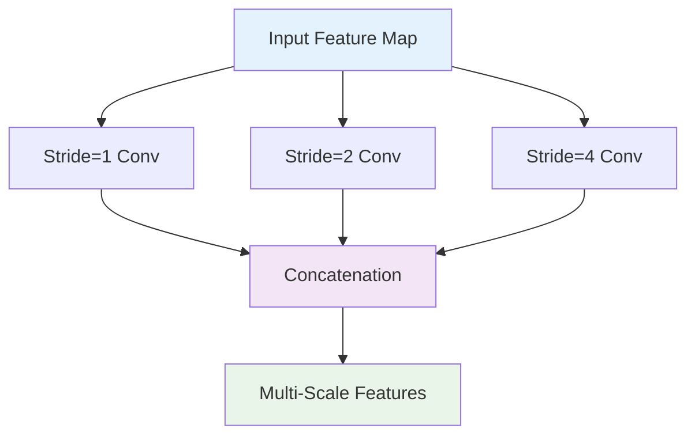
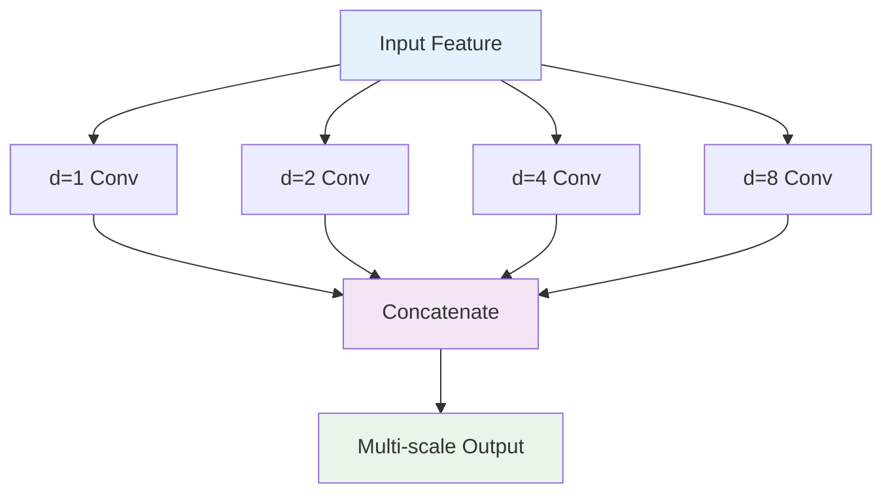
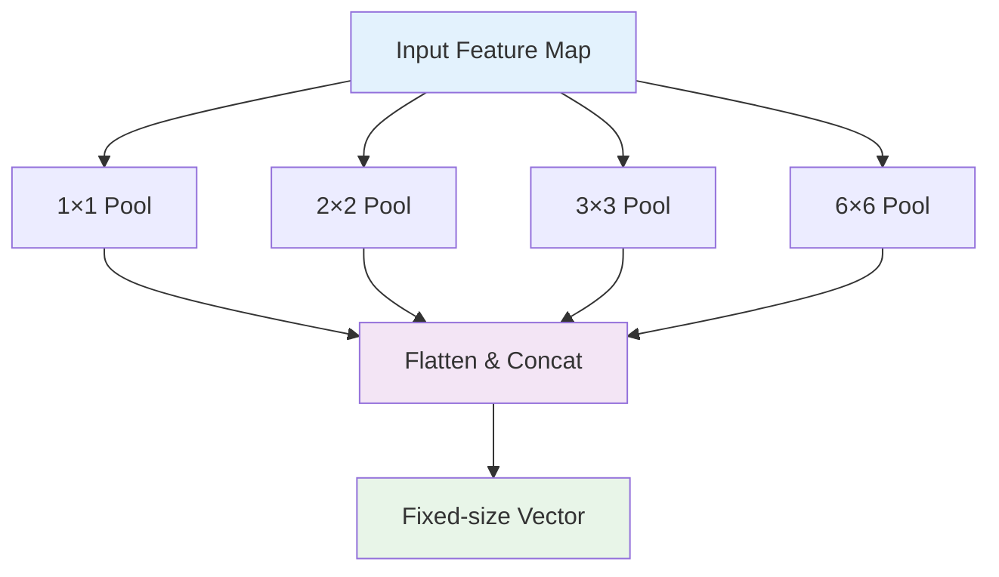

# 4. 샘플링 기법 이론

## 목차
1. [다운샘플링 기법 심화](#1-다운샘플링-기법-심화)<br/>
   1. 1.1. [Pooling 연산의 수학적 분석](#11-pooling-연산의-수학적-분석)<br/>
   1. 1.2. [Stride 기반 컨볼루션](#12-stride-기반-컨볼루션)<br/>
   1. 1.3. [Sampling Theory와 Aliasing](#13-sampling-theory와-aliasing)<br/>

2. [업샘플링 기법 심화](#2-업샘플링-기법-심화)<br/>
   2. 2.1. [보간법의 수학적 원리](#21-보간법의-수학적-원리)<br/>
   2. 2.2. [Transposed Convolution 상세 분석](#22-transposed-convolution-상세-분석)<br/>
   2. 2.3. [Unpooling과 Learned Upsampling](#23-unpooling과-learned-upsampling)<br/>

3. [Dilated/Atrous Convolution](#3-dilatedatrous-convolution)<br/>
   3. 3.1. [Dilated Convolution의 수학적 정의](#31-dilated-convolution의-수학적-정의)<br/>
   3. 3.2. [Receptive Field 확장 이론](#32-receptive-field-확장-이론)<br/>
   3. 3.3. [Multi-Scale Context Aggregation](#33-multi-scale-context-aggregation)<br/>

4. [특징맵 크기 계산과 메모리 분석](#4-특징맵-크기-계산과-메모리-분석)<br/>
   4. 4.1. [차원 변화 공식 유도](#41-차원-변화-공식-유도)<br/>
   4. 4.2. [메모리 사용량 분석](#42-메모리-사용량-분석)<br/>
   4. 4.3. [계산 복잡도 분석](#43-계산-복잡도-분석)<br/>

5. [고급 샘플링 기법](#5-고급-샘플링-기법)<br/>
   5. 5.1. [Adaptive Pooling](#51-adaptive-pooling)<br/>
   5. 5.2. [Spatial Pyramid Pooling](#52-spatial-pyramid-pooling)<br/>
   5. 5.3. [Deformable Convolution](#53-deformable-convolution)<br/>

---

## 1. 다운샘플링 기법 심화

### 1.1. Pooling 연산의 수학적 분석

#### 1.1.1. Max Pooling

Max Pooling은 지역 최대값을 선택하는 연산이다:

$P_{max}(X)_{i,j} = \max_{0 \leq p < k, 0 \leq q < k} X_{i \cdot s + p, j \cdot s + q}$

여기서:
- $k$: 풀링 윈도우 크기
- $s$: 스트라이드

**수학적 성질**:
- **Translation Invariance**: 작은 이동에 대해 불변
- **비선형성**: 미분 불가능한 점 존재
- **정보 선택성**: 최대값만 보존, 나머지 정보 손실

**역전파에서의 gradient**:
$\frac{\partial L}{\partial X_{p,q}} = \begin{cases}
\frac{\partial L}{\partial P_{i,j}} & \text{if } X_{p,q} = \max \text{ in pool window} \\
0 & \text{otherwise}
\end{cases}$

#### 1.1.2. Average Pooling

Average Pooling은 지역 평균을 계산한다:

$P_{avg}(X)_{i,j} = \frac{1}{k^2} \sum_{p=0}^{k-1} \sum_{q=0}^{k-1} X_{i \cdot s + p, j \cdot s + q}$

**수학적 성질**:
- **선형성**: 모든 점에서 미분 가능
- **저역 통과 필터**: 고주파 성분 제거
- **정보 보존성**: 모든 값이 기여

**역전파에서의 gradient**:
$\frac{\partial L}{\partial X_{p,q}} = \frac{1}{k^2} \frac{\partial L}{\partial P_{i,j}}$

#### 1.1.3. Global Pooling

전체 특징맵에 대한 pooling:

$P_{global}(X) = \text{Pool}(\text{all spatial locations})$

**Global Average Pooling (GAP)**:
$GAP(X) = \frac{1}{H \times W} \sum_{i=1}^{H} \sum_{j=1}^{W} X_{i,j}$

장점:
- 완전연결층 대체 가능
- 과적합 방지
- 파라미터 수 감소

#### 1.1.4. Learnable Pooling

파라미터를 가진 pooling 연산:

$P_{learnable}(X)_{i,j} = \sum_{p,q} w_{p,q} \cdot X_{i+p,j+q}$

여기서 $w_{p,q}$는 학습 가능한 가중치이다.

### 1.2. Stride 기반 컨볼루션

#### 1.2.1. Strided Convolution의 정의

스트라이드 $s$를 가진 컨볼루션:

$Y_{i,j} = \sum_{m=0}^{k-1} \sum_{n=0}^{k-1} X_{i \cdot s + m, j \cdot s + n} W_{m,n}$

출력 크기:
$H_{out} = \left\lfloor \frac{H_{in} + 2p - k}{s} \right\rfloor + 1$
$W_{out} = \left\lfloor \frac{W_{in} + 2p - k}{s} \right\rfloor + 1$

#### 1.2.2. 정보 보존 vs 압축 트레이드오프

**압축 비율**: $compression\_ratio = s^2$

**정보 손실 분석**:
- 스트라이드가 클수록 더 많은 정보 손실
- 하지만 계산량과 메모리 사용량 감소

**최적 스트라이드 선택**:
일반적으로 $s = 2$가 좋은 균형점:
- 4배 크기 감소
- 합리적인 정보 보존

#### 1.2.3. Multi-Scale Strided Convolution

서로 다른 스트라이드를 병렬로 사용:



### 1.3. Sampling Theory와 Aliasing

#### 1.3.1. Nyquist 샘플링 정리

신호를 완벽하게 재구성하기 위한 최소 샘플링 주파수:

$f_s \geq 2f_{max}$

여기서 $f_{max}$는 신호의 최대 주파수이다.

**디지털 영상에서의 적용**:
- 영상의 고주파 성분은 가장자리, 텍스처
- 다운샘플링 시 고주파 성분이 저주파로 겹쳐짐 (aliasing)

#### 1.3.2. Anti-Aliasing 기법

**저역 통과 필터 적용**:
다운샘플링 전에 고주파 성분 제거

$I_{filtered} = I * G_\sigma$

여기서 $G_\sigma$는 가우시안 커널:
$G_\sigma(x,y) = \frac{1}{2\pi\sigma^2} e^{-\frac{x^2+y^2}{2\sigma^2}}$

**최적 $\sigma$ 값**:
$\sigma = \frac{s}{2\pi}$

여기서 $s$는 다운샘플링 비율이다.

#### 1.3.3. 주파수 도메인 분석

**2D 이산 푸리에 변환 (DFT)**:
$F(u,v) = \frac{1}{MN} \sum_{x=0}^{M-1} \sum_{y=0}^{N-1} f(x,y) e^{-j2\pi(ux/M + vy/N)}$

**다운샘플링의 주파수 도메인 효과**:
- 주파수 스펙트럼이 확장됨
- 고주파 성분이 저주파 영역으로 겹침

## 2. 업샘플링 기법 심화

### 2.1. 보간법의 수학적 원리

#### 2.1.1. Nearest Neighbor 보간

$I(x,y) = I(\text{round}(x), \text{round}(y))$

**특징**:
- 계산이 가장 간단
- 블록 현상 발생
- 가장자리가 계단 형태

#### 2.1.2. Bilinear 보간

네 개의 인접 픽셀을 사용한 선형 보간:

$f(x,y) = f(0,0)(1-x)(1-y) + f(1,0)x(1-y) + f(0,1)(1-x)y + f(1,1)xy$

여기서 $(x,y) \in [0,1] \times [0,1]$이다.

**단계별 계산**:
1. x 방향 보간: 
   $f(x,0) = f(0,0)(1-x) + f(1,0)x$
   $f(x,1) = f(0,1)(1-x) + f(1,1)x$

2. y 방향 보간:
   $f(x,y) = f(x,0)(1-y) + f(x,1)y$

#### 2.1.3. Bicubic 보간

16개의 인접 픽셀을 사용한 3차 보간:

$f(x,y) = \sum_{i=0}^{3} \sum_{j=0}^{3} a_{ij} x^i y^j$

**Cubic kernel**:
$w(t) = \begin{cases}
(a+2)|t|^3 - (a+3)|t|^2 + 1 & 0 \leq |t| \leq 1 \\
a|t|^3 - 5a|t|^2 + 8a|t| - 4a & 1 < |t| \leq 2 \\
0 & |t| > 2
\end{cases}$

일반적으로 $a = -0.5$를 사용한다.

#### 2.1.4. Lanczos 보간

Sinc 함수 기반의 보간:

$L(x) = \begin{cases}
\text{sinc}(x) \text{sinc}(x/a) & -a \leq x \leq a \\
0 & \text{otherwise}
\end{cases}$

여기서 $\text{sinc}(x) = \sin(\pi x)/(\pi x)$이고, 일반적으로 $a=3$을 사용한다.

### 2.2. Transposed Convolution 상세 분석

#### 2.2.1. 수학적 정의

Transposed Convolution은 일반 컨볼루션의 역과정이다:

일반 컨볼루션: $Y = XW$
Transposed 컨볼루션: $Z = W^T Y$

**실제 구현**:
입력에 제로 패딩과 스트라이드를 적용한 후 일반 컨볼루션 수행

#### 2.2.2. 상세한 연산 과정

입력 크기 $2 \times 2$, 커널 크기 $3 \times 3$, 스트라이드 $2$인 경우:

1. **제로 삽입**: 입력 원소 사이에 $(s-1)$개의 0 삽입
2. **패딩 추가**: $(k-1)$만큼 패딩
3. **일반 컨볼루션 적용**

**출력 크기 계산**:
$H_{out} = (H_{in} - 1) \times s - 2p + k$

여기서:
- $H_{in}$: 입력 크기
- $s$: 스트라이드  
- $p$: 패딩
- $k$: 커널 크기

#### 2.2.3. Checkerboard Artifacts 문제

**발생 원因**:
- 커널 크기가 스트라이드의 배수가 아닐 때
- 일부 출력 위치가 더 많은 입력의 영향을 받음

**수학적 분석**:
중첩 패턴: $overlap = k - s$

**해결 방법**:
1. $k$를 $s$의 배수로 설정: $k = n \times s$
2. Resize + Convolution 사용
3. Sub-pixel convolution 적용

#### 2.2.4. Sub-pixel Convolution

**Pixel Shuffle 연산**:
$PS(X)_{x,y,c} = X_{\lfloor x/r \rfloor, \lfloor y/r \rfloor, c \cdot r^2 + r \cdot (y \bmod r) + (x \bmod r)}$

여기서 $r$은 업스케일링 비율이다.

### 2.3. Unpooling과 Learned Upsampling

#### 2.3.1. Max Unpooling

Max pooling의 역연산:
1. Max pooling 시 최대값 위치 저장
2. Unpooling 시 해당 위치에만 값 배치, 나머지는 0

**Switch variables**:
$S_{i,j} = \arg\max_{(p,q) \in \text{pool window}} X_{p,q}$

#### 2.3.2. Learned Upsampling

**1×1 Convolution + Resize**:
```
Input → 1×1 Conv (expand channels) → Resize → 1×1 Conv (reduce channels)
```

**Depth-to-Space**:
채널 차원을 공간 차원으로 변환:
$Y_{x,y,c} = X_{\lfloor x/r \rfloor, \lfloor y/r \rfloor, c \cdot r^2 + (x \bmod r) \cdot r + (y \bmod r)}$

#### 2.3.3. 업샘플링 방법 비교

| 방법 | 장점 | 단점 |
|------|------|------|
| **Nearest** | 빠름, 간단 | 블록 현상 |
| **Bilinear** | 부드러움 | 흐려짐 |
| **Transposed Conv** | 학습 가능 | Checkerboard |
| **Sub-pixel** | 아티팩트 적음 | 복잡함 |

## 3. Dilated/Atrous Convolution

### 3.1. Dilated Convolution의 수학적 정의

#### 3.1.1. 기본 정의

Dilated convolution은 커널 사이에 간격을 두는 컨볼루션이다:

$Y_{i,j} = \sum_{m=0}^{k-1} \sum_{n=0}^{k-1} X_{i+m \cdot d, j+n \cdot d} W_{m,n}$

여기서 $d$는 dilation rate이다.

**표준 컨볼루션과의 관계**:
- $d = 1$일 때 표준 컨볼루션과 동일
- $d > 1$일 때 sparse한 연결

#### 3.1.2. Effective Receptive Field

Dilated convolution의 유효 커널 크기:
$k_{effective} = k + (k-1)(d-1) = k \cdot d - (d-1)$

**예시**:
- $k=3, d=2$: $k_{effective} = 5$
- $k=3, d=4$: $k_{effective} = 9$

#### 3.1.3. 출력 크기 계산

$H_{out} = \left\lfloor \frac{H_{in} + 2p - k_{effective}}{s} \right\rfloor + 1$

여기서 $k_{effective} = k + (k-1)(d-1)$이다.

### 3.2. Receptive Field 확장 이론

#### 3.2.1. 지수적 확장 전략

연속된 층에서 dilation rate를 지수적으로 증가:
$d_l = 2^{l-1}$

**예시** ($k=3$ 커널):
- Layer 1: $d=1$, RF = 3
- Layer 2: $d=2$, RF = 7  
- Layer 3: $d=4$, RF = 15
- Layer 4: $d=8$, RF = 31

#### 3.2.2. Receptive Field 계산 공식

$l$번째 층의 receptive field:
$RF_l = RF_{l-1} + (k-1) \cdot d_l \cdot \prod_{i=1}^{l-1} s_i$

**Dilated convolution only** (stride = 1):
$RF_l = 1 + \sum_{i=1}^{l} (k-1) \cdot d_i$

#### 3.2.3. Context Aggregation 효과

**Multi-scale context**:
서로 다른 dilation rate로 다양한 스케일의 정보 수집:



### 3.3. Multi-Scale Context Aggregation

#### 3.3.1. Atrous Spatial Pyramid Pooling (ASPP)

ASPP는 여러 dilation rate를 병렬로 사용:

$ASPP(X) = \text{Concat}([X * W_0, X *_1 W_1, X *_2 W_2, ..., X *_n W_n])$

여기서 $*_d$는 dilation rate $d$인 컨볼루션이다.

**표준 ASPP 설정**:
- $d \in \{1, 6, 12, 18\}$ (또는 $\{1, 2, 4, 8\}$)
- 각각 $3 \times 3$ 커널 사용
- Global Average Pooling 추가

#### 3.3.2. Dilated Residual Networks

잔차 연결과 dilated convolution 결합:

$Y = X + F(X, d)$

여기서 $F(X, d)$는 dilation rate $d$인 잔차 블록이다.

#### 3.3.3. Gridding Effect 문제

**문제 정의**:
높은 dilation rate에서 일부 픽셀만 계산에 참여하여 격자 무늬 효과 발생

**해결 방법**:
1. **Hybrid dilated convolution**: 연속 층의 dilation rate가 서로소가 되도록 설계
2. **Dense connection**: 여러 층의 출력을 결합
3. **Separable dilated convolution**: 채널별로 다른 dilation rate 적용

## 4. 특징맵 크기 계산과 메모리 분석

### 4.1. 차원 변화 공식 유도

#### 4.1.1. 일반화된 공식

입력: $(H_{in}, W_{in})$
커널: $(k_h, k_w)$  
패딩: $(p_h, p_w)$
스트라이드: $(s_h, s_w)$
Dilation: $(d_h, d_w)$

$H_{out} = \left\lfloor \frac{H_{in} + 2p_h - d_h(k_h - 1) - 1}{s_h} \right\rfloor + 1$

$W_{out} = \left\lfloor \frac{W_{in} + 2p_w - d_w(k_w - 1) - 1}{s_w} \right\rfloor + 1$

#### 4.1.2. Same Padding 계산

출력 크기가 입력과 동일하도록 하는 패딩:

$p = \frac{(H_{out} - 1) \cdot s - H_{in} + k}{2}$

**Same padding with stride > 1**:
$p = \frac{k - 1}{2}$

#### 4.1.3. Valid vs Same vs Full Padding

**Valid Padding**: $p = 0$
$H_{out} = H_{in} - k + 1$

**Same Padding**: 입력과 출력 크기 동일 (stride=1일 때)
$H_{out} = H_{in}$

**Full Padding**: $p = k - 1$  
$H_{out} = H_{in} + k - 1$

### 4.2. 메모리 사용량 분석

#### 4.2.1. 특징맵 메모리

각 층의 메모리 사용량:
$Memory_{feature} = H \times W \times C \times \text{data\_type\_size}$

**데이터 타입별 크기**:
- FP32: 4 bytes
- FP16: 2 bytes  
- INT8: 1 byte

#### 4.2.2. 가중치 메모리

컨볼루션 층의 가중치:
$Memory_{weight} = k_h \times k_w \times C_{in} \times C_{out} \times \text{data\_type\_size}$

**Depthwise separable convolution**:
$Memory_{dw} = k \times k \times C + 1 \times 1 \times C \times C_{out}$

#### 4.2.3. 총 메모리 추정

**Forward pass**:
$Memory_{total} = \sum_{l=1}^{L} (Memory_{feature}^{(l)} + Memory_{weight}^{(l)})$

**Training** (gradient 저장 포함):
$Memory_{training} = 3 \times Memory_{total}$

### 4.3. 계산 복잡도 분석

#### 4.3.1. FLOPs 계산

**Standard convolution**:
$FLOPs = H_{out} \times W_{out} \times C_{out} \times (k^2 \times C_{in} + 1)$

여기서 +1은 bias 더하기이다.

**Depthwise separable convolution**:
$FLOPs_{dw} = H_{out} \times W_{out} \times C_{in} \times k^2$
$FLOPs_{pw} = H_{out} \times W_{out} \times C_{in} \times C_{out}$
$FLOPs_{total} = FLOPs_{dw} + FLOPs_{pw}$

#### 4.3.2. MAC (Multiply-Accumulate) 연산

$MAC = \frac{FLOPs}{2}$

각 MAC 연산은 하나의 곱셈과 하나의 덧셈을 포함한다.

#### 4.3.3. 시간 복잡도 분석

**표준 구현**: $O(H \cdot W \cdot C_{in} \cdot C_{out} \cdot k^2)$

**FFT 기반**: $O(H \cdot W \cdot C_{in} \cdot C_{out} \cdot \log(H \cdot W))$

FFT가 유리한 조건: $k^2 > \log(H \cdot W)$

## 5. 고급 샘플링 기법

### 5.1. Adaptive Pooling

#### 5.1.1. Adaptive Average Pooling

출력 크기를 고정하고 동적으로 풀링 크기 결정:

$pool\_size_h = \left\lceil \frac{H_{in}}{H_{out}} \right\rceil$
$pool\_size_w = \left\lceil \frac{W_{in}}{W_{out}} \right\rceil$

**구간 계산**:
$start_h = \left\lfloor \frac{i \cdot H_{in}}{H_{out}} \right\rfloor$
$end_h = \left\lceil \frac{(i+1) \cdot H_{in}}{H_{out}} \right\rceil$

#### 5.1.2. RoI Pooling vs RoI Align

**RoI Pooling**:
1. RoI를 격자로 나눔
2. 각 격자에서 max pooling

**RoI Align**:  
1. Bilinear interpolation으로 정확한 좌표에서 샘플링
2. 양자화 오차 제거

### 5.2. Spatial Pyramid Pooling

#### 5.2.1. SPP 구조

다양한 크기의 풀링을 병렬로 수행:



**출력 크기**:
고정 크기 벡터: $\sum_{i} levels_i^2 \times C$

#### 5.2.2. Pyramid Scene Parsing

**PSP Module**:
$PSP(X) = \text{Concat}([X, Up(Pool_1(X)), Up(Pool_2(X)), ...])$

여기서 $Up(\cdot)$은 업샘플링 함수이다.

### 5.3. Deformable Convolution

#### 5.3.1. 수학적 정의

표준 컨볼루션에 학습 가능한 오프셋 추가:

$y(p_0) = \sum_{p_n \in \mathcal{R}} w(p_n) \cdot x(p_0 + p_n + \Delta p_n)$

여기서:
- $p_0$: 출력 위치
- $p_n$: 커널 내 위치  
- $\Delta p_n$: 학습된 오프셋

#### 5.3.2. 오프셋 학습

별도의 컨볼루션으로 오프셋 예측:
$\{\Delta p_n\} = \text{Conv}_{offset}(x)$

오프셋 채널 수: $2 \times k \times k$ (x, y 좌표)

#### 5.3.3. Bilinear Interpolation

정수가 아닌 오프셋 위치에서 값 계산:
$x(p) = \sum_q G(q, p) \cdot x(q)$

여기서 $G(q, p)$는 bilinear interpolation 가중치이다.

---

## 용어 목록

- **Adaptive Pooling**: 어댑티브 풀링 - 출력 크기를 고정하는 풀링
- **Aliasing**: 에일리어싱 - 샘플링 시 고주파가 저주파로 겹치는 현상
- **Anti-Aliasing**: 안티 에일리어싱 - 에일리어싱 방지 기법
- **Atrous Spatial Pyramid Pooling (ASPP)**: 아트러스 스페이셜 피라미드 풀링
- **Bicubic**: 바이큐빅 - 3차 보간법
- **Bilinear**: 바이리니어 - 이중 선형 보간법
- **Checkerboard Artifacts**: 체커보드 아티팩트 - 바둑판 모양의 시각적 왜곡
- **Deformable Convolution**: 디포머블 컨볼루션 - 변형 가능한 컨볼루션
- **Depth-to-Space**: 뎁스 투 스페이스 - 채널을 공간 차원으로 변환
- **Dilated Convolution**: 딜레이티드 컨볼루션 - 확장 컨볼루션
- **Dilation Rate**: 딜레이션 레이트 - 확장 비율
- **Discrete Fourier Transform (DFT)**: 디스크릿 푸리에 트랜스폼 - 이산 푸리에 변환
- **FLOPs**: 플롭스 - 부동소수점 연산 수
- **Global Average Pooling (GAP)**: 글로벌 애버리지 풀링 - 전역 평균 풀링
- **Gridding Effect**: 그리딩 이펙트 - 격자 무늬 효과
- **Lanczos**: 란초스 - 란초스 보간법
- **MAC (Multiply-Accumulate)**: 맥 - 곱셈-누적 연산
- **Nearest Neighbor**: 니어리스트 네이버 - 최근접 이웃 보간법
- **Nyquist Sampling**: 나이퀴스트 샘플링 - 나이퀴스트 표본화 정리
- **Pixel Shuffle**: 픽셀 셔플 - 픽셀 재배열 연산
- **Receptive Field**: 리셉티브 필드 - 수용 영역
- **RoI Align**: 알오아이 얼라인 - 관심 영역 정렬
- **RoI Pooling**: 알오아이 풀링 - 관심 영역 풀링
- **Spatial Pyramid Pooling (SPP)**: 스페이셜 피라미드 풀링 - 공간 피라미드 풀링
- **Sub-pixel Convolution**: 서브픽셀 컨볼루션 - 서브픽셀 컨볼루션
- **Switch Variables**: 스위치 베리어블스 - 스위치 변수
- **Transposed Convolution**: 트랜스포즈드 컨볼루션 - 전치 컨볼루션
- **Translation Invariance**: 트랜스레이션 인베리언스 - 평행이동 불변성
- **Unpooling**: 언풀링 - 풀링 역연산# 4. 샘플링 기법 이론

## 목차
1. [다운샘플링 기법 심화](#1-다운샘플링-기법-심화)
   1. 1.1. [Pooling 연산의 수학적 분석](#11-pooling-연산의-수학적-분석)
   1. 1.2. [Stride 기반 컨볼루션](#12-stride-기반-컨볼루션)
   1. 1.3. [Sampling Theory와 Aliasing](#13-sampling-theory와-aliasing)

2. [업샘플링 기법 심화](#2-업샘플링-기법-심화)
   2. 2.1. [보간법의 수학적 원리](#21-보간법의-수학적-원리)
   2. 2.2. [Transposed Convolution 상세 분석](#22-transposed-convolution-상세-분석)
   2. 2.3. [Unpooling과 Learned Upsampling](#23-unpooling과-learned-upsampling)

3. [Dilated/Atrous Convolution](#3-dilatedatrous-conv