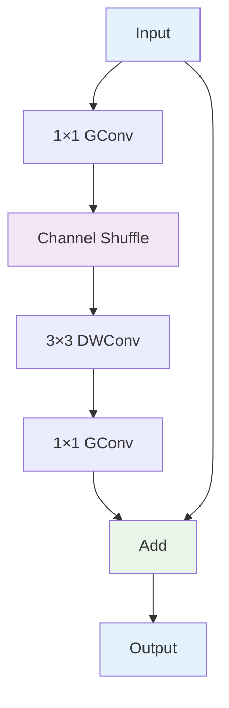
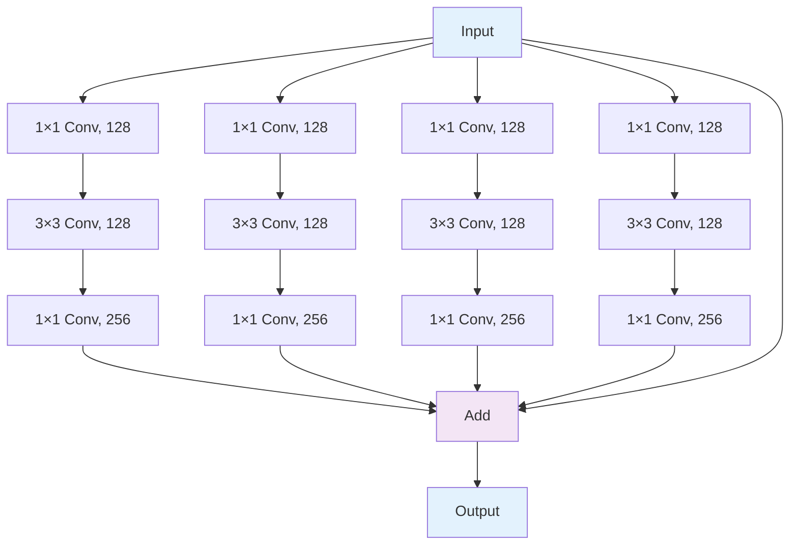
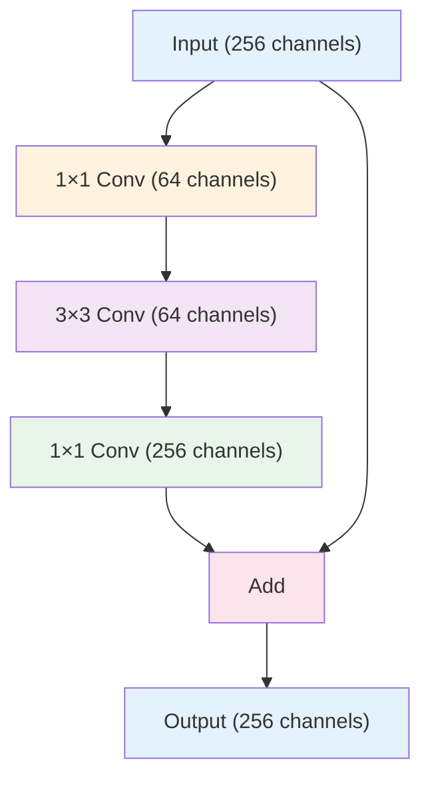
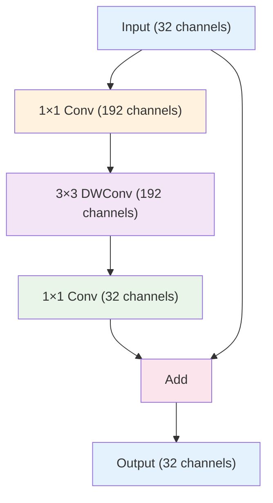

# 5. 고급 컨볼루션 기법

## 목차
1. [Depthwise Separable Convolution](#1-depthwise-separable-convolution) 
   1. 1.1. [수학적 분해 원리](#11-수학적-분해-원리) 
   1. 1.2. [계산 복잡도 분석](#12-계산-복잡도-분석) 
   1. 1.3. [성능 비교와 트레이드오프](#13-성능-비교와-트레이드오프) 

2. [Group Convolution과 채널 분할](#2-group-convolution과-채널-분할) 
   2. 2.1. [Group Convolution의 수학적 정의](#21-group-convolution의-수학적-정의) 
   2. 2.2. [ShuffleNet과 채널 섞기](#22-shufflenet과-채널-섞기) 
   2. 2.3. [ResNeXt와 Cardinality](#23-resnext와-cardinality) 

3. [정규화 기법 심화](#3-정규화-기법-심화) 
   3. 3.1. [Batch Normalization의 수학적 분석](#31-batch-normalization의-수학적-분석) 
   3. 3.2. [Group Normalization과 변형들](#32-group-normalization과-변형들) 
   3. 3.3. [Layer Normalization과 Instance Normalization](#33-layer-normalization과-instance-normalization) 

4. [Skip Connection과 잔차 학습](#4-skip-connection과-잔차-학습) 
   4. 4.1. [잔차 학습의 수학적 원리](#41-잔차-학습의-수학적-원리) 
   4. 4.2. [Dense Connection과 정보 흐름](#42-dense-connection과-정보-흐름) 
   4. 4.3. [Skip Connection의 변형들](#43-skip-connection의-변형들) 

5. [1×1 Convolution과 채널 조작](#5-1×1-convolution과-채널-조작) 
   5. 5.1. [Network in Network 개념](#51-network-in-network-개념) 
   5. 5.2. [Bottleneck 구조](#52-bottleneck-구조) 
   5. 5.3. [채널 어텐션과 SE 모듈](#53-채널-어텐션과-se-모듈) 

---

## 1. Depthwise Separable Convolution

### 1.1. 수학적 분해 원리

#### 1.1.1. 표준 컨볼루션의 분해

표준 컨볼루션을 두 단계로 분해:

**표준 컨볼루션**:
$$Y_{i,j,c} = \sum_{m=0}^{k-1} \sum_{n=0}^{k-1} \sum_{c'=0}^{C_{in}-1} X_{i+m,j+n,c'} \cdot W_{m,n,c',c}$$

**분해된 형태**:
1. **Depthwise Convolution**: 채널별로 독립적 컨볼루션
2. **Pointwise Convolution**: 1×1 컨볼루션으로 채널 결합

#### 1.1.2. Depthwise Convolution

각 입력 채널에 대해 하나의 필터만 적용:

$$\tilde{Y}_{i,j,c} = \sum_{m=0}^{k-1} \sum_{n=0}^{k-1} X_{i+m,j+n,c} \cdot W_{m,n,c}$$

여기서 $W_{m,n,c} \in \mathbb{R}^{k \times k \times C_{in}}$는 depthwise 커널이다.

**특징**:
- 공간적 필터링만 수행
- 채널 간 정보 교환 없음
- 출력 채널 수 = 입력 채널 수

#### 1.1.3. Pointwise Convolution

1×1 컨볼루션으로 채널 간 정보 결합:

$$Y_{i,j,c} = \sum_{c'=0}^{C_{in}-1} \tilde{Y}_{i,j,c'} \cdot W_{1,1,c',c}$$

**역할**:
- 채널 차원에서만 연산
- 새로운 특징 조합 생성
- 차원 변환 (확장 또는 축소)

### 1.2. 계산 복잡도 분석

#### 1.2.1. 파라미터 수 비교

**표준 컨볼루션**:
$$P_{standard} = k \times k \times C_{in} \times C_{out}$$

**Depthwise Separable**:
$$P_{dw} = k \times k \times C_{in}$$ (depthwise)
$$P_{pw} = 1 \times 1 \times C_{in} \times C_{out}$$ (pointwise)
$$P_{total} = k^2 C_{in} + C_{in} C_{out}$$

**압축 비율**:
$$\frac{P_{total}}{P_{standard}} = \frac{k^2 C_{in} + C_{in} C_{out}}{k^2 C_{in} C_{out}} = \frac{1}{C_{out}} + \frac{1}{k^2}$$

#### 1.2.2. 계산량 비교 (FLOPs)

**표준 컨볼루션**:
$$F_{standard} = H \times W \times k^2 \times C_{in} \times C_{out}$$

**Depthwise Separable**:
$$F_{dw} = H \times W \times k^2 \times C_{in}$$
$$F_{pw} = H \times W \times C_{in} \times C_{out}$$
$$F_{total} = H \times W \times C_{in} \times (k^2 + C_{out})$$

**효율성**:
$$\frac{F_{total}}{F_{standard}} = \frac{1}{C_{out}} + \frac{1}{k^2}$$

#### 1.2.3. 실제 성능 분석

**MobileNet의 예시** ($k=3$, $C_{out}=256$):
$$\frac{1}{256} + \frac{1}{9} = 0.004 + 0.111 = 0.115$$

즉, 약 8.7배 효율적이다.

### 1.3. 성능 비교와 트레이드오프

#### 1.3.1. 표현 능력 분석

**제약사항**:
- Depthwise 단계에서 채널 간 정보 교환 불가
- 표현력이 제한될 수 있음

**보완 방법**:
- 여러 레이어 적층
- Width multiplier 사용
- Inverted residual 구조 적용

#### 1.3.2. Width Multiplier

채널 수를 조절하는 하이퍼파라미터:
$$C_{actual} = \alpha \times C_{base}$$

여기서 $\alpha \in (0, 1]$는 width multiplier이다.

**효과**:
- $\alpha = 1$: 원본 모델
- $\alpha = 0.75$: 43% 파라미터 감소
- $\alpha = 0.5$: 75% 파라미터 감소

#### 1.3.3. Resolution Multiplier

입력 해상도 조절:
$$H_{actual} = W_{actual} = \rho \times H_{base}$$

**계산량 영향**:
해상도가 $\rho$ 배 감소하면 계산량은 $\rho^2$ 배 감소

## 2. Group Convolution과 채널 분할

### 2.1. Group Convolution의 수학적 정의

#### 2.1.1. 기본 개념

입력 채널을 $g$개 그룹으로 나누어 독립적으로 컨볼루션:

$$Y^{(i)} = X^{(i)} * W^{(i)}, \quad i = 1, 2, ..., g$$

여기서:
- $X^{(i)} \in \mathbb{R}^{H \times W \times C_{in}/g}$: $i$번째 입력 그룹
- $W^{(i)} \in \mathbb{R}^{k \times k \times C_{in}/g \times C_{out}/g}$: $i$번째 커널 그룹

**최종 출력**:
$$Y = \text{Concat}([Y^{(1)}, Y^{(2)}, ..., Y^{(g)}])$$

#### 2.1.2. 극단적 경우들

**$g = 1$** (Standard Convolution):
모든 채널이 하나의 그룹

**$g = C_{in}$** (Depthwise Convolution):
각 채널이 독립적인 그룹

**$g = C_{in} = C_{out}$** (Fully Depthwise):
완전한 채널 분리

#### 2.1.3. 파라미터 효율성

**파라미터 수**:
$$P_{group} = g \times \frac{k^2 C_{in} C_{out}}{g^2} = \frac{k^2 C_{in} C_{out}}{g}$$

**압축 비율**: $1/g$

### 2.2. ShuffleNet과 채널 섞기

#### 2.2.1. Channel Shuffle 연산

그룹 간 정보 교환을 위한 채널 재배열:

**수학적 정의**:
입력 텐서 $X \in \mathbb{R}^{H \times W \times C}$에 대해:

1. **Reshape**: $X' \in \mathbb{R}^{H \times W \times g \times C/g}$
2. **Transpose**: $X'' \in \mathbb{R}^{H \times W \times C/g \times g}$  
3. **Flatten**: $X''' \in \mathbb{R}^{H \times W \times C}$

**인덱스 변환**:
$$\text{shuffle}(i) = (i \bmod (C/g)) \times g + \lfloor i / (C/g) \rfloor$$

#### 2.2.2. ShuffleNet 블록 구조

#### 2.2.3. 정보 흐름 분석

**Channel Shuffle 없이**:
각 그룹은 독립적으로 동작하여 정보 교환 제한

**Channel Shuffle 있을 때**:
$$I_{total} = \log_2(g!) \approx g \log g$$

정보량이 지수적으로 증가한다.

### 2.3. ResNeXt와 Cardinality

#### 2.3.1. Cardinality 개념

네트워크의 폭(width)과 깊이(depth) 외에 cardinality(기수) 도입:

$$\text{Output} = \mathcal{F}_1(x) + \mathcal{F}_2(x) + ... + \mathcal{F}_C(x)$$

여기서 $C$는 cardinality, 각 $\mathcal{F}_i$는 동일한 topology를 가진다.

#### 2.3.2. ResNeXt 블록

**Aggregated Residual Transformation**:

#### 2.3.3. Group Convolution으로 구현

ResNeXt를 group convolution으로 효율적 구현:

$$\text{Groups} = \text{Cardinality}$$

**파라미터 동일성**:
- 32개 path × 4d 채널 = 128d group convolution
- 동일한 표현력, 더 효율적 구현

## 3. 정규화 기법 심화

### 3.1. Batch Normalization의 수학적 분석

#### 3.1.1. 순전파 과정

**미니배치 통계 계산**:
$$\mu_B = \frac{1}{m} \sum_{i=1}^{m} x_i$$
$$\sigma_B^2 = \frac{1}{m} \sum_{i=1}^{m} (x_i - \mu_B)^2$$

**정규화**:
$$\hat{x}_i = \frac{x_i - \mu_B}{\sqrt{\sigma_B^2 + \epsilon}}$$

**스케일과 시프트**:
$$y_i = \gamma \hat{x}_i + \beta$$

#### 3.1.2. 역전파 분석

**그래디언트 계산**:

$$\frac{\partial L}{\partial \beta} = \sum_{i=1}^{m} \frac{\partial L}{\partial y_i}$$

$$\frac{\partial L}{\partial \gamma} = \sum_{i=1}^{m} \frac{\partial L}{\partial y_i} \hat{x}_i$$

$$\frac{\partial L}{\partial x_i} = \frac{\gamma}{\sqrt{\sigma_B^2 + \epsilon}} \left[ \frac{\partial L}{\partial y_i} - \frac{1}{m}\sum_{j=1}^{m} \frac{\partial L}{\partial y_j} - \frac{\hat{x}_i}{m} \sum_{j=1}^{m} \frac{\partial L}{\partial y_j} \hat{x}_j \right]$$

#### 3.1.3. 내부 공변량 이동 (Internal Covariate Shift)

**문제 정의**:
훈련 중 각 층의 입력 분포가 변화하여 학습 불안정

**BN의 해결책**:
각 층의 입력을 평균 0, 분산 1로 정규화하여 분포 안정화

#### 3.1.4. 추론 시 처리

**이동 평균 사용**:
$$\mu_{running} = (1-\alpha) \mu_{running} + \alpha \mu_B$$
$$\sigma_{running}^2 = (1-\alpha) \sigma_{running}^2 + \alpha \sigma_B^2$$

일반적으로 $\alpha = 0.1$을 사용한다.

### 3.2. Group Normalization과 변형들

#### 3.2.1. Group Normalization

채널을 그룹으로 나누어 그룹 내에서 정규화:

$$\mu_{G} = \frac{1}{HW \cdot C/G} \sum_{i \in \mathcal{S}_G} x_i$$
$$\sigma_{G}^2 = \frac{1}{HW \cdot C/G} \sum_{i \in \mathcal{S}_G} (x_i - \mu_G)^2$$

여기서 $\mathcal{S}_G$는 그룹 $G$에 속하는 픽셀들의 집합이다.

#### 3.2.2. 정규화 방법 비교

| 방법 | 정규화 차원 | 배치 의존성 | 장점 | 단점 |
|------|-------------|-------------|------|------|
| **Batch Norm** | $(N, H, W)$ | 있음 | 빠른 수렴 | 작은 배치에서 불안정 |
| **Layer Norm** | $(C, H, W)$ | 없음 | 배치 독립적 | CNN에서 성능 저하 |
| **Instance Norm** | $(H, W)$ | 없음 | 스타일 제거 | 정보 손실 |
| **Group Norm** | $(C/G, H, W)$ | 없음 | 균형잡힌 성능 | 그룹 수 튜닝 필요 |

#### 3.2.3. 그룹 수 선택 기준

**경험적 규칙**:
- $G = 32$ (ResNet-50에서 최적)
- $G = C$ (Instance Normalization과 동일)
- $G = 1$ (Layer Normalization과 동일)

### 3.3. Layer Normalization과 Instance Normalization

#### 3.3.1. Layer Normalization

각 샘플의 모든 채널에 대해 정규화:

$$\mu_L = \frac{1}{CHW} \sum_{i,j,c} x_{i,j,c}$$
$$\sigma_L^2 = \frac{1}{CHW} \sum_{i,j,c} (x_{i,j,c} - \mu_L)^2$$

**적용 분야**:
- RNN, Transformer 등
- NLP 태스크에서 효과적

#### 3.3.2. Instance Normalization

각 채널별로 독립적 정규화:

$$\mu_{I,c} = \frac{1}{HW} \sum_{i,j} x_{i,j,c}$$
$$\sigma_{I,c}^2 = \frac{1}{HW} \sum_{i,j} (x_{i,j,c} - \mu_{I,c})^2$$

**특징**:
- 스타일 정보 제거
- Content 정보만 보존
- Style transfer에서 활용

#### 3.3.3. Adaptive Instance Normalization

스타일 정보를 명시적으로 제어:

$$\text{AdaIN}(x, y) = \sigma(y) \frac{x - \mu(x)}{\sigma(x)} + \mu(y)$$

여기서 $x$는 content, $y$는 style 특징이다.

## 4. Skip Connection과 잔차 학습

### 4.1. 잔차 학습의 수학적 원리

#### 4.1.1. 잔차 함수 정의

**원본 매핑**: $\mathcal{H}(x)$
**잔차 매핑**: $\mathcal{F}(x) = \mathcal{H}(x) - x$
**최종 출력**: $\mathcal{H}(x) = \mathcal{F}(x) + x$

**가정**: 잔차 매핑 $\mathcal{F}(x)$를 학습하는 것이 원본 매핑 $\mathcal{H}(x)$를 직접 학습하는 것보다 쉽다.

#### 4.1.2. 그래디언트 흐름 분석

**순전파**:
$$x_{l+1} = x_l + \mathcal{F}(x_l, W_l)$$

**역전파**:
$$\frac{\partial L}{\partial x_l} = \frac{\partial L}{\partial x_{l+1}} \frac{\partial x_{l+1}}{\partial x_l} = \frac{\partial L}{\partial x_{l+1}} \left(1 + \frac{\partial \mathcal{F}}{\partial x_l}\right)$$

**깊은 네트워크에서**:
$$\frac{\partial L}{\partial x_l} = \frac{\partial L}{\partial x_L} \prod_{i=l}^{L-1} \left(1 + \frac{\partial \mathcal{F}}{\partial x_i}\right)$$

항등 매핑 성분 $(1)$이 그래디언트 소실을 방지한다.

#### 4.1.3. 최적화 관점

**손실 함수의 변화**:
잔차 연결이 있을 때 손실 함수의 Hessian이 더 좋은 조건수를 가진다:

$$\text{condition\_number} = \frac{\lambda_{max}}{\lambda_{min}}$$

Skip connection이 $\lambda_{min}$을 증가시켜 조건수를 개선한다.

### 4.2. Dense Connection과 정보 흐름

#### 4.2.1. DenseNet의 연결 패턴

각 층이 모든 이전 층과 연결:

$$x_l = H_l([x_0, x_1, ..., x_{l-1}])$$

여기서 $[x_0, x_1, ..., x_{l-1}]$는 채널 방향 concatenation이다.

#### 4.2.2. Growth Rate

각 층이 추가하는 채널 수:
$$k = \text{growth\_rate}$$

$l$번째 층의 입력 채널 수:
$$C_l = C_0 + k \times (l-1)$$

#### 4.2.3. Feature Reuse 분석

**정보 흐름**:
각 층의 특징이 모든 후속 층에서 직접 사용 가능

**파라미터 효율성**:
작은 growth rate로도 높은 성능 달성 가능

**메모리 사용량**:
$$Memory = \sum_{l=1}^{L} (C_0 + k \times (l-1)) \times H_l \times W_l$$

### 4.3. Skip Connection의 변형들

#### 4.3.1. Highway Networks

게이트 메커니즘 도입:

$$y = H(x, W_H) \cdot T(x, W_T) + x \cdot C(x, W_C)$$

여기서:
- $T(x) = \sigma(W_T x + b_T)$: Transform gate
- $C(x) = 1 - T(x)$: Carry gate

#### 4.3.2. Squeeze-and-Excitation (SE)

채널별 가중치를 동적으로 조절:

**Squeeze**: 글로벌 평균 풀링
$$z_c = \frac{1}{H \times W} \sum_{i=1}^{H} \sum_{j=1}^{W} x_{i,j,c}$$

**Excitation**: 채널별 중요도 계산
$$s = \sigma(W_2 \cdot \text{ReLU}(W_1 \cdot z))$$

**Scale**: 원본 특징에 가중치 적용
$$\tilde{x}_c = s_c \cdot x_c$$

#### 4.3.3. Residual Attention

공간적 어텐션과 잔차 연결 결합:

$$y = (1 + M(x)) \odot F(x) + x$$

여기서 $M(x)$는 어텐션 마스크, $\odot$는 element-wise 곱셈이다.

## 5. 1×1 Convolution과 채널 조작

### 5.1. Network in Network 개념

#### 5.1.1. MLP Conv 레이어

1×1 컨볼루션을 MLP(Multi-Layer Perceptron)로 해석:

$$y_{i,j} = \text{MLP}(x_{i,j})$$

각 위치에서 독립적으로 다층 퍼셉트론 적용

#### 5.1.2. 차원 변환 역할

**차원 증가**:
$$\mathbb{R}^{H \times W \times C_{in}} \rightarrow \mathbb{R}^{H \times W \times C_{out}}, \quad C_{out} > C_{in}$$

**차원 감소**:
$$\mathbb{R}^{H \times W \times C_{in}} \rightarrow \mathbb{R}^{H \times W \times C_{out}}, \quad C_{out} < C_{in}$$

#### 5.1.3. 비선형성 추가

공간적 위치는 유지하면서 채널 차원에서만 비선형 변환:

### 5.2. Bottleneck 구조

#### 5.2.1. ResNet Bottleneck

3×3 컨볼루션 전후로 1×1 컨볼루션 배치:

**파라미터 비교**:
- **직접 3×3**: $256 \times 3 \times 3 \times 256 = 589,824$
- **Bottleneck**: $256 \times 64 + 64 \times 9 \times 64 + 64 \times 256 = 69,632$

약 8.5배 파라미터 감소

#### 5.2.2. Inverted Residual (MobileNetV2)

Bottleneck의 역순 구조:

**특징**:
- 저차원에서 고차원으로 확장 후 다시 압축
- ReLU를 마지막 1×1 conv 후에는 사용하지 않음 (Linear Bottleneck)

#### 5.2.3. Expansion Ratio

확장 비율 $t$:
$C_{expanded} = t \times C_{input}$

일반적으로 $t = 6$을 사용하여 6배 확장 후 압축

### 5.3. 채널 어텐션과 SE 모듈

#### 5.3.1. 채널별 중요도 모델링

각 채널의 중요도를 동적으로 계산:

$\text{Importance}(c) = f(\text{Global\_Context}(F_c))$

여기서 $F_c$는 $c$번째 채널의 특징맵이다.

#### 5.3.2. SE 모듈 상세 분석

**Global Average Pooling**:
$z_c = \frac{1}{H \times W} \sum_{i=1}^{H} \sum_{j=1}^{W} u_c(i,j)$

**Excitation with Bottleneck**:
$s = \sigma(W_2 \cdot \delta(W_1 \cdot z))$

여기서:
- $W_1 \in \mathbb{R}^{C/r \times C}$: 차원 감소 (reduction ratio $r$)
- $W_2 \in \mathbb{R}^{C \times C/r}$: 차원 복원
- $\delta$: ReLU 활성화 함수
- $\sigma$: Sigmoid 활성화 함수

**최종 출력**:
$\tilde{u}_c = s_c \cdot u_c$

#### 5.3.3. 다른 어텐션 메커니즘들

**CBAM (Convolutional Block Attention Module)**:

1. **Channel Attention**: SE와 유사하지만 max pooling도 활용
   $M_C = \sigma(MLP(AvgPool(F)) + MLP(MaxPool(F)))$

2. **Spatial Attention**: 공간적 중요도 계산
   $M_S = \sigma(Conv([AvgPool(F); MaxPool(F)]))$

**ECA (Efficient Channel Attention)**:
1D 컨볼루션으로 효율적 구현:
$\omega = \sigma(C1D_k(z))$

여기서 $k$는 적응적으로 결정되는 커널 크기이다.

#### 5.3.4. 어텐션의 수학적 해석

**Information Bottleneck 관점**:
SE 모듈은 정보 압축을 통해 중요한 채널 정보만 보존

**Gating Mechanism**:
각 채널에 대한 soft gate 역할:
$g_c = \sigma(f_c(context))$

**Gradient Flow**:
어텐션 가중치가 역전파 시 그래디언트 흐름을 조절:
$\frac{\partial L}{\partial u_c} = \frac{\partial L}{\partial \tilde{u}_c} \cdot s_c$

---

## 고급 아키텍처 설계 원칙

### 연산 효율성과 표현력 트레이드오프

현대 CNN 설계는 다음 균형을 추구한다:

1. **계산 효율성**: FLOPs, 파라미터 수, 메모리 사용량
2. **표현력**: 다양한 패턴 인식 능력
3. **일반화**: 다양한 태스크에 적용 가능성

### 모바일 최적화 전략

**Hardware-Aware Design**:
- 메모리 접근 패턴 최적화
- 병렬화 가능한 연산 설계
- 양자화 친화적 구조

**Neural Architecture Search (NAS)**:
자동화된 아키텍처 탐색으로 최적 구조 발견

### 확장성 고려사항

**Scalable Architecture**:
- Width, Depth, Resolution의 균형있는 확장
- Compound Scaling (EfficientNet)

**Transfer Learning 친화성**:
- 사전훈련된 특징의 재사용성
- Fine-tuning 안정성

---

## 용어 목록

- **Adaptive Instance Normalization (AdaIN)**: 어댑티브 인스턴스 노멀라이제이션 - 적응적 인스턴스 정규화
- **Bottleneck**: 보틀넥 - 병목 구조, 차원을 줄였다 늘리는 구조
- **Cardinality**: 카디날리티 - 기수, 병렬 경로의 수
- **Channel Shuffle**: 채널 셔플 - 채널 재배열 연산
- **Compound Scaling**: 컴파운드 스케일링 - 복합 스케일링
- **Condition Number**: 컨디션 넘버 - 조건수, 행렬의 수치적 안정성
- **Convolutional Block Attention Module (CBAM)**: 컨볼루셔널 블록 어텐션 모듈
- **Dense Connection**: 덴스 커넥션 - 밀집 연결
- **Depthwise Convolution**: 뎁스와이즈 컨볼루션 - 채널별 독립 컨볼루션
- **Efficient Channel Attention (ECA)**: 이피션트 채널 어텐션 - 효율적 채널 어텐션
- **Expansion Ratio**: 익스팬션 레이쇼 - 확장 비율
- **Gating Mechanism**: 게이팅 메커니즘 - 게이트 메커니즘
- **Global Average Pooling**: 글로벌 애버리지 풀링 - 전역 평균 풀링
- **Group Convolution**: 그룹 컨볼루션 - 그룹 단위 컨볼루션
- **Group Normalization**: 그룹 노멀라이제이션 - 그룹 정규화
- **Growth Rate**: 그로스 레이트 - 성장률, 각 층에서 추가되는 채널 수
- **Highway Networks**: 하이웨이 네트워크스 - 고속도로 네트워크
- **Information Bottleneck**: 인포메이션 보틀넥 - 정보 병목
- **Instance Normalization**: 인스턴스 노멀라이제이션 - 인스턴스 정규화
- **Internal Covariate Shift**: 인터널 코베리어트 시프트 - 내부 공변량 이동
- **Inverted Residual**: 인버티드 레지듀얼 - 역잔차 구조
- **Layer Normalization**: 레이어 노멀라이제이션 - 층 정규화
- **Linear Bottleneck**: 리니어 보틀넥 - 선형 병목
- **Multi-Layer Perceptron (MLP)**: 멀티 레이어 퍼셉트론 - 다층 퍼셉트론
- **Neural Architecture Search (NAS)**: 뉴럴 아키텍처 서치 - 신경망 구조 탐색
- **Network in Network**: 네트워크 인 네트워크 - 네트워크 안의 네트워크
- **Pointwise Convolution**: 포인트와이즈 컨볼루션 - 점별 컨볼루션, 1×1 컨볼루션
- **Reduction Ratio**: 리덕션 레이쇼 - 축소 비율
- **Residual Attention**: 레지듀얼 어텐션 - 잔차 어텐션
- **Squeeze-and-Excitation (SE)**: 스퀴즈 앤 익사이테이션 - 압축과 여기
- **Width Multiplier**: 위드스 멀티플라이어 - 폭 승수