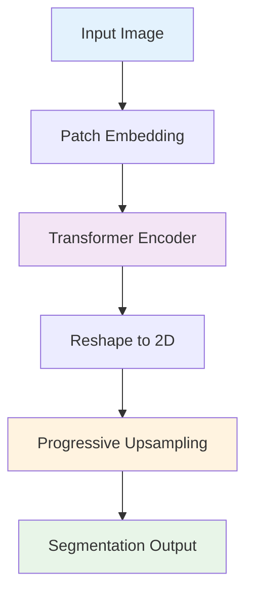
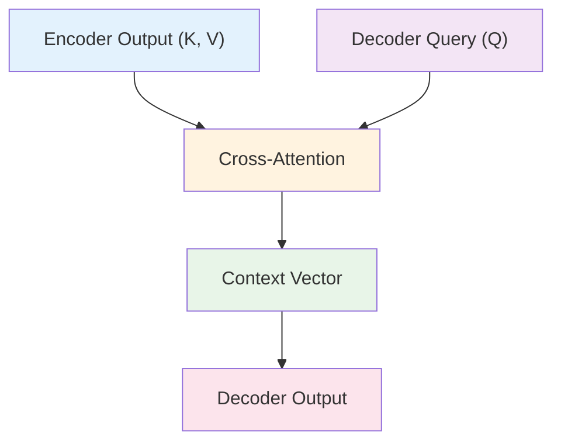

# 6. 어텐션 메커니즘 이론

## 목차
1. [어텐션의 수학적 기초](#1-어텐션의-수학적-기초) 
   1. 1.1. [어텐션 함수의 정의](#11-어텐션-함수의-정의) 
   1. 1.2. [Query, Key, Value 개념](#12-query-key-value-개념) 
   1. 1.3. [다양한 어텐션 함수들](#13-다양한-어텐션-함수들) 

2. [Self-Attention과 Cross-Attention](#2-self-attention과-cross-attention) 
   2. 2.1. [Self-Attention 메커니즘](#21-self-attention-메커니즘) 
   2. 2.2. [Cross-Attention의 응용](#22-cross-attention의-응용) 
   2. 2.3. [위치 인코딩과 순서 정보](#23-위치-인코딩과-순서-정보) 

3. [Multi-Head Attention](#3-multi-head-attention) 
   3. 3.1. [다중 헤드의 수학적 정의](#31-다중-헤드의-수학적-정의) 
   3. 3.2. [헤드별 특화와 다양성](#32-헤드별-특화와-다양성) 
   3. 3.3. [계산 효율성 분석](#33-계산-효율성-분석) 

4. [Transformer 기반 세그멘테이션](#4-transformer-기반-세그멘테이션) 
   4. 4.1. [Vision Transformer 기초](#41-vision-transformer-기초) 
   4. 4.2. [DETR과 객체 검출](#42-detr과-객체-검출) 
   4. 4.3. [Segmentation Transformer들](#43-segmentation-transformer들) 

5. [공간적 어텐션 메커니즘](#5-공간적-어텐션-메커니즘) 
   5. 5.1. [Spatial Attention의 설계](#51-spatial-attention의-설계) 
   5. 5.2. [Non-Local Networks](#52-non-local-networks) 
   5. 5.3. [Coordinate Attention](#53-coordinate-attention) 

---

## 1. 어텐션의 수학적 기초

### 1.1. 어텐션 함수의 정의

#### 1.1.1. 기본 개념

어텐션(Attention)은 입력의 특정 부분에 선택적으로 집중하는 메커니즘이다. 수학적으로 가중평균으로 표현된다:

#### 4.1.1. 이미지 패치 분할

이미지를 겹치지 않는 패치로 분할:

$\text{Image} \in \mathbb{R}^{H \times W \times C} \rightarrow \text{Patches} \in \mathbb{R}^{N \times (P^2 \cdot C)}$

여기서:
- $N = HW/P^2$: 패치 개수
- $P$: 패치 크기 (일반적으로 16×16)

#### 4.1.2. 패치 임베딩과 위치 인코딩

**선형 투영**:
$z_0 = [x_{class}; x_p^1 E; x_p^2 E; ...; x_p^N E] + E_{pos}$

여기서:
- $E \in \mathbb{R}^{(P^2 \cdot C) \times D}$: 패치 임베딩 행렬
- $E_{pos} \in \mathbb{R}^{(N+1) \times D}$: 위치 임베딩
- $x_{class}$: 분류를 위한 특수 토큰

#### 4.1.3. ViT의 Self-Attention

각 Transformer 블록에서:

$z'_l = \text{MSA}(\text{LN}(z_{l-1})) + z_{l-1}$
$z_l = \text{MLP}(\text{LN}(z'_l)) + z'_l$

**Global Receptive Field**:
첫 번째 층부터 모든 패치 간 직접 연결

### 4.2. DETR과 객체 검출

#### 4.2.1. 세트 예측 문제로의 변환

객체 검출을 고정 크기 세트 예측으로 정의:

$\hat{y} = \{(\hat{c}_i, \hat{b}_i)\}_{i=1}^N$

여기서 $N$은 쿼리 개수 (실제 객체 수보다 훨씬 큼)

#### 4.2.2. Object Queries

학습 가능한 객체 쿼리들:
$\text{queries} \in \mathbb{R}^{N \times d}$

각 쿼리는 하나의 객체를 담당한다.

#### 4.2.3. 이분 매칭 (Bipartite Matching)

헝가리안 알고리즘으로 예측과 Ground Truth 매칭:

$\hat{\sigma} = \arg\min_{\sigma \in \mathfrak{S}_N} \sum_{i=1}^N \mathcal{L}_{match}(y_i, \hat{y}_{\sigma(i)})$

**매칭 비용**:
$\mathcal{L}_{match}(y_i, \hat{y}_{\sigma(i)}) = -\mathbb{1}_{\{c_i \neq \varnothing\}} \hat{p}_{\sigma(i)}(c_i) + \mathbb{1}_{\{c_i \neq \varnothing\}} \mathcal{L}_{box}(b_i, \hat{b}_{\sigma(i)})$

### 4.3. Segmentation Transformer들

#### 4.3.1. SETR (SEgmentation TRansformer)

ViT 백본에 간단한 디코더 연결:

**한계**: 
- 지역적 세부사항 손실
- 단순한 디코더 구조

#### 4.3.2. Segmenter

마스크 토큰을 사용한 세그멘테이션:

$\text{masks} = \text{Linear}(\text{Transformer}([\text{img\_tokens}, \text{mask\_tokens}]))$

**마스크 토큰**:
각 클래스마다 하나씩, 총 $K$개 (클래스 수)

#### 4.3.3. MaskFormer

분류와 마스크 예측을 분리:

**Per-pixel classification** → **Mask classification**

$p_{cls}(x) = \sum_{i=1}^N M_i(x) \cdot p_i$

여기서:
- $M_i(x)$: $i$번째 마스크의 $x$ 위치 값
- $p_i$: $i$번째 마스크의 클래스 확률

## 5. 공간적 어텐션 메커니즘

### 5.1. Spatial Attention의 설계

#### 5.1.1. 채널 정보 집계

공간적 위치별 중요도 계산을 위한 채널 정보 요약:

**Average Pooling**:
$F_{avg}(i,j) = \frac{1}{C} \sum_{c=1}^{C} F_c(i,j)$

**Max Pooling**:
$F_{max}(i,j) = \max_{c=1}^{C} F_c(i,j)$

**결합**:
$F_{spatial} = \text{Conv}([F_{avg}; F_{max}])$

#### 5.1.2. 공간 어텐션 맵 생성

$M_s = \sigma(\text{Conv}^{7 \times 7}([F_{avg}; F_{max}]))$

여기서 $7 \times 7$는 큰 수용 영역을 위한 큰 커널이다.

#### 5.1.3. Feature Refinement

$F' = M_s \otimes F$

어텐션 맵으로 원본 특징을 조정한다.

### 5.2. Non-Local Networks

#### 5.2.1. Non-Local Operation

모든 위치 쌍의 관계를 모델링:

$y_i = \frac{1}{\mathcal{C}(x)} \sum_{\forall j} f(x_i, x_j) g(x_j)$

여기서:
- $f(x_i, x_j)$: 위치 $i$와 $j$ 간의 친화도(affinity)
- $g(x_j)$: 위치 $j$의 표현
- $\mathcal{C}(x)$: 정규화 인수

#### 5.2.2. 친화도 함수들

**Gaussian**:
$f(x_i, x_j) = e^{x_i^T x_j}$

**Embedded Gaussian**:
$f(x_i, x_j) = e^{\theta(x_i)^T \phi(x_j)}$

**Dot Product**:
$f(x_i, x_j) = \theta(x_i)^T \phi(x_j)$

**Concatenation**:
$f(x_i, x_j) = \text{ReLU}(w_f^T [\theta(x_i), \phi(x_j)])$

#### 5.2.3. 차원 축소를 통한 효율성

계산량 감소를 위해 임베딩 차원을 줄임:

$\theta(x) = W_\theta x, \quad W_\theta \in \mathbb{R}^{C' \times C}$
$\phi(x) = W_\phi x, \quad W_\phi \in \mathbb{R}^{C' \times C}$

일반적으로 $C' = C/2$ 또는 $C' = C/8$을 사용한다.

### 5.3. Coordinate Attention

#### 5.3.1. 1차원 Global Pooling

높이와 너비 방향으로 별도로 풀링:

**Height-wise pooling**:
$z_c^h(h) = \frac{1}{W} \sum_{w=1}^{W} x_c(h, w)$

**Width-wise pooling**:
$z_c^w(w) = \frac{1}{H} \sum_{h=1}^{H} x_c(h, w)$

#### 5.3.2. 위치 정보 보존

Global Average Pooling과 달리 한 방향의 위치 정보를 보존:

- $z^h \in \mathbb{R}^{C \times H \times 1}$: 높이 방향 위치 정보 유지
- $z^w \in \mathbb{R}^{C \times 1 \times W}$: 너비 방향 위치 정보 유지

#### 5.3.3. 어텐션 가중치 생성

**연결 및 변환**:
$f = \delta(\text{Conv}([z^h, z^w]))$

**분리 및 시그모이드**:
$g^h = \sigma(\text{Conv}^h(f)), \quad g^w = \sigma(\text{Conv}^w(f))$

**최종 출력**:
$y_c(i,j) = x_c(i,j) \times g_c^h(i) \times g_c^w(j)$

---

## 어텐션 메커니즘의 발전 방향

### 효율적 어텐션

#### Linear Attention

어텐션의 2차 복잡도를 선형으로 줄이는 방법들:

**Performer**:
$\text{Attention}(Q,K,V) \approx \frac{\phi(Q)(\phi(K)^T V)}{\phi(Q)(\phi(K)^T \mathbf{1})}$

여기서 $\phi(\cdot)$는 양의 직교 랜덤 특징(positive orthogonal random features)이다.

#### Sparse Attention

모든 위치를 보지 않고 선택적으로만 어텐션 계산:

**Local Attention**: 지역 윈도우 내에서만
**Strided Attention**: 일정 간격으로 선택
**Random Attention**: 무작위로 선택

### 적응적 어텐션

입력에 따라 어텐션 패턴을 동적으로 조절:

**Adaptive Span Attention**: 각 헤드가 서로 다른 범위를 봄
**Dynamic Convolution**: 입력에 따라 커널 가중치 변경

### 멀티스케일 어텐션

다양한 해상도에서 어텐션 계산:

**Pyramid Vision Transformer**: 다중 스케일 패치
**Swin Transformer**: 계층적 윈도우 어텐션

---

## 용어 목록

- **Adaptive Span Attention**: 어댑티브 스팬 어텐션 - 적응적 범위 어텐션
- **Affinity**: 어피니티 - 친화도, 유사도
- **Bipartite Matching**: 바이파타이트 매칭 - 이분 매칭
- **Content-based Attention**: 컨텐트 베이스드 어텐션 - 내용 기반 어텐션
- **Context-based Attention**: 컨텍스트 베이스드 어텐션 - 맥락 기반 어텐션
- **Coordinate Attention**: 코디네이트 어텐션 - 좌표 어텐션
- **Cross-Attention**: 크로스 어텐션 - 교차 어텐션
- **Dynamic Convolution**: 다이내믹 컨볼루션 - 동적 컨볼루션
- **Embedded Gaussian**: 임베디드 가우시안 - 임베딩된 가우시안
- **Feature Refinement**: 피처 리파인먼트 - 특징 정제
- **Global Receptive Field**: 글로벌 리셉티브 필드 - 전역 수용 영역
- **Grouped Query Attention**: 그룹드 쿼리 어텐션 - 그룹화된 질의 어텐션
- **Head Pruning**: 헤드 프루닝 - 헤드 가지치기
- **Hungarian Algorithm**: 헝가리안 알고리즘 - 헝가리 알고리즘
- **Linear Attention**: 리니어 어텐션 - 선형 어텐션
- **Location-based Attention**: 로케이션 베이스드 어텐션 - 위치 기반 어텐션
- **Mask Classification**: 마스크 클래시피케이션 - 마스크 분류
- **Multi-Head Attention**: 멀티 헤드 어텐션 - 다중 헤드 어텐션
- **Non-Local Networks**: 논로컬 네트워크스 - 비지역 네트워크
- **Object Queries**: 오브젝트 쿼리스 - 객체 질의들
- **Patch Embedding**: 패치 임베딩 - 패치 매장
- **Performer**: 퍼포머 - 성능자 (효율적 어텐션 방법)
- **Permutation Invariant**: 퍼뮤테이션 인베리언트 - 순서 불변
- **Positive Orthogonal Random Features**: 포지티브 오소고날 랜덤 피처스 - 양의 직교 랜덤 특징
- **Query, Key, Value**: 쿼리, 키, 밸류 - 질의, 키, 값
- **Scaled Dot-Product Attention**: 스케일드 닷 프로덕트 어텐션 - 스케일된 내적 어텐션
- **Self-Attention**: 셀프 어텐션 - 자기 어텐션
- **Similarity Function**: 시밀래리티 펑션 - 유사도 함수
- **Sinusoidal Position Encoding**: 사인소이달 포지션 인코딩 - 정현파 위치 인코딩
- **Softmax Saturation**: 소프트맥스 새추레이션 - 소프트맥스 포화
- **Sparse Attention**: 스파스 어텐션 - 희소 어텐션
- **Spatial Attention**: 스페이셜 어텐션 - 공간 어텐션
- **Swin Transformer**: 스윈 트랜스포머 - 이동 윈도우 트랜스포머
- **Vision Transformer (ViT)**: 비전 트랜스포머 - 시각 트랜스포머{Attention}(Q, K, V) = \sum_{i=1}^{n} \alpha_i V_i$$

여기서:
- $Q \in \mathbb{R}^{m \times d_k}$: Query (질의)
- $K \in \mathbb{R}^{n \times d_k}$: Key (키)  
- $V \in \mathbb{R}^{n \times d_v}$: Value (값)
- $\alpha_i$: 어텐션 가중치 (정규화됨)

#### 1.1.2. 어텐션 가중치 계산

어텐션 가중치는 Query와 Key 간의 유사도로부터 계산된다:

$$e_{i,j} = f(Q_i, K_j)$$
$$\alpha_{i,j} = \frac{\exp(e_{i,j})}{\sum_{k=1}^{n} \exp(e_{i,k})}$$

여기서 $f(\cdot, \cdot)$는 유사도 함수(similarity function)이다.

#### 1.1.3. 정보 이론적 해석

어텐션은 정보 선택과 집계 과정으로 볼 수 있다:

**엔트로피 관점**:
$$H(\alpha) = -\sum_{i=1}^{n} \alpha_i \log \alpha_i$$

- 높은 엔트로피: 균등한 어텐션 (모든 위치에 동등하게 집중)
- 낮은 엔트로피: 집중된 어텐션 (특정 위치에 강하게 집중)

### 1.2. Query, Key, Value 개념

#### 1.2.1. 정보 검색 시스템 비유

어텐션은 정보 검색 시스템과 유사하다:

- **Query**: 찾고자 하는 정보의 질의
- **Key**: 저장된 정보의 인덱스/주소
- **Value**: 실제 저장된 정보 내용

**검색 과정**:
1. Query와 각 Key의 유사도 계산
2. 유사도를 기반으로 가중치 할당  
3. 가중치로 Value들의 가중합 계산

#### 1.2.2. 선형 변환을 통한 생성

입력 특징 $X \in \mathbb{R}^{n \times d}$로부터 Q, K, V 생성:

$$Q = XW_Q, \quad W_Q \in \mathbb{R}^{d \times d_k}$$
$$K = XW_K, \quad W_K \in \mathbb{R}^{d \times d_k}$$  
$$V = XW_V, \quad W_V \in \mathbb{R}^{d \times d_v}$$

이때 $W_Q, W_K, W_V$는 학습 가능한 파라미터 행렬이다.

#### 1.2.3. 차원별 역할

**$d_k$ (Key/Query 차원)**:
- 유사도 계산의 정확성 결정
- 너무 크면 softmax가 포화될 수 있음
- 일반적으로 $d_k = d_{model}/h$ (h: 헤드 수)

**$d_v$ (Value 차원)**:
- 출력 특징의 표현력 결정
- $d_v = d_k$로 설정하는 것이 일반적

### 1.3. 다양한 어텐션 함수들

#### 1.3.1. Scaled Dot-Product Attention

가장 널리 사용되는 어텐션 함수:

$$\text{Attention}(Q,K,V) = \text{softmax}\left(\frac{QK^T}{\sqrt{d_k}}\right)V$$

**스케일링 인수** $\sqrt{d_k}$의 역할:
- 내적값이 커져서 softmax가 포화되는 것을 방지
- 그래디언트 소실 문제 완화

**계산 복잡도**: $O(n^2 d_k + n^2 d_v)$

#### 1.3.2. Additive Attention (Bahdanau)

MLP를 사용한 어텐션:

$$e_{i,j} = v^T \tanh(W_q Q_i + W_k K_j)$$

여기서 $v, W_q, W_k$는 학습 가능한 파라미터이다.

**특징**:
- Query와 Key의 차원이 달라도 적용 가능
- 계산량이 더 많음: $O(n^2 d_h)$ (여기서 $d_h$는 hidden 차원)

#### 1.3.3. Location-based Attention

위치 정보만을 사용하는 어텐션:

$$\alpha_i = \text{softmax}(W_a s_{i-1})$$

여기서 $s_{i-1}$은 이전 상태이다.

**응용**:
- 음성 인식에서 순차적 정렬
- 단조 증가하는 어텐션 패턴

#### 1.3.4. Content-based vs Context-based

**Content-based**:
$$e_{i,j} = \text{similarity}(\text{content}(Q_i), \text{content}(K_j))$$

**Context-based**:  
$$e_{i,j} = \text{similarity}(\text{context}(Q_i, history), K_j)$$

## 2. Self-Attention과 Cross-Attention

### 2.1. Self-Attention 메커니즘

#### 2.1.1. 정의와 특성

Self-Attention에서는 입력 시퀀스 자기 자신이 Q, K, V의 소스가 된다:

$$Q = K = V = X$$

따라서:
$$\text{SelfAttn}(X) = \text{softmax}\left(\frac{XW_Q(XW_K)^T}{\sqrt{d_k}}\right)XW_V$$

#### 2.1.2. 전역적 관계 모델링

Self-Attention의 핵심 장점은 **모든 위치 간의 직접적 연결**이다:

**CNN의 제약**:
- 지역적 receptive field
- 먼 거리 의존성을 위해 많은 층 필요

**Self-Attention의 장점**:
- 한 번의 연산으로 모든 위치 간 관계 계산
- $O(1)$의 경로 길이

#### 2.1.3. 위치별 표현 업데이트

각 위치 $i$의 출력은 모든 위치의 정보를 종합한다:

$$y_i = \sum_{j=1}^{n} \text{softmax}\left(\frac{q_i^T k_j}{\sqrt{d_k}}\right) v_j$$

이는 **동적 가중평균**으로, 입력에 따라 가중치가 변한다.

### 2.2. Cross-Attention의 응용

#### 2.2.1. 정의와 구조

Cross-Attention에서는 Query와 Key-Value가 서로 다른 소스에서 온다:

$$Q = X_{source1}W_Q$$
$$K = V = X_{source2}W_K, W_V$$

**예시**:
- 기계번역: Q(타겟), K,V(소스)
- 이미지 캡셔닝: Q(텍스트), K,V(이미지)

#### 2.2.2. Encoder-Decoder Attention

Transformer의 디코더에서 인코더 정보를 활용:

#### 2.2.3. 멀티모달 융합

서로 다른 모달리티 간의 정보 교환:

**시각-언어 모델**:
$$\text{VisionQuery} \leftarrow \text{LanguageKey, LanguageValue}$$
$$\text{LanguageQuery} \leftarrow \text{VisionKey, VisionValue}$$

### 2.3. 위치 인코딩과 순서 정보

#### 2.3.1. 위치 인코딩의 필요성

Self-Attention은 본질적으로 **순서 불변(permutation invariant)**이다:

$$\text{SelfAttn}(\text{permute}(X)) = \text{permute}(\text{SelfAttn}(X))$$

따라서 순서 정보를 명시적으로 주입해야 한다.

#### 2.3.2. Sinusoidal 위치 인코딩

Transformer에서 사용하는 방법:

$$PE_{(pos, 2i)} = \sin\left(\frac{pos}{10000^{2i/d_{model}}}\right)$$
$$PE_{(pos, 2i+1)} = \cos\left(\frac{pos}{10000^{2i/d_{model}}}\right)$$

**특성**:
- 상대적 위치 관계 학습 가능
- 임의 길이 시퀀스에 적용 가능
- $PE_{pos+k}$는 $PE_{pos}$의 선형결합으로 표현 가능

#### 2.3.3. 학습 가능한 위치 임베딩

각 위치에 대해 독립적으로 학습:

$$X_{input} = X_{token} + X_{position}$$

**장점**: 더 유연한 위치 표현
**단점**: 고정된 최대 길이 제한

#### 2.3.4. 상대적 위치 인코딩

절대 위치 대신 상대적 거리 사용:

$$e_{ij} = \frac{(x_i W_Q)(x_j W_K)^T + (x_i W_Q)R_{i-j}^T}{\sqrt{d_k}}$$

여기서 $R_{i-j}$는 상대적 위치 $i-j$에 대한 학습된 임베딩이다.

## 3. Multi-Head Attention

### 3.1. 다중 헤드의 수학적 정의

#### 3.1.1. 헤드별 어텐션 계산

$h$개의 어텐션 헤드를 병렬로 계산:

$$\text{head}_i = \text{Attention}(QW_i^Q, KW_i^K, VW_i^V)$$

여기서 각 헤드의 투영 행렬:
- $W_i^Q \in \mathbb{R}^{d_{model} \times d_k}$
- $W_i^K \in \mathbb{R}^{d_{model} \times d_k}$  
- $W_i^V \in \mathbb{R}^{d_{model} \times d_v}$

#### 3.1.2. 헤드 결합과 출력 투영

모든 헤드의 출력을 연결한 후 선형 변환:

$$\text{MultiHead}(Q,K,V) = \text{Concat}(\text{head}_1, ..., \text{head}_h)W^O$$

여기서 $W^O \in \mathbb{R}^{hd_v \times d_{model}}$이다.

#### 3.1.3. 차원 설정

일반적인 설정:
- $d_k = d_v = d_{model}/h$
- 총 파라미터 수: $4d_{model}^2$ (Q, K, V, O 투영)

### 3.2. 헤드별 특화와 다양성

#### 3.2.1. 헤드별 역할 분석

연구에 따르면 각 헤드는 서로 다른 언어적/시각적 패턴을 학습한다:

**언어 모델에서**:
- 일부 헤드: 구문 관계 (주어-동사)
- 일부 헤드: 의미 관계 (동의어, 상하위어)
- 일부 헤드: 위치 관계 (인접성)

**비전 모델에서**:
- 일부 헤드: 지역적 텍스처
- 일부 헤드: 전역적 모양
- 일부 헤드: 객체 간 관계

#### 3.2.2. 헤드 다양성 측정

헤드 간 유사도를 측정하여 다양성 평가:

$$\text{Similarity}(h_i, h_j) = \frac{\text{tr}(A_i^T A_j)}{||A_i||_F ||A_j||_F}$$

여기서 $A_i$는 $i$번째 헤드의 어텐션 행렬이다.

#### 3.2.3. 헤드 가지치기 (Head Pruning)

중요도가 낮은 헤드 제거:

$$\text{Importance}(h_i) = E[|\nabla_{W_i} \mathcal{L}| \odot W_i]$$

여기서 $\odot$는 element-wise 곱이다.

### 3.3. 계산 효율성 분석

#### 3.3.1. 시간 복잡도

**Single-Head**: $O(n^2 d + nd^2)$
**Multi-Head**: $O(n^2 d + hnd^2/h) = O(n^2 d + nd^2)$

총 계산량은 동일하지만 병렬화 가능하다.

#### 3.3.2. 메모리 사용량

**어텐션 행렬 저장**: $O(hn^2)$
**그래디언트 저장**: $O(hd^2)$ (가중치 수에 비례)

긴 시퀀스에서는 $n^2$ 항이 메모리 병목이 된다.

#### 3.3.3. 효율적 구현

**Grouped Query Attention**:
여러 헤드가 Key와 Value를 공유:

$$\text{head}_i = \text{Attention}(Q_i, K_{g(i)}, V_{g(i)})$$

여기서 $g(i)$는 헤드 $i$가 속하는 그룹이다.

## 4. Transformer 기반 세그멘테이션

### 4.1. Vision Transformer 기초

#### 4.1.1. 이미지 패치 분할

이미지를 겹치지 않는 패치로 분할:

$$\text