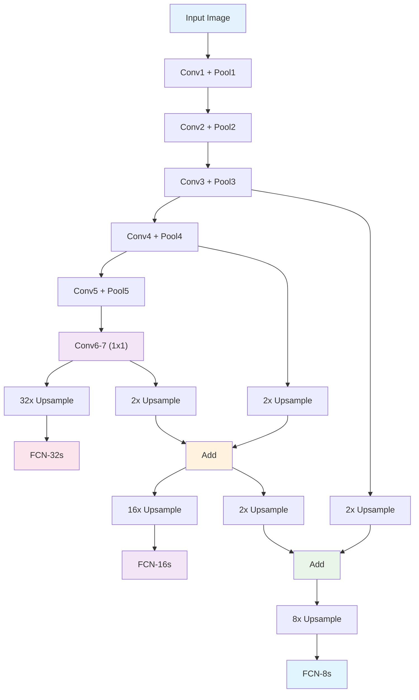

# 7. 클래식 아키텍처 분석

## 목차
1. [Fully Convolutional Networks (FCN)](#1-fully-convolutional-networks-fcn)<br/>
   1. 1.1. [FCN의 혁신적 아이디어](#11-fcn의-혁신적-아이디어)<br/>
   1. 1.2. [완전연결층을 컨볼루션으로 변환](#12-완전연결층을-컨볼루션으로-변환)<br/>
   1. 1.3. [업샘플링과 Skip Connection](#13-업샘플링과-skip-connection)<br/>

2. [U-Net 구조 심화 분석](#2-u-net-구조-심화-분석)<br/>
   2. 2.1. [Encoder-Decoder 아키텍처](#21-encoder-decoder-아키텍처)<br/>
   2. 2.2. [Skip Connection의 정보 이론적 분석](#22-skip-connection의-정보-이론적-분석)<br/>
   2. 2.3. [U-Net 변형들과 발전](#23-u-net-변형들과-발전)<br/>

3. [Skip Connection의 수학적 원리](#3-skip-connection의-수학적-원리)<br/>
   3. 3.1. [정보 보존과 그래디언트 흐름](#31-정보-보존과-그래디언트-흐름)<br/>
   3. 3.2. [Multi-scale Feature Fusion](#32-multi-scale-feature-fusion)<br/>
   3. 3.3. [Skip Connection의 최적 설계](#33-skip-connection의-최적-설계)<br/>

4. [Receptive Field 이론](#4-receptive-field-이론)<br/>
   4. 4.1. [이론적 vs 실제적 Receptive Field](#41-이론적-vs-실제적-receptive-field)<br/>
   4. 4.2. [Receptive Field 확장 전략](#42-receptive-field-확장-전략)<br/>
   4. 4.3. [Context Modeling의 중요성](#43-context-modeling의-중요성)<br/>

5. [Feature Hierarchy와 표현 학습](#5-feature-hierarchy와-표현-학습)<br/>
   5. 5.1. [계층적 특징 표현](#51-계층적-특징-표현)<br/>
   5. 5.2. [Low-level vs High-level Features](#52-low-level-vs-high-level-features)<br/>
   5. 5.3. [Feature Reuse와 효율성](#53-feature-reuse와-효율성)<br/>

---

## 1. Fully Convolutional Networks (FCN)

### 1.1. FCN의 혁신적 아이디어

#### 1.1.1. 완전 컨볼루션의 개념

FCN의 핵심 아이디어는 네트워크의 모든 층을 컨볼루션 층으로 구성하는 것이다:

**기존 CNN**:
```
Conv → Conv → ... → FC → FC → Output (1D vector)
```

**FCN**:
```
Conv → Conv → ... → Conv → Conv → Output (2D map)
```

이를 통해 **임의 크기 입력**을 처리할 수 있고, **공간 정보를 보존**한다.

#### 1.1.2. Dense Prediction 문제

FCN은 각 픽셀마다 예측을 수행하는 **dense prediction** 문제를 해결한다:

$$f: \mathbb{R}^{H \times W \times 3} \rightarrow \mathbb{R}^{H \times W \times C}$$

여기서 $C$는 클래스 수이다.

**기존 방법의 한계**:
- Sliding window: 계산 비효율성
- Patch-based: 중복 계산과 경계 문제

#### 1.1.3. End-to-End 학습

FCN은 픽셀 단위 예측을 위한 **end-to-end 학습**을 가능하게 한다:

$$\mathcal{L} = \frac{1}{HW} \sum_{i=1}^{H} \sum_{j=1}^{W} \ell(y_{i,j}, \hat{y}_{i,j})$$

여기서 $\ell(\cdot, \cdot)$은 픽셀별 손실 함수이다.

### 1.2. 완전연결층을 컨볼루션으로 변환

#### 1.2.1. 수학적 등가성

크기 $H \times W$인 특징맵을 입력으로 하는 완전연결층:

**FC layer**: $\mathbb{R}^{H \times W \times C_{in}} \rightarrow \mathbb{R}^{C_{out}}$

이는 다음 1×1 컨볼루션과 동일하다:

**1×1 Conv**: $\mathbb{R}^{H \times W \times C_{in}} \rightarrow \mathbb{R}^{H \times W \times C_{out}}$

#### 1.2.2. 파라미터 재해석

**FC 가중치 행렬**: $W_{FC} \in \mathbb{R}^{(H \cdot W \cdot C_{in}) \times C_{out}}$

**1×1 Conv 커널**: $W_{Conv} \in \mathbb{R}^{1 \times 1 \times C_{in} \times C_{out}}$

변환 관계:
$$W_{Conv} = \text{reshape}(W_{FC}^T)$$

#### 1.2.3. 계산 효율성

1×1 컨볼루션으로 변환 시 장점:
- **메모리 효율성**: 중간 벡터화 불필요
- **병렬 처리**: 공간적 위치별 독립 계산
- **임의 크기**: 입력 크기에 제약 없음

### 1.3. 업샘플링과 Skip Connection

#### 1.3.1. 업샘플링의 필요성

다운샘플링된 특징맵을 원본 해상도로 복원:

$$\text{Downsampling ratio} = 2^n$$

여기서 $n$은 풀링 층의 개수이다.

**문제**: 단순 업샘플링은 세부사항 손실

#### 1.3.2. FCN의 Skip Architecture

다양한 skip connection 구조:

**FCN-32s**: 마지막 층에서만 32배 업샘플링
**FCN-16s**: Pool4와 융합하여 16배 업샘플링
**FCN-8s**: Pool3, Pool4와 융합하여 8배 업샘플링



#### 1.3.3. Skip Connection의 효과

**정량적 향상**:
- FCN-32s: 내부적 세부사항 부족
- FCN-16s: 중간 해상도 특징으로 개선
- FCN-8s: 고해상도 특징으로 추가 개선

**mIoU 성능** (PASCAL VOC 2012):
- FCN-32s: 59.4%
- FCN-16s: 62.4%  
- FCN-8s: 62.7%

## 2. U-Net 구조 심화 분석

### 2.1. Encoder-Decoder 아키텍처

#### 2.1.1. U자형 구조의 설계 철학

U-Net의 구조는 **대칭적 encoder-decoder** 형태:

**Encoder (Contracting Path)**:
- 공간 해상도 감소 ($H, W \downarrow$)
- 채널 수 증가 ($C \uparrow$)  
- 추상적 특징 학습

**Decoder (Expansive Path)**:
- 공간 해상도 증가 ($H, W \uparrow$)
- 채널 수 감소 ($C \downarrow$)
- 세밀한 지역화

#### 2.1.2. 수학적 표현

**Encoder의 $l$번째 단계**:
$$E_l = \text{Pool}(\text{Conv}(\text{Conv}(E_{l-1})))$$
$$\text{size}(E_l) = (H/2^l, W/2^l, C \cdot 2^l)$$

**Decoder의 $l$번째 단계**:
$$D_l = \text{Conv}(\text{Conv}(\text{Concat}(\text{Upsample}(D_{l-1}), E_{L-l})))$$

여기서 $L$은 총 인코더 단계 수이다.

#### 2.1.3. 정보 압축과 복원

**압축 단계**: 
공간 정보 → 추상적 특징
$$I(X; Y) = H(X) - H(X|Y)$$

**복원 단계**:
추상적 특징 + 공간 정보 → 세밀한 예측

### 2.2. Skip Connection의 정보 이론적 분석

#### 2.2.1. 정보 병목 이론

딥러닝에서 각 층은 **정보 병목(Information Bottleneck)**을 형성한다:

$$\min I(X; T) \text{ subject to } I(Y; T) \geq I_{\min}$$

여기서:
- $T$: 중간 표현
- $X$: 입력
- $Y$: 출력

#### 2.2.2. Skip Connection의 정보 보존 효과

**정보 손실 없이**:
$$I(X; \text{Skip}) = I(X; E_l)$$

**결합된 정보량**:
$$I(X; \text{Concat}(D_l, E_l)) \geq \max(I(X; D_l), I(X; E_l))$$

#### 2.2.3. 상호 정보량 분석

Skip connection을 통한 정보 흐름:

$$MI_{skip} = H(E_l) + H(D_l) - H(E_l, D_l)$$

**독립성 가정**: $H(E_l, D_l) \approx H(E_l) + H(D_l)$
따라서 $MI_{skip} \approx 0$ (정보 중복 최소)

### 2.3. U-Net 변형들과 발전

#### 2.3.1. Attention U-Net

Skip connection에 attention 메커니즘 추가:

$$\alpha_{i,j} = \sigma(W_{\alpha}^T(\text{ReLU}(W_x x_{i,j} + W_g g + b_g)) + b_{\alpha})$$

여기서:
- $x_{i,j}$: 인코더 특징의 $(i,j)$ 위치
- $g$: 게이팅 신호 (디코더에서)
- $\alpha_{i,j}$: 어텐션 가중치

**효과**: 관련 없는 배경 정보 억제

#### 2.3.2. Dense U-Net

DenseNet의 아이디어를 U-Net에 적용:

$$x_l = H_l([x_0, x_1, ..., x_{l-1}])$$

**장점**:
- 특징 재사용 증가
- 그래디언트 흐름 개선
- 파라미터 효율성

#### 2.3.3. 3D U-Net

3차원 데이터 (의료 영상 등)를 위한 확장:

**3D 컨볼루션**:
$$\text{Conv3D}: \mathbb{R}^{D \times H \times W \times C} \rightarrow \mathbb{R}^{D' \times H' \times W' \times C'}$$

**메모리 도전**:
- 3D 특징맵: $O(D \times H \times W)$ 메모리
- 패치 기반 처리 필요

## 3. Skip Connection의 수학적 원리

### 3.1. 정보 보존과 그래디언트 흐름

#### 3.1.1. 그래디언트 소실 문제 해결

**기존 깊은 네트워크의 문제**:
$\frac{\partial \mathcal{L}}{\partial W_1} = \frac{\partial \mathcal{L}}{\partial y_L} \prod_{l=2}^{L} \frac{\partial y_l}{\partial y_{l-1}}$

각 층에서 $|\frac{\partial y_l}{\partial y_{l-1}}| < 1$이면 그래디언트가 지수적으로 감소한다.

**Skip Connection의 해결책**:
$y_{l+1} = f(y_l) + y_l$

역전파:
$\frac{\partial \mathcal{L}}{\partial y_l} = \frac{\partial \mathcal{L}}{\partial y_{l+1}} \left(1 + \frac{\partial f}{\partial y_l}\right)$

항등 성분 $(1)$이 그래디언트 흐름을 보장한다.

#### 3.1.2. 정보 고속도로 (Information Highway)

Skip connection은 정보가 직접 전파되는 경로를 제공:

**직접 경로**: $x \rightarrow y$ (변환 없이)
**변환 경로**: $x \rightarrow f(x) \rightarrow y$

**상호 보완**:
- 직접 경로: 세부 정보 보존
- 변환 경로: 추상적 특징 학습

#### 3.1.3. Residual Learning 관점

**원본 매핑**: $\mathcal{H}(x)$
**잔차 매핑**: $\mathcal{F}(x) = \mathcal{H}(x) - x$

**학습 목표**:
$\mathcal{F}(x) \rightarrow 0 \text{ (identity mapping에 가까워짐)}$

이는 **최적화를 단순화**한다.

### 3.2. Multi-scale Feature Fusion

#### 3.2.1. 다중 스케일 정보 통합

각 스케일에서 서로 다른 정보를 포착:

**저해상도**: 전역적 맥락, 의미적 정보
**고해상도**: 지역적 세부사항, 경계 정보

**융합 전략**:
$F_{fused} = \alpha F_{low} + \beta F_{high}$

여기서 $\alpha + \beta = 1$ (가중 조합)

#### 3.2.2. Feature Pyramid의 수학적 모델

**Bottom-up pathway**: $\{C_2, C_3, C_4, C_5\}$
**Top-down pathway**: $\{P_5, P_4, P_3, P_2\}$

**융합 공식**:
$P_i = \text{Upsample}(P_{i+1}) + \text{Conv}_{1 \times 1}(C_i)$

#### 3.2.3. 최적 융합 가중치

**학습 가능한 가중치**:
$w_i = \frac{\text{ReLU}(\epsilon + w_i')}{\sum_j \text{ReLU}(\epsilon + w_j')}$

여기서 $\epsilon$은 수치 안정성을 위한 작은 값이다.

### 3.3. Skip Connection의 최적 설계

#### 3.3.1. 연결 방법 비교

**Addition**: $y = f(x) + x$
- 파라미터 증가 없음
- 채널 수 동일해야 함

**Concatenation**: $y = [f(x), x]$
- 정보 손실 없음
- 채널 수 증가

**Gated**: $y = g \odot f(x) + (1-g) \odot x$
- 적응적 선택
- 추가 파라미터 필요

#### 3.3.2. 연결 밀도 최적화

**Dense Connection**: 모든 이전 층과 연결
$x_l = H_l([x_0, x_1, ..., x_{l-1}])$

**장점**: 최대 정보 재사용
**단점**: 메모리 사용량 증가

**최적 연결 패턴**:
$\text{Memory} \propto \sum_{l=1}^{L} l \times C_l$

#### 3.3.3. Skip Connection의 정규화 효과

Skip connection은 **implicit regularization** 역할:

**Effective capacity 제한**:
네트워크가 항등 매핑 근처에서 동작하도록 유도

**Smoothness regularization**:
$\mathcal{R} = \lambda ||\nabla f(x)||^2$

Skip connection이 이러한 정규화를 자연스럽게 제공한다.

## 4. Receptive Field 이론

### 4.1. 이론적 vs 실제적 Receptive Field

#### 4.1.1. 이론적 Receptive Field 계산

$l$번째 층의 이론적 receptive field:

$RF_l = RF_{l-1} + (K_l - 1) \times \prod_{i=1}^{l-1} S_i$

여기서:
- $RF_l$: $l$번째 층의 receptive field
- $K_l$: 커널 크기
- $S_i$: $i$번째 층의 스트라이드

**예시 계산**:
```
Layer 1: RF₁ = 1 + (3-1) × 1 = 3
Layer 2: RF₂ = 3 + (3-1) × 2 = 7  
Layer 3: RF₃ = 7 + (3-1) × 4 = 15
```

#### 4.1.2. 실제적 Receptive Field (Effective RF)

**문제**: 이론적 RF 내 모든 픽셀이 동등하게 기여하지 않음

**실제 분포**: 가우시안 유사 분포
$w(x,y) = \frac{1}{2\pi\sigma^2} \exp\left(-\frac{x^2+y^2}{2\sigma^2}\right)$

**Effective RF**: 
$RF_{eff} = \text{area where } w(x,y) > \text{threshold}$

일반적으로 $RF_{eff} \ll RF_{theoretical}$

#### 4.1.3. Receptive Field 측정 방법

**Gradient-based 방법**:
$\text{Importance}(i,j) = \left|\frac{\partial f}{\partial X_{i,j}}\right|$

**Occlusion-based 방법**:
입력의 일부를 가리고 출력 변화 측정

**Attention-based 방법**:
학습된 어텐션 가중치 분석

### 4.2. Receptive Field 확장 전략

#### 4.2.1. Dilated Convolution을 통한 확장

**표준 3×3 컨볼루션**: RF = 3
**Dilated 3×3 (rate=2)**: RF = 5
**Dilated 3×3 (rate=4)**: RF = 9

**지수적 확장 전략**:
$\text{dilation}_l = 2^{l-1}$

#### 4.2.2. Global Average Pooling

**극한의 RF 확장**:
$GAP(X) = \frac{1}{HW} \sum_{i=1}^{H} \sum_{j=1}^{W} X_{i,j}$

RF = 전체 이미지 크기

**장점**: 파라미터 없음, 전역 정보
**단점**: 공간 정보 손실

#### 4.2.3. Multi-scale Pooling

**Spatial Pyramid Pooling**:
$SPP = \text{Concat}([Pool_{1 \times 1}, Pool_{2 \times 2}, Pool_{4 \times 4}])$

**ASPP (Atrous Spatial Pyramid Pooling)**:
$ASPP = \text{Concat}([Conv_{rate=1}, Conv_{rate=6}, Conv_{rate=12}, GAP])$

### 4.3. Context Modeling의 중요성

#### 4.3.1. 지역 vs 전역 맥락

**지역 맥락**: 인접 픽셀들의 관계
**전역 맥락**: 이미지 전체의 장면 이해

**수학적 표현**:
$\text{Local}: f(x_{i,j} | \text{neighbors}(i,j))$
$\text{Global}: f(x_{i,j} | \text{entire image})$

#### 4.3.2. 맥락 정보의 계층 구조

**Low-level context**: 텍스처, 가장자리
**Mid-level context**: 객체 부분, 패턴
**High-level context**: 의미적 관계, 장면

**특징맵에서의 표현**:
$\text{Context}_l = \text{function}(\text{RF}_l, \text{semantics}_l)$

#### 4.3.3. 적응적 맥락 집계

**Self-Attention for Context**:
$\text{Context}(i,j) = \sum_{p,q} \alpha_{(i,j) \rightarrow (p,q)} \cdot F_{p,q}$

**Non-local Networks**:
모든 위치 쌍의 관계를 모델링하여 맥락 정보 활용

## 5. Feature Hierarchy와 표현 학습

### 5.1. 계층적 특징 표현

#### 5.1.1. 특징 추상화 레벨

CNN의 각 층은 서로 다른 추상화 레벨의 특징을 학습한다:

**Layer 1**: 가장자리, 색상 변화
$f_1(x) = \text{edge detectors, color blobs}$

**Layer 2-3**: 모서리 조합, 간단한 도형
$f_{2-3}(x) = \text{corners, simple shapes}$

**Layer 4-5**: 객체 부분, 복잡한 패턴
$f_{4-5}(x) = \text{object parts, textures}$

**Layer 6+**: 완전한 객체, 의미적 개념
$f_{6+}(x) = \text{objects, semantic concepts}$

#### 5.1.2. 특징 복잡도 분석

**Intrinsic Dimension**: 
각 층에서 학습되는 특징의 내재적 차원

$ID_l = \text{effective rank}(\text{Feature Matrix}_l)$

일반적으로 깊은 층으로 갈수록 증가한다.

#### 5.1.3. 표현 불변성 (Invariance)

**Translation Invariance**: 위치 이동에 불변
**Scale Invariance**: 크기 변화에 불변  
**Rotation Invariance**: 회전에 불변

**수학적 표현**:
$f(T(x)) = f(x)$
여기서 $T$는 변환 함수이다.

### 5.2. Low-level vs High-level Features

#### 5.2.1. Low-level Features 특성

**특징**:
- 높은 공간 해상도
- 지역적 정보
- 세부 텍스처와 경계

**수학적 특성**:
- 높은 주파수 성분
- 작은 receptive field
- 희소한 활성화 패턴

#### 5.2.2. High-level Features 특성

**특징**:
- 낮은 공간 해상도
- 의미적 정보
- 추상적 개념

**수학적 특성**:
- 낮은 주파수 성분
- 큰 receptive field
- 밀집한 활성화 패턴

#### 5.2.3. Feature Complementarity

**상호 보완성**:
$\text{Final Prediction} = g(\text{Low-level}, \text{High-level})$

**융합 전략**:
1. **Early Fusion**: 낮은 층에서 결합
2. **Late Fusion**: 높은 층에서 결합
3. **Multi-scale Fusion**: 여러 층에서 결합

### 5.3. Feature Reuse와 효율성

#### 5.3.1. Feature Map 재사용 분석

**DenseNet의 재사용 패턴**:
각 층이 이전 모든 층의 특징을 직접 사용

**재사용 지수**:
$\text{Reuse}(l \rightarrow l') = \frac{||\text{weights from layer } l||_1}{\sum_{k=1}^{l-1} ||\text{weights from layer } k||_1}$

#### 5.3.2. 중복성 분석

**특징 간 상관관계**:
$\rho_{i,j} = \frac{\text{Cov}(F_i, F_j)}{\sqrt{\text{Var}(F_i) \text{Var}(F_j)}}$

**중복성 측정**:
높은 상관관계는 중복된 정보를 의미

#### 5.3.3. 효율적 특징 선택

**채널 중요도 평가**:
$\text{Importance}(c) = \frac{1}{H \times W} \sum_{i,j} |F_c(i,j)|$

**Pruning 전략**:
중요도가 낮은 채널 제거로 효율성 향상

---

## 클래식 아키텍처의 현대적 의미

### 설계 원칙의 지속성

**FCN의 원칙**:
- End-to-end 학습
- 공간 정보 보존
- 효율적 dense prediction

**U-Net의 원칙**:
- Encoder-decoder 구조
- Skip connection을 통한 정보 보존
- Multi-scale feature fusion

이러한 원칙들은 현대 아키텍처에서도 계속 활용된다.

### 한계와 발전 방향

**한계**:
- 고정된 receptive field
- 제한적인 global context
- 계산 효율성 문제

**현대적 해결책**:
- Attention mechanism
- Efficient architecture design
- Neural architecture search

### 영감과 발전

클래식 아키텍처들은 현대 세그멘테이션 모델들의 **기초**가 되었으며, 그들의 **핵심 아이디어**들은 지금도 유효하다.

---

## 용어 목록

- **Attention U-Net**: 어텐션 유넷 - 어텐션이 적용된 U-Net
- **Bottom-up Pathway**: 보텀업 패스웨이 - 상향식 경로
- **Contracting Path**: 컨트랙팅 패스 - 수축 경로 (인코더)
- **Dense Prediction**: 덴스 프레딕션 - 조밀한 예측, 모든 픽셀 예측
- **Effective Receptive Field**: 이펙티브 리셉티브 필드 - 실제 수용 영역
- **Encoder-Decoder**: 인코더 디코더 - 부호화기-복호화기 구조
- **End-to-End Learning**: 엔드투엔드 러닝 - 종단간 학습
- **Expansive Path**: 익스팬시브 패스 - 확장 경로 (디코더)
- **Feature Complementarity**: 피처 컴플리멘테리티 - 특징 상호 보완성
- **Feature Hierarchy**: 피처 하이어라키 - 특징 계층 구조
- **Feature Pyramid**: 피처 피라미드 - 특징 피라미드
- **Feature Reuse**: 피처 리유즈 - 특징 재사용
- **Fully Convolutional Networks (FCN)**: 풀리 컨볼루셔널 네트워크스 - 완전 컨볼루션 네트워크
- **Gated Connection**: 게이티드 커넥션 - 게이트가 있는 연결
- **Gradient Vanishing**: 그래디언트 배니싱 - 기울기 소실
- **Information Bottleneck**: 인포메이션 보틀넥 - 정보 병목
- **Information Highway**: 인포메이션 하이웨이 - 정보 고속도로
- **Intrinsic Dimension**: 인트린식 디멘션 - 내재적 차원
- **Multi-scale Feature Fusion**: 멀티스케일 피처 퓨전 - 다중 스케일 특징 융합
- **Occlusion-based Method**: 어클루전 베이스드 메소드 - 가림 기반 방법
- **Pruning**: 프루닝 - 가지치기, 불필요한 부분 제거
- **Receptive Field**: 리셉티브 필드 - 수용 영역
- **Residual Learning**: 레지듀얼 러닝 - 잔차 학습
- **Scale Invariance**: 스케일 인베리언스 - 크기 불변성
- **Skip Architecture**: 스킵 아키텍처 - 건너뛰기 구조
- **Sliding Window**: 슬라이딩 윈도우 - 이동 윈도우
- **Spatial Pyramid Pooling (SPP)**: 스페이셜 피라미드 풀링 - 공간 피라미드 풀링
- **Top-down Pathway**: 톱다운 패스웨이 - 하향식 경로
- **Translation Invariance**: 트랜스레이션 인베리언스 - 평행이동 불변성