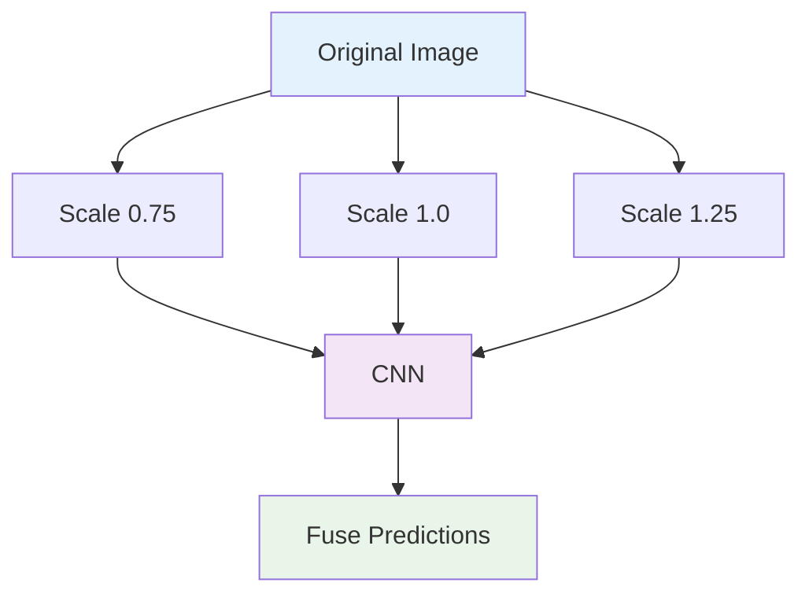
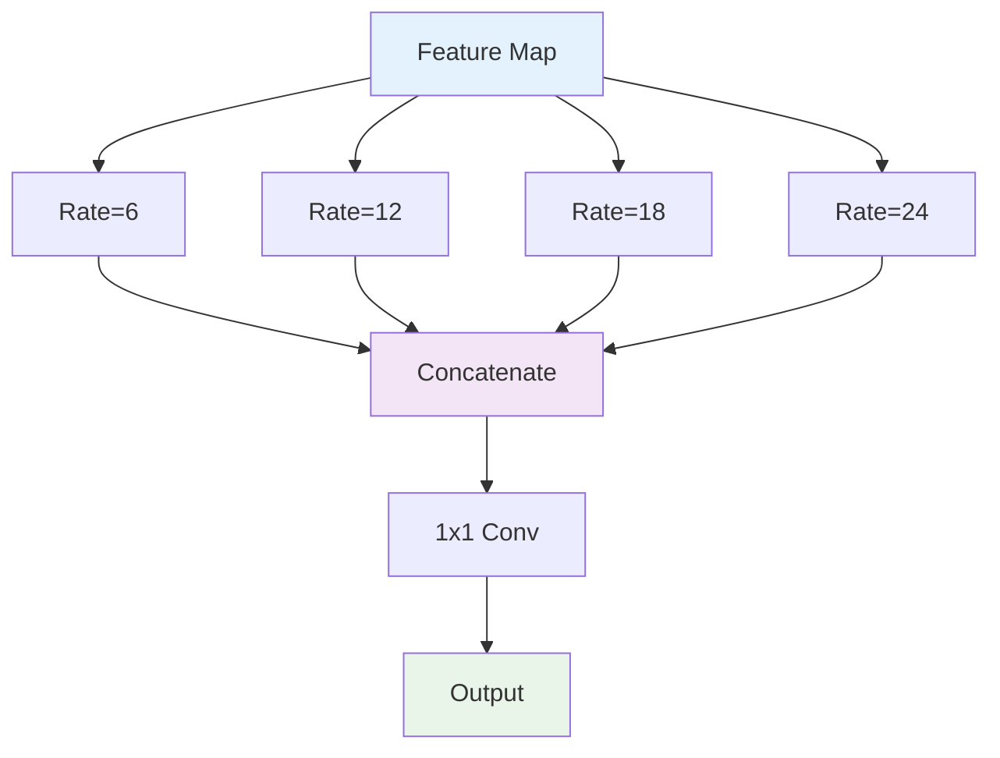
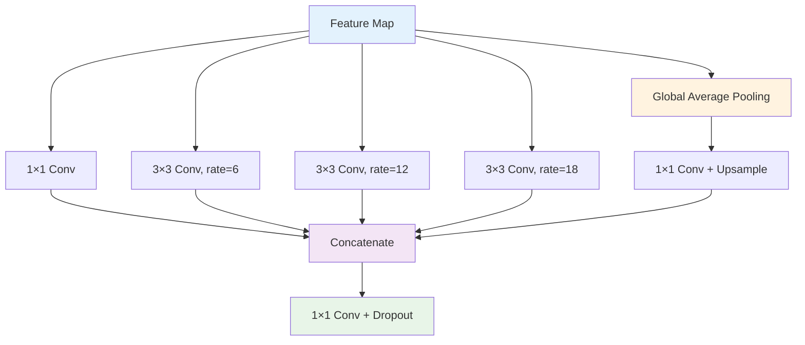
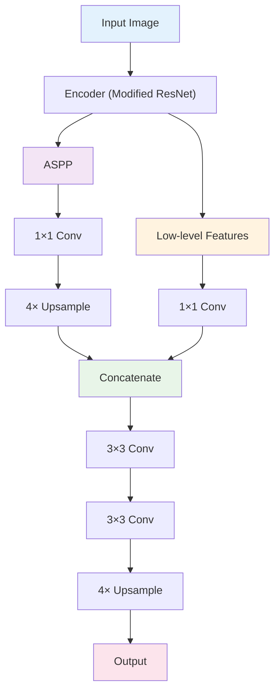

# 8. DeepLab 시리즈 분석

## 목차
1. [DeepLab v1: 기초 아이디어](#1-deeplab-v1-기초-아이디어) 
   1. 1.1. [Dense CRF와 후처리](#11-dense-crf와-후처리) 
   1. 1.2. [Atrous Convolution 도입](#12-atrous-convolution-도입) 
   1. 1.3. [Multi-scale Processing](#13-multi-scale-processing) 

2. [DeepLab v2: Atrous Spatial Pyramid Pooling](#2-deeplab-v2-atrous-spatial-pyramid-pooling) 
   2. 2.1. [ASPP의 수학적 원리](#21-aspp의-수학적-원리) 
   2. 2.2. [다중 스케일 특징 집계](#22-다중-스케일-특징-집계) 
   2. 2.3. [ResNet 백본과의 결합](#23-resnet-백본과의-결합) 

3. [DeepLab v3: 개선된 ASPP](#3-deeplab-v3-개선된-aspp) 
   3. 3.1. [Global Average Pooling 추가](#31-global-average-pooling-추가) 
   3. 3.2. [Batch Normalization 적용](#32-batch-normalization-적용) 
   3. 3.3. [Multi-grid 전략](#33-multi-grid-전략) 

4. [DeepLab v3+: Encoder-Decoder 결합](#4-deeplab-v3-encoder-decoder-결합) 
   4. 4.1. [Encoder-Decoder 구조 설계](#41-encoder-decoder-구조-설계) 
   4. 4.2. [Depthwise Separable Convolution](#42-depthwise-separable-convolution) 
   4. 4.3. [Modified Aligned Xception](#43-modified-aligned-xception) 

5. [ASPP 모듈 심화 분석](#5-aspp-모듈-심화-분석) 
   5. 5.1. [다양한 Dilation Rate의 효과](#51-다양한-dilation-rate의-효과) 
   5. 5.2. [Receptive Field 분석](#52-receptive-field-분석) 
   5. 5.3. [계산 효율성과 성능 트레이드오프](#53-계산-효율성과-성능-트레이드오프) 

---

## 1. DeepLab v1: 기초 아이디어

### 1.1. Dense CRF와 후처리

#### 1.1.1. 문제 인식

기존 FCN의 한계:
- **거친 예측**: 다운샘플링으로 인한 해상도 손실
- **경계 부정확**: 객체 경계가 블러(blur)됨
- **세부사항 부족**: 작은 객체나 얇은 구조 놓침

#### 1.1.2. Conditional Random Field (CRF) 도입

**에너지 함수 정의**:
$$E(x) = \sum_i \psi_u(x_i) + \sum_{i<j} \psi_p(x_i, x_j)$$

여기서:
- $\psi_u(x_i)$: 단항 위치 함수 (unary potential)
- $\psi_p(x_i, x_j)$: 쌍항 위치 함수 (pairwise potential)

**단항 위치 함수**:
CNN의 출력을 직접 사용:
$$\psi_u(x_i) = -\log P(x_i | I)$$

#### 1.1.3. Fully Connected CRF

모든 픽셀 쌍을 연결하는 CRF:

**쌍항 위치 함수**:
$$\psi_p(x_i, x_j) = \mu(x_i, x_j) \sum_{m=1}^{K} w^{(m)} k^{(m)}(f_i, f_j)$$

**Gaussian 커널들**:
$$k^{(1)}(f_i, f_j) = \exp\left(-\frac{|p_i - p_j|^2}{2\sigma_\alpha^2} - \frac{|I_i - I_j|^2}{2\sigma_\beta^2}\right)$$

$$k^{(2)}(f_i, f_j) = \exp\left(-\frac{|p_i - p_j|^2}{2\sigma_\gamma^2}\right)$$

여기서:
- $p_i, p_j$: 픽셀 위치
- $I_i, I_j$: 픽셀 색상
- $\sigma_\alpha, \sigma_\beta, \sigma_\gamma$: 표준편차 파라미터

#### 1.1.4. Mean Field 추론

CRF 추론을 위한 반복 알고리즘:

**초기화**:
$$Q_i(x_i) \leftarrow \frac{1}{Z} \exp(-\psi_u(x_i))$$

**반복 업데이트**:
$$\tilde{Q}_i^{(t)}(l) = \sum_{m=1}^{K} w^{(m)} \sum_{j \neq i} k^{(m)}(f_i, f_j) Q_j^{(t-1)}(l)$$

$$Q_i^{(t)}(l) = \frac{1}{Z_i} \exp(-\psi_u(x_i = l) - \tilde{Q}_i^{(t)}(l))$$

### 1.2. Atrous Convolution 도입

#### 1.2.1. 동기와 문제점

**기존 방법의 문제**:
- 풀링으로 인한 **공간 해상도 감소**
- 업샘플링 시 **세부사항 손실**
- **계산 비효율성**

**Atrous Convolution의 해결책**:
- 해상도를 유지하면서 **receptive field 확장**
- **파라미터 증가 없이** 더 넓은 맥락 포착

#### 1.2.2. 수학적 정의

표준 컨볼루션:
$$y[i] = \sum_{k} x[i+k] w[k]$$

Atrous 컨볼루션:
$$y[i] = \sum_{k} x[i + r \cdot k] w[k]$$

여기서 $r$은 atrous rate (dilation factor)이다.

#### 1.2.3. 2D Atrous Convolution

$$y[i,j] = \sum_{k,l} x[i + r \cdot k, j + r \cdot l] w[k,l]$$

**효과적 커널 크기**:
$$(2r-1) \times (2r-1) \text{ for } 3 \times 3 \text{ kernel}$$

**예시**:
- $r=1$: $3 \times 3$ (표준)
- $r=2$: $5 \times 5$ (effective)
- $r=4$: $9 \times 9$ (effective)

### 1.3. Multi-scale Processing

#### 1.3.1. 스케일 불변성 문제

**동일한 객체, 다른 스케일**:
- 가까운 객체: 큰 스케일
- 먼 객체: 작은 스케일

**고정 receptive field의 한계**:
하나의 스케일에만 최적화됨

#### 1.3.2. Multi-scale 전략들

**Image Pyramid**:

**ASPP (Atrous Spatial Pyramid Pooling)**:

#### 1.3.3. 성능 비교

**PASCAL VOC 2012 결과** (DeepLab v1):
- Base model: 63.7% mIoU
- + Atrous conv: 66.4% mIoU  
- + Multi-scale: 67.7% mIoU
- + CRF: 71.6% mIoU

## 2. DeepLab v2: Atrous Spatial Pyramid Pooling

### 2.1. ASPP의 수학적 원리

#### 2.1.1. 기본 구조

ASPP는 병렬로 배치된 여러 atrous 컨볼루션으로 구성:

$$\text{ASPP}(x) = \text{Concat}([f_1(x), f_2(x), f_3(x), f_4(x)])$$

여기서 각 $f_i$는 서로 다른 dilation rate를 가진다.

#### 2.1.2. Dilation Rate 선택

**DeepLab v2 설정**:
- $r_1 = 6$
- $r_2 = 12$ 
- $r_3 = 18$
- $r_4 = 24$

**설계 원칙**:
$$r_{i+1} = 2 \times r_i \text{ (approximately)}$$

#### 2.1.3. Feature Fusion 전략

**단순 연결**:
$$F_{fused} = [F_6, F_{12}, F_{18}, F_{24}] \in \mathbb{R}^{H \times W \times 4C}$$

**차원 축소**:
$$F_{final} = \text{Conv}_{1 \times 1}(F_{fused}) \in \mathbb{R}^{H \times W \times C}$$

### 2.2. 다중 스케일 특징 집계

#### 2.2.1. 서로 다른 맥락 크기

각 dilation rate는 서로 다른 크기의 맥락을 포착:

**작은 rate (6)**: 지역적 세부사항
**중간 rate (12, 18)**: 중간 규모 맥락  
**큰 rate (24)**: 전역적 맥락

#### 2.2.2. Receptive Field 분석

3×3 커널 기준 이론적 RF:
- Rate 6: $13 \times 13$
- Rate 12: $25 \times 25$
- Rate 18: $37 \times 37$ 
- Rate 24: $49 \times 49$

#### 2.2.3. 상호 보완성

**수학적 표현**:
$$\text{Coverage}(r_1, r_2, ..., r_k) = \bigcup_{i=1}^{k} \text{RF}(r_i)$$

서로 다른 rate들이 다양한 스케일을 덮어 상호 보완한다.

### 2.3. ResNet 백본과의 결합

#### 2.3.1. ResNet 수정사항

**마지막 두 블록에서 stride 제거**:
- Block 4: stride 2 → stride 1
- Block 5: stride 2 → stride 1  

**Atrous convolution 적용**:
- Block 4: dilation = 2
- Block 5: dilation = 4

#### 2.3.2. Output Stride

**정의**: 입력 해상도 대비 출력 해상도 비율
$$\text{Output Stride} = \frac{\text{Input Resolution}}{\text{Output Resolution}}$$

**DeepLab v2**: Output stride = 8
(원본 ResNet은 32)

#### 2.3.3. 특징맵 해상도

**입력**: $513 \times 513$
**ASPP 입력**: $65 \times 65$ (stride 8)
**최종 출력**: $513 \times 513$ (8배 업샘플링)

## 3. DeepLab v3: 개선된 ASPP

### 3.1. Global Average Pooling 추가

#### 3.1.1. 전역 맥락의 필요성

**한계**: Atrous convolution만으로는 전체 이미지의 맥락 부족

**해결책**: Global Average Pooling (GAP) 추가
$$\text{GAP}(F) = \frac{1}{HW} \sum_{i=1}^{H} \sum_{j=1}^{W} F_{i,j}$$

#### 3.1.2. 개선된 ASPP 구조

**DeepLab v3 ASPP**:

#### 3.1.3. GAP의 효과

**이론적 receptive field**: 전체 이미지
**실제 효과**: 
- 클래스별 전역 통계 제공
- 장면 수준 맥락 정보 포착

### 3.2. Batch Normalization 적용

#### 3.2.1. ASPP에서의 BN

각 ASPP 브랜치에 Batch Normalization 적용:

$$\text{ASPP Branch} = \text{BN}(\text{Conv}_{\text{atrous}}(\text{Input}))$$

#### 3.2.2. 학습 안정성 향상

**효과**:
- 그래디언트 폭발/소실 방지
- 더 빠른 수렴
- 정규화 효과

**실험 결과**:
BN 추가로 약 2-3% mIoU 성능 향상

#### 3.2.3. Inference에서의 처리

**Training**: 미니배치 통계 사용
**Inference**: 이동평균 통계 사용

$$\mu_{\text{test}} = \text{EMA}(\mu_{\text{train}})$$
$$\sigma_{\text{test}}^2 = \text{EMA}(\sigma_{\text{train}}^2)$$

### 3.3. Multi-grid 전략

#### 3.3.1. Cascaded Atrous Convolution

ResNet의 마지막 블록 내에서 서로 다른 dilation rate 적용:

**Block 5의 Multi-grid**:
- Unit 1: rate = 1 × 2 = 2
- Unit 2: rate = 2 × 2 = 4  
- Unit 3: rate = 4 × 2 = 8

여기서 기본 rate = 2, Multi-grid = (1, 2, 4)

#### 3.3.2. 수학적 분석

**연속적인 atrous convolution**:
$$\text{Rate}_{\text{effective}} = \text{Rate}_1 + \text{Rate}_2 - 1$$

**Multi-grid의 효과**:
더 조밀하고 다양한 receptive field 패턴

#### 3.3.3. 성능 향상

**PASCAL VOC 2012**:
- Without Multi-grid: 77.21% mIoU
- With Multi-grid (1,2,4): 78.51% mIoU

## 4. DeepLab v3+: Encoder-Decoder 결합

### 4.1. Encoder-Decoder 구조 설계

#### 4.1.1. 동기

**DeepLab v3의 한계**:
- Output stride 16으로 인한 세부사항 손실
- 단순 업샘플링의 한계

**해결책**: U-Net 스타일의 decoder 추가

#### 4.1.2. 전체 구조

#### 4.1.3. Skip Connection 설계

**Low-level feature**: Conv2 출력 (stride 4)
**High-level feature**: ASPP 출력 (stride 16)

**채널 수 조정**:
- Low-level: $256 \rightarrow 48$ (1×1 conv)
- High-level: $256 \rightarrow 256$ (1×1 conv)

### 4.2. Depthwise Separable Convolution

#### 4.2.1. ASPP에서의 적용

**표준 ASPP**: 3×3 standard convolution
**DeepLab v3+**: 3×3 depthwise separable convolution

**파라미터 감소**:
$$\frac{\text{Separable}}{\text{Standard}} = \frac{1}{C} + \frac{1}{K^2}$$

3×3, 256 채널 기준: 약 8.4배 감소

#### 4.2.2. Decoder에서의 활용

**Decoder의 3×3 convolution들**을 모두 depthwise separable로 교체

**성능 비교**:
- 파라미터: 43% 감소
- 속도: 33% 향상
- mIoU: 0.27% 감소 (거의 동일)

### 4.3. Modified Aligned Xception

#### 4.3.1. Xception 백본 도입

**Xception의 장점**:
- Depthwise separable convolution 기반
- 효율적인 파라미터 사용
- 좋은 성능

#### 4.3.2. DeepLab용 수정사항

**Entry flow 수정**:
- Stride 변경으로 더 밀집된 특징 추출
- Max pooling → Separable convolution

**Middle flow 반복**:
- 16회 → 16회 유지
- 각 블록에 atrous convolution 적용

**Exit flow 수정**:
- 추가 separable convolution 층
- Atrous convolution 적용

#### 4.3.3. 성능 결과

**PASCAL VOC 2012**:
- ResNet-101 백본: 78.85% mIoU  
- Xception-65 백본: 79.55% mIoU

**Cityscapes**:
- ResNet-101: 78.79% mIoU
- Xception-65: 79.55% mIoU

## 5. ASPP 모듈 심화 분석

### 5.1. 다양한 Dilation Rate의 효과

#### 5.1.1. Rate 선택의 원리

**너무 작은 rate**: 제한적인 맥락
**너무 큰 rate**: 희소한 샘플링, 정보 손실

**최적 설계**:
$$r_{\max} \leq \frac{\min(H, W)}{2}$$

여기서 $H, W$는 특징맵 크기이다.

#### 5.1.2. Rate별 특성 분석

**Rate = 6**:
- 지역적 패턴 포착
- 객체 경계 정보
- 텍스처 세부사항

**Rate = 12, 18**:
- 중간 규모 맥락
- 객체 형태 정보
- 공간적 관계

**Global Pooling**:
- 전체 장면 맥락
- 클래스 분포 정보
- 의미적 일관성

#### 5.1.3. 실험적 검증

**다양한 조합 테스트**:
- (6, 12, 18): 77.21% mIoU
- (6, 12, 18, 24): 77.82% mIoU  
- (6, 12, 18) + GAP: 78.51% mIoU

### 5.2. Receptive Field 분석

#### 5.2.1. 이론적 vs 실제적 RF

**이론적 계산**:
3×3 커널, rate $r$에서 RF = $1 + 2r$

**실제 측정**:
중앙 부분에 가중치 집중, 가우시안 분포 형태

#### 5.2.2. 다중 Rate의 커버리지

**겹치는 영역**: 정보 중복으로 인한 robustness
**비어있는 영역**: 정보 부족으로 인한 성능 저하

**최적 설계**:
적절한 중첩과 전체 커버리지의 균형

#### 5.2.3. Context Dilution 문제

**큰 dilation rate의 문제**:
$$\text{Sampling Density} = \frac{K^2}{(1 + (K-1) \times r)^2}$$

Rate가 클수록 샘플링 밀도 감소

### 5.3. 계산 효율성과 성능 트레이드오프

#### 5.3.1. 계산 복잡도

**ASPP의 FLOPs**:
$$\text{FLOPs} = H \times W \times \sum_{i=1}^{N} (K_i^2 \times C_{in} \times C_{out})$$

여기서 $N$은 브랜치 수이다.

#### 5.3.2. 메모리 사용량

**특징맵 저장**: $N \times H \times W \times C$
**중간 결과**: Concatenation 시 $N \times C$ 채널

**최적화 전략**:
- 브랜치별 순차 계산
- 중간 결과 재사용

#### 5.3.3. 효율성 개선 방법

**Light-weight ASPP**:
- Depthwise separable convolution
- 적은 브랜치 수
- 작은 중간 채널 수

**성능 비교**:
- Standard ASPP: 100% FLOPs, 78.51% mIoU
- Light ASPP: 45% FLOPs, 77.89% mIoU

---

## DeepLab 시리즈의 발전 과정

### 핵심 아이디어의 진화

**v1**: Atrous convolution + Dense CRF
**v2**: ASPP 도입 + Multi-scale 
**v3**: 개선된 ASPP + Multi-grid
**v3+**: Encoder-decoder + Efficient design

### 성능 향상 궤적

**PASCAL VOC 2012 mIoU**:
- DeepLab v1: 71.6%
- DeepLab v2: 79.7%  
- DeepLab v3: 85.7%
- DeepLab v3+: 87.8%

### 현대적 의미

DeepLab 시리즈는 **atrous convolution**과 **multi-scale processing**의 중요성을 입증했으며, 현대 세그멘테이션 모델의 **표준 구성요소**가 되었다.

---

## 용어 목록

- **Atrous Convolution**: 아트러스 컨볼루션 - 확장 컨볼루션, 구멍이 있는 컨볼루션
- **Atrous Rate**: 아트러스 레이트 - 확장 비율
- **Atrous Spatial Pyramid Pooling (ASPP)**: 아트러스 스페이셜 피라미드 풀링
- **Batch Normalization**: 배치 노멀라이제이션 - 배치 정규화
- **Cascaded Atrous Convolution**: 캐스케이디드 아트러스 컨볼루션 - 연속 확장 컨볼루션
- **Conditional Random Field (CRF)**: 컨디셔널 랜덤 필드 - 조건부 랜덤 필드
- **Context Dilution**: 컨텍스트 딜루션 - 맥락 희석
- **Dense CRF**: 덴스 씨알에프 - 조밀한 조건부 랜덤 필드
- **Dilation Factor**: 딜레이션 팩터 - 확장 인수
- **Effective Kernel Size**: 이펙티브 커널 사이즈 - 실제 커널 크기
- **Encoder-Decoder**: 인코더 디코더 - 부호화기-복호화기
- **Entry Flow**: 엔트리 플로우 - 진입 흐름
- **Exit Flow**: 엑시트 플로우 - 출구 흐름
- **Exponentially Weighted Moving Average (EMA)**: 익스포넨셜리 웨이티드 무빙 애버리지 - 지수 가중 이동 평균
- **Fully Connected CRF**: 풀리 커넥티드 씨알에프 - 완전 연결 조건부 랜덤 필드
- **Global Average Pooling (GAP)**: 글로벌 애버리지 풀링 - 전역 평균 풀링
- **Image Pyramid**: 이미지 피라미드 - 영상 피라미드
- **Mean Field Inference**: 민 필드 인퍼런스 - 평균장 추론
- **Middle Flow**: 미들 플로우 - 중간 흐름
- **Modified Aligned Xception**: 모디파이드 얼라인드 엑셉션 - 수정된 정렬 엑셉션
- **Multi-grid**: 멀티 그리드 - 다중 격자
- **Multi-scale Processing**: 멀티스케일 프로세싱 - 다중 스케일 처리
- **Output Stride**: 아웃풋 스트라이드 - 출력 보폭
- **Pairwise Potential**: 페어와이즈 포텐셜 - 쌍항 위치 함수
- **Sampling Density**: 샘플링 덴시티 - 샘플링 밀도
- **Scale Invariance**: 스케일 인베리언스 - 크기 불변성
- **Unary Potential**: 유나리 포텐셜 - 단항 위치 함수