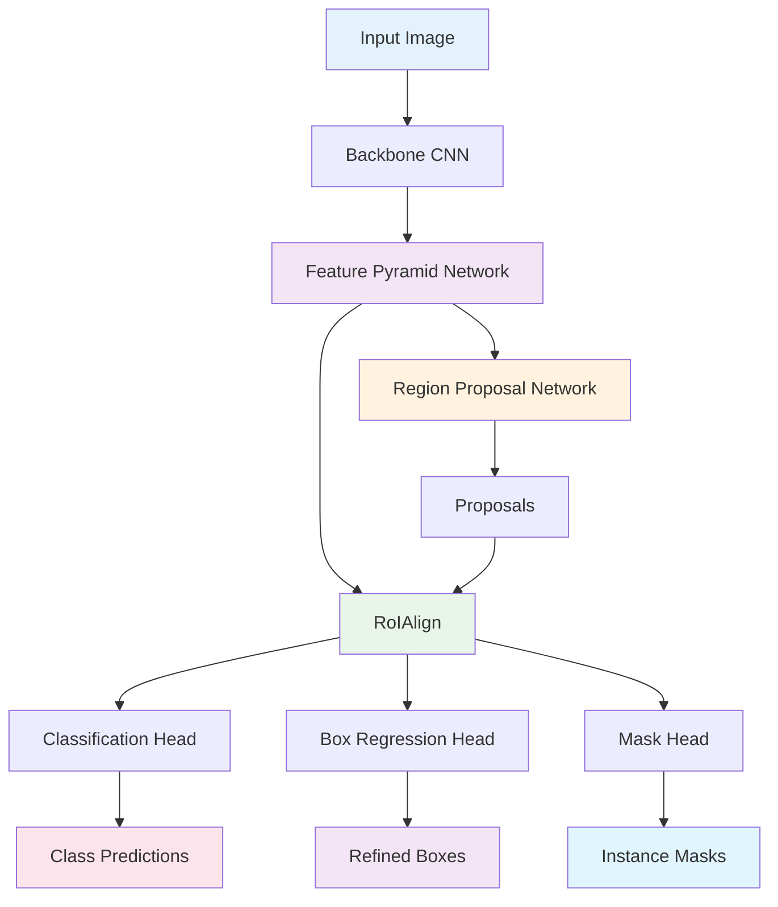
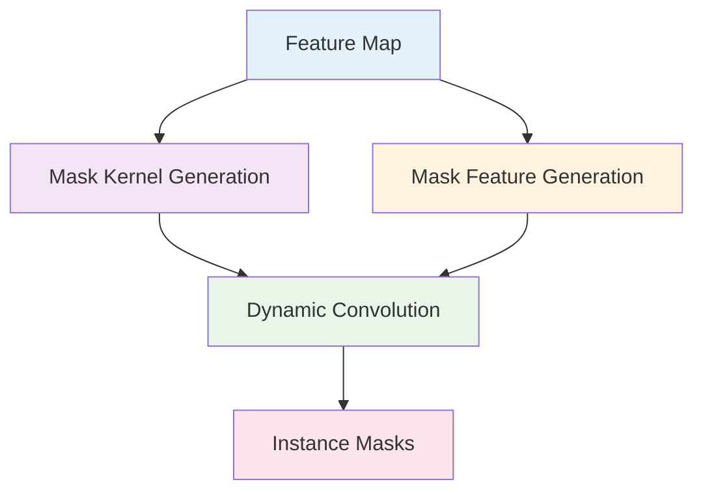
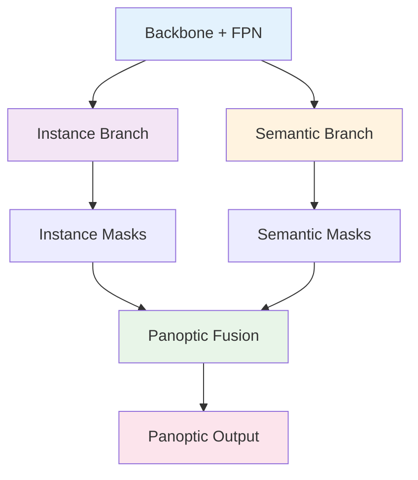

# 9. Instance Segmentation 심화

## 목차
1. [Mask R-CNN 구조 분석](#1-mask-r-cnn-구조-분석) 
   1. 1.1. [Two-Stage Architecture](#11-two-stage-architecture) 
   1. 1.2. [RoIAlign의 수학적 원리](#12-roialign의-수학적-원리) 
   1. 1.3. [Multi-task Loss 설계](#13-multi-task-loss-설계) 

2. [Feature Pyramid Networks (FPN)](#2-feature-pyramid-networks-fpn) 
   2. 2.1. [다중 스케일 특징 표현](#21-다중-스케일-특징-표현) 
   2. 2.2. [Top-down과 Lateral Connection](#22-top-down과-lateral-connection) 
   2. 2.3. [FPN의 수학적 모델링](#23-fpn의-수학적-모델링) 

3. [One-Stage Instance Segmentation](#3-one-stage-instance-segmentation) 
   3. 3.1. [YOLACT의 프로토타입 기법](#31-yolact의-프로토타입-기법) 
   3. 3.2. [SOLOv1/v2의 위치 기반 분할](#32-solov1v2의-위치-기반-분할) 
   3. 3.3. [효율성과 정확도 트레이드오프](#33-효율성과-정확도-트레이드오프) 

4. [마스크 품질 평가와 개선](#4-마스크-품질-평가와-개선) 
   4. 4.1. [마스크 IoU와 품질 메트릭](#41-마스크-iou와-품질-메트릭) 
   4. 4.2. [Mask Scoring과 후처리](#42-mask-scoring과-후처리) 
   4. 4.3. [경계선 정확도 향상 기법](#43-경계선-정확도-향상-기법) 

5. [고급 Instance Segmentation 기법](#5-고급-instance-segmentation-기법) 
   5. 5.1. [Panoptic FPN과 통합 접근](#51-panoptic-fpn과-통합-접근) 
   5. 5.2. [Query-based 방법들](#52-query-based-방법들) 
   5. 5.3. [Transformer 기반 Instance Segmentation](#53-transformer-기반-instance-segmentation) 

---

## 1. Mask R-CNN 구조 분석

### 1.1. Two-Stage Architecture

#### 1.1.1. 기본 구조 개요

Mask R-CNN은 Faster R-CNN을 확장한 two-stage 구조이다:

**Stage 1**: Region Proposal Network (RPN)
- 객체가 있을 법한 영역 제안
- Objectness score 계산
- 바운딩 박스 회귀

**Stage 2**: Instance Segmentation Head
- 분류 (Classification)
- 바운딩 박스 정제 (Box Regression)
- 마스크 예측 (Mask Prediction)

#### 1.1.2. 전체 파이프라인

#### 1.1.3. 수학적 표현

**전체 시스템**:
$f_{mask}: \mathbb{R}^{H \times W \times 3} \rightarrow \{(b_i, c_i, m_i)\}_{i=1}^{N}$

여기서:
- $b_i \in \mathbb{R}^4$: 바운딩 박스
- $c_i \in \{1, ..., C\}$: 클래스 라벨
- $m_i \in \{0,1\}^{H_m \times W_m}$: 이진 마스크

### 1.2. RoIAlign의 수학적 원리

#### 1.2.1. RoI Pooling의 문제점

**양자화 오차 (Quantization Error)**:
RoI 좌표를 정수로 반올림하면서 발생하는 부정확성

**예시**:
- 실제 RoI: $(12.4, 15.7, 45.2, 67.9)$
- 양자화된 RoI: $(12, 16, 45, 68)$

이로 인해 **픽셀 단위 정확도**가 요구되는 segmentation에서 성능 저하

#### 1.2.2. RoIAlign 알고리즘

**1단계: 좌표 변환**
$x' = x \cdot \frac{W_{feature}}{W_{input}}, \quad y' = y \cdot \frac{H_{feature}}{H_{input}}$

**2단계: 그리드 생성**
RoI를 $k \times k$ 그리드로 분할하고, 각 그리드 셀에서 **정확한 샘플링 위치** 계산

**3단계: Bilinear Interpolation**
각 샘플링 위치에서 4개 인접 픽셀의 가중평균:

$I(x,y) = I(x_1,y_1)(x_2-x)(y_2-y) + I(x_2,y_1)(x-x_1)(y_2-y)$
$+ I(x_1,y_2)(x_2-x)(y-y_1) + I(x_2,y_2)(x-x_1)(y-y_1)$

#### 1.2.3. 성능 향상 효과

**정량적 개선**:
- **Mask AP**: RoI Pooling 대비 **10-15%** 향상
- **Box AP**: 약 **5%** 향상

**정성적 개선**:
- 더 정확한 객체 경계
- 작은 객체에서 특히 큰 개선

### 1.3. Multi-task Loss 설계

#### 1.3.1. 전체 손실 함수

$\mathcal{L} = \mathcal{L}_{cls} + \mathcal{L}_{box} + \mathcal{L}_{mask}$

각 구성요소는 서로 다른 측면을 최적화한다.

#### 1.3.2. 분류 손실 (Classification Loss)

**Cross-entropy loss**:
$\mathcal{L}_{cls} = -\frac{1}{N} \sum_{i=1}^{N} \log p_{c_i}$

여기서 $p_{c_i}$는 정답 클래스 $c_i$에 대한 예측 확률이다.

#### 1.3.3. 박스 회귀 손실 (Box Regression Loss)

**Smooth L1 loss**:
$\mathcal{L}_{box} = \sum_{i \in \{x,y,w,h\}} \text{smooth}_{L1}(t_i - t_i^*)$

$\text{smooth}_{L1}(x) = \begin{cases}
0.5x^2 & \text{if } |x| < 1 \\
|x| - 0.5 & \text{otherwise}
\end{cases}$

#### 1.3.4. 마스크 손실 (Mask Loss)

**픽셀별 이진 교차 엔트로피**:
$\mathcal{L}_{mask} = -\frac{1}{m^2} \sum_{1 \leq i,j \leq m} [y_{ij} \log \hat{y}_{ij}^k + (1-y_{ij}) \log(1-\hat{y}_{ij}^k)]$

여기서:
- $m \times m$: 마스크 해상도
- $k$: 예측된 클래스
- $y_{ij}$: Ground truth 마스크
- $\hat{y}_{ij}^k$: 예측 마스크

**중요한 특징**: **클래스별 마스크**를 예측하므로, 정답 클래스에 해당하는 마스크만 손실에 기여한다.

## 2. Feature Pyramid Networks (FPN)

### 2.1. 다중 스케일 특징 표현

#### 2.1.1. 스케일 불변성 문제

**동일한 객체, 다른 크기**:
- 가까운 객체: 큰 스케일 (많은 픽셀)
- 먼 객체: 작은 스케일 (적은 픽셀)

**기존 방법의 한계**:
- **단일 스케일**: 한 크기에만 최적화
- **이미지 피라미드**: 계산 비용 높음
- **특징 피라미드**: 낮은 해상도에서만 의미적 정보

#### 2.1.2. FPN의 해결 아이디어

**핵심 아이디어**: 
- **고해상도**: 세부사항 정보 (낮은 의미적 정보)
- **저해상도**: 의미적 정보 (낮은 공간 해상도)

**결합 전략**: Top-down pathway로 의미적 정보를 고해상도로 전파

#### 2.1.3. 계층적 표현의 장점

**수학적 표현**:
$\{P_2, P_3, P_4, P_5\} = \text{FPN}(\{C_2, C_3, C_4, C_5\})$

각 $P_i$는 서로 다른 스케일에 특화:
- $P_2$: 작은 객체 (32×32 ~ 64×64)
- $P_3$: 중간 객체 (64×64 ~ 128×128)  
- $P_4$: 큰 객체 (128×128 ~ 256×256)
- $P_5$: 매우 큰 객체 (256×256+)

### 2.2. Top-down과 Lateral Connection

#### 2.2.1. Bottom-up Pathway

**표준 CNN의 순전파**:
$C_i = f_i(C_{i-1}), \quad i = 2, 3, 4, 5$

각 $C_i$는 이전 레벨보다 2배 작은 해상도와 더 깊은 의미적 정보를 가진다.

#### 2.2.2. Top-down Pathway

**상위 레벨에서 하위 레벨로 정보 전파**:
$P_i = \text{Upsample}(P_{i+1}) + \text{Lateral}(C_i)$

**업샘플링**: 가장 가까운 이웃 보간 (2배 확대)
**Lateral connection**: 1×1 컨볼루션으로 채널 수 맞춤

#### 2.2.3. 상세 연산 과정

**P5 (최상위)**:
$P_5 = \text{Conv}_{1 \times 1}(C_5)$

**P4**:
$P_4 = \text{Conv}_{1 \times 1}(C_4) + \text{Upsample}_{2 \times}(P_5)$

**P3**:
$P_3 = \text{Conv}_{1 \times 1}(C_3) + \text{Upsample}_{2 \times}(P_4)$

**P2**:
$P_2 = \text{Conv}_{1 \times 1}(C_2) + \text{Upsample}_{2 \times}(P_3)$

### 2.3. FPN의 수학적 모델링

#### 2.3.1. 특징 융합의 수학적 분석

**정보 이론 관점**:
$I(\text{object}; P_i) = I(\text{object}; C_i) + I(\text{object}; P_{i+1})$

상위 레벨의 의미적 정보와 현재 레벨의 공간적 정보가 결합된다.

#### 2.3.2. Multi-scale Anchor 할당

**스케일별 앵커 할당**:
$\text{Scale}(P_k) = 2^{k+1} \text{ pixels}$

**예시**:
- P2: 32 픽셀 객체
- P3: 64 픽셀 객체  
- P4: 128 픽셀 객체
- P5: 256 픽셀 객체

#### 2.3.3. 성능 개선 분석

**COCO 데이터셋에서의 개선**:
- **Small objects** (area < 32²): +12.9% AP
- **Medium objects** (32² < area < 96²): +6.8% AP  
- **Large objects** (area > 96²): +5.0% AP

작은 객체에서 가장 큰 개선을 보인다.

## 3. One-Stage Instance Segmentation

### 3.1. YOLACT의 프로토타입 기법

#### 3.1.1. 프로토타입 마스크 생성

**핵심 아이디어**: 
전체 이미지에 대한 **k개의 프로토타입 마스크**를 생성하고, 각 인스턴스는 이들의 **선형결합**으로 표현

**프로토타입 생성**:
$P = \{P_1, P_2, ..., P_k\} \in \mathbb{R}^{H \times W \times k}$

#### 3.1.2. 마스크 계수 예측

각 검출된 객체에 대해 **k차원 계수 벡터** 예측:
$C_i = \{c_{i1}, c_{i2}, ..., c_{ik}\} \in \mathbb{R}^k$

**최종 마스크 생성**:
$M_i = \sigma\left(\sum_{j=1}^{k} c_{ij} P_j\right)$

여기서 $\sigma$는 시그모이드 함수이다.

#### 3.1.3. 수학적 장점

**표현력**: 
k개의 프로토타입으로 $2^k$개의 서로 다른 마스크 패턴 표현 가능

**효율성**:
- 프로토타입: $H \times W \times k$ 메모리
- 계수: $N \times k$ 메모리 (N: 객체 수)
- 총합: $H \times W \times k + N \times k \ll H \times W \times N$

### 3.2. SOLOv1/v2의 위치 기반 분할

#### 3.2.1. 위치 기반 인스턴스 분할

**핵심 아이디어**: 
각 위치에서 **해당 위치에 중심을 둔 객체의 마스크**를 직접 예측

**그리드 분할**:
이미지를 $S \times S$ 그리드로 분할하고, 각 그리드 셀 $(i,j)$에서:
- **카테고리 예측**: $p_{i,j} \in [0,1]^C$
- **마스크 예측**: $m_{i,j} \in [0,1]^{H \times W}$

#### 3.2.2. SOLOv1 공식

**카테고리 브랜치**:
$p_{i,j} = f_{cls}(\text{FPN}_l[i \cdot \frac{H_l}{S}, j \cdot \frac{W_l}{S}])$

**마스크 브랜치**:
$m_{i,j} = f_{mask}(\text{FPN}_l)_{i,j}$

#### 3.2.3. SOLOv2 개선사항

**동적 마스크 헤드**:

**수학적 표현**:
$M = \text{Conv}(\text{Feature}, \text{DynamicKernel})$

여기서 동적 커널은 각 인스턴스별로 생성된다.

### 3.3. 효율성과 정확도 트레이드오프

#### 3.3.1. 추론 속도 비교

**Mask R-CNN (Two-stage)**:
- RPN: ~10ms
- RoIAlign + Head: ~30ms
- 후처리: ~5ms
- **총합**: ~45ms

**YOLACT (One-stage)**:
- Backbone + FPN: ~15ms  
- 프로토타입 생성: ~5ms
- 마스크 조합: ~5ms
- **총합**: ~25ms

#### 3.3.2. 정확도 분석

**COCO 데이터셋 mAP**:
- Mask R-CNN: 34.2%
- YOLACT: 29.8% (-4.4%)
- SOLOv2: 36.0% (+1.8%)

**트레이드오프**:
- One-stage: 빠르지만 정확도 손실
- Two-stage: 정확하지만 느림

#### 3.3.3. 메모리 사용량

**Mask R-CNN**:
$\text{Memory} = N_{\text{proposals}} \times H_{\text{RoI}} \times W_{\text{RoI}} \times C$

**YOLACT**:
$\text{Memory} = H \times W \times k + N_{\text{objects}} \times k$

일반적으로 YOLACT가 더 적은 메모리 사용

## 4. 마스크 품질 평가와 개선

### 4.1. 마스크 IoU와 품질 메트릭

#### 4.1.1. 마스크 IoU 정의

**Intersection over Union for masks**:
$\text{mIoU} = \frac{|M_{pred} \cap M_{gt}|}{|M_{pred} \cup M_{gt}|}$

여기서:
- $M_{pred}$: 예측 마스크
- $M_{gt}$: Ground truth 마스크
- $|\cdot|$: 픽셀 개수

#### 4.1.2. 다양한 품질 메트릭

**Dice 계수**:
$\text{Dice} = \frac{2|M_{pred} \cap M_{gt}|}{|M_{pred}| + |M_{gt}|}$

**Hausdorff 거리**:
$H(A,B) = \max\left(\max_{a \in A} \min_{b \in B} d(a,b), \max_{b \in B} \min_{a \in A} d(a,b)\right)$

경계선의 최대 오차를 측정한다.

#### 4.1.3. 품질-신뢰도 불일치 문제

**문제**: 분류 신뢰도와 마스크 품질이 일치하지 않음
- 높은 분류 점수, 낮은 마스크 품질
- 낮은 분류 점수, 높은 마스크 품질

**해결책**: 별도의 마스크 품질 예측기 학습

### 4.2. Mask Scoring과 후처리

#### 4.2.1. Mask Scoring R-CNN

**추가 헤드 도입**:
마스크 품질을 직접 예측하는 헤드 추가

$\text{MaskScore} = f_{score}(\text{mask\_feature}, \text{predicted\_mask})$

**학습**:
예측 마스크와 GT 마스크의 IoU를 회귀 목표로 사용

$\mathcal{L}_{score} = \|s - \text{IoU}(M_{pred}, M_{gt})\|^2$

#### 4.2.2. NMS with Mask IoU

**기존 NMS**: 바운딩 박스 IoU 사용
$\text{keep} = \{i : \max_{j \neq i} \text{IoU}_{box}(b_i, b_j) < \tau\}$

**개선된 NMS**: 마스크 IoU 사용  
$\text{keep} = \{i : \max_{j \neq i} \text{IoU}_{mask}(m_i, m_j) < \tau\}$

#### 4.2.3. Test Time Augmentation

**멀티스케일 테스트**:
$\text{Final\_mask} = \text{Ensemble}(\{M_s : s \in \text{scales}\})$

**플립 테스트**:
$\text{Final\_mask} = \frac{M_{original} + \text{Flip}(M_{flipped})}{2}$

### 4.3. 경계선 정확도 향상 기법

#### 4.3.1. PointRend

**경계 지역 정제**:
1. 저해상도 마스크 예측
2. 불확실한 경계 지역 탐지
3. 고해상도 포인트별 예측

**수학적 과정**:
$\text{Uncertain} = \{(x,y) : |\text{mask}(x,y) - 0.5| < \epsilon\}$

불확실한 지역에서 추가 샘플링하여 정제

#### 4.3.2. Boundary-aware Loss

**표준 마스크 손실의 한계**:
모든 픽셀을 동등하게 처리하여 경계 지역의 중요성 간과

**가중치 적용**:
$\mathcal{L}_{boundary} = \sum_{i,j} w_{ij} \cdot \ell(\hat{y}_{ij}, y_{ij})$

여기서 $w_{ij}$는 경계로부터의 거리에 반비례:
$w_{ij} = 1 + \alpha \cdot e^{-d_{ij}/\sigma}$

#### 4.3.3. CRF 기반 후처리

**Dense CRF for Instance Segmentation**:

**에너지 함수**:
$E = \sum_i \psi_u(y_i) + \sum_{i,j} \psi_p(y_i, y_j)$

**인스턴스별 적용**:
각 인스턴스 마스크에 대해 독립적으로 CRF 적용하여 경계 정제

## 5. 고급 Instance Segmentation 기법

### 5.1. Panoptic FPN과 통합 접근

#### 5.1.1. Panoptic Segmentation 목표

**Things + Stuff 통합**:
$\text{Panoptic} = \text{Instance Seg} + \text{Semantic Seg}$

**수학적 정의**:
각 픽셀 $(i,j)$에 대해 $(class\_id, instance\_id)$ 튜플 할당

#### 5.1.2. Panoptic FPN 구조

#### 5.1.3. 융합 알고리즘

**우선순위 기반 융합**:
1. 인스턴스 마스크를 신뢰도 순으로 정렬
2. 겹치는 영역은 높은 신뢰도가 우선  
3. 남은 영역을 시맨틱 결과로 채움

### 5.2. Query-based 방법들

#### 5.2.1. DETR for Instance Segmentation

**객체 쿼리 (Object Queries)**:
$\text{queries} = \{q_1, q_2, ..., q_N\} \in \mathbb{R}^{N \times d}$

각 쿼리는 하나의 인스턴스를 담당한다.

#### 5.2.2. 트랜스포머 디코더

**Self-attention + Cross-attention**:
$q'_i = \text{SelfAttn}(q_i, \{q_j\}_{j=1}^N)$
$q''_i = \text{CrossAttn}(q'_i, \text{ImageFeatures})$

#### 5.2.3. 마스크 생성

**FPN 특징과의 상호작용**:
$M_i = \text{MLP}(q''_i) \cdot \text{PixelDecoder}(\text{FPN})$

### 5.3. Transformer 기반 Instance Segmentation

#### 5.3.1. Max-DeepLab

**이중 경로 트랜스포머**:
- **PQ-Path**: Panoptic Quality 최적화
- **Pixel-Path**: 픽셀 단위 예측

#### 5.3.2. MaskFormer

**마스크 분류 패러다임**:
$p(c|x) = \sum_{i=1}^N M_i(x) \cdot p_i(c)$

여기서:
- $M_i(x)$: $i$번째 마스크의 $x$ 위치 값
- $p_i(c)$: $i$번째 마스크의 클래스 $c$ 확률

#### 5.3.3. 성능 비교

**COCO Panoptic 결과**:
- Panoptic FPN: 39.0 PQ
- Max-DeepLab: 41.5 PQ (+2.5)
- MaskFormer: 46.5 PQ (+7.5)

트랜스포머 기반 방법들이 상당한 성능 향상을 보여준다.

---

## Instance Segmentation의 발전 방향

### 실시간 처리

**효율적 아키텍처**:
- MobileNet 백본 사용
- 경량화된 FPN
- 프로토타입 기반 마스크 생성

### 3D Instance Segmentation

**Point Cloud 확장**:
- 3D 컨볼루션 적용
- 포인트 기반 처리
- 시공간 일관성

### Few-shot Learning

**적은 데이터로 새로운 클래스**:
- 메타러닝 접근법
- 프로토타입 네트워크
- 어텐션 기반 적응

---

## 용어 목록

- **Bipartite Matching**: 바이파타이트 매칭 - 이분 매칭
- **Bottom-up Pathway**: 보텀업 패스웨이 - 상향식 경로
- **Boundary-aware Loss**: 바운더리 어웨어 로스 - 경계 인식 손실
- **Cross-attention**: 크로스 어텐션 - 교차 어텐션
- **Dense CRF**: 덴스 씨알에프 - 조밀한 조건부 랜덤 필드
- **Dice Coefficient**: 다이스 코에피션트 - 다이스 계수
- **Dynamic Convolution**: 다이내믹 컨볼루션 - 동적 컨볼루션
- **Feature Pyramid Networks (FPN)**: 피처 피라미드 네트워크스 - 특징 피라미드 네트워크
- **Hausdorff Distance**: 하우스도르프 디스턴스 - 하우스도르프 거리
- **Instance Segmentation**: 인스턴스 세그멘테이션 - 개체 분할
- **IoU (Intersection over Union)**: 아이오유 - 교집합 대비 합집합 비율
- **Lateral Connection**: 래터럴 커넥션 - 측면 연결
- **Mask IoU**: 마스크 아이오유 - 마스크 교집합 대비 합집합 비율
- **Mask R-CNN**: 마스크 알씨엔엔 - 마스크 영역 기반 합성곱 신경망
- **Mask Scoring**: 마스크 스코어링 - 마스크 점수 매기기
- **MaskFormer**: 마스크포머 - 마스크 형성기
- **Max-DeepLab**: 맥스 딥랩 - 최대 딥랩
- **Multi-task Loss**: 멀티 태스크 로스 - 다중 작업 손실
- **Nearest Neighbor Interpolation**: 니어리스트 네이버 인터폴레이션 - 최근접 이웃 보간
- **Non-Maximum Suppression (NMS)**: 논 맥시멈 서프레션 - 비최대 억제
- **Object Queries**: 오브젝트 쿼리스 - 객체 질의들
- **One-Stage**: 원 스테이지 - 단일 단계
- **Panoptic FPN**: 파놉틱 에프피엔 - 전체 특징 피라미드 네트워크
- **Panoptic Segmentation**: 파놉틱 세그멘테이션 - 전체 분할
- **PointRend**: 포인트렌드 - 점 렌더링
- **Prototype Masks**: 프로토타입 마스크스 - 원형 마스크들
- **Quantization Error**: 퀀타이제이션 에러 - 양자화 오차
- **Region Proposal Network (RPN)**: 리전 프로포절 네트워크 - 영역 제안 네트워크
- **RoIAlign**: 알오아이얼라인 - 관심 영역 정렬
- **RoI Pooling**: 알오아이 풀링 - 관심 영역 풀링
- **Self-attention**: 셀프 어텐션 - 자기 어텐션
- **Smooth L1 Loss**: 스무스 엘원 로스 - 부드러운 L1 손실
- **SOLOv1/v2**: 솔로브이원/브이투 - 분할-위치 버전 1/2
- **Test Time Augmentation**: 테스트 타임 오그멘테이션 - 테스트 시간 증강
- **Top-down Pathway**: 톱다운 패스웨이 - 하향식 경로
- **Two-Stage Architecture**: 투 스테이지 아키텍처 - 이단계 구조
- **YOLACT**: 욜랙트 - 실시간 인스턴스 분할 모델# 9. Instance Segmentation 심화

## 목차
1. [Mask R-CNN 구조 분석](#1-mask-r-cnn-구조-분석)
   1