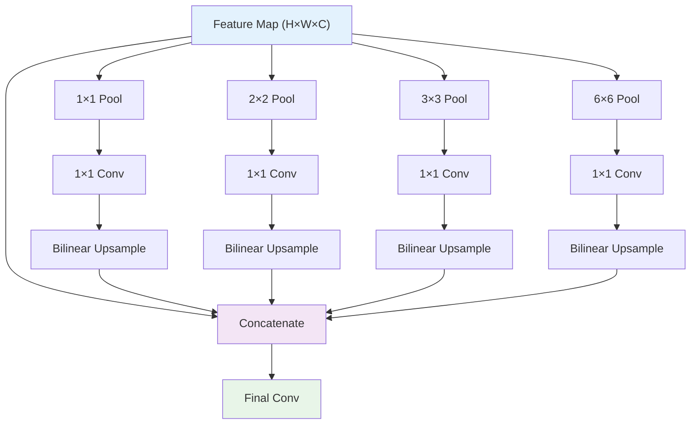
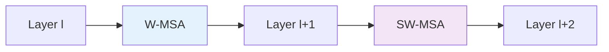
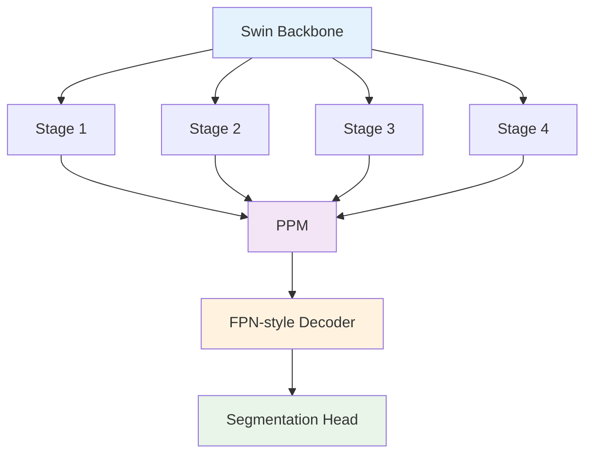

# 10. 현대 아키텍처들

## 목차
1. [PSPNet (Pyramid Scene Parsing Network)](#1-pspnet-pyramid-scene-parsing-network)<br/>
   1. 1.1. [Scene Parsing의 개념](#11-scene-parsing의-개념)<br/>
   1. 1.2. [Pyramid Pooling Module](#12-pyramid-pooling-module)<br/>
   1. 1.3. [Global Context 활용 전략](#13-global-context-활용-전략)<br/>

2. [Vision Transformer 기반 세그멘테이션](#2-vision-transformer-기반-세그멘테이션)<br/>
   2. 2.1. [SETR (Segmentation Transformer)](#21-setr-segmentation-transformer)<br/>
   2. 2.2. [Segmenter와 마스크 어텐션](#22-segmenter와-마스크-어텐션)<br/>
   2. 2.3. [ViT 백본의 특징과 한계](#23-vit-백본의-특징과-한계)<br/>

3. [Swin Transformer와 계층적 구조](#3-swin-transformer와-계층적-구조)<br/>
   3. 3.1. [Shifted Window Attention](#31-shifted-window-attention)<br/>
   3. 3.2. [UperNet과 Swin 결합](#32-upernet과-swin-결합)<br/>
   3. 3.3. [계층적 특징 표현의 장점](#33-계층적-특징-표현의-장점)<br/>

4. [Real-time Segmentation 모델들](#4-real-time-segmentation-모델들)<br/>
   4. 4.1. [BiSeNet과 Bilateral Segmentation](#41-bisenet과-bilateral-segmentation)<br/>
   4. 4.2. [HarDNet과 Harmonic DenseNet](#42-hardnet과-harmonic-densenet)<br/>
   4. 4.3. [효율성 최적화 기법들](#43-효율성-최적화-기법들)<br/>

5. [최신 연구 동향과 미래 방향](#5-최신-연구-동향과-미래-방향)<br/>
   5. 5.1. [Few-shot Segmentation](#51-few-shot-segmentation)<br/>
   5. 5.2. [Domain Adaptation](#52-domain-adaptation)<br/>
   5. 5.3. [Neural Architecture Search](#53-neural-architecture-search)<br/>

---

## 1. PSPNet (Pyramid Scene Parsing Network)

### 1.1. Scene Parsing의 개념

#### 1.1.1. Scene Understanding

**Scene Parsing**: 장면의 전체적 맥락을 이해하여 각 픽셀을 분류하는 작업

**핵심 과제들**:
- **관계 불일치 (Relationship Mismatch)**: 보트가 차도에 있는 것처럼 잘못 분류
- **혼동 범주 (Confusion Categories)**: 비슷한 외형의 객체들 구분 (건물 vs 산)
- **불완전 객체 (Inconspicuous Classes)**: 작거나 얇은 구조물 (기둥, 표지판)

#### 1.1.2. Global Context의 중요성

**지역 정보의 한계**:
$$P_{local}(y_i = c | x_i) \text{ vs } P_{global}(y_i = c | x_i, \text{global context})$$

**예시**:
- 물 위의 물체 → 보트 (배경 맥락 활용)
- 도로 위의 물체 → 자동차 (전체 장면 이해)

#### 1.1.3. 다중 스케일 맥락

**다양한 스케일의 정보**:
- **미세 스케일**: 픽셀 단위 텍스처
- **중간 스케일**: 객체 부분과 패턴  
- **거시 스케일**: 전체 장면과 공간 관계

**수학적 표현**:
$$\text{Context} = \bigcup_{s \in \text{scales}} \text{Information}(s)$$

### 1.2. Pyramid Pooling Module

#### 1.2.1. PPM 구조 설계

**4단계 피라미드 풀링**:


#### 1.2.2. 수학적 정의

각 풀링 레벨 $l$에 대해:

$$P_l = \text{Upsample}(\text{Conv}_{1 \times 1}(\text{AdaptivePool}_l(X)))$$

여기서:
- $\text{AdaptivePool}_l$: $l \times l$ 크기로 적응적 풀링
- $\text{Conv}_{1 \times 1}$: 채널 수를 $C/N$로 감소 (N: 피라미드 레벨 수)
- $\text{Upsample}$: 원본 크기로 업샘플링

**최종 특징**:
$$F_{final} = \text{Conv}([X, P_1, P_2, P_3, P_4])$$

#### 1.2.3. 각 레벨의 역할

**1×1 레벨 (전역)**:
- 전체 이미지 통계
- 장면 유형 정보
- 클래스 사전 분포

**2×2 레벨 (상/하, 좌/우)**:
- 공간적 관계
- 상대적 위치 정보

**3×3, 6×6 레벨**:
- 중간 규모 맥락
- 부분-전체 관계

### 1.3. Global Context 활용 전략

#### 1.3.1. 적응적 풀링의 장점

**고정 크기 출력**: 입력 크기와 무관하게 동일한 표현
$$\text{AdaptivePool}(X \in \mathbb{R}^{H \times W \times C}) \rightarrow Y \in \mathbb{R}^{N \times N \times C}$$

**계산 효율성**: 
전체 특징맵에서 한 번의 연산으로 다중 스케일 정보 추출

#### 1.3.2. Context Prior

**장면별 사전 지식**:
- 실내: 천장, 바닥, 벽의 공간 관계
- 실외: 하늘, 지면, 수평선의 구조
- 도로: 차선, 인도, 건물의 배치

**확률론적 모델링**:
$$P(y_i = c | \text{scene\_type}, \text{position}_i)$$

#### 1.3.3. 성능 향상 분석

**ADE20K 데이터셋**:
- Base ResNet-101: 41.68% mIoU
- + PPM: 43.29% mIoU (+1.61%)
- **특히 큰 객체와 복잡한 장면에서 큰 개선**

**PASCAL VOC 2012**:
- 85.4% mIoU 달성 (당시 SOTA)

## 2. Vision Transformer 기반 세그멘테이션

### 2.1. SETR (Segmentation Transformer)

#### 2.1.1. ViT 기반 인코더

**패치 임베딩**:
$$X \in \mathbb{R}^{H \times W \times 3} \rightarrow X_{patch} \in \mathbb{R}^{N \times D}$$

여기서 $N = HW/P^2$, $P$는 패치 크기이다.

**위치 인코딩 추가**:
$$Z_0 = [x_{patch}^1 E; x_{patch}^2 E; ...; x_{patch}^N E] + E_{pos}$$

#### 2.1.2. 트랜스포머 인코더

**L개 층의 트랜스포머**:
$$Z_l = \text{MSA}(\text{LN}(Z_{l-1})) + Z_{l-1}$$
$$Z_l = \text{MLP}(\text{LN}(Z_l)) + Z_l$$

**글로벌 컨텍스트**: 
첫 번째 층부터 모든 패치 간 상호작용

#### 2.1.3. 디코더 설계

**Naive Decoder**:
간단한 업샘플링과 MLP
$$\text{Output} = \text{MLP}(\text{Reshape}(Z_L))$$

**PUP (Progressive UPsampling)**:
점진적 해상도 증가

**MLA (Multi-Level feature Aggregation)**:
여러 층의 특징 결합

### 2.2. Segmenter와 마스크 어텐션

#### 2.2.1. 마스크 트랜스포머

**클래스별 마스크 토큰**:
$$\text{mask\_tokens} = \{m_1, m_2, ..., m_K\} \in \mathbb{R}^{K \times D}$$

여기서 $K$는 클래스 수이다.

#### 2.2.2. 마스크-패치 어텐션

**Cross-attention**:
$$\text{masks} = \text{Attention}(Q=\text{mask\_tokens}, K=V=\text{patch\_features})$$

**출력 계산**:
$$M_k(i,j) = \text{Linear}(\text{mask}_k)_{patch(i,j)}$$

#### 2.2.3. 선형 디코더

**점별 분류**:
각 패치 위치에서 마스크 토큰들의 선형결합으로 최종 예측

$$P(y_{i,j} = c) = \text{Softmax}(\sum_{k=1}^{K} M_k(i,j) \cdot w_{k,c})$$

### 2.3. ViT 백본의 특징과 한계

#### 2.3.1. 장점

**글로벌 리셉티브 필드**: 
첫 층부터 전체 이미지 정보 접근

**위치 불변성**: 
객체 위치에 관계없이 일관된 표현

**확장성**: 
큰 이미지에서도 메모리 효율적 처리 가능

#### 2.3.2. 한계

**지역적 세부사항 부족**:
패치 단위 처리로 인한 미세한 구조 손실

**경계 부정확성**:
$16 \times 16$ 패치 크기로 인한 거친 경계

**높은 계산 복잡도**:
$$O(N^2)$$ self-attention complexity

#### 2.3.3. 개선 방향

**계층적 구조**: Swin Transformer 스타일
**지역-전역 결합**: CNN과 Transformer 하이브리드
**효율적 어텐션**: Linear attention, sparse attention

## 3. Swin Transformer와 계층적 구조

### 3.1. Shifted Window Attention

#### 3.1.1. Window-based Attention

**윈도우 분할**:
이미지를 $M \times M$ 크기의 겹치지 않는 윈도우로 분할

**윈도우 내 어텐션**:
$$\text{Attention} = \text{softmax}(\frac{QK^T}{\sqrt{d}} + B)V$$

여기서 $B$는 상대적 위치 편향이다.

#### 3.1.2. Shifted Window Mechanism

**문제**: 윈도우 간 정보 교환 부족

**해결책**: 윈도우를 $(\frac{M}{2}, \frac{M}{2})$만큼 이동



#### 3.1.3. 계산 복잡도 개선

**표준 self-attention**: $O(H^2W^2)$
**Window attention**: $O(HW \cdot M^2)$

일반적으로 $M = 7$을 사용하여 **49배 효율성** 향상

### 3.2. UperNet과 Swin 결합

#### 3.2.1. UperNet 구조

**다중 스케일 특징 융합**:


#### 3.2.2. Pyramid Pooling + FPN

**PPM 적용**:
최고 레벨 특징에 pyramid pooling 적용

**FPN 디코딩**:
$$P_i = \text{Upsample}(P_{i+1}) + \text{Conv}(C_i)$$

#### 3.2.3. 성능 결과

**ADE20K mIoU**:
- Swin-T + UperNet: 44.85%
- Swin-S + UperNet: 47.64%
- Swin-B + UperNet: 48.13%

### 3.3. 계층적 특징 표현의 장점

#### 3.3.1. 다중 해상도 처리

**Stage별 해상도**:
- Stage 1: $H/4 \times W/4$
- Stage 2: $H/8 \times W/8$  
- Stage 3: $H/16 \times W/16$
- Stage 4: $H/32 \times W/32$

각 stage에서 서로 다른 크기의 객체에 최적화

#### 3.3.2. 계산 효율성

**파라미터 공유**: 
동일한 어텐션 메커니즘을 모든 윈도우에 적용

**메모리 효율성**:
윈도우 단위 처리로 메모리 사용량 제한

#### 3.3.3. CNN vs Swin Transformer

| 특성 | CNN | Swin Transformer |
|------|-----|------------------|
| **Receptive Field** | 점진적 확장 | 즉시 윈도우 크기 |
| **귀납적 편향** | 지역성, 변환 불변성 | 적음 |
| **장거리 의존성** | 깊은 층에서만 | 모든 층에서 |
| **계산 복잡도** | $O(HW)$ | $O(HW)$ (윈도우 기반) |

## 4. Real-time Segmentation 모델들

### 4.1. BiSeNet과 Bilateral Segmentation

#### 4.1.1. 이중 경로 설계

**문제 분석**: 
정확도와 속도의 딜레마
- 깊은 네트워크: 정확하지만 느림
- 얕은 네트워크: 빠르지만 부정확

**해결책**: 역할 분담
- **Spatial Path**: 고해상도 공간 정보
- **Context Path**: 의미적 맥락 정보

#### 4.1.2. Spatial Path

**설계 원칙**:
- 빠른 다운샘플링 최소화
- 공간 정보 보존 우선

**구조**:
```
Conv(7×7, stride=2) → Conv(3×3, stride=2) → Conv(3×3, stride=2)
```
최종 출력: 1/8 해상도

#### 4.1.3. Context Path

**Lightweight 백본 사용**:
- Xception39
- MobileNet
- ResNet18

**Global Average Pooling**:
전역 맥락 정보 추출

**Feature Fusion**:
$$F_{fused} = \text{ARM}(F_{context}) \oplus \text{FFM}(F_{spatial}, F_{context})$$

### 4.2. HarDNet과 Harmonic DenseNet

#### 4.2.1. 메모리 효율적 DenseNet

**기존 DenseNet의 문제**:
$$\text{Memory} \propto k \times (k+1) / 2$$

여기서 $k$는 growth rate이다.

**HarDNet 해결책**:
조화급수 기반 연결 패턴
$$\text{Connection}(l) = \{l-1, l-2, l-4, l-8, ...\}$$

#### 4.2.2. Concatenation Traffic 최소화

**CIO (Concatenation Input/Output)**:
$$\text{CIO} = \sum_{l=1}^{L} \text{input\_channels}_l$$

**HarDNet 최적화**:
불필요한 연결 제거로 CIO 최소화

#### 4.2.3. Real-time 성능

**Cityscapes 결과** (GTX 1080Ti):
- BiSeNet (ResNet18): 65.6% mIoU, 105.8 FPS
- HarDNet-70: 75.9% mIoU, 84.2 FPS

### 4.3. 효율성 최적화 기법들

#### 4.3.1. Knowledge Distillation

**Teacher-Student 학습**:
$$\mathcal{L} = \alpha \mathcal{L}_{CE}(y, \hat{y}) + (1-\alpha) \mathcal{L}_{KD}(f_t, f_s)$$

여기서:
- $f_t$: Teacher 모델 출력
- $f_s$: Student 모델 출력
- $\mathcal{L}_{KD}$: KL divergence

#### 4.3.2. Pruning과 Quantization

**구조적 가지치기**:
중요도가 낮은 채널 제거
$$\text{Importance}(c) = \frac{1}{HW} \sum_{i,j} |W_c \cdot X_{i,j}|$$

**INT8 양자화**:
$$x_{quantized} = \text{round}\left(\frac{x - x_{min}}{scale}\right)$$

#### 4.3.3. 아키텍처 최적화

**Depthwise Separable Convolution**:
$$\text{Speedup} = \frac{D_K^2 \cdot M \cdot N + M \cdot N}{D_K^2 \cdot M + M \cdot N} \approx \frac{1}{D_K^2} + \frac{1}{N}$$

**Group Convolution**:
파라미터와 계산량을 $1/g$로 감소

## 5. 최신 연구 동향과 미래 방향

### 5.1. Few-shot Segmentation

#### 5.1.1. 문제 정의

**K-shot N-way**: 
$N$개 클래스에 대해 각각 $K$개 샘플만으로 세그멘테이션

**Support Set**: $S = \{(x_i, y_i)\}_{i=1}^{N \times K}$
**Query Set**: $Q = \{x_j\}_{j=1}^{M}$ (라벨 없음)

#### 5.1.2. 메타러닝 접근법

**Prototypical Networks**:
$$\text{prototype}_c = \frac{1}{|S_c|} \sum_{(x_i,y_i) \in S_c} f(x_i)$$

**거리 기반 분류**:
$$P(y=c|x) = \frac{\exp(-d(f(x), \text{prototype}_c))}{\sum_{c'} \exp(-d(f(x), \text{prototype}_{c'}))}$$

#### 5.1.3. Attention-based 방법

**Cross-attention**:
Query 특징과 Support 특징 간의 유사도 계산

$$\alpha_{i,j} = \frac{\exp(f_q(x_i) \cdot f_s(x_j))}{\sum_k \exp(f_q(x_i) \cdot f_s(x_k))}$$

### 5.2. Domain Adaptation

#### 5.2.1. 도메인 불일치 문제

**Source Domain**: 풍부한 라벨 데이터 (예: 합성 데이터)
**Target Domain**: 라벨 없는 실제 데이터

**분포 차이**:
$$P_{source}(X, Y) \neq P_{target}(X, Y)$$

#### 5.2.2. Adversarial Training

**도메인 판별기**:
특징이 어느 도메인에서 왔는지 판별

**적대적 학습**:
$$\min_G \max_D \mathcal{L}_{adv}(G, D) = \mathbb{E}_{x \sim p_{source}}[\log D(G(x))] + \mathbb{E}_{x \sim p_{target}}[\log(1-D(G(x)))]$$

#### 5.2.3. Self-supervised Learning

**Pseudo Labeling**:
1. 타겟 도메인에서 신뢰도 높은 예측 선별
2. Pseudo label로 사용하여 재학습
3. 반복적으로 성능 개선

### 5.3. Neural Architecture Search

#### 5.3.1. 자동 아키텍처 탐색

**탐색 공간 정의**:
- 레이어 유형 (Conv, DWConv, Attention)
- 채널 수, 커널 크기
- Skip connection 패턴

**성능 메트릭**:
$$\text{Score} = \alpha \cdot \text{Accuracy} - \beta \cdot \text{Latency} - \gamma \cdot \text{Parameters}$$

#### 5.3.2. Differentiable NAS

**DARTS (Differentiable Architecture Search)**:
연속적 완화를 통한 그래디언트 기반 최적화

$$o^{(i,j)} = \sum_{op \in O} \frac{\exp(\alpha_{op}^{(i,j)})}{\sum_{op' \in O} \exp(\alpha_{op'}^{(i,j)})} \cdot op(x)$$

#### 5.3.3. 효율성 중심 NAS

**MnasNet**: 모바일 디바이스 최적화
**EfficientNet**: Compound scaling 자동화
**Once-for-All**: 한 번 학습으로 다양한 설정 지원

---

## 현대 아키텍처의 통합적 이해

### 공통 설계 원칙

**다중 스케일 처리**: 
모든 현대 아키텍처가 채택하는 핵심 원칙

**효율성 고려**: 
실용성을 위한 계산 효율성과 메모리 최적화

**전역-지역 균형**: 
전역 맥락과 지역 세부사항의 적절한 조합

### 기술적 융합 트렌드

**CNN + Transformer**: 
각각의 장점을 결합한 하이브리드 모델들

**Knowledge Transfer**: 
사전 학습과 전이 학습의 중요성 증대

**Multi-task Learning**: 
여러 태스크의 동시 최적화로 성능 향상

### 미래 전망

**효율성의 지속적 중요성**: 
엣지 디바이스와 실시간 응용의 확산

**자동화된 설계**: 
NAS와 AutoML의 발전으로 수작업 설계 감소

**멀티모달 융합**: 
시각, 언어, 센서 데이터의 통합 처리

---

## 용어 목록

- **Adaptive Pooling**: 어댑티브 풀링 - 적응적 풀링
- **Adversarial Training**: 어드버새리얼 트레이닝 - 적대적 학습
- **Bilateral Segmentation**: 바이래터럴 세그멘테이션 - 양방향 분할
- **BiSeNet**: 바이즈넷 - 양방향 분할 네트워크
- **Compound Scaling**: 컴파운드 스케일링 - 복합 스케일링
- **Concatenation Input/Output (CIO)**: 컨캐터네이션 인풋/아웃풋 - 연결 입출력
- **Context Path**: 컨텍스트 패스 - 맥락 경로
- **DARTS**: 다츠 - 미분 가능한 아키텍처 탐색
- **Differentiable Architecture Search**: 디퍼렌셔블 아키텍처 서치 - 미분 가능한 아키텍처 탐색
- **Domain Adaptation**: 도메인 어댑테이션 - 도메인 적응
- **Domain Discriminator**: 도메인 디스크리미네이터 - 도메인 판별기
- **Few-shot Segmentation**: 퓨샷 세그멘테이션 - 소수 샘플 분할
- **Global Average Pooling**: 글로벌 애버리지 풀링 - 전역 평균 풀링
- **HarDNet**: 하드넷 - 조화 조밀 네트워크
- **Harmonic DenseNet**: 하모닉 덴스넷 - 조화 조밀 네트워크
- **Knowledge Distillation**: 놀리지 디스틸레이션 - 지식 증류
- **Mask Attention**: 마스크 어텐션 - 마스크 어텐션
- **Meta-learning**: 메타러닝 - 메타학습
- **Multi-Level feature Aggregation (MLA)**: 멀티레벨 피처 어그리게이션 - 다중 층 특징 집계
- **Neural Architecture Search (NAS)**: 뉴럴 아키텍처 서치 - 신경망 구조 탐색
- **Progressive UPsampling (PUP)**: 프로그레시브 업샘플링 - 점진적 업샘플링
- **Prototypical Networks**: 프로토타이피컬 네트워크스 - 원형 네트워크
- **Pseudo Labeling**: 슈도 레이블링 - 의사 라벨링
- **PSPNet**: 피에스피넷 - 피라미드 장면 파싱 네트워크
- **Pyramid Pooling Module (PPM)**: 피라미드 풀링 모듈 - 피라미드 풀링 모듈
- **Pyramid Scene Parsing**: 피라미드 씬 파싱 - 피라미드 장면 파싱
- **Quantization**: 퀀타이제이션 - 양자화
- **Real-time Segmentation**: 리얼타임 세그멘테이션 - 실시간 분할
- **Relative Position Bias**: 릴레이티브 포지션 바이어스 - 상대적 위치 편향
- **Scene Parsing**: 씬 파싱 - 장면 파싱
- **Scene Understanding**: 씬 언더스탠딩 - 장면 이해
- **Segmenter**: 세그멘터 - 분할기
- **Self-supervised Learning**: 셀프 수퍼바이즈드 러닝 - 자기 지도 학습
- **SETR**: 세트알 - 분할 트랜스포머
- **Shifted Window Attention**: 시프티드 윈도우 어텐션 - 이동 윈도우 어텐션
- **Spatial Path**: 스페이셜 패스 - 공간 경로
- **Support Set**: 서포트 셋 - 지원 집합
- **Swin Transformer**: 스윈 트랜스포머 - 이동 윈도우 트랜스포머
- **UperNet**: 유퍼넷 - 통합 퍼셉트론 네트워크
- **Vision Transformer (ViT)**: 비전 트랜스포머 - 시각 트랜스포머
- **Window-based Attention**: 윈도우 베이스드 어텐션 - 윈도우 기반 어텐션