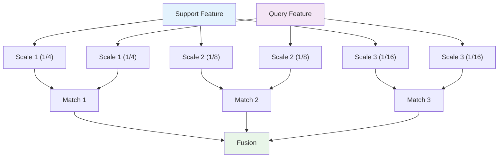

# 13. 고급 주제와 최신 연구

## 목차
1. [Few-shot Segmentation](#1-few-shot-segmentation)<br/>
   1. 1.1. [메타러닝과 프로토타입 기반 방법](#11-메타러닝과-프로토타입-기반-방법)<br/>
   1. 1.2. [Support-Query 매칭 메커니즘](#12-support-query-매칭-메커니즘)<br/>
   1. 1.3. [Cross-attention과 Feature Alignment](#13-cross-attention과-feature-alignment)<br/>

2. [Weakly Supervised Segmentation](#2-weakly-supervised-segmentation)<br/>
   2. 2.1. [이미지 레벨 라벨에서 픽셀 라벨 생성](#21-이미지-레벨-라벨에서-픽셀-라벨-생성)<br/>
   2. 2.2. [Class Activation Maps 개선](#22-class-activation-maps-개선)<br/>
   2. 2.3. [자가 지도와 의사 라벨링](#23-자가-지도와-의사-라벨링)<br/>

3. [Domain Adaptation 심화](#3-domain-adaptation-심화)<br/>
   3. 3.1. [시각적 도메인 적응 이론](#31-시각적-도메인-적응-이론)<br/>
   3. 3.2. [Feature Alignment 기법들](#32-feature-alignment-기법들)<br/>
   3. 3.3. [Multi-source Domain Adaptation](#33-multi-source-domain-adaptation)<br/>

4. [Real-time Segmentation 최적화](#4-real-time-segmentation-최적화)<br/>
   4. 4.1. [모델 압축과 지식 증류](#41-모델-압축과-지식-증류)<br/>
   4. 4.2. [하드웨어 친화적 설계](#42-하드웨어-친화적-설계)<br/>
   4. 4.3. [동적 추론과 Adaptive Computation](#43-동적-추론과-adaptive-computation)<br/>

5. [멀티모달과 3D Segmentation](#5-멀티모달과-3d-segmentation)<br/>
   5. 5.1. [RGB-D 융합 방법론](#51-rgb-d-융합-방법론)<br/>
   5. 5.2. [포인트 클라우드 세그멘테이션](#52-포인트-클라우드-세그멘테이션)<br/>
   5. 5.3. [시공간 세그멘테이션](#53-시공간-세그멘테이션)<br/>

---

## 1. Few-shot Segmentation

### 1.1. 메타러닝과 프로토타입 기반 방법

#### 1.1.1. Few-shot Learning 문제 정의

**K-shot N-way 세그멘테이션**:
- **Support Set**: $\mathcal{S} = \{(I_i^s, M_i^s)\}_{i=1}^{K \times N}$ (K개 샘플 × N개 클래스)
- **Query Set**: $\mathcal{Q} = \{I_j^q\}_{j=1}^{M}$ (마스크 없는 질의 이미지)
- **목표**: Support set을 이용해 Query set의 마스크 생성

#### 1.1.2. 프로토타입 네트워크

**클래스별 프로토타입 생성**:
$$\mathbf{p}_c = \frac{1}{|\mathcal{S}_c|} \sum_{(I,M) \in \mathcal{S}_c} \frac{\sum_{i,j} M_{i,j}^c \cdot f(I)_{i,j}}{\sum_{i,j} M_{i,j}^c}$$

여기서:
- $\mathcal{S}_c$: 클래스 $c$의 support 샘플들
- $f(\cdot)$: 특징 추출 함수
- $M_{i,j}^c$: 클래스 $c$의 마스크

#### 1.1.3. 거리 기반 분류

**코사인 유사도 기반**:
$$P(y_{i,j} = c | I^q) = \frac{\exp(\text{cos}(f(I^q)_{i,j}, \mathbf{p}_c) / \tau)}{\sum_{k=1}^{N} \exp(\text{cos}(f(I^q)_{i,j}, \mathbf{p}_k) / \tau)}$$

**유클리드 거리 기반**:
$$P(y_{i,j} = c | I^q) = \frac{\exp(-||\mathbf{f}_{i,j}^q - \mathbf{p}_c||^2 / \tau)}{\sum_{k=1}^{N} \exp(-||\mathbf{f}_{i,j}^q - \mathbf{p}_k||^2 / \tau)}$$

#### 1.1.4. 에피소드 기반 학습

**훈련 에피소드 구성**:
1. 훈련 클래스에서 $N$개 클래스 무작위 선택
2. 각 클래스에서 $K+1$개 이미지 샘플링
3. $K$개는 support, 1개는 query로 사용
4. 메타 손실로 모델 업데이트

**메타 손실**:
$$\mathcal{L}_{meta} = \mathbb{E}_{\text{episode}} \left[\sum_{(I^q, M^q) \in \mathcal{Q}} \mathcal{L}(M^q, \text{predict}(I^q, \mathcal{S}))\right]$$

### 1.2. Support-Query 매칭 메커니즘

#### 1.2.1. Dense Comparison

**픽셀 단위 매칭**:
모든 query 픽셀과 모든 support 픽셀 간의 유사도 계산

$$\text{sim}(q_{i,j}, s_{p,q}) = \frac{\mathbf{f}_q(i,j) \cdot \mathbf{f}_s(p,q)}{||\mathbf{f}_q(i,j)|| \cdot ||\mathbf{f}_s(p,q)||}$$

#### 1.2.2. Masked Average Pooling

**마스크 가중 평균**:
$$\mathbf{g}_c = \frac{\sum_{i,j} M_{i,j}^c \cdot \mathbf{f}_s(i,j)}{\sum_{i,j} M_{i,j}^c}$$

배경 정보를 제외하고 객체 영역만의 특징 추출

#### 1.2.3. Multi-scale Matching

**피라미드 매칭**:


### 1.3. Cross-attention과 Feature Alignment

#### 1.3.1. Self-attention for Support

**Support 내 관계 모델링**:
$$\mathbf{S}' = \text{SelfAttn}(\mathbf{S}) = \text{softmax}(\frac{\mathbf{S}\mathbf{W}_q (\mathbf{S}\mathbf{W}_k)^T}{\sqrt{d}}) \mathbf{S}\mathbf{W}_v$$

#### 1.3.2. Cross-attention for Query-Support

**Query를 지도로 Support 정보 검색**:
$$\mathbf{Q}' = \text{CrossAttn}(\mathbf{Q}, \mathbf{S}) = \text{softmax}(\frac{\mathbf{Q}\mathbf{W}_q (\mathbf{S}\mathbf{W}_k)^T}{\sqrt{d}}) \mathbf{S}\mathbf{W}_v$$

#### 1.3.3. Feature Alignment

**도메인 불일치 문제**:
Support와 Query 이미지 간의 시각적 차이

**정렬 모듈**:
$$\mathbf{f}_{aligned} = \mathbf{f} + \text{MLP}(\text{AdaIN}(\mathbf{f}, \text{style}(\mathbf{S})))$$

여기서 AdaIN은 Adaptive Instance Normalization이다.

## 2. Weakly Supervised Segmentation

### 2.1. 이미지 레벨 라벨에서 픽셀 라벨 생성

#### 2.1.1. 문제 설정

**주어진 정보**: 이미지에 존재하는 클래스 목록만 알려짐
$$\mathcal{L}_{image} = \{c_1, c_2, ..., c_k\} \subset \{1, 2, ..., C\}$$

**목표**: 픽셀 단위 세그멘테이션 마스크 생성

#### 2.1.2. Classification to Segmentation

**Global Average Pooling 제약**:
$$p_c = \text{GAP}(f_c) = \frac{1}{HW} \sum_{i,j} f_c(i,j)$$

클래스 $c$가 이미지에 존재하면 $p_c > 0$이어야 함

**Multi-label 분류 손실**:
$$\mathcal{L}_{cls} = \sum_{c=1}^{C} y_c \log \sigma(p_c) + (1-y_c) \log(1-\sigma(p_c))$$

#### 2.1.3. Peak Response Maps

**지역 최대값 기반 지역화**:
$$\text{PRM}_c(i,j) = \begin{cases}
f_c(i,j) & \text{if } f_c(i,j) = \max_{(p,q) \in N_{i,j}} f_c(p,q) \\
0 & \text{otherwise}
\end{cases}$$

여기서 $N_{i,j}$는 $(i,j)$ 주변 이웃 영역이다.

### 2.2. Class Activation Maps 개선

#### 2.2.1. Grad-CAM++

**개선된 그래디언트 가중치**:
$$\alpha_k^c = \frac{\sum_i \sum_j \alpha_{i,j,k}^c}{\sum_i \sum_j \alpha_{i,j,k}^c}$$

여기서:
$$\alpha_{i,j,k}^c = \frac{1}{2 + 2\sum_a \sum_b A_{a,b}^k \frac{\partial Y^c}{\partial A_{a,b}^k}}$$

#### 2.2.2. Score-CAM

**그래디언트 없는 CAM**:
$$\text{Score-CAM}_c = \sum_k \alpha_k^c A_k$$

$$\alpha_k^c = \text{softmax}(f_c(\text{CW}(X, A_k)) - f_c(X_b))$$

여기서:
- $\text{CW}(\cdot, \cdot)$: Channel-wise multiplication
- $X_b$: 기준 이미지 (예: 모든 픽셀이 0)

#### 2.2.3. Eigen-CAM

**주성분 분석 기반**:
$$A = [A_1, A_2, ..., A_K] \in \mathbb{R}^{HW \times K}$$

$$\text{Eigen-CAM} = \text{reshape}(\text{first PC}(A))$$

가장 중요한 주성분을 시각화에 사용

### 2.3. 자가 지도와 의사 라벨링

#### 2.3.1. Self-supervised Pre-training

**색상화 (Colorization)**:
$$\mathcal{L}_{color} = \sum_{i,j} CE(c_{i,j}^{true}, \text{predict}(I_{gray}, i, j))$$

**회전 예측**:
$$\mathcal{L}_{rotation} = CE(\text{rotation\_angle}, \text{predict}(\text{rotate}(I)))$$

#### 2.3.2. Confidence-based Pseudo Labeling

**신뢰도 임계값**:
$$\tilde{y}_{i,j} = \begin{cases}
\arg\max_c p_{i,j}^c & \text{if } \max_c p_{i,j}^c > \tau \\
\text{ignore} & \text{otherwise}
\end{cases}$$

**적응적 임계값**:
$$\tau_c = \text{percentile}(\{p_{i,j}^c : (i,j) \in \text{predicted as } c\}, \alpha)$$

#### 2.3.3. Consistency Regularization

**서로 다른 augmentation에 대한 일관성**:
$$\mathcal{L}_{consistency} = \sum_{i,j} ||\text{softmax}(f(T_1(I))_{i,j}) - \text{softmax}(f(T_2(I))_{i,j})||^2$$

여기서 $T_1, T_2$는 서로 다른 변환 함수이다.

## 3. Domain Adaptation 심화

### 3.1. 시각적 도메인 적응 이론

#### 3.1.1. Domain Shift 분석

**분포 차이의 종류**:
- **Covariate Shift**: $P_S(X) \neq P_T(X)$, but $P_S(Y|X) = P_T(Y|X)$
- **Concept Shift**: $P_S(X) = P_T(X)$, but $P_S(Y|X) \neq P_T(Y|X)$
- **Joint Shift**: 둘 다 다름

#### 3.1.2. Theoretical Bounds

**Target Risk의 상한**:
$$R_T(h) \leq R_S(h) + \frac{1}{2}d_{\mathcal{H}\Delta\mathcal{H}}(D_S, D_T) + \lambda^*$$

여기서:
- $R_T(h)$: Target domain risk
- $R_S(h)$: Source domain risk  
- $d_{\mathcal{H}\Delta\mathcal{H}}$: Hypothesis space distance
- $\lambda^*$: Combined error of ideal hypothesis

#### 3.1.3. Adaptation 전략

**Feature-level Adaptation**:
중간 표현 공간에서 도메인 차이 최소화

**Pixel-level Adaptation**:
입력 이미지 수준에서 변환 적용

**Output-level Adaptation**:
예측 결과의 분포 정렬

### 3.2. Feature Alignment 기법들

#### 3.2.1. Adversarial Feature Alignment

**판별기 기반 특징 정렬**:
$\min_G \max_D \mathcal{L}_{adv} = \mathbb{E}_{x^s}[\log D(G(x^s))] + \mathbb{E}_{x^t}[\log(1-D(G(x^t)))]$

**다층 적대 학습**:
서로 다른 해상도에서 판별기 적용
$\mathcal{L}_{multi} = \sum_{l=1}^{L} \lambda_l \mathcal{L}_{adv}^{(l)}$

#### 3.2.2. Maximum Mean Discrepancy (MMD)

**특징 분포 간 거리 최소화**:
$\text{MMD}^2(\mathcal{F}_S, \mathcal{F}_T) = ||\mu_S - \mu_T||_{\mathcal{H}}^2$

**커널 기반 MMD**:
$\text{MMD}_k^2 = \frac{1}{n_S^2}\sum_{i,j} k(x_i^S, x_j^S) + \frac{1}{n_T^2}\sum_{i,j} k(x_i^T, x_j^T) - \frac{2}{n_S n_T}\sum_{i,j} k(x_i^S, x_j^T)$

#### 3.2.3. Correlation Alignment (CORAL)

**2차 통계량 정렬**:
$\mathcal{L}_{CORAL} = \frac{1}{4d^2}||\mathbf{C}_S - \mathbf{C}_T||_F^2$

여기서:
$\mathbf{C}_S = \frac{1}{n_S-1}(\mathbf{F}_S^T\mathbf{F}_S - \frac{1}{n_S}(\mathbf{1}^T\mathbf{F}_S)^T(\mathbf{1}^T\mathbf{F}_S))$

### 3.3. Multi-source Domain Adaptation

#### 3.3.1. Source Selection

**도메인 유사도 측정**:
$\text{sim}(D_i, D_T) = \exp(-\text{MMD}^2(D_i, D_T))$

**가중 결합**:
$\mathcal{L}_{total} = \sum_{i=1}^{M} w_i \mathcal{L}_{seg}(D_i)$

여기서 $w_i = \frac{\text{sim}(D_i, D_T)}{\sum_j \text{sim}(D_j, D_T)}$

#### 3.3.2. Domain-specific Batch Normalization

**각 도메인별 BN 파라미터**:
$\text{BN}_i(x) = \gamma_i \frac{x - \mu_i}{\sqrt{\sigma_i^2 + \epsilon}} + \beta_i$

**테스트 시 가중 평균**:
$\hat{y} = \sum_{i=1}^{M} w_i f_i(x)$

#### 3.3.3. Ensemble Learning

**모델별 신뢰도 가중**:
$P_{ensemble}(c|x) = \frac{\sum_{i=1}^{M} \alpha_i P_i(c|x)}{\sum_{i=1}^{M} \alpha_i}$

**동적 가중치**:
$\alpha_i = \text{entropy}^{-1}(P_i(\cdot|x))$

## 4. Real-time Segmentation 최적화

### 4.1. 모델 압축과 지식 증류

#### 4.1.1. Knowledge Distillation

**Teacher-Student 학습**:
$\mathcal{L}_{KD} = \alpha \mathcal{L}_{CE}(y, \hat{y}_S) + (1-\alpha) \mathcal{L}_{KL}(\hat{y}_T, \hat{y}_S)$

여기서:
- $\hat{y}_T$: Teacher 모델 출력
- $\hat{y}_S$: Student 모델 출력

**Feature-level Distillation**:
$\mathcal{L}_{feature} = ||f_T - f_S||_2^2$

중간 특징맵에서도 지식 전달

#### 4.1.2. Structured Pruning

**채널별 중요도**:
$\text{Importance}(c) = \frac{1}{N} \sum_{n=1}^{N} ||W_c^{(n)}||_2$

**레이어별 프루닝 비율**:
$r_l = r_{global} \cdot \frac{\text{redundancy}_l}{\text{average redundancy}}$

#### 4.1.3. Quantization

**Post-training Quantization**:
$x_q = \text{round}\left(\frac{x - x_{min}}{scale}\right)$

$scale = \frac{x_{max} - x_{min}}{2^{bits} - 1}$

**Quantization-aware Training**:
$x_{fake\_quant} = scale \cdot \text{round}\left(\frac{x}{scale}\right)$

### 4.2. 하드웨어 친화적 설계

#### 4.2.1. Mobile-friendly Operations

**Depthwise Separable Convolution 최적화**:
- GPU에서 병렬화 효율성
- 메모리 대역폭 최소화
- 캐시 친화적 접근 패턴

#### 4.2.2. Grouped Convolution

**메모리 접근 패턴 최적화**:
```python
# 효율적인 grouped convolution
def efficient_grouped_conv(x, groups):
    batch, channels, height, width = x.shape
    channels_per_group = channels // groups
    
    # Reshape for efficient computation
    x = x.view(batch, groups, channels_per_group, height, width)
    return grouped_operation(x)
```

#### 4.2.3. Early Exit Strategies

**계층적 예측**:
$P_{early}(x) = \begin{cases}
f_{shallow}(x) & \text{if confidence} > \tau_{high} \\
f_{deep}(x) & \text{otherwise}
\end{cases}$

### 4.3. 동적 추론과 Adaptive Computation

#### 4.3.1. Input-dependent Computation

**이미지 복잡도 추정**:
$\text{complexity}(I) = \sum_{i,j} ||\nabla I_{i,j}||_2$

**적응적 해상도**:
복잡한 이미지는 고해상도, 단순한 이미지는 저해상도 처리

#### 4.3.2. Dynamic Channel Selection

**채널 중요도 예측**:
$\text{channel\_mask} = \sigma(\text{MLP}(\text{GAP}(\text{feature})))$

**Gating 메커니즘**:
$\text{output} = \text{channel\_mask} \odot \text{feature}$

#### 4.3.3. Progressive Inference

**점진적 정제**:
1. 저해상도 초기 예측
2. 불확실한 영역 탐지
3. 해당 영역만 고해상도 처리

## 5. 멀티모달과 3D Segmentation

### 5.1. RGB-D 융합 방법론

#### 5.1.1. Early Fusion

**입력 레벨 결합**:
$I_{RGBD} = \text{Concat}(I_{RGB}, I_{Depth})$

**4채널 컨볼루션**:
첫 번째 층을 4채널 입력에 맞게 수정

#### 5.1.2. Late Fusion

**독립적 처리 후 결합**:
$F_{RGB} = \text{Encoder}_{RGB}(I_{RGB})$
$F_{Depth} = \text{Encoder}_{Depth}(I_{Depth})$
$F_{fused} = \text{Fusion}(F_{RGB}, F_{Depth})$

#### 5.1.3. Cross-modal Attention

**RGB → Depth Attention**:
$A_{R \rightarrow D} = \text{softmax}(\frac{Q_{RGB} K_{Depth}^T}{\sqrt{d}})$
$F_{enhanced} = A_{R \rightarrow D} V_{Depth}$

**양방향 Attention**:
$F_{final} = F_{RGB} + \text{CrossAttn}(F_{RGB}, F_{Depth}) + \text{CrossAttn}(F_{Depth}, F_{RGB})$

### 5.2. 포인트 클라우드 세그멘테이션

#### 5.2.1. PointNet 기반 방법

**순열 불변 함수**:
$f(\{x_1, x_2, ..., x_n\}) = \gamma(\text{MAX}_{i=1}^n \{\phi(x_i)\})$

**대칭 함수의 활용**:
- MAX pooling
- SUM pooling  
- Average pooling

#### 5.2.2. Graph-based Methods

**k-NN 그래프 구성**:
$\mathcal{G} = (\mathcal{V}, \mathcal{E})$

여기서 $\mathcal{E} = \{(i,j) : j \in \text{kNN}(i)\}$

**Graph Convolution**:
$x_i' = \text{MLP}(x_i || \text{AGG}(\{x_j : j \in \mathcal{N}(i)\}))$

#### 5.2.3. Voxel-based Approaches

**3D 복셀 그리드**:
$V \in \mathbb{R}^{D \times H \times W \times C}$

**Sparse Convolution**:
빈 복셀을 건너뛰는 효율적 컨볼루션

### 5.3. 시공간 세그멘테이션

#### 5.3.1. 3D CNN 확장

**시공간 컨볼루션**:
$Y_{t,x,y} = \sum_{\tau,i,j} X_{t+\tau,x+i,y+j} \cdot W_{\tau,i,j}$

**시간 차원 처리**:
- (2+1)D: 공간과 시간 분리
- 3D: 통합 처리

#### 5.3.2. 메모리 기반 방법

**Long-term Memory**:
$M_t = \text{Update}(M_{t-1}, F_t, \text{mask}_t)$

**Attention-based Retrieval**:
$\text{retrieved} = \text{Attention}(Q_t, \{K_i, V_i\}_{i=1}^{t-1})$

#### 5.3.3. Optical Flow 활용

**Flow-guided Feature Warping**:
$F_t^{warped} = \text{Warp}(F_{t-1}, \text{Flow}_{t-1 \rightarrow t})$

**Temporal Consistency Loss**:
$\mathcal{L}_{temporal} = ||F_t - F_t^{warped}||_2^2$

---

## 최신 연구 동향 정리

### Transformer의 영향

**Vision Transformer의 세그멘테이션 적용**:
- 글로벌 컨텍스트 모델링
- Self-attention의 장거리 의존성
- 패치 기반 처리의 효율성

### 자가 지도 학습의 발전

**Contrastive Learning**:
- 라벨 없는 대량 데이터 활용
- 더 나은 특징 표현 학습
- 전이 학습 성능 향상

### 효율성과 실용성

**Edge Computing 지원**:
- 모바일/임베디드 환경 최적화
- 실시간 추론 요구사항
- 에너지 효율성 고려

### 멀티모달 융합

**다양한 센서 정보 통합**:
- RGB + Depth + LiDAR
- 상호 보완적 정보 활용
- 로버스트한 인식 성능

---

## 용어 목록

- **Adaptive Computation**: 어댑티브 컴퓨테이션 - 적응적 계산
- **Adaptive Instance Normalization (AdaIN)**: 어댑티브 인스턴스 노멀라이제이션 - 적응적 인스턴스 정규화
- **Class Activation Maps (CAM)**: 클래스 액티베이션 맵스 - 클래스 활성화 맵
- **Colorization**: 컬러라이제이션 - 색상화
- **Concept Shift**: 컨셉트 시프트 - 개념 이동
- **Consistency Regularization**: 컨시스턴시 레귤라라이제이션 - 일관성 정규화
- **Correlation Alignment (CORAL)**: 코릴레이션 얼라인먼트 - 상관관계 정렬
- **Covariate Shift**: 코베리어트 시프트 - 공변량 이동
- **Cross-attention**: 크로스 어텐션 - 교차 어텐션
- **Cross-modal Attention**: 크로스 모달 어텐션 - 교차 양식 어텐션
- **Dense Comparison**: 덴스 컴패리즌 - 밀집 비교
- **Depthwise Separable Convolution**: 뎁스와이즈 세퍼러블 컨볼루션 - 채널별 분리 컨볼루션
- **Domain Adaptation**: 도메인 어댑테이션 - 도메인 적응
- **Domain Shift**: 도메인 시프트 - 도메인 이동
- **Early Exit**: 얼리 엑싯 - 조기 탈출
- **Early Fusion**: 얼리 퓨전 - 조기 융합
- **Eigen-CAM**: 아이겐 캠 - 고유벡터 클래스 활성화 맵
- **Episodic Training**: 에피소딕 트레이닝 - 에피소드 기반 훈련
- **Feature Alignment**: 피처 얼라인먼트 - 특징 정렬
- **Few-shot Learning**: 퓨샷 러닝 - 소수 샘플 학습
- **Gating Mechanism**: 게이팅 메커니즘 - 게이트 메커니즘
- **Global Average Pooling (GAP)**: 글로벌 애버리지 풀링 - 전역 평균 풀링
- **Grad-CAM++**: 그래드 캠 플러스플러스 - 개선된 그래디언트 클래스 활성화 맵
- **Graph Convolution**: 그래프 컨볼루션 - 그래프 컨볼루션
- **Grouped Convolution**: 그룹드 컨볼루션 - 그룹 컨볼루션
- **K-shot N-way**: 케이샷 엔웨이 - K개 샘플 N개 클래스
- **Knowledge Distillation**: 놀리지 디스틸레이션 - 지식 증류
- **Late Fusion**: 레이트 퓨전 - 후기 융합
- **Long-term Memory**: 롱텀 메모리 - 장기 기억
- **Masked Average Pooling**: 마스크드 애버리지 풀링 - 마스크된 평균 풀링
- **Maximum Mean Discrepancy (MMD)**: 맥시멈 민 디스크레판시 - 최대 평균 불일치
- **Meta-learning**: 메타러닝 - 메타학습
- **Multi-source Domain Adaptation**: 멀티소스 도메인 어댑테이션 - 다중 소스 도메인 적응
- **Optical Flow**: 옵티컬 플로우 - 광학 흐름
- **Peak Response Maps (PRM)**: 피크 리스폰스 맵스 - 피크 응답 맵
- **Point Cloud**: 포인트 클라우드 - 점구름
- **PointNet**: 포인트넷 - 포인트 네트워크
- **Post-training Quantization**: 포스트 트레이닝 퀀타이제이션 - 훈련 후 양자화
- **Progressive Inference**: 프로그레시브 인퍼런스 - 점진적 추론
- **Prototypical Networks**: 프로토타이피컬 네트워크스 - 원형 네트워크
- **Pseudo Labeling**: 슈도 레이블링 - 의사 라벨링
- **Quantization-aware Training**: 퀀타이제이션 어웨어 트레이닝 - 양자화 인식 훈련
- **Query Set**: 쿼리 셋 - 질의 집합
- **RGB-D**: 알지비디 - 컬러와 깊이 정보
- **Score-CAM**: 스코어 캠 - 점수 클래스 활성화 맵
- **Self-attention**: 셀프 어텐션 - 자기 어텐션
- **Self-supervised Learning**: 셀프 수퍼바이즈드 러닝 - 자기 지도 학습
- **Sparse Convolution**: 스파스 컨볼루션 - 희소 컨볼루션
- **Structured Pruning**: 스트럭처드 프루닝 - 구조적 가지치기
- **Support Set**: 서포트 셋 - 지원 집합
- **Teacher-Student Learning**: 티처 스튜던트 러닝 - 교사-학생 학습
- **Temporal Consistency**: 템포럴 컨시스턴시 - 시간적 일관성
- **Voxel**: 복셀 - 3차원 픽셀
- **Weakly Supervised Learning**: 위클리 수퍼바이즈드 러닝 - 약지도 학습