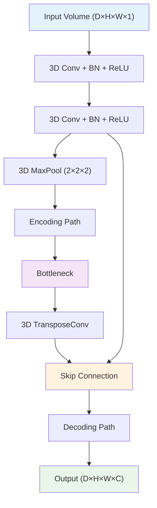

# 14. 응용 분야별 특화 기법

## 목차
1. [의료 영상 세그멘테이션](#1-의료-영상-세그멘테이션) 
   1. 1.1. [의료 영상의 특수성과 도전 과제](#11-의료-영상의-특수성과-도전-과제) 
   1. 1.2. [3D 의료 영상 처리](#12-3d-의료-영상-처리) 
   1. 1.3. [의료 특화 손실 함수와 평가 지표](#13-의료-특화-손실-함수와-평가-지표) 

2. [자율주행을 위한 세그멘테이션](#2-자율주행을-위한-세그멘테이션) 
   2. 2.1. [도로 장면 이해와 실시간 처리](#21-도로-장면-이해와-실시간-처리) 
   2. 2.2. [다중 센서 융합과 3D 인식](#22-다중-센서-융합과-3d-인식) 
   2. 2.3. [안전 중심 설계와 불확실성 처리](#23-안전-중심-설계와-불확실성-처리) 

3. [위성 영상과 원격 감지](#3-위성-영상과-원격-감지) 
   3. 3.1. [대용량 지리공간 데이터 처리](#31-대용량-지리공간-데이터-처리) 
   3. 3.2. [다중 스펙트럼과 시계열 분석](#32-다중-스펙트럼과-시계열-분석) 
   3. 3.3. [변화 탐지와 환경 모니터링](#33-변화-탐지와-환경-모니터링) 

4. [산업 및 제조업 응용](#4-산업-및-제조업-응용) 
   4. 4.1. [품질 검사와 결함 탐지](#41-품질-검사와-결함-탐지) 
   4. 4.2. [로봇 비전과 픽앤플레이스](#42-로봇-비전과-픽앤플레이스) 
   4. 4.3. [실시간 모니터링과 예측 유지보수](#43-실시간-모니터링과-예측-유지보수) 

5. [생물학과 농업 분야](#5-생물학과-농업-분야) 
   5. 5.1. [현미경 영상 분석](#51-현미경-영상-분석) 
   5. 5.2. [정밀 농업과 작물 모니터링](#52-정밀-농업과-작물-모니터링) 
   5. 5.3. [환경 보전과 생태계 분석](#53-환경-보전과-생태계-분석) 

---

## 1. 의료 영상 세그멘테이션

### 1.1. 의료 영상의 특수성과 도전 과제

#### 1.1.1. 의료 영상의 고유 특성

**높은 해상도와 3D 구조**:
- CT: $512 \times 512 \times 200+$ 슬라이스
- MRI: 다중 시퀀스 (T1, T2, FLAIR 등)
- 각도 정보: Axial, Sagittal, Coronal

**강도 불균일성 (Intensity Inhomogeneity)**:
$$I'(x,y,z) = I(x,y,z) \cdot B(x,y,z) + N(x,y,z)$$

여기서:
- $B(x,y,z)$: 편향 필드 (Bias field)
- $N(x,y,z)$: 노이즈

#### 1.1.2. 해부학적 제약 조건

**위상 일관성 (Topological Consistency)**:
특정 장기는 고정된 위상 구조를 가져야 함

**공간적 관계**:
$$P(\text{organ}_A | \text{organ}_B, \text{position}) = f(\text{anatomical\_prior})$$

**크기 제약**:
$$V_{min} \leq \text{Volume}(\text{organ}) \leq V_{max}$$

#### 1.1.3. 데이터 불균형과 희귀성

**병변 대 정상 조직 비율**:
종양이 전체 부피의 1% 미만인 경우가 일반적

**클래스 불균형 심각도**:
$$\text{Imbalance Ratio} = \frac{\text{Background Pixels}}{\text{Foreground Pixels}} > 1000:1$$

**전문가 라벨링 비용**:
- 높은 전문성 요구
- 시간 소모적 (3D 볼륨당 수 시간)
- 관찰자 간 변이성

### 1.2. 3D 의료 영상 처리

#### 1.2.1. 3D U-Net 아키텍처

**3D 컨볼루션 확장**:

#### 1.2.2. 메모리 효율적 처리

**패치 기반 학습**:
$$\text{Patch Size} = 64^3 \text{ or } 128^3$$

**중복 패치 전략**:
$$\text{Overlap} = \frac{\text{Patch Size}}{2}$$

**가중 융합**:
$$P_{final}(x,y,z) = \frac{\sum_i w_i(x,y,z) \cdot P_i(x,y,z)}{\sum_i w_i(x,y,z)}$$

여기서 $w_i$는 패치 중심으로부터의 거리 기반 가중치

#### 1.2.3. 다중 평면 접근법

**2.5D 처리**:
- Axial, Sagittal, Coronal 평면을 독립적으로 처리
- 3D 정보를 2D CNN으로 처리 가능

**투표 기반 융합**:
$$P_{3D}(x,y,z) = \frac{P_{axial}(x,y,z) + P_{sagittal}(x,y,z) + P_{coronal}(x,y,z)}{3}$$

### 1.3. 의료 특화 손실 함수와 평가 지표

#### 1.3.1. 의료 영상용 손실 함수

**Weighted Dice Loss**:
$$\mathcal{L}_{wDice} = 1 - \frac{2 \sum_{i} w_i y_i \hat{y}_i + \epsilon}{\sum_{i} w_i (y_i + \hat{y}_i) + \epsilon}$$

**경계 중심 가중치**:
$$w_i = 1 + \alpha \cdot \exp(-d_i^2 / 2\sigma^2)$$

여기서 $d_i$는 경계로부터의 거리

#### 1.3.2. 형태학적 손실 함수

**Hausdorff Distance Loss**:
$$\mathcal{L}_{HD} = \max\left(\max_{a \in A} \min_{b \in B} d(a,b), \max_{b \in B} \min_{a \in A} d(a,b)\right)$$

**Surface Distance Loss**:
$$\mathcal{L}_{surface} = \frac{1}{|S_{pred}|} \sum_{s \in S_{pred}} \min_{t \in S_{gt}} ||s - t||_2$$

#### 1.3.3. 의료 평가 지표

**95% Hausdorff Distance**:
극값에 덜 민감한 경계 정확도 측정

**Average Surface Distance (ASD)**:
$$ASD = \frac{1}{2}\left(\frac{1}{|S_1|}\sum_{s \in S_1} d(s, S_2) + \frac{1}{|S_2|}\sum_{s \in S_2} d(s, S_1)\right)$$

**Volume Similarity**:
$$VS = 1 - \frac{|V_1 - V_2|}{V_1 + V_2}$$

## 2. 자율주행을 위한 세그멘테이션

### 2.1. 도로 장면 이해와 실시간 처리

#### 2.1.1. 도로 장면의 특성

**계층적 중요도**:
1. **Safety Critical**: 보행자, 차량, 신호등
2. **Navigation**: 도로, 차선, 표지판  
3. **Context**: 건물, 하늘, 식물

**동적 vs 정적 객체**:
$$\text{Risk}(\text{object}) = f(\text{speed}, \text{distance}, \text{trajectory})