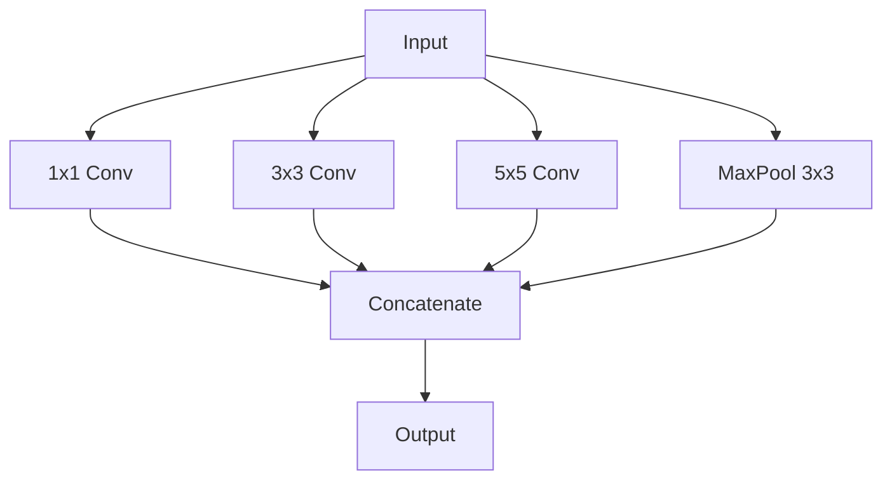
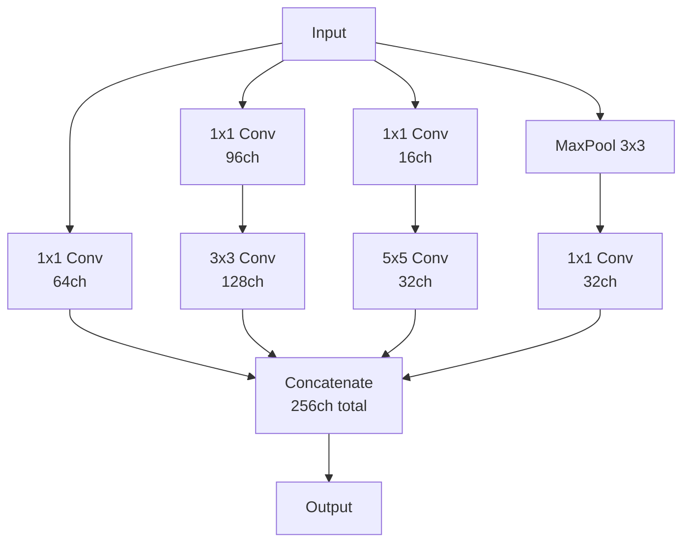
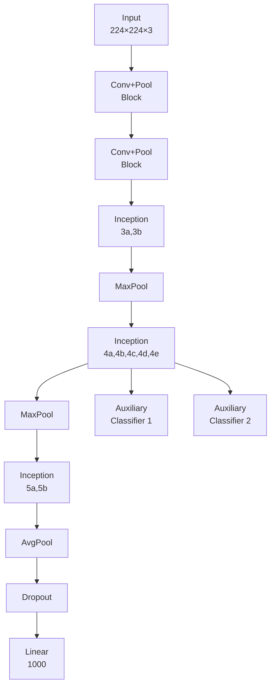
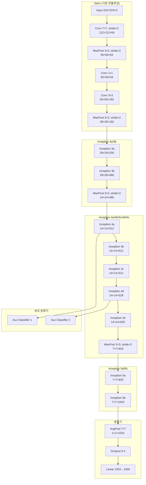
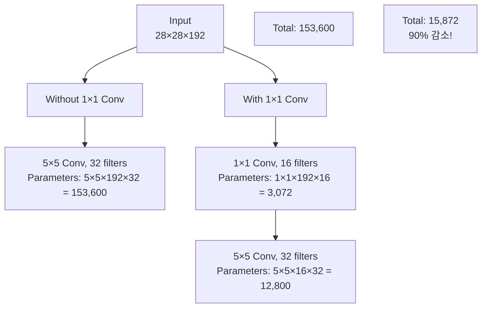

# Inception (GoogLeNet) - 효율적인 깊이와 너비의 조화

## 개요

Inception은 2014년 Google에서 Christian Szegedy 등에 의해 개발된 합성곱 신경망입니다. ILSVRC 2014에서 1위를 차지했으며, "Going Deeper with Convolutions"라는 논문으로 발표되었습니다. GoogLeNet이라고도 불리며, 효율적인 네트워크 설계의 새로운 패러다임을 제시했습니다.

## Inception의 핵심 아이디어

- **다중 스케일 특성**: 여러 크기의 필터를 병렬로 사용
- **효율성**: 파라미터 수를 줄이면서 성능 향상
- **1×1 컨볼루션**: 차원 축소와 계산량 감소
- **Global Average Pooling**: FC 레이어를 대체하여 과적합 방지
- **보조 분류기**: Gradient Vanishing 문제 해결

## Inception 발전사

| 모델 | 연도 | 주요 특징 | 레이어 수 | 파라미터 |
|------|------|-----------|-----------|----------|
| Inception v1 (GoogLeNet) | 2014 | Inception 모듈, 보조 분류기 | 22 | 6.8M |
| Inception v2 | 2015 | Batch Normalization | 22 | 11.2M |
| Inception v3 | 2015 | 비대칭 컨볼루션, 효율적 그리드 감소 | 48 | 23.8M |
| Inception v4 | 2016 | 구조 단순화, Residual 연결 | 76 | 42.7M |

## Inception 모듈의 진화

### 기본 아이디어 (Naive Version)



### 개선된 Inception 모듈 (v1)



## GoogLeNet (Inception v1) 전체 구조

### 네트워크 전체 다이어그램



### 상세 구조 다이어그램



## Inception 모듈 상세 분석

### 1×1 컨볼루션의 역할



### Inception 모듈 파라미터 계산

```python
# Inception 3a 모듈 예제
def calculate_inception_3a_params():
    input_channels = 192
    
    # Branch 1: 1×1 conv
    branch1_params = 1 * 1 * input_channels * 64
    
    # Branch 2: 1×1 conv → 3×3 conv
    branch2_1x1 = 1 * 1 * input_channels * 96
    branch2_3x3 = 3 * 3 * 96 * 128
    branch2_params = branch2_1x1 + branch2_3x3
    
    # Branch 3: 1×1 conv → 5×5 conv
    branch3_1x1 = 1 * 1 * input_channels * 16
    branch3_5x5 = 5 * 5 * 16 * 32
    branch3_params = branch3_1x1 + branch3_5x5
    
    # Branch 4: MaxPool → 1×1 conv
    branch4_params = 1 * 1 * input_channels * 32
    
    total_params = (branch1_params + branch2_params + 
                   branch3_params + branch4_params)
    
    print(f"Branch 1: {branch1_params:,}")
    print(f"Branch 2: {branch2_params:,}")
    print(f"Branch 3: {branch3_params:,}")
    print(f"Branch 4: {branch4_params:,}")
    print(f"Total: {total_params:,}")

# 실행하면 약 163,328개 파라미터
```

## PyTorch 구현 예제

### 기본 Inception 모듈

```python
import torch
import torch.nn as nn
import torch.nn.functional as F

class BasicConv2d(nn.Module):
    def __init__(self, in_channels, out_channels, **kwargs):
        super(BasicConv2d, self).__init__()
        self.conv = nn.Conv2d(in_channels, out_channels, bias=False, **kwargs)
        self.bn = nn.BatchNorm2d(out_channels, eps=0.001)
    
    def forward(self, x):
        x = self.conv(x)
        x = self.bn(x)
        return F.relu(x, inplace=True)

class InceptionModule(nn.Module):
    def __init__(self, in_channels, ch1x1, ch3x3red, ch3x3, ch5x5red, ch5x5, pool_proj):
        super(InceptionModule, self).__init__()
        
        # Branch 1: 1×1 conv
        self.branch1 = BasicConv2d(in_channels, ch1x1, kernel_size=1)
        
        # Branch 2: 1×1 conv → 3×3 conv
        self.branch2 = nn.Sequential(
            BasicConv2d(in_channels, ch3x3red, kernel_size=1),
            BasicConv2d(ch3x3red, ch3x3, kernel_size=3, padding=1)
        )
        
        # Branch 3: 1×1 conv → 5×5 conv
        self.branch3 = nn.Sequential(
            BasicConv2d(in_channels, ch5x5red, kernel_size=1),
            BasicConv2d(ch5x5red, ch5x5, kernel_size=5, padding=2)
        )
        
        # Branch 4: MaxPool → 1×1 conv
        self.branch4 = nn.Sequential(
            nn.MaxPool2d(kernel_size=3, stride=1, padding=1),
            BasicConv2d(in_channels, pool_proj, kernel_size=1)
        )
    
    def forward(self, x):
        branch1 = self.branch1(x)
        branch2 = self.branch2(x)
        branch3 = self.branch3(x)
        branch4 = self.branch4(x)
        
        outputs = [branch1, branch2, branch3, branch4]
        return torch.cat(outputs, 1)

# 사용 예제
inception_3a = InceptionModule(192, 64, 96, 128, 16, 32, 32)
x = torch.randn(1, 192, 28, 28)
output = inception_3a(x)
print(f"출력 크기: {output.shape}")  # [1, 256, 28, 28]
```

### 보조 분류기 (Auxiliary Classifier)

```python
class AuxiliaryClassifier(nn.Module):
    def __init__(self, in_channels, num_classes):
        super(AuxiliaryClassifier, self).__init__()
        self.avgpool = nn.AdaptiveAvgPool2d((4, 4))
        self.conv = BasicConv2d(in_channels, 128, kernel_size=1)
        self.fc1 = nn.Linear(128 * 4 * 4, 1024)
        self.fc2 = nn.Linear(1024, num_classes)
        self.dropout = nn.Dropout(0.7)
    
    def forward(self, x):
        x = self.avgpool(x)
        x = self.conv(x)
        x = torch.flatten(x, 1)
        x = F.relu(self.fc1(x), inplace=True)
        x = self.dropout(x)
        x = self.fc2(x)
        return x
```

### 완전한 GoogLeNet 구현

```python
class GoogLeNet(nn.Module):
    def __init__(self, num_classes=1000, aux_logits=True):
        super(GoogLeNet, self).__init__()
        self.aux_logits = aux_logits
        
        # 초기 컨볼루션 레이어들
        self.conv1 = BasicConv2d(3, 64, kernel_size=7, stride=2, padding=3)
        self.maxpool1 = nn.MaxPool2d(3, stride=2, padding=1)
        self.conv2 = BasicConv2d(64, 64, kernel_size=1)
        self.conv3 = BasicConv2d(64, 192, kernel_size=3, padding=1)
        self.maxpool2 = nn.MaxPool2d(3, stride=2, padding=1)
        
        # Inception 모듈들
        self.inception3a = InceptionModule(192, 64, 96, 128, 16, 32, 32)
        self.inception3b = InceptionModule(256, 128, 128, 192, 32, 96, 64)
        self.maxpool3 = nn.MaxPool2d(3, stride=2, padding=1)
        
        self.inception4a = InceptionModule(480, 192, 96, 208, 16, 48, 64)
        self.inception4b = InceptionModule(512, 160, 112, 224, 24, 64, 64)
        self.inception4c = InceptionModule(512, 128, 128, 256, 24, 64, 64)
        self.inception4d = InceptionModule(512, 112, 144, 288, 32, 64, 64)
        self.inception4e = InceptionModule(528, 256, 160, 320, 32, 128, 128)
        self.maxpool4 = nn.MaxPool2d(3, stride=2, padding=1)
        
        self.inception5a = InceptionModule(832, 256, 160, 320, 32, 128, 128)
        self.inception5b = InceptionModule(832, 384, 192, 384, 48, 128, 128)
        
        # 보조 분류기들
        if aux_logits:
            self.aux1 = AuxiliaryClassifier(512, num_classes)
            self.aux2 = AuxiliaryClassifier(528, num_classes)
        
        # 최종 분류기
        self.avgpool = nn.AdaptiveAvgPool2d((1, 1))
        self.dropout = nn.Dropout(0.4)
        self.fc = nn.Linear(1024, num_classes)
    
    def forward(self, x):
        # 초기 레이어들
        x = self.conv1(x)
        x = self.maxpool1(x)
        x = self.conv2(x)
        x = self.conv3(x)
        x = self.maxpool2(x)
        
        # Inception 3a, 3b
        x = self.inception3a(x)
        x = self.inception3b(x)
        x = self.maxpool3(x)
        
        # Inception 4a, 4b, 4c, 4d, 4e
        x = self.inception4a(x)
        aux1 = None
        if self.aux_logits and self.training:
            aux1 = self.aux1(x)
        
        x = self.inception4b(x)
        x = self.inception4c(x)
        x = self.inception4d(x)
        aux2 = None
        if self.aux_logits and self.training:
            aux2 = self.aux2(x)
        
        x = self.inception4e(x)
        x = self.maxpool4(x)
        
        # Inception 5a, 5b
        x = self.inception5a(x)
        x = self.inception5b(x)
        
        # 최종 분류
        x = self.avgpool(x)
        x = torch.flatten(x, 1)
        x = self.dropout(x)
        x = self.fc(x)
        
        if self.aux_logits and self.training:
            return x, aux1, aux2
        return x

# 모델 초기화
model = GoogLeNet(num_classes=1000)
total_params = sum(p.numel() for p in model.parameters())
print(f"총 파라미터 수: {total_params:,}")
```

## 학습 예제 (CIFAR-10)

```python
import torch.optim as optim
from torchvision import datasets, transforms
from torch.utils.data import DataLoader

# CIFAR-10용 간소화된 Inception
class InceptionCIFAR(nn.Module):
    def __init__(self, num_classes=10):
        super(InceptionCIFAR, self).__init__()
        
        self.conv1 = BasicConv2d(3, 64, kernel_size=3, padding=1)
        self.maxpool1 = nn.MaxPool2d(2)
        
        self.inception3a = InceptionModule(64, 32, 32, 64, 8, 16, 16)
        self.inception3b = InceptionModule(128, 64, 64, 96, 16, 32, 32)
        self.maxpool2 = nn.MaxPool2d(2)
        
        self.inception4a = InceptionModule(224, 96, 48, 104, 8, 24, 32)
        self.inception4b = InceptionModule(256, 80, 56, 112, 12, 32, 32)
        self.maxpool3 = nn.MaxPool2d(2)
        
        self.avgpool = nn.AdaptiveAvgPool2d((1, 1))
        self.dropout = nn.Dropout(0.4)
        self.fc = nn.Linear(256, num_classes)
    
    def forward(self, x):
        x = self.conv1(x)
        x = self.maxpool1(x)
        
        x = self.inception3a(x)
        x = self.inception3b(x)
        x = self.maxpool2(x)
        
        x = self.inception4a(x)
        x = self.inception4b(x)
        x = self.maxpool3(x)
        
        x = self.avgpool(x)
        x = torch.flatten(x, 1)
        x = self.dropout(x)
        x = self.fc(x)
        
        return x

# 데이터 전처리
transform_train = transforms.Compose([
    transforms.RandomHorizontalFlip(),
    transforms.RandomCrop(32, padding=4),
    transforms.ToTensor(),
    transforms.Normalize((0.4914, 0.4822, 0.4465), (0.2023, 0.1994, 0.2010))
])

transform_test = transforms.Compose([
    transforms.ToTensor(),
    transforms.Normalize((0.4914, 0.4822, 0.4465), (0.2023, 0.1994, 0.2010))
])

# 데이터셋
train_dataset = datasets.CIFAR10('./data', train=True, download=True, transform=transform_train)
test_dataset = datasets.CIFAR10('./data', train=False, transform=transform_test)

train_loader = DataLoader(train_dataset, batch_size=128, shuffle=True)
test_loader = DataLoader(test_dataset, batch_size=100, shuffle=False)

# 모델 및 학습 설정
device = torch.device('cuda' if torch.cuda.is_available() else 'cpu')
model = InceptionCIFAR(num_classes=10).to(device)
criterion = nn.CrossEntropyLoss()
optimizer = optim.Adam(model.parameters(), lr=0.001)
scheduler = optim.lr_scheduler.StepLR(optimizer, step_size=30, gamma=0.1)

# 보조 손실이 있는 학습 함수
def train_with_aux_loss(model, train_loader, criterion, optimizer, device):
    """학습 함수: 모델이 (output, aux1, aux2)를 반환하든 단일 output만 반환하든 처리합니다.

    - 주요 출력은 항상 첫 번째 요소로 취급합니다.
    - 보조 출력이 있으면 가중치 0.3을 적용하여 손실에 더합니다.
    """
    model.train()
    total_loss = 0
    correct = 0
    total = 0

    for data, target in train_loader:
        data, target = data.to(device), target.to(device)

        optimizer.zero_grad()

        outputs = model(data)

        # 모델이 튜플/리스트를 반환하면 첫 요소는 주 출력, 나머지는 보조 출력으로 간주
        if isinstance(outputs, (tuple, list)):
            main_output = outputs[0]
            aux_outputs = outputs[1:]
        else:
            main_output = outputs
            aux_outputs = []

        loss = criterion(main_output, target)
        # 보조 분류기가 있으면 각각 가중치 0.3 적용
        for aux in aux_outputs:
            loss += 0.3 * criterion(aux, target)

        loss.backward()
        optimizer.step()

        total_loss += loss.item()
        _, predicted = main_output.max(1)
        total += target.size(0)
        correct += predicted.eq(target).sum().item()

    return total_loss / len(train_loader), 100. * correct / total

# 학습 실행
for epoch in range(50):
    train_loss, train_acc = train_with_aux_loss(model, train_loader, criterion, optimizer, device)
    
    # 테스트
    model.eval()
    test_correct = 0
    test_total = 0
    with torch.no_grad():
        for data, target in test_loader:
            data, target = data.to(device), target.to(device)
            output = model(data)
            _, predicted = output.max(1)
            test_total += target.size(0)
            test_correct += predicted.eq(target).sum().item()
    
    test_acc = 100. * test_correct / test_total
    print(f'Epoch {epoch+1}: Train Loss: {train_loss:.4f}, Train Acc: {train_acc:.2f}%, Test Acc: {test_acc:.2f}%')
    
    scheduler.step()
```

## Inception의 핵심 기술들

### 1. 다중 스케일 특성 추출
```python
# 서로 다른 크기의 필터가 서로 다른 특성을 포착
# 1×1: 점별 특성
# 3×3: 지역적 특성
# 5×5: 더 넓은 지역적 특성
# MaxPool: 위치 불변성
```

### 2. 차원 축소 (1×1 컨볼루션)
```python
def dimension_reduction_example():
    # 입력: 28×28×256
    # 직접 5×5 컨볼루션 (32개): 5×5×256×32 = 204,800 params
    
    # 1×1 → 5×5 방식:
    # 1×1 컨볼루션 (64개): 1×1×256×64 = 16,384 params
    # 5×5 컨볼루션 (32개): 5×5×64×32 = 51,200 params
    # 총합: 67,584 params (67% 감소!)
    
    print("파라미터 감소: 67%")
    print("연산량 감소: 약 70%")
```

### 3. Global Average Pooling
```python
class GlobalAvgPool2d(nn.Module):
    def __init__(self):
        super(GlobalAvgPool2d, self).__init__()
        self.avgpool = nn.AdaptiveAvgPool2d((1, 1))
    
    def forward(self, x):
        # (batch_size, channels, H, W) → (batch_size, channels, 1, 1)
        x = self.avgpool(x)
        # (batch_size, channels, 1, 1) → (batch_size, channels)
        x = torch.flatten(x, 1)
        return x

# FC 레이어 대비 장점:
# 1. 파라미터 수 대폭 감소
# 2. 과적합 방지
# 3. 입력 크기에 무관
```

## Inception 버전별 개선사항

### Inception v2/v3의 주요 개선
```python
# 1. 5×5 컨볼루션을 두 개의 3×3으로 분해
class InceptionV3Module(nn.Module):
    def __init__(self, in_channels):
        super().__init__()
        # 5×5를 3×3 + 3×3로 분해
        self.branch = nn.Sequential(
            BasicConv2d(in_channels, 64, kernel_size=1),
            BasicConv2d(64, 96, kernel_size=3, padding=1),
            BasicConv2d(96, 96, kernel_size=3, padding=1)
        )

# 2. 비대칭 컨볼루션 (n×1, 1×n)
class AsymmetricConv(nn.Module):
    def __init__(self, in_channels, out_channels, kernel_size):
        super().__init__()
        self.conv1 = BasicConv2d(in_channels, out_channels, (kernel_size, 1), padding=(kernel_size//2, 0))
        self.conv2 = BasicConv2d(out_channels, out_channels, (1, kernel_size), padding=(0, kernel_size//2))
    
    def forward(self, x):
        x = self.conv1(x)
        x = self.conv2(x)
        return x
```

## Inception의 장단점

### 장점
1. **효율성**: 적은 파라미터로 높은 성능
2. **다중 스케일**: 다양한 크기의 특성 동시 추출
3. **모듈화**: 재사용 가능한 구조
4. **Global Average Pooling**: 과적합 방지

### 단점
1. **복잡한 구조**: 구현과 디버깅이 어려움
2. **메모리 사용량**: 병렬 브랜치로 인한 메모리 증가
3. **하이퍼파라미터**: 많은 설계 선택지
4. **불균등한 계산**: 브랜치별 계산량 차이

## 다른 모델과의 비교

| 특징 | VGGNet | Inception | ResNet |
|------|--------|-----------|---------|
| 설계 철학 | 깊이 | 너비 + 효율성 | 깊이 + Skip |
| 파라미터 | 138M | 6.8M | 25M |
| 계산 복잡도 | 높음 | 중간 | 중간 |
| 구현 복잡도 | 낮음 | 높음 | 중간 |
| 성능 | 좋음 | 매우 좋음 | 최고 |

## 현대적 응용

### 1. MobileNet의 Depthwise Separable Convolution
```python
# Inception의 1×1 컨볼루션 아이디어를 발전시킨 것
class DepthwiseSeparableConv(nn.Module):
    def __init__(self, in_channels, out_channels):
        super().__init__()
        self.depthwise = nn.Conv2d(in_channels, in_channels, 3, padding=1, groups=in_channels)
        self.pointwise = nn.Conv2d(in_channels, out_channels, 1)
    
    def forward(self, x):
        x = self.depthwise(x)
        x = self.pointwise(x)
        return x
```

### 2. EfficientNet의 복합 확장
```python
# Inception의 다중 스케일 아이디어를 체계화
# Width(채널) + Depth(깊이) + Resolution(해상도) 동시 확장
```

## 결론

Inception은 "Going Wider"라는 새로운 패러다임을 제시한 혁신적인 모델입니다. 1×1 컨볼루션을 통한 차원 축소, 다중 스케일 특성 추출, Global Average Pooling 등의 기술은 현재까지도 널리 사용되고 있습니다. 효율적인 네트워크 설계의 중요한 이정표가 된 모델로, CNN 발전사에서 빼놓을 수 없는 중요한 위치를 차지합니다.

---
