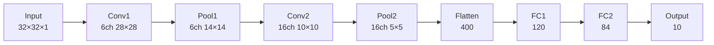
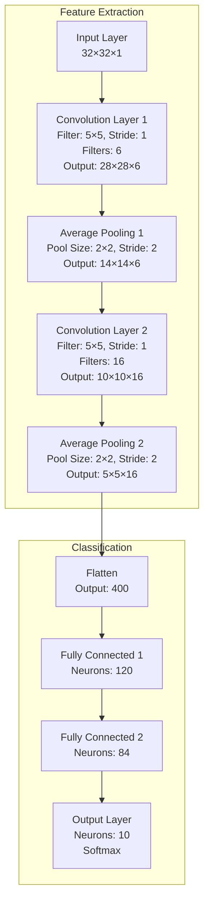

# LeNet - 최초의 실용적인 CNN 모델

## 개요

LeNet은 1998년 Yann LeCun에 의해 개발된 최초의 성공적인 합성곱 신경망(Convolutional Neural Network, CNN) 중 하나입니다. 주로 손글씨 숫자 인식(MNIST)을 위해 설계되었으며, 현대 CNN의 기초가 되는 구조를 제시했습니다.

## LeNet의 특징

- **입력 크기**: 32×32 그레이스케일 이미지
- **출력**: 10개 클래스 (숫자 0-9)
- **활성화 함수**: Sigmoid/Tanh (ReLU가 나오기 전)
- **풀링**: Average Pooling 사용
- **총 파라미터**: 약 60,000개

## LeNet 구조

### 전체 네트워크 구조 다이어그램



### 레이어별 상세 구조



## 각 레이어 상세 설명

### 1. 입력 레이어 (Input Layer)
- **크기**: 32×32×1
- **설명**: 그레이스케일 이미지를 입력으로 받습니다.

### 2. 첫 번째 합성곱 레이어 (Conv1)
- **필터 크기**: 5×5
- **필터 개수**: 6개
- **스트라이드**: 1
- **패딩**: 없음 (Valid padding)
- **출력 크기**: 28×28×6
- **계산**: (32-5+1) = 28

### 3. 첫 번째 풀링 레이어 (Pool1)
- **타입**: Average Pooling
- **풀 크기**: 2×2
- **스트라이드**: 2
- **출력 크기**: 14×14×6

### 4. 두 번째 합성곱 레이어 (Conv2)
- **필터 크기**: 5×5
- **필터 개수**: 16개
- **스트라이드**: 1
- **출력 크기**: 10×10×16
- **계산**: (14-5+1) = 10

### 5. 두 번째 풀링 레이어 (Pool2)
- **타입**: Average Pooling
- **풀 크기**: 2×2
- **스트라이드**: 2
- **출력 크기**: 5×5×16

### 6. 완전 연결 레이어들 (Fully Connected)
- **FC1**: 400 → 120 뉴런
- **FC2**: 120 → 84 뉴런
- **출력층**: 84 → 10 뉴런 (클래스 수)

## PyTorch 구현 예제

```python
import torch
import torch.nn as nn
import torch.nn.functional as F

class LeNet(nn.Module):
    def __init__(self, num_classes=10):
        super(LeNet, self).__init__()
        # 특성 추출 부분
        self.conv1 = nn.Conv2d(1, 6, kernel_size=5)
        self.conv2 = nn.Conv2d(6, 16, kernel_size=5)
        # LeNet은 평균풀링(subsampling)을 사용
        self.pool = nn.AvgPool2d(kernel_size=2, stride=2)
        # 활성화로 Tanh 사용 (원본 LeNet과 유사)
        self.tanh = nn.Tanh()
        
        # 분류 부분
        self.fc1 = nn.Linear(16 * 5 * 5, 120)
        self.fc2 = nn.Linear(120, 84)
        self.fc3 = nn.Linear(84, num_classes)
    
    def forward(self, x):
    # 첫 번째 conv -> tanh -> pool
    x = self.conv1(x)
    x = self.tanh(x)
    x = self.pool(x)

    # 두 번째 conv -> tanh -> pool
    x = self.conv2(x)
    x = self.tanh(x)
    x = self.pool(x)

    # Flatten
    x = x.view(x.size(0), -1)

    # 완전 연결 레이어들
    x = self.tanh(self.fc1(x))
    x = self.tanh(self.fc2(x))
    x = self.fc3(x)

    return x

# 모델 초기화
model = LeNet(num_classes=10)
print(model)

# 모델 파라미터 수 확인
total_params = sum(p.numel() for p in model.parameters())
print(f"총 파라미터 수: {total_params:,}")
```

## 간단한 학습 예제

```python
import torch.optim as optim
from torchvision import datasets, transforms
from torch.utils.data import DataLoader

# 데이터 전처리
transform = transforms.Compose([
    transforms.Resize((32, 32)),  # LeNet 입력 크기로 조정
    transforms.ToTensor(),
    transforms.Normalize((0.1307,), (0.3081,))
])

# MNIST 데이터셋 로드
train_dataset = datasets.MNIST('./data', train=True, download=True, transform=transform)
test_dataset = datasets.MNIST('./data', train=False, transform=transform)

train_loader = DataLoader(train_dataset, batch_size=64, shuffle=True)
test_loader = DataLoader(test_dataset, batch_size=1000, shuffle=False)

# 모델, 손실함수, 옵티마이저 초기화
# 간단하게 CPU/GPU 자동 선택을 추가
device = torch.device("cuda" if torch.cuda.is_available() else "cpu")
model = LeNet().to(device)
criterion = nn.CrossEntropyLoss()
optimizer = optim.SGD(model.parameters(), lr=0.01, momentum=0.9)

# 학습 함수
def train(epoch):
    model.train()
    for batch_idx, (data, target) in enumerate(train_loader):
        data, target = data.to(device), target.to(device)
        optimizer.zero_grad()
        output = model(data)
        loss = criterion(output, target)
        loss.backward()
        optimizer.step()

        if batch_idx % 100 == 0:
            print(f'Epoch {epoch}, Batch {batch_idx}, Loss: {loss.item():.6f}')

# 테스트 함수
def test():
    model.eval()
    test_loss = 0.0
    correct = 0
    with torch.no_grad():
        for data, target in test_loader:
            data, target = data.to(device), target.to(device)
            output = model(data)
            # criterion은 배치별 평균 손실을 반환하므로, 배치 크기로 보정하여 전체 데이터에 대한 평균을 계산
            test_loss += criterion(output, target).item() * data.size(0)
            pred = output.argmax(dim=1, keepdim=True)
            correct += pred.eq(target.view_as(pred)).sum().item()

    test_loss /= len(test_loader.dataset)
    accuracy = 100. * correct / len(test_loader.dataset)
    print(f'Test Loss: {test_loss:.4f}, Accuracy: {accuracy:.2f}%')

# 학습 실행 (예시)
for epoch in range(1, 11):
    train(epoch)
    test()
```

## LeNet의 의의와 한계

### 의의
- **CNN의 기초 확립**: 합성곱과 풀링을 조합한 현대 CNN의 기본 구조 제시
- **공간적 계층구조**: 저수준 특성에서 고수준 특성으로의 점진적 학습
- **실용적 성공**: MNIST에서 99% 이상의 정확도 달성

### 한계
- **작은 입력 크기**: 32×32로 제한적
- **단순한 구조**: 깊이가 얕아 복잡한 패턴 학습에 한계
- **활성화 함수**: Sigmoid/Tanh 사용으로 gradient vanishing 문제

## 현대 CNN과의 비교

| 특징 | LeNet | 현대 CNN |
|------|-------|----------|
| 깊이 | 7레이어 | 수십~수백 레이어 |
| 활성화 함수 | Sigmoid/Tanh | ReLU |
| 풀링 | Average Pooling | Max Pooling |
| 정규화 | 없음 | Batch/Layer Normalization |
| 드롭아웃 | 없음 | Dropout 사용 |

## 결론

LeNet은 비록 오래된 모델이지만, CNN의 기본 개념을 이해하는 데 매우 중요한 모델입니다. 합성곱, 풀링, 완전연결 레이어의 조합을 통해 이미지 분류를 수행하는 기본적인 아이디어를 제시했으며, 이는 현재까지도 모든 CNN 모델의 기초가 되고 있습니다.

---
