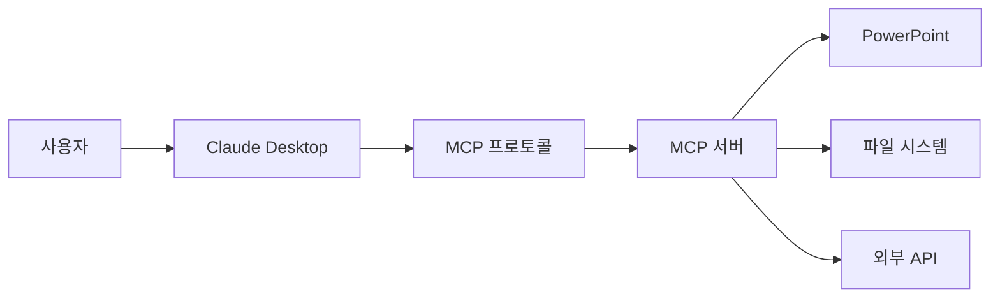
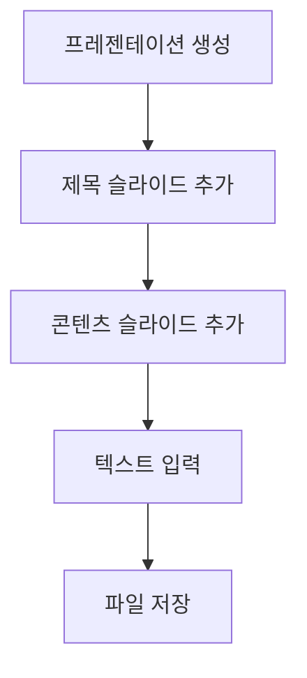

# Claude Desktop과 PowerPoint MCP 서버 연동하기

## 목차

1. [개요](#1-개요)<br/>
   1. [MCP란 무엇인가](#11-mcp란-무엇인가)<br/>
   1. [PowerPoint MCP 서버의 활용](#12-powerpoint-mcp-서버의-활용)<br/>
1. [사전 요구사항 및 환경 구성](#2-사전-요구사항-및-환경-구성)<br/>
   1. [Node.js 설치](#21-nodejs-설치)<br/>
   1. [Claude Desktop 설치](#22-claude-desktop-설치)<br/>
   1. [Python 환경 확인](#23-python-환경-확인)<br/>
1. [PowerPoint MCP 서버 설치](#3-powerpoint-mcp-서버-설치)<br/>
   1. [Smithery를 통한 자동 설치 시도](#31-smithery를-통한-자동-설치-시도)<br/>
   1. [자동 설치 실패 시 대응](#32-자동-설치-실패-시-대응)<br/>
   1. [Git을 통한 수동 설치](#33-git을-통한-수동-설치)<br/>
1. [설정 파일 구성](#4-설정-파일-구성)<br/>
   1. [claude_desktop_config.json 위치](#41-claude_desktop_configjson-위치)<br/>
   1. [설정 파일 작성](#42-설정-파일-작성)<br/>
   1. [경로 설정 주의사항](#43-경로-설정-주의사항)<br/>
1. [연결 테스트 및 활용](#5-연결-테스트-및-활용)<br/>
   1. [MCP 서버 정상 동작 확인](#51-mcp-서버-정상-동작-확인)<br/>
   1. [PowerPoint 생성 실습](#52-powerpoint-생성-실습)<br/>
1. [트러블슈팅](#6-트러블슈팅)<br/>
   1. [일반적인 오류 상황](#61-일반적인-오류-상황)<br/>
   1. [로그 확인 방법](#62-로그-확인-방법)<br/>
1. [결론](#7-결론)<br/>
1. [용어 목록](#용어-목록)<br/>

---

## 1. 개요

### 1.1. MCP란 무엇인가

MCP(Model Context Protocol)는 AI 모델과 외부 도구를 연결하는 표준 프로토콜(protocol)입니다. Claude와 같은 대형 언어 모델(LLM, Large Language Model)이 파일 시스템, 데이터베이스, API 등 다양한 리소스에 접근할 수 있도록 해주는 인터페이스(interface)입니다.



MCP의 핵심 개념:

- **서버-클라이언트 아키텍처**: MCP 서버는 특정 기능을 제공하고, Claude가 클라이언트로서 이를 호출합니다.
- **도구 추상화**: 복잡한 작업을 간단한 함수 호출로 변환합니다.
- **확장성**: 누구나 새로운 MCP 서버를 개발하여 Claude의 기능을 확장할 수 있습니다.

### 1.2. PowerPoint MCP 서버의 활용

PowerPoint MCP 서버는 Claude가 프레젠테이션(presentation) 파일을 생성하고 편집할 수 있게 해주는 도구입니다. 주요 기능은 다음과 같습니다:

- 새로운 PPT 파일 생성
- 슬라이드 추가 및 편집
- 텍스트, 이미지, 차트, 표 삽입
- 테마 및 디자인 적용
- 파일 저장 및 관리

**활용 사례**:
- 보고서 자동 생성
- 데이터 시각화 프레젠테이션
- 교육 자료 제작
- 비즈니스 제안서 작성

---

## 2. 사전 요구사항 및 환경 구성

### 2.1. Node.js 설치

Node.js는 자바스크립트(JavaScript) 런타임(runtime) 환경으로, 많은 MCP 서버가 이를 기반으로 동작합니다.

#### 2.1.1. 다운로드

공식 웹사이트에서 다운로드:
- **URL**: [https://nodejs.org/](https://nodejs.org/)
- **권장 버전**: LTS (Long Term Support) 버전

#### 2.1.2. 설치 과정

1. 다운로드한 설치 파일 실행 (예: `node-v20.x.x-x64.msi`)
2. 설치 마법사(wizard)에서 "Next" 클릭
3. 라이선스 동의 후 "Next"
4. 설치 경로 선택 (기본값 권장: `C:\Program Files\nodejs\`)
5. 기능 선택 화면:
   - "Node.js runtime" 체크
   - "npm package manager" 체크
   - "Add to PATH" 체크 (중요!)
6. "Install" 클릭하여 설치 완료

#### 2.1.3. 설치 확인

명령 프롬프트(Command Prompt) 또는 PowerShell을 열고 다음 명령어를 실행:

```bash
node --version
npm --version
```

정상적으로 버전 번호가 출력되면 설치 성공입니다.

예시 출력:
```
v20.10.0
10.2.3
```

### 2.2. Claude Desktop 설치

#### 2.2.1. 다운로드

Claude Desktop 공식 다운로드 페이지:
- **URL**: [https://claude.ai/download](https://claude.ai/download)
- Windows 버전 선택

#### 2.2.2. 설치 과정

1. 다운로드한 설치 파일 실행 (예: `Claude-Setup-x64.exe`)
2. 자동으로 설치가 진행됩니다
3. 설치 완료 후 Claude Desktop이 자동 실행됩니다
4. Anthropic 계정으로 로그인

#### 2.2.3. 초기 설정

- 앱 권한 허용 (파일 시스템 접근 등)
- 업데이트 확인 활성화 권장

### 2.3. Python 환경 확인

PowerPoint MCP 서버는 Python으로 작성되어 있으므로 Python 설치가 필요합니다.

#### 2.3.1. Python 설치 여부 확인

명령 프롬프트에서 실행:

```bash
python --version
```

또는

```bash
python3 --version
```

#### 2.3.2. Python 미설치 시

공식 웹사이트에서 다운로드:
- **URL**: [https://www.python.org/downloads/](https://www.python.org/downloads/)
- **권장 버전**: Python 3.10 이상

**설치 시 주의사항**:
- "Add Python to PATH" 옵션 반드시 체크
- "Install for all users" 권장

#### 2.3.3. 필요한 Python 패키지

PowerPoint MCP 서버는 다음 패키지들이 필요합니다:

```bash
pip install python-pptx mcp pillow
```

각 패키지의 역할:
- `python-pptx`: PowerPoint 파일 조작 라이브러리
- `mcp`: MCP 프로토콜 구현
- `pillow`: 이미지 처리 라이브러리

---

## 3. PowerPoint MCP 서버 설치

### 3.1. Smithery를 통한 자동 설치 시도

Smithery는 MCP 서버를 쉽게 설치하고 관리할 수 있는 플랫폼입니다.

#### 3.1.1. Smithery 접속

- **URL**: [https://smithery.ai/](https://smithery.ai/)

#### 3.1.2. PowerPoint MCP 서버 검색

1. Smithery 웹사이트 접속
2. 검색창에 "powerpoint" 또는 "ppt" 입력
3. "Office-PowerPoint-MCP-Server" 선택

#### 3.1.3. 자동 설치 절차

1. "Install" 버튼 클릭
2. 설치 스크립트(script) 다운로드
3. 스크립트 실행

```bash
npx @smithery/cli install @modelcontextprotocol/server-powerpoint
```

### 3.2. 자동 설치 실패 시 대응

**일반적인 실패 원인**:

1. 네트워크 연결 문제
2. 권한(permission) 부족
3. 경로 설정 오류
4. 의존성(dependency) 패키지 누락

**실패 메시지 예시**:
```
Error: Cannot find module 'python-pptx'
Error: EACCES: permission denied
Error: spawn python ENOENT
```

이러한 경우 수동 설치를 진행합니다.

### 3.3. Git을 통한 수동 설치

#### 3.3.1. Git 설치

Git이 설치되어 있지 않다면:
- **URL**: [https://git-scm.com/download/win](https://git-scm.com/download/win)
- 기본 옵션으로 설치 진행

#### 3.3.2. 리포지토리 클론

원하는 디렉토리(directory)로 이동 후:

```bash
cd D:\dev
git clone https://github.com/GongRzhe/Office-PowerPoint-MCP-Server.git
```

클론 완료 후 디렉토리 구조:
```
D:\dev\Office-PowerPoint-MCP-Server\
├── ppt_mcp_server.py
├── requirements.txt
├── README.md
└── ...
```

#### 3.3.3. 의존성 설치

클론한 디렉토리로 이동:

```bash
cd Office-PowerPoint-MCP-Server
pip install -r requirements.txt
```

`requirements.txt`에 명시된 모든 패키지가 자동으로 설치됩니다.

#### 3.3.4. 설치 확인

Python 서버 파일이 정상적으로 실행되는지 테스트:

```bash
python ppt_mcp_server.py
```

오류 없이 실행되면 설치 성공입니다. `Ctrl+C`로 종료합니다.

---

## 4. 설정 파일 구성

### 4.1. claude_desktop_config.json 위치

Claude Desktop의 설정 파일 위치:

**Windows**:
```
C:\Users\[사용자명]\AppData\Roaming\Claude\claude_desktop_config.json
```

**경로 접근 방법**:
1. `Win + R` 키 누르기
2. `%APPDATA%\Claude` 입력
3. `claude_desktop_config.json` 파일 찾기

### 4.2. 설정 파일 작성

#### 4.2.1. 기본 구조

JSON 형식으로 MCP 서버를 등록합니다:

```json
{
  "mcpServers": {
    "powerpoint": {
      "command": "C:\\Program Files\\Python313\\python.exe",
      "args": [
        "D:\\dev\\Office-PowerPoint-MCP-Server\\ppt_mcp_server.py"
      ]
    }
  }
}
```

#### 4.2.2. 구성 요소 설명

- `mcpServers`: 모든 MCP 서버를 포함하는 최상위 객체
- `"powerpoint"`: 서버 식별자(identifier) (원하는 이름 사용 가능)
- `command`: Python 인터프리터(interpreter) 경로
- `args`: 실행할 스크립트 경로를 배열 형태로 지정

#### 4.2.3. 여러 MCP 서버 등록

복수의 서버를 등록할 경우:

```json
{
  "mcpServers": {
    "powerpoint": {
      "command": "C:\\Program Files\\Python313\\python.exe",
      "args": ["D:\\dev\\Office-PowerPoint-MCP-Server\\ppt_mcp_server.py"]
    },
    "calculator": {
      "command": "C:\\Program Files\\Python313\\python.exe",
      "args": ["D:\\dev\\calculator-mcp\\server.py"]
    }
  }
}
```

### 4.3. 경로 설정 주의사항

#### 4.3.1. 백슬래시 이스케이프

Windows 경로는 백슬래시(`\`)를 두 번 사용해야 합니다:

- **잘못된 예**: `"C:\Program Files\Python313\python.exe"`
- **올바른 예**: `"C:\\Program Files\\Python313\\python.exe"`

또는 슬래시(`/`) 사용:

- **대안**: `"C:/Program Files/Python313/python.exe"`

#### 4.3.2. Python 경로 찾기

Python 설치 경로 확인 방법:

```bash
where python
```

또는

```bash
python -c "import sys; print(sys.executable)"
```

출력 예시:
```
C:\Program Files\Python313\python.exe
```

#### 4.3.3. 절대 경로 사용

상대 경로(relative path)보다 절대 경로(absolute path)를 사용하는 것이 안전합니다.

---

## 5. 연결 테스트 및 활용

### 5.1. MCP 서버 정상 동작 확인

#### 5.1.1. Claude Desktop 재시작

설정 파일 수정 후 반드시 Claude Desktop을 완전히 종료하고 재시작해야 합니다:

1. Claude Desktop 창 닫기
2. 작업 표시줄의 시스템 트레이(tray)에서 Claude 아이콘 우클릭
3. "종료" 선택
4. Claude Desktop 다시 실행

#### 5.1.2. MCP 서버 연결 확인

Claude Desktop에서 새 대화 시작 후 다음과 같이 질문:

```
현재 사용 가능한 MCP 도구를 알려줘
```

PowerPoint 관련 도구들이 나열되면 연결 성공입니다.

예상 응답:
```
다음 PowerPoint MCP 도구들이 사용 가능합니다:
- powerpoint:create_presentation
- powerpoint:add_slide
- powerpoint:add_text
- powerpoint:save_presentation
...
```

#### 5.1.3. 연결 실패 시 체크리스트

- [ ] `claude_desktop_config.json` 파일 저장 확인
- [ ] JSON 문법 오류 확인 (괄호, 쉼표, 따옴표)
- [ ] Python 경로 정확성 확인
- [ ] 스크립트 경로 정확성 확인
- [ ] Claude Desktop 완전 재시작
- [ ] Python 패키지 설치 확인

### 5.2. PowerPoint 생성 실습

#### 5.2.1. 간단한 프레젠테이션 생성

Claude에게 다음과 같이 요청:

```
"딥러닝 기초"라는 제목으로 3개 슬라이드를 가진 PPT를 만들어줘.
첫 번째 슬라이드: 제목 슬라이드
두 번째 슬라이드: 딥러닝의 정의
세 번째 슬라이드: 주요 알고리즘
파일명: deep_learning_intro.pptx
```

#### 5.2.2. 실행 과정

Claude는 다음 순서로 작업을 수행합니다:



#### 5.2.3. 고급 기능 활용

**차트 추가 예시**:

```
2024년 AI 시장 성장률을 보여주는 막대 그래프를 추가한 슬라이드를 만들어줘.
데이터:
- Q1: 15%
- Q2: 23%
- Q3: 31%
- Q4: 28%
```

**이미지 추가 예시**:

```
네 번째 슬라이드에 D:\images\neural_network.png 이미지를 추가해줘.
```

**테이블 추가 예시**:

```
다음 데이터를 3x4 표로 만들어줘:
알고리즘 | 정확도 | 속도
CNN | 95% | 빠름
RNN | 88% | 보통
Transformer | 97% | 느림
```

#### 5.2.4. 결과 확인

생성된 파일은 지정한 경로에 저장됩니다. PowerPoint로 열어 결과를 확인합니다.

---

## 6. 트러블슈팅

### 6.1. 일반적인 오류 상황

#### 6.1.1. "MCP 서버를 찾을 수 없음" 오류

**원인**:
- 설정 파일 경로 오류
- Python 경로 오류

**해결 방법**:

1. Python 경로 재확인:
```bash
where python
```

2. 스크립트 경로 재확인:
```bash
dir D:\dev\Office-PowerPoint-MCP-Server\ppt_mcp_server.py
```

3. 설정 파일에 절대 경로로 수정

#### 6.1.2. "모듈을 찾을 수 없음" 오류

**오류 메시지**:
```
ModuleNotFoundError: No module named 'pptx'
```

**해결 방법**:

```bash
pip install python-pptx
pip install mcp
pip install pillow
```

또는 전체 재설치:

```bash
cd D:\dev\Office-PowerPoint-MCP-Server
pip install -r requirements.txt
```

#### 6.1.3. "권한 거부" 오류

**원인**:
- 파일 시스템 권한 부족
- 관리자 권한 필요

**해결 방법**:

1. 명령 프롬프트를 관리자 권한으로 실행
2. 또는 설치 경로를 사용자 디렉토리로 변경:
```
C:\Users\[사용자명]\Documents\MCP\Office-PowerPoint-MCP-Server
```

#### 6.1.4. JSON 문법 오류

**일반적인 실수**:

```json
// 잘못된 예
{
  "mcpServers": {
    "powerpoint": {
      "command": "C:\Python\python.exe",  // 백슬래시 한 번
      "args": ["D:\dev\server.py"]
    },  // 마지막 쉼표
  }
}

// 올바른 예
{
  "mcpServers": {
    "powerpoint": {
      "command": "C:\\Python\\python.exe",
      "args": ["D:\\dev\\server.py"]
    }
  }
}
```

JSON 유효성 검사 도구:
- [JSONLint](https://jsonlint.com/)

### 6.2. 로그 확인 방법

#### 6.2.1. Claude Desktop 로그 위치

**Windows**:
```
C:\Users\[사용자명]\AppData\Roaming\Claude\logs\
```

#### 6.2.2. 로그 파일 확인

최신 로그 파일을 텍스트 에디터로 열어 오류 메시지 확인:

```
main.log
renderer.log
```

#### 6.2.3. Python 스크립트 직접 실행

MCP 서버를 직접 실행하여 오류 확인:

```bash
python D:\dev\Office-PowerPoint-MCP-Server\ppt_mcp_server.py
```

정상 실행되면 대기 상태가 됩니다. 오류가 있으면 즉시 출력됩니다.

---

## 7. 결론

이 튜토리얼을 통해 Claude Desktop과 PowerPoint MCP 서버를 성공적으로 연결하는 방법을 학습했습니다. 주요 내용을 요약하면:

**핵심 단계**:

1. **환경 구성**: Node.js, Claude Desktop, Python 설치
2. **수동 설치**: Git을 통한 리포지토리 클론 및 의존성 설치
3. **설정 파일**: `claude_desktop_config.json` 작성 및 경로 설정
4. **테스트**: MCP 서버 연결 확인 및 PPT 생성 실습

**성공 요인**:

- 정확한 경로 설정 (백슬래시 이스케이프)
- 모든 의존성 패키지 설치
- Claude Desktop 완전 재시작

**다음 단계**:

이제 MCP의 기본 개념과 설정 방법을 이해했으므로, 다음 포스팅에서는:

- 커스텀(custom) MCP 서버 개발
- 사칙연산 도구 구현
- 더 복잡한 기능 추가

계속해서 MCP 생태계(ecosystem)를 탐구하고 자신만의 도구를 만들어보세요!

---

## 용어 목록

| 용어 | 영문 | 설명 |
|------|------|------|
| 프로토콜 | Protocol | 컴퓨터 간 통신 규약 |
| 인터페이스 | Interface | 서로 다른 시스템을 연결하는 접점 |
| 아키텍처 | Architecture | 시스템의 구조와 설계 방식 |
| 런타임 | Runtime | 프로그램이 실행되는 환경 |
| 의존성 | Dependency | 프로그램이 동작하기 위해 필요한 다른 소프트웨어 |
| 리포지토리 | Repository | 소스 코드 저장소 |
| 디렉토리 | Directory | 파일과 폴더를 담는 공간 (폴더) |
| 식별자 | Identifier | 개체를 구별하기 위한 고유한 이름 |
| 인터프리터 | Interpreter | 프로그래밍 언어를 실행하는 프로그램 |
| 절대 경로 | Absolute Path | 최상위 디렉토리부터 시작하는 전체 경로 |
| 상대 경로 | Relative Path | 현재 위치를 기준으로 하는 경로 |
| 트레이 | Tray | Windows 작업 표시줄의 알림 영역 |
| 이스케이프 | Escape | 특수 문자를 일반 문자로 처리하기 위한 방법 |
| 생태계 | Ecosystem | 관련 기술들이 상호작용하는 환경 |
| 클론 | Clone | 원격 리포지토리를 로컬로 복사 |
| 커스텀 | Custom | 사용자 정의, 맞춤형 |
| 마법사 | Wizard | 단계별 설치/설정 안내 도구 |
| 스크립트 | Script | 자동화된 명령어 모음 |

---

**작성자**: AI 엔지니어링 학습자  
**작성일**: 2025-10-05  
**시리즈**: Claude MCP 활용 가이드 (1/2)

다음 포스팅: **"나만의 MCP 서버 만들기: 사칙연산 도구 개발"**