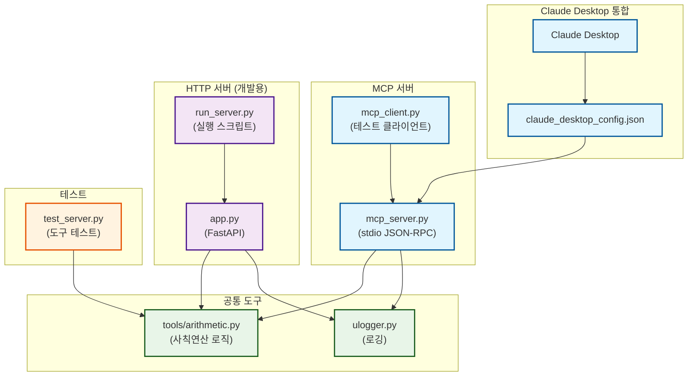

# MCP Arithmetic Server

사칙연산을 제공하는 최소 기능(MVP, Minimum Viable Product) MCP 서버.

**2가지 실행 모드**:
- **HTTP 서버** (`app.py`): 개발/테스트용 REST API (포트 8000)
- **stdio 서버** (`mcp_server.py`): Claude Desktop 통합용 MCP 프로토콜

## 1. 설치

### 1.1 가상환경 생성

```bash
# Windows (PowerShell)
python -m venv .venv
.venv\Scripts\Activate.ps1

# Linux/macOS
python -m venv .venv
source .venv/bin/activate
```

### 1.2 의존성 설치

```bash
pip install -r requirements.txt
```

## 2. 실행 방법

### 2.1 HTTP 서버 (개발/테스트)

```powershell
python run_server.py
```

서버 시작 후 접속:
- API 문서: http://localhost:8000/docs
- 루트: http://localhost:8000

### 2.2 stdio MCP 서버 (Claude Desktop)

1. 설정 파일 복사:
```powershell
$configDir = "$env:APPDATA\Claude"
New-Item -ItemType Directory -Force -Path $configDir
Copy-Item -Path ".\claude_desktop_config.json" -Destination "$configDir\claude_desktop_config.json" -Force
```

2. Claude Desktop 재시작

3. 상세 가이드: [`SETUP_CLAUDE.md`](SETUP_CLAUDE.md) 참조

## 3. 테스트

### 3.1 로컬 MCP 테스트 (권장)

```powershell
python mcp_client.py
```

**출력 예시**:
```
=== MCP 사칙연산 테스트 시작 ===

MCP 서버 연결 성공
사용 가능한 도구: ['arithmetic']

✓ PASS: 덧셈 (2개)
  add([10, 5]) = 15

✓ PASS: 곱셈
  multiply([2, 3, 4]) = 24

...

테스트 완료: 9/9 PASS, 0/9 FAIL
```

## 3.2 HTTP API 테스트

### 3.2.1 PowerShell 예제

```powershell
# 덧셈
$body = '{"tool":"arithmetic","operation":"add","operands":[10,5,3]}' | ConvertTo-Json
Invoke-RestMethod -Uri http://127.0.0.1:8000/invoke -Method Post -Body $body -ContentType "application/json"

# 나눗셈
$body = '{"tool":"arithmetic","operation":"divide","operands":[100,4]}' | ConvertTo-Json
Invoke-RestMethod -Uri http://127.0.0.1:8000/invoke -Method Post -Body $body -ContentType "application/json"
```

### 3.2.2 예상 응답

```json
{
  "success": true,
  "result": 18.0,
  "operation": "add"
}
```

## 4. API 스펙

### 4.1 POST /invoke

**요청 (Request)**:
```json
{
  "tool": "arithmetic",
  "operation": "add" | "subtract" | "multiply" | "divide",
  "operands": [float, float, ...]
}
```

**응답 (Response)**:
```json
{
  "success": true,
  "result": float,
  "operation": string
}
```

**오류 코드 (Error Codes)**:
- 400: 잘못된 도구/연산, 0으로 나누기
- 422: 입력 검증 실패 (validation error)
- 500: 서버 내부 오류 (internal server error)

## 5. 프로젝트 구조

### 5.1 디렉토리 구조

```
MCP_arithmetic/
├── .github/                      # GitHub 설정
├── app.py                        # HTTP FastAPI 서버 (포트 8000)
├── mcp_server.py                 # stdio MCP 서버 (Claude Desktop용)
├── mcp_client.py                 # MCP 테스트 클라이언트
├── run_server.py                 # HTTP 서버 실행 스크립트
├── test_server.py                # 기본 도구 테스트
├── tools/
│   ├── __init__.py              # 패키지 초기화
│   └── arithmetic.py            # 사칙연산 도구 (공통 로직)
├── ulogger.py                    # 로깅 헬퍼
├── requirements.txt              # 의존성 (fastapi, uvicorn, mcp)
├── claude_desktop_config.json    # Claude Desktop 설정 템플릿
├── SETUP_CLAUDE.md              # Claude Desktop 연결 가이드
├── index.md                      # GitHub Pages 인덱스
└── README.md                     # 프로젝트 문서
```

### 5.2 아키텍처 구조도



## 6. 주요 특징

- **이중 프로토콜 (Dual Protocol)**: HTTP REST API + stdio JSON-RPC
- **타입 안정성 (Type Safety)**: pydantic으로 입력 자동 검증
- **자동 문서화 (Auto Documentation)**: `/docs`에서 Swagger UI 제공
- **로깅 (Logging)**: 모든 요청/오류 추적 가능
- **명확한 오류 처리 (Error Handling)**: HTTP 상태 코드로 실패 원인 구분
- **재현 가능 테스트 (Reproducible Testing)**: `mcp_client.py`로 로컬 MCP 검증

## 7. 서버 비교

| 항목 | HTTP 서버 (`app.py`) | stdio 서버 (`mcp_server.py`) |
|------|---------------------|----------------------------|
| 프로토콜 | HTTP REST API | stdio JSON-RPC (MCP) |
| 실행 | `python run_server.py` | Claude Desktop 자동 시작 |
| 테스트 | 브라우저, curl, Postman | `mcp_client.py`, Claude Desktop |
| 포트 | 8000 | 없음 (stdin/stdout) |
| 문서 | `/docs` (Swagger) | MCP 스키마 |
| 용도 | 개발/디버깅 | 프로덕션 Claude 통합 |

## 8. 문서

- [`SETUP_CLAUDE.md`](SETUP_CLAUDE.md): Claude Desktop 연결 상세 가이드
- [`index.md`](index.md): 기술 스택 및 설계 문서
