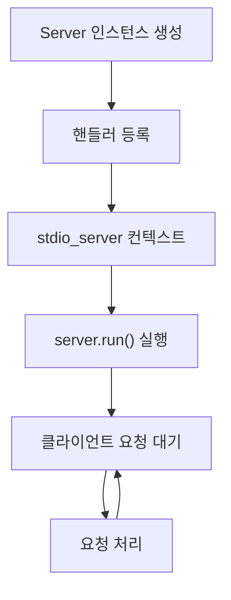
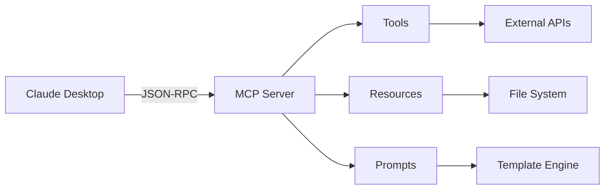

## MCP 라이브러리 개요

MCP는 **Anthropic**이 개발한 오픈 프로토콜로, AI 모델이 외부 데이터 소스와 도구에 안전하고 표준화된 방식으로 접근할 수 있게 합니다. 클라이언트-서버 아키텍처(architecture)를 사용하며, JSON-RPC 2.0 기반 메시징을 통해 통신합니다.

### 핵심 컨셉트(Concepts)

**서버(Server)**는 컨텍스트(context), 도구(tools), 프롬프트(prompts) 등의 리소스를 제공합니다. **클라이언트(Client)**는 Claude Desktop과 같은 호스트 애플리케이션으로, 서버와 연결하여 AI 모델에 추가 기능을 제공합니다.

---

## 주요 API 구성 요소

### 1. Server 클래스

서버 인스턴스(instance)를 생성하는 핵심 클래스입니다.

```python
from mcp.server import Server

server = Server("my-server")
```

**주요 메서드:**
- `list_tools()`: 사용 가능한 도구 목록 반환
- `call_tool()`: 특정 도구 실행
- `list_resources()`: 리소스 목록 제공
- `read_resource()`: 리소스 내용 읽기
- `list_prompts()`: 프롬프트 템플릿(template) 목록

### 2. stdio_server

표준 입출력(stdin/stdout)을 통해 서버를 실행하는 컨텍스트 매니저(context manager)입니다.

```python
from mcp.server.stdio import stdio_server

async def main():
    async with stdio_server() as (read_stream, write_stream):
        await server.run(read_stream, write_stream)
```

### 3. 데이터 타입 (mcp.types)

#### Tool
도구 정의를 위한 데이터 클래스입니다.

**속성:**
- `name`: 도구 이름 (유니크한 식별자)
- `description`: 도구 기능 설명
- `inputSchema`: JSON 스키마(schema) 형식의 파라미터(parameter) 정의

#### TextContent
텍스트 기반 응답을 나타냅니다.

**속성:**
- `type`: "text" (고정값)
- `text`: 실제 텍스트 내용

#### ImageContent
이미지 데이터를 전달합니다.

**속성:**
- `type`: "image"
- `data`: Base64 인코딩(encoding)된 이미지
- `mimeType`: MIME 타입 (예: "image/png")

#### Resource
접근 가능한 데이터 리소스를 정의합니다.

**속성:**
- `uri`: 리소스 식별자 (예: "file:///path/to/file")
- `name`: 리소스 이름
- `description`: 설명
- `mimeType`: 콘텐츠 타입

---

## 데코레이터(Decorators) API

### @server.list_tools()
사용 가능한 도구 목록을 반환하는 핸들러(handler)를 등록합니다.

```python
@server.list_tools()
async def handle_list_tools() -> list[Tool]:
    return [
        Tool(
            name="calculate",
            description="수학 계산 수행",
            inputSchema={
                "type": "object",
                "properties": {
                    "expression": {"type": "string"}
                }
            }
        )
    ]
```

### @server.call_tool()
도구 실행 요청을 처리합니다.

```python
@server.call_tool()
async def handle_call_tool(name: str, arguments: dict) -> list[TextContent]:
    if name == "calculate":
        result = eval(arguments["expression"])
        return [TextContent(type="text", text=str(result))]
```

### @server.list_resources()
리소스 목록을 제공합니다.

### @server.read_resource()
특정 리소스의 내용을 읽습니다.

### @server.list_prompts()
사용 가능한 프롬프트 템플릿을 나열합니다.

### @server.get_prompt()
프롬프트 템플릿의 내용을 가져옵니다.

---

## 서버 실행 흐름



### 1. **초기화 페이즈(Phase)**
- Server 객체 생성
- 도구, 리소스, 프롬프트 핸들러 등록

### 2. **실행 페이즈**
- `stdio_server()` 컨텍스트 진입
- 스트림(stream) 생성 및 서버 실행
- 이벤트 루프(event loop)에서 요청 처리

### 3. **요청-응답 사이클(Cycle)**
- 클라이언트 요청 수신
- 적절한 핸들러 호출
- 결과 반환

---

## 통신 프로토콜

MCP는 **JSON-RPC 2.0**을 사용합니다.

### 요청 예시
```json
{
  "jsonrpc": "2.0",
  "id": 1,
  "method": "tools/call",
  "params": {
    "name": "calculate",
    "arguments": {"expression": "2+2"}
  }
}
```

### 응답 예시
```json
{
  "jsonrpc": "2.0",
  "id": 1,
  "result": {
    "content": [
      {"type": "text", "text": "4"}
    ]
  }
}
```

---

## 에러 핸들링(Error Handling)

```python
from mcp.types import McpError

@server.call_tool()
async def handle_call_tool(name: str, arguments: dict):
    if name not in supported_tools:
        raise McpError(
            code=-32601,
            message=f"도구 '{name}'을 찾을 수 없습니다"
        )
```

**표준 에러 코드:**
- `-32700`: 파싱(Parse) 에러
- `-32600`: 잘못된 요청
- `-32601`: 메서드를 찾을 수 없음
- `-32602`: 잘못된 파라미터
- `-32603`: 내부 에러

---

## 설정 및 배포(Deployment)

### Claude Desktop 연동

`claude_desktop_config.json` 파일에 서버 등록:

```json
{
  "mcpServers": {
    "my-server": {
      "command": "python",
      "args": ["-m", "my_mcp_server"],
      "env": {
        "API_KEY": "your-key"
      }
    }
  }
}
```

### 환경 변수(Environment Variables)

```python
import os

api_key = os.getenv("API_KEY")
```

---

## 보안 고려사항

1. **입력 검증(Validation)**: 모든 파라미터 검증 필수
2. **권한 관리**: 파일 시스템 접근 제한
3. **에러 메시지**: 민감한 정보 노출 방지
4. **리소스 제한**: 메모리 및 CPU 사용량 모니터링(monitoring)

---

## 고급 기능

### 스트리밍 응답

대용량 데이터를 청크(chunk) 단위로 전송:

```python
async def stream_data():
    for chunk in data_chunks:
        yield TextContent(type="text", text=chunk)
```

### 상태 관리

서버 내부 상태 유지:

```python
class StatefulServer:
    def __init__(self):
        self.cache = {}
    
    async def get_cached(self, key):
        return self.cache.get(key)
```

### 비동기 처리(Asynchronous Processing)

```python
import asyncio

@server.call_tool()
async def handle_async_tool(name, arguments):
    result = await async_operation()
    return [TextContent(type="text", text=result)]
```

---

## 아키텍처 다이어그램



---

## 용어 목록

| 용어 | 설명 |
|------|------|
| Architecture | 시스템 구조 설계 방식 |
| Asynchronous Processing | 비동기 처리, 작업을 기다리지 않고 동시 실행 |
| Chunk | 데이터를 나눈 작은 단위 |
| Client | 서비스를 요청하는 프로그램 |
| Context | 실행 환경 또는 문맥 정보 |
| Context Manager | 리소스 관리를 자동화하는 Python 객체 |
| Cycle | 반복되는 처리 과정 |
| Decorator | 함수나 클래스를 수정하는 Python 문법 |
| Deployment | 소프트웨어를 운영 환경에 배포 |
| Encoding | 데이터를 특정 형식으로 변환 |
| Environment Variables | 운영체제 수준의 설정 값 |
| Error Handling | 오류 발생 시 처리 방법 |
| Event Loop | 비동기 작업을 관리하는 실행 루프 |
| Handler | 특정 이벤트를 처리하는 함수 |
| Instance | 클래스로부터 생성된 객체 |
| JSON-RPC | JSON 기반 원격 프로시저 호출 프로토콜 |
| Model Context Protocol | AI 모델과 도구 연결 표준 |
| Monitoring | 시스템 상태 감시 |
| Parameter | 함수에 전달되는 입력 값 |
| Phase | 프로세스의 단계 |
| Prompt | AI 모델에 전달하는 지시문 템플릿 |
| Resource | 접근 가능한 데이터 또는 파일 |
| Schema | 데이터 구조 정의 |
| Server | 서비스를 제공하는 프로그램 |
| Stream | 연속적인 데이터 흐름 |
| Template | 재사용 가능한 형식 틀 |
| Tool | MCP에서 실행 가능한 기능 |
| Validation | 데이터 유효성 검사 |