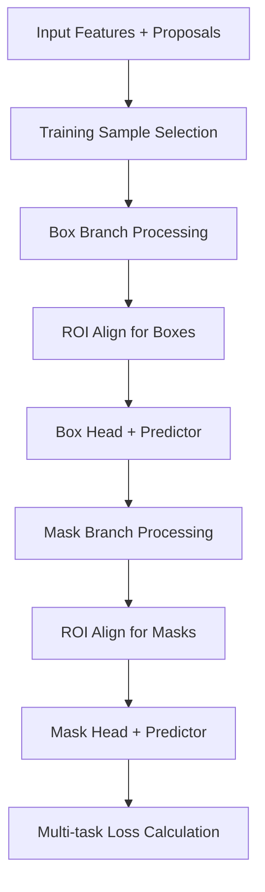

# Mask R-CNN 구조 분석 및 구현 가이드

## 목차

1. [개요](#1-개요)<br/>
2. [핵심 구조 분석](#2-핵심-구조-분석)<br/>
   1. [nn.Sequential 상속 구조](#21-nnsequential-상속-구조)<br/>
   2. [self.roi_heads 작동 방식](#22-selfroiheads-작동-방식)<br/>
3. [get_maskrcnn_resnet50_fpn 분석](#3-getmaskrcnnresnet50fpn-분석)<br/>
4. [구현 시 필수 고려사항](#4-구현-시-필수-고려사항)<br/>
5. [데이터셋 준비](#5-데이터셋-준비)<br/>
6. [실무 체크리스트](#6-실무-체크리스트)<br/>
7. [용어 정리](#7-용어-정리)<br/>

---

## 1. 개요

Mask R-CNN은 instance segmentation을 위한 딥러닝 모델로, Faster R-CNN을 기반으로 마스크 예측 분기(mask branch)를 추가한 구조입니다. PyTorch의 torchvision 라이브러리에서 제공하는 구현체를 중심으로 핵심 구조와 구현 방법을 분석합니다.

## 2. 핵심 구조 분석

### 2.1. nn.Sequential 상속 구조

#### 2.1.1. MaskRCNNHeads의 설계

MaskRCNNHeads 클래스는 nn.Sequential을 상속하여 마스크 헤드의 컨볼루션 레이어들을 순차적으로 구성합니다.

```python
class MaskRCNNHeads(nn.Sequential):
    def __init__(self, in_channels, layers, dilation):
        blocks = []
        next_feature = in_channels
        for layer_features in layers:
            blocks.append(
                misc_nn_ops.Conv2dNormActivation(
                    next_feature, layer_features, 
                    kernel_size=3, stride=1, 
                    padding=dilation, dilation=dilation
                )
            )
            next_feature = layer_features
        super().__init__(*blocks)  # nn.Sequential 초기화
```

#### 2.1.2. nn.Sequential 상속의 장점

- **자동 Forward 처리**: Sequential이 자동으로 forward() 메서드를 구현하여 순차적 데이터 처리
- **코드 간소화**: 커스텀 forward() 구현 불필요
- **모듈 관리**: 자동으로 각 레이어를 인덱스로 관리 (`self[0]`, `self[1]` 등)
- **State Dict 호환성**: _load_from_state_dict 메서드로 이전 버전과의 호환성 보장

#### 2.1.3. 버전 호환성 처리

```python
def _load_from_state_dict(self, state_dict, prefix, local_metadata, 
                         strict, missing_keys, unexpected_keys, error_msgs):
    version = local_metadata.get("version", None)
    
    if version is None or version < 2:
        # 이전 버전의 키 이름을 새 버전으로 변환
        for i in range(num_blocks):
            for type in ["weight", "bias"]:
                old_key = f"{prefix}mask_fcn{i+1}.{type}"  # 이전 버전 키
                new_key = f"{prefix}{i}.0.{type}"          # 새 버전 키
                if old_key in state_dict:
                    state_dict[new_key] = state_dict.pop(old_key)
```

**주의**: 이는 사전학습 모델 활용이 아닌 PyTorch 버전 업데이트 시 기존 체크포인트와의 호환성을 위한 메커니즘입니다.

### 2.2. self.roi_heads 작동 방식

#### 2.2.1. ROI (Region of Interest) 개념

ROI는 이미지에서 객체가 있을 것으로 예상되는 사각형 영역으로, Two-stage 객체 탐지의 핵심 개념입니다.

- **생성 과정**: RPN(Region Proposal Network)이 객체가 있을 가능성이 높은 영역들을 제안
- **표현 방식**: `(x1, y1, x2, y2)` 좌표 또는 `(batch_idx, x1, y1, x2, y2)` 형태
- **문제점**: 각 ROI는 크기와 비율이 다름 → FC layer 입력 불가

#### 2.2.2. ROI Pooling vs ROI Align

**ROI Pooling의 한계**:
- 많은 양자화(ceil, floor) 연산 사용
- ROI와 추출된 특징 간의 misalignment 발생

**ROI Align의 개선**:
- 양자화 연산 제거
- Bilinear interpolation 사용으로 정확한 특징값 계산

#### 2.2.3. RoIHeads 클래스 구조

```python
class RoIHeads(nn.Module):
    def __init__(self):
        # Box Detection 관련
        self.box_roi_pool = box_roi_pool      # ROI Align
        self.box_head = box_head              # Feature 변환
        self.box_predictor = box_predictor    # 분류 + 회귀
        
        # Mask Segmentation 관련 (Mask R-CNN)
        self.mask_roi_pool = mask_roi_pool    # ROI Align
        self.mask_head = mask_head            # MaskRCNNHeads
        self.mask_predictor = mask_predictor  # MaskRCNNPredictor
```

#### 2.2.4. Forward Pass 단계



**1단계: 훈련 샘플 선택**
```python
if self.training:
    proposals, matched_idxs, labels, regression_targets = \
        self.select_training_samples(proposals, targets)
```

**2단계: Box Branch 처리**
```python
box_features = self.box_roi_pool(features, proposals, image_shapes)
box_features = self.box_head(box_features)
class_logits, box_regression = self.box_predictor(box_features)
```

**3단계: Mask Branch 처리**
```python
if self.has_mask():
    mask_features = self.mask_roi_pool(features, mask_proposals, image_shapes)
    mask_features = self.mask_head(mask_features)      # MaskRCNNHeads
    mask_logits = self.mask_predictor(mask_features)   # 픽셀별 예측
```

## 3. get_maskrcnn_resnet50_fpn 분석

### 3.1. 함수의 역할

`get_maskrcnn_resnet50_fpn`은 **모델 아키텍처를 생성하는 빌더 함수**이며, 사전학습 가중치 사용 여부는 선택사항입니다.

```python
torchvision.models.detection.maskrcnn_resnet50_fpn(
    weights: Optional[MaskRCNN_ResNet50_FPN_Weights] = None,
    progress: bool = True,
    num_classes: Optional[int] = None,
    weights_backbone: Optional[ResNet50_Weights] = ResNet50_Weights.IMAGENET1K_V1,
    trainable_backbone_layers: Optional[int] = None,
    **kwargs
) → MaskRCNN
```

### 3.2. 핵심 구성 요소

#### 3.2.1. ResNet-50 백본

- **구조**: 50개 레이어를 가진 깊은 잔차 네트워크
- **Stage 구성**: Basic Stem + 4개 Stage (conv2_x, conv3_x, conv4_x, conv5_x)
- **출력**: C2, C3, C4, C5 (서로 다른 해상도의 특징맵)

#### 3.2.2. FPN (Feature Pyramid Network)

**Bottom-up Pathway (상향 경로)**:
- ResNet-50의 일반적인 순전파
- 상위 레벨로 갈수록 공간 해상도 ↓, 의미 정보 ↑

**Top-down Pathway (하향 경로)**:
```python
# 의사 코드
P5 = 1x1_conv(C5)  # 최고 레벨부터 시작
P4 = 1x1_conv(C4) + upsample(P5)  # 상위 레벨과 융합
P3 = 1x1_conv(C3) + upsample(P4)  # 반복
P2 = 1x1_conv(C2) + upsample(P3)  # 최종
```

**Lateral Connections (측면 연결)**:
- 1x1 컨볼루션으로 채널 수를 256으로 통일
- 요소별 덧셈으로 특징 융합

### 3.3. 사용 패턴

#### 3.3.1. 완전한 사전학습 모델
```python
model = maskrcnn_resnet50_fpn(weights="DEFAULT")
# ✅ COCO에서 학습된 전체 모델 가중치 로드
```

#### 3.3.2. 백본만 사전학습
```python
model = maskrcnn_resnet50_fpn(
    weights=None,
    weights_backbone=ResNet50_Weights.IMAGENET1K_V1
)
# ✅ ResNet-50 백본만 ImageNet 가중치
# ❌ RPN, ROI Heads는 랜덤 초기화
```

#### 3.3.3. 완전 랜덤 초기화
```python
model = maskrcnn_resnet50_fpn(
    weights=None,
    weights_backbone=None
)
# ❌ 모든 가중치 랜덤 초기화
```

## 4. 구현 시 필수 고려사항

### 4.1. 클래스 개수 설정

```python
# 배경 클래스를 포함한 총 개수
num_classes = 배경(1) + 실제_객체_클래스_수

# 예시: 사람만 탐지 → num_classes = 2
model = maskrcnn_resnet50_fpn(
    weights="DEFAULT",
    num_classes=2
)
```

### 4.2. 헤드 교체

클래스 수 변경 시 prediction head들이 자동으로 교체됩니다:

```python
def get_model_instance_segmentation(num_classes):
    model = torchvision.models.detection.maskrcnn_resnet50_fpn(weights="DEFAULT")
    
    # Box predictor 교체
    in_features = model.roi_heads.box_predictor.cls_score.in_features
    model.roi_heads.box_predictor = FastRCNNPredictor(in_features, num_classes)
    
    # Mask predictor 교체  
    in_features_mask = model.roi_heads.mask_predictor.conv5_mask.in_channels
    hidden_layer = 256
    model.roi_heads.mask_predictor = MaskRCNNPredictor(
        in_features_mask, hidden_layer, num_classes
    )
    
    return model
```

### 4.3. 훈련 가능한 백본 레이어

```python
# 데이터셋 크기에 따른 권장사항
if dataset_size < 1000:
    trainable_layers = 0  # 백본 완전 고정 (overfitting 방지)
elif dataset_size < 5000:
    trainable_layers = 1  # 최상위 레이어만 훈련
else:
    trainable_layers = 3  # 기본값 (균형잡힌 설정)
```

## 5. 데이터셋 준비

### 5.1. targets 딕셔너리 구조

#### 5.1.1. 필수 키 (변경 불가능)

```python
targets = [{
    'boxes': torch.FloatTensor([[x1, y1, x2, y2]]),  # [N, 4] - 필수
    'labels': torch.LongTensor([1]),                 # [N] - 필수, 1부터 시작
    'masks': torch.ByteTensor([mask]),               # [N, H, W] - 필수
}]
```

#### 5.1.2. 선택 키 (평가용)

```python
targets = [{
    # ... 필수 키들
    'image_id': torch.tensor([img_id]),     # COCO 평가용
    'area': torch.tensor([area]),           # 박스 면적
    'iscrowd': torch.tensor([0]),          # 군중 객체 여부 (기본: 0)
}]
```

#### 5.1.3. 추가 가능한 커스텀 키

```python
targets = [{
    # ... 필수/선택 키들
    'custom_metadata': {'object_name': 'car'},
    'difficulty': 'hard',
    'original_annotation': raw_data,  # 원본 데이터 보존
}]
```

### 5.2. PNG 마스크 처리

#### 5.2.1. 개별 PNG 파일 → Array 변환

```python
def load_individual_masks(mask_paths):
    masks = []
    for mask_path in mask_paths:
        # PIL로 로드
        mask_pil = Image.open(mask_path)
        mask_array = np.array(mask_pil)
        
        # 이진 마스크로 변환 (0 또는 1)
        binary_mask = (mask_array > 0).astype(np.uint8)
        masks.append(binary_mask)
    
    # [N, H, W] 형태의 텐서로 변환
    masks_tensor = torch.tensor(masks, dtype=torch.uint8)
    return masks_tensor
```

#### 5.2.2. 통합 PNG → 개별 마스크 분리

```python
def extract_instance_masks(combined_mask_path):
    # PNG 로드
    mask_image = Image.open(combined_mask_path)
    mask_array = np.array(mask_image)
    
    # 고유한 인스턴스 ID 찾기 (배경 0 제외)
    instance_ids = np.unique(mask_array)
    instance_ids = instance_ids[instance_ids > 0]
    
    masks = []
    for instance_id in instance_ids:
        # 각 인스턴스별 이진 마스크 생성
        instance_mask = (mask_array == instance_id).astype(np.uint8)
        masks.append(instance_mask)
    
    return torch.tensor(masks, dtype=torch.uint8)
```

### 5.3. Dataset 클래스 구현

```python
class MaskDataset(torch.utils.data.Dataset):
    def __init__(self, image_dir, mask_dir, class_to_idx):
        self.image_dir = image_dir
        self.mask_dir = mask_dir
        self.class_to_idx = class_to_idx
        self.images = sorted(os.listdir(image_dir))
    
    def __getitem__(self, idx):
        # 이미지 로드
        img_path = os.path.join(self.image_dir, self.images[idx])
        image = Image.open(img_path).convert('RGB')
        
        # 마스크 처리
        img_name = os.path.splitext(self.images[idx])[0]
        mask_files = [f for f in os.listdir(self.mask_dir) 
                     if f.startswith(img_name)]
        
        masks = []
        labels = []
        boxes = []
        
        for mask_file in mask_files:
            # 마스크 로드 및 이진화
            mask_path = os.path.join(self.mask_dir, mask_file)
            mask_array = np.array(Image.open(mask_path).convert('L'))
            binary_mask = (mask_array > 128).astype(np.uint8)
            
            if binary_mask.sum() == 0:  # 빈 마스크 제외
                continue
                
            masks.append(binary_mask)
            
            # 클래스 추출
            class_name = mask_file.split('_')[1].split('.')[0][:-1]
            labels.append(self.class_to_idx[class_name])
            
            # 바운딩 박스 생성
            pos = np.where(binary_mask)
            boxes.append([
                np.min(pos[1]), np.min(pos[0]),  # xmin, ymin
                np.max(pos[1]), np.max(pos[0])   # xmax, ymax
            ])
        
        # 텐서 변환
        target = {
            'boxes': torch.tensor(boxes, dtype=torch.float32),
            'labels': torch.tensor(labels, dtype=torch.int64),
            'masks': torch.tensor(masks, dtype=torch.uint8),
            'image_id': torch.tensor([idx]),
        }
        
        return transforms.ToTensor()(image), target
```

## 6. 실무 체크리스트

### 6.1. 데이터 관련

- [ ] **이미지 정규화**: 입력 이미지가 [0-1] 범위인지 확인
- [ ] **레이블 인덱싱**: 클래스 레이블이 1부터 시작하는지 확인 (0은 배경용)
- [ ] **마스크 데이터 타입**: torch.uint8 또는 torch.bool 사용
- [ ] **바운딩 박스 검증**: x1 < x2, y1 < y2, 이미지 범위 내 좌표 확인
- [ ] **빈 마스크 처리**: 면적이 0인 마스크 제외

### 6.2. 모델 설정

- [ ] **사전학습 여부**: weights 매개변수로 사전학습 모델 사용 결정
- [ ] **클래스 수**: num_classes = 배경(1) + 실제 클래스 수
- [ ] **훈련 가능 레이어**: trainable_backbone_layers 데이터셋 크기에 맞게 조정
- [ ] **헤드 교체**: 클래스 수 변경 시 Box/Mask predictor 교체 확인

### 6.3. 훈련 설정

- [ ] **배치 처리**: 리스트 형태로 전달 (torch.stack 사용 금지)
- [ ] **모델 모드**: 훈련 시 model.train(), 추론 시 model.eval()
- [ ] **GPU 메모리**: 일반적으로 batch_size=1~4 사용
- [ ] **손실 함수**: 다중 손실 합계로 역전파 수행
- [ ] **옵티마이저**: 백본과 헤드에 차별적 학습률 적용

### 6.4. 평가 및 추론

- [ ] **추론 모드**: targets 없이 이미지만 입력
- [ ] **후처리**: NMS, score threshold 적용
- [ ] **평가 메트릭**: COCO 평가 메트릭 사용 (mAP)

### 6.5. 자주 하는 실수

- ❌ **이미지가 [0-255] 범위** → [0-1]로 정규화 필수
- ❌ **레이블이 0부터 시작** → 1부터 시작 필수  
- ❌ **배치를 torch.stack으로 처리** → 리스트로 전달
- ❌ **추론 시에도 targets 전달** → 추론 시엔 targets 제거
- ❌ **바운딩 박스 좌표 순서 실수** → [x1, y1, x2, y2] 순서 준수

### 6.6. 최적화 옵션

```python
# Mixed Precision Training
from torch.cuda.amp import autocast, GradScaler

scaler = GradScaler()
with autocast():
    losses = model(images, targets)
    loss = sum(losses.values())

scaler.scale(loss).backward()
scaler.step(optimizer)
scaler.update()
```

```python
# DataLoader 설정
def collate_fn(batch):
    images, targets = zip(*batch)
    return list(images), list(targets)

dataloader = DataLoader(
    dataset, 
    batch_size=2, 
    collate_fn=collate_fn,
    num_workers=4,
    pin_memory=True
)
```

## 7. 용어 정리

| 용어 | 영문 | 설명 |
|------|------|------|
| 관심 영역 | ROI (Region of Interest) | 객체가 있을 것으로 예상되는 사각형 영역 |
| 영역 제안 네트워크 | RPN (Region Proposal Network) | 객체가 있을 가능성이 높은 영역을 제안하는 네트워크 |
| 특징 피라미드 네트워크 | FPN (Feature Pyramid Network) | 다중 스케일 특징을 융합하는 넥 네트워크 |
| 관심 영역 정렬 | ROI Align | 양자화 없이 bilinear interpolation으로 특징을 추출하는 방법 |
| 인스턴스 분할 | Instance Segmentation | 객체의 경계를 픽셀 단위로 구분하는 작업 |
| 마스크 분기 | Mask Branch | 픽셀별 마스크를 예측하는 네트워크 분기 |
| 다중 작업 학습 | Multi-task Learning | 분류, 회귀, 분할을 동시에 학습하는 방식 |
| 사전 훈련 | Pre-training | 대규모 데이터셋에서 미리 학습된 모델 |
| 미세 조정 | Fine-tuning | 사전 훈련 모델을 새로운 작업에 맞게 조정하는 과정 |
| 배경 억제 | NMS (Non-Maximum Suppression) | 중복된 탐지 결과를 제거하는 후처리 기법 |