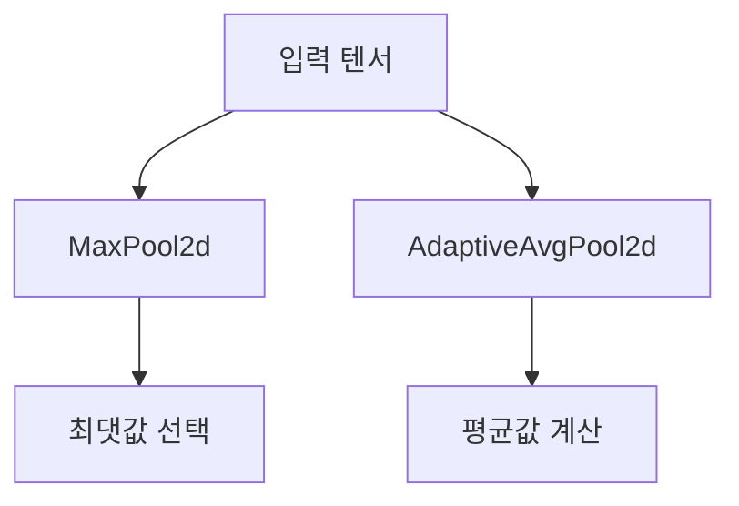

# 1. 풀링(Pooling) 연산의 이해

## 1.1. MaxPool2d

- **정의**: 주어진 커널(window) 내에서 **최댓값**을 선택하여 출력하는 풀링 방식.
- **목적**: 특징을 강조하고, 위치 변화에 강인한 표현을 얻기 위함.
- **예시**:  
  입력 텐서에서 `2x2` 커널을 적용하면 각 영역에서 가장 큰 값만 남김.

$$
\text{MaxPool2d}:
\begin{bmatrix}
1 & 3 \\
2 & 4
\end{bmatrix}
\rightarrow \max(1, 2, 3, 4) = 4
$$

## 1.2. AdaptiveAvgPool2d

- **정의**: 입력 텐서를 **지정된 출력 크기**로 맞추기 위해 평균값을 사용하여 축소하는 풀링 방식.
- **목적**: 다양한 입력 크기를 고정된 출력 크기로 변환할 때 유용함.
- **특징**: 커널 크기를 자동으로 계산하여 평균 풀링 수행.

$$
\text{AdaptiveAvgPool2d}(output\_size=(1,1)) \Rightarrow \text{전체 평균}
$$

예시:

$$
\text{AdaptiveAvgPool2d}:
\begin{bmatrix}
1 & 3 \\
2 & 4
\end{bmatrix}
\rightarrow \frac{1+2+3+4}{4} = 2.5
$$

---

# 2. 시각적 구조 (Mermaid)

---

# 3. 요약 비교

| 항목 | MaxPool2d | AdaptiveAvgPool2d |
|------|-----------|-------------------|
| 방식 | 최댓값 선택 | 평균값 계산 |
| 출력 크기 | 커널 크기에 따라 결정 | 지정된 크기로 자동 조정 |
| 목적 | 특징 강조 | 크기 정규화 |
| 위치 민감도 | 낮음 | 낮음 |

---
