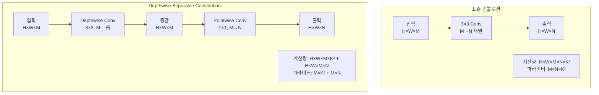
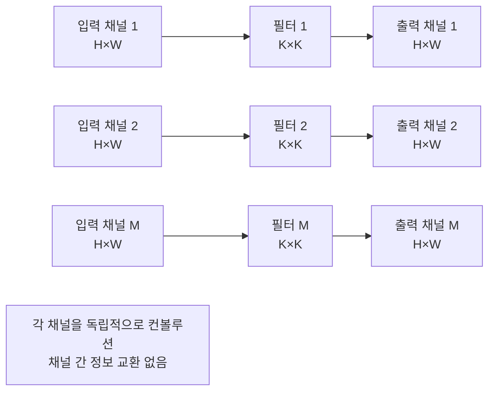
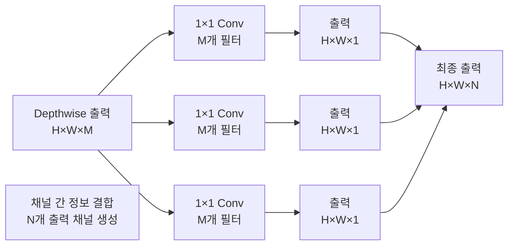
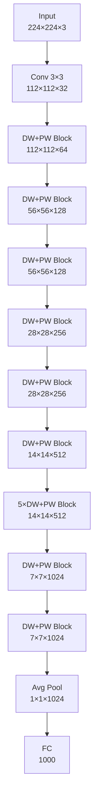
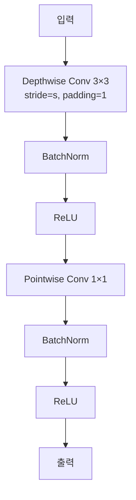

# MobileNet - 모바일 디바이스를 위한 효율적인 CNN

## 개요

MobileNet은 2017년 Google에서 Andrew G. Howard 등에 의해 개발된 모바일 디바이스에 최적화된 합성곱 신경망입니다. "MobileNets: Efficient Convolutional Neural Networks for Mobile Vision Applications" 논문으로 발표되었으며, Depthwise Separable Convolution을 핵심으로 하여 계산량과 파라미터 수를 대폭 줄이면서도 합리적인 성능을 유지하는 혁신적인 모델입니다.

## MobileNet의 핵심 아이디어

### 기존 CNN의 문제점
- **높은 계산 복잡도**: 모바일 디바이스에서 실행하기 어려움
- **많은 파라미터**: 메모리 사용량이 높음
- **느린 추론 속도**: 실시간 애플리케이션에 부적합
- **높은 전력 소비**: 배터리 수명에 악영향

### MobileNet의 해결책
- **Depthwise Separable Convolution**: 표준 컨볼루션을 분해하여 계산량 대폭 감소
- **Width Multiplier (α)**: 네트워크 너비 조절로 모델 크기 제어
- **Resolution Multiplier (ρ)**: 입력 해상도 조절로 계산량 제어
- **효율성-정확도 트레이드오프**: 다양한 리소스 제약에 맞는 모델 제공

## Depthwise Separable Convolution

### 표준 컨볼루션 vs Depthwise Separable Convolution



### Depthwise Convolution 단계



### Pointwise Convolution 단계



## 계산 복잡도 분석

### 표준 컨볼루션
```
계산량 = H × W × M × N × K²
파라미터 = M × N × K²
```

### Depthwise Separable Convolution
```
Depthwise: H × W × M × K²
Pointwise: H × W × M × N
총 계산량 = H × W × M × K² + H × W × M × N
총 파라미터 = M × K² + M × N
```

### 효율성 비교
```
계산량 감소 비율 = (H×W×M×K² + H×W×M×N) / (H×W×M×N×K²)
                = 1/N + 1/K²
                
3×3 컨볼루션의 경우: 1/N + 1/9
일반적으로 8~9배 계산량 감소
```

## MobileNet v1 구조

### 전체 네트워크 아키텍처



### Depthwise Separable Block 구조



### MobileNet v1 상세 구조 표

| Type | Stride | Filter Shape | Input Size |
|------|--------|--------------|------------|
| Conv | 2 | 3×3×3×32 | 224×224×3 |
| Conv dw | 1 | 3×3×32 dw | 112×112×32 |
| Conv pw | 1 | 1×1×32×64 | 112×112×32 |
| Conv dw | 2 | 3×3×64 dw | 112×112×64 |
| Conv pw | 1 | 1×1×64×128 | 56×56×64 |
| Conv dw | 1 | 3×3×128 dw | 56×56×128 |
| Conv pw | 1 | 1×1×128×128 | 56×56×128 |
| Conv dw | 2 | 3×3×128 dw | 56×56×128 |
| Conv pw | 1 | 1×1×128×256 | 28×28×128 |
| Conv dw | 1 | 3×3×256 dw | 28×28×256 |
| Conv pw | 1 | 1×1×256×256 | 28×28×256 |
| Conv dw | 2 | 3×3×256 dw | 28×28×256 |
| Conv pw | 1 | 1×1×256×512 | 14×14×256 |
| 5× [Conv dw + Conv pw] | 1 | 3×3×512 dw + 1×1×512×512 | 14×14×512 |
| Conv dw | 2 | 3×3×512 dw | 14×14×512 |
| Conv pw | 1 | 1×1×512×1024 | 7×7×512 |
| Conv dw | 1 | 3×3×1024 dw | 7×7×1024 |
| Conv pw | 1 | 1×1×1024×1024 | 7×7×1024 |
| Avg Pool | 1 | Pool 7×7 | 7×7×1024 |
| FC | 1 | 1024×1000 | 1×1×1024 |

## PyTorch 구현 예제

### Depthwise Separable Convolution 구현

```python
import torch
import torch.nn as nn
import torch.nn.functional as F

class DepthwiseSeparableConv(nn.Module):
    def __init__(self, in_channels, out_channels, kernel_size=3, stride=1, padding=1):
        super(DepthwiseSeparableConv, self).__init__()
        
        # Depthwise Convolution
        self.depthwise = nn.Conv2d(
            in_channels, in_channels, kernel_size=kernel_size,
            stride=stride, padding=padding, groups=in_channels, bias=False
        )
        self.bn1 = nn.BatchNorm2d(in_channels)
        
        # Pointwise Convolution
        self.pointwise = nn.Conv2d(
            in_channels, out_channels, kernel_size=1,
            stride=1, padding=0, bias=False
        )
        self.bn2 = nn.BatchNorm2d(out_channels)
    
    def forward(self, x):
        # Depthwise
        x = self.depthwise(x)
        x = self.bn1(x)
        x = F.relu(x, inplace=True)
        
        # Pointwise
        x = self.pointwise(x)
        x = self.bn2(x)
        x = F.relu(x, inplace=True)
        
        return x

# 사용 예제
ds_conv = DepthwiseSeparableConv(32, 64, kernel_size=3, stride=1, padding=1)
input_tensor = torch.randn(4, 32, 56, 56)
output = ds_conv(input_tensor)
print(f"입력: {input_tensor.shape}, 출력: {output.shape}")
```

### 완전한 MobileNet v1 구현

```python
class MobileNetV1(nn.Module):
    def __init__(self, num_classes=1000, width_mult=1.0):
        super(MobileNetV1, self).__init__()
        
        # Width multiplier 적용을 위한 함수
        def make_divisible(v, divisor=8):
            return max(divisor, int(v + divisor / 2) // divisor * divisor)
        
        # 첫 번째 표준 컨볼루션
        input_channel = make_divisible(32 * width_mult)
        self.conv1 = nn.Sequential(
            nn.Conv2d(3, input_channel, kernel_size=3, stride=2, padding=1, bias=False),
            nn.BatchNorm2d(input_channel),
            nn.ReLU(inplace=True)
        )
        
        # Depthwise Separable Convolution layers
        # [input_channels, output_channels, stride]
        self.cfg = [
            [32, 64, 1],
            [64, 128, 2],
            [128, 128, 1],
            [128, 256, 2],
            [256, 256, 1],
            [256, 512, 2],
            [512, 512, 1],
            [512, 512, 1],
            [512, 512, 1],
            [512, 512, 1],
            [512, 512, 1],
            [512, 1024, 2],
            [1024, 1024, 1]
        ]
        
        layers = []
        for in_ch, out_ch, stride in self.cfg:
            in_ch = make_divisible(in_ch * width_mult)
            out_ch = make_divisible(out_ch * width_mult)
            layers.append(DepthwiseSeparableConv(in_ch, out_ch, 
                                               kernel_size=3, stride=stride, padding=1))
        
        self.features = nn.Sequential(*layers)
        
        # Classifier
        self.classifier = nn.Sequential(
            nn.AdaptiveAvgPool2d((1, 1)),
            nn.Flatten(),
            nn.Dropout(0.2),
            nn.Linear(make_divisible(1024 * width_mult), num_classes)
        )
        
        # Weight initialization
        self._initialize_weights()
    
    def _initialize_weights(self):
        for m in self.modules():
            if isinstance(m, nn.Conv2d):
                nn.init.kaiming_normal_(m.weight, mode='fan_out', nonlinearity='relu')
                if m.bias is not None:
                    nn.init.constant_(m.bias, 0)
            elif isinstance(m, nn.BatchNorm2d):
                nn.init.constant_(m.weight, 1)
                nn.init.constant_(m.bias, 0)
            elif isinstance(m, nn.Linear):
                nn.init.normal_(m.weight, 0, 0.01)
                nn.init.constant_(m.bias, 0)
    
    def forward(self, x):
        x = self.conv1(x)
        x = self.features(x)
        x = self.classifier(x)
        return x

# 다양한 width multiplier로 모델 생성
def mobilenet_v1(num_classes=1000, width_mult=1.0):
    return MobileNetV1(num_classes=num_classes, width_mult=width_mult)

# 사용 예제
model = mobilenet_v1(num_classes=1000, width_mult=1.0)
print(f"총 파라미터 수: {sum(p.numel() for p in model.parameters()):,}")

# 입력 테스트
x = torch.randn(2, 3, 224, 224)
output = model(x)
print(f"출력 크기: {output.shape}")
```

### Width Multiplier와 Resolution Multiplier 구현

```python
class ScalableMobileNetV1(nn.Module):
    """Width와 Resolution Multiplier를 지원하는 MobileNet v1"""
    
    def __init__(self, num_classes=1000, width_mult=1.0, resolution_mult=1.0):
        super(ScalableMobileNetV1, self).__init__()
        
        self.resolution_mult = resolution_mult
        self.input_size = int(224 * resolution_mult)
        
        # Width multiplier 적용
        def make_divisible(v, divisor=8):
            return max(divisor, int(v + divisor / 2) // divisor * divisor)
        
        # 기본 MobileNet v1 구조
        input_channel = make_divisible(32 * width_mult)
        
        self.conv1 = nn.Sequential(
            nn.Conv2d(3, input_channel, kernel_size=3, stride=2, padding=1, bias=False),
            nn.BatchNorm2d(input_channel),
            nn.ReLU(inplace=True)
        )
        
        # Feature layers
        self.cfg = [
            [32, 64, 1], [64, 128, 2], [128, 128, 1], [128, 256, 2],
            [256, 256, 1], [256, 512, 2], [512, 512, 1], [512, 512, 1],
            [512, 512, 1], [512, 512, 1], [512, 512, 1], [512, 1024, 2],
            [1024, 1024, 1]
        ]
        
        layers = []
        for in_ch, out_ch, stride in self.cfg:
            in_ch = make_divisible(in_ch * width_mult)
            out_ch = make_divisible(out_ch * width_mult)
            layers.append(DepthwiseSeparableConv(in_ch, out_ch, 3, stride, 1))
        
        self.features = nn.Sequential(*layers)
        
        # Classifier
        self.classifier = nn.Sequential(
            nn.AdaptiveAvgPool2d((1, 1)),
            nn.Flatten(),
            nn.Dropout(0.2),
            nn.Linear(make_divisible(1024 * width_mult), num_classes)
        )
        
        self._initialize_weights()
    
    def _initialize_weights(self):
        for m in self.modules():
            if isinstance(m, nn.Conv2d):
                nn.init.kaiming_normal_(m.weight, mode='fan_out', nonlinearity='relu')
            elif isinstance(m, nn.BatchNorm2d):
                nn.init.constant_(m.weight, 1)
                nn.init.constant_(m.bias, 0)
            elif isinstance(m, nn.Linear):
                nn.init.normal_(m.weight, 0, 0.01)
                nn.init.constant_(m.bias, 0)
    
    def forward(self, x):
        # Resolution multiplier 적용 (입력 크기 조정)
        if self.resolution_mult != 1.0:
            size = (self.input_size, self.input_size)
            x = F.interpolate(x, size=size, mode='bilinear', align_corners=False)
        
        x = self.conv1(x)
        x = self.features(x)
        x = self.classifier(x)
        return x

# 다양한 설정으로 모델 생성
configurations = [
    (1.0, 1.0),    # 표준 MobileNet
    (0.75, 1.0),   # 0.75× width
    (0.5, 1.0),    # 0.5× width  
    (0.25, 1.0),   # 0.25× width
    (1.0, 0.857),  # 192×192 해상도
    (1.0, 0.714),  # 160×160 해상도
    (1.0, 0.571)   # 128×128 해상도
]

print("다양한 MobileNet v1 설정:")
print("=" * 50)

for width_mult, res_mult in configurations:
    model = ScalableMobileNetV1(num_classes=1000, 
                               width_mult=width_mult, 
                               resolution_mult=res_mult)
    
    params = sum(p.numel() for p in model.parameters())
    input_size = int(224 * res_mult)
    
    print(f"Width {width_mult:4.2f}×, Resolution {input_size}×{input_size}: {params:7,} params")
```

## MobileNet v2와 v3

### MobileNet v2: Inverted Residuals

```python
class InvertedResidual(nn.Module):
    """MobileNet v2의 Inverted Residual Block"""
    
    def __init__(self, in_channels, out_channels, stride, expand_ratio):
        super(InvertedResidual, self).__init__()
        
        self.stride = stride
        self.use_residual = stride == 1 and in_channels == out_channels
        
        hidden_dim = int(round(in_channels * expand_ratio))
        
        layers = []
        
        # Expansion (1×1 conv)
        if expand_ratio != 1:
            layers.extend([
                nn.Conv2d(in_channels, hidden_dim, 1, 1, 0, bias=False),
                nn.BatchNorm2d(hidden_dim),
                nn.ReLU6(inplace=True)
            ])
        
        # Depthwise (3×3 conv)
        layers.extend([
            nn.Conv2d(hidden_dim, hidden_dim, 3, stride, 1, groups=hidden_dim, bias=False),
            nn.BatchNorm2d(hidden_dim),
            nn.ReLU6(inplace=True),
            
            # Projection (1×1 conv, no activation)
            nn.Conv2d(hidden_dim, out_channels, 1, 1, 0, bias=False),
            nn.BatchNorm2d(out_channels)
        ])
        
        self.conv = nn.Sequential(*layers)
    
    def forward(self, x):
        if self.use_residual:
            return x + self.conv(x)
        else:
            return self.conv(x)

class MobileNetV2(nn.Module):
    def __init__(self, num_classes=1000, width_mult=1.0):
        super(MobileNetV2, self).__init__()
        
        def make_divisible(v, divisor=8):
            return max(divisor, int(v + divisor / 2) // divisor * divisor)
        
        input_channel = make_divisible(32 * width_mult)
        last_channel = make_divisible(1280 * max(1.0, width_mult))
        
        # First conv
        self.conv1 = nn.Sequential(
            nn.Conv2d(3, input_channel, 3, 2, 1, bias=False),
            nn.BatchNorm2d(input_channel),
            nn.ReLU6(inplace=True)
        )
        
        # Inverted residual blocks
        # [expand_ratio, channels, num_blocks, stride]
        self.cfg = [
            [1, 16, 1, 1],
            [6, 24, 2, 2],
            [6, 32, 3, 2],
            [6, 64, 4, 2],
            [6, 96, 3, 1],
            [6, 160, 3, 2],
            [6, 320, 1, 1]
        ]
        
        layers = []
        in_ch = input_channel
        
        for expand_ratio, out_ch, num_blocks, stride in self.cfg:
            out_ch = make_divisible(out_ch * width_mult)
            
            for i in range(num_blocks):
                if i == 0:
                    layers.append(InvertedResidual(in_ch, out_ch, stride, expand_ratio))
                else:
                    layers.append(InvertedResidual(in_ch, out_ch, 1, expand_ratio))
                in_ch = out_ch
        
        self.features = nn.Sequential(*layers)
        
        # Last conv
        self.conv2 = nn.Sequential(
            nn.Conv2d(in_ch, last_channel, 1, 1, 0, bias=False),
            nn.BatchNorm2d(last_channel),
            nn.ReLU6(inplace=True)
        )
        
        # Classifier
        self.classifier = nn.Sequential(
            nn.AdaptiveAvgPool2d((1, 1)),
            nn.Flatten(),
            nn.Dropout(0.2),
            nn.Linear(last_channel, num_classes)
        )
        
        self._initialize_weights()
    
    def _initialize_weights(self):
        for m in self.modules():
            if isinstance(m, nn.Conv2d):
                nn.init.kaiming_normal_(m.weight, mode='fan_out', nonlinearity='relu')
            elif isinstance(m, nn.BatchNorm2d):
                nn.init.constant_(m.weight, 1)
                nn.init.constant_(m.bias, 0)
            elif isinstance(m, nn.Linear):
                nn.init.normal_(m.weight, 0, 0.01)
                nn.init.constant_(m.bias, 0)
    
    def forward(self, x):
        x = self.conv1(x)
        x = self.features(x)
        x = self.conv2(x)
        x = self.classifier(x)
        return x

def mobilenet_v2(num_classes=1000, width_mult=1.0):
    return MobileNetV2(num_classes=num_classes, width_mult=width_mult)
```

### MobileNet v3: Neural Architecture Search + Hard Swish

```python
class HardSwish(nn.Module):
    """Hard Swish 활성화 함수"""
    def __init__(self, inplace=True):
        super(HardSwish, self).__init__()
        self.inplace = inplace

    def forward(self, x):
        return x * F.relu6(x + 3) / 6

class HardSigmoid(nn.Module):
    """Hard Sigmoid 활성화 함수"""
    def __init__(self, inplace=True):
        super(HardSigmoid, self).__init__()
        self.inplace = inplace

    def forward(self, x):
        return F.relu6(x + 3) / 6

class SEBlock(nn.Module):
    """MobileNet v3에서 사용되는 SE Block"""
    
    def __init__(self, in_channels, reduction=4):
        super(SEBlock, self).__init__()
        
        self.avg_pool = nn.AdaptiveAvgPool2d(1)
        self.fc = nn.Sequential(
            nn.Linear(in_channels, in_channels // reduction),
            nn.ReLU(inplace=True),
            nn.Linear(in_channels // reduction, in_channels),
            HardSigmoid()
        )
    
    def forward(self, x):
        b, c, _, _ = x.size()
        y = self.avg_pool(x).view(b, c)
        y = self.fc(y).view(b, c, 1, 1)
        return x * y.expand_as(x)

class InvertedResidualV3(nn.Module):
    """MobileNet v3의 Inverted Residual Block (SE + Hard Swish)"""
    
    def __init__(self, in_channels, hidden_channels, out_channels, 
                 kernel_size, stride, use_se, use_hs):
        super(InvertedResidualV3, self).__init__()
        
        self.identity = stride == 1 and in_channels == out_channels
        
        # Activation 선택
        if use_hs:
            activation = HardSwish
        else:
            activation = nn.ReLU
        
        # Expansion
        self.conv1 = nn.Conv2d(in_channels, hidden_channels, 1, 1, 0, bias=False)
        self.bn1 = nn.BatchNorm2d(hidden_channels)
        self.act1 = activation(inplace=True)
        
        # Depthwise
        self.conv2 = nn.Conv2d(hidden_channels, hidden_channels, kernel_size, 
                              stride, kernel_size//2, groups=hidden_channels, bias=False)
        self.bn2 = nn.BatchNorm2d(hidden_channels)
        self.act2 = activation(inplace=True)
        
        # SE Block
        if use_se:
            self.se = SEBlock(hidden_channels)
        else:
            self.se = nn.Identity()
        
        # Projection
        self.conv3 = nn.Conv2d(hidden_channels, out_channels, 1, 1, 0, bias=False)
        self.bn3 = nn.BatchNorm2d(out_channels)
    
    def forward(self, x):
        identity = x
        
        # Expansion
        out = self.act1(self.bn1(self.conv1(x)))
        
        # Depthwise
        out = self.act2(self.bn2(self.conv2(out)))
        
        # SE
        out = self.se(out)
        
        # Projection
        out = self.bn3(self.conv3(out))
        
        # Residual connection
        if self.identity:
            return out + identity
        else:
            return out

# MobileNet v3 Small 설정
def mobilenet_v3_small(num_classes=1000):
    """MobileNet v3 Small 모델"""
    
    # [in_channels, hidden_channels, out_channels, kernel_size, stride, use_se, use_hs]
    cfg = [
        [16, 16, 16, 3, 2, True, False],   # bneck, 112×112
        [16, 72, 24, 3, 2, False, False],  # bneck, 56×56
        [24, 88, 24, 3, 1, False, False],  # bneck, 56×56
        [24, 96, 40, 5, 2, True, True],    # bneck, 28×28
        [40, 240, 40, 5, 1, True, True],   # bneck, 28×28
        [40, 240, 40, 5, 1, True, True],   # bneck, 28×28
        [40, 120, 48, 5, 1, True, True],   # bneck, 28×28
        [48, 144, 48, 5, 1, True, True],   # bneck, 28×28
        [48, 288, 96, 5, 2, True, True],   # bneck, 14×14
        [96, 576, 96, 5, 1, True, True],   # bneck, 14×14
        [96, 576, 96, 5, 1, True, True],   # bneck, 14×14
    ]
    
    return cfg

def mobilenet_v3_large(num_classes=1000):
    """MobileNet v3 Large 모델"""
    
    # [in_channels, hidden_channels, out_channels, kernel_size, stride, use_se, use_hs]
    cfg = [
        [16, 16, 16, 3, 1, False, False],   # bneck, 112×112
        [16, 64, 24, 3, 2, False, False],   # bneck, 56×56
        [24, 72, 24, 3, 1, False, False],   # bneck, 56×56
        [24, 72, 40, 5, 2, True, False],    # bneck, 28×28
        [40, 120, 40, 5, 1, True, False],   # bneck, 28×28
        [40, 120, 40, 5, 1, True, False],   # bneck, 28×28
        [40, 240, 80, 3, 2, False, True],   # bneck, 14×14
        [80, 200, 80, 3, 1, False, True],   # bneck, 14×14
        [80, 184, 80, 3, 1, False, True],   # bneck, 14×14
        [80, 184, 80, 3, 1, False, True],   # bneck, 14×14
        [80, 480, 112, 3, 1, True, True],   # bneck, 14×14
        [112, 672, 112, 3, 1, True, True],  # bneck, 14×14
        [112, 672, 160, 5, 2, True, True],  # bneck, 7×7
        [160, 960, 160, 5, 1, True, True],  # bneck, 7×7
        [160, 960, 160, 5, 1, True, True],  # bneck, 7×7
    ]
    
    return cfg
```

## CIFAR-10 학습 예제

```python
import torch.optim as optim
from torchvision import datasets, transforms
from torch.utils.data import DataLoader

# CIFAR-10용 MobileNet v1 (입력 크기 조정)
class MobileNetV1CIFAR(nn.Module):
    def __init__(self, num_classes=10, width_mult=1.0):
        super(MobileNetV1CIFAR, self).__init__()
        
        def make_divisible(v, divisor=8):
            return max(divisor, int(v + divisor / 2) // divisor * divisor)
        
        # CIFAR-10에 맞게 첫 레이어 조정 (stride=1)
        input_channel = make_divisible(32 * width_mult)
        self.conv1 = nn.Sequential(
            nn.Conv2d(3, input_channel, kernel_size=3, stride=1, padding=1, bias=False),
            nn.BatchNorm2d(input_channel),
            nn.ReLU(inplace=True)
        )
        
        # CIFAR-10용 설정 (더 적은 다운샘플링)
        self.cfg = [
            [32, 64, 1],    # 32×32
            [64, 128, 2],   # 16×16
            [128, 128, 1],  # 16×16
            [128, 256, 2],  # 8×8
            [256, 256, 1],  # 8×8
            [256, 512, 2],  # 4×4
            [512, 512, 1],  # 4×4
            [512, 512, 1],  # 4×4
        ]
        
        layers = []
        for in_ch, out_ch, stride in self.cfg:
            in_ch = make_divisible(in_ch * width_mult)
            out_ch = make_divisible(out_ch * width_mult)
            layers.append(DepthwiseSeparableConv(in_ch, out_ch, 3, stride, 1))
        
        self.features = nn.Sequential(*layers)
        
        # Classifier
        final_channels = make_divisible(512 * width_mult)
        self.classifier = nn.Sequential(
            nn.AdaptiveAvgPool2d((1, 1)),
            nn.Flatten(),
            nn.Dropout(0.2),
            nn.Linear(final_channels, num_classes)
        )
        
        self._initialize_weights()
    
    def _initialize_weights(self):
        for m in self.modules():
            if isinstance(m, nn.Conv2d):
                nn.init.kaiming_normal_(m.weight, mode='fan_out', nonlinearity='relu')
            elif isinstance(m, nn.BatchNorm2d):
                nn.init.constant_(m.weight, 1)
                nn.init.constant_(m.bias, 0)
            elif isinstance(m, nn.Linear):
                nn.init.normal_(m.weight, 0, 0.01)
                nn.init.constant_(m.bias, 0)
    
    def forward(self, x):
        x = self.conv1(x)
        x = self.features(x)
        x = self.classifier(x)
        return x

# 데이터 전처리
transform_train = transforms.Compose([
    transforms.RandomCrop(32, padding=4),
    transforms.RandomHorizontalFlip(),
    transforms.ToTensor(),
    transforms.Normalize((0.4914, 0.4822, 0.4465), (0.2023, 0.1994, 0.2010))
])

transform_test = transforms.Compose([
    transforms.ToTensor(),
    transforms.Normalize((0.4914, 0.4822, 0.4465), (0.2023, 0.1994, 0.2010))
])

# 데이터셋 로드
train_dataset = datasets.CIFAR10('./data', train=True, download=True, transform=transform_train)
test_dataset = datasets.CIFAR10('./data', train=False, transform=transform_test)

train_loader = DataLoader(train_dataset, batch_size=128, shuffle=True, num_workers=2)
test_loader = DataLoader(test_dataset, batch_size=100, shuffle=False, num_workers=2)

# 모델 및 학습 설정
device = torch.device('cuda' if torch.cuda.is_available() else 'cpu')
model = MobileNetV1CIFAR(num_classes=10, width_mult=1.0).to(device)
criterion = nn.CrossEntropyLoss()
optimizer = optim.SGD(model.parameters(), lr=0.1, momentum=0.9, weight_decay=1e-4)
scheduler = optim.lr_scheduler.MultiStepLR(optimizer, milestones=[100, 150], gamma=0.1)

# 학습 함수
def train_epoch(epoch):
    model.train()
    train_loss = 0
    correct = 0
    total = 0
    
    for batch_idx, (data, target) in enumerate(train_loader):
        data, target = data.to(device), target.to(device)
        
        optimizer.zero_grad()
        output = model(data)
        loss = criterion(output, target)
        loss.backward()
        optimizer.step()
        
        train_loss += loss.item()
        _, predicted = output.max(1)
        total += target.size(0)
        correct += predicted.eq(target).sum().item()
        
        if batch_idx % 100 == 0:
            print(f'Epoch {epoch}, Batch {batch_idx}, '
                  f'Loss: {train_loss/(batch_idx+1):.4f}, '
                  f'Acc: {100.*correct/total:.2f}%')

# 테스트 함수
def test():
    model.eval()
    test_loss = 0
    correct = 0
    total = 0
    
    with torch.no_grad():
        for data, target in test_loader:
            data, target = data.to(device), target.to(device)
            output = model(data)
            test_loss += criterion(output, target).item()
            _, predicted = output.max(1)
            total += target.size(0)
            correct += predicted.eq(target).sum().item()
    
    accuracy = 100. * correct / total
    print(f'Test Accuracy: {accuracy:.2f}%')
    return accuracy

# 학습 실행
best_acc = 0
for epoch in range(200):
    train_epoch(epoch)
    acc = test()
    scheduler.step()
    
    if acc > best_acc:
        best_acc = acc
        torch.save(model.state_dict(), 'mobilenet_v1_cifar10_best.pth')

print(f'Best Test Accuracy: {best_acc:.2f}%')
```

## 효율성 분석 및 벤치마크

### 계산 복잡도 비교

```python
def compare_computational_complexity():
    """다양한 CNN 모델들의 계산 복잡도 비교"""
    
    def calculate_flops(model, input_size=(1, 3, 224, 224)):
        """FLOPs 계산 (근사치)"""
        model.eval()
        
        def conv_flop_count(input_shape, output_shape, kernel_size, groups=1):
            batch_size, in_c, in_h, in_w = input_shape
            batch_size, out_c, out_h, out_w = output_shape
            kernel_h, kernel_w = kernel_size
            
            kernel_flops = kernel_h * kernel_w * (in_c // groups)
            output_elements = batch_size * out_c * out_h * out_w
            return kernel_flops * output_elements
        
        # 간단한 FLOPs 추정
        total_flops = 0
        
        # 각 레이어별 FLOPs 계산 (실제로는 더 정확한 도구 사용 권장)
        x = torch.randn(*input_size)
        
        def flop_hook(module, input, output):
            nonlocal total_flops
            if isinstance(module, nn.Conv2d):
                input_shape = input[0].shape
                output_shape = output.shape
                kernel_size = module.kernel_size
                groups = module.groups
                
                flops = conv_flop_count(input_shape, output_shape, kernel_size, groups)
                total_flops += flops
        
        # Hook 등록
        hooks = []
        for module in model.modules():
            if isinstance(module, nn.Conv2d):
                hooks.append(module.register_forward_hook(flop_hook))
        
        # Forward pass
        with torch.no_grad():
            _ = model(x)
        
        # Hook 제거
        for hook in hooks:
            hook.remove()
        
        return total_flops
    
    # 모델들 비교
    models = {
        'MobileNet v1 (1.0)': mobilenet_v1(width_mult=1.0),
        'MobileNet v1 (0.75)': mobilenet_v1(width_mult=0.75),
        'MobileNet v1 (0.5)': mobilenet_v1(width_mult=0.5),
        'MobileNet v1 (0.25)': mobilenet_v1(width_mult=0.25),
        'MobileNet v2 (1.0)': mobilenet_v2(width_mult=1.0),
        'MobileNet v2 (0.75)': mobilenet_v2(width_mult=0.75),
    }
    
    print("모델별 효율성 비교:")
    print("=" * 70)
    print(f"{'Model':<20} {'Parameters':<12} {'FLOPs (M)':<12} {'Size (MB)':<10}")
    print("-" * 70)
    
    for name, model in models.items():
        # 파라미터 수
        params = sum(p.numel() for p in model.parameters())
        
        # FLOPs (간단한 추정)
        flops = calculate_flops(model) / 1e6  # Million FLOPs
        
        # 모델 크기 (MB)
        param_size = params * 4 / 1024 / 1024  # 4 bytes per parameter
        
        print(f"{name:<20} {params:<12,} {flops:<12.1f} {param_size:<10.1f}")

compare_computational_complexity()
```

### 추론 속도 벤치마크

```python
def benchmark_inference_speed():
    """다양한 MobileNet 모델들의 추론 속도 비교"""
    
    import time
    import torch.utils.benchmark as benchmark
    
    device = torch.device('cuda' if torch.cuda.is_available() else 'cpu')
    
    models = {
        'MobileNet v1 (1.0)': mobilenet_v1(width_mult=1.0),
        'MobileNet v1 (0.75)': mobilenet_v1(width_mult=0.75),
        'MobileNet v1 (0.5)': mobilenet_v1(width_mult=0.5),
        'MobileNet v1 (0.25)': mobilenet_v1(width_mult=0.25),
        'MobileNet v2 (1.0)': mobilenet_v2(width_mult=1.0),
    }
    
    batch_sizes = [1, 8, 32]
    
    print("추론 속도 벤치마크:")
    print("=" * 80)
    
    for batch_size in batch_sizes:
        print(f"\n배치 크기: {batch_size}")
        print("-" * 50)
        print(f"{'Model':<20} {'Time (ms)':<12} {'Throughput (img/s)':<18}")
        print("-" * 50)
        
        for name, model in models.items():
            model = model.to(device).eval()
            
            # 추론 시간 측정
            timer = benchmark.Timer(
                stmt='model(x)',
                setup='import torch',
                globals={
                    'model': model,
                    'x': torch.randn(batch_size, 3, 224, 224).to(device)
                }
            )
            
            result = timer.timeit(100)
            throughput = batch_size / result.mean
            
            print(f"{name:<20} {result.mean*1000:<12.2f} {throughput:<18.1f}")

benchmark_inference_speed()
```

## 모바일 배포 최적화

### 모델 양자화 (Quantization)

```python
def quantize_mobilenet():
    """MobileNet 모델 양자화"""
    
    # 원본 모델
    model = mobilenet_v1(num_classes=1000, width_mult=1.0)
    model.eval()
    
    # Dynamic Quantization: 일반적으로 Linear에 적용 (Conv2d는 per-channel 등으로 별도 처리)
    quantized_model = torch.quantization.quantize_dynamic(
        model, {nn.Linear}, dtype=torch.qint8
    )
    
    # Static Quantization (더 정확한 양자화)
    def prepare_static_quantization(model):
        model.qconfig = torch.quantization.get_default_qconfig('fbgemm')
        torch.quantization.prepare(model, inplace=True)
        
        # Calibration (실제로는 대표 데이터셋 사용)
        with torch.no_grad():
            for _ in range(100):
                x = torch.randn(1, 3, 224, 224)
                model(x)
        
        torch.quantization.convert(model, inplace=True)
        return model
    
    # 크기 비교
    def get_model_size(model):
        import tempfile, os
        with tempfile.NamedTemporaryFile(delete=False, suffix='.pth') as f:
            path = f.name
        torch.save(model.state_dict(), path)
        size = os.path.getsize(path) / 1024 / 1024  # MB
        try:
            os.remove(path)
        except OSError:
            pass
        return size
    
    original_size = get_model_size(model)
    quantized_size = get_model_size(quantized_model)
    
    print("모델 양자화 결과:")
    print("=" * 30)
    print(f"원본 모델 크기: {original_size:.2f} MB")
    print(f"양자화 모델 크기: {quantized_size:.2f} MB")
    print(f"압축률: {original_size/quantized_size:.1f}×")
    
    return quantized_model

quantized_model = quantize_mobilenet()
```

### 모델 프루닝 (Pruning)

```python
def prune_mobilenet():
    """MobileNet 모델 프루닝"""
    
    import torch.nn.utils.prune as prune
    
    import copy
    model = mobilenet_v1(num_classes=1000, width_mult=1.0)
    
    # 구조적 프루닝 (채널 단위)
    def structured_pruning(model, pruning_ratio=0.3):
        for name, module in model.named_modules():
            if isinstance(module, nn.Conv2d):
                # L1 norm 기반 채널 프루닝
                prune.ln_structured(
                    module, name='weight', amount=pruning_ratio, 
                    n=1, dim=0  # 출력 채널 기준
                )
        return model
    
    # 비구조적 프루닝 (가중치 단위)
    def unstructured_pruning(model, pruning_ratio=0.5):
        parameters_to_prune = []
        for name, module in model.named_modules():
            if isinstance(module, (nn.Conv2d, nn.Linear)):
                parameters_to_prune.append((module, 'weight'))
        
        # Global magnitude pruning
        prune.global_unstructured(
            parameters_to_prune,
            pruning_method=prune.L1Unstructured,
            amount=pruning_ratio,
        )
        return model
    
    # 프루닝 적용 (원본 모델을 보존하기 위해 deepcopy 사용)
    pruned_model = structured_pruning(copy.deepcopy(model), 0.3)
    
    # 실제 가중치 제거
    for name, module in pruned_model.named_modules():
        if isinstance(module, (nn.Conv2d, nn.Linear)):
            try:
                prune.remove(module, 'weight')
            except:
                pass
    
    # 성능 비교 (실제로 0이 아닌 파라미터 수 기준)
    def count_nonzero_params(m):
        return sum((p.abs() > 0).float().sum().item() for p in m.parameters())

    original_params = count_nonzero_params(model)
    pruned_params = count_nonzero_params(pruned_model)
    
    print("모델 프루닝 결과:")
    print("=" * 30)
    print(f"원본 파라미터: {original_params:,}")
    print(f"프루닝 후 파라미터: {pruned_params:,}")
    print(f"압축률: {original_params/pruned_params:.1f}×")
    
    return pruned_model

pruned_model = prune_mobilenet()
```

### 지식 증류 (Knowledge Distillation)

```python
class MobileNetDistillation(nn.Module):
    """MobileNet을 위한 지식 증류"""
    
    def __init__(self, teacher_model, student_model, temperature=4.0):
        super(MobileNetDistillation, self).__init__()
        self.teacher = teacher_model
        self.student = student_model
        self.temperature = temperature
        
        # Teacher 모델 고정
        for param in self.teacher.parameters():
            param.requires_grad = False
    
    def forward(self, x):
        with torch.no_grad():
            teacher_logits = self.teacher(x)
        
        student_logits = self.student(x)
        
        return student_logits, teacher_logits
    
    def distillation_loss(self, student_logits, teacher_logits, labels, alpha=0.7):
        # Soft target loss
        soft_teacher = F.softmax(teacher_logits / self.temperature, dim=1)
        soft_student = F.log_softmax(student_logits / self.temperature, dim=1)
        soft_loss = F.kl_div(soft_student, soft_teacher, reduction='batchmean')
        soft_loss = soft_loss * (self.temperature ** 2)
        
        # Hard target loss
        hard_loss = F.cross_entropy(student_logits, labels)
        
        return alpha * soft_loss + (1 - alpha) * hard_loss

# 사용 예제
def setup_distillation():
    # Teacher: 큰 모델 (ResNet-50 등)
    import torchvision.models as models
    teacher = models.resnet50(pretrained=True)
    
    # Student: MobileNet
    student = mobilenet_v1(width_mult=0.5)  # 경량 버전
    
    # 지식 증류 모델
    distill_model = MobileNetDistillation(teacher, student)
    
    print("지식 증류 설정:")
    teacher_params = sum(p.numel() for p in teacher.parameters())
    student_params = sum(p.numel() for p in student.parameters())
    
    print(f"Teacher 파라미터: {teacher_params:,}")
    print(f"Student 파라미터: {student_params:,}")
    print(f"압축률: {teacher_params/student_params:.1f}×")
    
    return distill_model

distill_model = setup_distillation()
```

## 실무 활용 사례

### 1. 실시간 객체 탐지

```python
class MobileNetSSD(nn.Module):
    """MobileNet 기반 SSD (Single Shot MultiBox Detector)"""
    
    def __init__(self, num_classes=21, width_mult=1.0):
        super(MobileNetSSD, self).__init__()
        
        # MobileNet backbone
        self.backbone = mobilenet_v1(width_mult=width_mult)
        
        # SSD 추가 레이어들
        self.extra_layers = nn.ModuleList([
            nn.Sequential(
                nn.Conv2d(1024, 256, 1),
                nn.ReLU(inplace=True),
                nn.Conv2d(256, 512, 3, stride=2, padding=1),
                nn.ReLU(inplace=True)
            ),
            nn.Sequential(
                nn.Conv2d(512, 128, 1),
                nn.ReLU(inplace=True),
                nn.Conv2d(128, 256, 3, stride=2, padding=1),
                nn.ReLU(inplace=True)
            ),
            nn.Sequential(
                nn.Conv2d(256, 128, 1),
                nn.ReLU(inplace=True),
                nn.Conv2d(128, 256, 3),
                nn.ReLU(inplace=True)
            ),
            nn.Sequential(
                nn.Conv2d(256, 128, 1),
                nn.ReLU(inplace=True),
                nn.Conv2d(128, 256, 3),
                nn.ReLU(inplace=True)
            )
        ])
        
        # Classification과 localization 헤드
        self.num_classes = num_classes
        self.num_priors = [4, 6, 6, 6, 4, 4]  # 각 feature map별 prior box 수
        
        self.loc_layers = nn.ModuleList()
        self.conf_layers = nn.ModuleList()
        
        # 각 feature map에 대한 예측 레이어
        source_channels = [512, 1024, 512, 256, 256, 256]
        for i, (ch, num_prior) in enumerate(zip(source_channels, self.num_priors)):
            self.loc_layers.append(nn.Conv2d(ch, num_prior * 4, 3, padding=1))
            self.conf_layers.append(nn.Conv2d(ch, num_prior * num_classes, 3, padding=1))
    
    def forward(self, x):
        sources = []
        
        # Backbone에서 feature 추출
        # (실제로는 중간 feature들도 추출해야 함)
        x = self.backbone.features(x)
        sources.append(x)
        
        # Extra layers
        for layer in self.extra_layers:
            x = layer(x)
            sources.append(x)
        
        # 예측
        loc_preds = []
        conf_preds = []
        
        for source, loc_layer, conf_layer in zip(sources, self.loc_layers, self.conf_layers):
            loc_preds.append(loc_layer(source).permute(0, 2, 3, 1).contiguous())
            conf_preds.append(conf_layer(source).permute(0, 2, 3, 1).contiguous())
        
        # Flatten
        loc = torch.cat([pred.view(pred.size(0), -1) for pred in loc_preds], 1)
        conf = torch.cat([pred.view(pred.size(0), -1) for pred in conf_preds], 1)
        
        return loc.view(loc.size(0), -1, 4), conf.view(conf.size(0), -1, self.num_classes)

# 사용 예제
ssd_model = MobileNetSSD(num_classes=21, width_mult=1.0)
print(f"MobileNet-SSD 파라미터: {sum(p.numel() for p in ssd_model.parameters()):,}")
```

### 2. 세그멘테이션 (DeepLab Mobile)

```python
class MobileNetDeepLab(nn.Module):
    """MobileNet 기반 DeepLab 세그멘테이션"""
    
    def __init__(self, num_classes=21, width_mult=1.0):
        super(MobileNetDeepLab, self).__init__()
        
        # MobileNet encoder
        self.encoder = mobilenet_v1(width_mult=width_mult)
        
        # ASPP (Atrous Spatial Pyramid Pooling)
        self.aspp = nn.ModuleList([
            nn.Sequential(
                nn.Conv2d(1024, 256, 1, bias=False),
                nn.BatchNorm2d(256),
                nn.ReLU(inplace=True)
            ),
            nn.Sequential(
                nn.Conv2d(1024, 256, 3, padding=6, dilation=6, bias=False),
                nn.BatchNorm2d(256),
                nn.ReLU(inplace=True)
            ),
            nn.Sequential(
                nn.Conv2d(1024, 256, 3, padding=12, dilation=12, bias=False),
                nn.BatchNorm2d(256),
                nn.ReLU(inplace=True)
            ),
            nn.Sequential(
                nn.Conv2d(1024, 256, 3, padding=18, dilation=18, bias=False),
                nn.BatchNorm2d(256),
                nn.ReLU(inplace=True)
            ),
            nn.Sequential(
                nn.AdaptiveAvgPool2d((1, 1)),
                nn.Conv2d(1024, 256, 1, bias=False),
                nn.BatchNorm2d(256),
                nn.ReLU(inplace=True)
            )
        ])
        
        # ASPP fusion
        self.aspp_conv = nn.Sequential(
            nn.Conv2d(256 * 5, 256, 1, bias=False),
            nn.BatchNorm2d(256),
            nn.ReLU(inplace=True),
            nn.Dropout(0.5)
        )
        
        # Final classifier
        self.classifier = nn.Conv2d(256, num_classes, 1)
    
    def forward(self, x):
        input_size = x.shape[-2:]
        
        # Encoder
        features = self.encoder.features(x)
        
        # ASPP
        aspp_features = []
        for i, aspp_layer in enumerate(self.aspp):
            if i == 4:  # Global average pooling
                feat = aspp_layer(features)
                feat = F.interpolate(feat, size=features.shape[-2:], 
                                   mode='bilinear', align_corners=False)
            else:
                feat = aspp_layer(features)
            aspp_features.append(feat)
        
        # Concatenate ASPP features
        x = torch.cat(aspp_features, dim=1)
        x = self.aspp_conv(x)
        
        # Final prediction
        x = self.classifier(x)
        
        # Upsample to input size
        x = F.interpolate(x, size=input_size, mode='bilinear', align_corners=False)
        
        return x

# 사용 예제
segmentation_model = MobileNetDeepLab(num_classes=21, width_mult=1.0)
print(f"MobileNet-DeepLab 파라미터: {sum(p.numel() for p in segmentation_model.parameters()):,}")
```

## 성능 분석 및 최적화 팁

### MobileNet 버전별 비교

```python
def compare_mobilenet_versions():
    """MobileNet 버전별 성능 비교"""
    
    performance_data = {
        'Model': [
            'MobileNet v1', 'MobileNet v1 (0.75×)', 'MobileNet v1 (0.5×)', 'MobileNet v1 (0.25×)',
            'MobileNet v2', 'MobileNet v2 (0.75×)', 'MobileNet v2 (0.5×)',
            'MobileNet v3 Large', 'MobileNet v3 Small'
        ],
        'Top-1 Accuracy (%)': [
            70.6, 68.4, 63.7, 50.6,  # v1
            72.0, 69.8, 65.4,        # v2
            75.2, 67.4               # v3
        ],
        'Parameters (M)': [
            4.2, 2.6, 1.3, 0.5,      # v1
            3.4, 2.6, 1.95,          # v2
            5.4, 2.9                 # v3
        ],
        'FLOPs (M)': [
            575, 325, 149, 41,       # v1
            300, 209, 97,            # v2
            219, 66                  # v3
        ],
        'Latency (ms)': [
            113, 94, 73, 39,         # v1 (CPU)
            75, 61, 54,              # v2 (CPU)
            51, 15                   # v3 (CPU)
        ]
    }
    
    import pandas as pd
    df = pd.DataFrame(performance_data)
    
    print("MobileNet 버전별 성능 비교:")
    print("=" * 80)
    print(df.to_string(index=False))
    
    print("\n주요 개선사항:")
    print("- v1 → v2: Inverted Residual, Linear Bottleneck으로 정확도 향상")
    print("- v2 → v3: NAS, Hard Swish, SE 블록으로 효율성 대폭 개선")
    print("- Width multiplier로 정확도-효율성 트레이드오프 조절 가능")

compare_mobilenet_versions()
```

### 최적화 가이드라인

```python
def optimization_guidelines():
    """MobileNet 최적화 가이드라인"""
    
    guidelines = {
        "하드웨어별 최적화": {
            "CPU": [
                "Width multiplier 0.5-0.75 권장",
                "Resolution 160×160 또는 192×192",
                "양자화 적용 (INT8)",
                "NEON 최적화 활용"
            ],
            "GPU": [
                "Width multiplier 1.0 사용 가능",
                "Resolution 224×224",
                "Mixed precision training",
                "TensorRT 최적화"
            ],
            "모바일 NPU": [
                "Width multiplier 0.75-1.0",
                "Fixed-point 양자화",
                "전용 최적화 라이브러리 사용",
                "메모리 대역폭 고려"
            ]
        },
        "배포 환경별 설정": {
            "실시간 애플리케이션": [
                "MobileNet v3 Small 권장",
                "Width multiplier 0.5-0.75",
                "Resolution 128×128 ~ 160×160",
                "프레임 드롭 허용"
            ],
            "고정밀 애플리케이션": [
                "MobileNet v3 Large 사용",
                "Width multiplier 1.0",
                "Resolution 224×224 이상",
                "앙상블 기법 적용"
            ],
            "배터리 절약": [
                "가장 작은 모델 사용",
                "적응적 해상도 조절",
                "Dynamic inference 적용",
                "주기적 실행"
            ]
        }
    }
    
    print("MobileNet 최적화 가이드라인:")
    print("=" * 50)
    
    for category, subcategories in guidelines.items():
        print(f"\n{category}:")
        for subcat, items in subcategories.items():
            print(f"  {subcat}:")
            for item in items:
                print(f"    - {item}")

optimization_guidelines()
```

### 성능 프로파일링

```python
def profile_mobilenet_performance():
    """MobileNet 성능 프로파일링"""
    
    import torch.profiler
    import torch.utils.benchmark as benchmark
    
    model = mobilenet_v1(width_mult=1.0)
    model.eval()
    
    device = torch.device('cuda' if torch.cuda.is_available() else 'cpu')
    model = model.to(device)
    
    # 레이어별 시간 측정
    def layer_profiling():
        input_tensor = torch.randn(1, 3, 224, 224).to(device)
        
        with torch.profiler.profile(
            activities=[torch.profiler.ProfilerActivity.CPU, torch.profiler.ProfilerActivity.CUDA],
            record_shapes=True,
            profile_memory=True,
            with_stack=True
        ) as prof:
            with torch.profiler.record_function("model_inference"):
                output = model(input_tensor)
        
        # 결과 출력
        print("레이어별 성능 분석:")
        print("=" * 60)
        print(prof.key_averages().table(sort_by="cpu_time_total", row_limit=10))
        
        return prof
    
    # 메모리 사용량 분석
    def memory_profiling():
        if torch.cuda.is_available():
            torch.cuda.reset_peak_memory_stats()
            
            input_tensor = torch.randn(1, 3, 224, 224).cuda()
            output = model(input_tensor)
            
            memory_allocated = torch.cuda.max_memory_allocated() / 1024**2  # MB
            memory_reserved = torch.cuda.max_memory_reserved() / 1024**2    # MB
            
            print(f"\nGPU 메모리 사용량:")
            print(f"  할당된 메모리: {memory_allocated:.2f} MB")
            print(f"  예약된 메모리: {memory_reserved:.2f} MB")
        
        # CPU 메모리는 대략적으로 계산
        params_memory = sum(p.numel() * p.element_size() for p in model.parameters()) / 1024**2
        print(f"  파라미터 메모리: {params_memory:.2f} MB")
    
    # 배치 크기별 처리량
    def throughput_analysis():
        batch_sizes = [1, 4, 8, 16, 32]
        
        print(f"\n배치 크기별 처리량:")
        print("=" * 40)
        print(f"{'Batch Size':<12} {'Time (ms)':<12} {'Throughput':<12}")
        print("-" * 40)
        
        for bs in batch_sizes:
            timer = benchmark.Timer(
                stmt='model(x)',
                globals={
                    'model': model,
                    'x': torch.randn(bs, 3, 224, 224).to(device)
                }
            )
            
            result = timer.timeit(100)
            throughput = bs / result.mean
            
            print(f"{bs:<12} {result.mean*1000:<12.2f} {throughput:<12.1f}")
    
    # 프로파일링 실행
    prof = layer_profiling()
    memory_profiling()
    throughput_analysis()
    
    return prof

# 프로파일링 실행
# prof = profile_mobilenet_performance()
```

## 최신 연구 동향

### 1. Neural Architecture Search (NAS)

```python
class NASMobileNet(nn.Module):
    """NAS로 최적화된 MobileNet 아키텍처"""
    
    def __init__(self, architecture_config, num_classes=1000):
        super(NASMobileNet, self).__init__()
        
        # NAS로 찾은 아키텍처 설정
        # [input_channels, output_channels, kernel_size, stride, expansion_ratio, se_ratio]
        self.architecture = architecture_config
        
        # Stem
        self.stem = nn.Sequential(
            nn.Conv2d(3, 32, 3, stride=2, padding=1, bias=False),
            nn.BatchNorm2d(32),
            HardSwish()
        )
        
        # NAS blocks
        layers = []
        in_channels = 32
        
        for config in self.architecture:
            out_ch, kernel, stride, exp_ratio, se_ratio = config
            
            if se_ratio > 0:
                se_block = SEBlock(int(in_channels * exp_ratio), reduction=int(1/se_ratio))
            else:
                se_block = nn.Identity()
            
            # 최적화된 블록 구성
            layers.append(
                self._make_efficient_block(
                    in_channels, out_ch, kernel, stride, exp_ratio, se_block
                )
            )
            in_channels = out_ch
        
        self.features = nn.Sequential(*layers)
        
        # Head
        self.head = nn.Sequential(
            nn.Conv2d(in_channels, 1280, 1, bias=False),
            nn.BatchNorm2d(1280),
            HardSwish(),
            nn.AdaptiveAvgPool2d((1, 1)),
            nn.Flatten(),
            nn.Linear(1280, num_classes)
        )
    
    def _make_efficient_block(self, in_ch, out_ch, kernel, stride, exp_ratio, se_block):
        """효율성이 최적화된 블록 생성"""
        
        hidden_ch = int(in_ch * exp_ratio)
        
        # Depthwise separable convolution with optimizations
        block = nn.Sequential(
            # Pointwise expansion
            nn.Conv2d(in_ch, hidden_ch, 1, bias=False),
            nn.BatchNorm2d(hidden_ch),
            HardSwish(),
            
            # Depthwise convolution
            nn.Conv2d(hidden_ch, hidden_ch, kernel, stride=stride, 
                     padding=kernel//2, groups=hidden_ch, bias=False),
            nn.BatchNorm2d(hidden_ch),
            se_block,
            HardSwish(),
            
            # Pointwise projection
            nn.Conv2d(hidden_ch, out_ch, 1, bias=False),
            nn.BatchNorm2d(out_ch)
        )
        
        return block
    
    def forward(self, x):
        x = self.stem(x)
        x = self.features(x)
        x = self.head(x)
        return x

# NAS로 찾은 아키텍처 예시
efficient_architecture = [
    [24, 3, 1, 3, 0.25],    # [out_ch, kernel, stride, exp_ratio, se_ratio]
    [24, 3, 2, 3, 0],
    [40, 5, 2, 3, 0.25],
    [40, 5, 1, 3, 0.25],
    [80, 3, 2, 6, 0],
    [80, 3, 1, 2.5, 0],
    [112, 3, 1, 6, 0.25],
    [112, 3, 1, 6, 0.25],
    [160, 5, 2, 6, 0.25],
    [160, 5, 1, 6, 0.25],
    [160, 5, 1, 6, 0.25]
]

nas_model = NASMobileNet(efficient_architecture, num_classes=1000)
print(f"NAS MobileNet 파라미터: {sum(p.numel() for p in nas_model.parameters()):,}")
```

### 2. 동적 추론 (Dynamic Inference)

```python
class AdaptiveMobileNet(nn.Module):
    """입력에 따라 동적으로 계산량을 조절하는 MobileNet"""
    
    def __init__(self, base_model, complexity_predictor):
        super(AdaptiveMobileNet, self).__init__()
        
        self.base_model = base_model
        self.complexity_predictor = complexity_predictor
        
        # 다양한 exit point들
        self.early_exits = nn.ModuleList([
            nn.Sequential(
                nn.AdaptiveAvgPool2d((1, 1)),
                nn.Flatten(),
                nn.Linear(64, 1000)
            ),
            nn.Sequential(
                nn.AdaptiveAvgPool2d((1, 1)),
                nn.Flatten(),
                nn.Linear(128, 1000)
            ),
            nn.Sequential(
                nn.AdaptiveAvgPool2d((1, 1)),
                nn.Flatten(),
                nn.Linear(256, 1000)
            )
        ])
        
        self.confidence_threshold = 0.8
    
    def forward(self, x, dynamic=True):
        if not dynamic:
            return self.base_model(x)
        
        # 입력 복잡도 예측
        complexity_score = self.complexity_predictor(x)
        
        features = x
        
        # Early exit points에서 예측 시도
        for i, (layer_group, exit_head) in enumerate(zip(
            [self.base_model.features[:4], 
             self.base_model.features[4:8], 
             self.base_model.features[8:12]], 
            self.early_exits
        )):
            features = layer_group(features)
            
            # 복잡도가 낮으면 early exit
            if complexity_score < (i + 1) * 0.3:
                output = exit_head(features)
                confidence = F.softmax(output, dim=1).max(dim=1)[0]
                
                if confidence.mean() > self.confidence_threshold:
                    return output, i  # exit point 정보와 함께 반환
        
        # 모든 레이어 실행
        features = self.base_model.features[12:](features)
        output = self.base_model.classifier(features)
        
        return output, -1  # Full inference

class ComplexityPredictor(nn.Module):
    """입력 이미지의 복잡도를 예측하는 경량 네트워크"""
    
    def __init__(self):
        super(ComplexityPredictor, self).__init__()
        
        self.predictor = nn.Sequential(
            nn.Conv2d(3, 16, 7, stride=4, padding=3),
            nn.ReLU(inplace=True),
            nn.AdaptiveAvgPool2d((4, 4)),
            nn.Flatten(),
            nn.Linear(16 * 16, 64),
            nn.ReLU(inplace=True),
            nn.Linear(64, 1),
            nn.Sigmoid()
        )
    
    def forward(self, x):
        return self.predictor(x).squeeze()

# 사용 예제
def setup_adaptive_inference():
    base_model = mobilenet_v1(width_mult=1.0)
    complexity_predictor = ComplexityPredictor()
    
    adaptive_model = AdaptiveMobileNet(base_model, complexity_predictor)
    
    # 테스트
    sample_input = torch.randn(4, 3, 224, 224)
    output, exit_point = adaptive_model(sample_input, dynamic=True)
    
    print(f"출력 크기: {output.shape}")
    print(f"Exit point: {exit_point}")
    print("(-1: full inference, 0-2: early exit)")
    
    return adaptive_model

adaptive_model = setup_adaptive_inference()
```

### 3. 멀티 태스크 MobileNet

```python
class MultiTaskMobileNet(nn.Module):
    """여러 태스크를 동시에 수행하는 MobileNet"""
    
    def __init__(self, tasks_config):
        super(MultiTaskMobileNet, self).__init__()
        
        # 공유 backbone
        self.backbone = mobilenet_v1(width_mult=1.0).features
        
        # 태스크별 헤드
        self.task_heads = nn.ModuleDict()
        
        for task_name, task_info in tasks_config.items():
            if task_info['type'] == 'classification':
                self.task_heads[task_name] = nn.Sequential(
                    nn.AdaptiveAvgPool2d((1, 1)),
                    nn.Flatten(),
                    nn.Linear(1024, task_info['num_classes'])
                )
            elif task_info['type'] == 'segmentation':
                self.task_heads[task_name] = nn.Sequential(
                    nn.Conv2d(1024, 256, 3, padding=1),
                    nn.ReLU(inplace=True),
                    nn.Conv2d(256, task_info['num_classes'], 1),
                    nn.Upsample(scale_factor=32, mode='bilinear', align_corners=False)
                )
            elif task_info['type'] == 'detection':
                # Simple detection head
                self.task_heads[task_name] = nn.Sequential(
                    nn.Conv2d(1024, 256, 3, padding=1),
                    nn.ReLU(inplace=True),
                    nn.Conv2d(256, task_info['num_anchors'] * 
                             (task_info['num_classes'] + 4), 1)
                )
    
    def forward(self, x, tasks=None):
        # 공유 특성 추출
        features = self.backbone(x)
        
        outputs = {}
        
        # 모든 태스크 또는 지정된 태스크 실행
        tasks_to_run = tasks if tasks is not None else self.task_heads.keys()
        
        for task_name in tasks_to_run:
            if task_name in self.task_heads:
                outputs[task_name] = self.task_heads[task_name](features)
        
        return outputs

# 멀티태스크 설정
tasks_config = {
    'classification': {
        'type': 'classification',
        'num_classes': 1000
    },
    'segmentation': {
        'type': 'segmentation', 
        'num_classes': 21
    },
    'detection': {
        'type': 'detection',
        'num_classes': 80,
        'num_anchors': 9
    }
}

multitask_model = MultiTaskMobileNet(tasks_config)

# 사용 예제
sample_input = torch.randn(2, 3, 224, 224)

# 모든 태스크 실행
all_outputs = multitask_model(sample_input)
print("모든 태스크 출력:")
for task, output in all_outputs.items():
    print(f"  {task}: {output.shape}")

# 특정 태스크만 실행 (효율성 향상)
classification_only = multitask_model(sample_input, tasks=['classification'])
print(f"\n분류만: {classification_only['classification'].shape}")
```

## 문제 해결 및 디버깅

### 일반적인 문제들과 해결책

```python
def troubleshooting_guide():
    """MobileNet 사용 시 일반적인 문제들과 해결책"""
    
    issues_and_solutions = {
        "정확도가 기대보다 낮은 경우": {
            "원인": [
                "Width multiplier가 너무 작음",
                "Resolution이 너무 낮음",
                "데이터 증강 부족",
                "사전 훈련 가중치 미사용"
            ],
            "해결책": [
                "Width multiplier를 0.75 이상으로 증가",
                "입력 해상도를 224×224로 증가",
                "더 강한 데이터 증강 적용",
                "ImageNet 사전 훈련 가중치 사용",
                "지식 증류 적용"
            ]
        },
        "추론 속도가 느린 경우": {
            "원인": [
                "배치 크기가 너무 작음",
                "모델이 최적화되지 않음",
                "하드웨어 가속 미사용"
            ],
            "해결책": [
                "배치 크기 증가 (메모리 허용 범위 내)",
                "TorchScript 또는 TensorRT 사용",
                "양자화 적용",
                "GPU/NPU 활용",
                "더 작은 width multiplier 사용"
            ]
        },
        "메모리 사용량이 높은 경우": {
            "원인": [
                "배치 크기가 너무 큼",
                "그래디언트 누적",
                "중간 특성 맵 저장"
            ],
            "해결책": [
                "배치 크기 감소",
                "Gradient checkpointing 사용",
                "Mixed precision training",
                "더 작은 모델 변형 사용",
                "메모리 효율적 구현 적용"
            ]
        },
        "학습이 불안정한 경우": {
            "원인": [
                "학습률이 너무 높음",
                "배치 정규화 문제",
                "그래디언트 폭발"
            ],
            "해결책": [
                "학습률 감소 또는 warm-up 적용",
                "배치 크기 증가",
                "Gradient clipping 적용",
                "더 안정적인 옵티마이저 사용 (AdamW)",
                "Layer-wise learning rate 적용"
            ]
        }
    }
    
    print("MobileNet 문제 해결 가이드:")
    print("=" * 60)
    
    for problem, details in issues_and_solutions.items():
        print(f"\n{problem}:")
        print("  원인:")
        for cause in details["원인"]:
            print(f"    - {cause}")
        print("  해결책:")
        for solution in details["해결책"]:
            print(f"    - {solution}")

troubleshooting_guide()
```

### 성능 진단 도구

```python
def diagnose_mobilenet_performance(model, test_loader, device):
    """MobileNet 성능 진단"""
    
    model.eval()
    
    # 1. 정확도 분석
    correct = 0
    total = 0
    class_correct = {}
    class_total = {}
    
    with torch.no_grad():
        for data, targets in test_loader:
            data, targets = data.to(device), targets.to(device)
            outputs = model(data)
            _, predicted = outputs.max(1)
            
            total += targets.size(0)
            correct += predicted.eq(targets).sum().item()
            
            # 클래스별 정확도
            for i in range(targets.size(0)):
                label = targets[i].item()
                pred = predicted[i].item()
                
                if label not in class_correct:
                    class_correct[label] = 0
                    class_total[label] = 0
                
                class_total[label] += 1
                if label == pred:
                    class_correct[label] += 1
    
    overall_accuracy = 100. * correct / total
    
    print("성능 진단 결과:")
    print("=" * 40)
    print(f"전체 정확도: {overall_accuracy:.2f}%")
    
    # 2. 레이어별 활성화 분석
    def analyze_activations():
        activations = {}
        
        def hook_fn(name):
            def hook(module, input, output):
                if isinstance(output, torch.Tensor):
                    activations[name] = {
                        'mean': output.mean().item(),
                        'std': output.std().item(),
                        'max': output.max().item(),
                        'min': output.min().item(),
                        'zeros_ratio': (output == 0).float().mean().item()
                    }
            return hook
        
        # Hook 등록
        hooks = []
        for name, module in model.named_modules():
            if isinstance(module, (nn.Conv2d, nn.Linear)):
                hook = module.register_forward_hook(hook_fn(name))
                hooks.append(hook)
        
        # 샘플 데이터로 forward pass
        sample_data = next(iter(test_loader))[0][:1].to(device)
        model(sample_data)
        
        # Hook 제거
        for hook in hooks:
            hook.remove()
        
        # 결과 출력
        print(f"\n레이어별 활성화 분석:")
        print("-" * 60)
        print(f"{'Layer':<30} {'Mean':<8} {'Std':<8} {'Zeros%':<8}")
        print("-" * 60)
        
        for name, stats in activations.items():
            if len(name) > 29:
                name = name[:26] + "..."
            print(f"{name:<30} {stats['mean']:<8.3f} {stats['std']:<8.3f} {stats['zeros_ratio']*100:<8.1f}")
    
    analyze_activations()
    
    # 3. 추론 시간 분포
    def analyze_inference_time():
        times = []
        
        with torch.no_grad():
            for i, (data, _) in enumerate(test_loader):
                if i >= 100:  # 처음 100 배치만 측정
                    break
                
                data = data.to(device)
                
                start_time = time.time()
                _ = model(data)
                if device.type == 'cuda':
                    torch.cuda.synchronize()
                end_time = time.time()
                
                times.append((end_time - start_time) * 1000)  # ms
        
        import numpy as np
        times = np.array(times)
        
        print(f"\n추론 시간 분석 (ms):")
        print("-" * 30)
        print(f"평균: {times.mean():.2f}")
        print(f"표준편차: {times.std():.2f}")
        print(f"최소: {times.min():.2f}")
        print(f"최대: {times.max():.2f}")
        print(f"95th percentile: {np.percentile(times, 95):.2f}")
    
    analyze_inference_time()
    
    return overall_accuracy

# 사용 예제 (실제 데이터가 있을 때)
# accuracy = diagnose_mobilenet_performance(model, test_loader, device)
```

## 결론

MobileNet은 모바일 및 엣지 디바이스를 위한 효율적인 CNN 아키텍처의 패러다임을 제시한 혁신적인 모델입니다. Depthwise Separable Convolution을 핵심으로 하여 계산량과 파라미터 수를 대폭 줄이면서도 실용적인 성능을 유지하는 데 성공했습니다.

### 핵심 기여
- **Depthwise Separable Convolution**: 표준 컨볼루션을 분해하여 8-9배 계산량 감소
- **Width/Resolution Multiplier**: 다양한 리소스 제약에 맞는 모델 크기 조절
- **효율성-정확도 트레이드오프**: 실제 배포 환경에 최적화된 설계
- **모바일 AI 생태계 구축**: 온디바이스 AI의 대중화에 기여

### 발전 과정
- **v1**: Depthwise Separable Convolution 도입
- **v2**: Inverted Residual, Linear Bottleneck으로 성능 향상
- **v3**: NAS, Hard Swish, SE 블록으로 효율성 극대화

### 실무 적용 포인트
1. **하드웨어 고려**: CPU, GPU, NPU별 최적화 전략
2. **모델 압축**: 양자화, 프루닝, 지식 증류 활용
3. **동적 추론**: 입력에 따른 적응적 계산량 조절
4. **멀티태스크**: 공유 백본으로 다양한 태스크 동시 처리

### 최적화 전략
- **경량화**: Width multiplier, 양자화, 프루닝
- **가속화**: TensorRT, CoreML, ONNX 등 배포 최적화
- **효율화**: Dynamic inference, early exit 메커니즘
- **품질 보장**: 지식 증류, 앙상블 기법

MobileNet은 단순히 작은 모델이 아니라, 실제 배포 환경의 제약을 고려한 실용적 AI의 선구자입니다. 온디바이스 AI, 엣지 컴퓨팅, 실시간 애플리케이션 개발에 필수적인 모델로, 현재까지도 많은 상용 서비스의 백본으로 활용되고 있습니다.

---
