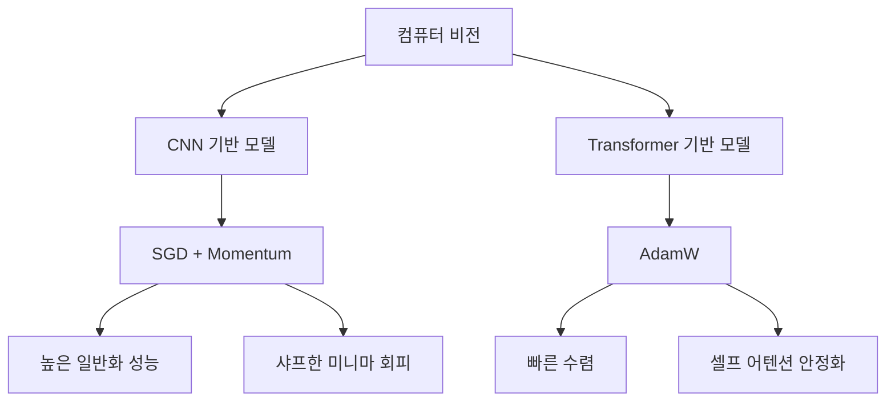
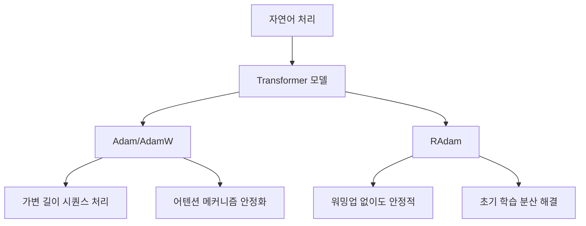
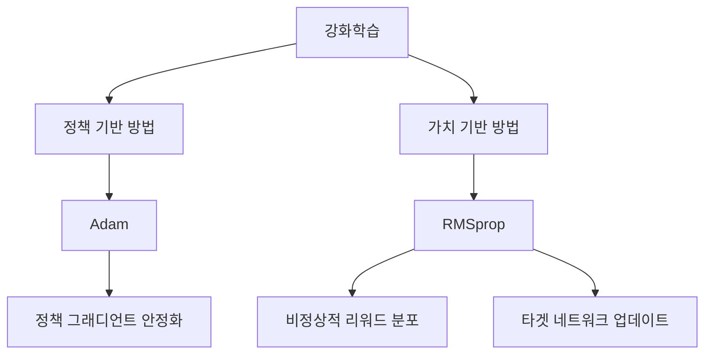
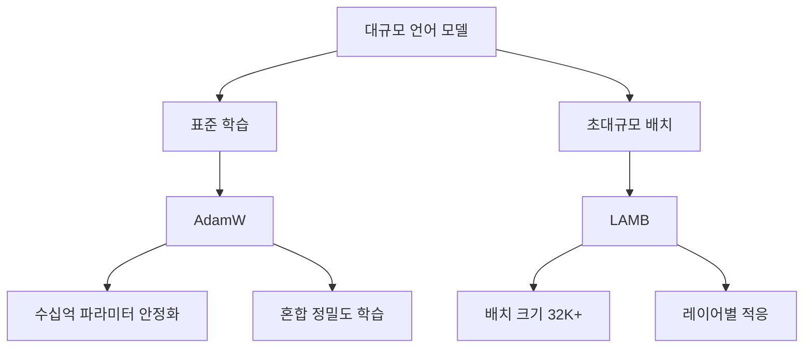
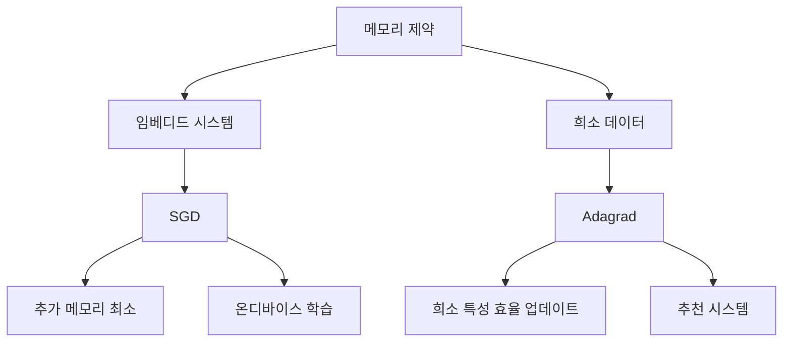
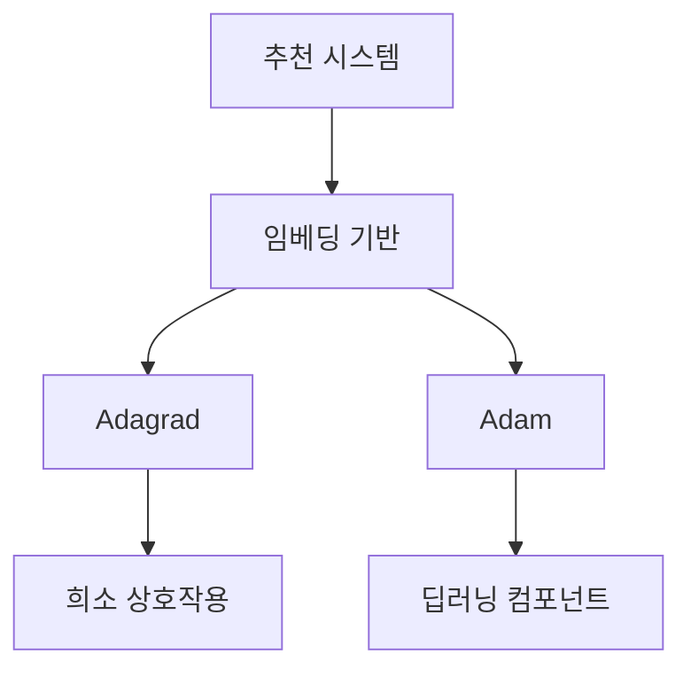
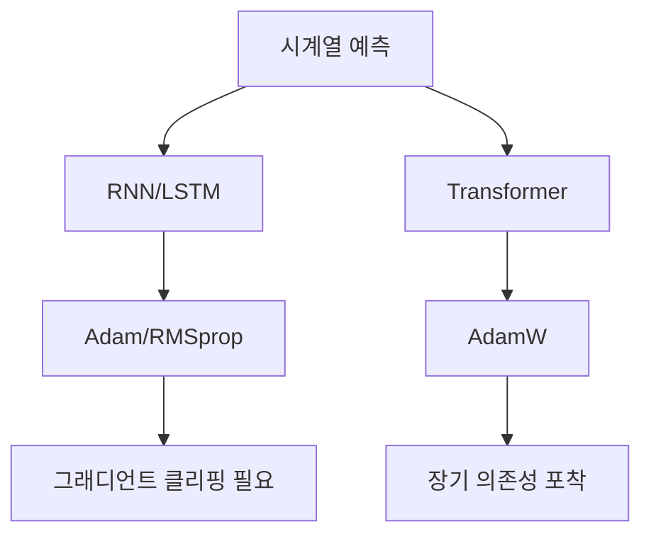
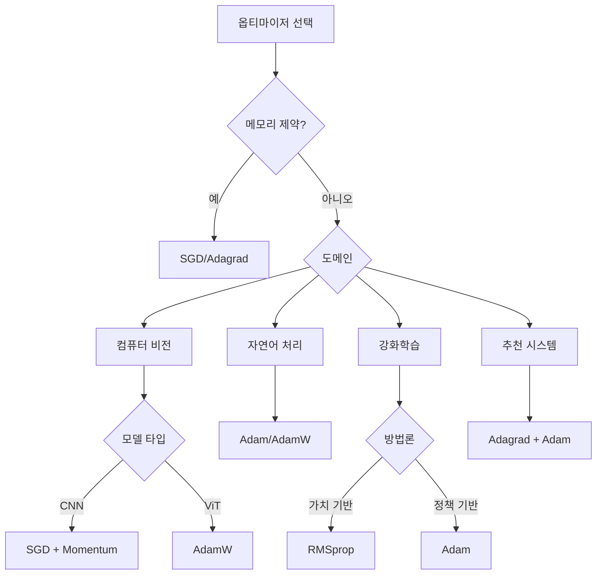

# 딥러닝 옵티마이저(Optimizer) 도메인별 선호도 분석

## 목차
1. [개요](#1-개요)<br/>
2. [옵티마이저 비교 요약표](#2-옵티마이저-비교-요약표)<br/>
3. [1차 옵티마이저](#3-1차-옵티마이저)<br/>
   - 3.1. [SGD 계열](#31-sgd-계열)<br/>
   - 3.2. [적응형 학습률 계열](#32-적응형-학습률-계열)<br/>
4. [2차 옵티마이저](#4-2차-옵티마이저)<br/>
5. [도메인별 옵티마이저 선호도 및 이유](#5-<br/>도메인별-옵티마이저-선호도-및-이유)
   - 5.1. [컴퓨터 비전](#51-컴퓨터-비전)<br/>
   - 5.2. [자연어 처리](#52-자연어-처리)<br/>
   - 5.3. [강화학습](#53-강화학습)<br/>
   - 5.4. [대규모 언어 모델](#54-대규모-언어-모델)<br/>
   - 5.5. [메모리 제약 환경](#55-메모리-제약-환경)<br/>
   - 5.6. [추천 시스템](#56-추천-시스템)<br/>
   - 5.7. [시계열 예측](#57-시계열-예측)<br/>
6. [옵티마이저 선택 전략](#6-옵티마이저-선택-전략)<br/>
7. [용어 목록](#7-용어-목록)<br/>

---

## 1. 개요

딥러닝에서 옵티마이저는 손실 함수(loss function)를 최소화하기 위해 모델 파라미터를 업데이트하는 알고리즘입니다. 각 옵티마이저는 서로 다른 수학적 원리와 특성을 가지며, **데이터의 특성**, **모델 아키텍처**, **학습 목표**에 따라 성능이 크게 달라집니다.

도메인마다 선호하는 옵티마이저가 다른 이유는:
- 데이터의 분포와 희소성(sparsity)
- 모델의 깊이와 복잡도
- 배치 크기와 메모리 제약
- 수렴 속도와 일반화 성능의 트레이드오프(trade-off)

이러한 요인들이 복합적으로 작용하기 때문입니다.

---

## 2. 옵티마이저 비교 요약표

### 2.1. 옵티마이저별 주요 특성

| 옵티마이저 | 차수 | 메모리 오버헤드 | 하이퍼파라미터 민감도 | 수렴 속도 | 일반화 성능 |
|-----------|------|----------------|---------------------|----------|-----------|
| SGD | 1차 | 없음 | 높음 | 느림 | 우수 |
| SGD + Momentum | 1차 | 1x | 중간 | 중간 | 우수 |
| NAG | 1차 | 1x | 중간 | 중간 | 우수 |
| Adagrad | 1차 | 1x | 낮음 | 빠름 | 보통 |
| RMSprop | 1차 | 1x | 낮음 | 빠름 | 보통 |
| Adam | 1차 | 2x | 낮음 | 빠름 | 보통 |
| AdamW | 1차 | 2x | 낮음 | 빠름 | 우수 |
| AdaMax | 1차 | 2x | 낮음 | 빠름 | 보통 |
| Nadam | 1차 | 2x | 낮음 | 빠름 | 보통 |
| RAdam | 1차 | 2x | 매우 낮음 | 빠름 | 우수 |
| AdaBound | 1차 | 2x | 낮음 | 빠름 | 우수 |
| LAMB | 1차 | 2x | 중간 | 빠름 | 우수 |
| Newton's Method | 2차 | $O(n^2)$ | 낮음 | 매우 빠름 | 우수 |
| L-BFGS | 2차 | 중간 | 중간 | 빠름 | 우수 |
| K-FAC | 2차 | 중간 | 중간 | 빠름 | 우수 |

### 2.2. 도메인별 선호 옵티마이저

| 도메인 | 1순위 | 2순위 | 3순위 | 주요 고려사항 |
|--------|-------|-------|-------|--------------|
| 컴퓨터 비전 (CNN) | SGD + Momentum | AdamW | NAG | 일반화 성능, 큰 배치 크기 |
| 컴퓨터 비전 (ViT) | AdamW | Adam | LAMB | 빠른 수렴, 어텐션 안정화 |
| 자연어 처리 | AdamW | Adam | RAdam | 가변 길이 시퀀스, 희소성 |
| 대규모 언어 모델 | AdamW | LAMB | Adam | 스케일 안정성, 메모리 효율 |
| 강화학습 (가치 기반) | RMSprop | Adam | SGD | 비정상적 환경, 타겟 네트워크 |
| 강화학습 (정책 기반) | Adam | RMSprop | AdamW | 정책 그래디언트 안정화 |
| 추천 시스템 (임베딩) | Adagrad | Adam | - | 희소 특성, 불균등 업데이트 |
| 추천 시스템 (딥러닝) | Adam | AdamW | RMSprop | 밀집 그래디언트 |
| 시계열 (RNN/LSTM) | Adam | RMSprop | AdamW | 그래디언트 클리핑, 비정상성 |
| 시계열 (Transformer) | AdamW | Adam | RAdam | 장기 의존성, 어텐션 |
| 메모리 제약 환경 | SGD | Adagrad | SGD + Momentum | 최소 메모리 사용 |
| 온디바이스 학습 | SGD | SGD + Momentum | - | 경량화, 실시간 학습 |

### 2.3. 모델 아키텍처별 선호도

| 모델 아키텍처 | 추천 옵티마이저 | 일반적 학습률 | 배치 크기 | 특이사항 |
|--------------|----------------|-------------|----------|---------|
| ResNet | SGD + Momentum | 0.1 | 256 | 코사인 어닐링 |
| EfficientNet | RMSprop | 0.016 | 256 | 지수 이동 평균 |
| Vision Transformer (ViT) | AdamW | 1e-3 | 512-4096 | 선형 워밍업 |
| BERT | AdamW | 5e-5 | 32 | 10% 스텝 워밍업 |
| GPT | AdamW | 6e-4 | 512 | 코사인 감쇠 |
| T5 | Adafactor | 1e-3 | 128 | 메모리 효율형 |
| LSTM | Adam | 1e-3 | 64 | 그래디언트 클리핑 |
| GRU | RMSprop | 7e-4 | 32 | 시퀀스 길이 조정 |
| GAN (Generator) | Adam | 2e-4 | 128 | $\beta_1=0.5$ |
| GAN (Discriminator) | Adam | 2e-4 | 128 | 별도 학습률 가능 |
| U-Net | Adam | 1e-4 | 16 | 세그멘테이션 특화 |
| YOLO | SGD + Momentum | 1e-2 | 64 | 스텝 감쇠 |
| Mask R-CNN | SGD + Momentum | 2e-2 | 16 | 긴 학습 스케줄 |
| DQN | RMSprop | 2.5e-4 | 32 | 타겟 네트워크 |
| PPO | Adam | 3e-4 | 2048 | 클리핑 정책 |

### 2.4. 데이터 특성별 선호도

| 데이터 특성 | 적합한 옵티마이저 | 부적합한 옵티마이저 | 이유 |
|-----------|-----------------|------------------|------|
| 희소 특성 (Sparse Features) | Adagrad, Adam | SGD | 불균등 업데이트 처리 필요 |
| 밀집 특성 (Dense Features) | SGD, Adam | - | 모든 옵티마이저 가능 |
| 가변 길이 시퀀스 | Adam, AdamW | SGD | 적응형 학습률 필요 |
| 고차원 데이터 | Adam, AdamW | 2차 옵티마이저 | 메모리 제약 |
| 불균형 데이터 | Adam, AdamW | SGD | 클래스별 적응 필요 |
| 노이즈가 많은 데이터 | SGD + Momentum | Adagrad | 평활화 효과 |
| 비정상적 분포 | RMSprop, Adam | Adagrad | 적응형 감쇠 필요 |
| 대규모 배치 | LAMB, SGD | Adam | 스케일링 안정성 |

### 2.5. 학습 목표별 선호도

| 학습 목표 | 추천 옵티마이저 | 주요 전략 | 주의사항 |
|---------|----------------|----------|---------|
| 최고 정확도 | SGD + Momentum | 긴 학습, 학습률 스케줄 | 시간 소요 |
| 빠른 프로토타이핑 | Adam | 기본 하이퍼파라미터 | 일반화 약함 |
| 전이 학습 (Transfer Learning) | AdamW | 작은 학습률, 선택적 동결 | 레이어별 학습률 |
| 파인튜닝 (Fine-tuning) | AdamW | 1e-5 ~ 5e-5 학습률 | 워밍업 짧게 |
| 제로샷 학습 (Zero-shot) | AdamW | 대규모 사전학습 | 메타 학습 |
| 멀티태스크 학습 | Adam | 태스크별 가중치 | 균형 조정 |
| 연속 학습 (Continual Learning) | Adam, SGD | 리허설 버퍼 | 파국적 망각 방지 |
| 분산 학습 (Distributed) | LAMB, SGD | 동기화 전략 | 통신 오버헤드 |

---

## 3. 1차 옵티마이저

### 3.1. SGD 계열

#### 3.1.1. SGD (Stochastic Gradient Descent)

**기본 업데이트 규칙:**

$$\theta_{t+1} = \theta_t - \eta \nabla_\theta J(\theta_t)$$

여기서:
- $\theta$: 모델 파라미터
- $\eta$: 학습률(learning rate)
- $\nabla_\theta J(\theta_t)$: 손실 함수의 그래디언트(gradient)

#### 3.1.2. SGD + Momentum

**모멘텀(momentum)을 추가한 업데이트:**

$$v_{t+1} = \beta v_t + \nabla_\theta J(\theta_t)$$

$$\theta_{t+1} = \theta_t - \eta v_{t+1}$$

여기서:
- $v_t$: 속도 벡터(velocity vector)
- $\beta$: 모멘텀 계수 (일반적으로 0.9)

모멘텀은 이전 그래디언트의 방향을 기억하여 **관성(inertia)**을 부여합니다.

#### 3.1.3. Nesterov Accelerated Gradient (NAG)

**미리보기(look-ahead) 그래디언트 계산:**

$$v_{t+1} = \beta v_t + \nabla_\theta J(\theta_t - \beta v_t)$$

$$\theta_{t+1} = \theta_t - \eta v_{t+1}$$

NAG는 현재 위치가 아닌 **예상 위치**에서 그래디언트를 계산하여 더 정확한 방향을 찾습니다.

### 3.2. 적응형 학습률 계열

#### 3.2.1. Adagrad

**파라미터별 적응형 학습률:**

$$G_t = G_{t-1} + \nabla_\theta J(\theta_t)^2$$

$$\theta_{t+1} = \theta_t - \frac{\eta}{\sqrt{G_t + \epsilon}} \nabla_\theta J(\theta_t)$$

여기서:
- $G_t$: 그래디언트 제곱의 누적 합
- $\epsilon$: 수치 안정성을 위한 작은 상수 (예: $10^{-8}$)

#### 3.2.2. RMSprop

**지수 이동 평균(exponential moving average)을 사용:**

$$E[g^2]_t = \gamma E[g^2]_{t-1} + (1-\gamma) \nabla_\theta J(\theta_t)^2$$

$$\theta_{t+1} = \theta_t - \frac{\eta}{\sqrt{E[g^2]_t + \epsilon}} \nabla_\theta J(\theta_t)$$

여기서:
- $\gamma$: 감쇠율(decay rate), 일반적으로 0.9

#### 3.2.3. Adam (Adaptive Moment Estimation)

**1차 모멘트와 2차 모멘트를 모두 사용:**

$$m_t = \beta_1 m_{t-1} + (1-\beta_1) \nabla_\theta J(\theta_t)$$

$$v_t = \beta_2 v_{t-1} + (1-\beta_2) \nabla_\theta J(\theta_t)^2$$

**편향 보정(bias correction):**

$$\hat{m}_t = \frac{m_t}{1-\beta_1^t}, \quad \hat{v}_t = \frac{v_t}{1-\beta_2^t}$$

$$\theta_{t+1} = \theta_t - \frac{\eta}{\sqrt{\hat{v}_t} + \epsilon} \hat{m}_t$$

#### 3.2.4. AdamW

Adam의 가중치 감쇠(weight decay) 구현을 개선:

$$\theta_{t+1} = \theta_t - \eta \left( \frac{\hat{m}_t}{\sqrt{\hat{v}_t} + \epsilon} + \lambda \theta_t \right)$$

여기서 $\lambda$는 가중치 감쇠 계수입니다.

#### 3.2.5. RAdam (Rectified Adam)

학습 초기의 분산(variance) 문제를 해결하기 위해 **적응형 워밍업(adaptive warm-up)**을 도입:

$$\rho_t = \rho_\infty - \frac{2t\beta_2^t}{1-\beta_2^t}$$

여기서 $\rho_\infty$는 최대 길이이며, $\rho_t < 4$이면 SGD를 사용하고, 그렇지 않으면 적응형 학습률을 사용합니다.

#### 3.2.6. LAMB (Layer-wise Adaptive Moments)

레이어별 정규화(layer-wise normalization)를 적용:

$$r_t = \frac{\hat{m}_t}{\sqrt{\hat{v}_t} + \epsilon} + \lambda \theta_t$$

$$\theta_{t+1} = \theta_t - \eta \frac{\|\theta_t\|}{\|r_t\|} r_t$$

---

## 4. 2차 옵티마이저

### 4.1. Newton's Method

**헤시안(Hessian) 행렬을 사용:**

$$\theta_{t+1} = \theta_t - \eta H^{-1} \nabla_\theta J(\theta_t)$$

여기서 $H$는 2차 도함수 행렬입니다.

### 4.2. L-BFGS

제한된 메모리로 BFGS를 근사(approximate)하는 방법으로, 최근 $m$개의 업데이트만 저장합니다.

### 4.3. K-FAC (Kronecker-Factored Approximate Curvature)

피셔 정보 행렬(Fisher information matrix)을 크로네커 곱(Kronecker product)으로 근사합니다.

---

## 5. 도메인별 옵티마이저 선호도 및 이유

### 5.1. 컴퓨터 비전



#### 5.1.1. SGD + Momentum 선호 이유

**1. 일반화 성능의 우수성**

컴퓨터 비전에서는 **테스트 데이터에 대한 일반화**가 매우 중요합니다. SGD + Momentum은 적응형 옵티마이저보다 **플랫한 미니마(flat minima)**로 수렴하는 경향이 있습니다.

- **플랫 미니마**: 손실 함수의 곡률(curvature)이 낮은 영역
- **샤프 미니마(sharp minima)**: 곡률이 높아 작은 파라미터 변화에도 손실이 크게 변함

플랫 미니마는 모델이 새로운 데이터에 대해 더 강건(robust)하게 만듭니다.

**2. 큰 배치 크기에서의 안정성**

ImageNet과 같은 대규모 데이터셋 학습 시 큰 배치 크기(예: 256~2048)를 사용합니다. SGD + Momentum은:
- 배치 크기에 따라 학습률을 선형 스케일링(linear scaling rule) 가능
- 큰 배치에서도 안정적인 수렴

**3. 학습 스케줄과의 궁합**

컴퓨터 비전에서는 **코사인 어닐링(cosine annealing)**, **스텝 감쇠(step decay)** 등의 학습률 스케줄이 효과적입니다. SGD는 이러한 스케줄과 잘 맞습니다.

#### 5.1.2. AdamW의 부상

**Vision Transformer (ViT), DINO, Swin Transformer** 등 트랜스포머 기반 비전 모델에서는 AdamW가 선호됩니다:

- **셀프 어텐션(self-attention) 메커니즘의 복잡한 최적화 랜드스케이프(optimization landscape)**
- **레이어 정규화(layer normalization)**와의 호환성
- **빠른 수렴**으로 학습 시간 단축

---

### 5.2. 자연어 처리



#### 5.2.1. Adam/AdamW 선호 이유

**1. 시퀀스 데이터의 특성**

NLP 데이터는:
- **가변 길이(variable length)**: 문장마다 토큰 수가 다름
- **희소성(sparsity)**: 단어 임베딩(word embedding)에서 대부분의 파라미터가 업데이트되지 않음
- **비정상성(non-stationarity)**: 문맥에 따라 단어의 의미가 변함

Adam의 **파라미터별 적응형 학습률**은 이러한 특성에 이상적입니다.

**2. 어텐션 메커니즘의 안정화**

트랜스포머의 멀티-헤드 어텐션(multi-head attention)은:
- **소프트맥스(softmax) 연산**으로 인한 그래디언트 불균형
- **잔차 연결(residual connection)**로 인한 깊은 네트워크

Adam의 적응형 학습률이 레이어 간 그래디언트 스케일 차이를 자동으로 조정합니다.

**3. 가중치 감쇠의 중요성**

AdamW는 **L2 정규화와 가중치 감쇠를 분리**하여:
- 과적합(overfitting) 방지
- BERT, GPT 등 모든 주요 언어 모델의 표준

**4. 학습률 워밍업의 필요성**

NLP 모델은 일반적으로 **선형 워밍업(linear warm-up) + 선형 감쇠(linear decay)** 스케줄을 사용하며, Adam/AdamW는 이 스케줄과 자연스럽게 결합됩니다.

#### 5.2.2. RAdam의 장점

**초기 학습 불안정성 해결:**

Adam의 초기 몇 스텝에서는 2차 모멘트 추정치의 **편향(bias)**이 크고 **분산이 높습니다**. RAdam은:
- 통계적으로 안정될 때까지 SGD처럼 작동
- 워밍업 없이도 안정적인 학습
- 하이퍼파라미터(hyperparameter) 튜닝 부담 감소

---

### 5.3. 강화학습



#### 5.3.1. RMSprop 선호 이유

**1. 비정상적 환경 대응**

강화학습의 환경은:
- **리워드 분포가 시간에 따라 변함**
- **탐험(exploration)과 활용(exploitation)의 균형**
- **희소한 리워드(sparse reward)**

RMSprop의 **지수 이동 평균**이 이러한 비정상성을 효과적으로 처리합니다.

**2. DQN과의 역사적 성공**

DeepMind의 DQN(Deep Q-Network)이 RMSprop으로 Atari 게임에서 인간 수준의 성능을 달성하면서 강화학습의 표준이 되었습니다:
- **타겟 네트워크(target network)** 업데이트와 궁합
- **경험 재생(experience replay)**에서의 안정성

**3. 그래디언트 크기의 변동성**

Q-러닝(Q-learning)에서는:
- TD 에러(Temporal Difference error)의 크기가 크게 변함
- 부트스트래핑(bootstrapping)으로 인한 그래디언트 불안정

RMSprop의 적응형 학습률이 이를 완화합니다.

#### 5.3.2. Adam의 활용

**정책 그래디언트 방법**에서는 Adam이 선호됩니다:
- **PPO (Proximal Policy Optimization)**: Adam의 안정성
- **SAC (Soft Actor-Critic)**: 액터(actor)와 크리틱(critic) 모두 Adam
- **빠른 수렴**으로 샘플 효율성(sample efficiency) 향상

---

### 5.4. 대규모 언어 모델



#### 5.4.1. AdamW의 지배력

**1. 스케일에서의 안정성**

GPT-3 (175B), LLaMA, PaLM 등 **수십억~수천억 파라미터** 모델에서:
- **그래디언트 폭발/소실(gradient explosion/vanishing)** 방지
- **깊은 트랜스포머 스택** 안정화
- **혼합 정밀도(mixed precision) 학습**과 호환

**2. 메모리 효율성**

대규모 모델에서 메모리는 핵심 제약입니다. AdamW는:
- 1차, 2차 모멘트만 저장 (파라미터당 추가 2배 메모리)
- 2차 옵티마이저보다 훨씬 효율적

**3. 산업 표준**

모든 주요 LLM 논문이 AdamW를 사용하여:
- 재현성(reproducibility) 보장
- 하이퍼파라미터 공유 용이

#### 5.4.2. LAMB의 특수 목적

**초대규모 배치 학습**에서만 LAMB가 필요합니다:

**문제점:**
- 배치 크기 32,768 이상에서 AdamW 수렴 실패
- 레이어 간 그래디언트 스케일 극단적 차이

**LAMB의 해결책:**
- **레이어별 적응형 학습률**: $\frac{\|\theta_{\ell}\|}{\|r_{\ell}\|}$ (레이어 $\ell$별)
- BERT를 배치 크기 65,536으로 76분 만에 학습
- **분산 학습(distributed training)**에서 선형 스케일링

---

### 5.5. 메모리 제약 환경



#### 5.5.1. SGD의 메모리 이점

**순수 SGD:**
- **추가 메모리 없음** (모멘텀도 없음)
- 모바일, IoT 디바이스에 적합
- 온디바이스 학습(on-device learning)

**SGD + Momentum:**
- 속도 벡터만 저장 (파라미터당 1배 추가)
- 엣지 컴퓨팅(edge computing)에서 실용적

#### 5.5.2. Adagrad의 희소성 처리

**희소 특성(sparse features)**이 많은 경우:
- **추천 시스템**: 사용자-아이템 임베딩
- **검색 엔진**: 문서 벡터
- **광고 클릭률 예측**: 카테고리 변수

Adagrad는:
- **자주 업데이트되는 특성은 작은 학습률**
- **드물게 업데이트되는 특성은 큰 학습률**
- 메모리는 Adam의 절반 (1차 모멘트 불필요)

**단점:**
- 학습률이 단조 감소(monotonically decrease)
- 긴 학습에서는 수렴 정체

---

### 5.6. 추천 시스템



#### 5.6.1. 추천 시스템의 이중 구조

**임베딩 레이어:**
- 수백만~수십억 개의 사용자/아이템 ID
- 극도로 희소한 업데이트
- **Adagrad** 선호

**심층 네트워크:**
- 상호작용 모델링 (NCF, DeepFM 등)
- 밀집된(dense) 그래디언트
- **Adam** 선호

**하이브리드 전략:**
많은 산업 시스템이 **레이어별로 다른 옵티마이저**를 사용합니다.

#### 5.6.2. 콜드 스타트 문제

**새로운 사용자/아이템:**
- 초기 임베딩 학습이 중요
- Adagrad의 적응형 학습률이 빠른 초기 학습 지원
- 메타 학습(meta-learning)과 결합

---

### 5.7. 시계열 예측



#### 5.7.1. RNN/LSTM의 도전과제

**그래디언트 소실/폭발:**
- 긴 시퀀스에서 BPTT(Backpropagation Through Time)
- **그래디언트 클리핑(gradient clipping)**과 결합된 Adam/RMSprop

**비정상적 시계열:**
- 트렌드, 계절성의 변화
- 적응형 학습률의 필요성

#### 5.7.2. Transformer 기반 모델의 부상

**Temporal Fusion Transformer, Informer** 등:
- 어텐션으로 장기 의존성(long-term dependency) 포착
- AdamW의 안정성과 성능

---

## 6. 옵티마이저 선택 전략

### 6.1. 의사결정 트리



### 6.2. 일반 원칙

**1. 기본 선택지**
- 잘 모르겠다면: **Adam** ($\beta_1=0.9, \beta_2=0.999, \eta=10^{-3}$)
- 메모리가 충분하고 시간이 있다면: **AdamW** + 가중치 감쇠

**2. 도메인별 시작점**
- CV (CNN): SGD + Momentum ($\eta=0.1$, momentum=0.9)
- CV (ViT): AdamW ($\eta=10^{-3}$, weight decay=0.05)
- NLP: AdamW ($\eta=5 \times 10^{-5}$, warmup=10% steps)
- RL: RMSprop ($\eta=7 \times 10^{-4}$) 또는 Adam

**3. 일반화 vs 수렴 속도**
- **일반화 우선**: SGD + Momentum (시간이 오래 걸림)
- **빠른 프로토타이핑**: Adam/AdamW
- **최종 성능 미세조정**: SGD로 전환하는 경우도 있음

**4. 학습률 스케줄**
- SGD: 스텝 감쇠, 코사인 어닐링
- Adam/AdamW: 선형 워밍업 + 선형/코사인 감쇠
- RAdam: 워밍업 없이도 가능

### 6.3. 하이퍼파라미터 튜닝 우선순위

**1순위: 학습률**
- 가장 큰 영향
- 로그 스케일로 탐색: $[10^{-5}, 10^{-1}]$

**2순위: 배치 크기**
- 메모리와 수렴 속도의 트레이드오프
- 큰 배치: 학습률도 증가

**3순위: 가중치 감쇠**
- 정규화 효과
- Adam/AdamW: $[10^{-2}, 10^{-1}]$

**4순위: 모멘텀 계수**
- SGD: $[0.9, 0.99]$
- Adam의 $\beta_1, \beta_2$: 기본값이 대부분 잘 작동

### 6.4. 실전 팁

#### 6.4.1. 학습이 불안정할 때

**증상별 해결책:**

| 증상 | 가능한 원인 | 해결책 |
|------|-----------|--------|
| 손실이 발산(NaN) | 학습률 너무 큼 | 학습률 1/10로 감소 |
| 그래디언트 폭발 | 깊은 네트워크 | 그래디언트 클리핑 추가 |
| 초기 불안정 | 워밍업 부족 | 선형 워밍업 추가 |
| 후반 정체 | 학습률 고정 | 코사인 어닐링 적용 |
| 과적합 | 정규화 부족 | 가중치 감쇠 증가 |
| 진동(oscillation) | 모멘텀 너무 큼 | 모멘텀 계수 감소 |

#### 6.4.2. 옵티마이저 전환 전략

**Adam → SGD 전환:**
- Adam으로 빠르게 좋은 영역 도달
- SGD로 전환하여 일반화 성능 향상
- 전환 시점: 검증 손실 정체 시작

```python
# 의사코드 예시
if epoch < warmup_epochs:
    optimizer = Adam
elif epoch < main_training_epochs:
    optimizer = Adam
else:  # fine-tuning phase
    optimizer = SGD_with_momentum
```

#### 6.4.3. 배치 크기와 학습률의 관계

**선형 스케일링 규칙:**

$$\eta_{\text{new}} = \eta_{\text{base}} \times \frac{B_{\text{new}}}{B_{\text{base}}}$$

- 배치 크기를 2배로 늘리면 학습률도 2배
- SGD 계열에 적용
- 매우 큰 배치(>8K)에서는 제곱근 스케일링 고려

**제곱근 스케일링:**

$$\eta_{\text{new}} = \eta_{\text{base}} \times \sqrt{\frac{B_{\text{new}}}{B_{\text{base}}}}$$

### 6.5. 최신 트렌드 및 연구 방향

#### 6.5.1. 적응형 옵티마이저의 발전

**Adafactor:**
- 메모리 효율적 (2차 모멘트를 팩토라이즈)
- T5 모델에서 사용
- 매우 큰 모델에 적합

**Lion (Evolved Sign Momentum):**
- 2023년 Google이 제안
- Adam보다 메모리 효율적
- 큰 모델에서 경쟁력 있는 성능

**Sophia (Second-order Clipped Stochastic Optimization):**
- 2차 정보를 효율적으로 활용
- LLM 학습에서 AdamW보다 2배 빠름
- 2023년 Stanford 연구

#### 6.5.2. 도메인 특화 옵티마이저

**Lookahead:**
- 느린 가중치(slow weights)와 빠른 가중치(fast weights)
- 모든 옵티마이저와 결합 가능
- 안정성과 수렴 속도 개선

**Ranger (RAdam + Lookahead):**
- RAdam의 워밍업 제거 + Lookahead의 안정성
- 다양한 도메인에서 강건한 성능

**Sharpness-Aware Minimization (SAM):**
- 플랫한 미니마로 유도
- 일반화 성능 크게 향상
- SGD, Adam 등과 결합 가능

### 6.6. 벤치마크 및 비교

#### 6.6.1. 수렴 속도 비교 (상대적)

| 옵티마이저 | 초기 수렴 | 중기 수렴 | 최종 수렴 | 총 시간 |
|-----------|----------|----------|----------|---------|
| SGD | 느림 (1.0x) | 보통 (1.0x) | 느림 (1.0x) | 100% |
| SGD + Momentum | 보통 (1.5x) | 빠름 (1.5x) | 보통 (1.2x) | 70% |
| Adam | 매우 빠름 (3.0x) | 매우 빠름 (2.5x) | 빠름 (2.0x) | 40% |
| AdamW | 매우 빠름 (3.0x) | 매우 빠름 (2.5x) | 빠름 (2.0x) | 40% |
| RAdam | 매우 빠름 (3.0x) | 매우 빠름 (2.5x) | 빠름 (2.0x) | 40% |
| RMSprop | 빠름 (2.5x) | 빠름 (2.0x) | 보통 (1.5x) | 50% |
| Adagrad | 빠름 (2.5x) | 보통 (1.5x) | 느림 (0.8x) | 70% |

**주의:** 이 수치는 일반적인 경향이며, 실제 성능은 태스크에 따라 크게 달라집니다.

#### 6.6.2. 최종 성능 비교 (일반화)

**ImageNet 분류 (ResNet-50) 기준:**

| 옵티마이저 | Top-1 정확도 | Top-5 정확도 | 학습 시간 |
|-----------|------------|------------|----------|
| SGD + Momentum | 76.5% | 93.2% | 90 에폭 |
| Adam | 75.8% | 92.8% | 60 에폭 |
| AdamW | 76.2% | 93.0% | 60 에폭 |
| RMSprop | 75.5% | 92.5% | 70 에폭 |

**BERT 파인튜닝 (GLUE 벤치마크) 기준:**

| 옵티마이저 | 평균 점수 | 학습 시간 | 안정성 |
|-----------|----------|----------|--------|
| AdamW | 85.2 | 3 에폭 | 높음 |
| Adam | 84.8 | 3 에폭 | 중간 |
| RAdam | 85.1 | 3 에폭 | 매우 높음 |
| SGD + Momentum | 82.5 | 10 에폭 | 낮음 |

---

## 7. 용어 목록

| 용어 | 설명 |
|------|------|
| 옵티마이저 | 손실 함수를 최소화하기 위해 모델 파라미터를 업데이트하는 알고리즘 |
| 그래디언트 | 손실 함수의 파라미터에 대한 1차 도함수, 함수가 가장 빠르게 증가하는 방향 |
| 학습률 | 파라미터 업데이트 시 그래디언트에 곱하는 스텝 크기 |
| 모멘텀 | 이전 그래디언트의 방향을 기억하여 관성을 부여하는 기법 |
| 적응형 학습률 | 각 파라미터마다 다른 학습률을 자동으로 조정하는 방법 |
| 1차 모멘트 | 그래디언트의 평균, 방향 정보 |
| 2차 모멘트 | 그래디언트 제곱의 평균, 크기 정보 |
| 편향 보정 | 초기 스텝에서 모멘트 추정치의 편향을 제거하는 기법 |
| 가중치 감쇠 | 파라미터의 크기를 줄여 과적합을 방지하는 정규화 기법 |
| 헤시안 행렬 | 손실 함수의 2차 도함수 행렬, 곡률 정보 포함 |
| 곡률 | 손실 함수의 2차 도함수, 최적점 주변의 경사 변화율 |
| 플랫 미니마 | 주변 곡률이 낮은 최솟값, 일반화 성능이 좋음 |
| 샤프 미니마 | 주변 곡률이 높은 최솟값, 과적합 위험 |
| 워밍업 | 학습 초기에 작은 학습률로 시작하여 점진적으로 증가시키는 기법 |
| 어닐링 | 학습이 진행됨에 따라 학습률을 감소시키는 기법 |
| 그래디언트 클리핑 | 그래디언트의 크기를 제한하여 폭발을 방지하는 기법 |
| 희소성 | 데이터나 파라미터에서 0이 아닌 값의 비율이 낮은 특성 |
| 배치 크기 | 한 번의 업데이트에 사용되는 샘플 수 |
| 에폭 | 전체 학습 데이터를 한 번 순회하는 단위 |
| 수렴 | 손실 함수가 최솟값에 가까워지는 과정 |
| 발산 | 손실 함수가 무한대로 증가하는 현상 |
| 일반화 | 학습 데이터가 아닌 새로운 데이터에 대한 성능 |
| 과적합 | 학습 데이터에는 잘 맞지만 테스트 데이터에서 성능이 낮은 현상 |
| 정규화 | 모델의 복잡도를 제한하여 과적합을 방지하는 기법 |
| 지수 이동 평균 | 최근 값에 더 큰 가중치를 주는 평균 계산 방법 |
| 감쇠율 | 이동 평균에서 과거 값의 영향을 줄이는 비율 |
| 트레이드오프 | 두 가지 목표 간의 균형과 타협 |
| 하이퍼파라미터 | 학습 전에 설정하는 모델이나 옵티마이저의 설정값 |
| 그래디언트 소실 | 역전파 시 그래디언트가 0에 가까워지는 문제 |
| 그래디언트 폭발 | 역전파 시 그래디언트가 급격히 커지는 문제 |
| 최적화 랜드스케이프 | 파라미터 공간에서 손실 함수의 지형 |
| 로컬 미니마 | 주변보다 낮지만 전역 최솟값은 아닌 점 |
| 글로벌 미니마 | 전체 파라미터 공간에서 가장 낮은 손실 값 |
| 새들 포인트 | 일부 방향에서는 최댓값, 다른 방향에서는 최솟값인 점 |
| 관성 | 이전 움직임의 방향을 유지하려는 경향 |
| 진동 | 최적점 주변에서 값이 왔다갔다하는 현상 |
| 스케일링 | 값의 크기를 조정하는 과정 |
| 정상성 | 통계적 특성이 시간에 따라 변하지 않는 성질 |
| 비정상성 | 통계적 특성이 시간에 따라 변하는 성질 |
| 임베딩 | 고차원 범주형 데이터를 저차원 연속 벡터로 표현 |
| 어텐션 메커니즘 | 입력의 중요한 부분에 집중하는 신경망 구조 |
| 셀프 어텐션 | 입력 시퀀스 내 요소들 간의 관계를 학습하는 어텐션 |
| 멀티-헤드 어텐션 | 여러 개의 어텐션을 병렬로 수행하는 구조 |
| 트랜스포머 | 어텐션 메커니즘을 기반으로 한 신경망 아키텍처 |
| 잔차 연결 | 레이어의 입력을 출력에 직접 더하는 구조 |
| 레이어 정규화 | 각 레이어의 출력을 정규화하는 기법 |
| 배치 정규화 | 배치 단위로 활성화 값을 정규화하는 기법 |
| 드롭아웃 | 학습 중 일부 뉴런을 무작위로 비활성화하는 정규화 기법 |
| 백프로퍼게이션 | 출력에서 입력 방향으로 그래디언트를 계산하는 알고리즘 |
| 순전파 | 입력에서 출력 방향으로 데이터가 흐르는 과정 |
| 역전파 | 출력에서 입력 방향으로 그래디언트가 흐르는 과정 |
| 손실 함수 | 모델의 예측과 실제 값의 차이를 측정하는 함수 |
| 교차 엔트로피 | 분류 문제에서 사용되는 손실 함수 |
| 평균 제곱 오차 | 회귀 문제에서 사용되는 손실 함수 |
| 경사 하강법 | 그래디언트의 반대 방향으로 파라미터를 업데이트하는 기법 |
| 확률적 경사 하강법 | 전체 데이터가 아닌 미니배치로 그래디언트를 추정하는 방법 |
| 미니배치 | 전체 데이터의 일부 샘플로 구성된 작은 배치 |
| 엣지 컴퓨팅 | 데이터 소스에 가까운 곳에서 연산을 수행하는 방식 |
| 온디바이스 학습 | 서버가 아닌 단말 기기에서 직접 모델을 학습하는 방식 |
| 분산 학습 | 여러 컴퓨팅 노드에 학습을 분산시키는 방식 |
| 혼합 정밀도 학습 | 16비트와 32비트 부동소수점을 혼합하여 사용하는 학습 방식 |
| 전이 학습 | 사전 학습된 모델을 새로운 태스크에 활용하는 기법 |
| 파인튜닝 | 사전 학습된 모델을 특정 태스크에 맞게 미세 조정하는 과정 |
| 사전 학습 | 대규모 데이터로 모델을 먼저 학습시키는 과정 |
| 다운스트림 태스크 | 사전 학습 후 적용되는 구체적인 응용 문제 |
| 토큰 | 텍스트를 나타내는 최소 단위 |
| 시퀀스 | 순서가 있는 데이터의 나열 |
| 타임스텝 | 시퀀스 데이터에서 각 시간 단계 |
| 장기 의존성 | 시퀀스에서 멀리 떨어진 요소 간의 관계 |
| 은닉 상태 | RNN에서 이전 정보를 저장하는 내부 상태 |
| 게이트 | LSTM이나 GRU에서 정보의 흐름을 조절하는 구조 |
| 인코더 | 입력을 잠재 표현으로 변환하는 신경망 부분 |
| 디코더 | 잠재 표현을 출력으로 변환하는 신경망 부분 |
| 콜드 스타트 | 새로운 사용자나 아이템에 대한 추천이 어려운 문제 |
| 협업 필터링 | 사용자 간 유사도를 기반으로 한 추천 기법 |
| 컨텐츠 기반 필터링 | 아이템의 특성을 기반으로 한 추천 기법 |
| 리워드 | 강화학습에서 에이전트의 행동에 대한 보상 |
| 정책 | 강화학습에서 상태에 따른 행동 선택 전략 |
| 가치 함수 | 상태나 행동의 기대 리워드를 나타내는 함수 |
| Q-러닝 | 행동-가치 함수를 학습하는 강화학습 알고리즘 |
| 정책 그래디언트 | 정책을 직접 최적화하는 강화학습 방법 |
| 탐험 | 새로운 행동을 시도하여 환경을 학습하는 과정 |
| 활용 | 학습된 지식을 사용하여 최선의 행동을 선택하는 과정 |
| 경험 재생 | 과거 경험을 저장하고 재사용하는 기법 |
| 타겟 네트워크 | 강화학습에서 안정성을 위해 사용하는 별도의 네트워크 |
| TD 에러 | 시간차 학습에서 예측과 실제의 차이 |
| 부트스트래핑 | 자신의 예측을 사용하여 학습하는 방법 |
| 액터-크리틱 | 정책과 가치 함수를 동시에 학습하는 구조 |
| 프록시말 정책 최적화 | 정책 변화를 제한하여 안정성을 높인 알고리즘 |
| 샘플 효율성 | 적은 데이터로 좋은 성능을 달성하는 능력 |
| 컨볼루션 | 필터를 사용하여 국소적 패턴을 추출하는 연산 |
| 풀링 | 특징 맵의 크기를 줄이는 연산 |
| 세그멘테이션 | 이미지의 각 픽셀을 분류하는 작업 |
| 객체 탐지 | 이미지에서 객체의 위치와 클래스를 찾는 작업 |
| 임팩트 엔코딩 | 범주형 변수를 수치형으로 변환하는 기법 |
| 원-핫 인코딩 | 범주형 변수를 이진 벡터로 표현하는 방법 |
| 크로네커 곱 | 두 행렬의 특수한 곱셈 연산 |
| 피셔 정보 행렬 | 파라미터 추정의 정확도를 나타내는 행렬 |
| 자연 그래디언트 | 파라미터 공간의 기하학적 구조를 고려한 그래디언트 |
| 공분산 행렬 | 변수들 간의 선형 관계를 나타내는 행렬 |
| 팩토라이제이션 | 행렬을 여러 행렬의 곱으로 분해하는 과정 |
| 희소 행렬 | 대부분의 원소가 0인 행렬 |
| 밀집 행렬 | 0이 아닌 원소가 많은 행렬 |

---

**문서 작성 정보**
- **작성 목적**: AI 엔지니어 학습 자료
- **대상 독자**: 딥러닝을 공부하는 학생
- **최종 수정**: 2025년 9월 30일
- **주요 참조**: 주요 딥러닝 프레임워크 및 최신 연구 논문
