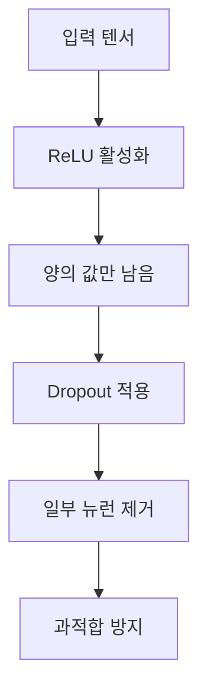

# 1. ReLU와 Dropout의 조합

## 1.1. ReLU (Rectified Linear Unit)

- **정의**: 입력값이 0 이하일 경우 0으로 만들고, 0 이상일 경우 그대로 통과시키는 **비선형 활성화 함수**.
- **역할**:
  - 비선형성 부여
  - 희소성(sparsity) 유도
  - 계산 효율성 높음

$$
\text{ReLU}(x) = \max(0, x)
$$

- **특징**:
  - 음수 영역 제거 → 일부 뉴런 비활성화
  - 양수 영역 유지 → 활성화된 뉴런이 강하게 반응

## 1.2. Dropout

- **정의**: 학습 중에 무작위로 일부 뉴런을 제거하여 과적합을 방지하는 regularization 기법.
- **역할**:
  - 특정 뉴런에 대한 의존도 감소
  - 일반화 성능 향상
  - 앙상블 효과 유사

$$
\text{Dropout}(x) =
\begin{cases}
0 & \text{with probability } p \\
\frac{x}{1-p} & \text{otherwise}
\end{cases}
$$

- **적용 시점**: 일반적으로 **ReLU 이후**에 적용하여 활성화된 뉴런 중 일부를 제거함.

---

# 2. 시각적 흐름 (Mermaid)



---

# 3. ReLU → Dropout 조합의 의미

| 항목 | 설명 |
|------|------|
| 조합 목적 | 과도한 활성화를 억제하여 일반화 성능 향상 |
| 사용 위치 | ReLU 바로 다음 |
| 효과 | 뉴런 희소성 + 무작위 제거로 robust한 표현 |
| 주의점 | 과도한 Dropout은 학습 저하 가능성 있음 |

---

# 4. 실전 예시 (PyTorch)

```python
import torch.nn as nn

model = nn.Sequential(
    nn.Linear(128, 64),
    nn.ReLU(inplace=True),
    nn.Dropout(p=0.5)
)
```

---

# 5. 요약

- `ReLU`는 뉴런을 활성화하고, `Dropout`은 그 중 일부를 제거함으로써 **과적합을 방지**하는 역할을 함.
- 이 조합은 **딥러닝 모델에서 매우 흔하게 사용되는 패턴**이며, 특히 fully connected layer에서 자주 등장함.
- 하지만 반드시 함께 써야 하는 건 아니며, 모델 구조나 regularization 전략에 따라 달라질 수 있음.

---
---
# 기타

## ✅ 대부분 사용하는 이유

- **ReLU**는 뉴런을 활성화시키고,  
- **Dropout**은 그 중 일부를 무작위로 제거해서 **과적합을 방지**해.
- 특히 **fully connected layer**에서는 이 조합이 **일반화 성능 향상**에 효과적이기 때문에 자주 쓰여.

---

## ❌ 사용하지 않는 경우 (특별한 상황이라기보단 전략적 선택)

| 상황 | 설명 |
|------|------|
| **BatchNorm 사용 시** | BatchNorm이 자체적으로 regularization 효과를 주기 때문에 Dropout을 생략하는 경우가 많음. |
| **ResNet, EfficientNet 등** | 구조적으로 residual connection이나 squeeze-excite block이 있어서 Dropout 없이도 충분한 일반화 성능을 확보함. |
| **Transformer 계열** | Dropout은 attention이나 feedforward block 내부에 전략적으로 배치되며, ReLU 대신 GELU 같은 다른 활성화 함수가 사용됨. |
| **Inference 단계** | 학습 시에는 Dropout을 사용하지만, 추론 시에는 비활성화됨. |

---

## 🔍 핵심 정리

- ReLU와 Dropout은 **궁합이 좋고 자주 함께 쓰이지만**,  
- 사용하지 않는다고 해서 **특별하거나 이상한 건 아님**.  

---

