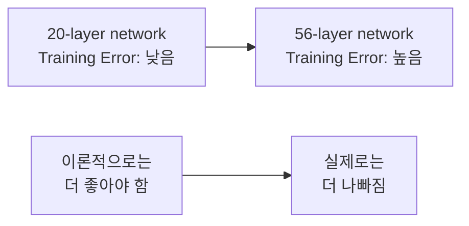
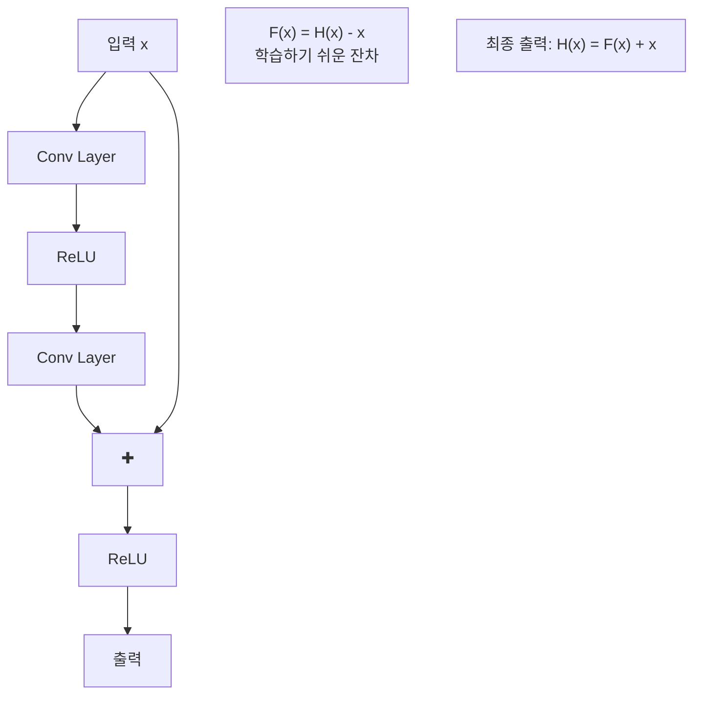
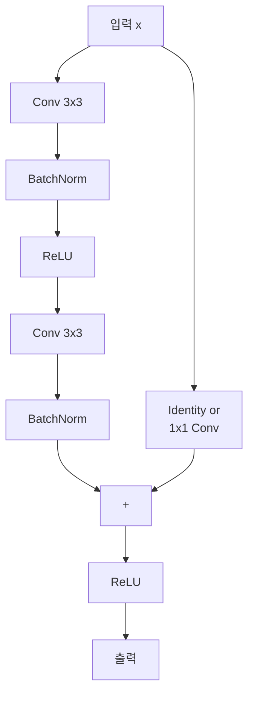
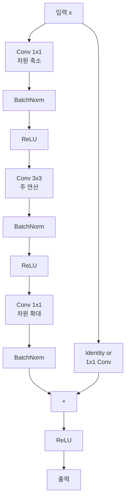
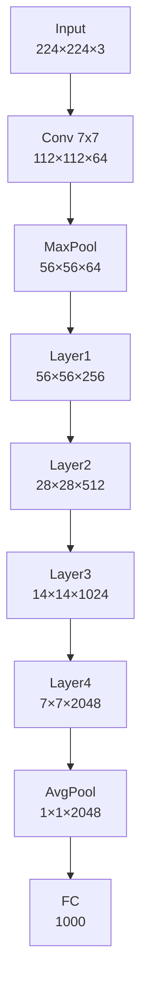
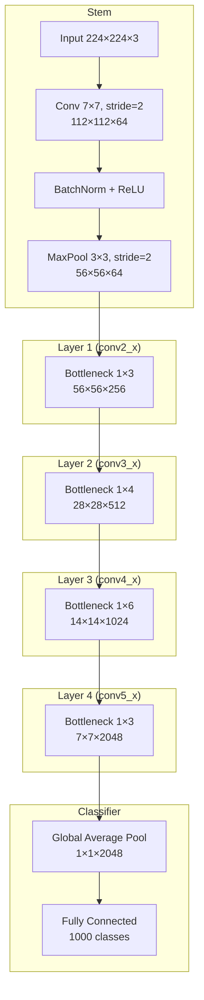

# ResNet - Skip Connection으로 깊이의 한계를 극복한 CNN

## 개요

ResNet(Residual Network)은 2015년 Microsoft Research에서 Kaiming He 등에 의해 개발된 혁신적인 합성곱 신경망입니다. ILSVRC 2015에서 1위를 차지했으며, "Deep Residual Learning for Image Recognition" 논문으로 발표되었습니다. Skip Connection(잔차 연결)을 도입하여 매우 깊은 네트워크 학습을 가능하게 한 획기적인 모델입니다.

## ResNet의 핵심 문제 인식

### Degradation 문제
- **문제**: 네트워크가 깊어질수록 성능이 오히려 저하
- **원인**: Gradient Vanishing/Exploding이 아닌 최적화의 어려움
- **발견**: 더 깊은 네트워크가 더 얕은 네트워크보다 성능이 떨어짐



### 해결책: Residual Learning



## ResNet 모델 종류

| 모델 | 레이어 수 | 파라미터 수 | Top-1 Error | Top-5 Error |
|------|-----------|-------------|-------------|-------------|
| ResNet-18 | 18 | 11.7M | 30.24% | 10.92% |
| ResNet-34 | 34 | 21.8M | 26.70% | 8.58% |
| ResNet-50 | 50 | 25.6M | 23.85% | 7.13% |
| ResNet-101 | 101 | 44.5M | 22.63% | 6.44% |
| ResNet-152 | 152 | 60.2M | 21.69% | 5.94% |

## Residual Block 구조

### Basic Block (ResNet-18, 34용)



### Bottleneck Block (ResNet-50, 101, 152용)



## ResNet-50 전체 구조

### 네트워크 전체 다이어그램



### ResNet-50 상세 구조



## 레이어별 상세 분석

### ResNet-50 구조 표

| Stage | Output Size | Block Type | Layers |
|-------|-------------|------------|---------|
| conv1 | 112×112 | - | 7×7 conv, stride=2 |
| conv2_x | 56×56 | Bottleneck | [1×1, 64<br/>3×3, 64<br/>1×1, 256] × 3 |
| conv3_x | 28×28 | Bottleneck | [1×1, 128<br/>3×3, 128<br/>1×1, 512] × 4 |
| conv4_x | 14×14 | Bottleneck | [1×1, 256<br/>3×3, 256<br/>1×1, 1024] × 6 |
| conv5_x | 7×7 | Bottleneck | [1×1, 512<br/>3×3, 512<br/>1×1, 2048] × 3 |
| - | 1×1 | - | average pool, 1000-d fc, softmax |

## PyTorch 구현 예제

### Basic Block 구현

```python
import torch
import torch.nn as nn
import torch.nn.functional as F

class BasicBlock(nn.Module):
    expansion = 1
    
    def __init__(self, in_planes, planes, stride=1):
        super(BasicBlock, self).__init__()
        self.conv1 = nn.Conv2d(in_planes, planes, kernel_size=3, stride=stride, 
                              padding=1, bias=False)
        self.bn1 = nn.BatchNorm2d(planes)
        self.conv2 = nn.Conv2d(planes, planes, kernel_size=3, stride=1, 
                              padding=1, bias=False)
        self.bn2 = nn.BatchNorm2d(planes)
        
        self.shortcut = nn.Sequential()
        if stride != 1 or in_planes != self.expansion * planes:
            self.shortcut = nn.Sequential(
                nn.Conv2d(in_planes, self.expansion * planes, kernel_size=1, 
                         stride=stride, bias=False),
                nn.BatchNorm2d(self.expansion * planes)
            )
    
    def forward(self, x):
        out = F.relu(self.bn1(self.conv1(x)))
        out = self.bn2(self.conv2(out))
        out += self.shortcut(x)
        out = F.relu(out)
        return out
```

### Bottleneck Block 구현

```python
class Bottleneck(nn.Module):
    expansion = 4
    
    def __init__(self, in_planes, planes, stride=1):
        super(Bottleneck, self).__init__()
        self.conv1 = nn.Conv2d(in_planes, planes, kernel_size=1, bias=False)
        self.bn1 = nn.BatchNorm2d(planes)
        self.conv2 = nn.Conv2d(planes, planes, kernel_size=3, stride=stride, 
                              padding=1, bias=False)
        self.bn2 = nn.BatchNorm2d(planes)
        self.conv3 = nn.Conv2d(planes, self.expansion * planes, kernel_size=1, bias=False)
        self.bn3 = nn.BatchNorm2d(self.expansion * planes)
        
        self.shortcut = nn.Sequential()
        if stride != 1 or in_planes != self.expansion * planes:
            self.shortcut = nn.Sequential(
                nn.Conv2d(in_planes, self.expansion * planes, kernel_size=1, 
                         stride=stride, bias=False),
                nn.BatchNorm2d(self.expansion * planes)
            )
    
    def forward(self, x):
        out = F.relu(self.bn1(self.conv1(x)))
        out = F.relu(self.bn2(self.conv2(out)))
        out = self.bn3(self.conv3(out))
        out += self.shortcut(x)
        out = F.relu(out)
        return out
```

### 완전한 ResNet 구현

```python
class ResNet(nn.Module):
    def __init__(self, block, num_blocks, num_classes=1000):
        super(ResNet, self).__init__()
        self.in_planes = 64
        
        # Stem
        self.conv1 = nn.Conv2d(3, 64, kernel_size=7, stride=2, padding=3, bias=False)
        self.bn1 = nn.BatchNorm2d(64)
        self.maxpool = nn.MaxPool2d(kernel_size=3, stride=2, padding=1)
        
        # Residual Layers
        self.layer1 = self._make_layer(block, 64, num_blocks[0], stride=1)
        self.layer2 = self._make_layer(block, 128, num_blocks[1], stride=2)
        self.layer3 = self._make_layer(block, 256, num_blocks[2], stride=2)
        self.layer4 = self._make_layer(block, 512, num_blocks[3], stride=2)
        
        # Classifier
        self.avgpool = nn.AdaptiveAvgPool2d((1, 1))
        self.fc = nn.Linear(512 * block.expansion, num_classes)
    
    def _make_layer(self, block, planes, num_blocks, stride):
        strides = [stride] + [1] * (num_blocks - 1)
        layers = []
        for stride in strides:
            layers.append(block(self.in_planes, planes, stride))
            self.in_planes = planes * block.expansion
        return nn.Sequential(*layers)
    
    def forward(self, x):
        out = F.relu(self.bn1(self.conv1(x)))
        out = self.maxpool(out)
        
        out = self.layer1(out)
        out = self.layer2(out)
        out = self.layer3(out)
        out = self.layer4(out)
        
        out = self.avgpool(out)
        out = torch.flatten(out, 1)
        out = self.fc(out)
        
        return out

# 다양한 ResNet 모델 생성 함수들
def ResNet18(num_classes=1000):
    return ResNet(BasicBlock, [2, 2, 2, 2], num_classes)

def ResNet34(num_classes=1000):
    return ResNet(BasicBlock, [3, 4, 6, 3], num_classes)

def ResNet50(num_classes=1000):
    return ResNet(Bottleneck, [3, 4, 6, 3], num_classes)

def ResNet101(num_classes=1000):
    return ResNet(Bottleneck, [3, 4, 23, 3], num_classes)

def ResNet152(num_classes=1000):
    return ResNet(Bottleneck, [3, 8, 36, 3], num_classes)

# 사용 예제
model = ResNet50(num_classes=1000)
print(f"총 파라미터 수: {sum(p.numel() for p in model.parameters()):,}")

# 입력 테스트
x = torch.randn(1, 3, 224, 224)
output = model(x)
print(f"출력 크기: {output.shape}")
```

## Skip Connection의 수학적 이해

### 일반적인 네트워크
```python
# 일반적인 딥 네트워크
H(x) = F(W_n, F(W_{n-1}, ..., F(W_1, x)))

# Gradient는 chain rule에 의해:
∂L/∂W_1 = ∂L/∂H × ∂H/∂W_n × ... × ∂W_2/∂W_1
# 깊어질수록 gradient가 소실되거나 폭발
```

### ResNet의 경우
```python
# ResNet의 잔차 학습
H(x) = F(x) + x
# 여기서 F(x)는 잔차 함수

# Gradient 계산:
∂H/∂x = ∂F/∂x + 1
# 항상 1이 더해져서 gradient 소실 방지!
```

### Identity Mapping의 효과

```mermaid
graph TD
    A[Layer L] --> B[F + Identity]
    B --> C[Layer L+1]
    C --> D[F + Identity]
    D --> E[Layer L+2]
    
    F[Gradient Flow:<br/>∂L/∂x_L = ∂L/∂x_{L+2} × (1 + ∂F/∂x)]
    G[최소 1은 보장됨<br/>→ Gradient 소실 방지]
```

## CIFAR-10 학습 예제

```python
import torch.optim as optim
from torchvision import datasets, transforms
from torch.utils.data import DataLoader

# CIFAR-10용 ResNet (입력 크기 조정)
class ResNetCIFAR(nn.Module):
    def __init__(self, block, num_blocks, num_classes=10):
        super(ResNetCIFAR, self).__init__()
        self.in_planes = 16
        
        # CIFAR-10에 맞게 첫 레이어 수정
        self.conv1 = nn.Conv2d(3, 16, kernel_size=3, stride=1, padding=1, bias=False)
        self.bn1 = nn.BatchNorm2d(16)
        
        self.layer1 = self._make_layer(block, 16, num_blocks[0], stride=1)
        self.layer2 = self._make_layer(block, 32, num_blocks[1], stride=2)
        self.layer3 = self._make_layer(block, 64, num_blocks[2], stride=2)
        
        self.avgpool = nn.AdaptiveAvgPool2d((1, 1))
        self.fc = nn.Linear(64 * block.expansion, num_classes)
    
    def _make_layer(self, block, planes, num_blocks, stride):
        strides = [stride] + [1] * (num_blocks - 1)
        layers = []
        for stride in strides:
            layers.append(block(self.in_planes, planes, stride))
            self.in_planes = planes * block.expansion
        return nn.Sequential(*layers)
    
    def forward(self, x):
        out = F.relu(self.bn1(self.conv1(x)))
        out = self.layer1(out)
        out = self.layer2(out)
        out = self.layer3(out)
        out = self.avgpool(out)
        out = torch.flatten(out, 1)
        out = self.fc(out)
        return out

def ResNet20_CIFAR():
    return ResNetCIFAR(BasicBlock, [3, 3, 3])

def ResNet32_CIFAR():
    return ResNetCIFAR(BasicBlock, [5, 5, 5])

def ResNet56_CIFAR():
    return ResNetCIFAR(BasicBlock, [9, 9, 9])

# 데이터 전처리
transform_train = transforms.Compose([
    transforms.RandomCrop(32, padding=4),
    transforms.RandomHorizontalFlip(),
    transforms.ToTensor(),
    transforms.Normalize((0.4914, 0.4822, 0.4465), (0.2023, 0.1994, 0.2010))
])

transform_test = transforms.Compose([
    transforms.ToTensor(),
    transforms.Normalize((0.4914, 0.4822, 0.4465), (0.2023, 0.1994, 0.2010))
])

# 데이터셋 로드
train_dataset = datasets.CIFAR10('./data', train=True, download=True, transform=transform_train)
test_dataset = datasets.CIFAR10('./data', train=False, transform=transform_test)

train_loader = DataLoader(train_dataset, batch_size=128, shuffle=True, num_workers=2)
test_loader = DataLoader(test_dataset, batch_size=100, shuffle=False, num_workers=2)

# 모델 및 학습 설정
device = torch.device('cuda' if torch.cuda.is_available() else 'cpu')
model = ResNet56_CIFAR().to(device)
criterion = nn.CrossEntropyLoss()
optimizer = optim.SGD(model.parameters(), lr=0.1, momentum=0.9, weight_decay=1e-4)
scheduler = optim.lr_scheduler.MultiStepLR(optimizer, milestones=[82, 123], gamma=0.1)

# 학습 함수
def train_epoch(epoch):
    model.train()
    train_loss = 0
    correct = 0
    total = 0
    
    for batch_idx, (data, target) in enumerate(train_loader):
        data, target = data.to(device), target.to(device)
        
        optimizer.zero_grad()
        output = model(data)
        loss = criterion(output, target)
        loss.backward()
        optimizer.step()
        
        train_loss += loss.item()
        _, predicted = output.max(1)
        total += target.size(0)
        correct += predicted.eq(target).sum().item()
        
        if batch_idx % 100 == 0:
            print(f'Epoch {epoch}, Batch {batch_idx}, '
                  f'Loss: {train_loss/(batch_idx+1):.4f}, '
                  f'Acc: {100.*correct/total:.2f}%')

# 테스트 함수
def test():
    model.eval()
    test_loss = 0
    correct = 0
    total = 0
    
    with torch.no_grad():
        for data, target in test_loader:
            data, target = data.to(device), target.to(device)
            output = model(data)
            test_loss += criterion(output, target).item()
            _, predicted = output.max(1)
            total += target.size(0)
            correct += predicted.eq(target).sum().item()
    
    accuracy = 100. * correct / total
    print(f'Test Accuracy: {accuracy:.2f}%')
    return accuracy

# 학습 실행
best_acc = 0
for epoch in range(164):  # CIFAR-10 표준 epoch 수
    train_epoch(epoch)
    acc = test()
    scheduler.step()
    
    if acc > best_acc:
        best_acc = acc
        torch.save(model.state_dict(), 'resnet56_cifar10_best.pth')

print(f'Best Test Accuracy: {best_acc:.2f}%')
```

## ResNet 변형들

### Pre-activation ResNet

```python
class PreActBlock(nn.Module):
    """Pre-activation version of BasicBlock"""
    expansion = 1
    
    def __init__(self, in_planes, planes, stride=1):
        super(PreActBlock, self).__init__()
        self.bn1 = nn.BatchNorm2d(in_planes)
        self.conv1 = nn.Conv2d(in_planes, planes, kernel_size=3, stride=stride, 
                              padding=1, bias=False)
        self.bn2 = nn.BatchNorm2d(planes)
        self.conv2 = nn.Conv2d(planes, planes, kernel_size=3, stride=1, 
                              padding=1, bias=False)
        
        if stride != 1 or in_planes != self.expansion * planes:
            self.shortcut = nn.Conv2d(in_planes, self.expansion * planes, 
                                    kernel_size=1, stride=stride, bias=False)
    
    def forward(self, x):
        out = F.relu(self.bn1(x))
        shortcut = self.shortcut(out) if hasattr(self, 'shortcut') else x
        out = self.conv1(out)
        out = self.conv2(F.relu(self.bn2(out)))
        out += shortcut
        return out
```

### Wide ResNet

```python
class WideBasicBlock(nn.Module):
    def __init__(self, in_planes, planes, dropout_rate, stride=1):
        super(WideBasicBlock, self).__init__()
        self.bn1 = nn.BatchNorm2d(in_planes)
        self.conv1 = nn.Conv2d(in_planes, planes, kernel_size=3, padding=1, bias=False)
        self.dropout = nn.Dropout(p=dropout_rate)
        self.bn2 = nn.BatchNorm2d(planes)
        self.conv2 = nn.Conv2d(planes, planes, kernel_size=3, stride=stride, 
                              padding=1, bias=False)
        
        self.shortcut = nn.Sequential()
        if stride != 1 or in_planes != planes:
            self.shortcut = nn.Sequential(
                nn.Conv2d(in_planes, planes, kernel_size=1, stride=stride, bias=False),
            )
    
    def forward(self, x):
        out = self.dropout(self.conv1(F.relu(self.bn1(x))))
        out = self.conv2(F.relu(self.bn2(out)))
        out += self.shortcut(x)
        return out

# Wide ResNet-28-10 (28 layers, widening factor 10)
def WideResNet28_10():
    return WideResNet(WideBasicBlock, [4, 4, 4], widen_factor=10, dropout_rate=0.3)
```

### ResNeXt (Aggregated Residual Transformations)

```python
class ResNeXtBlock(nn.Module):
    def __init__(self, in_planes, cardinality, base_width, stride=1):
        super(ResNeXtBlock, self).__init__()
        # expansion factor for ResNeXt (output channels = expansion * width)
        expansion = 2
        width = int(base_width * cardinality)

        self.conv1 = nn.Conv2d(in_planes, width, kernel_size=1, bias=False)
        self.bn1 = nn.BatchNorm2d(width)
        self.conv2 = nn.Conv2d(width, width, kernel_size=3, stride=stride, 
                              padding=1, groups=cardinality, bias=False)
        self.bn2 = nn.BatchNorm2d(width)
        self.conv3 = nn.Conv2d(width, expansion * width, kernel_size=1, bias=False)
        self.bn3 = nn.BatchNorm2d(expansion * width)

        self.shortcut = nn.Sequential()
        if stride != 1 or in_planes != expansion * width:
            self.shortcut = nn.Sequential(
                nn.Conv2d(in_planes, expansion * width, 
                         kernel_size=1, stride=stride, bias=False),
                nn.BatchNorm2d(expansion * width)
            )

        self.expansion = expansion
    
    def forward(self, x):
        out = F.relu(self.bn1(self.conv1(x)))
        out = F.relu(self.bn2(self.conv2(out)))
        out = self.bn3(self.conv3(out))
        out += self.shortcut(x)
        out = F.relu(out)
        return out
```

## ResNet의 성공 요인 분석

### 1. Identity Mapping의 효과

```python
def analyze_gradient_flow():
    """ResNet vs Plain Network gradient 분석"""
    
    # Plain Network: 곱셈 형태의 gradient
    # ∂L/∂x_1 = ∂L/∂x_L × ∏(∂x_{i+1}/∂x_i)
    # 각 항이 1보다 작으면 gradient 소실
    
    # ResNet: 덧셈 형태의 gradient  
    # ∂x_{l+1}/∂x_l = 1 + ∂F(x_l)/∂x_l
    # 항상 1이 보장되어 gradient 소실 방지
    
    import matplotlib.pyplot as plt
    import numpy as np
    
    layers = np.arange(1, 21)
    plain_gradient = 0.8 ** layers  # 각 레이어에서 0.8배씩 감소
    resnet_gradient = np.ones_like(layers)  # Skip connection으로 1 유지
    
    plt.figure(figsize=(10, 6))
    plt.plot(layers, plain_gradient, 'r-', label='Plain Network', linewidth=2)
    plt.plot(layers, resnet_gradient, 'b-', label='ResNet', linewidth=2)
    plt.xlabel('Layer Depth')
    plt.ylabel('Gradient Magnitude')
    plt.title('Gradient Flow Comparison')
    plt.legend()
    plt.yscale('log')
    plt.grid(True)
    plt.show()
```

### 2. 최적화 관점에서의 이해

```mermaid
graph TD
    A[최적화 문제] --> B[Plain Network]
    A --> C[ResNet]
    
    B --> D[복잡한 함수 H(x) 학습<br/>어려운 최적화]
    C --> E[잔차 함수 F(x) 학습<br/>H(x) = F(x) + x]
    
    E --> F[만약 최적해가 identity라면<br/>F(x) = 0만 학습하면 됨]
    F --> G[더 쉬운 최적화 문제로 변환]
```

## ResNet의 장단점

### 장점
1. **깊은 네트워크 학습 가능**: 수백 레이어까지 안정적 학습
2. **Gradient 소실 해결**: Skip connection으로 gradient flow 보장
3. **범용성**: 다양한 태스크에 적용 가능
4. **확장성**: 다양한 변형(Wide, ResNeXt 등) 개발 가능

### 단점
1. **메모리 사용량**: Skip connection으로 인한 추가 메모리 필요
2. **계산 복잡도**: 깊어질수록 연산량 증가
3. **최적화**: 여전히 매우 깊은 네트워크는 학습 어려움

## 다른 모델과의 비교

| 특징 | VGGNet | Inception | ResNet | DenseNet |
|------|--------|-----------|---------|----------|
| 핵심 아이디어 | 깊이 | 너비 + 효율성 | Skip Connection | Dense Connection |
| 최대 깊이 | 19 | 22 | 152+ | 264 |
| 파라미터 효율성 | 낮음 | 높음 | 중간 | 매우 높음 |
| Gradient Flow | 어려움 | 보통 | 우수 | 매우 우수 |
| 구현 복잡도 | 낮음 | 높음 | 중간 | 중간 |

## 현대적 발전

### 1. EfficientNet
```python
# ResNet의 아이디어를 발전시킨 복합 스케일링
# Width × Depth × Resolution 동시 확장
```

### 2. Vision Transformer
```python
# ResNet의 inductive bias를 제거하고
# 순수한 attention mechanism으로 이미지 처리
# 하지만 여전히 residual connection 사용
```

### 3. ConvNeXt
```python
# ResNet을 현대적으로 개선한 모델
# Vision Transformer의 성능을 CNN으로 달성
class ConvNeXtBlock(nn.Module):
    def __init__(self, dim, drop_path=0.):
        super().__init__()
        self.dwconv = nn.Conv2d(dim, dim, kernel_size=7, padding=3, groups=dim)
        self.norm = LayerNorm(dim, eps=1e-6)
        self.pwconv1 = nn.Linear(dim, 4 * dim)
        self.act = nn.GELU()
        self.pwconv2 = nn.Linear(4 * dim, dim)
        self.drop_path = DropPath(drop_path) if drop_path > 0. else nn.Identity()

    def forward(self, x):
        input = x
        x = self.dwconv(x)
        x = x.permute(0, 2, 3, 1)  # (N, C, H, W) -> (N, H, W, C)
        x = self.norm(x)
        x = self.pwconv1(x)
        x = self.act(x)
        x = self.pwconv2(x)
        x = x.permute(0, 3, 1, 2)  # (N, H, W, C) -> (N, C, H, W)
        x = input + self.drop_path(x)  # ResNet의 skip connection!
        return x
```

## ResNet 활용 팁

### 1. 전이 학습 (Transfer Learning)
```python
import torchvision.models as models

# 사전 훈련된 ResNet 로드
resnet50 = models.resnet50(pretrained=True)

# 새로운 데이터셋용 분류기 교체
num_classes = 10  # 새로운 클래스 수
resnet50.fc = nn.Linear(resnet50.fc.in_features, num_classes)

# Feature extractor 고정 (Fine-tuning)
for param in resnet50.parameters():
    param.requires_grad = False
# 마지막 레이어만 학습
for param in resnet50.fc.parameters():
    param.requires_grad = True

# 또는 마지막 몇 블록만 fine-tuning
for param in resnet50.layer4.parameters():
    param.requires_grad = True
for param in resnet50.fc.parameters():
    param.requires_grad = True
```

### 2. 특성 추출기로 사용
```python
class ResNetFeatureExtractor(nn.Module):
    def __init__(self, pretrained=True):
        super().__init__()
        resnet = models.resnet50(pretrained=pretrained)
        # FC 레이어 제거
        self.features = nn.Sequential(*list(resnet.children())[:-1])
        
    def forward(self, x):
        x = self.features(x)
        x = torch.flatten(x, 1)
        return x  # 2048차원 특성 벡터

# 사용 예제
feature_extractor = ResNetFeatureExtractor()
features = feature_extractor(images)  # [batch_size, 2048]
```

### 3. 다중 스케일 특성 추출
```python
class MultiScaleResNet(nn.Module):
    def __init__(self):
        super().__init__()
        resnet = models.resnet50(pretrained=True)
        self.layer1 = nn.Sequential(*list(resnet.children())[:5])  # conv1~layer1
        self.layer2 = resnet.layer2
        self.layer3 = resnet.layer3
        self.layer4 = resnet.layer4
        
    def forward(self, x):
        features = []
        
        x = self.layer1(x)  # 56x56x256
        features.append(x)
        
        x = self.layer2(x)  # 28x28x512
        features.append(x)
        
        x = self.layer3(x)  # 14x14x1024
        features.append(x)
        
        x = self.layer4(x)  # 7x7x2048
        features.append(x)
        
        return features

# Object Detection, Segmentation에서 활용
```

## 실제 성능 벤치마크

### ImageNet 성능 비교
```python
def benchmark_resnet_variants():
    """다양한 ResNet 변형의 성능 비교"""
    
    # Values are Top-1 / Top-5 accuracy (%) and parameter count
    models_performance = {
        'ResNet-18': {'Top-1 Acc': 69.8, 'Top-5 Acc': 89.1, 'Params': '11.7M'},
        'ResNet-34': {'Top-1 Acc': 73.3, 'Top-5 Acc': 91.4, 'Params': '21.8M'},
        'ResNet-50': {'Top-1 Acc': 76.2, 'Top-5 Acc': 92.9, 'Params': '25.6M'},
        'ResNet-101': {'Top-1 Acc': 77.4, 'Top-5 Acc': 93.6, 'Params': '44.5M'},
        'ResNet-152': {'Top-1 Acc': 78.3, 'Top-5 Acc': 94.1, 'Params': '60.2M'},
        'Wide ResNet-50-2': {'Top-1 Acc': 78.5, 'Top-5 Acc': 94.1, 'Params': '68.9M'},
        'ResNeXt-50': {'Top-1 Acc': 77.6, 'Top-5 Acc': 93.7, 'Params': '25.0M'},
        'ResNeXt-101': {'Top-1 Acc': 79.3, 'Top-5 Acc': 94.5, 'Params': '44.2M'}
    }
    
    for model, perf in models_performance.items():
        print(f"{model}: Top-1 {perf['Top-1']}%, Top-5 {perf['Top-5']}%, Params {perf['Params']}")
```

### 학습 시간 및 메모리 사용량
```python
def measure_performance():
    import time
    import torch.utils.benchmark as benchmark
    
    device = torch.device('cuda' if torch.cuda.is_available() else 'cpu')
    
    models = {
        'ResNet-18': ResNet18(),
        'ResNet-50': ResNet50(),
        'ResNet-101': ResNet101()
    }
    
    for name, model in models.items():
        model = model.to(device)
        model.eval()
        
        # 추론 시간 측정
        timer = benchmark.Timer(
            stmt='model(x)',
            setup='import torch',
            globals={'model': model, 'x': torch.randn(1, 3, 224, 224).to(device)}
        )
        
        result = timer.timeit(100)
        print(f"{name} - 평균 추론 시간: {result.mean:.4f}s")
        
        # 메모리 사용량 측정 (대략적)
        if torch.cuda.is_available():
            torch.cuda.reset_peak_memory_stats()
            _ = model(torch.randn(1, 3, 224, 224).to(device))
            memory_mb = torch.cuda.max_memory_allocated() / 1024 / 1024
            print(f"{name} - GPU 메모리 사용량: {memory_mb:.1f}MB")
```

## 디버깅 및 시각화

### 1. Gradient Flow 시각화
```python
def plot_gradient_flow(named_parameters):
    """ResNet의 gradient flow 시각화"""
    ave_grads = []
    layers = []
    for n, p in named_parameters:
        if p.requires_grad and "bias" not in n:
            layers.append(n)
            ave_grads.append(p.grad.abs().mean().cpu().item())
    
    plt.figure(figsize=(12, 6))
    plt.plot(ave_grads, alpha=0.3, color="b")
    plt.hlines(0, 0, len(ave_grads)+1, linewidth=1, color="k")
    plt.xticks(range(0, len(ave_grads), 1), layers, rotation="vertical")
    plt.xlim(left=0, right=len(ave_grads))
    plt.xlabel("Layers")
    plt.ylabel("Average Gradient")
    plt.title("Gradient Flow")
    plt.grid(True)
    plt.tight_layout()
    plt.show()

# 사용법:
# loss.backward()
# plot_gradient_flow(model.named_parameters())
```

### 2. Feature Map 시각화
```python
def visualize_feature_maps(model, input_tensor, layer_name):
    """특정 레이어의 feature map 시각화"""
    
    # Hook 함수 정의
    feature_maps = []
    def hook_fn(module, input, output):
        feature_maps.append(output)
    
    # Hook 등록
    for name, module in model.named_modules():
        if name == layer_name:
            handle = module.register_forward_hook(hook_fn)
            break
    
    # Forward pass
    model.eval()
    with torch.no_grad():
        _ = model(input_tensor)
    
    # Feature map 시각화
    fmaps = feature_maps[0].squeeze(0)  # 배치 차원 제거
    num_channels = min(16, fmaps.size(0))  # 최대 16개 채널만 시각화
    
    fig, axes = plt.subplots(4, 4, figsize=(12, 12))
    for i in range(num_channels):
        row, col = i // 4, i % 4
        axes[row, col].imshow(fmaps[i].cpu(), cmap='viridis')
        axes[row, col].set_title(f'Channel {i}')
        axes[row, col].axis('off')
    
    plt.suptitle(f'Feature Maps from {layer_name}')
    plt.tight_layout()
    plt.show()
    
    # Hook 제거
    handle.remove()

# 사용 예제:
# visualize_feature_maps(model, input_image, 'layer1.0.conv1')
```

## ResNet의 이론적 분석

### 1. 수용 영역 (Receptive Field) 계산
```python
def calculate_receptive_field():
    """ResNet-50의 수용 영역 계산"""
    
    # 각 레이어의 커널 크기와 스트라이드
    layers = [
        ('conv1', 7, 2),      # 7x7 conv, stride=2
        ('maxpool', 3, 2),    # 3x3 maxpool, stride=2
        ('layer1', 3, 1),     # 3x3 conv blocks
        ('layer2', 3, 2),     # 3x3 conv blocks, stride=2
        ('layer3', 3, 2),     # 3x3 conv blocks, stride=2
        ('layer4', 3, 2),     # 3x3 conv blocks, stride=2
    ]
    
    receptive_field = 1
    stride = 1
    
    for name, kernel_size, layer_stride in layers:
        receptive_field += (kernel_size - 1) * stride
        stride *= layer_stride
        print(f"After {name}: RF = {receptive_field}, Stride = {stride}")
    
    print(f"Final Receptive Field: {receptive_field}x{receptive_field}")

# ResNet-50의 최종 수용 영역: 483x483
```

### 2. 파라미터 수 분석
```python
def analyze_parameters():
    """ResNet 모델별 파라미터 분포 분석"""
    
    model = ResNet50()
    
    total_params = 0
    layer_params = {}
    
    for name, param in model.named_parameters():
        num_params = param.numel()
        total_params += num_params
        
        layer_name = name.split('.')[0] if '.' in name else name
        if layer_name not in layer_params:
            layer_params[layer_name] = 0
        layer_params[layer_name] += num_params
    
    print(f"총 파라미터 수: {total_params:,}")
    print("\n레이어별 파라미터 분포:")
    for layer, params in layer_params.items():
        percentage = (params / total_params) * 100
        print(f"{layer}: {params:,} ({percentage:.1f}%)")

# 결과: FC 레이어가 전체의 약 8% 차지 (VGG보다 훨씬 적음)
```

## 최신 연구 동향

### 1. Knowledge Distillation with ResNet
```python
class ResNetDistillation(nn.Module):
    def __init__(self, teacher_model, student_model):
        super().__init__()
        self.teacher = teacher_model
        self.student = student_model
        self.temperature = 4.0
        
    def forward(self, x):
        with torch.no_grad():
            teacher_logits = self.teacher(x)
        student_logits = self.student(x)
        
        return student_logits, teacher_logits
    
    def distillation_loss(self, student_logits, teacher_logits, labels, alpha=0.7):
        # Hard target loss
        hard_loss = F.cross_entropy(student_logits, labels)
        
        # Soft target loss
        soft_teacher = F.softmax(teacher_logits / self.temperature, dim=1)
        soft_student = F.log_softmax(student_logits / self.temperature, dim=1)
        soft_loss = F.kl_div(soft_student, soft_teacher, reduction='batchmean')
        
        return alpha * soft_loss + (1 - alpha) * hard_loss
```

### 2. Neural Architecture Search with ResNet
```python
# ResNet 구조를 자동으로 찾는 NAS 적용
# 깊이, 너비, 블록 타입을 자동으로 최적화
class SearchableResNet(nn.Module):
    def __init__(self, search_space):
        super().__init__()
        self.search_space = search_space
        # 검색 가능한 구조 정의
        
    def forward(self, x, architecture):
        # architecture에 따라 동적으로 forward pass
        pass
```

## 실무 활용 가이드

### 1. 하이퍼파라미터 튜닝
```python
def get_resnet_training_config():
    """ResNet 학습을 위한 권장 설정"""
    
    config = {
        # 옵티마이저
        'optimizer': 'SGD',
        'lr': 0.1,
        'momentum': 0.9,
        'weight_decay': 1e-4,
        
        # 스케줄러
        'scheduler': 'MultiStepLR',
        'milestones': [30, 60, 90],
        'gamma': 0.1,
        
        # 데이터 증강
        'augmentation': {
            'random_crop': (224, 224),
            'random_horizontal_flip': 0.5,
            'normalize': ([0.485, 0.456, 0.406], [0.229, 0.224, 0.225])
        },
        
        # 학습 설정
        'batch_size': 256,
        'epochs': 100,
        'warmup_epochs': 5,
        'label_smoothing': 0.1
    }
    
    return config
```

### 2. 모델 압축
```python
# 1. Pruning (가지치기)
def prune_resnet(model, pruning_ratio=0.3):
    import torch.nn.utils.prune as prune
    
    for module in model.modules():
        if isinstance(module, nn.Conv2d):
            prune.l1_unstructured(module, name='weight', amount=pruning_ratio)
            prune.remove(module, 'weight')  # 영구 적용
    
    return model

# 2. Quantization (양자화)
def quantize_resnet(model):
    model.eval()
    model_quantized = torch.quantization.quantize_dynamic(
        model, {nn.Linear, nn.Conv2d}, dtype=torch.qint8
    )
    return model_quantized
```

## 결론

ResNet은 Skip Connection이라는 간단하지만 혁신적인 아이디어로 딥러닝 발전에 거대한 전환점을 가져온 모델입니다. Gradient Vanishing 문제를 해결하여 매우 깊은 네트워크 학습을 가능하게 했으며, 현재까지도 컴퓨터 비전의 backbone으로 널리 사용되고 있습니다.

### 핵심 기여
- **Skip Connection**: Identity mapping을 통한 gradient flow 보장
- **깊이의 확장**: 수백 레이어까지 안정적 학습 가능
- **범용성**: 분류, 검출, 분할 등 다양한 태스크에 적용
- **확장성**: 다양한 변형 모델들의 기반 제공

### 학습 포인트
1. **수학적 이해**: 잔차 학습의 원리와 gradient flow
2. **구현 능력**: 다양한 ResNet 변형 구현
3. **실무 활용**: 전이 학습, 특성 추출, 모델 압축
4. **최적화**: 효율적인 학습 전략과 하이퍼파라미터 튜닝

ResNet은 단순히 성능 좋은 모델이 아니라, 딥러닝 아키텍처 설계의 패러다임을 바꾼 혁신적인 모델입니다. 현대 딥러닝을 이해하기 위해서는 반드시 숙지해야 할 필수 모델입니다.

---
