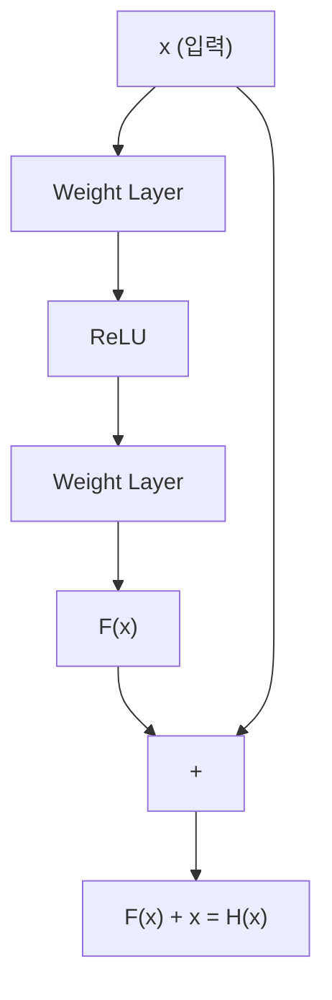
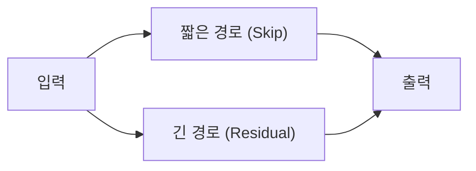
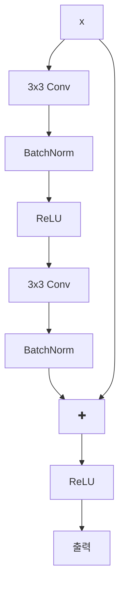

# ResNet (Residual Network)

## 목차
1. [개요](#1-개요)
2. [핵심 개념](#2-핵심-개념) 
   2.1. [Residual Learning (잔차 학습)](#21-residual-learning-잔차-학습) 
   2.2. [Skip Connection의 원리](#22-skip-connection의-원리) 
   2.3. [왜 학습이 더 잘 될까?](#23-왜-학습이-더-잘-될까) 
3. [ResNet 아키텍처](#3-resnet-아키텍처) 
   3.1. [Plain Baseline 설계](#31-plain-baseline-설계) 
   3.2. [Residual Block 구조](#32-residual-block-구조) 
4. [학습 설정 및 성능](#4-학습-설정-및-성능) 
   4.1. [하이퍼파라미터](#41-하이퍼파라미터) 
   4.2. [성능 지표](#42-성능-지표) 
5. [핵심 통찰](#5-핵심-통찰)
6. [용어 목록](#6-용어-목록)

---

## 1. 개요

ResNet(Residual Network)은 2015년 Microsoft Research에서 발표한 딥러닝 아키텍처로, **Residual Learning**과 **Skip Connection**을 도입하여 매우 깊은 네트워크를 성공적으로 학습할 수 있게 했습니다.

**핵심 문제 해결**: 깊은 네트워크에서 발생하는 **Gradient Vanishing** 문제와 **Degradation** 문제를 해결

---

## 2. 핵심 개념

### 2.1. Residual Learning (잔차 학습)

기존 방식과 ResNet의 차이점:

**기존 방식 (Direct Mapping)**:
- 목표: $H(x)$를 직접 학습
- 여기서 $H(x)$는 여러 레이어가 근사(approximation)해야 하는 기저 매핑
- $x$는 해당 레이어들의 첫 입력

**ResNet 방식 (Residual Learning)**:
- 목표: $F(x) = H(x) - x$를 학습 (잔차 함수)
- 최종 출력: $H(x) = F(x) + x$
- 즉, **원래 함수에서 입력을 뺀 차이(잔차)만 학습**

### 2.2. Skip Connection의 원리

**Skip Connection (Shortcut Connection)**은 입력 $x$를 여러 레이어를 건너뛰어 직접 출력에 더하는 연결입니다.

**수학적 표현**:

$$y = F(x, \{W_i\}) + x$$

여기서:
- $F(x, \{W_i\})$: 잔차 매핑 - 학습할 부분
- $x$: 항등 매핑 - 그대로 전달
- $W_i$: 레이어의 가중치

### 2.3. 왜 학습이 더 잘 될까?

**2.3.1. 항등 매핑의 용이성**
- 만약 최적해가 항등 매핑 $H(x) = x$라면?
- 기존 방식: 모든 가중치를 0에 가깝게 만들어야 함 (어려움)
- ResNet: $F(x) = 0$만 만들면 됨 (상대적으로 쉬움)

**2.3.2. Gradient Flow 개선**
역전파(backpropagation) 시 그래디언트 계산:

$$\frac{\partial \text{loss}}{\partial x} = \frac{\partial \text{loss}}{\partial y} \cdot \frac{\partial y}{\partial x}$$

$$\frac{\partial y}{\partial x} = \frac{\partial F(x)}{\partial x} + 1$$

**핵심**: "+1" 항으로 인해 그래디언트가 최소 1은 보장되어 **Gradient Vanishing 방지**

**2.3.3. 다중 경로 학습**

- 짧은 경로: 저수준 특징 보존
- 긴 경로: 고수준 특징 학습

---

## 3. ResNet 아키텍처

### 3.1. Plain Baseline 설계

**설계 철학** (VGG에서 영감):
- 주로 3×3 convolution 필터 사용
- 두 가지 간단한 설계 규칙:

**3.1.1. 동일 출력 크기 → 동일 필터 수**
- 같은 feature map 크기의 레이어들은 같은 수의 필터 사용

**3.1.2. 출력 크기 1/2 → 필터 수 2배**
- Feature map 크기가 절반이 되면 필터 수를 두 배로 증가
- **시간 복잡도 유지**를 위한 설계

**다운샘플링(downsampling)**: Stride 2 convolution으로 직접 수행

**최종 구조**:
- Global Average Pooling
- 1000-클래스 완전연결층 + Softmax
- 34층 baseline: **3.6억 FLOPs** (VGG-19의 1/8 수준)

### 3.2. Residual Block 구조

**기본 Residual Block**:

**Bottleneck Block (50+ 층)**:
- 1×1 → 3×3 → 1×1 구조
- 계산량 감소를 위한 차원 축소/확장

---

## 4. 학습 설정 및 성능

### 4.1. Hyperparameter(하이퍼파라미터)

| 설정 | 값 |
|------|-----|
| **최적화 알고리즘** | SGD + Momentum (0.9) |
| **초기 학습률** | 0.1 |
| **학습률 스케줄링** | 검증 오류 정체 시 1/10로 감소 |
| **배치 크기** | 256 |
| **가중치 감소** | 1e-5 |
| **초기화** | Xavier Initialization |
| **정규화** | Batch Normalization (각 Conv층마다) |
| **Dropout** | 사용 안 함 |

### 4.2. 성능 지표

**ILSVRC 2015 우승 결과**:
- **Top-5 오차율**: 3.6% (인간 성능 5.1%보다 우수)
- **다양한 깊이**: 18, 34, 50, 101, 152층 버전 제공

**계산 효율성**:
- ResNet-34: 3.6B FLOPs
- VGG-19: 19.6B FLOPs
- **약 5배 더 효율적**

---

## 5. 핵심 통찰

### 5.1. ResNet의 혁신성

5.1.1. **깊이의 장벽 돌파**: 152층까지 성공적 학습
5.1.2. **단순한 아이디어의 강력함**: Skip connection 하나로 패러다임 변화
5.1.3. **이론과 실제의 조화**: 수학적 직관과 실험 결과의 일치

### 5.2. 후속 연구에 미친 영향

- **DenseNet**: 모든 레이어 간 연결
- **Inception-ResNet**: Inception 모듈과 결합
- **ResNeXt**: Cardinality 개념 도입
- **EfficientNet**: 구조 최적화

### 5.3. 실용적 가치

**5.3.1. 장점**:
- 깊은 네트워크의 안정적 학습
- 다양한 도메인에 적용 가능
- 구현의 단순성

**5.3.2. 주의사항**:
- 메모리 사용량 증가 (Skip connection으로 인한)
- 매우 얕은 네트워크에서는 이득 제한적

---

## 결론

ResNet은 **"깊이"**라는 딥러닝의 핵심 문제를 **Residual Learning**이라는 우아한 해법으로 해결했습니다. 단순해 보이는 Skip Connection 하나가 딥러닝 역사를 바꾼 혁신적 아이디어였으며, 현재까지도 많은 모델의 기반이 되고 있습니다.

**핵심 기억사항**:

$$H(x) = F(x) + x$$

- $F(x) + x$ 형태의 잔차 학습
- Gradient flow 개선으로 깊은 네트워크 학습 가능
- 단순하지만 강력한 아이디어의 힘

---

## 6. 용어 목록

### 핵심 전문용어
- **Approximation** (어프록시메이션): 근사, 실제값에 가깝게 추정하는 것
- **Architecture**: 네트워크의 전체 구조 설계
- **Backpropagation**: 역전파, 오차를 거슬러 올라가며 가중치를 조정하는 방법
- **Cardinality** (카디널리티): 집합의 크기, ResNeXt에서 그룹의 개수
- **Computational Efficiency**: 계산 효율성
- **Degradation**: 성능 저하 현상
- **Downsampling**: 해상도를 낮추는 과정
- **FLOPs**: Floating Point Operations, 부동소수점 연산 수
- **Gradient Vanishing**: 기울기 소실 문제
- **Hyperparameter** (하이퍼파라미터): 모델 학습 전에 설정하는 매개변수
- **ILSVRC**: ImageNet Large Scale Visual Recognition Challenge
- **Initialization**: 초기화, 가중치의 초기값 설정
- **Paradigm** (패러다임): 사고의 틀, 접근 방식
- **Residual Learning**: 잔차 학습
- **Residual Mapping**: 잔차 매핑
- **Xavier Initialization**: 가중치 초기화 방법 중 하나

### 일반 용어
- **가중치**: 뉴럴 네트워크의 연결 강도를 나타내는 값
- **경사 하강법**: 손실 함수를 최소화하기 위한 최적화 알고리즘
- **기울기 소실**: 깊은 네트워크에서 기울기가 0에 가까워지는 문제
- **배치**: 한 번에 처리하는 데이터의 묶음
- **잔차**: 목표값과 예측값의 차이
- **정규화**: 데이터나 가중치를 일정한 범위로 조정하는 기법
- **최적화**: 손실 함수를 최소화하는 과정
- **특징**: 데이터에서 추출된 중요한 정보
- **학습률**: 가중치 업데이트 시 적용하는 변화량의 크기
- **활성화 함수**: 뉴런의 출력을 결정하는 비선형 함수
- **합성곱**: 이미지와 필터 간의 수학적 연산
- **항등 함수**: 입력을 그대로 출력하는 함수 f(x) = x

### 수학 기호
- **H(x)**: 목표 함수 (원래 학습하려던 함수)
- **F(x)**: 잔차 함수 (ResNet이 학습하는 함수)
- **x**: 입력 데이터
- **y**: 출력 데이터
- **W_i**: i번째 레이어의 가중치
- **∂**: 편미분 기호
- **+**: 덧셈 연산 (Skip Connection에서 핵심)

### 핵심 공식
**1. ResNet의 기본 구조**
$$y = F(x, \{W_i\}) + x$$

**2. 잔차 함수 정의**
$$F(x) = H(x) - x$$

**3. 원래 함수 복원**
$$H(x) = F(x) + x$$

**4. 그래디언트 흐름**
$$\frac{\partial y}{\partial x} = \frac{\partial F(x)}{\partial x} + 1$$

### 참고 자료
- **원논문**: He, K., Zhang, X., Ren, S., & Sun, J. (2016). Deep residual learning for image recognition. CVPR.
- **관련 연구**: Highway Networks (2015), DenseNet (2017), ResNeXt (2017)
- **구현 프레임워크**: PyTorch, TensorFlow, Keras에서 기본 제공

---

