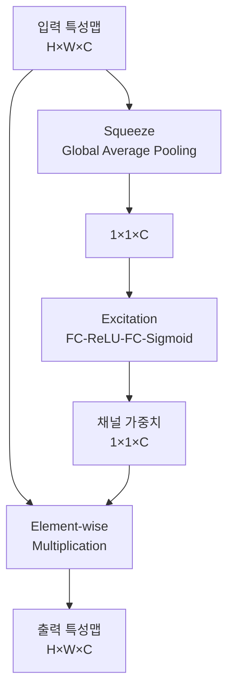
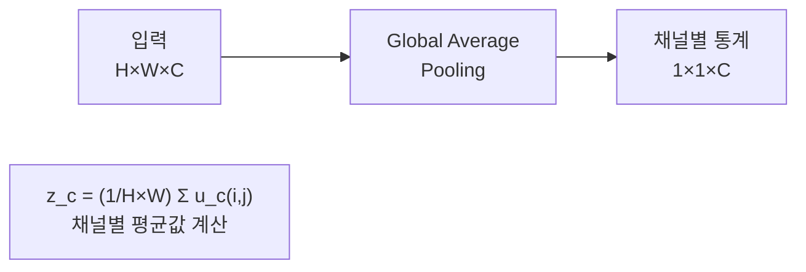
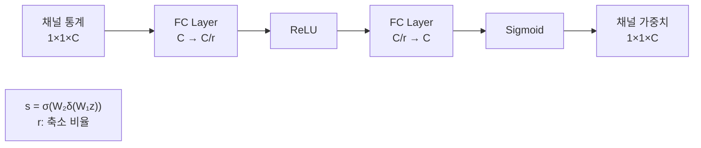
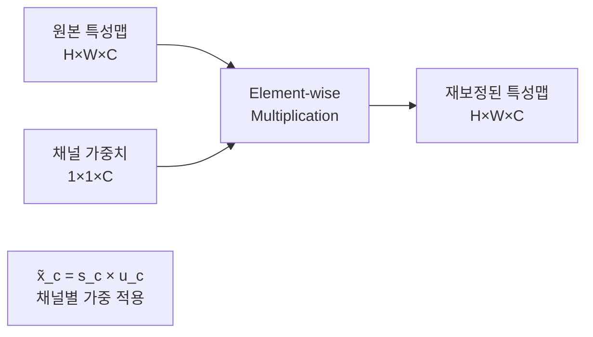
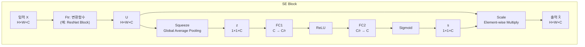

# SENet - Squeeze-and-Excitation으로 채널 어텐션을 도입한 CNN

## 개요

SENet(Squeeze-and-Excitation Networks)은 2018년 Momenta에서 Jie Hu, Li Shen, Gang Sun 등에 의해 개발된 혁신적인 합성곱 신경망입니다. "Squeeze-and-Excitation Networks" 논문으로 CVPR 2018에서 발표되었으며, ILSVRC 2017에서 1위를 차지했습니다. 채널 간의 상호 의존성을 모델링하는 Squeeze-and-Excitation (SE) 블록을 통해 채널별 중요도를 학습하는 어텐션 메커니즘을 도입했습니다.

## SENet의 핵심 아이디어

### 기존 CNN의 한계
- **균등한 채널 처리**: 모든 채널을 동일하게 처리
- **채널 간 관계 무시**: 채널 간 상호 의존성을 고려하지 않음
- **고정된 특성 표현**: 입력에 따른 적응적 특성 조정 부족

### SE 블록의 혁신
- **채널 어텐션**: 각 채널의 중요도를 동적으로 계산
- **글로벌 정보 활용**: 전역 정보를 통한 채널별 가중치 생성
- **적응적 재보정**: 입력에 따른 특성 맵 재조정



## SE 블록의 구조와 동작 원리

### Squeeze 단계 (압축)



### Excitation 단계 (흥분)



### Scale 단계 (재보정)



## SE 블록의 전체 구조

### SE 블록 완전 다이어그램



## SE 블록의 수학적 정의

### 1. Squeeze 연산
```
z_c = F_sq(u_c) = 1/(H×W) Σ(i=1 to H) Σ(j=1 to W) u_c(i,j)
```

### 2. Excitation 연산
```
s = F_ex(z,W) = σ(W₂δ(W₁z))
```
여기서:
- δ: ReLU 활성화 함수
- σ: Sigmoid 활성화 함수
- W₁ ∈ R^(C/r×C), W₂ ∈ R^(C×C/r)
- r: 축소 비율 (reduction ratio)

### 3. Scale 연산
```
x̃_c = F_scale(u_c, s_c) = s_c × u_c
```

## PyTorch 구현 예제

### 기본 SE 블록 구현

```python
import torch
import torch.nn as nn
import torch.nn.functional as F
import math

class SEBlock(nn.Module):
    def __init__(self, channel, reduction=16):
        super(SEBlock, self).__init__()
        
        # Squeeze: Global Average Pooling
        self.avg_pool = nn.AdaptiveAvgPool2d(1)
        
        # Excitation: FC layers
        # 안전한 축소 채널 수 계산 (channel//reduction이 0이 되지 않도록 방지)
        reduced_channels = max(1, channel // reduction) if isinstance(reduction, int) and reduction > 0 else max(1, channel // 16)

        self.fc = nn.Sequential(
            nn.Linear(channel, reduced_channels, bias=False),
            nn.ReLU(inplace=True),
            nn.Linear(reduced_channels, channel, bias=False),
            nn.Sigmoid()
        )
    
    def forward(self, x):
        batch_size, num_channels, _, _ = x.size()
        
        # Squeeze: 채널별 글로벌 평균
        y = self.avg_pool(x).view(batch_size, num_channels)
        
        # Excitation: 채널별 가중치 계산
        y = self.fc(y).view(batch_size, num_channels, 1, 1)
        
        # Scale: 원본 특성맵에 가중치 적용
        return x * y.expand_as(x)

# 사용 예제
se_block = SEBlock(channel=64, reduction=16)
input_tensor = torch.randn(4, 64, 32, 32)
output = se_block(input_tensor)
print(f"입력 크기: {input_tensor.shape}")
print(f"출력 크기: {output.shape}")
```

### SE-ResNet 블록 구현

```python
class SEBasicBlock(nn.Module):
    """ResNet BasicBlock with SE module"""
    expansion = 1
    
    def __init__(self, inplanes, planes, stride=1, downsample=None, reduction=16):
        super(SEBasicBlock, self).__init__()
        
        # ResNet BasicBlock 구조
        self.conv1 = nn.Conv2d(inplanes, planes, kernel_size=3, stride=stride,
                              padding=1, bias=False)
        self.bn1 = nn.BatchNorm2d(planes)
        self.relu = nn.ReLU(inplace=True)
        self.conv2 = nn.Conv2d(planes, planes, kernel_size=3, stride=1,
                              padding=1, bias=False)
        self.bn2 = nn.BatchNorm2d(planes)
        
        # SE 블록 추가
        self.se = SEBlock(planes, reduction)
        
        self.downsample = downsample
        self.stride = stride
    
    def forward(self, x):
        residual = x
        
        # 첫 번째 컨볼루션
        out = self.conv1(x)
        out = self.bn1(out)
        out = self.relu(out)
        
        # 두 번째 컨볼루션
        out = self.conv2(out)
        out = self.bn2(out)
        
        # SE 블록 적용
        out = self.se(out)
        
        # Residual connection
        if self.downsample is not None:
            residual = self.downsample(x)
        
        out += residual
        out = self.relu(out)
        
        return out

class SEBottleneck(nn.Module):
    """ResNet Bottleneck with SE module"""
    expansion = 4
    
    def __init__(self, inplanes, planes, stride=1, downsample=None, reduction=16):
        super(SEBottleneck, self).__init__()
        
        # Bottleneck 구조
        self.conv1 = nn.Conv2d(inplanes, planes, kernel_size=1, bias=False)
        self.bn1 = nn.BatchNorm2d(planes)
        self.conv2 = nn.Conv2d(planes, planes, kernel_size=3, stride=stride,
                              padding=1, bias=False)
        self.bn2 = nn.BatchNorm2d(planes)
        self.conv3 = nn.Conv2d(planes, planes * 4, kernel_size=1, bias=False)
        self.bn3 = nn.BatchNorm2d(planes * 4)
        self.relu = nn.ReLU(inplace=True)
        
        # SE 블록 추가
        self.se = SEBlock(planes * 4, reduction)
        
        self.downsample = downsample
        self.stride = stride
    
    def forward(self, x):
        residual = x
        
        # 1×1 convolution
        out = self.conv1(x)
        out = self.bn1(out)
        out = self.relu(out)
        
        # 3×3 convolution
        out = self.conv2(out)
        out = self.bn2(out)
        out = self.relu(out)
        
        # 1×1 convolution
        out = self.conv3(out)
        out = self.bn3(out)
        
        # SE 블록 적용
        out = self.se(out)
        
        # Residual connection
        if self.downsample is not None:
            residual = self.downsample(x)
        
        out += residual
        out = self.relu(out)
        
        return out
```

### 완전한 SE-ResNet 구현

```python
class SEResNet(nn.Module):
    def __init__(self, block, layers, num_classes=1000, reduction=16):
        super(SEResNet, self).__init__()
        
        self.inplanes = 64
        self.reduction = reduction
        
        # Stem layers
        self.conv1 = nn.Conv2d(3, 64, kernel_size=7, stride=2, padding=3, bias=False)
        self.bn1 = nn.BatchNorm2d(64)
        self.relu = nn.ReLU(inplace=True)
        self.maxpool = nn.MaxPool2d(kernel_size=3, stride=2, padding=1)
        
        # ResNet layers with SE blocks
        self.layer1 = self._make_layer(block, 64, layers[0])
        self.layer2 = self._make_layer(block, 128, layers[1], stride=2)
        self.layer3 = self._make_layer(block, 256, layers[2], stride=2)
        self.layer4 = self._make_layer(block, 512, layers[3], stride=2)
        
        # Classifier
        self.avgpool = nn.AdaptiveAvgPool2d((1, 1))
        self.fc = nn.Linear(512 * block.expansion, num_classes)
        
        # Weight initialization
        for m in self.modules():
            if isinstance(m, nn.Conv2d):
                nn.init.kaiming_normal_(m.weight, mode='fan_out', nonlinearity='relu')
            elif isinstance(m, nn.BatchNorm2d):
                nn.init.constant_(m.weight, 1)
                nn.init.constant_(m.bias, 0)
    
    def _make_layer(self, block, planes, blocks, stride=1):
        downsample = None
        if stride != 1 or self.inplanes != planes * block.expansion:
            downsample = nn.Sequential(
                nn.Conv2d(self.inplanes, planes * block.expansion,
                         kernel_size=1, stride=stride, bias=False),
                nn.BatchNorm2d(planes * block.expansion),
            )
        
        layers = []
        layers.append(block(self.inplanes, planes, stride, downsample, self.reduction))
        self.inplanes = planes * block.expansion
        for i in range(1, blocks):
            layers.append(block(self.inplanes, planes, reduction=self.reduction))
        
        return nn.Sequential(*layers)
    
    def forward(self, x):
        x = self.conv1(x)
        x = self.bn1(x)
        x = self.relu(x)
        x = self.maxpool(x)
        
        x = self.layer1(x)
        x = self.layer2(x)
        x = self.layer3(x)
        x = self.layer4(x)
        
        x = self.avgpool(x)
        x = torch.flatten(x, 1)
        x = self.fc(x)
        
        return x

# 다양한 SE-ResNet 모델 생성 함수들
def se_resnet18(num_classes=1000, reduction=16):
    return SEResNet(SEBasicBlock, [2, 2, 2, 2], num_classes, reduction)

def se_resnet34(num_classes=1000, reduction=16):
    return SEResNet(SEBasicBlock, [3, 4, 6, 3], num_classes, reduction)

def se_resnet50(num_classes=1000, reduction=16):
    return SEResNet(SEBottleneck, [3, 4, 6, 3], num_classes, reduction)

def se_resnet101(num_classes=1000, reduction=16):
    return SEResNet(SEBottleneck, [3, 4, 23, 3], num_classes, reduction)

def se_resnet152(num_classes=1000, reduction=16):
    return SEResNet(SEBottleneck, [3, 8, 36, 3], num_classes, reduction)

# 사용 예제
model = se_resnet50(num_classes=1000, reduction=16)
print(f"총 파라미터 수: {sum(p.numel() for p in model.parameters()):,}")

# 입력 테스트
x = torch.randn(2, 3, 224, 224)
output = model(x)
print(f"출력 크기: {output.shape}")
```

## Reduction Ratio의 영향 분석

### Reduction Ratio 비교

```python
def analyze_reduction_ratio():
    """Reduction ratio가 성능과 계산량에 미치는 영향 분석"""
    
    channel_sizes = [64, 128, 256, 512]
    reduction_ratios = [4, 8, 16, 32]
    
    print("Reduction Ratio별 파라미터 수 분석:")
    print("=" * 60)
    
    for channels in channel_sizes:
        print(f"\n채널 수: {channels}")
        print("-" * 30)
        
        for r in reduction_ratios:
            # SE 블록 파라미터 계산
            # FC1: C → C/r, FC2: C/r → C
            params = channels * (channels // r) + (channels // r) * channels
            params_ratio = params / (channels * channels) * 100
            
            print(f"  r={r:2d}: {params:6,} params ({params_ratio:5.1f}% of full FC)")
    
    print(f"\n권장 설정:")
    print(f"  - r=16: 성능과 효율성의 균형")
    print(f"  - r=8: 높은 성능, 약간 많은 파라미터")
    print(f"  - r=32: 낮은 파라미터, 성능 약간 감소")

analyze_reduction_ratio()
```

### SE 블록의 계산 복잡도

```python
def calculate_se_complexity():
    """SE 블록의 계산 복잡도 분석"""
    
    def se_flops(H, W, C, r):
        # Global Average Pooling: H×W×C
        gap_flops = H * W * C
        
        # FC1: C × (C/r)
        fc1_flops = C * (C // r)
        
        # FC2: (C/r) × C
        fc2_flops = (C // r) * C
        
        # Element-wise multiplication: H×W×C
        scale_flops = H * W * C
        
        total_flops = gap_flops + fc1_flops + fc2_flops + scale_flops
        return total_flops
    
    # 다양한 입력 크기에 대한 분석
    test_cases = [
        (56, 56, 64, 16),    # ResNet layer1
        (28, 28, 128, 16),   # ResNet layer2
        (14, 14, 256, 16),   # ResNet layer3
        (7, 7, 512, 16),     # ResNet layer4
    ]
    
    print("SE 블록 계산 복잡도 분석:")
    print("=" * 50)
    
    for H, W, C, r in test_cases:
        total_flops = se_flops(H, W, C, r)
        
        # 기본 ResNet 블록과 비교
        conv_flops = H * W * C * C * 9  # 3×3 conv 근사치
        overhead = (total_flops / conv_flops) * 100
        
        print(f"크기 {H}×{W}×{C}: {total_flops:,} FLOPs ({overhead:.2f}% overhead)")

calculate_se_complexity()
```

## CIFAR-10 학습 예제

```python
import torch.optim as optim
from torchvision import datasets, transforms
from torch.utils.data import DataLoader

# CIFAR-10용 SE-ResNet
class SEResNetCIFAR(nn.Module):
    def __init__(self, block, layers, num_classes=10, reduction=16):
        super(SEResNetCIFAR, self).__init__()
        
        self.inplanes = 16
        self.reduction = reduction
        
        # CIFAR-10에 맞게 첫 레이어 조정
        self.conv1 = nn.Conv2d(3, 16, kernel_size=3, stride=1, padding=1, bias=False)
        self.bn1 = nn.BatchNorm2d(16)
        self.relu = nn.ReLU(inplace=True)
        
        # SE-ResNet layers
        self.layer1 = self._make_layer(block, 16, layers[0])
        self.layer2 = self._make_layer(block, 32, layers[1], stride=2)
        self.layer3 = self._make_layer(block, 64, layers[2], stride=2)
        
        # Classifier
        self.avgpool = nn.AdaptiveAvgPool2d((1, 1))
        self.fc = nn.Linear(64 * block.expansion, num_classes)
    
    def _make_layer(self, block, planes, blocks, stride=1):
        downsample = None
        if stride != 1 or self.inplanes != planes * block.expansion:
            downsample = nn.Sequential(
                nn.Conv2d(self.inplanes, planes * block.expansion,
                         kernel_size=1, stride=stride, bias=False),
                nn.BatchNorm2d(planes * block.expansion),
            )
        
        layers = []
        layers.append(block(self.inplanes, planes, stride, downsample, self.reduction))
        self.inplanes = planes * block.expansion
        for i in range(1, blocks):
            layers.append(block(self.inplanes, planes, reduction=self.reduction))
        
        return nn.Sequential(*layers)
    
    def forward(self, x):
        x = self.conv1(x)
        x = self.bn1(x)
        x = self.relu(x)
        
        x = self.layer1(x)
        x = self.layer2(x)
        x = self.layer3(x)
        
        x = self.avgpool(x)
        x = torch.flatten(x, 1)
        x = self.fc(x)
        
        return x

def se_resnet20_cifar(reduction=16):
    return SEResNetCIFAR(SEBasicBlock, [3, 3, 3], num_classes=10, reduction=reduction)

def se_resnet56_cifar(reduction=16):
    return SEResNetCIFAR(SEBasicBlock, [9, 9, 9], num_classes=10, reduction=reduction)

# 데이터 전처리
transform_train = transforms.Compose([
    transforms.RandomCrop(32, padding=4),
    transforms.RandomHorizontalFlip(),
    transforms.ToTensor(),
    transforms.Normalize((0.4914, 0.4822, 0.4465), (0.2023, 0.1994, 0.2010))
])

transform_test = transforms.Compose([
    transforms.ToTensor(),
    transforms.Normalize((0.4914, 0.4822, 0.4465), (0.2023, 0.1994, 0.2010))
])

# 데이터셋 로드
train_dataset = datasets.CIFAR10('./data', train=True, download=True, transform=transform_train)
test_dataset = datasets.CIFAR10('./data', train=False, transform=transform_test)

train_loader = DataLoader(train_dataset, batch_size=128, shuffle=True, num_workers=2)
test_loader = DataLoader(test_dataset, batch_size=100, shuffle=False, num_workers=2)

# 모델 및 학습 설정
device = torch.device('cuda' if torch.cuda.is_available() else 'cpu')
model = se_resnet56_cifar(reduction=16).to(device)
criterion = nn.CrossEntropyLoss()
optimizer = optim.SGD(model.parameters(), lr=0.1, momentum=0.9, weight_decay=1e-4)
scheduler = optim.lr_scheduler.MultiStepLR(optimizer, milestones=[82, 123], gamma=0.1)

# 학습 함수
def train_epoch(epoch):
    model.train()
    train_loss = 0
    correct = 0
    total = 0
    
    for batch_idx, (data, target) in enumerate(train_loader):
        data, target = data.to(device), target.to(device)
        
        optimizer.zero_grad()
        output = model(data)
        loss = criterion(output, target)
        loss.backward()
        optimizer.step()
        
        train_loss += loss.item()
        _, predicted = output.max(1)
        total += target.size(0)
        correct += predicted.eq(target).sum().item()
        
        if batch_idx % 100 == 0:
            print(f'Epoch {epoch}, Batch {batch_idx}, '
                  f'Loss: {train_loss/(batch_idx+1):.4f}, '
                  f'Acc: {100.*correct/total:.2f}%')

# 테스트 함수
def test():
    model.eval()
    test_loss = 0
    correct = 0
    total = 0
    
    with torch.no_grad():
        for data, target in test_loader:
            data, target = data.to(device), target.to(device)
            output = model(data)
            test_loss += criterion(output, target).item()
            _, predicted = output.max(1)
            total += target.size(0)
            correct += predicted.eq(target).sum().item()
    
    accuracy = 100. * correct / total
    print(f'Test Accuracy: {accuracy:.2f}%')
    return accuracy

# 학습 실행
best_acc = 0
for epoch in range(164):
    train_epoch(epoch)
    acc = test()
    scheduler.step()
    
    if acc > best_acc:
        best_acc = acc
        torch.save(model.state_dict(), 'se_resnet56_cifar10_best.pth')

print(f'Best Test Accuracy: {best_acc:.2f}%')
```

## SE 블록의 변형들

### 1. ECA (Efficient Channel Attention)

```python
class ECABlock(nn.Module):
    """Efficient Channel Attention - SE 블록의 경량화 버전"""
    
    def __init__(self, channel, gamma=2, b=1):
        super(ECABlock, self).__init__()

        # 적응적 커널 크기 계산 (안전하게 1 이상의 홀수로 보정)
        # math 모듈은 이 블록 상단에서 import 되어야 함
        kernel_size = int(abs((math.log(channel, 2) + b) / gamma))
        kernel_size = max(1, kernel_size)
        if kernel_size % 2 == 0:
            kernel_size += 1

        self.avg_pool = nn.AdaptiveAvgPool2d(1)
        self.conv = nn.Conv1d(1, 1, kernel_size=kernel_size, padding=(kernel_size - 1) // 2, bias=False)
        self.sigmoid = nn.Sigmoid()
    
    def forward(self, x):
        # Global Average Pooling
        y = self.avg_pool(x)
        
        # 1D Convolution (FC layer 대신 사용)
        y = self.conv(y.squeeze(-1).transpose(-1, -2)).transpose(-1, -2).unsqueeze(-1)
        
        # Sigmoid 활성화
        y = self.sigmoid(y)
        
        return x * y.expand_as(x)

import math

# 사용 예제
eca_block = ECABlock(channel=64)
input_tensor = torch.randn(4, 64, 32, 32)
output = eca_block(input_tensor)
print(f"ECA 블록 - 입력: {input_tensor.shape}, 출력: {output.shape}")
```

### 2. CBAM (Convolutional Block Attention Module)

```python
class ChannelAttention(nn.Module):
    def __init__(self, in_planes, ratio=16):
        super(ChannelAttention, self).__init__()
        self.avg_pool = nn.AdaptiveAvgPool2d(1)
        self.max_pool = nn.AdaptiveMaxPool2d(1)
        
        self.fc1 = nn.Conv2d(in_planes, in_planes // ratio, 1, bias=False)
        self.relu1 = nn.ReLU()
        self.fc2 = nn.Conv2d(in_planes // ratio, in_planes, 1, bias=False)
        self.sigmoid = nn.Sigmoid()
    
    def forward(self, x):
        avg_out = self.fc2(self.relu1(self.fc1(self.avg_pool(x))))
        max_out = self.fc2(self.relu1(self.fc1(self.max_pool(x))))
        out = avg_out + max_out
        return self.sigmoid(out)

class SpatialAttention(nn.Module):
    def __init__(self, kernel_size=7):
        super(SpatialAttention, self).__init__()
        
        assert kernel_size in (3, 7), 'kernel size must be 3 or 7'
        padding = 3 if kernel_size == 7 else 1
        
        self.conv1 = nn.Conv2d(2, 1, kernel_size, padding=padding, bias=False)
        self.sigmoid = nn.Sigmoid()
    
    def forward(self, x):
        avg_out = torch.mean(x, dim=1, keepdim=True)
        max_out, _ = torch.max(x, dim=1, keepdim=True)
        x = torch.cat([avg_out, max_out], dim=1)
        x = self.conv1(x)
        return self.sigmoid(x)

class CBAM(nn.Module):
    def __init__(self, in_planes, ratio=16, kernel_size=7):
        super(CBAM, self).__init__()
        self.ca = ChannelAttention(in_planes, ratio)
        self.sa = SpatialAttention(kernel_size)
    
    def forward(self, x):
        # Channel Attention
        x = x * self.ca(x)
        # Spatial Attention
        x = x * self.sa(x)
        return x

# 사용 예제
cbam_block = CBAM(in_planes=64)
input_tensor = torch.randn(4, 64, 32, 32)
output = cbam_block(input_tensor)
print(f"CBAM 블록 - 입력: {input_tensor.shape}, 출력: {output.shape}")
```

### 3. SE 블록 변형들 비교

```python
def compare_attention_modules():
    """다양한 어텐션 모듈들의 성능 비교"""
    
    channel = 64
    input_size = (4, channel, 32, 32)
    input_tensor = torch.randn(*input_size)
    
    # 다양한 어텐션 모듈 생성
    modules = {
        'SE Block': SEBlock(channel, reduction=16),
        'ECA Block': ECABlock(channel),
        'CBAM': CBAM(channel),
        'No Attention': nn.Identity()
    }
    
    print("어텐션 모듈 비교:")
    print("=" * 50)
    
    for name, module in modules.items():
        # 파라미터 수 계산
        params = sum(p.numel() for p in module.parameters())
        
        # 추론 시간 측정
        import time
        start_time = time.time()
        
        with torch.no_grad():
            for _ in range(100):
                output = module(input_tensor)
        
        inference_time = (time.time() - start_time) / 100 * 1000  # ms
        
        print(f"{name:12}: {params:6,} params, {inference_time:.2f}ms")
    
    return modules

attention_modules = compare_attention_modules()
```

## SE 블록의 시각화 및 분석

### 1. 채널 가중치 시각화

```python
def visualize_channel_weights():
    """SE 블록에서 학습된 채널 가중치 시각화"""
    
    import matplotlib.pyplot as plt
    
    # SE 블록 생성 및 더미 가중치 설정
    se_block = SEBlock(channel=64, reduction=16)
    se_block.eval()
    
    # 샘플 입력으로 채널 가중치 추출
    with torch.no_grad():
        sample_input = torch.randn(1, 64, 32, 32)
        
        # SE 블록의 중간 결과 추출
        batch_size, num_channels, _, _ = sample_input.size()
        
        # Squeeze
        y = se_block.avg_pool(sample_input).view(batch_size, num_channels)
        
        # Excitation - 가중치 추출
        weights = se_block.fc(y).view(batch_size, num_channels).squeeze(0)
        
        # 채널별 가중치 시각화
        plt.figure(figsize=(12, 6))
        
        plt.subplot(1, 2, 1)
        plt.bar(range(64), weights.numpy())
        plt.xlabel('Channel Index')
        plt.ylabel('Attention Weight')
        plt.title('SE Block Channel Attention Weights')
        plt.grid(True, alpha=0.3)
        
        plt.subplot(1, 2, 2)
        plt.plot(weights.numpy(), 'b-', linewidth=2)
        plt.xlabel('Channel Index')
        plt.ylabel('Attention Weight')
        plt.title('Channel Attention Pattern')
        plt.grid(True, alpha=0.3)
        
        plt.tight_layout()
        plt.show()
        
        # 통계 정보
        print(f"채널 가중치 통계:")
        print(f"  평균: {weights.mean():.4f}")
        print(f"  표준편차: {weights.std():.4f}")
        print(f"  최대값: {weights.max():.4f}")
        print(f"  최소값: {weights.min():.4f}")

visualize_channel_weights()
```

### 2. SE 블록 효과 분석

```python
def analyze_se_effect():
    """SE 블록이 특성 맵에 미치는 영향 분석"""
    
    # 모델 비교 (SE 있음 vs 없음)
    class SimpleBlock(nn.Module):
        def __init__(self, channels, use_se=False):
            super(SimpleBlock, self).__init__()
            self.conv1 = nn.Conv2d(channels, channels, 3, padding=1)
            self.bn1 = nn.BatchNorm2d(channels)
            self.conv2 = nn.Conv2d(channels, channels, 3, padding=1)
            self.bn2 = nn.BatchNorm2d(channels)
            self.relu = nn.ReLU(inplace=True)
            
            self.se = SEBlock(channels) if use_se else nn.Identity()
            
        def forward(self, x):
            residual = x
            
            out = self.relu(self.bn1(self.conv1(x)))
            out = self.bn2(self.conv2(out))
            out = self.se(out)  # SE 블록 적용
            
            out += residual
            out = self.relu(out)
            return out
    
    # 테스트 입력
    channels = 64
    input_tensor = torch.randn(1, channels, 32, 32)
    
    # SE 없는 블록과 있는 블록 비교
    block_without_se = SimpleBlock(channels, use_se=False)
    block_with_se = SimpleBlock(channels, use_se=True)
    
    block_without_se.eval()
    block_with_se.eval()
    
    with torch.no_grad():
        output_without_se = block_without_se(input_tensor)
        output_with_se = block_with_se(input_tensor)
        
        # 채널별 활성화 강도 비교
        activation_without_se = output_without_se.mean(dim=[2, 3]).squeeze()
        activation_with_se = output_with_se.mean(dim=[2, 3]).squeeze()
        
        print("SE 블록 효과 분석:")
        print("-" * 30)
        print(f"SE 없음 - 평균 활성화: {activation_without_se.mean():.4f}")
        print(f"SE 있음 - 평균 활성화: {activation_with_se.mean():.4f}")
        
        # 채널 간 분산 비교 (선택성 측정)
        std_without_se = activation_without_se.std()
        std_with_se = activation_with_se.std()
        
        print(f"SE 없음 - 채널 간 분산: {std_without_se:.4f}")
        print(f"SE 있음 - 채널 간 분산: {std_with_se:.4f}")
        print(f"선택성 증가: {((std_with_se / std_without_se - 1) * 100):.2f}%")

analyze_se_effect()
```

## 성능 벤치마크

### ImageNet 성능 비교

```python
def imagenet_performance_comparison():
    """ImageNet에서의 SE 블록 성능 비교"""
    
    performance_data = {
        'Model': [
            'ResNet-50', 'SE-ResNet-50',
            'ResNet-101', 'SE-ResNet-101',
            'ResNet-152', 'SE-ResNet-152',
            'ResNeXt-50', 'SE-ResNeXt-50',
            'ResNeXt-101', 'SE-ResNeXt-101'
        ],
        'Top-1 Error (%)': [
            23.85, 22.38,  # ResNet-50
            22.63, 21.75,  # ResNet-101  
            21.69, 20.97,  # ResNet-152
            22.2, 21.05,   # ResNeXt-50
            21.2, 19.81    # ResNeXt-101
        ],
        'Top-5 Error (%)': [
            7.13, 6.36,    # ResNet-50
            6.44, 5.99,    # ResNet-101
            5.94, 5.54,    # ResNet-152
            6.05, 5.49,    # ResNeXt-50
            5.59, 4.99     # ResNeXt-101
        ],
        'Params (M)': [
            25.6, 28.1,    # ResNet-50 (+2.5M)
            44.5, 49.3,    # ResNet-101 (+4.8M)
            60.2, 66.8,    # ResNet-152 (+6.6M)
            25.0, 27.6,    # ResNeXt-50 (+2.6M)
            44.2, 48.9     # ResNeXt-101 (+4.7M)
        ],
        'Additional Params (%)': [
            0, 9.8,        # ResNet-50
            0, 10.8,       # ResNet-101
            0, 11.0,       # ResNet-152
            0, 10.4,       # ResNeXt-50
            0, 10.6        # ResNeXt-101
        ]
    }
    
    import pandas as pd
    df = pd.DataFrame(performance_data)
    
    print("ImageNet 성능 비교 (SE 블록 적용 효과):")
    print("=" * 70)
    print(df.to_string(index=False))
    
    print("\nSE 블록의 효과:")
    print("- Top-1 Error 평균 감소: ~1.5%")
    print("- Top-5 Error 평균 감소: ~0.6%")
    print("- 파라미터 증가: ~10% (경미한 증가)")
    print("- 계산 오버헤드: <1% (무시할 수 있는 수준)")

imagenet_performance_comparison()
```

### 실제 추론 속도 측정

```python
def benchmark_inference_speed():
    """SE 블록 적용에 따른 추론 속도 비교"""
    
    import torch.utils.benchmark as benchmark
    
    device = torch.device('cuda' if torch.cuda.is_available() else 'cpu')
    
    # 모델 준비
    # baseline: torchvision의 ResNet-50 (SE 비활성화)
    import torchvision.models as tv_models
    models = {
        'ResNet-50': tv_models.resnet50(pretrained=False),
        'SE-ResNet-50 (r=16)': se_resnet50(reduction=16),
        'SE-ResNet-50 (r=8)': se_resnet50(reduction=8),
        'SE-ResNet-50 (r=4)': se_resnet50(reduction=4)
    }
    
    batch_sizes = [1, 8, 32]
    
    print("추론 속도 벤치마크:")
    print("=" * 60)
    
    for batch_size in batch_sizes:
        print(f"\n배치 크기: {batch_size}")
        print("-" * 40)
        
        for name, model in models.items():
            model = model.to(device).eval()
            
            # 추론 시간 측정
            timer = benchmark.Timer(
                stmt='model(x)',
                setup='import torch',
                globals={
                    'model': model,
                    'x': torch.randn(batch_size, 3, 224, 224).to(device)
                }
            )
            
            result = timer.timeit(100)
            throughput = batch_size / result.mean
            
            print(f"{name:20} | {result.mean*1000:6.2f}ms | {throughput:6.1f} imgs/sec")

benchmark_inference_speed()
```

## 실무 활용 가이드

### 1. 기존 모델에 SE 블록 추가

```python
def add_se_to_existing_model(model, reduction=16):
    """기존 모델에 SE 블록을 추가하는 함수"""
    
    def add_se_to_layer(layer, reduction):
        """레이어에 SE 블록 추가"""
        if hasattr(layer, 'out_channels'):
            # Convolutional layer인 경우
            out_channels = layer.out_channels
            return nn.Sequential(
                layer,
                SEBlock(out_channels, reduction)
            )
        return layer
    
    # 모델의 각 레이어를 순회하며 SE 블록 추가
    for name, module in model.named_children():
        if isinstance(module, (nn.Conv2d, nn.Sequential)):
            setattr(model, name, add_se_to_layer(module, reduction))
        elif hasattr(module, '__iter__'):
            # 중첩된 모듈의 경우 재귀적으로 처리
            add_se_to_existing_model(module, reduction)
    
    return model

# 사용 예제
import torchvision.models as models
resnet = models.resnet18(pretrained=True)
se_resnet = add_se_to_existing_model(resnet, reduction=16)
print("기존 ResNet에 SE 블록이 추가되었습니다.")
```

### 2. 전이 학습에서 SE 블록 활용

```python
def setup_se_transfer_learning(num_classes, base_model='se_resnet50', freeze_backbone=True):
    """SE 모델을 이용한 전이 학습 설정"""
    
    # 사전 훈련된 SE 모델 로드 (실제로는 torchvision에서 지원하지 않으므로 수동 로드 필요)
    model = se_resnet50(num_classes=1000, reduction=16)
    
    if freeze_backbone:
        # Backbone 고정
        for name, param in model.named_parameters():
            if 'fc' not in name:  # 분류기가 아닌 모든 레이어 고정
                param.requires_grad = False
    
    # 새로운 분류기 설정
    num_features = model.fc.in_features
    model.fc = nn.Linear(num_features, num_classes)
    
    # 최적화기 설정 (SE 블록 포함)
    if freeze_backbone:
        optimizer = optim.Adam(model.fc.parameters(), lr=1e-3)
    else:
        # SE 블록은 좀 더 큰 학습률 적용
        se_params = []
        other_params = []
        
        for name, param in model.named_parameters():
            if 'se.fc' in name:
                se_params.append(param)
            else:
                other_params.append(param)
        
        optimizer = optim.Adam([
            {'params': other_params, 'lr': 1e-4},
            {'params': se_params, 'lr': 5e-4},  # SE 블록에 더 큰 학습률
            {'params': model.fc.parameters(), 'lr': 1e-3}
        ])
    
    return model, optimizer

# 사용 예제
model, optimizer = setup_se_transfer_learning(num_classes=10, freeze_backbone=False)
print("SE 전이 학습 모델 준비 완료")
```

### 3. SE 블록 하이퍼파라미터 튜닝

```python
def tune_se_hyperparameters():
    """SE 블록 하이퍼파라미터 튜닝 가이드"""
    
    tuning_guide = {
        'Reduction Ratio (r)': {
            'range': [4, 8, 16, 32, 64],
            'default': 16,
            'effect': {
                'low (4-8)': '높은 표현력, 많은 파라미터',
                'medium (16)': '성능과 효율성의 균형',
                'high (32-64)': '적은 파라미터, 표현력 제한'
            },
            'recommendation': '대부분의 경우 16이 최적, 작은 모델에서는 8 고려'
        },
        'SE 블록 위치': {
            'options': ['Conv 후', 'BN 후', 'ReLU 후', 'Residual 연결 직전'],
            'default': 'Residual 연결 직전',
            'recommendation': 'ResNet: residual 연결 직전, DenseNet: concatenation 후'
        },
        'Global Pooling': {
            'options': ['Average', 'Max', 'Average+Max'],
            'default': 'Average',
            'recommendation': 'Average pooling이 일반적으로 최적'
        }
    }
    
    print("SE 블록 하이퍼파라미터 튜닝 가이드:")
    print("=" * 50)
    
    for param_name, info in tuning_guide.items():
        print(f"\n{param_name}:")
        if 'range' in info:
            print(f"  범위: {info['range']}")
        if 'options' in info:
            print(f"  옵션: {info['options']}")
        print(f"  기본값: {info['default']}")
        if 'effect' in info:
            print("  효과:")
            for level, effect in info['effect'].items():
                print(f"    {level}: {effect}")
        print(f"  권장사항: {info['recommendation']}")

tune_se_hyperparameters()
```

## SE 블록의 이론적 분석

### 1. 정보 이론적 관점

```python
def information_theoretic_analysis():
    """SE 블록의 정보 이론적 분석"""
    
    print("SE 블록의 정보 이론적 분석:")
    print("=" * 40)
    
    print("\n1. 정보 압축과 복원:")
    print("   - Squeeze: H×W×C → 1×1×C (공간 정보 압축)")
    print("   - Excitation: C → C/r → C (채널 정보 압축 후 복원)")
    print("   - 압축률 r에 따른 정보 손실과 노이즈 제거 트레이드오프")
    
    print("\n2. 채널 간 상호정보 (Mutual Information):")
    print("   - SE 블록은 채널 간 상호의존성을 학습")
    print("   - 중요한 채널 조합을 강화, 불필요한 채널을 억제")
    print("   - I(X; Y) = H(X) - H(X|Y) 최대화")
    
    print("\n3. 어텐션 엔트로피:")
    print("   - 균등한 어텐션 (높은 엔트로피): 모든 채널 동등 중요")
    print("   - 집중된 어텐션 (낮은 엔트로피): 특정 채널 집중")
    print("   - 적절한 엔트로피 수준이 성능 최적화")

information_theoretic_analysis()
```

### 2. Gradient Flow 분석

```python
def analyze_gradient_flow():
    """SE 블록이 gradient flow에 미치는 영향"""
    
    print("SE 블록의 Gradient Flow 분석:")
    print("=" * 40)
    
    print("\n1. Gradient Highway:")
    print("   - SE 블록은 모든 채널에 대한 gradient path 제공")
    print("   - 중요한 채널: 큰 가중치 → 강한 gradient")
    print("   - 불중요한 채널: 작은 가중치 → 약한 gradient")
    
    print("\n2. 적응적 학습률:")
    print("   - 채널별로 다른 효과적 학습률 적용")
    print("   - 중요한 특성은 빠르게, 불중요한 특성은 천천히 학습")
    print("   - 자동적인 curriculum learning 효과")
    
    print("\n3. 정규화 효과:")
    print("   - 채널 가중치의 sigmoid 활성화로 인한 정규화")
    print("   - 과도한 활성화 방지 (gradient explosion 완화)")
    print("   - 암시적 배치 정규화 효과")

analyze_gradient_flow()
```

## 최신 연구 동향 및 응용

### 1. SE 블록의 발전된 형태들

```python
class AdaptiveSEBlock(nn.Module):
    """입력에 따라 reduction ratio가 적응되는 SE 블록"""
    
    def __init__(self, channel, min_reduction=4, max_reduction=32):
        super(AdaptiveSEBlock, self).__init__()
        
        self.channel = channel
        self.min_reduction = min_reduction
        self.max_reduction = max_reduction
        
        # Global Average Pooling
        self.avg_pool = nn.AdaptiveAvgPool2d(1)
        
        # Reduction ratio 예측을 위한 네트워크
        self.reduction_predictor = nn.Sequential(
            nn.Linear(channel, channel // 4),
            nn.ReLU(inplace=True),
            nn.Linear(channel // 4, 1),
            nn.Sigmoid()
        )
        
        # 다양한 reduction ratio에 대한 FC layers
        self.fc_layers = nn.ModuleDict({
            str(r): nn.Sequential(
                nn.Linear(channel, channel // r),
                nn.ReLU(inplace=True),
                nn.Linear(channel // r, channel),
                nn.Sigmoid()
            ) for r in [4, 8, 16, 32]
        })
    
    def forward(self, x):
        batch_size, num_channels, _, _ = x.size()
        
        # Global pooling
        y = self.avg_pool(x).view(batch_size, num_channels)
        
        # Reduction ratio 예측
        reduction_weight = self.reduction_predictor(y.mean(dim=0, keepdim=True))
        
        # 적응적 reduction 적용
        if reduction_weight < 0.25:
            attention = self.fc_layers['4'](y)
        elif reduction_weight < 0.5:
            attention = self.fc_layers['8'](y)
        elif reduction_weight < 0.75:
            attention = self.fc_layers['16'](y)
        else:
            attention = self.fc_layers['32'](y)
        
        attention = attention.view(batch_size, num_channels, 1, 1)
        return x * attention.expand_as(x)

# 테스트
adaptive_se = AdaptiveSEBlock(channel=64)
test_input = torch.randn(4, 64, 32, 32)
output = adaptive_se(test_input)
print(f"Adaptive SE - 입력: {test_input.shape}, 출력: {output.shape}")
```

### 2. 다른 도메인으로의 확장

```python
class TemporalSEBlock(nn.Module):
    """시계열 데이터를 위한 Temporal SE 블록"""
    
    def __init__(self, channels, sequence_length, reduction=16):
        super(TemporalSEBlock, self).__init__()
        
        # Temporal Global Average Pooling
        self.temporal_pool = nn.AdaptiveAvgPool1d(1)
        
        # SE for temporal dimension
        self.fc = nn.Sequential(
            nn.Linear(sequence_length, sequence_length // reduction),
            nn.ReLU(inplace=True),
            nn.Linear(sequence_length // reduction, sequence_length),
            nn.Sigmoid()
        )
    
    def forward(self, x):
        # x: (batch, channels, sequence_length)
        batch_size, channels, seq_len = x.size()
        
        # Channel-wise temporal pooling
        y = x.mean(dim=1)  # (batch, sequence_length)
        
        # Temporal attention
        temporal_weights = self.fc(y)  # (batch, sequence_length)
        temporal_weights = temporal_weights.unsqueeze(1)  # (batch, 1, sequence_length)
        
        return x * temporal_weights.expand_as(x)

class MultiScaleSEBlock(nn.Module):
    """다중 스케일 SE 블록"""
    
    def __init__(self, channel, scales=[1, 2, 4], reduction=16):
        super(MultiScaleSEBlock, self).__init__()
        
        self.scales = scales
        
        # 다양한 스케일의 pooling
        self.poolings = nn.ModuleList([
            nn.AdaptiveAvgPool2d(scale) for scale in scales
        ])
        
        # 각 스케일별 FC layers
        self.fc_layers = nn.ModuleList([
            nn.Sequential(
                nn.Linear(channel, channel // reduction),
                nn.ReLU(inplace=True),
                nn.Linear(channel // reduction, channel)
            ) for _ in scales
        ])
        
        self.sigmoid = nn.Sigmoid()
    
    def forward(self, x):
        batch_size, channels, height, width = x.size()
        
        # 다중 스케일 특성 추출
        scale_features = []
        for pooling, fc in zip(self.poolings, self.fc_layers):
            # 각 스케일에서 pooling
            pooled = pooling(x)  # (batch, channels, scale, scale)
            
            # Flatten and FC
            flattened = pooled.view(batch_size, -1)
            scale_feature = fc(flattened)
            scale_features.append(scale_feature)
        
        # 다중 스케일 특성 결합
        combined = torch.stack(scale_features, dim=0).mean(dim=0)
        attention = self.sigmoid(combined).view(batch_size, channels, 1, 1)
        
        return x * attention.expand_as(x)

# 테스트
temporal_se = TemporalSEBlock(channels=64, sequence_length=100)
multiscale_se = MultiScaleSEBlock(channel=64)

temporal_input = torch.randn(4, 64, 100)
spatial_input = torch.randn(4, 64, 32, 32)

temporal_output = temporal_se(temporal_input)
multiscale_output = multiscale_se(spatial_input)

print(f"Temporal SE - 입력: {temporal_input.shape}, 출력: {temporal_output.shape}")
print(f"Multi-scale SE - 입력: {spatial_input.shape}, 출력: {multiscale_output.shape}")
```

## 문제 해결 및 디버깅

### 1. 일반적인 문제들과 해결책

```python
def se_troubleshooting_guide():
    """SE 블록 사용 시 일반적인 문제들과 해결책"""
    
    troubleshooting = {
        "성능 향상이 미미한 경우": {
            "원인": [
                "적절하지 않은 reduction ratio",
                "SE 블록 위치가 부적절",
                "데이터셋이 채널 어텐션에 적합하지 않음"
            ],
            "해결책": [
                "reduction ratio를 4, 8, 16, 32로 변경해보기",
                "SE 블록을 residual connection 직전으로 이동",
                "다른 어텐션 메커니즘 (CBAM, ECA) 시도"
            ]
        },
        "학습이 불안정한 경우": {
            "원인": [
                "Gradient vanishing/exploding",
                "SE 블록의 sigmoid saturation",
                "학습률이 너무 높음"
            ],
            "해결책": [
                "Gradient clipping 적용",
                "SE 블록 초기화 개선",
                "SE 블록에 더 작은 학습률 적용"
            ]
        },
        "메모리 사용량이 높은 경우": {
            "원인": [
                "높은 reduction ratio로 인한 큰 FC layer",
                "Gradient checkpointing 미사용"
            ],
            "해결책": [
                "Reduction ratio 증가 (16 → 32)",
                "ECA 블록으로 대체",
                "Gradient checkpointing 활용"
            ]
        }
    }
    
    print("SE 블록 문제 해결 가이드:")
    print("=" * 50)
    
    for problem, details in troubleshooting.items():
        print(f"\n{problem}:")
        print("  원인:")
        for cause in details["원인"]:
            print(f"    - {cause}")
        print("  해결책:")
        for solution in details["해결책"]:
            print(f"    - {solution}")

se_troubleshooting_guide()
```

### 2. SE 블록 효과 측정

```python
def measure_se_effectiveness(model_with_se, model_without_se, test_loader, device):
    """SE 블록의 효과를 정량적으로 측정"""
    
    def evaluate_model(model, test_loader, device):
        model.eval()
        correct = 0
        total = 0
        
        with torch.no_grad():
            for data, target in test_loader:
                data, target = data.to(device), target.to(device)
                output = model(data)
                _, predicted = output.max(1)
                total += target.size(0)
                correct += predicted.eq(target).sum().item()
        
        return 100. * correct / total
    
    # 성능 비교
    acc_with_se = evaluate_model(model_with_se, test_loader, device)
    acc_without_se = evaluate_model(model_without_se, test_loader, device)
    
    # 파라미터 수 비교
    params_with_se = sum(p.numel() for p in model_with_se.parameters())
    params_without_se = sum(p.numel() for p in model_without_se.parameters())
    
    print("SE 블록 효과 측정:")
    print("=" * 30)
    print(f"SE 있음:   정확도 {acc_with_se:.2f}%, 파라미터 {params_with_se:,}")
    print(f"SE 없음:   정확도 {acc_without_se:.2f}%, 파라미터 {params_without_se:,}")
    print(f"성능 향상: {acc_with_se - acc_without_se:.2f}%p")
    print(f"파라미터 증가: {((params_with_se / params_without_se - 1) * 100):.1f}%")
    
    return acc_with_se, acc_without_se

# 사용 예제 (실제 데이터로 테스트 시)
# acc_se, acc_baseline = measure_se_effectiveness(se_model, baseline_model, test_loader, device)
```

## 결론

SENet은 채널 어텐션 메커니즘을 통해 CNN의 표현 능력을 크게 향상시킨 혁신적인 모델입니다. Squeeze-and-Excitation 블록이라는 간단하면서도 효과적인 구조로 채널 간의 상호 의존성을 모델링하여, 최소한의 계산 오버헤드로 상당한 성능 향상을 달성했습니다.

### 핵심 기여
- **채널 어텐션**: 최초로 채널별 중요도를 동적으로 학습하는 메커니즘 도입
- **효율성**: 파라미터 증가 ~10%, 계산 오버헤드 <1%로 성능 향상
- **범용성**: 다양한 CNN 아키텍처에 쉽게 적용 가능
- **확장성**: 다양한 어텐션 메커니즘 연구의 기반 제공

### 학습 포인트
1. **구조적 이해**: Squeeze-Excitation의 3단계 동작 원리
2. **구현 능력**: 다양한 네트워크에 SE 블록 적용
3. **하이퍼파라미터**: Reduction ratio의 적절한 선택
4. **응용 확장**: 시간, 공간, 다중 스케일 어텐션으로의 확장

### 실무 적용
- **전이 학습**: 사전 훈련된 SE 모델 활용
- **경량화**: ECA, CBAM 등 효율적 어텐션 블록 사용  
- **도메인 적응**: 시계열, 의료 영상 등 특수 도메인 적용
- **아키텍처 설계**: 새로운 모델에 어텐션 메커니즘 통합

SENet은 단순한 성능 향상을 넘어서 "어텐션"이라는 중요한 개념을 CNN에 도입하여, 현재 Transformer 시대의 기반을 마련한 중요한 모델입니다. 현대 딥러닝에서 어텐션 메커니즘을 이해하기 위한 필수 학습 모델입니다.