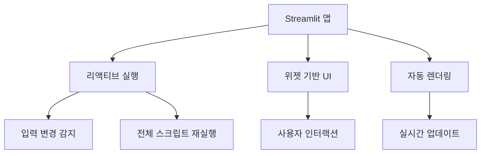

# Streamlit 완벽 가이드: AI 엔지니어를 위한 종합 문서

## 목차

1. [Streamlit 소개](#1-streamlit-소개)<br/>
2. [API 분류별 상세 설명](#2-api-분류별-상세-설명)<br/>
   - 2.1. [초간단 API](#21-초간단-api)<br/>
   - 2.2. [중급 API](#22-중급-api)<br/>
   - 2.3. [고급 API](#23-고급-api)<br/>
3. [실제 머신러닝 프로젝트 적용 사례](#3-실제-머신러닝-프로젝트-적용-사례)<br/>
   - 3.1. [이미지 분류 웹앱](#31-이미지-분류-웹앱)<br/>
   - 3.2. [주식 예측 대시보드](#32-주식-예측-대시보드)<br/>
   - 3.3. [자연어 처리 분석기](#33-자연어-처리-분석기)<br/>
4. [성능 최적화 기법](#4-성능-최적화-기법)<br/>
   - 4.1. [캐싱 전략](#41-캐싱-전략)<br/>
   - 4.2. [메모리 관리](#42-메모리-관리)<br/>
   - 4.3. [비동기 처리](#43-비동기-처리)<br/>
5. [배포 방법](#5-배포-방법)<br/>
   - 5.1. [Streamlit Cloud](#51-streamlit-cloud)<br/>
   - 5.2. [Docker 배포](#52-docker-배포)<br/>
   - 5.3. [클라우드 플랫폼 배포](#53-클라우드-플랫폼-배포)<br/>
6. [고급 커스터마이징 기법](#6-고급-커스터마이징-기법)<br/>
   - 6.1. [CSS 스타일링](#61-css-스타일링)<br/>
   - 6.2. [JavaScript 통합](#62-javascript-통합)<br/>
   - 6.3. [커스텀 컴포넌트 개발](#63-커스텀-컴포넌트-개발)<br/>
7. [용어 목록](#7-용어-목록)<br/>

---

## 1. Streamlit 소개

**Streamlit**은 파이썬으로 데이터 사이언스 및 머신러닝 웹 애플리케이션을 구축하기 위한 오픈소스 프레임워크입니다. 복잡한 웹 개발 지식 없이도 인터랙티브한 웹 앱을 신속하게 개발할 수 있는 리액티브 프로그래밍(Reactive Programming) 패러다임을 제공합니다.

### 주요 특징



### 설치 및 기본 실행

```bash
pip install streamlit
streamlit run app.py
```

---

## 2. API 분류별 상세 설명

### 2.1. 초간단 API

#### 2.1.1. 텍스트 및 데이터 출력

**기본 텍스트 출력:**
```python
import streamlit as st
import pandas as pd
import numpy as np

# 제목 계층 구조
st.title("메인 타이틀")
st.header("헤더")
st.subheader("서브헤더")
st.text("일반 텍스트")

# 마크다운 지원
st.markdown("""
### 마크다운 예시
- **굵은 글씨**
- *기울임*
- `코드`
""")

# 범용 출력 함수
st.write("문자열", 42, pd.DataFrame({'A': [1, 2], 'B': [3, 4]}))
```

**코드 표시:**
```python
# 코드 블록 표시
st.code("""
def hello_world():
    print("Hello, Streamlit!")
""", language='python')

# 수식 표시
st.latex(r'''
\begin{aligned}
f(x) &= \sum_{i=1}^{n} w_i \cdot x_i + b \\
\sigma(z) &= \frac{1}{1 + e^{-z}}
\end{aligned}
''')
```

#### 2.1.2. 기본 입력 위젯

```python
# 텍스트 입력
name = st.text_input("이름", placeholder="홍길동")
password = st.text_input("비밀번호", type="password")
text_area = st.text_area("긴 텍스트", height=200)

# 숫자 입력
age = st.number_input("나이", min_value=0, max_value=120, value=25)
height = st.slider("키(cm)", 140.0, 200.0, 170.0, step=0.1)

# 선택 위젯
option = st.selectbox("좋아하는 색상", ["빨강", "파랑", "초록"])
options = st.multiselect("취미", ["독서", "영화", "운동", "게임"])
agree = st.checkbox("약관에 동의합니다")
choice = st.radio("성별", ["남성", "여성", "기타"])

# 날짜/시간 입력
birthday = st.date_input("생년월일")
meeting_time = st.time_input("회의 시간")
```

### 2.2. 중급 API

#### 2.2.1. 레이아웃 및 컨테이너

```python
# 컬럼 레이아웃
col1, col2, col3 = st.columns([2, 1, 1])
with col1:
    st.write("첫 번째 컬럼 (넓음)")
with col2:
    st.write("두 번째 컬럼")
with col3:
    st.write("세 번째 컬럼")

# 확장 가능한 섹션
with st.expander("자세히 보기"):
    st.write("여기에 숨겨진 내용이 있습니다.")

# 사이드바
st.sidebar.title("사이드바")
sidebar_input = st.sidebar.selectbox("옵션 선택", ["A", "B", "C"])

# 탭
tab1, tab2, tab3 = st.tabs(["데이터", "차트", "설정"])
with tab1:
    st.write("데이터 내용")
with tab2:
    st.write("차트 내용")
with tab3:
    st.write("설정 내용")
```

#### 2.2.2. 상태 관리

```python
# 세션 상태 초기화
if 'counter' not in st.session_state:
    st.session_state.counter = 0

# 버튼 클릭으로 상태 변경
if st.button("카운터 증가"):
    st.session_state.counter += 1

st.write(f"현재 카운터: {st.session_state.counter}")

# 폼을 이용한 그룹핑
with st.form("user_form"):
    name = st.text_input("이름")
    email = st.text_input("이메일")
    submitted = st.form_submit_button("제출")
    
    if submitted:
        st.success(f"{name}님, 제출되었습니다!")
```

#### 2.2.3. 데이터 시각화

```python
# 샘플 데이터 생성
data = pd.DataFrame({
    'x': range(10),
    'y': np.random.randn(10),
    'z': np.random.randn(10)
})

# 인터랙티브 데이터프레임
st.dataframe(data, use_container_width=True)

# 편집 가능한 데이터
edited_data = st.data_editor(data)

# 기본 차트
st.line_chart(data[['y', 'z']])
st.bar_chart(data.set_index('x')['y'])
st.area_chart(data[['y', 'z']])

# 지도 (위도, 경도 필요)
map_data = pd.DataFrame({
    'lat': [37.5665, 37.5651, 37.5658],
    'lon': [126.9780, 126.9895, 126.9722]
})
st.map(map_data)
```

### 2.3. 고급 API

#### 2.3.1. 캐싱 시스템

```python
@st.cache_data
def load_large_dataset(file_path):
    """대용량 데이터셋 로딩 (데이터 캐싱)"""
    return pd.read_csv(file_path)

@st.cache_resource
def load_ml_model():
    """머신러닝 모델 로딩 (리소스 캐싱)"""
    from sklearn.ensemble import RandomForestClassifier
    model = RandomForestClassifier()
    # 모델 훈련 코드...
    return model

# TTL(Time To Live) 설정
@st.cache_data(ttl=3600)  # 1시간 후 캐시 만료
def fetch_api_data():
    """API 데이터 페치"""
    # API 호출 코드...
    pass
```

#### 2.3.2. 진행 상황 표시

```python
import time

# 프로그레스 바
progress_bar = st.progress(0)
status_text = st.empty()

for i in range(100):
    progress_bar.progress(i + 1)
    status_text.text(f'진행률: {i+1}%')
    time.sleep(0.01)

# 스피너
with st.spinner('처리 중...'):
    time.sleep(3)
st.success('완료!')

# 풍선 애니메이션
if st.button("축하하기"):
    st.balloons()
```

#### 2.3.3. 고급 차트 통합

```python
import plotly.express as px
import plotly.graph_objects as go
from bokeh.plotting import figure
import altair as alt

# Plotly 차트
fig = px.scatter(data, x='x', y='y', title="Plotly 스캐터 플롯")
st.plotly_chart(fig, use_container_width=True)

# Bokeh 차트
p = figure(title="Bokeh 라인 차트", x_axis_label='x', y_axis_label='y')
p.line(data['x'], data['y'], legend_label="라인", line_width=2)
st.bokeh_chart(p, use_container_width=True)

# Altair 차트
chart = alt.Chart(data).mark_circle(size=60).add_selection(
    alt.selection_interval()
).encode(
    x='x:Q',
    y='y:Q',
    color=alt.condition(alt.selection_interval(), 'z:Q', alt.value('lightgray'))
).interactive()
st.altair_chart(chart, use_container_width=True)
```

---

## 3. 실제 머신러닝 프로젝트 적용 사례

### 3.1. 이미지 분류 웹앱

```python
import streamlit as st
import torch
import torchvision.transforms as transforms
from PIL import Image
import torch.nn.functional as F

@st.cache_resource
def load_model():
    """사전 훈련된 모델 로딩"""
    model = torch.load('model.pth', map_location='cpu')
    model.eval()
    return model

def predict_image(image, model):
    """이미지 예측 함수"""
    transform = transforms.Compose([
        transforms.Resize((224, 224)),
        transforms.ToTensor(),
        transforms.Normalize(mean=[0.485, 0.456, 0.406], 
                           std=[0.229, 0.224, 0.225])
    ])
    
    image_tensor = transform(image).unsqueeze(0)
    with torch.no_grad():
        outputs = model(image_tensor)
        probabilities = F.softmax(outputs, dim=1)
    
    return probabilities

def main():
    st.title("🖼️ 이미지 분류기")
    st.write("이미지를 업로드하면 AI가 분류해드립니다!")
    
    # 모델 로딩
    model = load_model()
    
    # 파일 업로드
    uploaded_file = st.file_uploader(
        "이미지 선택", 
        type=['png', 'jpg', 'jpeg'],
        help="PNG, JPG, JPEG 형식만 지원됩니다."
    )
    
    if uploaded_file is not None:
        # 이미지 표시
        image = Image.open(uploaded_file)
        st.image(image, caption="업로드된 이미지", use_column_width=True)
        
        # 예측 실행
        with st.spinner("분석 중..."):
            predictions = predict_image(image, model)
            
        # 결과 표시
        st.subheader("📊 예측 결과")
        
        classes = ['고양이', '개', '새', '물고기']  # 예시 클래스
        probs = predictions[0].numpy()
        
        # 막대 차트로 확률 표시
        result_df = pd.DataFrame({
            '클래스': classes,
            '확률': probs
        }).sort_values('확률', ascending=False)
        
        st.bar_chart(result_df.set_index('클래스')['확률'])
        
        # 최고 예측 결과
        top_pred = result_df.iloc[0]
        st.success(f"🎯 예측 결과: **{top_pred['클래스']}** (신뢰도: {top_pred['확률']:.2%})")

if __name__ == "__main__":
    main()
```

### 3.2. 주식 예측 대시보드

```python
import streamlit as st
import yfinance as yf
import pandas as pd
import numpy as np
from sklearn.ensemble import RandomForestRegressor
from sklearn.preprocessing import StandardScaler
import plotly.graph_objects as go
from plotly.subplots import make_subplots

@st.cache_data
def get_stock_data(symbol, period="1y"):
    """주식 데이터 수집"""
    stock = yf.Ticker(symbol)
    data = stock.history(period=period)
    return data

@st.cache_data
def prepare_features(data, window=20):
    """특성 엔지니어링"""
    df = data.copy()
    
    # 기술적 지표 추가
    df['MA_20'] = df['Close'].rolling(window=window).mean()
    df['MA_50'] = df['Close'].rolling(window=50).mean()
    df['RSI'] = calculate_rsi(df['Close'])
    df['MACD'], df['MACD_signal'] = calculate_macd(df['Close'])
    
    # 가격 변화율
    df['Price_Change'] = df['Close'].pct_change()
    df['Volume_Change'] = df['Volume'].pct_change()
    
    # 라벨 (다음날 가격 방향)
    df['Target'] = (df['Close'].shift(-1) > df['Close']).astype(int)
    
    return df.dropna()

def calculate_rsi(prices, window=14):
    """RSI 계산"""
    delta = prices.diff()
    gain = (delta.where(delta > 0, 0)).rolling(window=window).mean()
    loss = (-delta.where(delta < 0, 0)).rolling(window=window).mean()
    rs = gain / loss
    rsi = 100 - (100 / (1 + rs))
    return rsi

def calculate_macd(prices, fast=12, slow=26, signal=9):
    """MACD 계산"""
    exp1 = prices.ewm(span=fast).mean()
    exp2 = prices.ewm(span=slow).mean()
    macd = exp1 - exp2
    macd_signal = macd.ewm(span=signal).mean()
    return macd, macd_signal

def main():
    st.title("📈 AI 주식 예측 대시보드")
    
    # 사이드바 설정
    st.sidebar.title("설정")
    symbol = st.sidebar.text_input("주식 심볼", value="AAPL", help="예: AAPL, GOOGL, TSLA")
    period = st.sidebar.selectbox("기간", ["1mo", "3mo", "6mo", "1y", "2y"])
    
    if st.sidebar.button("데이터 로딩"):
        with st.spinner("주식 데이터 수집 중..."):
            try:
                data = get_stock_data(symbol, period)
                st.session_state.stock_data = data
                st.session_state.symbol = symbol
                st.success("데이터 로딩 완료!")
            except Exception as e:
                st.error(f"데이터 로딩 실패: {e}")
    
    # 메인 콘텐츠
    if 'stock_data' in st.session_state:
        data = st.session_state.stock_data
        symbol = st.session_state.symbol
        
        # 주식 정보 표시
        col1, col2, col3, col4 = st.columns(4)
        with col1:
            st.metric("현재가", f"${data['Close'][-1]:.2f}", 
                     f"{((data['Close'][-1] - data['Close'][-2]) / data['Close'][-2] * 100):+.2f}%")
        with col2:
            st.metric("고가", f"${data['High'][-1]:.2f}")
        with col3:
            st.metric("저가", f"${data['Low'][-1]:.2f}")
        with col4:
            st.metric("거래량", f"{data['Volume'][-1]:,}")
        
        # 차트 표시
        fig = make_subplots(
            rows=3, cols=1,
            shared_xaxes=True,
            vertical_spacing=0.03,
            subplot_titles=('가격', 'RSI', 'MACD'),
            row_heights=[0.6, 0.2, 0.2]
        )
        
        # 가격 차트
        fig.add_trace(go.Candlestick(
            x=data.index,
            open=data['Open'],
            high=data['High'],
            low=data['Low'],
            close=data['Close'],
            name='가격'
        ), row=1, col=1)
        
        # 특성 엔지니어링 및 예측
        try:
            prepared_data = prepare_features(data)
            
            if len(prepared_data) > 50:  # 충분한 데이터가 있을 때만 예측
                feature_cols = ['MA_20', 'MA_50', 'RSI', 'MACD', 'MACD_signal', 
                               'Price_Change', 'Volume_Change']
                
                # NaN 값 처리
                X = prepared_data[feature_cols].iloc[:-1].fillna(0)
                y = prepared_data['Target'].iloc[:-1]
                
                if len(X) > 20 and not X.empty:  # 최소 데이터 요구사항
                    # 모델 훈련
                    model = RandomForestRegressor(n_estimators=50, random_state=42)
                    model.fit(X, y)
                    
                    # 다음날 예측
                    latest_features = prepared_data[feature_cols].iloc[-1:].fillna(0)
                    prediction = model.predict(latest_features)[0]
                    
                    # 예측 결과 표시
                    st.subheader("🔮 AI 예측")
                    prediction_text = "상승" if prediction > 0.5 else "하락"
                    confidence = max(prediction, 1-prediction)
                    
                    st.info(f"다음 거래일 예측: **{prediction_text}** (신뢰도: {confidence:.2%})")
                    
                    # 특성 중요도
                    importance_df = pd.DataFrame({
                        '특성': feature_cols,
                        '중요도': model.feature_importances_
                    }).sort_values('중요도', ascending=False)
                    
                    st.subheader("📊 특성 중요도")
                    st.bar_chart(importance_df.set_index('특성')['중요도'])
                else:
                    st.warning("충분한 데이터가 없어 예측을 수행할 수 없습니다.")
            else:
                st.warning("예측을 위해서는 더 많은 데이터가 필요합니다.")
                
        except Exception as e:
            st.error(f"데이터 분석 중 오류가 발생했습니다: {str(e)}")
            st.info("기본 차트만 표시됩니다.")
        
        st.plotly_chart(fig, use_container_width=True)

if __name__ == "__main__":
    main()
```

### 3.3. 자연어 처리 분석기

```python
import streamlit as st
import pandas as pd
import numpy as np
from textblob import TextBlob
from wordcloud import WordCloud
import matplotlib.pyplot as plt
from collections import Counter
import re
import plotly.express as px

@st.cache_data
def analyze_sentiment(text):
    """감정 분석"""
    blob = TextBlob(text)
    polarity = blob.sentiment.polarity  # -1 (부정) ~ 1 (긍정)
    subjectivity = blob.sentiment.subjectivity  # 0 (객관적) ~ 1 (주관적)
    
    if polarity > 0.1:
        sentiment = "긍정적 😊"
    elif polarity < -0.1:
        sentiment = "부정적 😞"
    else:
        sentiment = "중립적 😐"
    
    return {
        'sentiment': sentiment,
        'polarity': polarity,
        'subjectivity': subjectivity
    }

def extract_keywords(text, top_n=10):
    """키워드 추출"""
    # 텍스트 전처리
    text = re.sub(r'[^a-zA-Z가-힣\s]', '', text)
    words = text.lower().split()
    
    # 불용어 제거 (간단한 예시)
    stop_words = ['the', 'and', 'or', 'but', 'in', 'on', 'at', 'to', 'for', 'of', 'with', 'by']
    words = [word for word in words if word not in stop_words and len(word) > 2]
    
    # 빈도 계산
    word_freq = Counter(words)
    return word_freq.most_common(top_n)

def create_wordcloud(text):
    """워드클라우드 생성"""
    wordcloud = WordCloud(
        width=800, 
        height=400, 
        background_color='white',
        max_words=100,
        font_path='NanumGothic.ttf'  # 한글 폰트 (optional)
    ).generate(text)
    
    fig, ax = plt.subplots(figsize=(10, 5))
    ax.imshow(wordcloud, interpolation='bilinear')
    ax.axis('off')
    return fig

def main():
    st.title("🔍 자연어 처리 분석기")
    st.write("텍스트를 분석하여 감정, 키워드, 워드클라우드를 제공합니다.")
    
    # 텍스트 입력 방법 선택
    input_method = st.radio(
        "입력 방법 선택:",
        ["직접 입력", "파일 업로드"]
    )
    
    text_data = ""
    
    if input_method == "직접 입력":
        text_data = st.text_area(
            "분석할 텍스트를 입력하세요:",
            height=200,
            placeholder="여기에 텍스트를 입력하세요..."
        )
    else:
        uploaded_file = st.file_uploader(
            "텍스트 파일 업로드",
            type=['txt', 'csv']
        )
        if uploaded_file is not None:
            if uploaded_file.type == "text/plain":
                text_data = str(uploaded_file.read(), "utf-8")
            elif uploaded_file.type == "text/csv":
                df = pd.read_csv(uploaded_file)
                st.write("CSV 파일 미리보기:")
                st.dataframe(df.head())
                
                text_column = st.selectbox("분석할 텍스트 컬럼 선택:", df.columns)
                text_data = " ".join(df[text_column].astype(str).tolist())
    
    if text_data and len(text_data.strip()) > 0:
        st.success("텍스트가 입력되었습니다!")
        
        # 기본 통계
        st.subheader("📊 기본 통계")
        col1, col2, col3, col4 = st.columns(4)
        
        with col1:
            char_count = len(text_data)
            st.metric("문자 수", f"{char_count:,}")
        
        with col2:
            word_count = len(text_data.split())
            st.metric("단어 수", f"{word_count:,}")
        
        with col3:
            sentence_count = len(text_data.split('.'))
            st.metric("문장 수", f"{sentence_count:,}")
        
        with col4:
            avg_word_length = np.mean([len(word) for word in text_data.split()])
            st.metric("평균 단어 길이", f"{avg_word_length:.1f}")
        
        # 감정 분석
        st.subheader("😊 감정 분석")
        with st.spinner("감정 분석 중..."):
            sentiment_result = analyze_sentiment(text_data)
        
        col1, col2 = st.columns(2)
        with col1:
            st.write(f"**전체 감정:** {sentiment_result['sentiment']}")
            st.write(f"**극성 점수:** {sentiment_result['polarity']:.3f}")
            st.write(f"**주관성 점수:** {sentiment_result['subjectivity']:.3f}")
        
        with col2:
            # 감정 점수 시각화
            fig = px.bar(
                x=['극성', '주관성'],
                y=[sentiment_result['polarity'], sentiment_result['subjectivity']],
                title="감정 분석 점수"
            )
            st.plotly_chart(fig, use_container_width=True)
        
        # 키워드 분석
        st.subheader("🔑 주요 키워드")
        keywords = extract_keywords(text_data)
        
        if keywords:
            col1, col2 = st.columns(2)
            
            with col1:
                st.write("**상위 키워드:**")
                for i, (word, freq) in enumerate(keywords[:5], 1):
                    st.write(f"{i}. {word} ({freq}회)")
            
            with col2:
                # 키워드 빈도 차트
                keyword_df = pd.DataFrame(keywords, columns=['단어', '빈도'])
                fig = px.bar(keyword_df.head(10), x='빈도', y='단어', orientation='h')
                fig.update_layout(yaxis={'categoryorder':'total ascending'})
                st.plotly_chart(fig, use_container_width=True)
        
        # 워드클라우드
        st.subheader("☁️ 워드클라우드")
        try:
            with st.spinner("워드클라우드 생성 중..."):
                wordcloud_fig = create_wordcloud(text_data)
            st.pyplot(wordcloud_fig)
        except Exception as e:
            st.error(f"워드클라우드 생성 실패: {e}")
        
        # 문장별 감정 분석 (긴 텍스트의 경우)
        if len(text_data.split('.')) > 1:
            st.subheader("📈 문장별 감정 변화")
            sentences = [s.strip() for s in text_data.split('.') if len(s.strip()) > 10]
            
            if len(sentences) > 1:
                sentence_sentiments = []
                for sentence in sentences[:20]:  # 최대 20개 문장만 분석
                    result = analyze_sentiment(sentence)
                    sentence_sentiments.append(result['polarity'])
                
                # 감정 변화 차트
                sentiment_df = pd.DataFrame({
                    '문장 순서': range(1, len(sentence_sentiments) + 1),
                    '감정 점수': sentence_sentiments
                })
                
                fig = px.line(sentiment_df, x='문장 순서', y='감정 점수',
                             title="문장별 감정 변화")
                fig.add_hline(y=0, line_dash="dash", line_color="gray")
                st.plotly_chart(fig, use_container_width=True)

if __name__ == "__main__":
    main()
```

---

## 4. 성능 최적화 기법

### 4.1. 캐싱 전략

#### 4.1.1. 데이터 캐싱 (`@st.cache_data`)

```python
# 올바른 캐싱 사용법
@st.cache_data
def load_and_process_data(file_path, processing_params):
    """데이터 로딩 및 전처리"""
    df = pd.read_csv(file_path)
    
    # 전처리 작업
    if processing_params['normalize']:
        df = (df - df.mean()) / df.std()
    
    if processing_params['remove_outliers']:
        Q1 = df.quantile(0.25)
        Q3 = df.quantile(0.75)
        IQR = Q3 - Q1
        df = df[~((df < (Q1 - 1.5 * IQR)) | (df > (Q3 + 1.5 * IQR))).any(axis=1)]
    
    return df

# TTL과 최대 엔트리 수 설정
@st.cache_data(ttl=3600, max_entries=3)
def fetch_api_data(api_endpoint, params):
    """API 데이터 페치 (1시간 캐시, 최대 3개 엔트리)"""
    response = requests.get(api_endpoint, params=params)
    return response.json()

# 캐시 무효화
@st.cache_data
def cached_computation(data):
    # 무거운 계산
    return expensive_calculation(data)

# 캐시 강제 새로고침
if st.button("데이터 새로고침"):
    cached_computation.clear()
    st.rerun()
```

#### 4.1.2. 리소스 캐싱 (`@st.cache_resource`)

```python
@st.cache_resource
def load_ml_models():
    """머신러닝 모델들 로딩"""
    models = {}
    
    # 여러 모델 로딩
    models['classifier'] = joblib.load('classifier.pkl')
    models['regressor'] = joblib.load('regressor.pkl')
    models['clusterer'] = joblib.load('clusterer.pkl')
    
    return models

@st.cache_resource
def initialize_database_connection():
    """데이터베이스 연결 초기화"""
    import sqlite3
    conn = sqlite3.connect('app_database.db', check_same_thread=False)
    return conn

@st.cache_resource
def load_large_tokenizer():
    """대용량 토크나이저 로딩"""
    from transformers import AutoTokenizer
    tokenizer = AutoTokenizer.from_pretrained('bert-base-uncased')
    return tokenizer
```

### 4.2. 메모리 관리

#### 4.2.1. 효율적인 데이터 처리

```python
# 청크 단위 데이터 처리
@st.cache_data
def process_large_csv(file_path, chunk_size=10000):
    """대용량 CSV 파일 청크 단위 처리"""
    results = []
    
    for chunk in pd.read_csv(file_path, chunksize=chunk_size):
        # 청크별 처리
        processed_chunk = chunk.groupby('category').agg({
            'value': ['mean', 'sum', 'count']
        })
        results.append(processed_chunk)
    
    # 결과 병합
    final_result = pd.concat(results).groupby(level=0).sum()
    return final_result

# 제너레이터 사용으로 메모리 효율성 증대
def data_generator(file_path):
    """데이터 제너레이터"""
    with open(file_path, 'r') as file:
        for line in file:
            yield process_line(line)

# 불필요한 데이터 제거
def clean_session_state():
    """세션 상태 정리"""
    keys_to_remove = [key for key in st.session_state.keys() 
                     if key.startswith('temp_')]
    for key in keys_to_remove:
        del st.session_state[key]
```

#### 4.2.2. 메모리 모니터링

```python
import psutil
import os

def display_memory_usage():
    """메모리 사용량 표시"""
    process = psutil.Process(os.getpid())
    memory_info = process.memory_info()
    
    col1, col2, col3 = st.columns(3)
    with col1:
        st.metric("RSS 메모리", f"{memory_info.rss / 1024 / 1024:.1f} MB")
    with col2:
        st.metric("VMS 메모리", f"{memory_info.vms / 1024 / 1024:.1f} MB")
    with col3:
        st.metric("CPU 사용률", f"{process.cpu_percent():.1f}%")

# 사이드바에 메모리 모니터링 추가
if st.sidebar.checkbox("메모리 모니터링"):
    display_memory_usage()
```

### 4.3. 비동기 처리

#### 4.3.1. 백그라운드 작업

```python
import asyncio
import threading
from concurrent.futures import ThreadPoolExecutor

def long_running_task(data):
    """시간이 오래 걸리는 작업"""
    time.sleep(5)  # 시뮬레이션
    return f"처리 완료: {len(data)} 항목"

# 백그라운드에서 작업 실행
def run_background_task():
    """백그라운드 작업 실행"""
    if 'task_status' not in st.session_state:
        st.session_state.task_status = "대기중"
    
    if st.button("백그라운드 작업 시작"):
        st.session_state.task_status = "실행중"
        
        # 스레드에서 작업 실행
        def task_wrapper():
            result = long_running_task([1, 2, 3, 4, 5])
            st.session_state.task_result = result
            st.session_state.task_status = "완료"
        
        thread = threading.Thread(target=task_wrapper)
        thread.start()
        st.rerun()
    
    # 상태 표시
    if st.session_state.task_status == "실행중":
        st.info("작업이 백그라운드에서 실행 중입니다...")
        time.sleep(1)
        st.rerun()
    elif st.session_state.task_status == "완료":
        st.success(f"작업 완료: {st.session_state.task_result}")
```

#### 4.3.2. 실시간 업데이트

```python
```python
import streamlit as st
import pandas as pd
import numpy as np
from datetime import datetime
import time

# 실시간 데이터 스트리밍
def real_time_data_stream():
    """실시간 데이터 스트림"""
    placeholder = st.empty()
    
    for i in range(10):  # 실제 운영에서는 while True 사용
        # 새로운 데이터 생성
        current_time = datetime.now()
        new_data = {
            'timestamp': current_time,
            'value': np.random.randn(),
            'status': np.random.choice(['정상', '경고', '위험'])
        }
        
        # 세션 상태에 데이터 추가
        if 'stream_data' not in st.session_state:
            st.session_state.stream_data = []
        
        st.session_state.stream_data.append(new_data)
        
        # 최근 100개 데이터만 유지
        if len(st.session_state.stream_data) > 100:
            st.session_state.stream_data.pop(0)
        
        # 차트 업데이트
        with placeholder.container():
            df = pd.DataFrame(st.session_state.stream_data)
            st.line_chart(df.set_index('timestamp')['value'])
            st.write(f"마지막 업데이트: {current_time}")
        
        time.sleep(1)
```
```

---

## 5. 배포 방법

### 5.1. Streamlit Cloud

#### 5.1.1. 기본 배포 과정

**단계별 배포 가이드:**

1. **GitHub 저장소 준비**
   ```bash
   # 프로젝트 구조
   my-streamlit-app/
   ├── app.py                 # 메인 애플리케이션
   ├── requirements.txt       # 의존성 목록
   ├── .streamlit/
   │   ├── config.toml       # 설정 파일
   │   └── secrets.toml      # 시크릿 (로컬만)
   ├── pages/                # 멀티페이지 (선택적)
   │   ├── 1_📊_Dashboard.py
   │   └── 2_⚙️_Settings.py
   └── README.md
   ```

2. **Streamlit Cloud 배포**
   - [share.streamlit.io](https://share.streamlit.io) 접속
   - GitHub 연동 및 저장소 선택
   - 브랜치 및 메인 파일 지정
   - 배포 시작

```yaml
# .streamlit/config.toml
[theme]
primaryColor = "#FF6B6B"
backgroundColor = "#FFFFFF"
secondaryBackgroundColor = "#F0F2F6"
textColor = "#262730"
font = "sans serif"

[server]
maxUploadSize = 200
maxMessageSize = 200
enableCORS = false
enableXsrfProtection = true
enableStaticServing = false

[browser]
gatherUsageStats = false
showErrorDetails = true

[logger]
level = "info"
```

```txt
# requirements.txt
streamlit>=1.28.0
pandas>=1.5.0
numpy>=1.24.0
plotly>=5.15.0
scikit-learn>=1.3.0
Pillow>=9.5.0
requests>=2.31.0
```

#### 5.1.2. 환경 변수 관리

```python
# secrets.toml (로컬 개발용)
[database]
host = "localhost"
port = 5432
username = "myuser"
password = "mypassword"

[api_keys]
openai_key = "sk-..."
google_api_key = "AIza..."

# 앱에서 시크릿 사용
import streamlit as st

# 데이터베이스 연결
db_config = st.secrets["database"]
connection_string = f"postgresql://{db_config.username}:{db_config.password}@{db_config.host}:{db_config.port}/mydb"

# API 키 사용
openai_key = st.secrets["api_keys"]["openai_key"]
```

### 5.2. Docker 배포

#### 5.2.1. Dockerfile 작성

```dockerfile
# Dockerfile
FROM python:3.9-slim

WORKDIR /app

# 시스템 의존성 설치
RUN apt-get update && apt-get install -y \
    build-essential \
    curl \
    software-properties-common \
    git \
    && rm -rf /var/lib/apt/lists/*

# 파이썬 의존성 설치
COPY requirements.txt .
RUN pip3 install -r requirements.txt

# 앱 파일 복사
COPY . .

# 포트 노출
EXPOSE 8501

# Streamlit 실행
ENTRYPOINT ["streamlit", "run", "app.py", "--server.port=8501", "--server.address=0.0.0.0"]
```

#### 5.2.2. Docker Compose 설정

```yaml
# docker-compose.yml
version: '3.8'

services:
  streamlit:
    build: .
    ports:
      - "8501:8501"
    volumes:
      - ./data:/app/data
    environment:
      - PYTHONPATH=/app
    depends_on:
      - postgres
    restart: unless-stopped

  postgres:
    image: postgres:13
    environment:
      POSTGRES_DB: streamlit_db
      POSTGRES_USER: streamlit_user
      POSTGRES_PASSWORD: streamlit_pass
    volumes:
      - postgres_data:/var/lib/postgresql/data
    ports:
      - "5432:5432"

  nginx:
    image: nginx:alpine
    ports:
      - "80:80"
      - "443:443"
    volumes:
      - ./nginx.conf:/etc/nginx/nginx.conf
      - ./ssl:/etc/ssl
    depends_on:
      - streamlit

volumes:
  postgres_data:
```

### 5.3. 클라우드 플랫폼 배포

#### 5.3.1. AWS ECS 배포

```json
{
  "family": "streamlit-app",
  "networkMode": "awsvpc",
  "requiresCompatibilities": ["FARGATE"],
  "cpu": "256",
  "memory": "512",
  "executionRoleArn": "arn:aws:iam::ACCOUNT:role/ecsTaskExecutionRole",
  "containerDefinitions": [
    {
      "name": "streamlit-container",
      "image": "your-account.dkr.ecr.region.amazonaws.com/streamlit-app:latest",
      "portMappings": [
        {
          "containerPort": 8501,
          "protocol": "tcp"
        }
      ],
      "environment": [
        {
          "name": "AWS_DEFAULT_REGION",
          "value": "us-east-1"
        }
      ],
      "logConfiguration": {
        "logDriver": "awslogs",
        "options": {
          "awslogs-group": "/ecs/streamlit-app",
          "awslogs-region": "us-east-1",
          "awslogs-stream-prefix": "ecs"
        }
      }
    }
  ]
}
```

#### 5.3.2. Google Cloud Run 배포

```yaml
# cloudbuild.yaml
steps:
  - name: 'gcr.io/cloud-builders/docker'
    args: ['build', '-t', 'gcr.io/$PROJECT_ID/streamlit-app', '.']
  - name: 'gcr.io/cloud-builders/docker'
    args: ['push', 'gcr.io/$PROJECT_ID/streamlit-app']
  - name: 'gcr.io/cloud-builders/gcloud'
    args:
      - 'run'
      - 'deploy'
      - 'streamlit-app'
      - '--image'
      - 'gcr.io/$PROJECT_ID/streamlit-app'
      - '--region'
      - 'us-central1'
      - '--platform'
      - 'managed'
      - '--allow-unauthenticated'
```

---

## 6. 고급 커스터마이징 기법

### 6.1. CSS 스타일링

#### 6.1.1. 커스텀 CSS 적용

```python
def apply_custom_css():
    """커스텀 CSS 스타일 적용"""
    st.markdown("""
    <style>
    /* 메인 컨테이너 스타일링 */
    .main {
        padding-top: 2rem;
        padding-bottom: 2rem;
    }
    
    /* 사이드바 스타일링 */
    .sidebar .sidebar-content {
        background: linear-gradient(135deg, #667eea 0%, #764ba2 100%);
        color: white;
    }
    
    /* 메트릭 카드 스타일링 */
    [data-testid="metric-container"] {
        background-color: #f0f2f6;
        border: 1px solid #d3d3d3;
        padding: 15px;
        border-radius: 10px;
        box-shadow: 0 2px 4px rgba(0,0,0,0.1);
    }
    
    /* 버튼 커스터마이징 */
    .stButton > button {
        background: linear-gradient(135deg, #667eea 0%, #764ba2 100%);
        color: white;
        border: none;
        border-radius: 20px;
        padding: 10px 20px;
        font-weight: bold;
        transition: all 0.3s ease;
    }
    
    .stButton > button:hover {
        transform: translateY(-2px);
        box-shadow: 0 4px 8px rgba(0,0,0,0.2);
    }
    
    /* 데이터프레임 스타일링 */
    .dataframe {
        border-radius: 10px;
        overflow: hidden;
    }
    
    /* 제목 애니메이션 */
    .animated-title {
        animation: fadeInUp 1s ease-out;
    }
    
    @keyframes fadeInUp {
        from {
            opacity: 0;
            transform: translateY(30px);
        }
        to {
            opacity: 1;
            transform: translateY(0);
        }
    }
    
    /* 카드 컨테이너 */
    .card {
        background: white;
        padding: 20px;
        border-radius: 15px;
        box-shadow: 0 4px 6px rgba(0, 0, 0, 0.1);
        margin: 10px 0;
        border-left: 5px solid #667eea;
    }
    
    /* 글래스모피즘 효과 */
    .glass-card {
        background: rgba(255, 255, 255, 0.25);
        backdrop-filter: blur(10px);
        border-radius: 15px;
        border: 1px solid rgba(255, 255, 255, 0.18);
        padding: 20px;
        margin: 10px 0;
    }
    </style>
    """, unsafe_allow_html=True)

# CSS 적용 예시
apply_custom_css()

# 애니메이션 제목
st.markdown('<h1 class="animated-title">🚀 Advanced Streamlit App</h1>', 
           unsafe_allow_html=True)

# 카드 스타일 컨테이너
st.markdown("""
<div class="card">
    <h3>📊 데이터 분석 결과</h3>
    <p>여기에 분석 결과가 표시됩니다.</p>
</div>
""", unsafe_allow_html=True)
```

#### 6.1.2. 다크 모드 구현

```python
def toggle_theme():
    """다크/라이트 모드 토글"""
    if 'dark_mode' not in st.session_state:
        st.session_state.dark_mode = False
    
    # 토글 버튼
    if st.sidebar.button("🌓 테마 변경"):
        st.session_state.dark_mode = not st.session_state.dark_mode
        st.rerun()
    
    # 테마에 따른 CSS 적용
    if st.session_state.dark_mode:
        st.markdown("""
        <style>
        .stApp {
            background-color: #1e1e1e;
            color: #ffffff;
        }
        
        .sidebar .sidebar-content {
            background-color: #2d2d2d;
        }
        
        [data-testid="metric-container"] {
            background-color: #2d2d2d;
            border: 1px solid #404040;
            color: #ffffff;
        }
        
        .stSelectbox > div > div {
            background-color: #2d2d2d;
            color: #ffffff;
        }
        </style>
        """, unsafe_allow_html=True)
    else:
        st.markdown("""
        <style>
        .stApp {
            background-color: #ffffff;
            color: #000000;
        }
        </style>
        """, unsafe_allow_html=True)
```

### 6.2. JavaScript 통합

#### 6.2.1. 커스텀 JavaScript 함수

```python
def add_custom_javascript():
    """커스텀 JavaScript 기능 추가"""
    st.markdown("""
    <script>
    // 스크롤 애니메이션
    function animateOnScroll() {
        const observer = new IntersectionObserver((entries) => {
            entries.forEach((entry) => {
                if (entry.isIntersecting) {
                    entry.target.style.opacity = '1';
                    entry.target.style.transform = 'translateY(0)';
                }
            });
        });
        
        document.querySelectorAll('.animate-on-scroll').forEach((el) => {
            el.style.opacity = '0';
            el.style.transform = 'translateY(30px)';
            el.style.transition = 'all 0.6s ease';
            observer.observe(el);
        });
    }
    
    // 클립보드 복사 기능
    function copyToClipboard(text) {
        navigator.clipboard.writeText(text).then(() => {
            // Streamlit에 이벤트 전송
            window.parent.postMessage({
                type: 'streamlit:componentReady',
                apiVersion: 1,
            }, '*');
        });
    }
    
    // 키보드 단축키
    document.addEventListener('keydown', function(e) {
        // Ctrl + Enter로 실행
        if (e.ctrlKey && e.key === 'Enter') {
            const runButton = document.querySelector('[data-testid="stButton"] button');
            if (runButton) runButton.click();
        }
        
        // ESC로 사이드바 토글
        if (e.key === 'Escape') {
            const sidebar = document.querySelector('[data-testid="stSidebar"]');
            if (sidebar) {
                sidebar.style.display = sidebar.style.display === 'none' ? 'block' : 'none';
            }
        }
    });
    
    // 페이지 로드 시 실행
    document.addEventListener('DOMContentLoaded', animateOnScroll);
    </script>
    """, unsafe_allow_html=True)

# JavaScript 기능 적용
add_custom_javascript()

# 애니메이션 클래스 적용
st.markdown('<div class="animate-on-scroll">이 텍스트는 스크롤할 때 애니메이션됩니다!</div>', 
           unsafe_allow_html=True)
```

#### 6.2.2. 외부 JavaScript 라이브러리 통합

```python
def integrate_external_libraries():
    """외부 JavaScript 라이브러리 통합"""
    # Chart.js 통합
    st.markdown("""
    <script src="https://cdn.jsdelivr.net/npm/chart.js"></script>
    <div id="myChart" style="width: 100%; height: 400px;">
        <canvas id="chartCanvas"></canvas>
    </div>
    
    <script>
    const ctx = document.getElementById('chartCanvas').getContext('2d');
    const myChart = new Chart(ctx, {
        type: 'doughnut',
        data: {
            labels: ['Red', 'Blue', 'Yellow', 'Green', 'Purple', 'Orange'],
            datasets: [{
                label: '# of Votes',
                data: [12, 19, 3, 5, 2, 3],
                backgroundColor: [
                    'rgba(255, 99, 132, 0.8)',
                    'rgba(54, 162, 235, 0.8)',
                    'rgba(255, 205, 86, 0.8)',
                    'rgba(75, 192, 192, 0.8)',
                    'rgba(153, 102, 255, 0.8)',
                    'rgba(255, 159, 64, 0.8)'
                ],
                borderWidth: 2,
                borderColor: '#ffffff'
            }]
        },
        options: {
            responsive: true,
            plugins: {
                legend: {
                    position: 'bottom',
                }
            },
            animation: {
                animateScale: true,
                animateRotate: true
            }
        }
    });
    </script>
    """, unsafe_allow_html=True)

    # Three.js 3D 시각화
    st.markdown("""
    <script src="https://cdnjs.cloudflare.com/ajax/libs/three.js/r128/three.min.js"></script>
    <div id="three-container" style="width: 100%; height: 400px;"></div>
    
    <script>
    // Three.js 기본 설정
    const scene = new THREE.Scene();
    const camera = new THREE.PerspectiveCamera(75, window.innerWidth / 400, 0.1, 1000);
    const renderer = new THREE.WebGLRenderer();
    
    const container = document.getElementById('three-container');
    renderer.setSize(container.offsetWidth, 400);
    container.appendChild(renderer.domElement);
    
    // 큐브 생성
    const geometry = new THREE.BoxGeometry();
    const material = new THREE.MeshBasicMaterial({ 
        color: 0x667eea,
        wireframe: true 
    });
    const cube = new THREE.Mesh(geometry, material);
    scene.add(cube);
    
    camera.position.z = 5;
    
    // 애니메이션 루프
    function animate() {
        requestAnimationFrame(animate);
        cube.rotation.x += 0.01;
        cube.rotation.y += 0.01;
        renderer.render(scene, camera);
    }
    animate();
    </script>
    """, unsafe_allow_html=True)
```

### 6.3. 커스텀 컴포넌트 개발

#### 6.3.1. HTML 기반 커스텀 컴포넌트

```python
import streamlit.components.v1 as components

def create_interactive_gauge(value, max_value=100, title="게이지"):
    """인터랙티브 게이지 컴포넌트"""
    percentage = (value / max_value) * 100
    
    html_code = f"""
    <div style="text-align: center; padding: 20px;">
        <h3>{title}</h3>
        <div style="position: relative; width: 200px; height: 200px; margin: 0 auto;">
            <svg width="200" height="200" style="transform: rotate(-90deg);">
                <!-- 배경 원 -->
                <circle cx="100" cy="100" r="80" 
                        fill="none" 
                        stroke="#e0e0e0" 
                        stroke-width="20"/>
                <!-- 진행 원 -->
                <circle cx="100" cy="100" r="80" 
                        fill="none" 
                        stroke="url(#gradient)" 
                        stroke-width="20"
                        stroke-dasharray="{502.4 * percentage / 100} 502.4"
                        stroke-linecap="round"
                        style="transition: stroke-dasharray 1s ease-in-out;">
                    <animate attributeName="stroke-dasharray"
                             values="0 502.4;{502.4 * percentage / 100} 502.4"
                             dur="2s"
                             fill="freeze"/>
                </circle>
                <!-- 그라디언트 정의 -->
                <defs>
                    <linearGradient id="gradient" x1="0%" y1="0%" x2="100%" y2="0%">
                        <stop offset="0%" style="stop-color:#667eea;stop-opacity:1" />
                        <stop offset="100%" style="stop-color:#764ba2;stop-opacity:1" />
                    </linearGradient>
                </defs>
            </svg>
            <!-- 중앙 텍스트 -->
            <div style="position: absolute; top: 50%; left: 50%; 
                        transform: translate(-50%, -50%); 
                        font-size: 24px; font-weight: bold; color: #333;">
                {value}/{max_value}
            </div>
        </div>
    </div>
    """
    
    components.html(html_code, height=300)

# 사용 예시
st.subheader("📊 커스텀 게이지 컴포넌트")
col1, col2, col3 = st.columns(3)

with col1:
    create_interactive_gauge(75, 100, "성능 점수")
with col2:
    create_interactive_gauge(60, 100, "품질 지수")
with col3:
    create_interactive_gauge(90, 100, "만족도")
```

#### 6.3.2. React 기반 커스텀 컴포넌트

```python
# React 컴포넌트 생성 (streamlit_custom_components/frontend/src/MyComponent.tsx)
"""
import React, { useState, useEffect } from "react"
import { ComponentProps, Streamlit, withStreamlitConnection } from "streamlit-component-lib"

const MyComponent = (props: ComponentProps) => {
  const [value, setValue] = useState(props.args["initial_value"])
  
  useEffect(() => {
    Streamlit.setFrameHeight()
  })

  const onButtonClick = () => {
    setValue(value + 1)
    Streamlit.setComponentValue(value + 1)
  }

  return (
    <div>
      <h2>Custom React Component</h2>
      <p>Current value: {value}</p>
      <button onClick={onButtonClick}>Increment</button>
    </div>
  )
}

export default withStreamlitConnection(MyComponent)
"""

# Python에서 사용
def custom_component(initial_value=0, key=None):
    """커스텀 React 컴포넌트"""
    component_value = components.declare_component(
        "my_component",
        url="http://localhost:3001",  # 개발 서버
    )
    
    return component_value(initial_value=initial_value, key=key)

# 사용 예시
if "custom_value" not in st.session_state:
    st.session_state.custom_value = 0

new_value = custom_component(st.session_state.custom_value, key="custom")
if new_value is not None:
    st.session_state.custom_value = new_value
    st.write(f"컴포넌트 값: {new_value}")
```

#### 6.3.3. 고급 인터랙티브 컴포넌트

```python
def create_advanced_data_explorer(dataframe):
    """고급 데이터 탐색기 컴포넌트"""
    
    html_template = """
    <!DOCTYPE html>
    <html>
    <head>
        <script src="https://cdnjs.cloudflare.com/ajax/libs/d3/7.0.0/d3.min.js"></script>
        <style>
            .data-explorer {
                font-family: Arial, sans-serif;
                background: #f8f9fa;
                border-radius: 10px;
                padding: 20px;
                margin: 10px 0;
            }
            .filter-panel {
                background: white;
                padding: 15px;
                border-radius: 8px;
                margin-bottom: 20px;
                box-shadow: 0 2px 4px rgba(0,0,0,0.1);
            }
            .chart-container {
                background: white;
                padding: 20px;
                border-radius: 8px;
                box-shadow: 0 2px 4px rgba(0,0,0,0.1);
            }
            .filter-item {
                display: inline-block;
                margin: 5px 10px 5px 0;
            }
            .filter-item label {
                font-weight: bold;
                margin-right: 5px;
            }
            .filter-item select {
                padding: 5px 10px;
                border: 1px solid #ddd;
                border-radius: 4px;
            }
            .tooltip {
                position: absolute;
                background: rgba(0, 0, 0, 0.8);
                color: white;
                padding: 8px;
                border-radius: 4px;
                font-size: 12px;
                pointer-events: none;
                opacity: 0;
                transition: opacity 0.3s;
            }
            .data-point {
                cursor: pointer;
                transition: all 0.3s ease;
            }
            .data-point:hover {
                stroke: #ff6b6b;
                stroke-width: 2px;
            }
        </style>
    </head>
    <body>
        <div class="data-explorer">
            <h3>🔍 인터랙티브 데이터 탐색기</h3>
            
            <div class="filter-panel">
                <div class="filter-item">
                    <label>X축:</label>
                    <select id="x-axis">
                        <!-- 동적으로 생성 -->
                    </select>
                </div>
                <div class="filter-item">
                    <label>Y축:</label>
                    <select id="y-axis">
                        <!-- 동적으로 생성 -->
                    </select>
                </div>
                <div class="filter-item">
                    <label>색상:</label>
                    <select id="color-axis">
                        <option value="">없음</option>
                        <!-- 동적으로 생성 -->
                    </select>
                </div>
                <div class="filter-item">
                    <label>크기:</label>
                    <select id="size-axis">
                        <option value="">기본</option>
                        <!-- 동적으로 생성 -->
                    </select>
                </div>
            </div>
            
            <div class="chart-container">
                <svg id="main-chart" width="800" height="400"></svg>
            </div>
            
            <div class="tooltip" id="tooltip"></div>
        </div>

        <script>
            // 데이터 (Python에서 전달받음)
            const data = """ + dataframe.to_json(orient='records') + """;
            
            // 컬럼명 추출
            const columns = Object.keys(data[0]);
            const numericColumns = columns.filter(col => 
                typeof data[0][col] === 'number'
            );
            
            // 선택 옵션 생성
            function populateSelects() {
                ['x-axis', 'y-axis', 'color-axis', 'size-axis'].forEach(id => {
                    const select = document.getElementById(id);
                    const targetColumns = id === 'color-axis' ? columns : numericColumns;
                    
                    targetColumns.forEach(col => {
                        const option = document.createElement('option');
                        option.value = col;
                        option.textContent = col;
                        select.appendChild(option);
                    });
                });
                
                // 기본값 설정
                if (numericColumns.length >= 2) {
                    document.getElementById('x-axis').value = numericColumns[0];
                    document.getElementById('y-axis').value = numericColumns[1];
                }
            }
            
            // 차트 그리기
            function drawChart() {
                const svg = d3.select('#main-chart');
                svg.selectAll('*').remove();
                
                const margin = {top: 20, right: 20, bottom: 40, left: 40};
                const width = 800 - margin.left - margin.right;
                const height = 400 - margin.top - margin.bottom;
                
                const g = svg.append('g')
                    .attr('transform', `translate(${margin.left},${margin.top})`);
                
                const xCol = document.getElementById('x-axis').value;
                const yCol = document.getElementById('y-axis').value;
                const colorCol = document.getElementById('color-axis').value;
                const sizeCol = document.getElementById('size-axis').value;
                
                if (!xCol || !yCol) return;
                
                // 스케일 설정
                const xScale = d3.scaleLinear()
                    .domain(d3.extent(data, d => d[xCol]))
                    .range([0, width]);
                
                const yScale = d3.scaleLinear()
                    .domain(d3.extent(data, d => d[yCol]))
                    .range([height, 0]);
                
                const colorScale = colorCol ? 
                    d3.scaleOrdinal(d3.schemeCategory10) : 
                    () => '#667eea';
                
                const sizeScale = sizeCol ?
                    d3.scaleLinear()
                        .domain(d3.extent(data, d => d[sizeCol]))
                        .range([3, 15]) :
                    () => 6;
                
                // 축 그리기
                g.append('g')
                    .attr('transform', `translate(0,${height})`)
                    .call(d3.axisBottom(xScale));
                
                g.append('g')
                    .call(d3.axisLeft(yScale));
                
                // 축 레이블
                g.append('text')
                    .attr('x', width / 2)
                    .attr('y', height + 35)
                    .style('text-anchor', 'middle')
                    .text(xCol);
                
                g.append('text')
                    .attr('transform', 'rotate(-90)')
                    .attr('y', -25)
                    .attr('x', -height / 2)
                    .style('text-anchor', 'middle')
                    .text(yCol);
                
                // 데이터 포인트 그리기
                g.selectAll('.data-point')
                    .data(data)
                    .enter().append('circle')
                    .attr('class', 'data-point')
                    .attr('cx', d => xScale(d[xCol]))
                    .attr('cy', d => yScale(d[yCol]))
                    .attr('r', d => sizeScale(sizeCol ? d[sizeCol] : 6))
                    .attr('fill', d => colorScale(colorCol ? d[colorCol] : 'default'))
                    .attr('opacity', 0.7)
                    .on('mouseover', function(event, d) {
                        const tooltip = document.getElementById('tooltip');
                        tooltip.style.opacity = 1;
                        tooltip.style.left = (event.pageX + 10) + 'px';
                        tooltip.style.top = (event.pageY - 10) + 'px';
                        tooltip.innerHTML = `
                            <strong>${xCol}:</strong> ${d[xCol]}<br>
                            <strong>${yCol}:</strong> ${d[yCol]}
                            ${colorCol ? `<br><strong>${colorCol}:</strong> ${d[colorCol]}` : ''}
                            ${sizeCol ? `<br><strong>${sizeCol}:</strong> ${d[sizeCol]}` : ''}
                        `;
                    })
                    .on('mouseout', function() {
                        document.getElementById('tooltip').style.opacity = 0;
                    })
                    .on('click', function(event, d) {
                        // Streamlit에 선택된 데이터 전송
                        window.parent.postMessage({
                            type: 'streamlit:setComponentValue',
                            value: d
                        }, '*');
                    });
            }
            
            // 이벤트 리스너
            ['x-axis', 'y-axis', 'color-axis', 'size-axis'].forEach(id => {
                document.getElementById(id).addEventListener('change', drawChart);
            });
            
            // 초기화
            populateSelects();
            drawChart();
        </script>
    </body>
    </html>
    """
    
    selected_point = components.html(html_template, height=600)
    return selected_point

# 사용 예시
if 'sample_data' not in st.session_state:
    st.session_state.sample_data = pd.DataFrame({
        'x': np.random.randn(100),
        'y': np.random.randn(100),
        'category': np.random.choice(['A', 'B', 'C'], 100),
        'size': np.random.randint(1, 100, 100)
    })

st.subheader("🔬 고급 데이터 탐색기")
selected = create_advanced_data_explorer(st.session_state.sample_data)

if selected:
    st.write("선택된 데이터 포인트:", selected)
```

---

## 7. 용어 목록

| 용어 | 설명 |
|------|------|
| **API** | Application Programming Interface, 애플리케이션 프로그래밍 인터페이스 |
| **Artifact** | 아티팩트, 생성된 결과물이나 산출물 |
| **Authentication** | 인증, 사용자의 신원을 확인하는 과정 |
| **Caching** | 캐싱, 데이터나 계산 결과를 임시 저장하여 성능 향상 |
| **Component** | 컴포넌트, 재사용 가능한 UI 구성 요소 |
| **Container** | 컨테이너, 다른 요소들을 포함하는 그룹핑 요소 |
| **Dashboard** | 대시보드, 정보를 시각적으로 표시하는 인터페이스 |
| **DataFrame** | 데이터프레임, 표 형태의 데이터 구조 |
| **Deployment** | 배포, 애플리케이션을 실제 서비스 환경에 설치 |
| **Docker** | 도커, 컨테이너 기반 가상화 플랫폼 |
| **ECS** | Elastic Container Service, AWS의 컨테이너 관리 서비스 |
| **Frontend** | 프론트엔드, 사용자 인터페이스 부분 |
| **Glassmorphism** | 글래스모피즘, 투명한 유리 같은 디자인 트렌드 |
| **HTML** | HyperText Markup Language, 웹 페이지 구조 언어 |
| **Interactive** | 인터랙티브, 사용자와 상호작용하는 |
| **JavaScript** | 자바스크립트, 웹 프로그래밍 언어 |
| **Layout** | 레이아웃, 요소들의 배치와 구성 |
| **MACD** | Moving Average Convergence Divergence, 기술적 분석 지표 |
| **Matplotlib** | 맷플롯립, Python 데이터 시각화 라이브러리 |
| **Multipage** | 멀티페이지, 여러 페이지로 구성된 |
| **Nginx** | 엔진엑스, 웹 서버 및 리버스 프록시 |
| **Plotly** | 플롯리, 인터랙티브 시각화 라이브러리 |
| **PostgreSQL** | 포스트그레SQL, 관계형 데이터베이스 관리 시스템 |
| **React** | 리액트, JavaScript UI 라이브러리 |
| **Reactive Programming** | 리액티브 프로그래밍, 데이터 흐름과 변화 전파에 중점을 둔 프로그래밍 패러다임 |
| **Rerun** | 리런, 앱을 다시 실행하는 기능 |
| **RSI** | Relative Strength Index, 상대강도지수 |
| **Sentiment Analysis** | 감정 분석, 텍스트의 감정적 톤을 분석 |
| **Session State** | 세션 상태, 사용자 세션 동안 유지되는 데이터 |
| **Sidebar** | 사이드바, 페이지 옆에 위치한 패널 |
| **Three.js** | 쓰리.js, 3D 그래픽 JavaScript 라이브러리 |
| **Tooltip** | 툴팁, 마우스 오버 시 나타나는 설명 |
| **TTL** | Time To Live, 데이터의 유효 기간 |
| **UI** | User Interface, 사용자 인터페이스 |
| **Widget** | 위젯, 사용자 입력을 받는 UI 요소 |
| **YAML** | YAML Ain't Markup Language, 데이터 직렬화 표준 |