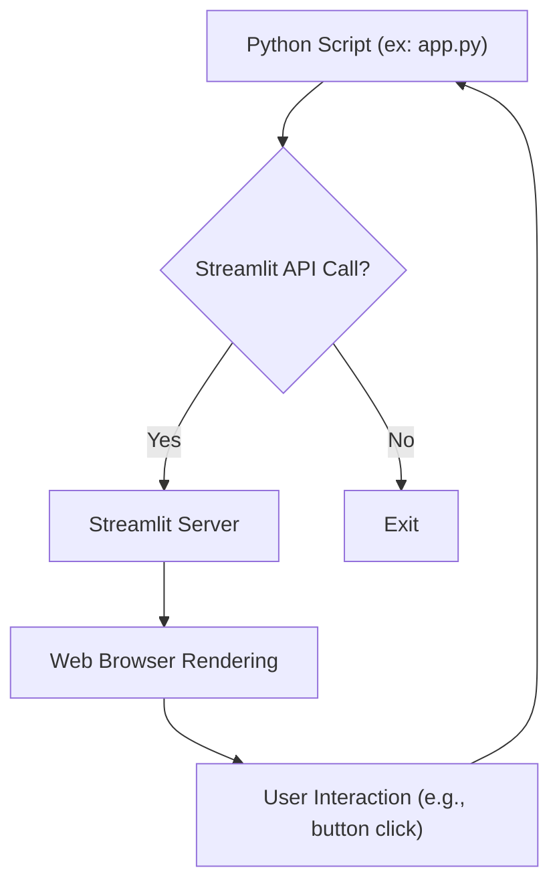

## 1\. Streamlit API 개요 (Overview)

Streamlit (스트림릿)은 데이터 과학 및 머신러닝 애플리케이션을 빠르게 만들고 공유할 수 있게 해주는 **오픈 소스 Python 라이브러리**입니다. Streamlit API는 **사용자가 웹 애플리케이션의 UI (User Interface) 요소를 쉽게 정의**하고 **데이터를 표시**하며 **사용자 입력(User Input)을 처리**할 수 있도록 설계되었습니다.

### 1.1. 주요 API 카테고리 (Main API Categories)

Streamlit API는 기능에 따라 크게 다음과 같은 카테고리로 나눌 수 있습니다.

#### 1.1.1. 데이터 표시 요소 (Data Display Elements)

데이터나 정보를 사용자에게 시각적으로 보여주는 데 사용되는 함수들입니다.

  * `st.dataframe`: 데이터프레임 (Pandas DataFrame)을 **대화형 테이블**로 표시합니다.
  * `st.data_editor`: 데이터프레임을 표시하며 **사용자가 데이터를 직접 편집**할 수 있게 합니다.
  * `st.table`: 정적인 테이블을 표시합니다.
  * `st.json`: JSON 객체 또는 딕셔너리를 표시합니다.
  * `st.markdown`: Markdown (마크다운) 형식의 텍스트를 표시합니다.
  * `st.code`: 코드 블록을 표시합니다.
  * `st.latex`: LaTeX (라텍스) 수식을 표시합니다.

$$
st.latex(r'''
\sum_{n=1}^\infty \frac{1}{n^2} = \frac{\pi^2}{6}
''')
$$

  * `st.write`: 가장 범용적인 표시 함수로, 텍스트, 데이터프레임, 차트 등 **대부분의 Streamlit 지원 객체**를 표시할 수 있습니다.
  * `st.metric`: 단일 숫자 값 (메트릭)과 변화량을 표시합니다.
  * `st.divider`: 수평 구분선을 표시합니다.
  * `st.caption`: 작은 설명 텍스트를 표시합니다.

#### 1.1.2. 사용자 입력 위젯 (User Input Widgets)

사용자로부터 값을 입력받거나 상호작용을 유도하는 데 사용되는 UI 컨트롤입니다.

  * **버튼 및 선택 (Buttons and Selections):**
      * `st.button`: 일반 버튼. 클릭 시 앱이 재실행됩니다.
      * `st.download_button`: 파일 다운로드를 위한 버튼.
      * `st.link_button`: 외부/내부 링크로 이동하는 버튼.
      * `st.page_link`: 앱의 다른 페이지로 이동하는 링크.
      * `st.checkbox`: 체크박스 (부울 값: `True`/`False`).
      * `st.radio`: 라디오 버튼 (단일 선택).
      * `st.selectbox`: 드롭다운 메뉴 (단일 선택).
      * `st.multiselect`: 다중 선택 드롭다운 메뉴.
      * `st.select_slider`: 범위가 있는 슬라이더 (단일 선택).
      * `st.segmented_control`: 분할된 컨트롤 (단일 선택).
      * `st.toggle`: 토글 스위치 (부울 값).
  * **텍스트 및 숫자 입력 (Text and Number Inputs):**
      * `st.text_input`: 한 줄 텍스트 입력 필드.
      * `st.text_area`: 여러 줄 텍스트 입력 필드.
      * `st.number_input`: 숫자 입력 필드.
      * `st.color_picker`: 색상 선택 위젯.
  * **날짜 및 시간 입력 (Date and Time Inputs):**
      * `st.date_input`: 날짜 선택 위젯.
      * `st.time_input`: 시간 선택 위젯.
      * `st.datetime_input`: 날짜 및 시간 선택 위젯.
  * **파일 업로드 (File Upload):**
      * `st.file_uploader`: 파일을 업로드할 수 있는 위젯.
      * `st.camera_input`: 웹캠으로 사진을 찍어 업로드.
      * `st.audio_input`: 오디오 파일을 녹음하거나 업로드.
  * **슬라이더 (Sliders):**
      * `st.slider`: 값 범위를 선택하는 슬라이더.

#### 1.1.3. 차트 및 시각화 (Charts and Visualizations)

데이터 시각화를 위해 다양한 라이브러리와 통합된 함수들입니다.

  * **내장 차트 (Built-in Charts):**
      * `st.line_chart`: 라인 차트 (선 그래프).
      * `st.area_chart`: 영역 차트.
      * `st.bar_chart`: 바 차트 (막대 그래프).
      * `st.scatter_chart`: 산점도.
  * **외부 라이브러리 통합 (External Library Integrations):**
      * `st.altair_chart`: Altair (알테어) 차트 표시.
      * `st.bokeh_chart`: Bokeh (보케) 차트 표시.
      * `st.pydeck_chart`: PyDeck (파이덱) 기반의 지도 표시.
      * `st.plotly_chart`: Plotly (플롯틀리) 차트 표시.
      * `st.pyplot`: Matplotlib (맷플롯립) 또는 Pyplot (파이플롯) 기반 차트 표시.
      * `st.vega_lite_chart`: Vega-Lite (베가-라이트) 차트 표시.
      * `st.map`: 지도 표시 (간단한 위경도 데이터).
      * `st.graphviz_chart`: Graphviz (그래프비즈) 기반 다이어그램 표시.

#### 1.1.4. 미디어 요소 (Media Elements)

이미지, 오디오, 비디오 등의 미디어를 표시하는 함수입니다.

  * `st.image`: 이미지 표시.
  * `st.audio`: 오디오 플레이어 표시.
  * `st.video`: 비디오 플레이어 표시.

#### 1.1.5. 레이아웃 및 컨테이너 (Layout and Containers)

앱의 구조와 컴포넌트 배치를 정의하는 데 사용되는 함수들입니다.

  * `st.sidebar`: 사이드바 (Sidebar)에 요소를 배치합니다.
  * `st.columns`: 페이지를 \*\*수평 열 (Columns)\*\*로 나눕니다.
  * `st.tabs`: 콘텐츠를 \*\*탭 (Tabs)\*\*으로 나누어 표시합니다.
  * `st.container`: 독립적인 컨테이너 (Container)를 생성하여 요소를 그룹화합니다.
  * `st.expander`: 펼치거나 접을 수 있는 영역 (Expander)을 생성합니다.
  * `st.empty`: 초기에 비어 있는 컨테이너를 생성하여 **나중에 동적으로 콘텐츠를 업데이트**할 수 있게 합니다.
  * `st.popover`: 다른 요소 위에 나타나는 팝오버 (Popover)를 생성합니다.
  * `st.form`: 사용자 입력 위젯을 그룹화하여 **제출 버튼이 눌릴 때까지 재실행을 지연**시키는 폼 (Form)을 생성합니다.
      * `st.form_submit_button`: 폼 제출 버튼.

#### 1.1.6. 상태, 알림 및 유틸리티 (Status, Notifications, and Utilities)

앱의 상태를 표시하거나, 사용자에게 피드백을 주거나, 기타 유틸리티 기능을 제공하는 함수들입니다.

  * **상태/알림 (Status/Notifications):**
      * `st.error`: 에러 메시지 표시.
      * `st.warning`: 경고 메시지 표시.
      * `st.info`: 정보 메시지 표시.
      * `st.success`: 성공 메시지 표시.
      * `st.exception`: 파이썬 예외 (Exception) 표시.
      * `st.toast`: 작은 알림 (Toast)을 잠시 표시합니다.
      * `st.status`: 백그라운드 작업의 상태를 표시합니다.
  * **진행 상황 (Progress):**
      * `st.progress`: 진행률 바 (Progress Bar) 표시.
  * **축하 효과 (Celebrations):**
      * `st.balloons`: 풍선 애니메이션 효과.
      * `st.snow`: 눈 내리는 애니메이션 효과.
  * **채팅 (Chat):**
      * `st.chat_message`: 채팅 메시지 표시.
      * `st.chat_input`: 채팅 입력 위젯.
  * **기타 (Others):**
      * `st.header`, `st.subheader`, `st.title`: 제목 표시.
      * `st.help`: 객체에 대한 도움말 (Documentation) 표시.
      * `st.stop`: 앱의 실행을 중단합니다.

### 1.2. API 사용 예시 (API Usage Example)

Streamlit 앱의 기본 구조는 일반적인 Python 스크립트와 동일합니다. Streamlit 함수를 호출하면 웹 페이지에 해당 요소가 렌더링 (Rendering)됩니다.

**Streamlit API의 작동 원리 (Flow of Streamlit App):**



  * **데이터 표시 예시:**
    ```python
    st.title("Streamlit API 간단 설명 (Simple Streamlit API Explanation)")
    st.markdown("이 문서는 **Streamlit API**의 주요 함수를 정리합니다.")
    ```
  * **입력 위젯 예시:**
    ```python
    user_input = st.slider("값을 선택하세요 (Select a value)", 0, 100, 50)
    st.write("선택된 값 (Selected value):", user_input)
    ```

Streamlit은 입력 위젯의 값이 변경될 때마다 \*\*스크립트 전체를 처음부터 다시 실행 (Rerunning)\*\*하여 상태를 업데이트합니다.

