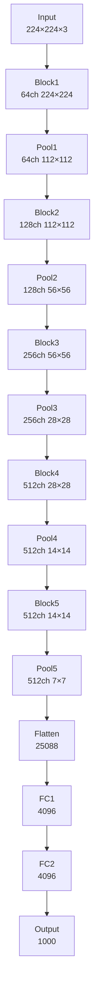
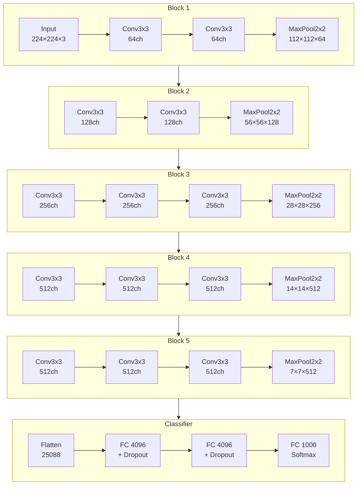
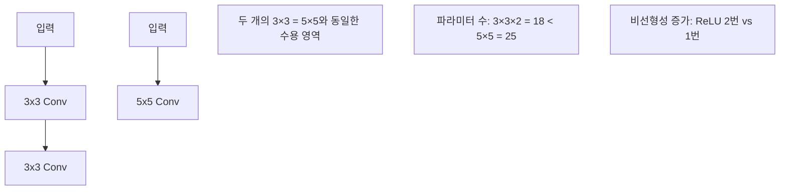

# VGGNet - 깊이의 힘을 증명한 CNN

## 개요

VGGNet은 2014년 Oxford의 Visual Geometry Group(VGG)에서 Karen Simonyan과 Andrew Zisserman에 의해 개발된 합성곱 신경망입니다. ILSVRC 2014에서 2위를 차지했으며, "네트워크의 깊이가 성능에 미치는 영향"을 체계적으로 연구한 모델입니다.

## VGGNet의 핵심 철학

- **단순함**: 3×3 컨볼루션 필터만 사용
- **깊이**: 레이어 수를 증가시켜 성능 향상
- **일관성**: 전체 구조에서 일관된 설계 원칙
- **체계적 연구**: VGG11부터 VGG19까지 단계적 깊이 증가

## VGG 모델 변형들

| 모델 | 레이어 수 | Conv 레이어 | FC 레이어 | 파라미터 수 |
|------|-----------|-------------|-----------|-------------|
| VGG11 | 11 | 8 | 3 | ~133M |
| VGG13 | 13 | 10 | 3 | ~133M |
| VGG16 | 16 | 13 | 3 | ~138M |
| VGG19 | 19 | 16 | 3 | ~144M |

## VGG16 구조 (가장 인기있는 모델)

### 전체 네트워크 구조 다이어그램



### VGG16 블록별 상세 구조



## 각 블록 상세 설명

### Block 1 (입력: 224×224×3)
- **Conv1_1**: 3×3×64, stride=1, padding=1
- **Conv1_2**: 3×3×64, stride=1, padding=1
- **MaxPool**: 2×2, stride=2
- **출력**: 112×112×64

### Block 2 (입력: 112×112×64)
- **Conv2_1**: 3×3×128, stride=1, padding=1
- **Conv2_2**: 3×3×128, stride=1, padding=1
- **MaxPool**: 2×2, stride=2
- **출력**: 56×56×128

### Block 3 (입력: 56×56×128)
- **Conv3_1**: 3×3×256, stride=1, padding=1
- **Conv3_2**: 3×3×256, stride=1, padding=1
- **Conv3_3**: 3×3×256, stride=1, padding=1
- **MaxPool**: 2×2, stride=2
- **출력**: 28×28×256

### Block 4 (입력: 28×28×256)
- **Conv4_1**: 3×3×512, stride=1, padding=1
- **Conv4_2**: 3×3×512, stride=1, padding=1
- **Conv4_3**: 3×3×512, stride=1, padding=1
- **MaxPool**: 2×2, stride=2
- **출력**: 14×14×512

### Block 5 (입력: 14×14×512)
- **Conv5_1**: 3×3×512, stride=1, padding=1
- **Conv5_2**: 3×3×512, stride=1, padding=1
- **Conv5_3**: 3×3×512, stride=1, padding=1
- **MaxPool**: 2×2, stride=2
- **출력**: 7×7×512

### Classifier
- **Flatten**: 7×7×512 = 25,088
- **FC1**: 25,088 → 4,096 (Dropout 0.5)
- **FC2**: 4,096 → 4,096 (Dropout 0.5)
- **FC3**: 4,096 → 1,000 (Softmax)

## 3×3 컨볼루션의 장점

### 수용 영역(Receptive Field) 비교



### 파라미터 효율성
```python
# 5×5 컨볼루션
params_5x5 = 5 * 5 * C = 25C

# 3×3 컨볼루션 두 개
params_3x3_double = (3 * 3 * C) + (3 * 3 * C) = 18C

# 파라미터 절약: (25-18)/25 = 28% 절약
```
```python
# 채널 수를 C라고 하고, 입력/출력 채널이 같다고 가정한 이론적 비교
# (편의상 편향항은 무시)
from math import isclose

def compare_params(C):
    params_5x5 = 5 * 5 * C * C              # single 5x5 conv: 25 * C * C
    params_3x3_double = 2 * (3 * 3 * C * C) # two stacked 3x3 convs: 2 * 9 * C * C = 18 * C * C
    saved = params_5x5 - params_3x3_double
    saved_ratio = saved / params_5x5
    return params_5x5, params_3x3_double, saved_ratio

# 예시: C=64
params_5x5, params_3x3_double, saved_ratio = compare_params(64)
print(f"5x5 params: {params_5x5:,}")
print(f"two 3x3 params: {params_3x3_double:,}")
print(f"절약 비율: {saved_ratio*100:.1f}%")

# 출력 예시:
# 5x5 params: 1,024,000
# two 3x3 params: 737,280
# 절약 비율: 28.0%
```

## PyTorch 구현 예제

### VGG16 전체 구현

```python
import torch
import torch.nn as nn

class VGG16(nn.Module):
    def __init__(self, num_classes=1000):
        super(VGG16, self).__init__()
        
        # 특성 추출 부분
        self.features = nn.Sequential(
            # Block 1
            nn.Conv2d(3, 64, kernel_size=3, padding=1),
            nn.ReLU(inplace=True),
            nn.Conv2d(64, 64, kernel_size=3, padding=1),
            nn.ReLU(inplace=True),
            nn.MaxPool2d(kernel_size=2, stride=2),
            
            # Block 2
            nn.Conv2d(64, 128, kernel_size=3, padding=1),
            nn.ReLU(inplace=True),
            nn.Conv2d(128, 128, kernel_size=3, padding=1),
            nn.ReLU(inplace=True),
            nn.MaxPool2d(kernel_size=2, stride=2),
            
            # Block 3
            nn.Conv2d(128, 256, kernel_size=3, padding=1),
            nn.ReLU(inplace=True),
            nn.Conv2d(256, 256, kernel_size=3, padding=1),
            nn.ReLU(inplace=True),
            nn.Conv2d(256, 256, kernel_size=3, padding=1),
            nn.ReLU(inplace=True),
            nn.MaxPool2d(kernel_size=2, stride=2),
            
            # Block 4
            nn.Conv2d(256, 512, kernel_size=3, padding=1),
            nn.ReLU(inplace=True),
            nn.Conv2d(512, 512, kernel_size=3, padding=1),
            nn.ReLU(inplace=True),
            nn.Conv2d(512, 512, kernel_size=3, padding=1),
            nn.ReLU(inplace=True),
            nn.MaxPool2d(kernel_size=2, stride=2),
            
            # Block 5
            nn.Conv2d(512, 512, kernel_size=3, padding=1),
            nn.ReLU(inplace=True),
            nn.Conv2d(512, 512, kernel_size=3, padding=1),
            nn.ReLU(inplace=True),
            nn.Conv2d(512, 512, kernel_size=3, padding=1),
            nn.ReLU(inplace=True),
            nn.MaxPool2d(kernel_size=2, stride=2),
        )
        
        # 분류 부분
        self.classifier = nn.Sequential(
            nn.Linear(512 * 7 * 7, 4096),
            nn.ReLU(inplace=True),
            nn.Dropout(0.5),
            nn.Linear(4096, 4096),
            nn.ReLU(inplace=True),
            nn.Dropout(0.5),
            nn.Linear(4096, num_classes),
        )
    
    def forward(self, x):
        x = self.features(x)
        x = torch.flatten(x, 1)
        x = self.classifier(x)
        return x

# 모델 초기화
model = VGG16(num_classes=1000)
print(model)

# 파라미터 수 확인
total_params = sum(p.numel() for p in model.parameters())
print(f"총 파라미터 수: {total_params:,}")
```

### 모듈화된 VGG 구현

```python
def make_layers(cfg, batch_norm=False):
    """VGG 레이어 생성 함수"""
    layers = []
    in_channels = 3
    
    for v in cfg:
        if v == 'M':
            layers += [nn.MaxPool2d(kernel_size=2, stride=2)]
        else:
            conv2d = nn.Conv2d(in_channels, v, kernel_size=3, padding=1)
            if batch_norm:
                layers += [conv2d, nn.BatchNorm2d(v), nn.ReLU(inplace=True)]
            else:
                layers += [conv2d, nn.ReLU(inplace=True)]
            in_channels = v
    
    return nn.Sequential(*layers)

# VGG 설정들
cfgs = {
    'A': [64, 'M', 128, 'M', 256, 256, 'M', 512, 512, 'M', 512, 512, 'M'],  # VGG11
    'B': [64, 64, 'M', 128, 128, 'M', 256, 256, 'M', 512, 512, 'M', 512, 512, 'M'],  # VGG13
    'D': [64, 64, 'M', 128, 128, 'M', 256, 256, 256, 'M', 512, 512, 512, 'M', 512, 512, 512, 'M'],  # VGG16
    'E': [64, 64, 'M', 128, 128, 'M', 256, 256, 256, 256, 'M', 512, 512, 512, 512, 'M', 512, 512, 512, 512, 'M'],  # VGG19
}

class VGG(nn.Module):
    def __init__(self, features, num_classes=1000):
        super(VGG, self).__init__()
        self.features = features
        self.classifier = nn.Sequential(
            nn.Linear(512 * 7 * 7, 4096),
            nn.ReLU(True),
            nn.Dropout(),
            nn.Linear(4096, 4096),
            nn.ReLU(True),
            nn.Dropout(),
            nn.Linear(4096, num_classes),
        )
    
    def forward(self, x):
        x = self.features(x)
        x = torch.flatten(x, 1)
        x = self.classifier(x)
        return x

def vgg16(num_classes=1000, batch_norm=False):
    return VGG(make_layers(cfgs['D'], batch_norm), num_classes)

def vgg19(num_classes=1000, batch_norm=False):
    return VGG(make_layers(cfgs['E'], batch_norm), num_classes)

# 사용 예제
model = vgg16(num_classes=10)  # CIFAR-10용
print(f"VGG16 파라미터 수: {sum(p.numel() for p in model.parameters()):,}")
```

## CIFAR-10 학습 예제

```python
import torch
import torch.nn as nn
import torch.optim as optim
from torchvision import datasets, transforms
from torch.utils.data import DataLoader

# CIFAR-10용 VGG16 (입력 크기 조정)
class VGG16_CIFAR(nn.Module):
    def __init__(self, num_classes=10):
        super(VGG16_CIFAR, self).__init__()
        
        self.features = nn.Sequential(
            # Block 1
            nn.Conv2d(3, 64, 3, padding=1), nn.ReLU(inplace=True),
            nn.Conv2d(64, 64, 3, padding=1), nn.ReLU(inplace=True),
            nn.MaxPool2d(2, 2),
            
            # Block 2
            nn.Conv2d(64, 128, 3, padding=1), nn.ReLU(inplace=True),
            nn.Conv2d(128, 128, 3, padding=1), nn.ReLU(inplace=True),
            nn.MaxPool2d(2, 2),
            
            # Block 3
            nn.Conv2d(128, 256, 3, padding=1), nn.ReLU(inplace=True),
            nn.Conv2d(256, 256, 3, padding=1), nn.ReLU(inplace=True),
            nn.Conv2d(256, 256, 3, padding=1), nn.ReLU(inplace=True),
            nn.MaxPool2d(2, 2),
            
            # Block 4
            nn.Conv2d(256, 512, 3, padding=1), nn.ReLU(inplace=True),
            nn.Conv2d(512, 512, 3, padding=1), nn.ReLU(inplace=True),
            nn.Conv2d(512, 512, 3, padding=1), nn.ReLU(inplace=True),
            nn.MaxPool2d(2, 2),
            
            # Block 5
            nn.Conv2d(512, 512, 3, padding=1), nn.ReLU(inplace=True),
            nn.Conv2d(512, 512, 3, padding=1), nn.ReLU(inplace=True),
            nn.Conv2d(512, 512, 3, padding=1), nn.ReLU(inplace=True),
            nn.MaxPool2d(2, 2),
        )
        
        self.classifier = nn.Sequential(
            nn.Linear(512, 512),
            nn.ReLU(inplace=True),
            nn.Dropout(0.5),
            nn.Linear(512, num_classes),
        )
    
    def forward(self, x):
        x = self.features(x)
        x = torch.flatten(x, 1)
        x = self.classifier(x)
        return x

# 데이터 전처리
transform_train = transforms.Compose([
    transforms.RandomHorizontalFlip(),
    transforms.RandomCrop(32, padding=4),
    transforms.ToTensor(),
    # CIFAR-10 통계치로 정규화
    transforms.Normalize((0.4914, 0.4822, 0.4465), (0.2470, 0.2435, 0.2616))
])

transform_test = transforms.Compose([
    transforms.ToTensor(),
    transforms.Normalize((0.4914, 0.4822, 0.4465), (0.2470, 0.2435, 0.2616))
])

# 데이터셋 로드
train_dataset = datasets.CIFAR10('./data', train=True, download=True, transform=transform_train)
test_dataset = datasets.CIFAR10('./data', train=False, transform=transform_test)

# Windows 환경에서의 안전한 기본 설정: num_workers=0
train_loader = DataLoader(train_dataset, batch_size=128, shuffle=True, num_workers=0)
test_loader = DataLoader(test_dataset, batch_size=100, shuffle=False, num_workers=0)

# 모델, 손실함수, 옵티마이저
device = torch.device('cuda' if torch.cuda.is_available() else 'cpu')
model = VGG16_CIFAR(num_classes=10).to(device)
criterion = nn.CrossEntropyLoss()
optimizer = optim.SGD(model.parameters(), lr=0.01, momentum=0.9, weight_decay=5e-4)
scheduler = optim.lr_scheduler.MultiStepLR(optimizer, milestones=[50, 80], gamma=0.1)

# 학습 함수
def train_epoch(epoch):
    model.train()
    running_loss = 0.0
    correct = 0
    total = 0
    
    for batch_idx, (data, target) in enumerate(train_loader):
        data, target = data.to(device), target.to(device)
        
        optimizer.zero_grad()
        output = model(data)
        loss = criterion(output, target)
        loss.backward()
        optimizer.step()
        
        running_loss += loss.item()
        _, predicted = output.max(1)
        total += target.size(0)
        correct += predicted.eq(target).sum().item()
        
        if batch_idx % 100 == 0:
            print(f'Epoch {epoch}, Batch {batch_idx}, '
                  f'Loss: {running_loss/(batch_idx+1):.4f}, '
                  f'Acc: {100.*correct/total:.2f}%')

# 테스트 함수
def test():
    model.eval()
    test_loss = 0
    correct = 0
    total = 0
    
    with torch.no_grad():
        for data, target in test_loader:
            data, target = data.to(device), target.to(device)
            output = model(data)
            test_loss += criterion(output, target).item()
            _, predicted = output.max(1)
            total += target.size(0)
            correct += predicted.eq(target).sum().item()
    
    accuracy = 100. * correct / total
    print(f'Test Accuracy: {accuracy:.2f}%')
    return accuracy

# 학습 실행
for epoch in range(100):
    train_epoch(epoch)
    acc = test()
    scheduler.step()
```

## VGGNet의 특징과 기여

### 주요 기여
1. **깊이의 중요성 입증**: 깊은 네트워크가 성능 향상에 기여
2. **3×3 컨볼루션 표준화**: 작은 필터의 효율성 증명
3. **체계적 연구**: 깊이에 따른 성능 변화 분석
4. **전이 학습**: 강력한 특성 추출기로 활용

### 핵심 설계 원칙
- **단순성**: 3×3 컨볼루션과 2×2 풀링만 사용
- **규칙성**: 일관된 구조 패턴
- **점진적 확장**: 채널 수의 체계적 증가 (64→128→256→512)

## 다른 모델과의 비교

### AlexNet vs VGGNet vs 현대 모델

| 특징 | AlexNet | VGGNet | ResNet |
|------|---------|--------|--------|
| 연도 | 2012 | 2014 | 2015 |
| 깊이 | 8레이어 | 11-19레이어 | 18-152레이어 |
| 필터 크기 | 11×11, 5×5, 3×3 | 3×3만 | 3×3만 |
| 파라미터 | ~60M | ~138M | ~25M |
| 핵심 기술 | ReLU, Dropout | 깊이, 3×3 | Skip Connection |

## VGGNet의 한계

### 단점
- **많은 파라미터**: 138M개의 파라미터로 메모리 사용량 높음
- **느린 학습**: 깊이로 인한 학습 시간 증가
- **Gradient 문제**: 매우 깊은 경우 Gradient Vanishing
- **효율성**: ResNet 대비 파라미터 효율성 낮음

### 현대적 개선 방안
```python
# Batch Normalization 추가
def make_layers_bn(cfg):
    layers = []
    in_channels = 3
    for v in cfg:
        if v == 'M':
            layers += [nn.MaxPool2d(kernel_size=2, stride=2)]
        else:
            conv2d = nn.Conv2d(in_channels, v, kernel_size=3, padding=1)
            layers += [conv2d, nn.BatchNorm2d(v), nn.ReLU(inplace=True)]
            in_channels = v
    return nn.Sequential(*layers)

# Global Average Pooling 사용
class VGG_GAP(nn.Module):
    def __init__(self, features, num_classes=1000):
        super(VGG_GAP, self).__init__()
        self.features = features
        self.avgpool = nn.AdaptiveAvgPool2d((1, 1))  # GAP
        self.classifier = nn.Linear(512, num_classes)  # 파라미터 대폭 감소
    
    def forward(self, x):
        x = self.features(x)
        x = self.avgpool(x)
        x = torch.flatten(x, 1)
        x = self.classifier(x)
        return x
```

## 전이 학습에서의 VGGNet

### 특성 추출기로 사용
```python
import torchvision.models as models
import torch.nn as nn

# 사전 훈련된 VGG16 로드 (torchvision 최신버전 권장)
try:
    # torchvision >= 0.13
    from torchvision.models import VGG16_Weights
    vgg16 = models.vgg16(weights=VGG16_Weights.IMAGENET1K_V1)
except Exception:
    # 구버전 호환성
    vgg16 = models.vgg16(pretrained=True)

# 특성 추출기로만 사용 (분류기 제거)
feature_extractor = vgg16.features

# 분류기 교체 (새로운 데이터셋용)
# 사용 예: num_classes = 10
num_classes = 10
vgg16.classifier[6] = nn.Linear(4096, num_classes)

# 특성 추출기는 고정하고 분류기만 학습
for param in vgg16.features.parameters():
    param.requires_grad = False
```

## 결론

VGGNet은 "깊이"의 중요성을 체계적으로 증명한 획기적인 모델입니다. 3×3 컨볼루션만을 사용한 단순하면서도 효과적인 구조로, 현재까지도 전이 학습과 특성 추출에 널리 사용되고 있습니다. 비록 파라미터 수가 많다는 단점이 있지만, CNN 발전사에서 매우 중요한 위치를 차지하는 모델입니다.

---
