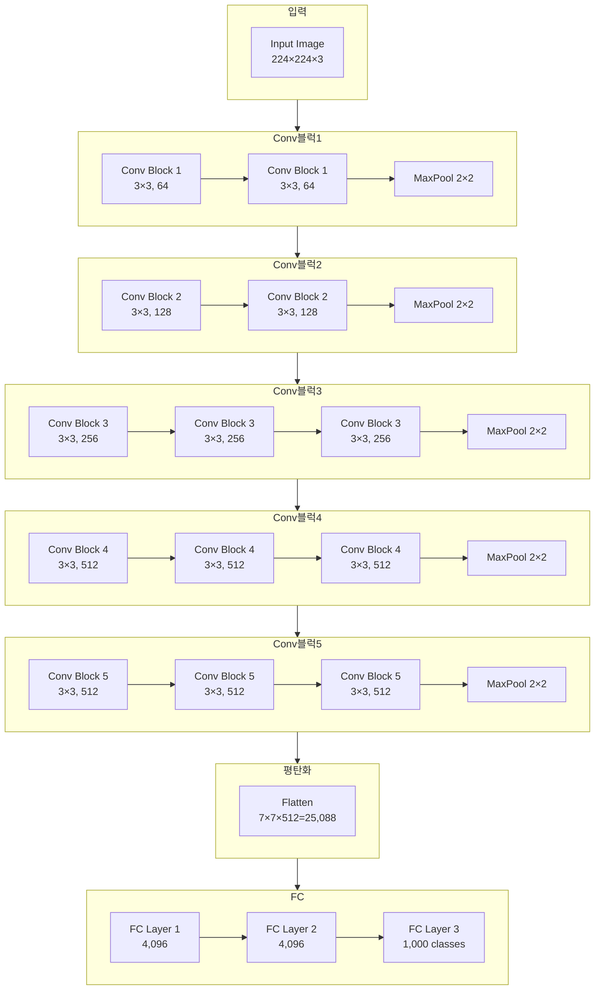
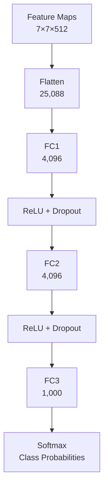
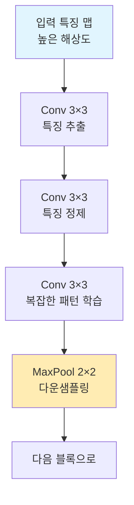
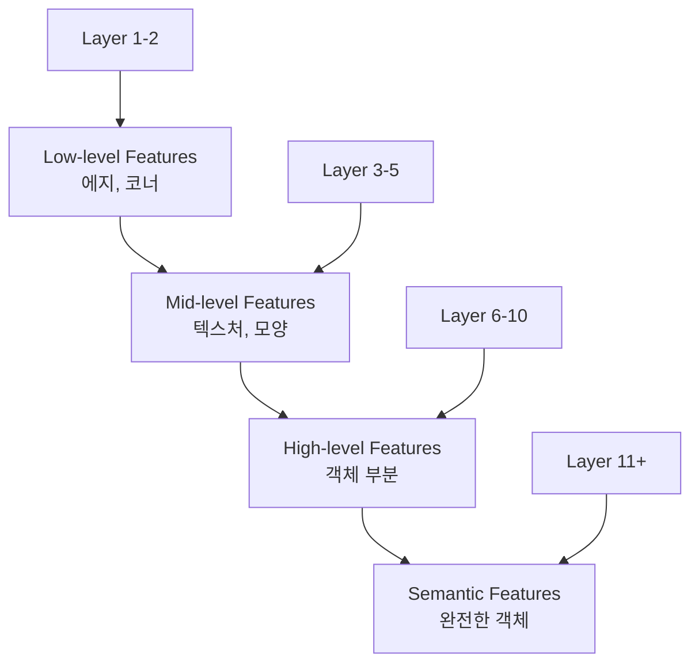
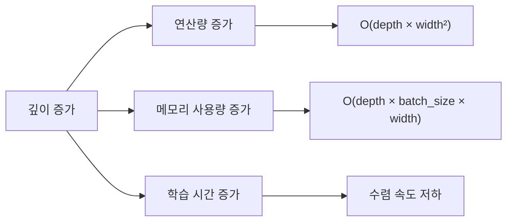
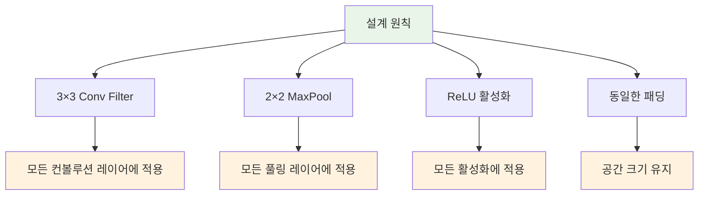
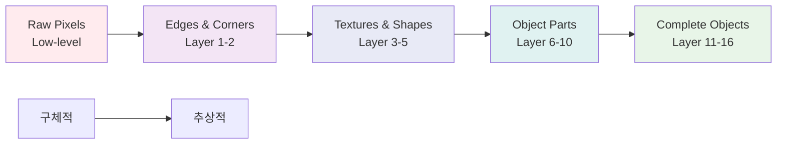
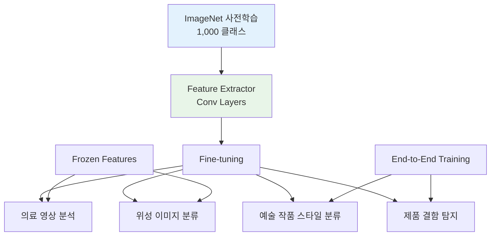
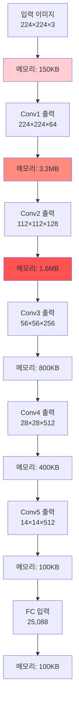
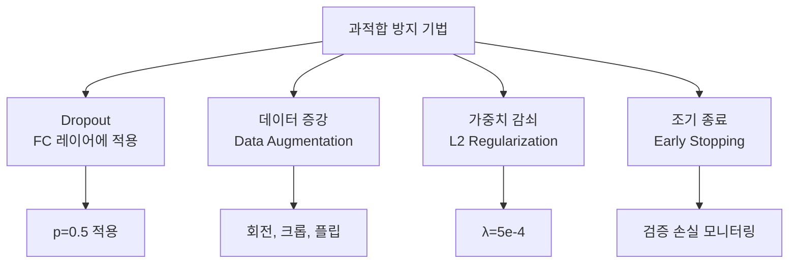

VGG는 ImageNet에서 학습된 가중치로 다양한 도메인에서 활용됩니다.깊은 네트워크와 누적된 비선형성의 시너지 효과:

$\text{Feature Complexity} \propto \text{Depth} \times \text{Non-linearity}$# VGG Net 심층 분석

## 목차

1. [개요](#1-개요)
2. [핵심 설계 질문 분석](#2-핵심-설계-질문-분석)
   - 2.1. [마지막 FCN 통과 이유](#21-왜-마지막에-fully-connected-networkfcn을-통과할까요)
   - 2.2. [선택적 MaxPooling 적용](#22-왜-모든-conv-레이어에-maxpooling을-통과시키지-않을까요)
   - 2.3. [깊은 네트워크의 장단점](#23-깊은-네트워크를-쌓는-것의-장점과-단점)
3. [VGG Net의 실용적 장점](#3-vgg-net의-실용적-장점)
   - 3.1. [단순성과 일관성](#31-단순성과-일관성-simplicity-and-consistency)
   - 3.2. [효과적인 특징 학습](#32-효과적인-특징-학습-effective-feature-learning)
   - 3.3. [전이 학습 베이스 모델](#33-전이-학습transfer-learning의-우수한-베이스-모델)
4. [VGG Net의 주요 고려사항](#4-vgg-net의-주요-고려사항)
   - 4.1. [계산 및 메모리 비용](#41-계산-및-메모리-비용-computational-cost)
   - 4.2. [과적합 문제](#42-과적합-문제-overfitting-issues)
   - 4.3. [성능 비교 및 개선 방향](#43-성능-비교-및-개선-방향)
5. [결론](#5-결론)

## 1. 개요

VGG(Visual Geometry Group) 네트워크는 2014년 옥스퍼드 대학의 VGG 팀이 개발한 CNN 아키텍처입니다. 작은 3×3 필터를 깊게 쌓아 높은 성능을 달성한 대표적인 모델입니다.

## 2. 핵심 설계 질문 분석

### 2.1. 왜 마지막에 Fully Connected Network(FCN)을 통과할까요?

#### 2.1.1. 공간 정보에서 클래스 확률로의 변환

VGG Net의 마지막 단계에서 FCN을 사용하는 이유는 **공간적 특징 맵을 클래스별 확률로 변환**하기 위함입니다.

#### 2.1.2. 수학적 관점

컨볼루션 레이어의 출력은 3차원 텐서 형태입니다:

$$\text{Conv Output} = \mathbb{R}^{H \times W \times C}$$

여기서:
- $H, W$: 공간적 차원 (높이, 너비)
- $C$: 채널 수 (특징 맵 개수)

FCN은 이를 1차원 벡터로 평탄화한 후 분류를 수행합니다:

$$\text{Flatten: } \mathbb{R}^{H \times W \times C} \rightarrow \mathbb{R}^{H \times W \times C}$$

$$\text{FC: } \mathbb{R}^{H \times W \times C} \rightarrow \mathbb{R}^{\text{num\_classes}}$$

#### 2.1.3. 기능적 역할

1. **전역 특징 통합**: 각 공간 위치의 특징들을 종합하여 이미지 전체의 표현을 생성
2. **차원 변환**: 특징 맵의 공간 정보를 제거하고 클래스 수만큼의 출력 생성
3. **비선형 분류 경계**: 복잡한 특징 조합을 학습하여 최종 분류 수행

### 2.2. 왜 모든 Conv 레이어에 MaxPooling을 통과시키지 않을까요?

#### 2.2.1. 점진적 다운샘플링 전략

VGG는 **블록 단위로 MaxPooling**을 적용하는 구조를 채택했습니다. 이는 다음과 같은 이유 때문입니다.

#### 2.2.2. 공간 해상도 보존

연속적인 컨볼루션 레이어에서 MaxPooling을 생략하면:

$$\text{Receptive Field Growth} = (k-1) \times \text{stride} + \text{previous RF}$$

여기서 $k$는 커널 크기입니다. 3×3 커널을 연속으로 사용하면:
- Conv1: RF = 3×3
- Conv2: RF = 5×5  
- Conv3: RF = 7×7

#### 2.2.3. 정보 손실 최소화

#### 2.2.4. 장점

1. **세밀한 특징 학습**: 같은 해상도에서 여러 레이어가 특징을 정제
2. **그라디언트 흐름**: 연속된 컨볼루션으로 더 안정적인 역전파
3. **효율적인 수용 영역 확장**: 파라미터 증가 없이 더 큰 패턴 인식

#### 2.2.5. 수학적 분석

두 개의 3×3 컨볼루션의 효과적 수용 영역:

$$\text{Effective RF} = 1 + \sum_{i=1}^{L} (k_i - 1) \times \prod_{j=1}^{i-1} s_j$$

여기서 $L$은 레이어 수, $k_i$는 $i$번째 레이어의 커널 크기, $s_j$는 $j$번째 레이어의 스트라이드입니다.

### 2.3. 깊은 네트워크를 쌓는 것의 장점과 단점

#### 2.3.1. 장점 (Advantages)

##### 2.3.1.1. 표현력 증가 (Increased Representational Power)

깊은 네트워크는 더 복잡한 함수를 학습할 수 있습니다:

$$f(x) = f_L \circ f_{L-1} \circ \cdots \circ f_1(x)$$

여기서 각 $f_i$는 레이어 함수입니다.

##### 2.3.1.2. 계층적 특징 학습

##### 2.3.1.3. 파라미터 효율성

Universal Approximation Theorem에 따르면:

$$\text{Wide Network (width } W\text{)} \approx \text{Deep Network (depth } D\text{)}$$

하지만 필요한 파라미터 수는:
- Wide: $O(W^2)$
- Deep: $O(D \times W)$

#### 2.3.2. 단점 (Disadvantages)

##### 2.3.2.1. 기울기 소실 문제 (Vanishing Gradient)

역전파 시 기울기가 지수적으로 감소:

$$\frac{\partial L}{\partial W_1} = \frac{\partial L}{\partial a_L} \prod_{i=2}^{L} \frac{\partial a_i}{\partial a_{i-1}} \frac{\partial a_1}{\partial W_1}$$

시그모이드 활성화 함수의 경우 $\frac{\partial \sigma}{\partial x} \leq 0.25$이므로:

$$\left|\frac{\partial L}{\partial W_1}\right| \leq 0.25^{L-1} \left|\frac{\partial L}{\partial a_L}\right|$$

##### 2.3.2.2. 계산 복잡도 증가

##### 2.3.2.3. 과적합 위험

깊은 모델의 용량(capacity):

$$\text{VC Dimension} \propto O(\text{weights} \times \log(\text{weights}))$$

##### 2.3.2.4. 기울기 폭발 (Gradient Explosion)

가중치가 큰 경우:

$$\left|\prod_{i=2}^{L} \frac{\partial a_i}{\partial a_{i-1}}\right| > 1 \Rightarrow \text{Gradient Explosion}$$

#### 2.3.3. VGG의 해결책

VGG는 다음과 같은 방법으로 깊은 네트워크의 단점을 완화했습니다:

1. **ReLU 활성화 함수**: 기울기 소실 완화
2. **Batch Normalization** (후속 연구에서): 내부 공변량 이동 해결  
3. **Dropout**: 과적합 방지
4. **가중치 초기화**: Xavier/He 초기화로 안정적 학습

$$\text{Xavier: } W \sim \mathcal{N}\left(0, \frac{1}{n_{in}}\right)$$

$$\text{He: } W \sim \mathcal{N}\left(0, \frac{2}{n_{in}}\right)$$

## 3. VGG Net의 실용적 장점

### 3.1. 단순성과 일관성 (Simplicity and Consistency)

VGG의 가장 큰 강점 중 하나는 **일관된 설계 원칙**입니다.

#### 3.1.1. 장점
- **구현 용이성**: 반복적인 구조로 코드 작성이 간단
- **하이퍼파라미터 조정**: 필터 크기나 풀링 방식을 고민할 필요 없음
- **디버깅 편의성**: 일관된 구조로 문제 발생 지점 파악 용이

### 2. 효과적인 특징 학습 (Effective Feature Learning)

깊은 네트워크와 누적된 비선형성의 시너지 효과:

$\text{Feature Complexity} \propto \text{Depth} \times \text{Non-linearity}$

#### 누적 비선형성의 수학적 표현

$L$개 레이어를 가진 VGG에서:

$f(x) = \sigma_L(W_L \cdot \sigma_{L-1}(W_{L-1} \cdot \ldots \sigma_1(W_1 \cdot x)))$

여기서 각 $\sigma_i$는 ReLU 활성화 함수입니다.

#### 3.2.2. 특징 추상화 과정

### 3.3. 전이 학습(Transfer Learning)의 우수한 베이스 모델

#### 3.3.1. 전이 학습 성능

사전 학습된 VGG 특징의 일반화 능력:

$\text{Target Task Accuracy} = f(\text{Source Features}, \text{Target Data})$

#### 3.3.2. 전이 학습 전략

1. **Feature Extraction**: Conv 레이어 고정, FC 레이어만 학습
2. **Fine-tuning**: 전체 네트워크를 낮은 학습률로 미세 조정

$\text{Learning Rate}_{\text{pretrained}} = \alpha \times \text{Learning Rate}_{\text{new}}$

여기서 $\alpha < 1$ (보통 0.1 또는 0.01)

## 4. VGG Net의 주요 고려사항

### 4.1. 계산 및 메모리 비용 (Computational Cost)

#### 4.1.1. 파라미터 수 분석

VGG-16의 총 파라미터: **138M**

| 레이어 타입 | 파라미터 수 | 비율 |
|-------------|-------------|------|
| Conv 레이어 | 14.7M | 10.6% |
| FC 레이어 | 123.6M | 89.4% |

#### 4.1.2. 메모리 사용량

순전파 시 메모리 요구량:

$\text{Memory} = \sum_{i=1}^{L} (\text{Feature Map Size}_i \times \text{Batch Size})$

#### 4.1.3. 연산 복잡도

FLOPs (Floating Point Operations) 분석:

$\text{Conv FLOPs} = H_{\text{out}} \times W_{\text{out}} \times C_{\text{out}} \times (K^2 \times C_{\text{in}} + 1)$

VGG-16 총 연산량: **약 15.5 GFLOPs**

### 4.2. 과적합 문제 (Overfitting Issues)

#### 4.2.1. 파라미터 대 데이터 비율

과적합 위험도:

$\text{Overfitting Risk} \propto \frac{\text{Model Capacity}}{\text{Training Data Size}}$

VGG-16의 경우:
- 파라미터: 138M
- ImageNet 학습 데이터: 1.2M 이미지
- 비율: 약 115 파라미터/이미지

#### 4.2.2. 정규화 기법들

#### 4.2.3. 수학적 정규화

L2 정규화가 포함된 손실 함수:

$L_{\text{total}} = L_{\text{classification}} + \lambda \sum_{i} W_i^2$

드롭아웃의 확률적 특성:

$y = \text{Dropout}(x) = \frac{1}{p} \times \text{Bernoulli}(p) \odot x$

### 4.3. 성능 비교 및 개선 방향

#### 4.3.1. 후속 모델들과의 비교

| 모델 | 파라미터 | Top-5 Error | FLOPs |
|------|----------|-------------|-------|
| VGG-16 | 138M | 7.4% | 15.5G |
| ResNet-50 | 25.6M | 7.1% | 3.8G |
| EfficientNet-B0 | 5.3M | 6.6% | 0.4G |

VGG의 한계점을 개선한 발전 방향:
- **ResNet**: Skip connection으로 깊은 네트워크 학습 개선
- **Inception**: 다중 스케일 필터로 효율성 증대
- **EfficientNet**: 복합 스케일링으로 효율성과 성능 균형

## 5. 결론

VGG Net은 단순하면서도 효과적인 설계 철학을 통해 CNN 발전의 중요한 이정표를 세웠습니다. 비록 계산 비용과 메모리 사용량이 높다는 단점이 있지만, 그 단순성과 일관성, 그리고 우수한 전이 학습 성능으로 인해 여전히 많은 연구와 실무에서 기준점으로 활용되고 있습니다. 

특히 교육 목적과 프로토타이핑 단계에서는 VGG의 직관적인 구조가 큰 장점으로 작용하며, 현대의 효율적인 아키텍처들의 기반이 되는 핵심 아이디어들을 잘 보여주는 모델입니다.

---

