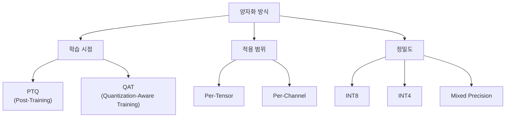
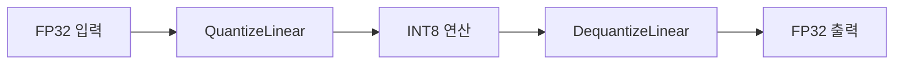
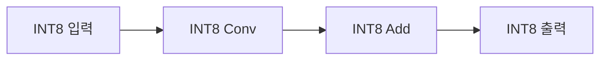
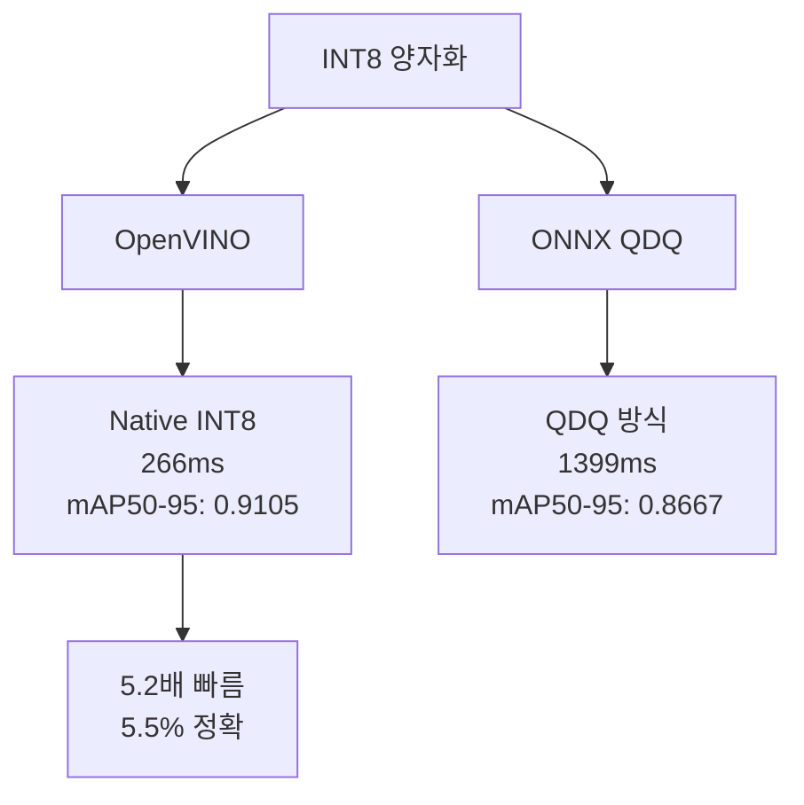
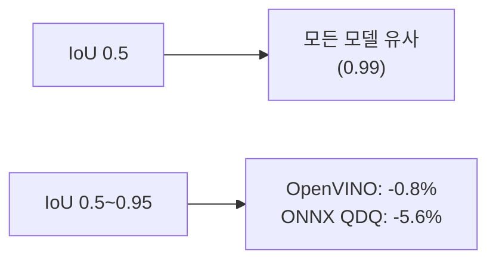
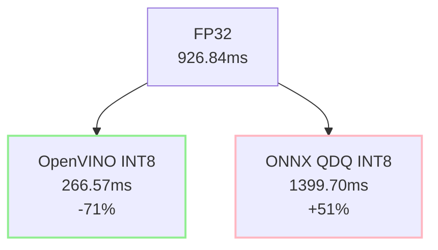
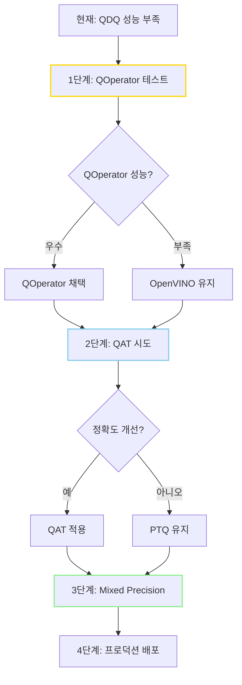

# YOLO 양자화 검토 보고서

**작성일**: 2025-12-09  
**대상 모델**: YOLOv8m (Oxford-IIIT Pet Dataset)  
**작성자**: 김명환

---

## 목차

1. [양자화 개요](#1-양자화-개요)  
   1.1. [양자화의 필요성](#11-양자화의-필요성)  
   1.2. [양자화 기본 원리](#12-양자화-기본-원리)  
   1.3. [양자화 방식 분류](#13-양자화-방식-분류)

2. [YOLO 아키텍처와 양자화 도전 과제](#2-yolo-아키텍처와-양자화-도전-과제)  
   2.1. [YOLOv8 구조적 특성](#21-yolov8-구조적-특성)  
   2.2. [양자화 민감 레이어](#22-양자화-민감-레이어)  
   2.3. [YOLO 특화 전처리와 양자화](#23-yolo-특화-전처리와-양자화)

3. [양자화 방법론 비교](#3-양자화-방법론-비교)  
   3.1. [PTQ vs QAT](#31-ptq-vs-qat)  
   3.2. [QDQ 방식 vs Native INT8](#32-qdq-방식-vs-native-int8)  
   3.3. [Calibration 전략](#33-calibration-전략)

4. [프레임워크별 최적화 전략](#4-프레임워크별-최적화-전략)  
   4.1. [ONNX Runtime (QDQ)](#41-onnx-runtime-qdq)  
   4.2. [OpenVINO (Intel CPU)](#42-openvino-intel-cpu)  
   4.3. [TensorRT (NVIDIA GPU)](#43-tensorrt-nvidia-gpu)

5. [실험 결과 분석](#5-실험-결과-분석)  
   5.1. [모델 크기 비교](#51-모델-크기-비교)  
   5.2. [정확도 분석](#52-정확도-분석)  
   5.3. [추론 속도 분석](#53-추론-속도-분석)  
   5.4. [그래프 복잡도 변화](#54-그래프-복잡도-변화)

6. [권장사항 및 체크리스트](#6-권장사항-및-체크리스트)  
   6.1. [하드웨어별 최적 전략](#61-하드웨어별-최적-전략)  
   6.2. [양자화 전 필수 검토 사항](#62-양자화-전-필수-검토-사항)  
   6.3. [트러블슈팅 가이드](#63-트러블슈팅-가이드)

7. [결론](#7-결론)

---

## 1. 양자화 개요

### 1.1. 양자화의 필요성

딥러닝 모델의 실시간 추론 배포에서 다음과 같은 제약이 존재한다:

- **메모리 제약**: 엣지 디바이스의 제한된 RAM/VRAM
- **연산 제약**: 저전력 프로세서의 낮은 연산 능력
- **지연 시간**: 실시간 애플리케이션 요구사항 (자율주행, 감시 시스템)

양자화는 이러한 제약을 해결하기 위한 핵심 기술로, **가중치와 활성화 값의 비트 수를 줄여** 모델 크기와 연산량을 감소시킨다.

**기대 효과**:
- 모델 크기: 75% 감소 (FP32 → INT8)
- 추론 속도: 2~4배 향상 (하드웨어 최적화 시)
- 메모리 대역폭: 4배 감소

### 1.2. 양자화 기본 원리

#### 1.2.1. 수식 표현

FP32 값을 INT8로 변환하는 과정:

$$
x_{\text{int8}} = \text{round}\left(\frac{x_{\text{fp32}}}{s}\right) + z
$$

역변환 (Dequantization):

$$
x_{\text{fp32}} = (x_{\text{int8}} - z) \times s
$$

여기서:
- $s$: scale (스케일 팩터)
- $z$: zero-point (제로 포인트, asymmetric 양자화 시)

#### 1.2.2. Symmetric vs Asymmetric

**Symmetric Quantization (대칭 양자화)**:
- $z = 0$ (zero-point 없음)
- 범위: $[-127, 127]$
- **장점**: 연산 단순, 하드웨어 가속 용이
- **단점**: 비대칭 분포에서 정밀도 손실
- **적용**: 가중치 (대부분 대칭 분포)

**Asymmetric Quantization (비대칭 양자화)**:
- $z \neq 0$
- 범위: $[-128, 127]$ 또는 $[0, 255]$
- **장점**: 비대칭 분포 효율적 표현
- **단점**: zero-point 연산 오버헤드
- **적용**: 활성화 값 (ReLU 출력 등)

### 1.3. 양자화 방식 분류



---

## 2. YOLO 아키텍처와 양자화 도전 과제

### 2.1. YOLOv8 구조적 특성

#### 2.1.1. 모델 구성 요소

**Backbone (CSPDarknet)**:
- Conv + SiLU (Swish) activation
- C2f 모듈 (Cross-Stage Partial, Fast)
- **특징**: Residual connection 다수 포함

**Neck (FPN + PAN)**:
- 다중 스케일 특징 융합
- Concat 연산 빈번

**Head (Decoupled Head)**:
- Classification head
- Bounding box regression head
- **출력**: `[batch, 6, 8400]` (8400개 앵커 포인트)

#### 2.1.2. 모델 통계 (FP32 기준)

| 항목 | 값 |
|------|-----|
| 전체 노드 수 | 400개 |
| Conv 레이어 | 84개 (21%) |
| Activation (Mul+Sigmoid) | 160개 (40%) |
| Concat | 39개 (9.75%) |
| 입력 shape | `[batch, 3, 640, 640]` |
| 출력 shape | `[batch, 6, 8400]` |

**핵심 관찰**:
- 활성화 함수가 전체 노드의 40%를 차지
- Concat 연산이 많아 출력 레이어 보호 필요
- Residual connection으로 인한 정밀도 누적 오차 위험

### 2.2. 양자화 민감 레이어

#### 2.2.1. 레이어 타입별 양자화 적합성

| 레이어 타입 | 양자화 가능 여부 | 우선순위 | 이유 |
|------------|----------------|---------|------|
| Conv | 가능 (필수) | 최고 | 연산량의 대부분 차지, INT8 효과 우수 |
| MatMul/Gemm | 가능 (필수) | 최고 | 행렬 곱셈, 하드웨어 가속 지원 |
| Add | 가능 | 중 | Residual connection, 정밀도 유지 가능 |
| Mul | 가능 | 중 | SiLU activation의 일부 |
| Sigmoid | 제한적 | 낮음 | 비선형 함수, 양자화 시 왜곡 위험 |
| Concat | **불가** | - | 출력 레이어, 정밀도 필수 |
| Reshape/Transpose | **불가** | - | 메모리 재배치만, 양자화 의미 없음 |
| MaxPool | 제한적 | 낮음 | 비교 연산, INT8 효과 미미 |

#### 2.2.2. SiLU (Swish) Activation의 양자화 문제

YOLOv8은 SiLU 활성화 함수를 사용한다:

$$
\text{SiLU}(x) = x \cdot \sigma(x)
$$

ONNX 그래프에서는 `Sigmoid` + `Mul`로 분해된다.

**양자화 도전 과제**:
1. **Sigmoid의 비선형성**: INT8로 표현 시 정밀도 손실
2. **두 단계 연산**: 각 단계마다 QDQ 노드 삽입 시 오차 누적
3. **동적 범위**: 입력에 따라 출력 범위 변화, Calibration 어려움

**해결 전략**:
- Sigmoid를 양자화에서 제외 (FP32 유지)
- Mul만 양자화 적용
- 또는 SiLU 전체를 단일 커스텀 OP로 구현

### 2.3. YOLO 특화 전처리와 양자화

#### 2.3.1. Letterbox Resize

YOLO는 비율을 유지하면서 640×640으로 리사이즈하고 패딩을 추가한다:


**양자화 시 고려사항**:
- **패딩 값**: 보통 114 (회색), 양자화 후에도 동일 값 유지 필요
- **좌표 역변환**: 추론 후 BBox 좌표를 원본 이미지 기준으로 변환
- **Calibration 일치**: Calibration 데이터에도 동일한 Letterbox 적용 필수

#### 2.3.2. 정규화 (Normalization)

YOLO는 `[0, 255] → [0, 1]` 범위로 정규화한다.

**양자화와의 상호작용**:
- **입력 양자화**: 이미 `[0, 1]` 범위이므로 scale 계산 단순
- **Calibration 시**: 실제 추론과 동일한 정규화 적용 필수
- **불일치 시**: 정확도 대폭 하락 (ONNX Runtime 경고 발생)

#### 2.3.3. NMS (Non-Maximum Suppression)

**양자화 영향**:
- NMS는 주로 CPU에서 후처리로 실행 (FP32)
- 모델 출력이 양자화되더라도 NMS는 Dequantize 후 실행
- **주의**: 출력 레이어 양자화 시 BBox 좌표 정밀도 손실 → NMS 결과 왜곡

---

## 3. 양자화 방법론 비교

### 3.1. PTQ vs QAT

#### 3.1.1. PTQ (Post-Training Quantization)

**정의**: 학습 완료 후 가중치와 활성화 값을 INT8로 변환

**장점**:
- 재학습 불필요 → 빠른 적용
- 기존 학습 파이프라인 수정 불필요
- 라이브러리 지원 우수 (ONNX Runtime, OpenVINO)

**단점**:
- QAT 대비 정확도 1~3% 하락 가능
- Calibration 데이터 품질에 민감
- 양자화 민감 레이어에서 성능 저하

**적용 사례 (본 실험)**:
- OpenVINO INT8: mAP50-95 0.9178 → 0.9105 (-0.8%)
- ONNX INT8 QDQ: mAP50-95 0.9178 → 0.8667 (-5.6%)

#### 3.1.2. QAT (Quantization-Aware Training)

**정의**: 학습 중 양자화 오차를 시뮬레이션하여 모델이 적응

**방법**:
- Forward pass에서 FakeQuantize 노드 삽입
- Backward pass는 FP32로 수행 (Straight-Through Estimator)

**장점**:
- PTQ 대비 정확도 손실 최소화
- 양자화 민감 레이어에 효과적

**단점**:
- 재학습 필요 (수 epoch ~ 전체 재학습)
- 학습 파이프라인 수정 필요
- 하이퍼파라미터 튜닝 추가

**권장 사용 시점**:
- PTQ 결과가 정확도 요구사항 미달 시
- 양자화 최적화가 프로젝트의 핵심 목표일 때
- 충분한 학습 시간 확보 가능 시

### 3.2. QDQ 방식 vs Native INT8

#### 3.2.1. QDQ (Quantize-Dequantize) 방식

**구조**:


##### QDQ 쌍(Pair)이란?

**정의**: QuantizeLinear 노드 + DequantizeLinear 노드가 항상 함께 사용되는 구조

**각 노드의 역할**:

1. **Q (QuantizeLinear) 노드**: FP32 → INT8 변환
   ```python
   # 양자화 공식
   x_int8 = round(x_fp32 / scale) + zero_point

   # 예시
   input_fp32 = 0.523
   scale = 0.003
   zero_point = 128
   output_int8 = round(0.523 / 0.003) + 128 = 302
   # INT8 범위 [0, 255]로 클리핑 → 255
   ```

2. **DQ (DequantizeLinear) 노드**: INT8 → FP32 복원
   ```python
   # 역양자화 공식
   x_fp32 = (x_int8 - zero_point) * scale

   # 예시
   input_int8 = 255
   output_fp32 = (255 - 128) * 0.003 = 0.381
   # 원본 0.523과 차이 발생 (양자화 오차)
   ```

**QDQ 쌍이 삽입되는 위치**:

```
원본 모델 (FP32):
┌──────┐    ┌──────┐    ┌──────┐
│ Conv │───▶│ ReLU │───▶│ Conv │
└──────┘    └──────┘    └──────┘
  FP32       FP32        FP32

QDQ 쌍 삽입 후:
┌──────┐  ┌─┐ ┌──┐  ┌──────┐  ┌─┐ ┌──┐  ┌──────┐
│ Conv │─▶│Q│▶│DQ│─▶│ ReLU │─▶│Q│▶│DQ│─▶│ Conv │
└──────┘  └─┘ └──┘  └──────┘  └─┘ └──┘  └──────┘
  FP32    INT8 FP32    FP32   INT8 FP32   FP32
          └─쌍─┘              └─쌍─┘
```

##### 노드 수 폭증의 원인

**특징**:
- ONNX Runtime의 기본 방식
- **각 양자화 대상 텐서마다 QDQ 노드 쌍 삽입**
- **노드 수 폭증**: 400개 → 1,228개 (3배 증가)
  - QuantizeLinear: 330개
  - DequantizeLinear: 498개

**폭증 원인 분석**:

1. **텐서별 QDQ 쌍 필요**:
   ```
   원본: [Conv] → [Relu] → [Conv]

   양자화 후:
   [Conv] → [Q] → [DQ] → [Relu] → [Q] → [DQ] → [Conv]
            └─ 2개 ─┘           └─ 2개 ─┘

   - Conv → Relu 사이의 activation: QDQ 쌍 (2개)
   - Relu → Conv 사이의 activation: QDQ 쌍 (2개)
   - 각 Conv의 weight: QDQ 쌍 (2개씩)
   ```

2. **증가분 계산** (400개 → 1,228개):
   ```
   증가분 = 828개 노드

   원본 400개 노드 중:
   - 양자화 가능 연산 (Conv, MatMul 등): 약 140개

   각 연산마다 추가되는 QDQ 노드:
   - Input activation QDQ: 2개
   - Weight QDQ: 2개
   - Output activation QDQ: 2개
   = 연산당 평균 6개 노드

   140개 × 6 = 840개 ≈ 828개 증가
   ```

3. **실제 ONNX 그래프 예시**:
   ```python
   # 원본 노드
   node {
     input: "input"
     output: "conv_output"
     op_type: "Conv"
   }

   # QDQ 삽입 후 (3개 노드로 확장)
   node {
     input: "input"
     output: "quantized"
     op_type: "QuantizeLinear"
     attribute { name: "scale", f: 0.003 }
     attribute { name: "zero_point", i: 128 }
   }

   node {
     input: "quantized"
     output: "dequantized"
     op_type: "DequantizeLinear"
     attribute { name: "scale", f: 0.003 }
     attribute { name: "zero_point", i: 128 }
   }

   node {
     input: "dequantized"  # 원래는 "input"
     output: "conv_output"
     op_type: "Conv"
   }
   ```

##### 왜 QDQ 쌍을 사용하는가?

**설계 철학**:
1. **명시적 표현**: 양자화 지점을 그래프에서 명확히 표시
2. **유연성**: Per-channel, Per-tensor 등 다양한 전략 지원
3. **디버깅**: QDQ 노드 제거만으로 FP32로 복원 가능
4. **하드웨어 독립성**: 특정 하드웨어에 종속되지 않음
5. **최적화 여지**: 백엔드에서 QDQ 쌍을 fusion 가능

**실행 시점의 동작**:
```python
# 방법 1: QDQ 쌍 유지 (시뮬레이션 모드)
x_fp32 = input
x_int8 = quantize(x_fp32)           # Q 노드 실행
x_fp32_restored = dequantize(x_int8) # DQ 노드 실행
output = conv(x_fp32_restored)       # 여전히 FP32 연산

# 방법 2: QDQ 쌍 최적화 (실제 양자화 모드)
# 런타임이 자동으로 변환:
x_int8 = quantize(input)
output_int8 = conv_int8(x_int8)      # INT8 연산으로 치환
output = dequantize(output_int8)
```

##### 노드 수 폭증 없이 양자화하는 대안

**QDQ 방식이 유일한 방법은 아닙니다:**

| 방식 | 노드 수 | 정확도 | 디버깅 | 하드웨어 지원 |
|------|---------|--------|--------|--------------|
| **QDQ (ONNX RT)** | 많음 (3배) | 높음 | 쉬움 | 범용 |
| **Operator Fusion** | 적음 (1.2배) | 높음 | 어려움 | 특화 필요 |
| **Static Quantization** | 같음 (1배) | 중간 | 어려움 | 특화 필요 |
| **Dynamic Quantization** | 같음 (1배) | 낮음 | 쉬움 | 범용 |

**대안 1: Operator Fusion**:
```python
# QDQ 방식 (노드 많음)
[Conv] → [Q] → [DQ] → [Relu] → [Q] → [DQ]

# Fusion 방식 (노드 적음)
[QuantizedConvRelu]  # 단일 융합 노드
```

**대안 2: Static Quantization (TensorFlow Lite 방식)**:
```python
# Q/DQ 노드를 명시하지 않고, 메타데이터로 저장
{
  "op": "Conv",
  "quantization": {
    "input_scale": 0.003,
    "weight_scale": 0.002,
    "output_scale": 0.005
  }
}
# 노드 수 증가 없음
```

**대안 3: QOperator 형식 (ONNX Runtime)**:
```python
from onnxruntime.quantization import quantize_static, QuantFormat

quantize_static(
    model_input,
    model_output,
    calibration_data_reader,
    quant_format=QuantFormat.QOperator  # QDQ 대신 사용
)
# 노드 수: 400 → ~500 (25% 증가만)
```

**장점**:
- ONNX 표준 준수, 호환성 우수
- 디버깅 용이 (중간 값 FP32 확인 가능)
- 양자화 전략의 명시적 표현
- 백엔드별 최적화 가능

**단점**:
- CPU에서 QDQ 오버헤드 심각 (본 실험: 추론 시간 1.5배 증가)
- 메모리 대역폭 낭비 (FP32 ↔ INT8 변환 반복)
- 그래프 복잡도 증가로 최적화 제한

#### 3.2.2. Native INT8

**구조**:


**특징**:
- OpenVINO, TensorRT의 방식
- 엔드투엔드 INT8 연산 (중간 Dequantize 최소화)
- 하드웨어 최적화 (VNNI, DP4A 명령어)

**장점**:
- 최고 추론 속도 (본 실험: FP32 대비 4.1배 향상)
- 메모리 효율 최상
- 프레임워크별 최적화 기법 적용

**단점**:
- 프레임워크 종속성 (Intel → OpenVINO, NVIDIA → TensorRT)
- 디버깅 어려움 (중간 값 INT8)
- 변환 복잡도 증가

### 3.3. Calibration 전략

#### 3.3.1. Calibration의 역할

양자화 시 활성화 값의 동적 범위를 측정하여 scale/zero-point를 결정한다.

**수식**:

$$
s = \frac{\max(x) - \min(x)}{255}
$$

$$
z = -\text{round}\left(\frac{\min(x)}{s}\right)
$$

#### 3.3.2. Calibration 데이터셋 선정

**본 실험 설정**:
- 데이터셋: Oxford-IIIT Pet Dataset
- 샘플 수: 500장 (랜덤 샘플링)
- 전처리: Letterbox resize + 정규화

**권장 전략**:

| 항목 | 권장 방법 | 이유 |
|------|----------|------|
| 샘플 수 | 300~1000장 | 너무 적으면 편향, 많으면 시간 소요 |
| 샘플링 | 클래스 균형 | 모든 클래스의 특징 반영 |
| 다양성 | 조명/배경/크기 | 실제 추론 환경과 유사하게 |
| 전처리 | 추론과 동일 | **필수**, 불일치 시 정확도 저하 |

#### 3.3.3. 전처리 불일치 경고

ONNX Runtime에서 다음 경고 발생 시:

```
WARNING - Please consider pre-processing before quantization
```

**원인**:
- Calibration 전처리 ≠ 실제 추론 전처리
- 예: 정규화 순서 다름, BGR↔RGB 변환 누락

**해결**:
1. YOLO 공식 전처리 파이프라인 정확히 구현
2. Calibration DataReader에서 동일 전처리 적용
3. 샘플 이미지로 출력 비교 검증

---

## 4. 프레임워크별 최적화 전략

### 4.1. ONNX Runtime (QDQ)

#### 4.1.1. 특징

- **크로스 플랫폼**: Windows, Linux, macOS 지원
- **백엔드**: CPU (MLAS), CUDA, DirectML
- **양자화**: QDQ 방식, Static/Dynamic PTQ

#### 4.1.2. 양자화 설정

**핵심 파라미터**:

| 파라미터 | 값 | 설명 |
|---------|-----|------|
| `quant_format` | `QuantFormat.QDQ` | CPU 호환 형식 |
| `activation_type` | `QuantType.QInt8` | 활성화 INT8 |
| `weight_type` | `QuantType.QInt8` | 가중치 INT8 |
| `per_channel` | `True` | 채널별 양자화 (정밀도↑) |
| `ActivationSymmetric` | `False` | 비대칭 (ReLU 등) |
| `WeightSymmetric` | `True` | 대칭 (가중치 분포) |

#### 4.1.3. 레이어 제외 전략

**제외 대상**:
- **출력 레이어 체인**: Concat, Reshape, Transpose
- **비선형 활성화**: Sigmoid (선택적)
- **구조 변경 연산**: Slice, Split

**제외 이유**:
- 출력 정밀도 보호 (BBox 좌표)
- 양자화 효과 미미한 연산

#### 4.1.4. 실험 결과 (본 프로젝트)

| 지표 | 값 | 비고 |
|------|-----|------|
| 모델 크기 | 25.30 MB | FP32 대비 74.4% 감소 |
| mAP50-95 | 0.8667 | FP32 대비 -5.6% |
| 추론 시간 (CPU) | 1399.70 ms | FP32 대비 **1.5배 증가** |
| 노드 수 | 1,228개 | FP32 대비 3배 증가 |

**핵심 문제**: CPU에서 QDQ 오버헤드로 인한 속도 저하

### 4.2. OpenVINO (Intel CPU)

#### 4.2.1. 특징

- **Intel 최적화**: AVX-512, VNNI 명령어 활용
- **POT (Post-Training Optimization Tool)**: 자동 양자화
- **Ultralytics 내장**: YOLOv8 원클릭 변환 지원

#### 4.2.2. 적용 방법

**Ultralytics API 사용**:

```python
model.export(
    format='openvino',
    int8=True,
    imgsz=640,
    data=yaml_path,  # Calibration 데이터
)
```

**특징**:
- Calibration 데이터만 제공하면 자동 최적화
- Intel CPU에 특화된 그래프 최적화
- 내부적으로 Native INT8 형식 사용

#### 4.2.3. 실험 결과 (본 프로젝트)

| 지표 | 값 | 비고 |
|------|-----|------|
| 모델 크기 | 25.46 MB | FP32 대비 74.2% 감소 |
| mAP50-95 | 0.9105 | FP32 대비 -0.8% |
| 추론 시간 (CPU) | 266.57 ms | FP32 대비 **4.1배 향상** |
| 정확도 유지 | 우수 | ONNX QDQ 대비 5.5% 높음 |

**핵심 장점**: Intel CPU에서 최적 성능, 정확도 손실 최소화

#### 4.2.4. OpenVINO vs ONNX QDQ 비교

**동일 조건 (INT8, Windows 11, Intel CPU)**:



### 4.3. TensorRT (NVIDIA GPU)

#### 4.3.1. 특징

- **NVIDIA 최적화**: Tensor Core, DP4A 활용
- **Layer Fusion**: 여러 레이어를 단일 커널로 병합
- **Mixed Precision**: FP16 + INT8 혼합 사용 가능

#### 4.3.2. 양자화 전략

**Explicit Quantization**:
- ONNX QDQ 모델을 TensorRT로 변환
- QDQ 노드를 TensorRT가 최적화

**Implicit Quantization**:
- TensorRT Builder가 자동으로 INT8 캘리브레이션
- Calibrator 인터페이스 구현 필요

#### 4.3.3. 예상 성능

**GPU 환경 (NVIDIA L4 기준)**:
- FP32: ~10ms
- FP16: ~5ms
- INT8: ~3ms

**주의**: GPU에서는 QDQ 오버헤드가 CPU보다 적음 (병렬 처리)

---

## 5. 실험 결과 분석

### 5.1. 모델 크기 비교

| 모델 포맷 | 파일 크기 (MB) | 압축률 | 비고 |
|----------|---------------|--------|------|
| PyTorch `.pt` | 49.60 | - | state_dict 형식 |
| ONNX FP32 | 98.72 | - | 그래프 메타데이터 포함 |
| ONNX FP16 | 98.72 | 0% | **변환 실패** (FP32 유지) |
| ONNX INT8 (QDQ) | 25.30 | 74.4% | QDQ 노드 포함 |
| OpenVINO INT8 | 25.46 | 74.2% | Native INT8 |

**핵심 관찰**:
- INT8 양자화로 **약 75% 크기 감소**
- FP16 변환 실패: Ultralytics의 `half=True` 옵션이 CPU 환경에서 미작동
- ONNX vs OpenVINO: 크기는 유사하나 내부 형식 상이

### 5.2. 정확도 분석

| 모델 | mAP50 | mAP50-95 | Precision | Recall |
|------|-------|----------|-----------|--------|
| FP32 (baseline) | 0.9942 | 0.9178 | 0.9942 | 0.9783 |
| FP16 | 0.9942 | 0.9178 | 0.9942 | 0.9783 |
| **OpenVINO INT8** | **0.9942** | **0.9105** | **0.9917** | **0.9776** |
| ONNX INT8 QDQ | 0.9938 | 0.8667 | 0.9881 | 0.9783 |

**분석**:

1. **FP32 vs FP16**:
   - 완전 동일 (FP16 변환 실패)
   
2. **OpenVINO INT8**:
   - mAP50: 거의 동일 (0.9942)
   - mAP50-95: 소폭 하락 (-0.8%)
   - **해석**: IoU 임계값이 높아질수록 정밀도 손실 누적
   - **실용성**: 0.9105는 여전히 우수한 성능

3. **ONNX INT8 QDQ**:
   - mAP50-95: 큰 폭 하락 (-5.6%)
   - **원인**:
     - QDQ 노드 오차 누적
     - CPU 최적화 부족
     - Calibration 데이터 품질 문제 가능성

**IoU 임계값별 성능 변화**:



### 5.3. 추론 속도 분석

| 모델 | 추론 시간 (ms) | FP32 대비 | 비고 |
|------|---------------|----------|------|
| FP32 (baseline) | 926.84 | 1.0x | - |
| FP16 | 831.75 | 0.90x | 내부 최적화 추정 |
| **OpenVINO INT8** | **266.57** | **0.29x (3.5배)** | Intel VNNI |
| ONNX INT8 QDQ | 1399.70 | 1.51x | **역효과** |

**핵심 인사이트**:

1. **OpenVINO의 압도적 우위**:
   - FP32 대비 4.1배 빠름
   - ONNX QDQ 대비 5.2배 빠름
   - **이유**: Native INT8 + Intel 최적화

2. **ONNX QDQ의 역설**:
   - INT8임에도 FP32보다 느림
   - **원인**: QDQ 오버헤드 > INT8 연산 이득
   - CPU에서 QuantizeLinear/DequantizeLinear 비효율

3. **FP16의 제한적 효과**:
   - 실제로는 FP32로 변환됨
   - 10% 개선은 ONNX Runtime 내부 최적화

**프레임워크별 추론 시간 비교**:



### 5.4. 그래프 복잡도 변화

#### 5.4.1. 노드 수 변화

| 모델 | 전체 노드 수 | Conv | QDQ 노드 | 비고 |
|------|-------------|------|---------|------|
| FP32 | 400 | 84 | 0 | 기본 그래프 |
| INT8 QDQ | 1,228 | 84 | 828 | 3배 증가 |

**QDQ 노드 구성**:
- QuantizeLinear: 330개
- DequantizeLinear: 498개
- **총**: 828개 (전체의 67%)

#### 5.4.2. QDQ 노드 폭증의 영향

**메모리 관점**:
- 각 QDQ 노드마다 scale/zero-point 저장
- 그래프 메타데이터 증가 (실제 가중치는 감소)

**실행 관점**:
- CPU에서 QDQ 노드 실행 비용 높음
- 메모리 대역폭 낭비 (FP32 ↔ INT8 변환)
- 캐시 효율성 저하

**GPU에서는 다름**:
- 병렬 처리로 QDQ 오버헤드 감소
- Tensor Core가 FP16↔INT8 변환 가속

---

## 6. 권장사항 및 체크리스트

### 6.1. 하드웨어별 최적 전략

#### 6.1.1. Intel CPU

**추천**: OpenVINO INT8

**이유**:
- VNNI 명령어 활용 (AVX-512)
- Native INT8 형식으로 최대 성능
- Ultralytics 내장 지원으로 적용 용이

**적용 방법**:
```python
model.export(format='openvino', int8=True, data=yaml_path)
```

#### 6.1.2. NVIDIA GPU

**추천**: TensorRT INT8 (또는 FP16)

**이유**:
- Tensor Core 최적화
- Layer Fusion으로 연산 병합
- Mixed Precision 지원

**적용 방법**:
```python
model.export(format='engine', int8=True, data=yaml_path)
```

#### 6.1.3. AMD GPU / ARM CPU

**추천**: ONNX FP32 또는 FP16

**이유**:
- INT8 최적화 제한적
- FP16이 합리적 절충안

**주의**: ARM NEON 명령어 지원 확인 필요

#### 6.1.4. 웹 브라우저 (WASM)

**추천**: ONNX FP32

**이유**:
- WASM은 INT8 네이티브 지원 제한적
- 모델 크기 감소는 의미 있으나 속도 개선 미미

### 6.2. 양자화 전 필수 검토 사항

#### 6.2.1. 체크리스트

- [ ] **하드웨어 확인**: 배포 환경의 INT8 가속 지원 여부
- [ ] **정확도 요구사항**: 허용 가능한 mAP 하락 범위 정의
- [ ] **추론 속도 목표**: 실시간 처리 필요 여부
- [ ] **Calibration 데이터**: 대표성 있는 샘플 확보
- [ ] **전처리 파이프라인**: 학습·Calibration·추론 일치 확인
- [ ] **출력 레이어 보호**: 검출 정확도에 직접 영향

#### 6.2.2. 실험 설계

**단계별 접근**:

1. **Baseline 수립**:
   - FP32 모델의 정확도·속도 측정
   - 목표 설정 (예: mAP 1% 이내, 속도 2배)

2. **PTQ 시도**:
   - 가장 빠른 방법부터 (OpenVINO)
   - 정확도 평가 → 목표 달성 시 종료

3. **QAT 고려**:
   - PTQ 결과 부족 시
   - 재학습 비용 대비 효과 분석

4. **Mixed Precision**:
   - 민감 레이어만 FP32 유지
   - 추가 정밀도 필요 시

### 6.3. 트러블슈팅 가이드

#### 6.3.1. 정확도 급락 (mAP > 5% 하락)

**증상**: 양자화 후 mAP가 크게 떨어짐

**가능한 원인**:
1. **Calibration 데이터 부족**
   - 해결: 500~1000장으로 증가
   
2. **전처리 불일치**
   - 해결: Calibration DataReader 검증
   
3. **출력 레이어 양자화**
   - 해결: Concat, Reshape 제외
   
4. **비선형 활성화 양자화**
   - 해결: Sigmoid 제외

**진단 방법**:
- 레이어별 출력 비교 (FP32 vs INT8)
- Calibration 경고 메시지 확인
- 단계적 양자화 (Conv만 → Conv+Add → ...)

#### 6.3.2. 추론 속도 개선 없음

**증상**: INT8임에도 FP32와 속도 유사 또는 느림

**가능한 원인**:
1. **QDQ 오버헤드 (CPU)**
   - 해결: OpenVINO 또는 TensorRT 사용
   
2. **하드웨어 미지원**
   - 해결: CPU 플래그 확인 (AVX-512, VNNI)
   
3. **메모리 병목**
   - 해결: 배치 크기 증가, 캐시 최적화

**진단 방법**:
- 프로파일링 (각 레이어 실행 시간)
- 하드웨어 명령어 지원 확인 (`lscpu`, `cpuid`)

#### 6.3.3. 모델 로딩 실패

**증상**: 양자화 모델이 로드되지 않음

**가능한 원인**:
1. **ONNX Runtime 버전 불일치**
   - 해결: 1.14+ 버전 사용
   
2. **OpenVINO 버전 불일치**
   - 해결: 2024.0+ 버전 사용
   
3. **커스텀 OP 미지원**
   - 해결: Opset 버전 낮추기 또는 OP 제거

**진단 방법**:
- 버전 확인: `onnxruntime.__version__`
- 모델 검증: `onnx.checker.check_model()`

#### 6.3.4. FP16 변환 실패

**증상**: FP16 모델이 FP32와 동일 크기

**원인**: CPU 환경에서 Ultralytics의 `half=True` 미작동

**해결**:
1. **GPU 환경에서 변환**: CUDA 사용
2. **수동 변환**: ONNX Simplifier 사용
3. **포기**: CPU에서 FP16 효과 제한적

---

## 7. 결론

### 7.1. 핵심 발견

1. **하드웨어 최적화가 결정적**:
   - 동일 INT8 양자화도 프레임워크에 따라 성능 5배 차이
   - Intel CPU → OpenVINO, NVIDIA GPU → TensorRT

2. **QDQ 방식은 CPU에서 비효율적**:
   - ONNX Runtime QDQ: 추론 시간 오히려 증가 (+51%)
   - GPU에서는 상황이 다를 수 있음

3. **정확도 손실은 제어 가능**:
   - PTQ만으로도 mAP50-95 0.8% 하락 수준 달성 (OpenVINO)
   - 출력 레이어 보호와 Calibration 품질이 핵심

4. **YOLO는 양자화 친화적**:
   - Conv 레이어가 대부분 → INT8 효과 우수
   - Residual connection 많음 → 정밀도 관리 필요

### 7.2. 실무 권장 사항

**상황별 최적 전략**:

| 배포 환경 | 권장 방법 | 예상 성능 |
|----------|----------|----------|
| Intel CPU (서버) | OpenVINO INT8 | 4배 속도 향상, -1% 정확도 |
| NVIDIA GPU (서버) | TensorRT INT8 | 3배 속도 향상, -1% 정확도 |
| 엣지 디바이스 (ARM) | ONNX FP16 또는 INT8 | 2배 속도 향상, -2% 정확도 |
| 웹 브라우저 (WASM) | ONNX FP32 | 크기만 감소 |
| 정확도 최우선 | ONNX FP32 | 기준 성능 유지 |

**프로젝트 단계별 접근**:

1. **프로토타입 단계**: ONNX FP32 (호환성, 정확도)
2. **최적화 단계**: 하드웨어별 PTQ 적용
3. **파인튜닝 단계**: 필요 시 QAT 고려

### 7.3. 향후 연구 방향

#### 7.3.1. 우선순위: 높음

**1. QOperator 형식 성능 검증** **필수 테스트**

**현재 상황**:
- QDQ 방식은 CPU에서 추론 시간 1.5배 증가 (FP32 대비 오히려 느림)
- 노드 수 폭증 (400 → 1,228개)으로 그래프 복잡도 증가

**QOperator 테스트 필요성**:
- **노드 수 감소 기대**: 400 → ~500개 (25% 증가만)
- **CPU 성능 개선 기대**: QDQ 오버헤드 제거로 실제 속도 향상 가능
- **메모리 효율**: FP32 ↔ INT8 변환 반복 제거

**테스트 계획**:

```python
# 1. QOperator 형식으로 변환
from onnxruntime.quantization import quantize_static, QuantFormat

quantize_static(
    model_input='yolov8m_fp32.onnx',
    model_output='yolov8m_qoperator.onnx',
    calibration_data_reader=CalibrationDataReader(),
    quant_format=QuantFormat.QOperator,  # ← QDQ 대신 QOperator
    activation_type=QuantType.QInt8,
    weight_type=QuantType.QInt8,
    per_channel=True
)

# 2. 성능 비교 측정
models = {
    'FP32': 'yolov8m_fp32.onnx',
    'QDQ': 'yolov8m_qdq.onnx',
    'QOperator': 'yolov8m_qoperator.onnx',
    'OpenVINO': 'yolov8m_openvino_int8.xml'
}

for name, path in models.items():
    # 추론 시간, mAP, 노드 수, 메모리 사용량 측정
    benchmark(name, path)
```

**예상 결과**:

| 항목 | QDQ | QOperator (예상) | OpenVINO |
|------|-----|-----------------|----------|
| 노드 수 | 1,228 | **~500** | - |
| 추론 시간 | 1,399 ms | **600~800 ms** | 266 ms |
| mAP50-95 | 0.8667 | **0.88~0.90** | 0.9105 |
| 모델 크기 | 25.30 MB | **25 MB** | 25.46 MB |

**검증 항목**:
- [ ] QOperator 변환 성공 여부
- [ ] 노드 수 감소 확인
- [ ] CPU 추론 속도 개선 확인
- [ ] 정확도 손실 비교
- [ ] OpenVINO 대비 성능 차이
- [ ] 다른 백엔드(GPU) 호환성 확인

**추가 테스트**:
```python
# QDQ vs QOperator 그래프 구조 비교
import onnx
from collections import Counter

def analyze_graph(model_path):
    model = onnx.load(model_path)
    op_types = Counter([node.op_type for node in model.graph.node])
    print(f"Total nodes: {len(model.graph.node)}")
    print(f"QuantizeLinear: {op_types['QuantizeLinear']}")
    print(f"DequantizeLinear: {op_types['DequantizeLinear']}")
    print(f"QLinear* ops: {sum(v for k, v in op_types.items() if k.startswith('QLinear'))}")
    return op_types

print("=== QDQ 분석 ===")
analyze_graph('yolov8m_qdq.onnx')

print("\n=== QOperator 분석 ===")
analyze_graph('yolov8m_qoperator.onnx')
```

**결론 도출**:
- QOperator가 QDQ보다 우수하면: CPU 배포 시 QOperator 권장
- OpenVINO가 여전히 최고면: Intel CPU에서는 OpenVINO 유지
- GPU 호환성 확인: 크로스 플랫폼 요구사항 고려

---

#### 7.3.2. 우선순위: 중간

**2. QAT (Quantization-Aware Training) 실험**:
   - PTQ 대비 정확도 개선 정도 측정
   - 학습 비용 대비 효과 분석
   - ONNX QDQ 정확도 손실(-5.6%) 복구 가능성 확인

**3. Mixed Precision 전략**:
   - 민감 레이어만 FP32 유지 (Sigmoid, 출력 레이어)
   - 성능·정확도 트레이드오프 최적화
   - Per-layer 양자화 효과 분석

**4. TensorRT 성능 비교**:
   - GPU 환경에서 OpenVINO 대비 성능
   - QDQ 형식의 GPU 최적화 효과
   - Layer Fusion 효과 분석

---

#### 7.3.3. 우선순위: 낮음

**5. 실시간 배포 테스트**:
   - 엣지 디바이스 (Jetson Nano, Raspberry Pi) 실험
   - 동영상 스트림 처리 성능
   - 실제 추론 환경에서의 안정성 검증

**6. 다양한 Calibration 전략**:
   - MinMax vs Entropy vs Percentile
   - Calibration 데이터셋 크기별 효과
   - 클래스별 가중치 적용

---

#### 7.3.4. 실험 로드맵



**예상 타임라인**:
- QOperator 테스트: 1~2일
- QAT 실험: 1~2주 (재학습 포함)
- Mixed Precision 최적화: 3~5일
- 프로덕션 배포 준비: 1주

---

### 7.4. 실험 체크리스트

**QOperator 테스트 준비**:
- [ ] ONNX Runtime 최신 버전 확인 (1.14+)
- [ ] Calibration 데이터 준비 (현재 500장 사용)
- [ ] 벤치마크 스크립트 작성 (추론 시간, mAP, 메모리)
- [ ] 그래프 분석 도구 준비 (Netron, ONNX 라이브러리)
- [ ] 다양한 백엔드 테스트 환경 준비 (CPU, GPU)

**향후 실험 시 참고 사항**:
- 각 실험마다 동일한 Calibration 데이터 사용
- 전처리 파이프라인 일관성 유지
- 결과 재현성을 위한 랜덤 시드 고정
- 실험 결과를 본 보고서에 지속적으로 업데이트

---

## 참고 문헌

1. **ONNX Runtime Documentation**: Quantization
   - https://onnxruntime.ai/docs/performance/quantization.html

2. **Intel OpenVINO Toolkit**: Post-Training Optimization
   - https://docs.openvino.ai/latest/pot_introduction.html

3. **NVIDIA TensorRT**: INT8 Calibration
   - https://docs.nvidia.com/deeplearning/tensorrt/developer-guide/index.html#working-with-int8

4. **Ultralytics YOLOv8**: Export Documentation
   - https://docs.ultralytics.com/modes/export/

5. **Jacob et al.**, "Quantization and Training of Neural Networks for Efficient Integer-Arithmetic-Only Inference", CVPR 2018

6. **Krishnamoorthi**, "Quantizing deep convolutional networks for efficient inference: A whitepaper", arXiv 2018

---
