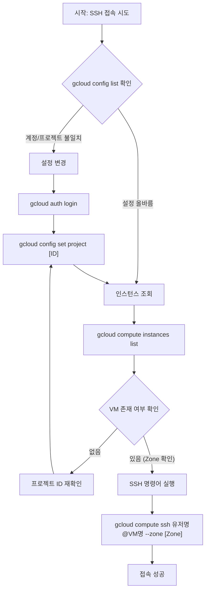

# gcloud SSH 접속 및 트러블슈팅 가이드

본 문서는 Windows 환경에서 Google Cloud SDK(gcloud)를 사용하여 Linux VM 인스턴스에 SSH(Secure Shell)로 접속하는 절차와, 발생했던 연결 오류(PuTTY 관련 에러 포함)의 원인 및 해결 과정을 기술합니다.

## 1. 개요

`gcloud compute ssh` 명령어는 복잡한 SSH 키(Key) 생성 및 관리 과정을 자동화하여 VM 인스턴스(Instance)에 쉽게 접속할 수 있게 해줍니다. 그러나 **인증(Authentication)** 계정과 **프로젝트(Project)** 설정이 올바르지 않을 경우, 대상 서버를 찾지 못하거나 권한 문제로 인해 연결이 거부되는 오류가 발생합니다.

## 2. 사전 점검 및 환경 설정

접속 전, 현재 로컬 환경이 누구의 계정으로 어떤 프로젝트를 바라보고 있는지 확인하는 것이 필수적입니다.

### 2.1. 계정 및 프로젝트 확인

현재 활성화된 설정(Configuration)을 확인합니다.

```powershell
gcloud config list

```

* **account**: 현재 로그인된 구글 계정
* **project**: 명령어가 실행될 대상 프로젝트 ID

### 2.2. 계정 전환 (Re-authentication)

만약 `account`가 접속 권한이 없는 계정으로 되어 있다면, 다시 로그인을 수행합니다.

```powershell
gcloud auth login

```

### 2.3. 프로젝트 변경

계정이 올바르더라도 `project`가 엉뚱한 곳으로 설정되어 있다면 VM을 찾을 수 없습니다. `gcloud projects list`로 ID를 확인한 후 변경합니다.

```powershell
gcloud config set project [PROJECT_ID]

```

## 3. SSH 접속 절차

환경 설정이 완료된 후, 구체적인 접속 정보를 확인하고 실행합니다.

### 3.1. 인스턴스 및 리전 확인

대상 VM이 현재 프로젝트 내에 존재하는지, 그리고 어떤 **리전(Region)** 및 **영역(Zone)**에 있는지 확인합니다.

```powershell
gcloud compute instances list

```

### 3.2. SSH 접속 실행

단순히 `gcloud compute ssh [INSTANCE_NAME]`만 입력할 경우, 로컬 Windows 사용자명(예: `sw1`)으로 접속을 시도하게 됩니다. 서버에 해당 계정이 없다면 접속 후 작업에 제약이 생길 수 있습니다. 따라서 **반드시 접속할 리눅스 사용자명(Username)을 명시**해야 합니다.

```powershell
gcloud compute ssh [USER_NAME]@[INSTANCE_NAME] --zone [ZONE_NAME]

```

* **[USER_NAME]**: 서버 내 생성된 사용자 계정 (예: `spai0433`)
* **[INSTANCE_NAME]**: VM 인스턴스 이름 (예: `codeit04-ai-ubuntu`)
* **[ZONE_NAME]**: 인스턴스가 위치한 영역 (예: `asia-northeast3-a`)

## 4. 문제 해결 분석: PuTTY 에러와 원인

사용자가 경험했던 연결 오류(PuTTY Fatal Error 등)의 근본 원인과 해결 논리는 다음과 같습니다.

### 4.1. 오류 현상

* `gcloud` 재설치를 고려할 정도의 접속 불가 현상.
* SSH 클라이언트(Windows의 경우 내부적으로 PuTTY 사용) 실행 시 연결 실패.

### 4.2. 원인 분석 (Root Cause Analysis)

사용자의 가설인 **"계정과 프로젝트 설정 미비"**가 정확한 원인입니다. 구체적인 메커니즘은 다음과 같습니다.

1. **메타데이터(Metadata) 전파 실패**: `gcloud ssh`는 접속 시도 시 일회성 SSH 키를 생성하여 해당 프로젝트의 VM 메타데이터에 업로드합니다.
2. **프로젝트 불일치**: `project` 설정이 잘못되어 있으면, `gcloud`는 엉뚱한 프로젝트에서 VM을 찾거나 키를 업로드하려 시도합니다.
3. **인증 실패**: VM 입장에서는 클라이언트가 올바른 키를 가지고 있지 않으므로 접속 요청을 거부(Permission Denied)하거나, 네트워크 경로를 찾지 못해 타임아웃(Time out)이 발생합니다. 이것이 클라이언트 단에서는 PuTTY 에러로 나타납니다.

### 4.3. 해결 과정 요약

1. **Account**: `c0z0c.dev`  `spai0433` (권한이 있는 계정으로 변경)
2. **Project**: `codeit04`  `sprint-ai-chunk2-03` (VM이 존재하는 실제 프로젝트로 변경)
3. **User Identity**: `sw1`  `spai0433` (명령어에 계정 명시하여 로컬 유저 불일치 해결)

## 5. 워크플로우 다이어그램

