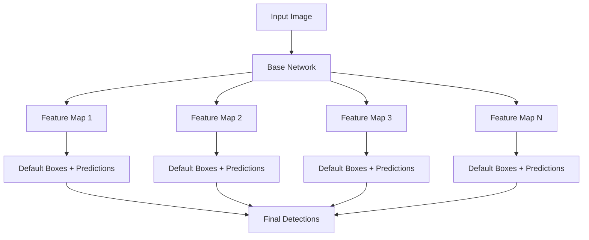
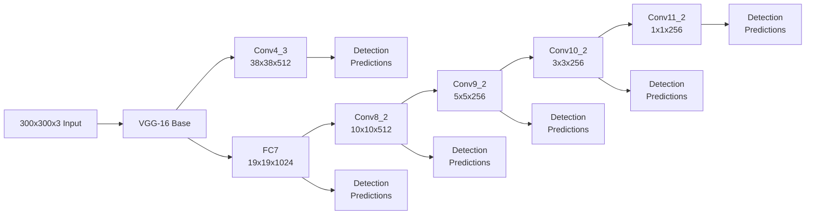
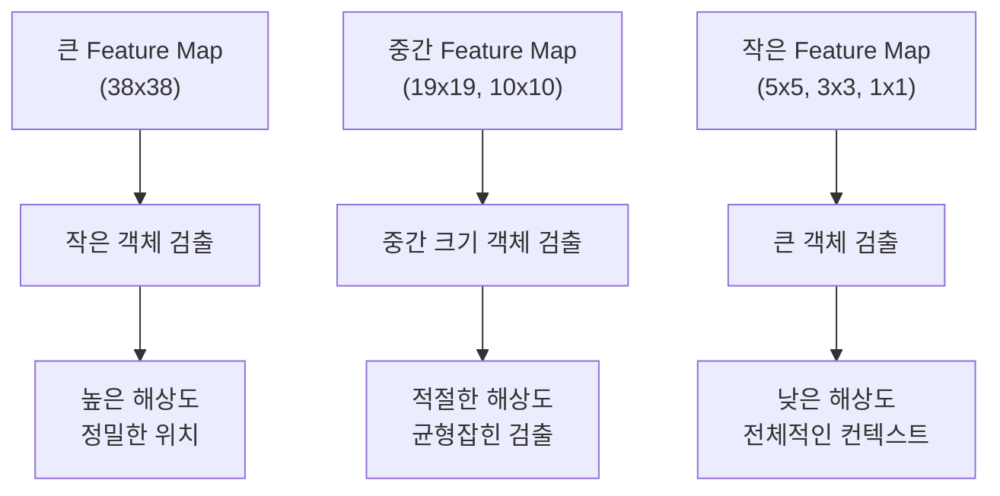
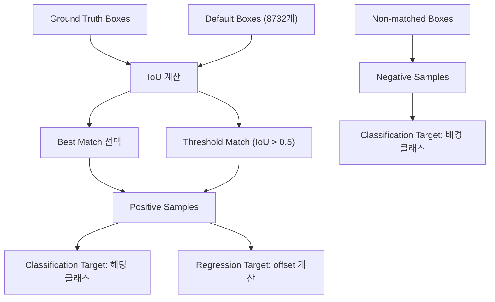

# SSD (Single Shot MultiBox Detector)

## 목차

1. [개요 및 배경](#1-개요-및-배경)<br/>
   1.1. [Object Detection의 발전](#11-object-detection의-발전)<br/>
   1.2. [SSD의 등장 배경](#12-ssd의-등장-배경)<br/>
   1.3. [SSD의 핵심 아이디어](#13-ssd의-핵심-아이디어)<br/>

2. [SSD 아키텍처](#2-ssd-아키텍처)<br/>
   2.1. [전체 구조 개요](#21-전체-구조-개요)<br/>
   2.2. [Base Network](#22-base-network)<br/>
   2.3. [Feature Maps과 Multi-scale](#23-feature-maps과-multi-scale)<br/>
   2.4. [Default Boxes](#24-default-boxes)<br/>

3. [핵심 구성 요소](#3-핵심-구성-요소)<br/>
   3.1. [MultiBox Mechanism](#31-multibox-mechanism)<br/>
   3.2. [Aspect Ratio와 Scale](#32-aspect-ratio와-scale)<br/>
   3.3. [Feature Pyramid](#33-feature-pyramid)<br/>

4. [손실 함수](#4-손실-함수)<br/>
   4.1. [Classification Loss](#41-classification-loss)<br/>
   4.2. [Localization Loss](#42-localization-loss)<br/>
   4.3. [Hard Negative Mining](#43-hard-negative-mining)<br/>

5. [훈련 과정](#5-훈련-과정)<br/>
   5.1. [Data Augmentation](#51-data-augmentation)<br/>
   5.2. [Matching Strategy](#52-matching-strategy)<br/>
   5.3. [최적화](#53-최적화)<br/>

6. [성능 분석](#6-성능-분석)<br/>
   6.1. [정확도 vs 속도](#61-정확도-vs-속도)<br/>
   6.2. [다른 모델과의 비교](#62-다른-모델과의-비교)<br/>
   6.3. [한계점](#63-한계점)

---

## 1. 개요 및 배경

### 1.1. Object Detection의 발전

Object Detection(오브젝트 디텍션)은 컴퓨터 비전에서 가장 중요한 태스크(task) 중 하나로, 이미지 내에서 객체의 위치를 찾고 분류하는 작업입니다. 전통적인 방법들은 크게 두 단계로 나뉘었습니다:

**Two-Stage Detectors(투-스테이지 디텍터):**
- **Region Proposal(리전 프러포절)**: 객체가 있을 만한 영역을 먼저 제안
- **Classification(클래시피케이션)**: 제안된 영역에서 객체 분류 및 정확한 위치 예측

대표적인 예로 R-CNN, Fast R-CNN, Faster R-CNN이 있으며, 이들은 높은 정확도를 보였지만 속도가 느린 단점이 있었습니다.

### 1.2. SSD의 등장 배경

2016년 Wei Liu 등이 발표한 SSD는 기존 Two-Stage 방법의 속도 문제를 해결하기 위해 등장했습니다:

- **실시간 처리**: 모바일이나 embedded(임베디드) 시스템에서의 실시간 object detection 필요성 증가
- **정확도 vs 속도**: YOLO(욜로, You Only Look Once)가 빠른 속도를 보였지만 작은 객체 검출 성능이 부족
- **Multi-scale(멀티-스케일) 문제**: 다양한 크기의 객체를 효과적으로 검출하는 방법의 필요성

### 1.3. SSD의 핵심 아이디어

SSD의 혁신적인 아이디어는 다음과 같습니다:



**핵심 특징:**
1. **Single Shot(싱글 샷)**: 한 번의 forward pass로 detection 완료
2. **Multi-scale Feature Maps(멀티-스케일 피처 맵)**: 다양한 해상도의 feature map에서 예측
3. **Default Boxes(디폴트 박스)**: 미리 정의된 anchor box(앵커 박스) 사용
4. **End-to-End Learning(엔드-투-엔드 러닝)**: 전체 네트워크를 한 번에 학습

---

## 2. SSD 아키텍처

### 2.1. 전체 구조 개요

SSD는 크게 두 부분으로 구성됩니다:

1. **Base Network(베이스 네트워크)**: 특징 추출을 담당하는 backbone(백본) 네트워크 (일반적으로 VGG-16 사용)
2. **Auxiliary Structure(보조 구조)**: 추가적인 convolutional layer들로 multi-scale feature 생성



### 2.2. Base Network

**VGG-16 백본(backbone):**
- ImageNet(이미지넷)에서 pre-trained(사전 훈련)된 VGG-16 사용
- 마지막 fully connected layer들을 convolutional layer로 변환
- Pool5 layer를 제거하여 해상도(resolution) 유지

**변경사항:**
- FC6, FC7을 각각 Conv6, Conv7로 변환
- Atrous convolution(아트러스 컨볼루션, dilated convolution) 사용으로 receptive field(리셉티브 필드) 확장
- 파라미터(parameter) 수: $3 \times 3 \times 512 \times 1024 = 4.7M$ (Conv6)

### 2.3. Feature Maps과 Multi-scale

SSD는 6개의 서로 다른 해상도의 feature map에서 prediction(예측)을 수행합니다:

| Feature Map | 크기 | Receptive Field | 검출 객체 크기 |
|-------------|------|----------------|----------------|
| Conv4_3 | 38×38 | 작음 | 작은 객체 |
| Conv7 (FC7) | 19×19 | 중간 | 중간 객체 |
| Conv8_2 | 10×10 | 큰 | 큰 객체 |
| Conv9_2 | 5×5 | 매우 큰 | 매우 큰 객체 |
| Conv10_2 | 3×3 | 거대 | 거대한 객체 |
| Conv11_2 | 1×1 | 전체 이미지 | 전체 이미지 크기 |

**Scale(스케일) 계산 공식:**
- $s_k = s_{min} + \frac{s_{max} - s_{min}}{m-1}(k-1), \quad k \in [1,m]$

여기서:
- $s_{min} = 0.2$, $s_{max} = 0.9$
- $m = 6$ (feature map 개수)

### 2.4. Default Boxes

각 feature map의 각 위치에서 여러 개의 default box(앵커 박스)를 생성합니다:

**Aspect Ratio(종횡비)**: $a_r \in \{1, 2, 3, \frac{1}{2}, \frac{1}{3}\}$

**Default Box 크기:**
- 폭: $w_k^a = s_k\sqrt{a_r}$
- 높이: $h_k^a = s_k/\sqrt{a_r}$

**추가 박스** (aspect ratio = 1일 때):
- $s'_k = \sqrt{s_k s_{k+1}}$

**총 Default Box 개수:**
- $N_{boxes} = 38^2 \times 4 + 19^2 \times 6 + 10^2 \times 6 + 5^2 \times 6 + 3^2 \times 4 + 1^2 \times 4 = 8732$

---

## 3. 핵심 구성 요소

### 3.1. MultiBox Mechanism

MultiBox(멀티박스)는 각 default box에 대해 다음을 예측합니다:

1. **Classification Scores(클래시피케이션 스코어)**: $c + 1$개 클래스에 대한 confidence(컨피던스)
2. **Bounding Box Offsets(바운딩 박스 오프셋)**: 4개의 offset 값 $(dx, dy, dw, dh)$

**예측 레이어 구성:**
- **Classification**: $3 \times 3 \times (boxes \times classes)$ convolution
- **Localization**: $3 \times 3 \times (boxes \times 4)$ convolution

### 3.2. Aspect Ratio와 Scale

**Aspect Ratio(종횡비) 선택 근거:**
- $a_r = 1$: 정사각형 객체 (사람 얼굴, 공 등)
- $a_r = 2, 3$: 가로로 긴 객체 (자동차, 기차 등)
- $a_r = 1/2, 1/3$: 세로로 긴 객체 (사람, 전봇대 등)

**Multi-scale 검출의 원리:**


### 3.3. Feature Pyramid

**피라미드(pyramid) 구조의 장점:**
1. **계층적 특징**: 낮은 레벨 → 높은 레벨로 갈수록 추상적 특징
2. **다중 해상도**: 각 레벨에서 다른 크기의 객체에 최적화
3. **효율성**: 하나의 네트워크에서 모든 스케일 처리

---

## 4. 손실 함수

SSD의 손실 함수는 classification loss와 localization loss의 가중합(weighted sum)입니다:

- $L(x,c,l,g) = \frac{1}{N}(L_{conf}(x,c) + \alpha L_{loc}(x,l,g))$

여기서:
- $N$: 매칭된 default box의 개수
- $\alpha$: localization loss의 가중치(weight) (일반적으로 1)

### 4.1. Classification Loss

**Softmax Loss(소프트맥스 로스) 사용:**
- $L_{conf}(x,c) = -\sum_{i \in Pos}^N x_{ij}^p \log(\hat{c}_i^p) - \sum_{i \in Neg} \log(\hat{c}_i^0)$

여기서:
- $x_{ij}^p \in \{1,0\}$: $i$번째 default box가 클래스 $p$의 $j$번째 ground truth(그라운드 트루스)와 매칭되는지 여부
- $\hat{c}_i^p = \frac{\exp(c_i^p)}{\sum_p \exp(c_i^p)}$: 클래스 $p$에 대한 예측 confidence

### 4.2. Localization Loss

**Smooth L1 Loss(스무스 L1 로스) 사용:**
- $L_{loc}(x,l,g) = \sum_{i \in Pos}^N \sum_{m \in \{cx,cy,w,h\}} x_{ij}^k \text{smooth}_{L1}(l_i^m - \hat{g}_j^m)$

**Bounding Box Encoding(바운딩 박스 인코딩):**
- $\hat{g}_j^{cx} = \frac{g_j^{cx} - d_i^{cx}}{d_i^w}, \quad \hat{g}_j^{cy} = \frac{g_j^{cy} - d_i^{cy}}{d_i^h}$
- $\hat{g}_j^w = \log\frac{g_j^w}{d_i^w}, \quad \hat{g}_j^h = \log\frac{g_j^h}{d_i^h}$

**Smooth L1 함수:**
- $\text{smooth}_{L1}(x) = \begin{cases}0.5x^2 & \text{if } |x| < 1 \\|x| - 0.5 & \text{otherwise}\end{cases}$

### 4.3. Hard Negative Mining

**문제점**: Positive sample(포지티브 샘플)과 negative sample(네거티브 샘플)의 극심한 불균형 (1:3 비율로 조정)

**해결 방법:**
1. 모든 negative box의 confidence loss 계산
2. Loss가 높은 순으로 정렬
3. 상위 negative sample만 선택하여 학습

**알고리즘(algorithm):**
```
1. positive_boxes = matched boxes
2. negative_candidates = non-matched boxes
3. negative_losses = compute_confidence_loss(negative_candidates)
4. sorted_negatives = sort(negative_candidates, by=negative_losses, descending=True)
5. num_negatives = min(3 * len(positive_boxes), len(sorted_negatives))
6. selected_negatives = sorted_negatives[:num_negatives]
```

---

## 5. 훈련 과정

### 5.1. Data Augmentation

**필수 Augmentation(데이터 오그멘테이션) 기법들:**

1. **Random Crop(랜덤 크롭)**: 전체 이미지에서 무작위 패치(patch) 추출
   - IoU threshold(임계값): 0.1, 0.3, 0.5, 0.7, 0.9
   - 원본 이미지도 포함

2. **Random Horizontal Flip(랜덤 수평 플립)**: 50% 확률로 좌우 반전

3. **Color Distortion(컬러 디스토션)**: 
   - 밝기(brightness): ±32
   - 대비(contrast): 0.5~1.5
   - 채도(saturation): 0.5~1.5
   - 색조(hue): ±18

4. **Random Expansion(랜덤 익스팬션)**: 이미지를 큰 캔버스에 무작위 배치

### 5.2. Matching Strategy

**IoU 기반 매칭(matching):**
1. **Best Match**: 각 ground truth에 가장 높은 IoU를 가진 default box 매칭
2. **Threshold Match**: IoU > 0.5인 모든 default box를 positive로 분류

**매칭 과정:**


### 5.3. 최적화

**하이퍼파라미터(hyperparameter):**
- **Learning Rate(러닝 레이트)**: 초기 $10^{-3}$, 80k에서 $10^{-4}$, 100k에서 $10^{-5}$
- **Momentum(모멘텀)**: 0.9
- **Weight Decay(웨이트 디케이)**: $5 \times 10^{-4}$
- **Batch Size(배치 사이즈)**: 32

**Learning Rate Schedule(러닝 레이트 스케줄):**
- $lr(t) = \begin{cases}10^{-3} & \text{if } t < 80k \\10^{-4} & \text{if } 80k \leq t < 100k \\10^{-5} & \text{if } t \geq 100k\end{cases}$

---

## 6. 성능 분석

### 6.1. 정확도 vs 속도

**PASCAL VOC 2007 결과:**

| 모델 | Input Size | mAP | FPS (Titan X) |
|------|------------|-----|---------------|
| SSD300 | 300×300 | 74.3% | 46 |
| SSD512 | 512×512 | 76.8% | 19 |
| YOLOv1 | 448×448 | 63.4% | 45 |
| Faster R-CNN | ~1000×600 | 73.2% | 7 |

**분석:**
- SSD300: 실시간 처리에 최적화 (46 FPS)
- SSD512: 정확도와 속도의 균형 (76.8% mAP, 19 FPS)
- Two-stage 모델 대비 월등한 속도 향상

### 6.2. 다른 모델과의 비교

**장점:**
1. **빠른 속도**: Single forward pass로 detection 완료
2. **Multi-scale 검출**: 다양한 크기의 객체를 효과적으로 검출
3. **End-to-End 학습**: 전체 pipeline(파이프라인)을 한 번에 최적화
4. **메모리 효율성**: Region proposal 단계 없음

**단점:**
1. **작은 객체 검출**: 여전히 어려움 (해상도 한계)
2. **Localization 정확도**: Two-stage 모델 대비 떨어짐
3. **클래스 불균형**: Hard negative mining 필요

### 6.3. 한계점

**작은 객체 검출의 한계:**
- 38×38 feature map도 매우 작은 객체에는 부족
- 해결책: Feature Pyramid Network(FPN), RetinaNet(레티나넷) 등에서 개선

**Aspect Ratio 제한:**
- 미리 정의된 aspect ratio에만 의존
- 극단적인 비율의 객체 검출에 한계

**클래스 불균형 문제:**
- Background class가 압도적으로 많음
- Hard negative mining으로 부분적 해결

---

## 용어 목록

| 용어 | 영문 | 설명 |
|------|------|------|
| 객체 검출 | Object Detection | 이미지에서 객체의 위치와 클래스를 동시에 예측하는 작업 |
| 앵커 박스 | Anchor Box / Default Box | 미리 정의된 다양한 크기와 비율의 참조 박스 |
| 특징 피라미드 | Feature Pyramid | 다양한 해상도의 특징 맵을 계층적으로 구성한 구조 |
| 교집합 비율 | Intersection over Union (IoU) | 예측 박스와 정답 박스의 겹치는 영역 비율 |
| 하드 네거티브 마이닝 | Hard Negative Mining | 학습이 어려운 negative sample들을 선별하여 학습하는 기법 |
| 멀티박스 | MultiBox | 한 위치에서 여러 개의 bounding box를 예측하는 메커니즘 |
| 종횡비 | Aspect Ratio | 박스의 가로세로 비율 |
| 수용 영역 | Receptive Field | 하나의 특징이 입력 이미지에서 영향받는 영역의 크기 |
| 합성곱 | Convolution | 필터를 이용하여 특징을 추출하는 연산 |
| 백본 네트워크 | Backbone Network | 기본적인 특징 추출을 담당하는 네트워크 |
| 평균 정밀도 | mean Average Precision (mAP) | 객체 검출 모델의 성능을 측정하는 지표 |
| 소프트맥스 | Softmax | 다중 클래스 분류를 위한 확률 분포 함수 |
| 바운딩 박스 | Bounding Box | 객체를 둘러싸는 사각형 영역 |
| 데이터 증강 | Data Augmentation | 훈련 데이터를 인위적으로 늘리는 기법 |
| 그라운드 트루스 | Ground Truth | 정답 레이블 또는 참값 |