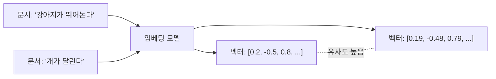
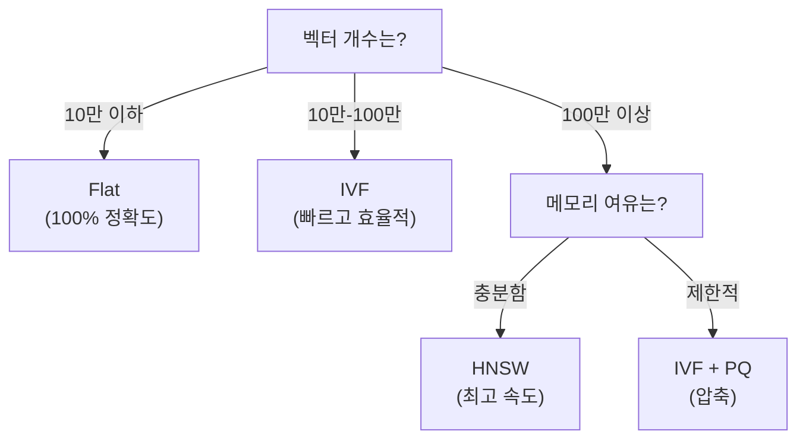
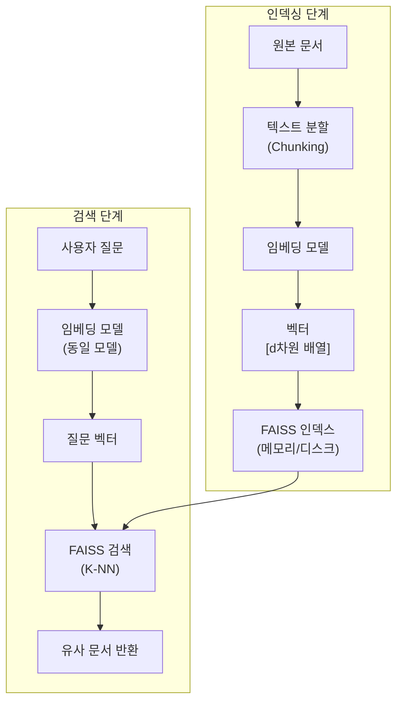
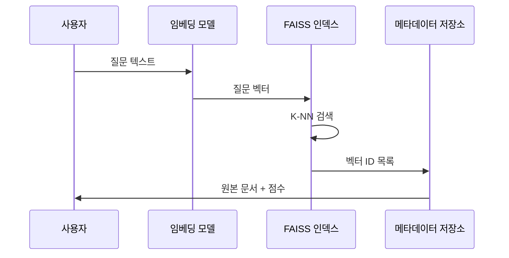

# FAISS 가이드

## 목차

1. [FAISS 개요](#1-faiss-개요)
   - 1.1. [FAISS란?](#11-faiss란)
   - 1.2. [왜 FAISS를 사용하는가?](#12-왜-faiss를-사용하는가)
   - 1.3. [주요 특징](#13-주요-특징)
2. [FAISS의 핵심 개념](#2-faiss의-핵심-개념)
   - 2.1. [벡터 유사도 검색](#21-벡터-유사도-검색)
   - 2.2. [거리 측정 방식](#22-거리-측정-방식)
   - 2.3. [인덱스(Index) 타입](#23-인덱스index-타입)
3. [FAISS 구조와 작동 원리](#3-faiss-구조와-작동-원리)
   - 3.1. [전체 아키텍처](#31-전체-아키텍처)
   - 3.2. [인덱싱 프로세스](#32-인덱싱-프로세스)
   - 3.3. [검색 프로세스](#33-검색-프로세스)
4. [LangChain에서 FAISS 사용하기](#4-langchain에서-faiss-사용하기)
   - 4.1. [기본 설정 (5줄 코드)](#41-기본-설정-5줄-코드)
   - 4.2. [유사도 측정 방식 변경](#42-유사도-측정-방식-변경)
   - 4.3. [메타데이터와 함께 사용하기](#43-메타데이터와-함께-사용하기)
   - 4.4. [인덱스 저장 및 로드](#44-인덱스-저장-및-로드)
5. [실전 활용 패턴](#5-실전-활용-패턴)
   - 5.1. [메타데이터 관리 전략](#51-메타데이터-관리-전략)
   - 5.2. [성능 튜닝 팁](#52-성능-튜닝-팁)
6. [용어 목록 (Glossary)](#6-용어-목록-glossary)

---

## 1. FAISS 개요

### 1.1. FAISS란?

**FAISS**(Facebook AI Similarity Search, 페이스)는 Meta(구 Facebook) AI Research에서 개발한 **고속 벡터 유사도 검색 라이브러리**입니다. 수백만에서 수십억 개의 벡터에서 가장 유사한 벡터를 밀리초 단위로 찾을 수 있는 강력한 도구입니다.

RAG(Retrieval-Augmented Generation) 시스템에서 문서 임베딩을 저장하고 검색하는 벡터 데이터베이스로 널리 사용됩니다.

### 1.2. 왜 FAISS를 사용하는가?

전통적인 데이터베이스는 정확한 키워드 매칭에 최적화되어 있지만, AI 시대에는 **의미적 유사성** 검색이 필요합니다. FAISS는 다음과 같은 문제를 해결합니다:

- **대규모 벡터 검색**: 수백만 개 이상의 임베딩 벡터에서 빠른 검색
- **메모리 효율성**: 압축 알고리즘으로 메모리 사용량 최소화
- **확장성**: CPU와 GPU 모두 지원하여 하드웨어에 유연하게 대응

**사용 사례**:
- 챗봇의 문서 검색 시스템
- 추천 시스템 (유사 상품/콘텐츠 찾기)
- 이미지 검색 엔진
- 중복 탐지 시스템

### 1.3. 주요 특징

| 특징 | 설명 |
|------|------|
| **속도** | 십억 개 벡터에서 밀리초 단위 검색 |
| **메모리 효율** | 양자화(Quantization)로 메모리 사용량 1/8 축소 가능 |
| **유연성** | 다양한 인덱스 타입으로 정확도-속도 트레이드오프 조절 |
| **하드웨어 지원** | CPU/GPU 모두 활용 가능 |
| **오픈소스** | MIT 라이선스, 활발한 커뮤니티 |

---

## 2. FAISS의 핵심 개념

### 2.1. 벡터 유사도 검색

**벡터 임베딩(Vector Embedding)**은 텍스트, 이미지, 오디오 등을 고차원 숫자 배열로 변환한 것입니다. 의미가 유사한 데이터는 벡터 공간에서 가까운 위치에 배치됩니다.



**유사도 검색 과정**:
1. 모든 문서를 벡터로 변환하여 FAISS 인덱스에 저장
2. 사용자 질문을 같은 임베딩 모델로 벡터화
3. FAISS가 질문 벡터와 가장 가까운 문서 벡터들을 반환
4. 해당 문서들을 LLM에게 컨텍스트로 제공

### 2.2. 거리 측정 방식

FAISS는 세 가지 주요 거리 측정 방식을 지원합니다:

| 측정 방식 | 수식 | 특징 | 사용 시기 |
|----------|------|------|----------|
| **L2 (유클리드 거리)** | $d = \sqrt{\sum(x_i - y_i)^2}$ | 기본값, 직관적 | 일반적인 경우 |
| **Inner Product (내적)** | $d = -\sum x_i \cdot y_i$ | 빠름, 정규화 필요 | 코사인 유사도 근사 |
| **Cosine (코사인 유사도)** | $d = 1 - \frac{\sum x_i \cdot y_i}{\|x\| \|y\|}$ | 정규화 자동 | 대부분의 임베딩 모델 |

**선택 가이드**:
- 대부분의 임베딩 모델(OpenAI, Sentence-Transformers 등)은 이미 정규화되어 있어 **Cosine 유사도 권장**
- L2 거리는 벡터의 크기(magnitude)가 의미를 가질 때 사용
- Inner Product는 속도가 중요하고 벡터가 정규화된 경우

### 2.3. 인덱스(Index) 타입

FAISS는 다양한 인덱스 타입을 제공하여 **검색 속도 vs 정확도 vs 메모리** 트레이드오프를 조절할 수 있습니다.

#### 2.3.1. Flat 인덱스

```python
# IndexFlatL2: 완전 탐색 (Brute Force)
index = faiss.IndexFlatL2(dimension)
```

- **특징**: 모든 벡터와 거리를 계산 (완전 탐색)
- **장점**: 100% 정확도 보장
- **단점**: 벡터 수가 많으면 느림 (백만 개 이상에서 비효율적)
- **추천**: 10만 개 이하의 벡터, 또는 높은 정확도가 필수인 경우

#### 2.3.2. IVF 인덱스

```python
# IndexIVFFlat: 역파일 인덱스
quantizer = faiss.IndexFlatL2(dimension)
index = faiss.IndexIVFFlat(quantizer, dimension, nlist)
```

- **특징**: 벡터를 클러스터링하여 일부만 탐색 (ANN: Approximate Nearest Neighbor)
- **장점**: 대규모 데이터에서 빠른 검색 (10-100배 속도 향상)
- **단점**: 약간의 정확도 손실 (95-99%)
- **파라미터**: `nlist` (클러스터 개수), `nprobe` (탐색할 클러스터 수)
- **추천**: 백만 개 이상의 벡터

#### 2.3.3. HNSW 인덱스

```python
# IndexHNSWFlat: Hierarchical Navigable Small World
index = faiss.IndexHNSWFlat(dimension, M)
```

- **특징**: 그래프 기반 탐색, 계층적 구조
- **장점**: 매우 빠르고 높은 정확도 (99%+)
- **단점**: 메모리 사용량 높음, 추가/삭제 비용 큼
- **파라미터**: `M` (연결 개수, 기본 32)
- **추천**: 검색 속도가 최우선이고 메모리 여유가 있는 경우

**인덱스 타입 비교**:



---

## 3. FAISS 구조와 작동 원리

### 3.1. 전체 아키텍처

FAISS는 크게 **인덱싱(Indexing)**과 **검색(Search)** 두 단계로 작동합니다.



### 3.2. 인덱싱 프로세스

인덱스에 벡터를 추가하는 과정:

1. **벡터 준비**: 모든 문서를 임베딩 모델로 변환
2. **인덱스 학습** (IVF/HNSW만 해당): 벡터 분포를 분석하여 클러스터 생성
3. **벡터 추가**: `index.add(vectors)` 메서드로 인덱스에 저장
4. **메타데이터 매핑**: 벡터 ID와 원본 문서 정보를 별도로 관리

**수식 표현** (IVF 인덱스):
- 클러스터 중심 계산: $c_j = \frac{1}{|C_j|} \sum_{x \in C_j} x$
- 벡터 할당: $\text{cluster}(x) = \arg\min_j \|x - c_j\|$

### 3.3. 검색 프로세스

K개의 가장 유사한 벡터를 찾는 과정:

1. **질문 벡터화**: 쿼리 텍스트를 임베딩 모델로 변환
2. **후보 선정** (IVF): `nprobe` 개의 가까운 클러스터 선택
3. **거리 계산**: 후보 벡터들과 질문 벡터 간 거리 계산
4. **정렬 및 반환**: 가장 가까운 K개 벡터와 거리 점수 반환

**검색 복잡도**:
- Flat 인덱스: $O(n \cdot d)$ (n: 벡터 개수, d: 차원)
- IVF 인덱스: $O(\text{nprobe} \cdot \frac{n}{\text{nlist}} \cdot d)$
- HNSW 인덱스: $O(\log n \cdot M \cdot d)$



---

## 4. LangChain에서 FAISS 사용하기

### 4.1. 기본 설정 (5줄 코드)

**최소 구현 예제**:

```python
from langchain_community.vectorstores import FAISS
from langchain_openai import OpenAIEmbeddings

embedding_model = OpenAIEmbeddings(model="text-embedding-3-small")
vectorstore = FAISS.from_documents(documents, embedding_model)
results = vectorstore.similarity_search("질문 텍스트", k=5)
```

**무료 임베딩 모델 사용**:

| 모델 | 제공자 | 비용 | 차원 | 특징 |
|------|--------|------|------|------|
| text-embedding-3-small | OpenAI | 유료 | 1536 | 고성능, API 키 필요 |
| all-MiniLM-L6-v2 | HuggingFace | 무료 | 384 | 빠르고 가벼움, 로컬 실행 |
| multilingual-e5-large | HuggingFace | 무료 | 1024 | 다국어 지원 (한국어 포함) |

```python
# 무료 모델 사용 예시
from langchain_huggingface import HuggingFaceEmbeddings

embedding = HuggingFaceEmbeddings(
    model_name="sentence-transformers/all-MiniLM-L6-v2"
)
vectorstore = FAISS.from_documents(documents, embedding)
```

### 4.2. 유사도 측정 방식 변경

인덱스 생성 시 `distance_strategy` 파라미터로 측정 방식을 변경할 수 있습니다:

```python
vectorstore = FAISS.from_documents(
    documents, 
    embedding_model,
    distance_strategy="COSINE"  # 옵션: EUCLIDEAN_DISTANCE, MAX_INNER_PRODUCT
)
```

**중요**: 한 번 생성된 인덱스의 측정 방식은 변경할 수 없습니다. 다른 방식을 사용하려면 인덱스를 새로 만들어야 합니다.

### 4.3. 메타데이터와 함께 사용하기

#### 4.3.1. 문서 파일명과 청크 정보 저장

FAISS는 벡터뿐만 아니라 **메타데이터**도 함께 저장할 수 있어, 검색 결과에서 원본 문서의 위치를 추적할 수 있습니다.

```python
from langchain.schema import Document

# 메타데이터와 함께 문서 생성
documents = [
    Document(
        page_content="FAISS는 고속 벡터 검색 라이브러리입니다.",
        metadata={
            "source": "faiss_guide.pdf",
            "page": 1,
            "chunk_id": "doc1_p1_c1",
            "start_line": 10,
            "end_line": 15
        }
    ),
    Document(
        page_content="LangChain과 FAISS를 함께 사용할 수 있습니다.",
        metadata={
            "source": "faiss_guide.pdf",
            "page": 2,
            "chunk_id": "doc1_p2_c1",
            "start_line": 45,
            "end_line": 50
        }
    )
]

vectorstore = FAISS.from_documents(documents, embedding_model)
```

#### 4.3.2. 메타데이터 필터링 검색

특정 파일이나 페이지에서만 검색할 수 있습니다:

```python
# 특정 파일에서만 검색
results = vectorstore.similarity_search(
    "FAISS 사용법",
    k=3,
    filter={"source": "faiss_guide.pdf"}
)

# 결과 확인
for doc in results:
    print(f"파일: {doc.metadata['source']}")
    print(f"페이지: {doc.metadata['page']}, 라인: {doc.metadata['start_line']}-{doc.metadata['end_line']}")
    print(f"내용: {doc.page_content}\n")
```

#### 4.3.3. 점수와 함께 검색

유사도 점수를 함께 반환받을 수 있습니다:

```python
results = vectorstore.similarity_search_with_score("질문", k=5)

for doc, score in results:
    print(f"점수: {score:.4f}")
    print(f"출처: {doc.metadata['source']} (페이지 {doc.metadata['page']})")
    print(f"내용: {doc.page_content[:100]}...\n")
```

**메타데이터 설계 Best Practice**:

| 필드 | 타입 | 목적 | 예시 |
|------|------|------|------|
| `source` | str | 원본 파일명 | "report_2024.pdf" |
| `page` | int | 페이지 번호 | 5 |
| `chunk_id` | str | 청크 고유 ID | "doc1_p5_c3" |
| `start_line` | int | 시작 라인 번호 | 120 |
| `end_line` | int | 종료 라인 번호 | 135 |
| `created_at` | str | 문서 생성일 | "2024-11-01" |
| `category` | str | 문서 카테고리 | "기술문서" |

### 4.4. 인덱스 저장 및 로드

한 번 생성한 인덱스를 디스크에 저장하고 나중에 불러올 수 있습니다:

```python
# 인덱스 저장
vectorstore.save_local("faiss_index")

# 인덱스 로드
new_vectorstore = FAISS.load_local(
    "faiss_index", 
    embedding_model,
    allow_dangerous_deserialization=True  # 신뢰할 수 있는 파일만
)
```

⚠️ **보안 주의**: `allow_dangerous_deserialization=True`는 신뢰할 수 있는 인덱스 파일에만 사용하세요.

---

## 5. 실전 활용 패턴

### 5.1. 메타데이터 관리 전략

**시나리오**: 여러 PDF 파일에서 특정 주제만 검색하고 싶을 때

```python
from langchain.text_splitter import RecursiveCharacterTextSplitter

def create_vectorstore_with_metadata(pdf_files):
    documents = []
    
    for pdf_path in pdf_files:
        # PDF 로드
        loader = PyPDFLoader(pdf_path)
        pages = loader.load()
        
        # 청크로 분할
        splitter = RecursiveCharacterTextSplitter(chunk_size=1000, chunk_overlap=200)
        
        for page_num, page in enumerate(pages):
            chunks = splitter.split_text(page.page_content)
            
            for chunk_num, chunk in enumerate(chunks):
                doc = Document(
                    page_content=chunk,
                    metadata={
                        "source": pdf_path,
                        "page": page_num + 1,
                        "chunk_id": f"{pdf_path}_p{page_num+1}_c{chunk_num+1}",
                        "total_pages": len(pages)
                    }
                )
                documents.append(doc)
    
    return FAISS.from_documents(documents, embedding_model)
```

**검색 예시**:
```python
# 특정 문서에서만 검색
results = vectorstore.similarity_search(
    "RAG 시스템 구축 방법",
    k=5,
    filter={"source": "rag_guide.pdf"}
)

# 최근 페이지부터 검색 (page 번호가 큰 것부터)
results = sorted(
    vectorstore.similarity_search("최신 업데이트", k=10),
    key=lambda x: x.metadata.get("page", 0),
    reverse=True
)
```

### 5.2. 성능 튜닝 팁

#### 5.2.1. 검색 파라미터 최적화

| 파라미터 | 설명 | 권장값 | 효과 |
|----------|------|--------|------|
| `k` | 반환할 문서 수 | 3-10 | 많을수록 컨텍스트 풍부, LLM 비용 증가 |
| `fetch_k` | 재랭킹 전 후보 문서 수 | k * 2-5 | MMR 사용 시 다양성 증가 |
| `lambda_mult` | MMR 다양성 가중치 | 0.5-0.7 | 0에 가까울수록 다양성 우선 |

```python
# MMR(Maximal Marginal Relevance) 검색 - 다양성 증가
results = vectorstore.max_marginal_relevance_search(
    "FAISS 인덱스 타입",
    k=5,
    fetch_k=20,
    lambda_mult=0.5  # 유사도 50% + 다양성 50%
)
```

#### 5.2.2. 인덱스 타입 선택 가이드

```python
# 벡터 개수에 따른 인덱스 선택
vector_count = len(documents)

if vector_count < 100_000:
    # Flat 인덱스 - 완전 탐색
    vectorstore = FAISS.from_documents(documents, embedding, distance_strategy="COSINE")
    
elif vector_count < 1_000_000:
    # IVF 인덱스 - 속도와 정확도 균형
    # nlist: sqrt(vector_count) 권장
    pass  # LangChain은 기본적으로 Flat 사용, 커스텀 필요
    
else:
    # HNSW 또는 IVF+PQ - 대규모 데이터
    pass  # 고급 설정은 직접 FAISS API 사용 권장
```

#### 5.2.3. 메모리 최적화

```python
# 인덱스 크기 확인
import os
vectorstore.save_local("temp_index")
index_size = os.path.getsize("temp_index/index.faiss") / 1024 / 1024  # MB
print(f"인덱스 크기: {index_size:.2f} MB")

# 벡터당 메모리 사용량
memory_per_vector = index_size * 1024 * 1024 / len(documents)  # bytes
print(f"벡터당 메모리: {memory_per_vector:.2f} bytes")
```

**메모리 절약 팁**:
- 차원이 낮은 임베딩 모델 사용 (384차원 vs 1536차원)
- 불필요한 메타데이터 최소화
- PQ(Product Quantization) 인덱스 사용 (고급)

#### 5.2.4. 하이브리드 검색 (BM25 + FAISS)

키워드 검색(BM25)과 벡터 검색(FAISS)을 결합하여 정확도를 높일 수 있습니다:

```python
from langchain.retrievers import BM25Retriever, EnsembleRetriever

# BM25 검색기 (키워드 기반)
bm25_retriever = BM25Retriever.from_documents(documents)
bm25_retriever.k = 5

# FAISS 검색기 (의미 기반)
faiss_retriever = vectorstore.as_retriever(search_kwargs={"k": 5})

# 앙상블 검색기 (50:50 가중치)
ensemble_retriever = EnsembleRetriever(
    retrievers=[bm25_retriever, faiss_retriever],
    weights=[0.5, 0.5]
)

results = ensemble_retriever.get_relevant_documents("FAISS 사용법")
```

---

## 6. 용어 목록 (Glossary)

| 용어 | 영문 | 설명 |
|------|------|------|
| **벡터 임베딩** | Vector Embedding | 텍스트, 이미지 등을 고차원 숫자 배열로 변환한 것. 의미적으로 유사한 데이터는 벡터 공간에서 가까이 위치함 |
| **페이스** | FAISS | Facebook AI Similarity Search의 약자. Meta에서 개발한 벡터 유사도 검색 라이브러리 |
| **인덱스** | Index | 벡터들을 효율적으로 저장하고 검색하기 위한 자료구조 |
| **K-NN** | K-Nearest Neighbors | 쿼리 벡터와 가장 가까운 K개의 벡터를 찾는 알고리즘 |
| **ANN** | Approximate Nearest Neighbor | 완전 탐색 대신 근사 알고리즘으로 빠르게 유사 벡터를 찾는 방법 (정확도 약간 희생) |
| **유클리드 거리** | Euclidean Distance (L2) | 두 벡터 간의 직선 거리. $\sqrt{\sum(x_i - y_i)^2}$ |
| **코사인 유사도** | Cosine Similarity | 두 벡터 간의 각도를 기반으로 유사도 측정. 정규화된 벡터에 적합 |
| **내적** | Inner Product | 두 벡터의 곱셈 합. $\sum x_i \cdot y_i$ |
| **플랫 인덱스** | Flat Index | 모든 벡터를 완전 탐색하는 기본 인덱스. 100% 정확도 보장 |
| **IVF 인덱스** | Inverted File Index | 벡터를 클러스터로 나누어 일부만 탐색하는 인덱스. 대규모 데이터에 효율적 |
| **HNSW** | Hierarchical Navigable Small World | 그래프 기반 ANN 알고리즘. 매우 빠르고 높은 정확도 |
| **양자화** | Quantization | 벡터 값을 낮은 비트로 압축하여 메모리 사용량 감소 (예: float32 → uint8) |
| **메타데이터** | Metadata | 벡터와 함께 저장되는 부가 정보 (파일명, 페이지, 날짜 등) |
| **청크** | Chunk | 긴 문서를 임베딩하기 위해 작은 단위로 분할한 텍스트 조각 |
| **RAG** | Retrieval-Augmented Generation | 외부 문서를 검색하여 LLM에게 컨텍스트로 제공하는 방식 |
| **MMR** | Maximal Marginal Relevance | 유사도와 다양성을 동시에 고려하는 검색 알고리즘 |
| **nlist** | - | IVF 인덱스에서 생성할 클러스터의 개수 |
| **nprobe** | - | IVF 인덱스에서 검색 시 탐색할 클러스터의 개수 (정확도 vs 속도 조절) |
| **dimension** | - | 벡터의 차원 수 (예: OpenAI text-embedding-3-small은 1536차원) |

---

## 참고 자료

- [FAISS 공식 GitHub](https://github.com/facebookresearch/faiss)
- [LangChain FAISS 문서](https://python.langchain.com/docs/integrations/vectorstores/faiss)
- [Sentence-Transformers 모델](https://www.sbert.net/docs/pretrained_models.html)
