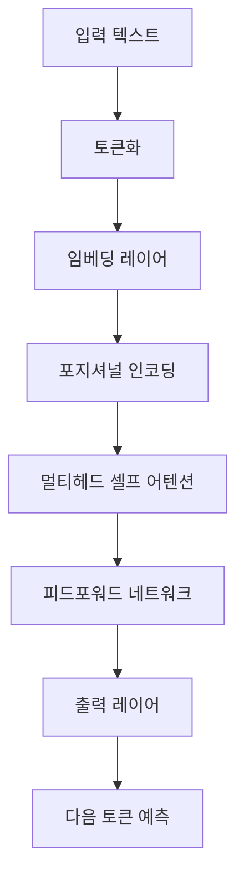
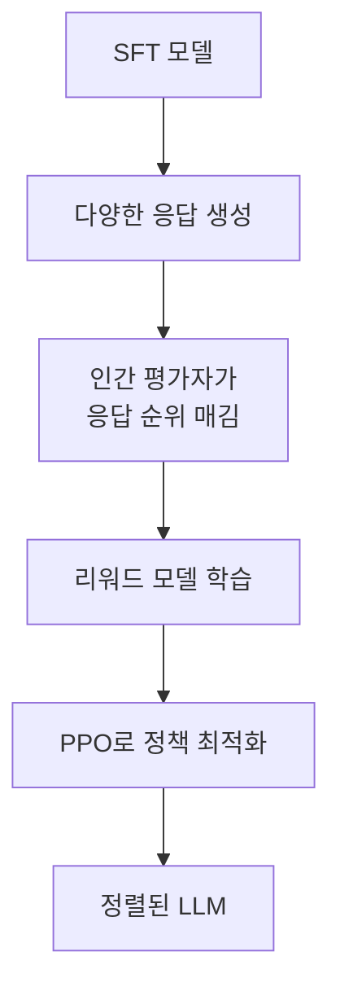
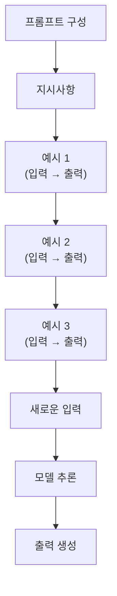
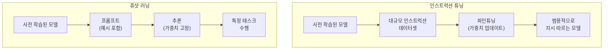

# LLM의 작동 원리: 인스트럭션 튜닝부터 인컨텍스트 러닝까지

## 목차
1. [LLM의 기본 작동 원리](#1-llm의-기본-작동-원리)<br/>
   - 1.1. [트랜스포머 아키텍처](#11-트랜스포머-아키텍처)<br/>
   - 1.2. [토큰화와 임베딩](#12-토큰화와-임베딩)<br/>
   - 1.3. [다음 토큰 예측](#13-다음-토큰-예측)<br/>
2. [인간처럼 대화 나누기: 인스트럭션 튜닝과 RLHF](#2-인간처럼-대화-나누기-인스트럭션-튜닝과-rlhf)<br/>
   - 2.1. [사전 학습의 한계](#21-사전-학습의-한계)<br/>
   - 2.2. [인스트럭션 튜닝](#22-인스트럭션-튜닝)<br/>
   - 2.3. [RLHF](#23-rlhf-reinforcement-learning-from-human-feedback)<br/>
3. [프롬프트 활용하기: 인컨텍스트 러닝](#3-프롬프트-활용하기-인컨텍스트-러닝)<br/>
   - 3.1. [인컨텍스트 러닝이란?](#31-인컨텍스트-러닝이란)<br/>
   - 3.2. [제로샷 러닝](#32-제로샷-러닝)<br/>
   - 3.3. [퓨샷 러닝](#33-퓨샷-러닝)<br/>
   - 3.4. [프롬프트 엔지니어링 기법](#34-프롬프트-엔지니어링-기법)<br/>
4. [인스트럭션 튜닝 vs 퓨샷 러닝: 핵심 차이](#4-인스트럭션-튜닝-vs-퓨샷-러닝-핵심-차이)<br/>
   - 4.1. [학습 패러다임의 차이](#41-학습-패러다임의-차이)<br/>
   - 4.2. [모델 가중치 업데이트 여부](#42-모델-가중치-업데이트-여부)<br/>
   - 4.3. [데이터 요구사항과 비용](#43-데이터-요구사항과-비용)<br/>
   - 4.4. [성능과 일반화 능력 비교](#44-성능과-일반화-능력-비교)<br/>
   - 4.5. [실무 활용 시나리오](#45-실무-활용-시나리오)<br/>
5. [용어 목록](#5-용어-목록)<br/>

---

## 1. LLM의 기본 작동 원리

대규모 언어 모델(Large Language Model, LLM)은 방대한 텍스트 데이터로 학습된 딥러닝 모델입니다. 현대 LLM의 핵심은 트랜스포머 아키텍처(Transformer Architecture)에 기반하며, 주어진 문맥에서 다음에 올 가능성이 높은 단어(토큰)를 예측하는 방식으로 작동합니다.

### 1.1. 트랜스포머 아키텍처

트랜스포머는 2017년 "Attention is All You Need" 논문에서 소개된 아키텍처로, 순환 신경망(Recurrent Neural Network, RNN)의 순차적 처리 한계를 극복했습니다. 트랜스포머의 핵심 구성 요소는 다음과 같습니다.



#### 1.1.1. 셀프 어텐션 메커니즘

셀프 어텐션(Self-Attention) 메커니즘은 입력 시퀀스의 각 토큰이 다른 모든 토큰과의 관계를 학습하도록 합니다. 이를 통해 문맥을 효과적으로 파악할 수 있습니다.

어텐션 메커니즘의 수식은 다음과 같습니다:

$$
\text{Attention}(Q, K, V) = \text{softmax}\left(\frac{QK^T}{\sqrt{d_k}}\right)V
$$

여기서:
- $Q$ (Query, 쿼리): 현재 토큰이 다른 토큰에게 "무엇을 찾고 있는지"를 나타내는 벡터
- $K$ (Key, 키): 각 토큰이 "어떤 정보를 가지고 있는지"를 나타내는 벡터
- $V$ (Value, 밸류): 실제로 전달될 정보를 담고 있는 벡터
- $d_k$: 키 벡터의 차원(dimension)
- $\sqrt{d_k}$: 스케일링 팩터(scaling factor)로, 내적 값이 너무 커지는 것을 방지

**멀티헤드 어텐션(Multi-Head Attention)**은 여러 개의 어텐션 헤드를 병렬로 사용하여 다양한 관점에서 문맥을 이해합니다:

$$
\text{MultiHead}(Q, K, V) = \text{Concat}(\text{head}_1, ..., \text{head}_h)W^O
$$

$$
\text{head}_i = \text{Attention}(QW_i^Q, KW_i^K, VW_i^V)
$$

예를 들어, "은행에 갔다"라는 문장에서 한 헤드는 "은행"과 "돈"의 관계에 집중하고, 다른 헤드는 "갔다"라는 동작에 집중할 수 있습니다.

#### 1.1.2. 포지셔널 인코딩

트랜스포머는 RNN과 달리 순차적으로 처리하지 않기 때문에, 토큰의 위치 정보를 명시적으로 추가해야 합니다. 포지셔널 인코딩(Positional Encoding)은 사인(sine)과 코사인(cosine) 함수를 사용하여 각 위치에 고유한 벡터를 부여합니다:

$$
PE_{(pos, 2i)} = \sin\left(\frac{pos}{10000^{2i/d_{model}}}\right)
$$

$$
PE_{(pos, 2i+1)} = \cos\left(\frac{pos}{10000^{2i/d_{model}}}\right)
$$

여기서:
- $pos$: 토큰의 위치
- $i$: 임베딩 차원의 인덱스
- $d_{model}$: 모델의 임베딩 차원

최근 LLM들은 학습 가능한 포지셔널 임베딩이나 로터리 포지셔널 임베딩(Rotary Positional Embedding, RoPE)과 같은 개선된 기법을 사용합니다.

### 1.2. 토큰화와 임베딩

**토큰화(Tokenization)**는 텍스트를 모델이 처리할 수 있는 작은 단위(토큰)로 분할하는 과정입니다. 현대 LLM은 주로 서브워드(subword) 토큰화 기법을 사용합니다:

- **바이트 페어 인코딩(Byte Pair Encoding, BPE)**: 가장 빈번하게 등장하는 문자 쌍을 반복적으로 병합
- **워드피스(WordPiece)**: BPE와 유사하지만 확률 기반으로 병합
- **센텐스피스(SentencePiece)**: 언어에 독립적인 토큰화 방법

예시:
```
입력: "딥러닝을 공부하고 있다"
토큰화: ["딥", "러닝", "을", "공부", "하고", "있다"]
또는: ["딥러닝", "을", "공부", "하고", "있다"]
```

**임베딩(Embedding)**은 각 토큰을 고차원 벡터 공간의 점으로 변환합니다. 의미가 유사한 단어는 벡터 공간에서 가까운 위치에 배치됩니다. 임베딩 레이어는 학습 가능한 룩업 테이블(lookup table)로, 각 토큰 ID를 $d_{model}$ 차원의 벡터로 매핑합니다.

### 1.3. 다음 토큰 예측

LLM의 학습 목표는 **다음 토큰 예측(Next Token Prediction)**입니다. 주어진 시퀀스 $x_1, x_2, ..., x_{t-1}$에서 다음 토큰 $x_t$를 예측하는 조건부 확률을 최대화합니다:

$$
P(x_t | x_1, x_2, ..., x_{t-1})
$$

전체 시퀀스의 확률은 체인 룰(chain rule)에 의해:

$$
P(x_1, x_2, ..., x_T) = \prod_{t=1}^{T} P(x_t | x_1, ..., x_{t-1})
$$

모델은 **크로스 엔트로피 손실(Cross-Entropy Loss)**을 최소화하도록 학습됩니다:

$$
\mathcal{L} = -\sum_{t=1}^{T} \log P(x_t | x_1, ..., x_{t-1})
$$

**추론(Inference) 과정**에서는 학습된 모델을 사용하여 토큰을 순차적으로 생성합니다. 주요 디코딩 전략은:

1. **그리디 디코딩(Greedy Decoding)**: 매 단계에서 가장 높은 확률의 토큰 선택
2. **빔 서치(Beam Search)**: 상위 $k$개의 후보를 추적하며 탐색
3. **샘플링(Sampling)**: 확률 분포에서 무작위로 샘플링
   - **탑-k 샘플링(Top-k Sampling)**: 상위 $k$개 토큰 중에서만 샘플링
   - **탑-p 샘플링(Top-p/Nucleus Sampling)**: 누적 확률이 $p$를 넘을 때까지의 토큰 중에서 샘플링

**온도(Temperature)** 파라미터 $T$는 확률 분포의 날카로움을 조절합니다:

$$
P_i = \frac{\exp(z_i / T)}{\sum_j \exp(z_j / T)}
$$

- $T < 1$: 높은 확률의 토큰에 집중 (결정론적, deterministic)
- $T > 1$: 다양한 토큰에 기회 부여 (창의적, creative)

---

## 2. 인간처럼 대화 나누기: 인스트럭션 튜닝과 RLHF

### 2.1. 사전 학습의 한계

사전 학습(Pre-training)된 LLM은 방대한 텍스트 데이터로부터 언어의 패턴과 지식을 학습하지만, 몇 가지 한계가 있습니다:

1. **지시사항 따르기 어려움**: "이메일 초안 작성해줘"와 같은 명령을 이해하지 못하고 단순히 텍스트를 이어서 생성
2. **유해한 콘텐츠 생성**: 학습 데이터의 편향이나 유해한 패턴을 그대로 재현
3. **사용자 의도 불일치**: 사용자가 원하는 답변이 아닌 통계적으로 가능성 높은 답변 생성

예시:
```
사용자: "파이썬으로 정렬 알고리즘 코드 작성해줘"
사전학습 모델: "파이썬으로 정렬 알고리즘 코드를 작성하는 방법은 여러 가지가 있습니다. 
먼저 정렬 알고리즘의 종류에는..."
```

이러한 한계를 극복하기 위해 **정렬(Alignment)** 과정이 필요합니다.

### 2.2. 인스트럭션 튜닝

**인스트럭션 튜닝(Instruction Tuning)**은 모델이 인간의 지시사항을 이해하고 따르도록 파인튜닝(fine-tuning)하는 과정입니다.


#### 2.2.1. 수퍼바이즈드 파인튜닝

수퍼바이즈드 파인튜닝(Supervised Fine-Tuning, SFT)은 (지시사항, 응답) 쌍으로 구성된 데이터셋으로 모델을 추가 학습합니다. 손실 함수는 다음 토큰 예측과 동일하지만, 지시사항 부분은 손실 계산에서 제외하고 응답 부분만 사용합니다:

$$
\mathcal{L}_{SFT} = -\sum_{t=1}^{T_{\text{response}}} \log P_\theta(y_t | x, y_{<t})
$$

여기서:
- $x$: 지시사항(instruction)
- $y$: 정답 응답(response)
- $\theta$: 모델 파라미터

#### 2.2.2. 인스트럭션 데이터셋 구성

고품질 인스트럭션 데이터셋은 다양한 태스크와 도메인을 포함해야 합니다:

- **질의응답(Question Answering)**: "대한민국의 수도는?" → "대한민국의 수도는 서울입니다."
- **요약(Summarization)**: "다음 기사를 요약해줘" → [요약문]
- **번역(Translation)**: "Translate to English: 안녕하세요" → "Hello"
- **코드 생성(Code Generation)**: "피보나치 수열 함수 작성해줘" → [코드]
- **창의적 작문(Creative Writing)**: "공상과학 소설 첫 문단 작성해줘" → [소설 텍스트]

대표적인 인스트럭션 데이터셋:
- **FLAN(Finetuned Language Net)**: 1,800개 이상의 태스크를 포함
- **Alpaca**: 52,000개의 인스트럭션-응답 쌍
- **Dolly**: 15,000개의 고품질 인간 생성 데이터
- **OpenAssistant**: 커뮤니티 기반 대화형 데이터

### 2.3. RLHF (Reinforcement Learning from Human Feedback)

인스트럭션 튜닝만으로는 모델을 인간의 선호도와 완벽하게 정렬하기 어렵습니다. **RLHF(Reinforcement Learning from Human Feedback)**는 인간 피드백을 활용한 강화 학습으로 모델을 더욱 정렬합니다.



#### 2.3.1. 리워드 모델 학습

**리워드 모델(Reward Model, RM)**은 주어진 프롬프트와 응답 쌍에 대해 인간이 얼마나 선호할지를 예측하는 모델입니다.

**데이터 수집 과정**:
1. 프롬프트 $x$에 대해 SFT 모델로부터 $k$개의 응답 생성: $y_1, y_2, ..., y_k$
2. 인간 평가자가 응답들의 순위 매김: $y_w \succ y_l$ (선호 $\succ$ 비선호)

**리워드 모델 손실 함수**는 브래들리-테리 모델(Bradley-Terry Model)을 기반으로 합니다:

$$
\mathcal{L}_{RM} = -\mathbb{E}_{(x, y_w, y_l)} \left[ \log \sigma(r_\phi(x, y_w) - r_\phi(x, y_l)) \right]
$$

여기서:
- $r_\phi$: 리워드 모델 (파라미터 $\phi$)
- $y_w$: 선호되는 응답
- $y_l$: 비선호되는 응답
- $\sigma$: 시그모이드 함수

리워드 모델은 선호되는 응답에 높은 점수를, 비선호되는 응답에 낮은 점수를 부여하도록 학습됩니다.

#### 2.3.2. PPO를 통한 최적화

**근위 정책 최적화(Proximal Policy Optimization, PPO)**는 정책 경사(policy gradient) 기반의 강화학습 알고리즘으로, LLM을 안정적으로 최적화합니다.

**목적 함수**:

$$
\mathcal{L}_{PPO} = \mathbb{E}_{(x, y)} \left[ r_\phi(x, y) - \beta \cdot D_{KL}(\pi_\theta || \pi_{\text{ref}}) \right]
$$

여기서:
- $\pi_\theta$: 현재 정책 (학습 중인 LLM)
- $\pi_{\text{ref}}$: 참조 정책 (SFT 모델, 변경되지 않음)
- $D_{KL}$: KL 다이버전스(Kullback-Leibler Divergence)
- $\beta$: KL 패널티 계수

KL 다이버전스 항은 모델이 원래 행동에서 너무 멀리 벗어나지 않도록 **정규화(regularization)** 역할을 합니다. 이는 모델이 과도하게 최적화되어 이상한 출력을 생성하는 것을 방지합니다.

**PPO의 클리핑(clipping) 메커니즘**:

$$
\mathcal{L}_{CLIP} = \mathbb{E} \left[ \min \left( \frac{\pi_\theta(y|x)}{\pi_{\text{old}}(y|x)} A, \text{clip}\left(\frac{\pi_\theta(y|x)}{\pi_{\text{old}}(y|x)}, 1-\epsilon, 1+\epsilon\right) A \right) \right]
$$

여기서:
- $A$: 어드밴티지(advantage) 함수
- $\epsilon$: 클리핑 범위 (일반적으로 0.1 ~ 0.2)

클리핑은 정책 업데이트가 너무 급격하게 변하지 않도록 제한합니다.

#### 2.3.3. RLHF의 효과와 한계

**효과**:
- **안전성 향상**: 유해하거나 편향된 응답 감소
- **유용성 증가**: 사용자 의도에 더 잘 부합하는 응답
- **대화 품질 개선**: 자연스럽고 일관된 대화 생성

**한계**:
- **인간 피드백 비용**: 대량의 인간 평가가 필요하여 비용이 높음
- **리워드 해킹(Reward Hacking)**: 모델이 실제 목표 대신 리워드 모델을 속이는 방법을 학습할 수 있음
- **다양성 감소**: 안전하지만 지나치게 보수적인 응답 생성 가능
- **평가자 편향**: 인간 평가자의 주관적 선호가 반영됨

**최신 대안 기법**:
- **DPO(Direct Preference Optimization)**: 별도의 리워드 모델 없이 선호 데이터로 직접 최적화
- **Constitutional AI**: 모델이 스스로 원칙에 따라 응답을 평가하고 개선

---

## 3. 프롬프트 활용하기: 인컨텍스트 러닝

### 3.1. 인컨텍스트 러닝이란?

**인컨텍스트 러닝(In-Context Learning, ICL)**은 모델의 가중치를 업데이트하지 않고, 프롬프트에 포함된 예시나 지시사항만으로 새로운 태스크를 수행하는 능력입니다. 이는 대규모 LLM에서 나타나는 창발적 능력(emergent ability)으로, 모델 크기가 일정 수준 이상일 때 급격히 향상됩니다.


**핵심 특징**:
- 모델 파라미터는 고정된 상태
- 프롬프트만으로 새로운 태스크 적응
- 추가 학습 없이 즉시 활용 가능

### 3.2. 제로샷 러닝

**제로샷 러닝(Zero-Shot Learning)**은 예시 없이 지시사항만으로 태스크를 수행하는 방식입니다.

**예시**:
```
프롬프트: "다음 문장의 감정을 분류하세요. 긍정 또는 부정으로 답하세요.
문장: 이 영화는 정말 지루하고 시간 낭비였다."

모델 출력: "부정"
```

제로샷 러닝은 매우 자연스러운 지시사항으로도 작동하지만, 모델이 태스크를 정확히 이해하지 못할 수 있습니다.

### 3.3. 퓨샷 러닝

**퓨샷 러닝(Few-Shot Learning)**은 프롬프트에 소수의 예시를 포함하여 모델이 태스크 패턴을 학습하도록 유도합니다.



#### 3.3.1. 원샷 러닝

**원샷 러닝(One-Shot Learning)**은 단 하나의 예시만 제공합니다.

**예시**:
```
프롬프트: "다음 문장을 한국어로 번역하세요.

English: Good morning.
한국어: 좋은 아침입니다.

English: How are you?
한국어:"

모델 출력: "어떻게 지내세요?"
```

#### 3.3.2. 멀티샷 러닝

**멀티샷 러닝(Multi-Shot Learning)**은 여러 개의 예시를 제공하여 더 명확한 패턴을 보여줍니다.

**예시**:
```
프롬프트: "다음은 리뷰와 그에 대한 감정 분류입니다.

리뷰: 음식이 맛있고 서비스도 훌륭했어요.
감정: 긍정

리뷰: 너무 비싸고 양도 적어서 실망했습니다.
감정: 부정

리뷰: 그냥 그랬어요. 특별한 건 없었습니다.
감정: 중립

리뷰: 분위기가 좋고 재방문하고 싶어요.
감정:"

모델 출력: "긍정"
```

**퓨샷 러닝의 성능 향상 요인**:
1. **예시 품질**: 명확하고 대표적인 예시일수록 효과적
2. **예시 개수**: 일반적으로 3~10개가 적절 (너무 많으면 컨텍스트 한계 초과)
3. **예시 순서**: 순서가 결과에 영향을 미칠 수 있음
4. **예시 다양성**: 다양한 케이스를 포함할수록 일반화 능력 향상

### 3.4. 프롬프트 엔지니어링 기법

**프롬프트 엔지니어링(Prompt Engineering)**은 모델로부터 최적의 결과를 얻기 위해 프롬프트를 설계하고 최적화하는 기술입니다.

#### 3.4.1. 체인 오브 쏘트

**체인 오브 쏘트(Chain-of-Thought, CoT)**는 모델이 단계별 추론 과정을 명시적으로 생성하도록 유도하여 복잡한 문제 해결 능력을 향상시킵니다.

**일반 프롬프트**:
```
Q: 로저는 테니스공 5개를 가지고 있습니다. 그는 테니스공 2캔을 더 샀습니다. 
각 캔에는 테니스공이 3개씩 들어있습니다. 이제 로저는 테니스공이 몇 개 있습니까?
A: 11개
```

**CoT 프롬프트**:
```
Q: 로저는 테니스공 5개를 가지고 있습니다. 그는 테니스공 2캔을 더 샀습니다. 
각 캔에는 테니스공이 3개씩 들어있습니다. 이제 로저는 테니스공이 몇 개 있습니까?
A: 로저는 처음에 5개를 가지고 있었습니다. 2캔을 샀고 각 캔에 3개씩 들어있으므로 
2 × 3 = 6개를 더 샀습니다. 따라서 5 + 6 = 11개입니다.
```

**제로샷 CoT**는 "단계별로 생각해봅시다(Let's think step by step)"라는 간단한 프롬프트 추가만으로 추론 능력을 향상시킵니다.

**수학 문제 예시**:
```
Q: 한 농장에서 닭과 토끼를 합쳐서 35마리를 기르고 있습니다. 
다리 수를 세어보니 94개였습니다. 닭은 몇 마리입니까?

A: 단계별로 생각해봅시다.
1. 닭의 다리는 2개, 토끼의 다리는 4개입니다.
2. 닭을 x마리, 토끼를 y마리라고 하면:
   - x + y = 35 (전체 동물 수)
   - 2x + 4y = 94 (전체 다리 수)
3. 첫 번째 식에서 x = 35 - y
4. 이를 두 번째 식에 대입하면: 2(35-y) + 4y = 94
5. 70 - 2y + 4y = 94
6. 2y = 24
7. y = 12 (토끼 12마리)
8. x = 35 - 12 = 23 (닭 23마리)

따라서 닭은 23마리입니다.
```

**CoT의 효과**:
- 수학 문제 정확도 크게 향상
- 논리적 추론 태스크 성능 개선
- 모델의 "사고 과정" 해석 가능

#### 3.4.2. 롤 프롬프팅

**롤 프롬프팅(Role Prompting)**은 모델에게 특정 역할이나 페르소나(persona)를 부여하여 응답 스타일과 전문성을 조정합니다.

**기본 프롬프트**:
```
사용자: 머신러닝이 뭔가요?
모델: 머신러닝은 컴퓨터가 명시적으로 프로그래밍되지 않고도 데이터로부터 학습하는 기술입니다.
```

**롤 프롬프트 적용**:
```
사용자: 당신은 초등학생에게 설명하는 선생님입니다. 머신러닝이 뭔가요?
모델: 머신러닝은 컴퓨터가 스스로 배우는 거예요! 
예를 들어, 강아지 사진을 많이 보여주면 컴퓨터가 "아, 이런 게 강아지구나!" 하고 배우는 거죠. 
그래서 나중에 새로운 사진을 보면 "이건 강아지야!"라고 맞출 수 있어요.
```

**전문가 페르소나**:
```
사용자: 당신은 20년 경력의 데이터 사이언티스트입니다. 
그래디언트 디센트 최적화 전략에 대해 설명해주세요.

모델: 실무에서 그래디언트 디센트를 적용할 때는 여러 고려사항이 있습니다. 
먼저 학습률(learning rate) 스케줄링이 중요합니다. 저는 일반적으로 
코사인 어닐링(cosine annealing)이나 원-사이클 스케줄러(one-cycle scheduler)를 
선호합니다. 또한 배치 크기와 학습률 간의 상관관계를 고려해야 하며, 
아담(Adam) 옵티마이저의 경우 베타 파라미터 튜닝이 수렴 속도에 큰 영향을 미칩니다...
```

**롤 프롬프팅 활용 사례**:
- **교육**: "초보자에게 설명하는 선생님", "전문가에게 설명하는 컨설턴트"
- **창작**: "SF 소설 작가", "시인", "시나리오 작가"
- **분석**: "데이터 분석가", "비즈니스 전략가", "의료 전문가"
- **코딩**: "시니어 백엔드 개발자", "프론트엔드 전문가"

---

## 4. 인스트럭션 튜닝 vs 퓨샷 러닝: 핵심 차이

인스트럭션 튜닝과 퓨샷 러닝은 모두 LLM이 새로운 태스크를 수행하도록 하지만, 근본적으로 다른 접근 방식입니다.

### 4.1. 학습 패러다임의 차이



**인스트럭션 튜닝**:
- **오프라인 학습(Offline Learning)**: 미리 준비된 데이터셋으로 학습
- **범용적(General-purpose)**: 다양한 태스크에 일반적으로 적용 가능한 능력 획득
- **영구적(Permanent)**: 학습된 지식이 모델에 내재화됨

**퓨샷 러닝**:
- **온라인 적응(Online Adaptation)**: 추론 시점에 프롬프트로 적응
- **태스크 특화(Task-specific)**: 각 프롬프트에 특화된 태스크 수행
- **임시적(Temporary)**: 프롬프트가 바뀌면 행동도 바뀜

### 4.2. 모델 가중치 업데이트 여부

**인스트럭션 튜닝**:
- 역전파(backpropagation)를 통해 모델 파라미터 $\theta$ 업데이트
- 그래디언트 디센트(gradient descent) 사용
- GPU/TPU 등 연산 자원 필요
- 학습 완료 후 새로운 체크포인트(checkpoint) 저장

**퓨샷 러닝**:
- 모델 파라미터는 고정 ($\theta$ 불변)
- 순전파(forward pass)만 수행
- 추론 자원만 필요 (학습 대비 적은 자원)
- 원본 모델 그대로 사용

수식으로 표현하면:

**인스트럭션 튜닝**:
$$
\theta_{t+1} = \theta_t - \alpha \nabla_\theta \mathcal{L}(\theta_t)
$$

**퓨샷 러닝**:
$$
y = f_\theta(x, \text{examples}), \quad \theta = \text{const}
$$

### 4.3. 데이터 요구사항과 비용

| 측면 | 인스트럭션 튜닝 | 퓨샷 러닝 |
|------|----------------|-----------|
| **데이터 규모** | 수천~수백만 개 예시 | 0~10개 예시 |
| **데이터 품질** | 고품질, 다양성 필수 | 대표적인 예시 선택 중요 |
| **준비 시간** | 몇 주~몇 달 | 몇 분~몇 시간 |
| **연산 비용** | 매우 높음 (GPU 클러스터) | 낮음 (추론만 필요) |
| **재사용성** | 한 번 학습하면 계속 사용 | 매번 프롬프트 설계 필요 |

**비용 예시**:
- **인스트럭션 튜닝**: GPT-3 규모 모델 파인튜닝 시 수만~수십만 달러
- **퓨샷 러닝**: API 호출 비용만 (프롬프트당 몇 센트~몇 달러)

### 4.4. 성능과 일반화 능력 비교

**인스트럭션 튜닝의 강점**:
- **일관된 고성능**: 학습된 태스크에서 안정적인 성능
- **긴 컨텍스트 불필요**: 예시 없이도 태스크 수행
- **복잡한 태스크**: 여러 단계의 추론이 필요한 태스크에 유리
- **안전성**: RLHF와 결합하여 유해 출력 방지

**퓨샷 러닝의 강점**:
- **빠른 적응**: 새로운 태스크에 즉시 대응
- **도메인 특화**: 매우 특정한 도메인 지식이 필요한 태스크
- **데이터 부족 상황**: 파인튜닝용 데이터가 충분하지 않을 때
- **동적 태스크**: 자주 변하는 태스크에 유연하게 대응

**성능 비교 실험 결과** (일반적 경향):
- **단순 분류 태스크**: 인스트럭션 튜닝 > 퓨샷 러닝
- **복잡한 생성 태스크**: 인스트럭션 튜닝 ≥ 퓨샷 러닝
- **새로운 도메인**: 퓨샷 러닝 > 인스트럭션 튜닝 (도메인 데이터 부족 시)
- **긴 응답 생성**: 인스트럭션 튜닝 > 퓨샷 러닝 (컨텍스트 길이 제약)

### 4.5. 실무 활용 시나리오

**인스트럭션 튜닝을 선택해야 할 때**:
1. **범용 AI 어시스턴트 구축**: ChatGPT, Claude처럼 다양한 요청 처리
2. **고빈도 태스크**: 동일한 유형의 태스크를 반복적으로 수행
3. **일관성이 중요한 경우**: 브랜드 톤앤매너, 안전 정책 준수
4. **데이터가 충분한 경우**: 수천 개 이상의 고품질 학습 데이터 확보
5. **장기 프로젝트**: 초기 투자 후 지속적 사용

**실무 예시**:
- 고객 서비스 챗봇 (일관된 응답 품질)
- 기업용 문서 작성 도구 (회사 스타일 가이드 준수)
- 코드 자동 완성 (특정 프레임워크, 코딩 스타일 학습)

**퓨샷 러닝을 선택해야 할 때**:
1. **빠른 프로토타이핑**: 아이디어 검증, MVP 개발
2. **저빈도 태스크**: 가끔 발생하는 특수한 요구사항
3. **데이터 부족**: 파인튜닝용 데이터 수집이 어려운 경우
4. **다양한 태스크 실험**: 여러 유즈케이스 탐색 단계
5. **개인 프로젝트**: 제한된 예산과 자원

**실무 예시**:
- 특정 산업 용어 번역 (예: 의료, 법률)
- 새로운 형식의 보고서 생성
- 임시 데이터 분석 스크립트 작성
- 개인화된 학습 자료 생성

**하이브리드 접근**:
실무에서는 두 방법을 결합하는 경우가 많습니다:
1. 인스트럭션 튜닝된 기본 모델 사용
2. 특정 태스크에 퓨샷 러닝으로 추가 적응
3. 예: GPT-4 + 도메인 특화 예시 프롬프트

---

## 5. 용어 목록

| 용어 | 설명 |
|------|------|
| Alignment (정렬) | 모델의 행동을 인간의 의도와 가치에 맞추는 과정 |
| Attention Mechanism (어텐션 메커니즘) | 입력 시퀀스의 서로 다른 부분에 가중치를 부여하는 메커니즘 |
| Backpropagation (역전파) | 신경망의 가중치를 업데이트하기 위해 오차를 역방향으로 전파하는 알고리즘 |
| Beam Search (빔 서치) | 각 단계에서 상위 k개의 후보를 유지하며 시퀀스를 생성하는 디코딩 방법 |
| Bradley-Terry Model (브래들리-테리 모델) | 쌍대 비교 데이터를 모델링하는 확률 모델 |
| Byte Pair Encoding (바이트 페어 인코딩) | 빈번하게 등장하는 문자 쌍을 병합하여 서브워드를 생성하는 토큰화 기법 |
| Chain Rule (체인 룰) | 합성 함수의 미분을 계산하는 규칙 |
| Chain-of-Thought (체인 오브 쏘트) | 단계별 추론 과정을 명시적으로 생성하여 문제 해결 능력을 향상시키는 프롬프트 기법 |
| Constitutional AI (헌법적 AI) | 모델이 스스로 정의된 원칙에 따라 응답을 평가하고 개선하는 기법 |
| Cross-Entropy Loss (크로스 엔트로피 손실) | 예측 확률 분포와 실제 분포 간의 차이를 측정하는 손실 함수 |
| Decoding (디코딩) | 모델이 생성한 확률 분포로부터 실제 토큰 시퀀스를 생성하는 과정 |
| Deterministic (결정론적) | 동일한 입력에 대해 항상 같은 출력을 생성하는 특성 |
| Direct Preference Optimization (직접 선호 최적화) | 별도의 리워드 모델 없이 선호 데이터로 직접 LLM을 최적화하는 기법 |
| Embedding (임베딩) | 이산적인 토큰을 연속적인 벡터 공간으로 매핑하는 과정 |
| Emergent Ability (창발적 능력) | 모델 규모가 특정 임계값을 넘으면 급격히 나타나는 능력 |
| Few-Shot Learning (퓨샷 러닝) | 소수의 예시로부터 새로운 태스크를 학습하는 방법 |
| Fine-Tuning (파인튜닝) | 사전 학습된 모델을 특정 태스크에 맞게 추가 학습하는 과정 |
| Forward Pass (순전파) | 입력 데이터가 신경망을 통과하여 출력을 생성하는 과정 |
| Gradient Descent (그래디언트 디센트) | 손실 함수의 기울기를 따라 파라미터를 업데이트하는 최적화 알고리즘 |
| Greedy Decoding (그리디 디코딩) | 매 단계에서 가장 높은 확률의 토큰을 선택하는 디코딩 방법 |
| In-Context Learning (인컨텍스트 러닝) | 모델 가중치를 변경하지 않고 프롬프트 내 예시로부터 태스크를 학습하는 능력 |
| Instruction Tuning (인스트럭션 튜닝) | 모델이 자연어 지시사항을 따르도록 파인튜닝하는 과정 |
| KL Divergence (KL 다이버전스) | 두 확률 분포 간의 차이를 측정하는 척도 |
| Large Language Model (대규모 언어 모델) | 방대한 텍스트 데이터로 학습된 대규모 신경망 기반 언어 모델 |
| Lookup Table (룩업 테이블) | 키를 값으로 매핑하는 자료구조 |
| Multi-Head Attention (멀티헤드 어텐션) | 여러 개의 어텐션 헤드를 병렬로 사용하여 다양한 표현을 학습하는 기법 |
| Next Token Prediction (다음 토큰 예측) | 주어진 시퀀스에서 다음에 올 토큰을 예측하는 태스크 |
| One-Shot Learning (원샷 러닝) | 단 하나의 예시로부터 태스크를 학습하는 방법 |
| Persona (페르소나) | 모델에 부여되는 특정 역할이나 성격 |
| Policy Gradient (정책 경사) | 강화학습에서 정책을 직접 최적화하는 방법 |
| Positional Encoding (포지셔널 인코딩) | 시퀀스 내 토큰의 위치 정보를 인코딩하는 기법 |
| Pre-training (사전 학습) | 대규모 데이터셋으로 모델의 일반적인 언어 이해 능력을 학습하는 과정 |
| Prompt Engineering (프롬프트 엔지니어링) | 최적의 결과를 얻기 위해 프롬프트를 설계하고 최적화하는 기술 |
| Proximal Policy Optimization (근위 정책 최적화) | 안정적인 정책 업데이트를 위한 강화학습 알고리즘 |
| Query (쿼리) | 어텐션 메커니즘에서 현재 토큰이 찾고자 하는 정보를 나타내는 벡터 |
| Key (키) | 어텐션 메커니즘에서 각 토큰이 가진 정보를 나타내는 벡터 |
| Value (밸류) | 어텐션 메커니즘에서 실제로 전달될 정보를 담고 있는 벡터 |
| Recurrent Neural Network (순환 신경망) | 순차적으로 데이터를 처리하며 이전 상태를 기억하는 신경망 |
| Regularization (정규화) | 과적합을 방지하기 위해 모델의 복잡도에 제약을 가하는 기법 |
| Reinforcement Learning (강화학습) | 에이전트가 환경과 상호작용하며 보상을 최대화하도록 학습하는 방법 |
| Reward Hacking (리워드 해킹) | 모델이 의도된 목표가 아닌 리워드 함수의 허점을 이용하는 현象 |
| Reward Model (리워드 모델) | 주어진 입력-출력 쌍에 대해 인간 선호도를 예측하는 모델 |
| RLHF (인간 피드백 기반 강화학습) | 인간의 선호도 피드백을 활용하여 모델을 강화학습으로 최적화하는 방법 |
| Role Prompting (롤 프롬프팅) | 모델에게 특정 역할을 부여하여 응답 스타일을 조정하는 프롬프트 기법 |
| Rotary Positional Embedding (로터리 포지셔널 임베딩) | 회전 행렬을 사용하여 상대적 위치 정보를 인코딩하는 개선된 기법 |
| Sampling (샘플링) | 확률 분포에서 무작위로 토큰을 선택하는 디코딩 방법 |
| Scaling Factor (스케일링 팩터) | 어텐션 점수를 정규화하기 위한 상수 |
| Self-Attention (셀프 어텐션) | 입력 시퀀스 내 토큰들 간의 관계를 학습하는 메커니즘 |
| SentencePiece (센텐스피스) | 언어에 독립적인 서브워드 토큰화 라이브러리 |
| Subword (서브워드) | 단어보다 작은 의미 단위로, 토큰화의 기본 단위 |
| Supervised Fine-Tuning (수퍼바이즈드 파인튜닝) | 레이블된 데이터로 모델을 지도 학습 방식으로 파인튜닝하는 과정 |
| Temperature (온도) | 확률 분포의 날카로움을 조절하는 파라미터 |
| Token (토큰) | 텍스트를 모델이 처리할 수 있는 기본 단위로 분할한 것 |
| Tokenization (토큰화) | 텍스트를 토큰으로 분할하는 과정 |
| Top-k Sampling (탑-k 샘플링) | 상위 k개의 토큰 중에서 샘플링하는 디코딩 방법 |
| Top-p Sampling (탑-p 샘플링) | 누적 확률이 p를 넘을 때까지의 토큰 중에서 샘플링하는 디코딩 방법 |
| Transformer (트랜스포머) | 어텐션 메커니즘을 기반으로 한 신경망 아키텍처 |
| WordPiece (워드피스) | 확률 기반 서브워드 토큰화 기법 |
| Zero-Shot Learning (제로샷 러닝) | 예시 없이 지시사항만으로 태스크를 수행하는 방법 |

