# LLM 한계 극복 방법: 포괄적 가이드

> AI 엔지니어를 위한 대규모 언어 모델의 한계와 극복 전략

---

## 목차

1. [서론](#1-서론)<br/>
   - 1.1. [LLM의 정의와 발전](#11-LLM의-정의와-발전)<br/>
   - 1.2. [현대 AI 시스템에서 LLM의 위치](#12-현대-ai-시스템에서-LLM의-위치)<br/>
   - 1.3. [문서의 목적과 범위](#13-문서의-목적과-범위)<br/>

2. [LLM의 근본적 한계](#2-LLM의-근본적-한계)<br/>
   - 2.1. [아키텍처 레벨의 제약사항](#21-아키텍처-레벨의-제약사항)<br/>
   - 2.2. [학습 데이터의 한계](#22-학습-데이터의-한계)<br/>
   - 2.3. [추론 능력의 한계](#23-추론-능력의-한계)<br/>

3. [파인 튜닝을 통한 특화](#3-파인-튜닝을-통한-특화)<br/>
   - 3.1. [파인 튜닝의 개념과 원리](#31-파인-튜닝의-개념과-원리)<br/>
   - 3.2. [파인 튜닝 기법의 분류](#32-파인-튜닝-기법의-분류)<br/>
   - 3.3. [도메인별 파인 튜닝 전략](#33-도메인별-파인-튜닝-전략)<br/>
   - 3.4. [파인 튜닝의 한계와 주의사항](#34-파인-튜닝의-한계와-주의사항)<br/>

4. [RAG: Retrieval-Augmented Generation](#4-RAG-retrieval-augmented-generation)<br/>
   - 4.1. [RAG의 개념과 동기](#41-RAG의-개념과-동기)<br/>
   - 4.2. [RAG 시스템의 구성 요소](#42-RAG-시스템의-구성-요소)<br/>
   - 4.3. [RAG 최적화 기법](#43-RAG-최적화-기법)<br/>
   - 4.4. [고급 RAG 패턴](#44-고급-RAG-패턴)<br/>
   - 4.5. [RAG vs 파인 튜닝](#45-RAG-vs-파인-튜닝)<br/>

5. [생각하는 LLM: 추론 모델](#5-생각하는-LLM-추론-모델)<br/>
   - 5.1. [추론 모델의 등장 배경](#51-추론-모델의-등장-배경)<br/>
   - 5.2. [추론 강화 기법](#52-추론-강화-기법)<br/>
   - 5.3. [테스트 타임 컴퓨테이션](#53-테스트-타임-컴퓨테이션)<br/>
   - 5.4. [최신 추론 모델 사례](#54-최신-추론-모델-사례)<br/>

6. [소형 LLM](#6-소형-LLM)<br/>
   - 6.1. [소형 LLM의 필요성](#61-소형-LLM의-필요성)<br/>
   - 6.2. [모델 압축 기법](#62-모델-압축-기법)<br/>
   - 6.3. [효율적인 아키텍처 설계](#63-효율적인-아키텍처-설계)<br/>
   - 6.4. [대표적인 소형 LLM](#64-대표적인-소형-LLM)<br/>
   - 6.5. [소형 LLM의 한계와 보완 전략](#65-소형-LLM의-한계와-보완-전략)<br/>

7. [LLM과 멀티모달 모델의 차이](#7-LLM과-멀티모달-모델의-차이)<br/>
   - 7.1. [멀티모달리티의 개념](#71-멀티모달리티의-개념)<br/>
   - 7.2. [멀티모달 아키텍처](#72-멀티모달-아키텍처)<br/>
   - 7.3. [대표적인 멀티모달 모델](#73-대표적인-멀티모달-모델)<br/>
   - 7.4. [멀티모달 모델의 응용 분야](#74-멀티모달-모델의-응용-분야)<br/>
   - 7.5. [멀티모달 모델의 특수한 도전과제](#75-멀티모달-모델의-특수한-도전과제)<br/>

8. [LLM 윤리적 위험과 대응](#8-LLM-윤리적-위험과-대응)<br/>
   - 8.1. [주요 윤리적 이슈](#81-주요-윤리적-이슈)<br/>
   - 8.2. [안전성 확보 기법](#82-안전성-확보-기법)<br/>
   - 8.3. [디텍션과 워터마킹](#83-디텍션과-워터마킹)<br/>
   - 8.4. [거버넌스와 규제](#84-거버넌스와-규제)<br/>
   - 8.5. [개발자와 연구자의 윤리적 책임](#85-개발자와-연구자의-윤리적-책임)<br/>

9. [통합적 접근: 하이브리드 시스템](#9-통합적-접근-하이브리드-시스템)<br/>
   - 9.1. [여러 기법의 조합](#91-여러-기법의-조합)<br/>
   - 9.2. [실전 시스템 디자인 패턴](#92-실전-시스템-디자인-패턴)<br/>

10. [결론 및 향후 전망](#10-결론-및-향후-전망)<br/>
    - 10.1. [LLM 기술의 진화 방향](#101-LLM-기술의-진화-방향)<br/>
    - 10.2. [연구자/개발자를 위한 권고사항](#102-연구자개발자를-위한-권고사항)<br/>
    - 10.3. [미래의 도전과제](#103-미래의-도전과제)<br/>

11. [용어 목록](#11-용어-목록)<br/>

---

## 1. 서론

### 1.1. LLM의 정의와 발전

대규모 언어 모델(Large Language Model, LLM)은 수십억에서 수조 개의 파라미터(parameter)를 가진 심층 신경망으로, 방대한 텍스트 데이터로부터 언어의 패턴과 구조를 학습한 인공지능 시스템이다. 트랜스포머(Transformer) 아키텍처의 등장(Vaswani et al., 2017)은 LLM 발전의 결정적 전환점이었으며, 이후 GPT, BERT, T5 등의 모델들이 자연어 처리(Natural Language Processing, NLP) 분야의 패러다임을 완전히 변화시켰다.

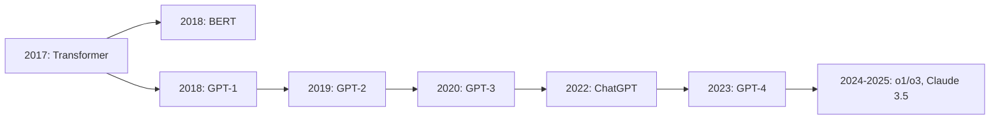

LLM의 발전은 단순한 모델 크기의 확장을 넘어서, **스케일링 법칙(scaling law)**에 따라 성능이 예측 가능하게 향상되는 현상을 보여주었다. 이는 다음과 같은 경험적 관계로 표현된다:

$$
L(N) = \left(\frac{N_c}{N}\right)^{\alpha}
$$

여기서 $L$은 손실(loss), $N$은 모델 파라미터 수, $N_c$는 임계 파라미터 수, $\alpha$는 스케일링 지수이다.

### 1.2. 현대 AI 시스템에서 LLM의 위치

LLM은 현대 AI 생태계의 중심축으로 자리잡았다. 제너러티브 AI(generative AI)의 핵심 컴포넌트로서, LLM은 다음과 같은 역할을 수행한다:

**핵심 역할:**
- **파운데이션 모델(Foundation Model)**: 다양한 다운스트림(downstream) 태스크의 기반
- **제로샷/퓨샷 러닝(Zero-shot/Few-shot Learning)**: 최소한의 예시로 새로운 태스크 수행
- **인컨텍스트 러닝(In-context Learning)**: 명시적 학습 없이 프롬프트만으로 적응
- **에이전트 시스템의 뇌**: 툴 사용, 플래닝(planning), 리즈닝(reasoning) 능력

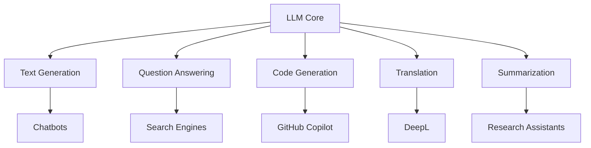

### 1.3. 문서의 목적과 범위

본 문서는 LLM의 한계를 체계적으로 분석하고, 이를 극복하기 위한 최신 기법들을 종합적으로 다룬다. AI 엔지니어와 연구자들이 실제 프로덕션(production) 환경에서 LLM을 효과적으로 활용할 수 있도록, 이론적 배경과 실용적 구현 방법을 균형있게 제시한다.

**주요 다룰 내용:**
- LLM의 아키텍처적 한계와 그 원인
- 파인 튜닝과 RAG를 통한 성능 향상 전략
- 추론 능력 강화를 위한 최신 기법
- 리소스 제약 환경에서의 소형 LLM 활용
- 멀티모달 확장과 윤리적 고려사항

---

## 2. LLM의 근본적 한계

### 2.1. 아키텍처 레벨의 제약사항

#### 2.1.1. 컨텍스트 윈도우의 제한

트랜스포머 아키텍처의 셀프 어텐션(self-attention) 메커니즘은 시퀀스 길이 $n$에 대해 $O(n^2)$의 계산 복잡도를 가진다. 이는 입력 길이가 증가할수록 메모리와 연산량이 기하급수적으로 증가함을 의미한다.

$$
\text{Attention}(Q, K, V) = \text{softmax}\left(\frac{QK^T}{\sqrt{d_k}}\right)V
$$

여기서 $Q, K, V$는 각각 쿼리(query), 키(key), 밸류(value) 행렬이며, $d_k$는 키 벡터의 차원이다.

**주요 문제점:**
- **긴 문서 처리의 어려움**: 법률 문서, 학술 논문, 소설 등 장문 처리 시 정보 손실
- **메모리 병목(bottleneck)**: GPU 메모리 한계로 인한 배치 사이즈(batch size) 감소
- **위치 임베딩(positional embedding)의 한계**: 학습된 길이를 초과하는 시퀀스에서 성능 저하

**해결 접근법:**
- **롱포머(Longformer), 빅버드(BigBird)**: 스파스 어텐션(sparse attention)으로 $O(n)$ 복잡도 달성
- **로터리 포지셔널 임베딩(RoPE)**: 길이 외삽(extrapolation) 능력 향상
- **플래시 어텐션(Flash Attention)**: 메모리 효율적인 어텐션 구현

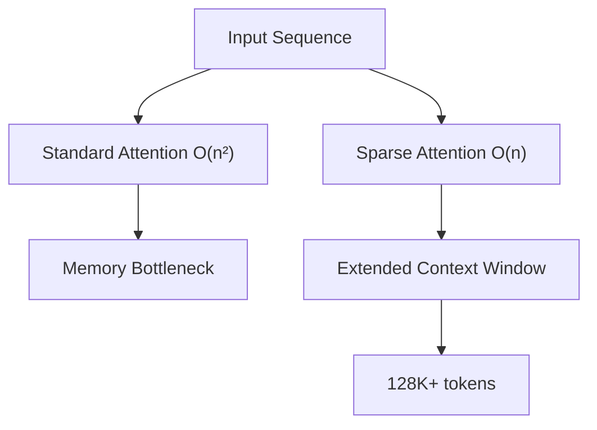

#### 2.1.2. 할루시네이션 문제

할루시네이션(hallucination)은 LLM이 사실과 다르거나 일관성 없는 정보를 그럴듯하게 생성하는 현상이다. 이는 LLM의 본질적인 특성에서 기인한다.

**발생 원인:**
- **확률적 생성(stochastic generation)**: 다음 토큰 예측의 확률 분포에서 샘플링
- **학습 데이터의 노이즈**: 인터넷 텍스트의 오류와 모순
- **지식의 파라메트릭 저장**: 명시적 사실 검증 메커니즘 부재
- **오버컨피던스(overconfidence)**: 불확실한 정보에 대해서도 확신에 찬 응답

생성 확률은 다음과 같이 모델링된다:

$$
P(y|x) = \prod_{t=1}^{T} P(y_t | y_{<t}, x)
$$

여기서 $x$는 입력, $y$는 출력 시퀀스, $t$는 타임스텝(timestep)이다.

**완화 전략:**
- **리트리벌 기반 검증(retrieval-based verification)**: RAG 시스템 활용
- **언서틴티 퀀티피케이션(uncertainty quantification)**: 모델의 확신도 측정
- **팩트 체킹(fact-checking) 레이어**: 외부 지식베이스와 대조
- **컨시스턴시 체크(consistency check)**: 여러 번 생성하여 일관성 검증

#### 2.1.3. 지식 컷오프 이슈

LLM의 지식은 프리트레이닝(pre-training) 시점의 데이터로 제한된다. 이는 다음과 같은 문제를 야기한다:

- **시간 민감 정보(time-sensitive information) 부재**: 최신 뉴스, 주가, 날씨 등
- **동적 지식의 부정확성**: 인물의 직책, 회사 상황 등 변화하는 정보
- **새로운 개념/용어 미인식**: 최근 등장한 기술, 밈(meme), 사건

### 2.2. 학습 데이터의 한계

#### 2.2.1. 바이어스와 공정성 문제

LLM은 학습 데이터에 내재된 사회적, 문화적 바이어스(bias)를 학습하고 재생산한다. 이는 공정성(fairness)과 형평성(equity) 측면에서 심각한 우려를 제기한다.

**바이어스의 종류:**
- **젠더 바이어스(gender bias)**: 직업-성별 연관성 (간호사→여성, 엔지니어→남성)
- **인종 바이어스(racial bias)**: 특정 인종에 대한 부정적 스테레오타입
- **지리적 바이어스(geographical bias)**: 서구 중심적 관점과 지식
- **언어 바이어스(linguistic bias)**: 영어 우선주의, 저자원 언어 소외

측정 방법으로는 다음과 같은 메트릭(metric)이 사용된다:

$$
\text{Bias Score} = \frac{1}{N}\sum_{i=1}^{N} |P(y_i|x_i, g_1) - P(y_i|x_i, g_2)|
$$

여기서 $g_1, g_2$는 비교 대상 그룹(예: 남성/여성), $x_i$는 입력, $y_i$는 출력이다.

#### 2.2.2. 데이터 품질과 노이즈

인터넷에서 수집된 대규모 텍스트 데이터는 다양한 품질 문제를 내포한다:

- **스팸과 저품질 콘텐츠**: SEO 최적화된 무의미한 텍스트
- **오타와 문법 오류**: 비공식적 커뮤니케이션의 불완전성
- **모순되는 정보**: 상충되는 주장과 의견
- **독성 콘텐츠(toxic content)**: 혐오 발언, 폭력적 표현

**데이터 큐레이션(curation) 전략:**
- 품질 필터링: 휴리스틱(heuristic) 기반 규칙
- 디듀플리케이션(deduplication): 중복 제거
- 도메인 밸런싱(domain balancing): 다양한 출처의 균형

#### 2.2.3. 롱테일 지식의 부족

LLM은 빈도가 높은 일반적 지식에는 강하지만, 롱테일(long-tail) 영역의 전문 지식에는 취약하다.

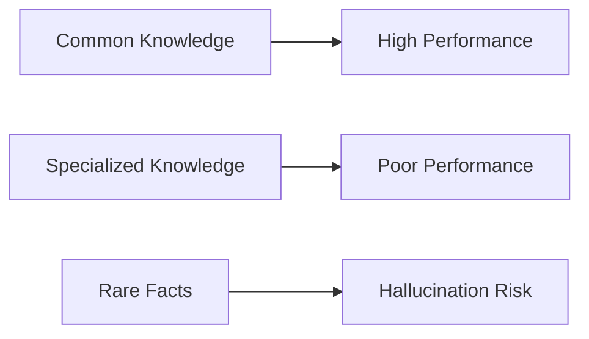

**롱테일 영역의 예:**
- 희귀 질병의 증상과 치료법
- 소수 언어의 문법 구조
- 틈새 시장(niche) 제품의 상세 사양
- 지역 특화 문화와 관습

### 2.3. 추론 능력의 한계

#### 2.3.1. 수학적 추론의 취약성

LLM은 패턴 매칭(pattern matching)에 기반하므로, 정확한 산술 연산과 수학적 추론에 어려움을 겪는다.

**문제 사례:**
```
질문: 123 × 456 = ?
LLM 답변: 56,088 (정답: 56,088) ✓

질문: 1234567 × 8901234 = ?
LLM 답변: 10,987,654,321 (정답: 10,991,393,524,078) ✗
```

**원인 분석:**
- 심볼릭 조작(symbolic manipulation) 능력 부재
- 캐리(carry) 연산 등 절차적 계산의 부정확성
- 학습 데이터의 분포 편향 (작은 숫자가 압도적으로 많음)

#### 2.3.2. 멀티스텝 논리 전개의 어려움

복잡한 추론은 여러 단계의 논리적 전개를 요구하는데, LLM은 단계가 깊어질수록 오류가 누적된다.

**추론 체인의 오류 전파:**

$$
P(\text{correct final answer}) = \prod_{i=1}^{n} P(\text{correct step}_i)
$$

$n$개의 스텝이 필요하고 각 스텝의 정확도가 0.9라면, 최종 정확도는 $0.9^n$으로 급격히 감소한다.

#### 2.3.3. 시간적 추론과 인과관계 파악

LLM은 시간의 흐름과 인과관계(causality)를 이해하는 데 제한적이다.

**문제 예시:**
- "A가 B를 초래했다"와 "B가 A 이후 발생했다"의 차이 인식 부족
- 타임라인 재구성의 어려움
- 반사실적 추론(counterfactual reasoning): "만약 A가 아니었다면?"

---

## 3. 파인 튜닝을 통한 특화

### 3.1. 파인 튜닝의 개념과 원리

#### 3.1.1. 트랜스퍼 러닝의 관점

파인 튜닝(fine-tuning)은 트랜스퍼 러닝(transfer learning)의 핵심 패러다임으로, 대규모 데이터로 프리트레인된 모델을 특정 태스크나 도메인에 적응시키는 과정이다.

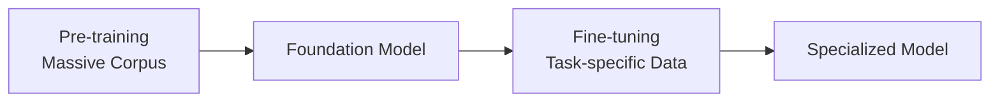

프리트레이닝 단계에서는 다음과 같은 목적 함수를 최적화한다:

$$
\mathcal{L}_{\text{pre}} = -\mathbb{E}_{x \sim \mathcal{D}_{\text{pre}}} \left[\sum_{t} \log P_\theta(x_t | x_{<t})\right]
$$

파인 튜닝 단계에서는 특화된 데이터셋 $\mathcal{D}_{\text{fine}}$에 대해:

$$
\mathcal{L}_{\text{fine}} = -\mathbb{E}_{(x,y) \sim \mathcal{D}_{\text{fine}}} \left[\log P_\theta(y | x)\right]
$$

#### 3.1.2. 파인 튜닝 vs 프리트레이닝

| 측면 | 프리트레이닝 | 파인 튜닝 |
|------|------------|-----------|
| 데이터 규모 | 수백 TB ~ 수십 PB | 수 MB ~ 수 GB |
| 학습 기간 | 수주 ~ 수개월 | 수시간 ~ 수일 |
| 컴퓨팅 비용 | $수백만 ~ 수천만 | $수백 ~ 수만 |
| 목적 | 범용 언어 이해 | 특정 태스크 최적화 |
| 러닝 레이트 | $10^{-4} \sim 10^{-3}$ | $10^{-6} \sim 10^{-5}$ |

### 3.2. 파인 튜닝 기법의 분류

#### 3.2.1. 풀 파인 튜닝

모든 모델 파라미터를 업데이트하는 전통적 접근법이다.

**장점:**
- 최대 성능 달성 가능
- 도메인 특화 지식의 깊은 통합

**단점:**
- 높은 메모리 요구량: 그래디언트(gradient), 옵티마이저(optimizer) 상태 저장 필요
- 캐태스트로픽 포게팅(catastrophic forgetting) 위험
- 각 태스크마다 별도 모델 저장 필요

옵티마이저 상태를 포함한 총 메모리 요구량:

$$
\text{Memory} = N_{\text{params}} \times (4 + 4 + 8) \text{ bytes} = 16 \times N_{\text{params}}
$$

여기서 4바이트는 파라미터, 4바이트는 그래디언트, 8바이트는 옵티마이저 상태(Adam의 경우 1차, 2차 모멘트)이다.

#### 3.2.2. LoRA: Low-Rank Adaptation

LoRA는 모델의 가중치 행렬을 동결(freeze)하고, 로우랭크(low-rank) 분해된 어댑터를 추가하여 학습하는 기법이다.

가중치 업데이트를 다음과 같이 표현한다:

$$
W' = W_0 + \Delta W = W_0 + BA
$$

여기서:
- $W_0 \in \mathbb{R}^{d \times k}$: 동결된 프리트레인 가중치
- $B \in \mathbb{R}^{d \times r}$, $A \in \mathbb{R}^{r \times k}$: 학습 가능한 로우랭크 행렬
- $r \ll \min(d, k)$: 랭크 (일반적으로 4~64)

**파라미터 효율성:**

$$
\text{Trainable Ratio} = \frac{2 \times d \times k \times r}{d \times k} = \frac{2r}{k} + \frac{2r}{d}
$$

$r=8$, $d=k=4096$인 경우, 약 0.39%의 파라미터만 학습한다.

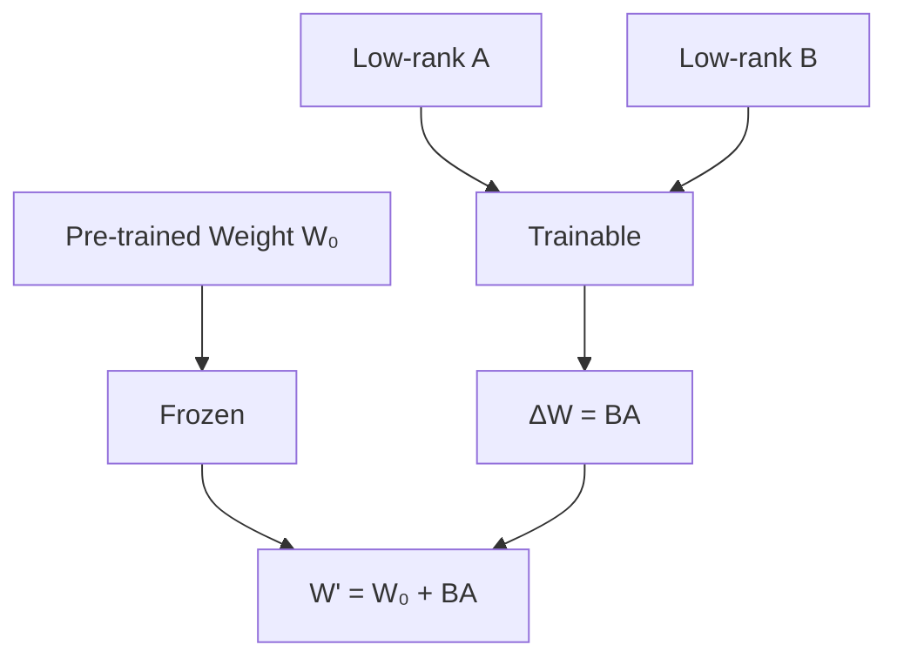

**LoRA의 장점:**
- 메모리 효율성: 전체 파인 튜닝 대비 1/10 ~ 1/100
- 빠른 태스크 전환: 어댑터 가중치만 교체
- 모듈성(modularity): 여러 LoRA를 합성 가능

#### 3.2.3. 프리픽스 튜닝

입력 시퀀스 앞에 학습 가능한 연속적 프리픽스(prefix) 벡터를 추가하는 방법이다.

$$
\text{Input} = [\underbrace{p_1, p_2, \ldots, p_m}_{\text{learnable prefix}}, x_1, x_2, \ldots, x_n]
$$

프리픽스 벡터 $\{p_i\}_{i=1}^m$만 학습하고, 모델 파라미터는 동결한다.

**특징:**
- 파라미터 효율성 극대화 (0.01% ~ 0.1%)
- 추론 시 약간의 레이턴시(latency) 증가
- 연속적 프롬프트(continuous prompt)로 해석 가능

#### 3.2.4. 어댑터 기반 방법론

트랜스포머의 각 레이어에 경량 어댑터 모듈을 삽입하는 방식이다.

**어댑터 아키텍처:**
1. 다운프로젝션(down-projection): $d \rightarrow r$
2. 비선형 활성화(activation): ReLU 또는 GELU
3. 업프로젝션(up-projection): $r \rightarrow d$
4. 잔차 연결(residual connection)

$$
h' = h + f_{\text{adapter}}(h) = h + W_{\text{up}} \cdot \text{ReLU}(W_{\text{down}} \cdot h)
$$

### 3.3. 도메인별 파인 튜닝 전략

#### 3.3.1. 의료, 법률, 금융 도메인

전문 도메인에서는 높은 정확도와 도메인 특화 지식이 필수적이다.

**의료 도메인 파인 튜닝:**
- 데이터: 임상 노트, 의학 문헌, 진료 가이드라인
- 과제: 증상-질병 매핑, 약물 상호작용 예측, 의료 코딩
- 주의사항: HIPAA 컴플라이언스(compliance), 환자 프라이버시

**법률 도메인:**
- 데이터: 판례, 법령, 계약서, 법률 의견서
- 과제: 계약서 분석, 선례 검색, 법률 요약
- 특성: 정확한 용어 사용, 논리적 추론 중요

**금융 도메인:**
- 데이터: 재무제표, 시장 리포트, 규제 문서
- 과제: 감정 분석, 리스크 평가, 규제 준수 체크
- 요구사항: 실시간성, 수치적 정확도

#### 3.3.2. 인스트럭션 튜닝

인스트럭션 튜닝(instruction tuning)은 LLM이 자연어 지시사항을 더 잘 따르도록 학습시키는 기법이다.

**데이터셋 구조:**
```json
{
  "instruction": "다음 텍스트를 요약하세요.",
  "input": "긴 문서 내용...",
  "output": "요약된 내용..."
}
```

**주요 데이터셋:**
- FLAN: 1,800개 이상의 태스크
- Super-NaturalInstructions: 1,600개 태스크, 76개 언어
- Alpaca: 52K 인스트럭션-응답 쌍

**효과:**
- 제로샷 태스크 수행 능력 대폭 향상
- 프롬프트에 대한 강건성(robustness) 증가
- 멀티태스킹(multi-tasking) 능력 개선

#### 3.3.3. RLHF: Reinforcement Learning from Human Feedback

RLHF는 인간의 선호도 피드백을 활용하여 모델을 정렬(alignment)하는 기법이다.

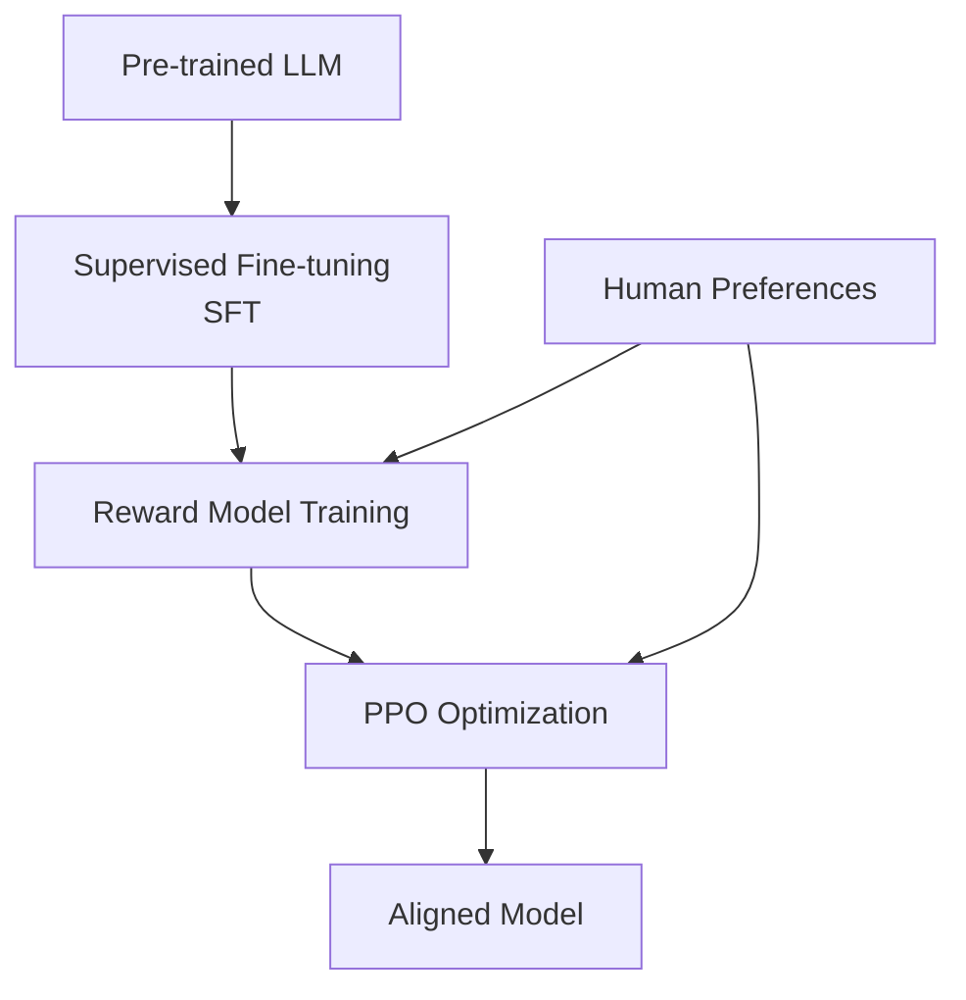

**3단계 프로세스:**

1. **수퍼바이즈드 파인 튜닝(SFT)**: 고품질 데모 데이터로 초기 정렬
2. **리워드 모델(reward model) 학습**: 인간 선호도 예측 모델 구축
   
$$
\mathcal{L}_{\text{RM}} = -\mathbb{E}_{(x, y_w, y_l)} [\log \sigma(r_\theta(x, y_w) - r_\theta(x, y_l))]
$$

   여기서 $y_w$는 선호되는 응답, $y_l$은 비선호 응답, $r_\theta$는 리워드 모델이다.

3. **PPO(Proximal Policy Optimization)**: 리워드 최대화 강화학습

$$
\mathcal{L}_{\text{PPO}} = \mathbb{E}_t \left[ \min(r_t(\theta)\hat{A}_t, \text{clip}(r_t(\theta), 1-\epsilon, 1+\epsilon)\hat{A}_t) \right]
$$

여기서 $r_t(\theta) = \frac{\pi_\theta(a_t|s_t)}{\pi_{\theta_{\text{old}}}(a_t|s_t)}$는 확률 비율, $\hat{A}_t$는 어드밴티지(advantage) 추정치이다.

**RLHF의 효과:**
- 유해하거나 편향된 출력 감소
- 사용자 의도에 더 부합하는 응답
- 사실성(factuality) 향상

### 3.4. 파인 튜닝의 한계와 주의사항

#### 3.4.1. 캐태스트로픽 포게팅

파인 튜닝 과정에서 프리트레인 단계에서 학습한 지식을 잊어버리는 현상이다.

**발생 메커니즘:**
- 새로운 데이터 분포로 파라미터가 크게 이동
- 희귀 지식의 표현(representation)이 덮어씌워짐
- 태스크 간 간섭(interference)

**완화 전략:**
- **정규화(regularization)**: L2 정규화, 엘라스틱 웨이트 컨솔리데이션(EWC)
  
$$
\mathcal{L}_{\text{total}} = \mathcal{L}_{\text{fine}} + \lambda \sum_i F_i (\theta_i - \theta_i^*)^2
$$

  여기서 $F_i$는 피셔 정보 행렬(Fisher information matrix), $\theta^*$는 프리트레인 파라미터이다.

- **리플레이(replay)**: 프리트레인 데이터의 일부를 섞어서 학습
- **어댑터 기반 방법**: 원본 파라미터 보존

#### 3.4.2. 오버피팅 위험

작은 도메인 특화 데이터셋에서는 오버피팅이 쉽게 발생한다.

**지표:**
- 학습 손실과 검증 손실의 큰 격차
- 도메인 내 데이터에는 높은 성능, 도메인 외 데이터에는 급격한 성능 저하

**방지 기법:**
- 조기 종료(early stopping)
- 드롭아웃(dropout), 레이어 드롭(layer drop)
- 데이터 증강(data augmentation): 역번역(back-translation), 패러프레이징(paraphrasing)
- 충분한 검증 데이터 확보

#### 3.4.3. 컴퓨테이셔널 코스트

대규모 모델의 파인 튜닝은 여전히 상당한 컴퓨팅 자원을 요구한다.

**비용 추정 (70B 모델 기준):**
- 풀 파인 튜닝: 8x A100 GPU, 2-3일, ~$5,000
- LoRA (r=16): 4x A100 GPU, 12-24시간, ~$800
- 프리픽스 튜닝: 1x A100 GPU, 4-8시간, ~$150

**최적화 전략:**
- 그래디언트 체크포인팅(gradient checkpointing): 메모리 vs 속도 트레이드오프
- 믹스드 프리시전(mixed precision) 학습: FP16/BF16
- 그래디언트 어큐뮬레이션(gradient accumulation): 작은 배치를 누적

---

## 4. RAG: Retrieval-Augmented Generation

### 4.1. RAG의 개념과 동기

#### 4.1.1. 파라메트릭 vs 논파라메트릭 지식

LLM은 두 가지 형태로 지식을 저장한다:

**파라메트릭 지식(Parametric Knowledge):**
- 모델의 가중치에 암묵적으로 인코딩
- 빠른 접근, 추가 연산 불필요
- 업데이트가 어려움 (재학습 필요)
- 용량 제한적, 환각 위험

**논파라메트릭 지식(Non-parametric Knowledge):**
- 외부 데이터베이스에 명시적으로 저장
- 쉬운 업데이트, 실시간 정보 반영
- 검색 오버헤드 존재
- 무한 확장 가능, 출처 추적 가능

RAG는 두 접근을 결합하여 장점을 극대화한다.

#### 4.1.2. RAG 아키텍처 개요

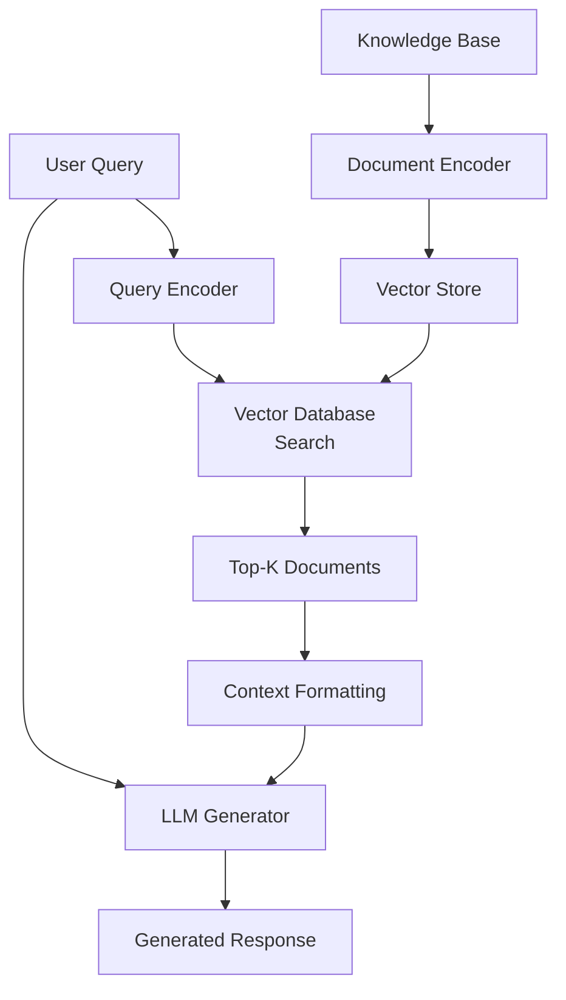

**RAG 프로세스:**

1. **인덱싱(Indexing)**: 문서를 청크로 분할하고 임베딩 벡터로 변환
2. **리트리벌(Retrieval)**: 쿼리와 유사한 상위 K개 청크 검색
3. **어그먼테이션(Augmentation)**: 검색된 컨텍스트를 쿼리와 결합
4. **제너레이션(Generation)**: LLM이 컨텍스트 기반으로 답변 생성

수식으로 표현하면:

$$
P(y|x) = P_{\text{LLM}}(y | x, \text{Retrieved}(x))
$$

여기서 $\text{Retrieved}(x) = \text{TopK}(\text{Similarity}(\text{Enc}(x), \text{Enc}(D)))$이다.

### 4.2. RAG 시스템의 구성 요소

#### 4.2.1. 리트리버: 검색 메커니즘

**희소 리트리버(Sparse Retriever):**
- **BM25**: TF-IDF 기반, 키워드 매칭에 강함

$$
\text{BM25}(D, Q) = \sum_{i=1}^{n} \text{IDF}(q_i) \cdot \frac{f(q_i, D) \cdot (k_1 + 1)}{f(q_i, D) + k_1 \cdot (1 - b + b \cdot \frac{|D|}{\text{avgdl}})}
$$

**밀집 리트리버(Dense Retriever):**
- **임베딩 기반**: 의미적 유사도 측정
- **코사인 유사도(cosine similarity)**:

$$
\text{sim}(q, d) = \frac{q \cdot d}{\|q\| \|d\|} = \frac{\sum_i q_i d_i}{\sqrt{\sum_i q_i^2} \sqrt{\sum_i d_i^2}}
$$

**하이브리드 접근:**
- 희소와 밀집 점수를 결합: $\text{score} = \alpha \cdot \text{BM25} + (1-\alpha) \cdot \text{Dense}$

#### 4.2.2. 임베딩 모델과 벡터 데이터베이스

**임베딩 모델:**
- **Sentence-BERT (SBERT)**: 시암 네트워크(Siamese network) 구조
- **Contriever, E5, BGE**: 대규모 대조 학습(contrastive learning)
- **OpenAI text-embedding-3**: 3072차원, 다국어 지원

**벡터 데이터베이스:**
- **Faiss**: 페이스북, 고속 근사 최근접 이웃(ANN) 검색
- **Pinecone, Weaviate, Qdrant**: 클라우드 기반 관리형 서비스
- **Chroma, Milvus**: 오픈소스, 온프레미스(on-premise) 배포

**인덱싱 알고리즘:**
- **HNSW (Hierarchical Navigable Small World)**: 그래프 기반, 고속 검색
- **IVF (Inverted File Index)**: 클러스터링 기반 분할
- **PQ (Product Quantization)**: 메모리 효율적 압축

#### 4.2.3. 리랭커와 필터링

초기 검색 결과를 재정렬하여 정밀도를 높인다.

**크로스 인코더(Cross-encoder) 리랭커:**
- 쿼리와 문서를 함께 인코딩하여 관련성 점수 산출
- 바이 인코더(bi-encoder)보다 정확하지만 느림

$$
\text{score}_{\text{rerank}}(q, d) = \text{CrossEncoder}([q; d])
$$

**필터링 기법:**
- **메타데이터 필터링**: 날짜, 출처, 카테고리 등
- **MMR (Maximal Marginal Relevance)**: 다양성 확보

$$
\text{MMR} = \arg\max_{d_i \in D \setminus S} \left[\lambda \cdot \text{Sim}(q, d_i) - (1-\lambda) \cdot \max_{d_j \in S} \text{Sim}(d_i, d_j)\right]
$$

#### 4.2.4. 제너레이터: 생성 단계

**프롬프트 구조:**
```
Context: {retrieved_documents}

Question: {user_query}

Answer:
```

**제너레이션 전략:**
- **Extractive**: 문서에서 직접 발췌
- **Abstractive**: 문서를 이해하고 재구성
- **Hybrid**: 발췌와 요약의 결합

### 4.3. RAG 최적화 기법

#### 4.3.1. 청킹 전략

문서를 어떻게 분할하는가는 RAG 성능에 결정적이다.

**고정 길이 청킹:**
- 간단하고 빠름
- 문맥이 끊길 위험

**의미 기반 청킹:**
- 문단, 섹션 경계 존중
- 더 나은 문맥 보존

**슬라이딩 윈도우(sliding window):**
- 중첩(overlap)을 통해 경계 정보 손실 방지
- 청크 수 증가

**최적 청크 크기:**
- 너무 작으면: 문맥 부족, 검색 정밀도 저하
- 너무 크면: 관련 없는 정보 혼입, 토큰 낭비
- 일반적 권장: 256~512 토큰

#### 4.3.2. 하이브리드 서치

희소와 밀집 검색의 장점을 결합한다.

**앙상블 전략:**
- **선형 결합(linear combination)**:

$$
\text{score}_{\text{hybrid}} = \alpha \cdot \text{normalize}(\text{BM25}) + (1-\alpha) \cdot \text{normalize}(\text{Dense})
$$

- **Reciprocal Rank Fusion (RRF)**:

$$
\text{RRF}(d) = \sum_{r \in R} \frac{1}{k + r(d)}
$$

여기서 $R$은 랭킹 리스트들, $r(d)$는 문서 $d$의 순위, $k$는 상수(일반적으로 60)이다.

#### 4.3.3. 쿼리 리라이팅

사용자 쿼리를 더 검색에 적합하게 변환한다.

**기법:**
- **쿼리 확장(query expansion)**: 동의어, 관련 용어 추가
- **HyDE (Hypothetical Document Embeddings)**: 가상의 이상적 답변 생성 후 그것으로 검색
- **멀티 쿼리(multi-query)**: 하나의 쿼리를 여러 변형으로 확장

**HyDE 프로세스:**
```
Query: "파인 튜닝과 프롬프트 엔지니어링의 차이는?"

→ LLM이 가상의 답변 생성:
"파인 튜닝은 모델 가중치를 업데이트하는 반면, 프롬프트 엔지니어링은..."

→ 이 가상 답변의 임베딩으로 검색
→ 실제 유사한 문서 발견
```

#### 4.3.4. 컨텍스트 컴프레션

검색된 문서가 너무 길거나 잡음이 많을 때 압축한다.

**기법:**
- **Extractive Compression**: 관련 문장만 추출
- **Abstractive Compression**: LLM으로 요약
- **Reranking + Top Sentences**: 리랭커 점수 기반 문장 선택

**장점:**
- 토큰 사용량 감소 → 비용 절감
- 신호 대 잡음비(signal-to-noise ratio) 향상
- 레이턴시 감소

### 4.4. 고급 RAG 패턴

#### 4.4.1. 멀티 홉 RAG

복잡한 질문은 여러 단계의 정보 검색이 필요하다.

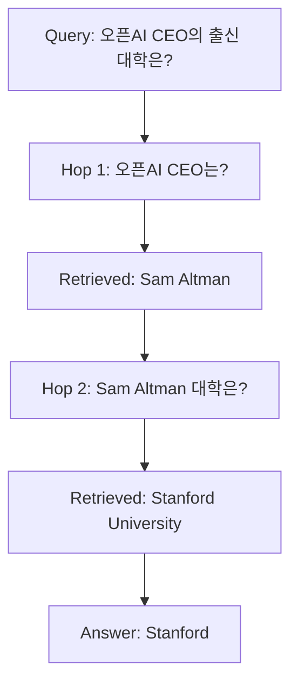

**구현 방법:**
- **Iterative Retrieval**: 이전 검색 결과를 다음 쿼리에 활용
- **Graph-based RAG**: 지식 그래프를 활용한 구조화된 검색

#### 4.4.2. 셀프-RAG

모델이 스스로 언제 검색할지, 얼마나 신뢰할지 판단한다.

**리플렉션 토큰(reflection token):**
- `[Retrieval]`: 검색 필요 여부
- `[Relevant]`: 검색 결과의 관련성
- `[Support]`: 답변이 문서에 근거하는지
- `[Utility]`: 답변의 유용성

**의사결정 흐름:**
```
Query → [Retrieval: Yes/No] → (If Yes) Retrieve → [Relevant: Yes/No]
→ (If Yes) Generate → [Support: Yes/No] → [Utility: High/Low] → Output
```

#### 4.4.3. 어댑티브 RAG

쿼리의 복잡도에 따라 RAG 전략을 동적으로 조정한다.

**쿼리 분류:**
- **Simple**: 직접 LLM 답변 (RAG 불필요)
- **Moderate**: 단일 단계 RAG
- **Complex**: 멀티 홉 RAG, 추론 체인 포함

**라우팅 메커니즘:**
- 소형 분류기 모델로 쿼리 복잡도 예측
- 복잡도에 맞는 파이프라인 선택

### 4.5. RAG vs 파인 튜닝

| 측면 | RAG | 파인 튜닝 |
|------|-----|----------|
| **지식 업데이트** | 실시간, 데이터베이스만 변경 | 재학습 필요 |
| **도메인 적응** | 중간 | 높음 |
| **추론 비용** | 높음 (검색 오버헤드) | 낮음 |
| **투명성** | 높음 (출처 제공) | 낮음 (블랙박스) |
| **초기 설정** | 빠름 | 느림 (학습 시간) |
| **확장성** | 높음 (문서 추가만) | 중간 (재학습 필요) |
| **정확도** | 높음 (사실 기반) | 매우 높음 (특화 시) |

**사용 가이드라인:**
- **RAG 사용**: 빠르게 변하는 정보, 사실 검증 중요, 출처 필요
- **파인 튜닝 사용**: 특정 스타일/톤 학습, 도메인 깊은 이해, 낮은 레이턴시
- **하이브리드**: 파인 튜닝으로 도메인 적응 + RAG로 최신 정보 보강

---

## 5. 생각하는 LLM: 추론 모델

### 5.1. 추론 모델의 등장 배경

#### 5.1.1. 시스템 1 vs 시스템 2 사고

심리학자 대니얼 카너먼(Daniel Kahneman)의 이중 과정 이론(dual-process theory)은 인간의 사고를 두 시스템으로 구분한다:

**시스템 1 (빠른 사고):**
- 직관적, 자동적, 병렬 처리
- 적은 인지 노력
- 휴리스틱 기반, 패턴 인식
- 전통적 LLM의 작동 방식

**시스템 2 (느린 사고):**
- 의식적, 논리적, 순차 처리
- 많은 인지 노력
- 계획, 추론, 문제 해결
- 추론 모델이 에뮬레이션하려는 방식

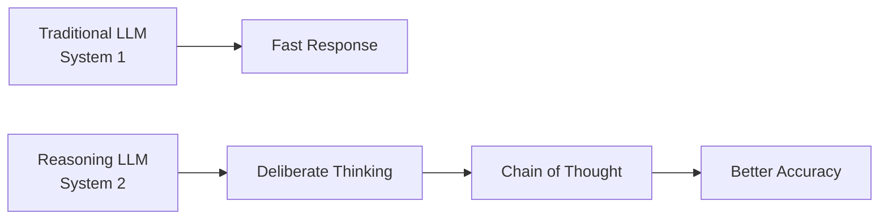

#### 5.1.2. 체인 오브 쏘트의 발견

Wei et al. (2022)의 Chain-of-Thought (CoT) 프롬프팅은 LLM에게 중간 추론 단계를 생성하도록 유도하여 복잡한 문제 해결 능력을 크게 향상시켰다.

**예시:**
```
Question: Roger has 5 tennis balls. He buys 2 more cans of tennis balls.
Each can has 3 tennis balls. How many tennis balls does he have now?

Without CoT:
Answer: 11 ✗

With CoT:
Let's think step by step.
1. Roger starts with 5 balls.
2. He buys 2 cans, each with 3 balls.
3. So he gets 2 × 3 = 6 new balls.
4. Total: 5 + 6 = 11 balls.
Answer: 11 ✓
```

**성능 향상:**
- GSM8K (수학 문제): 17% → 58%
- StrategyQA (멀티홉 추론): 54% → 68%

### 5.2. 추론 강화 기법

#### 5.2.1. 제로샷 CoT

명시적 예시 없이도 "Let's think step by step" 같은 간단한 프롬프트만으로 추론을 유도할 수 있다.

**프롬프트 템플릿:**
```
Q: {question}
A: Let's think step by step.
```

이 단순한 접근이 놀랍게도 효과적이며, 퓨샷(few-shot) 예시 없이도 복잡한 추론을 가능하게 한다.

#### 5.2.2. 셀프-컨시스턴시

같은 문제를 여러 번 풀어보고, 가장 빈번한 답을 선택하는 방법이다.

**알고리즘:**
1. 동일한 문제에 대해 $N$개의 추론 경로 생성 (temperature > 0으로 다양성 확보)
2. 각 경로의 최종 답변 추출
3. 가장 많이 나온 답을 최종 답으로 선택

$$
\text{Answer} = \arg\max_a \sum_{i=1}^{N} \mathbb{1}[\text{answer}_i = a]
$$

**성능 향상:**
- GSM8K: 58% → 78% (N=40)
- 안정성(robustness) 향상: 프롬프트 변화에 덜 민감

**트레이드오프:**
- 추론 시간 $N$배 증가
- API 비용 $N$배 증가
- 하지만 더 신뢰할 수 있는 답변

#### 5.2.3. 트리 오브 쏘츠

선형적 체인이 아닌, 트리 구조로 여러 가능성을 탐색한다.

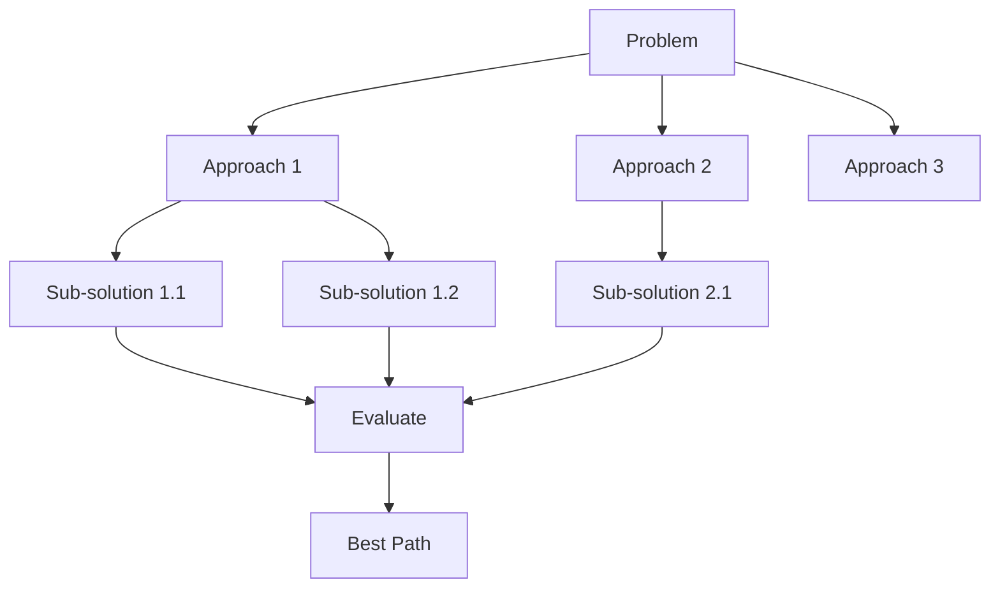

**탐색 전략:**
- **BFS (너비 우선 탐색)**: 모든 가지 동시 확장
- **DFS (깊이 우선 탐색)**: 한 경로를 끝까지 탐색
- **Beam Search**: 상위 K개 유망 경로만 유지

**평가 함수:**
- 중간 상태의 유망성을 평가
- LLM 자체가 평가자 역할: "이 접근이 정답에 가까운가? (1-10점)"

#### 5.2.4. 그래프 오브 쏘츠

트리보다 일반화된 그래프 구조로, 사고의 비선형적 연결을 허용한다.

**특징:**
- 노드(node): 중간 아이디어나 서브 문제
- 엣지(edge): 아이디어 간 관계 (합성, 대조, 정제)
- 순환(cycle) 허용: 반복적 정제 가능

**응용:**
- 창의적 글쓰기: 여러 플롯 라인 병합
- 과학적 가설 생성: 실험 결과 통합
- 복잡한 계획 수립: 다중 제약조건 만족

### 5.3. 테스트 타임 컴퓨테이션

#### 5.3.1. 추론 시 스케일링

전통적으로 AI 성능 향상은 **학습 시 컴퓨트(train-time compute)** 증가에 의존했다. 추론 모델은 **테스트 시 컴퓨트(test-time compute)**를 더 투입하여 성능을 향상시킨다.

**스케일링 법칙:**

$$
\text{Performance} \propto \log(\text{Test-time Compute})
$$

더 오래 생각할수록 더 나은 답을 찾을 확률이 증가한다.

**구현 방법:**
- 더 긴 추론 체인 생성
- 더 많은 후보 답변 탐색
- 반복적 정제(iterative refinement)

#### 5.3.2. 베리파이어와 프로세스 슈퍼비전

**아웃컴 슈퍼비전(Outcome Supervision):**
- 최종 답변만 평가 (정답/오답)
- 데이터 수집 쉬움
- 추론 과정은 블랙박스

**프로세스 슈퍼비전(Process Supervision):**
- 각 중간 추론 단계를 평가
- 더 세밀한 피드백
- 데이터 수집 비용 높음

$$
\text{Outcome: } R(y) = \begin{cases} 1 & \text{if } y = y^* \\ 0 & \text{otherwise} \end{cases}
$$

$$
\text{Process: } R(s_1, \ldots, s_n) = \sum_{i=1}^{n} r(s_i)
$$

**베리파이어 모델:**
- 추론 과정의 정확성 검증
- 수학 문제: 각 계산 단계 체크
- 코드 생성: 중간 결과 실행 및 확인

### 5.4. 최신 추론 모델 사례

#### 5.4.1. OpenAI o1/o3 시리즈

**o1 (2024년 9월):**
- 추론 특화 모델
- 긴 내부 체인 오브 쏘트 (사용자에게 요약만 표시)
- 경쟁 프로그래밍: Codeforces 1800 Elo
- 수학 올림피아드: AIME 83% 정답률

**o3 (2024년 12월):**
- 더 강력한 추론 능력
- ARC-AGI: 75.7% (이전 최고 55%)
- 적응적 컴퓨트: 문제 난이도에 따라 생각 시간 조절

**특징:**
- **히든 체인(hidden chain)**: 실제 추론 과정은 숨김, 정제된 요약만 표시
- **테스트 타임 스케일링**: 더 어려운 문제에 더 많은 토큰 할당
- **강화학습 기반 학습**: 정답을 향한 탐색 최적화

#### 5.4.2. DeepSeek-R1

중국 딥시크(DeepSeek)의 오픈소스 추론 모델이다.

**혁신점:**
- **완전 공개된 추론 과정**: o1과 달리 전체 사고 과정 표시
- **Pure RL 학습**: SFT 없이 강화학습만으로 추론 능력 획득
- **다국어 추론**: 영어, 중국어 외 다양한 언어 지원

**성능:**
- MATH-500: 79.8%
- AIME 2024: 79.2%
- Codeforces: 1450+ Elo

**오픈소스 임팩트:**
- 연구 커뮤니티에 추론 모델 접근성 제공
- 추론 메커니즘의 투명성
- 커스터마이징 가능성

#### 5.4.3. 추론 모델의 성능 특성

**강점:**
- 복잡한 수학 문제
- 다단계 논리 추론
- 코드 생성 및 디버깅
- 과학적 가설 검증

**약점:**
- 높은 레이턴시: 20-60초 응답 시간
- 비용: 일반 모델 대비 5-10배
- 단순 질문에는 오버킬(overkill)

**언제 사용할 것인가:**
- 정확도가 중요하고 시간은 덜 중요한 경우
- 복잡한 문제 해결
- 사람의 전문성을 대체하는 경우 (의료 진단, 법률 분석 등)

---

## 6. 소형 LLM

### 6.1. 소형 LLM의 필요성

#### 6.1.1. 엣지 디바이스와 온디바이스 AI

클라우드 기반 LLM의 한계:
- 인터넷 연결 필수
- 프라이버시 우려: 민감한 데이터 전송
- 레이턴시: 네트워크 지연
- 비용: API 호출 누적

**온디바이스 AI의 장점:**
- 완전한 오프라인 작동
- 사용자 데이터가 디바이스 밖으로 나가지 않음
- 즉각적인 응답 (네트워크 지연 제거)
- 런타임 비용 없음

**타겟 디바이스:**
- 스마트폰: 8GB ~ 16GB RAM
- 태블릿: 4GB ~ 12GB RAM
- IoT 디바이스: 512MB ~ 2GB RAM
- 엣지 서버: 16GB ~ 64GB RAM

#### 6.1.2. 레이턴시와 비용 효율성

**레이턴시 분해:**
- 네트워크 왕복 시간: 50-200ms
- 서버 큐잉(queueing): 100-500ms
- 모델 추론: 500-5000ms (모델 크기에 따라)

소형 모델의 추론 시간: 50-500ms (엣지에서)

**비용 비교 (1M 토큰 기준):**
- GPT-4: $30-60
- Claude 3.5: $15-30
- Llama 3.1 70B (호스팅): $1-5
- Phi-3 3.8B (온디바이스): $0

#### 6.1.3. 프라이버시와 데이터 로컬리티

**규제 컴플라이언스:**
- GDPR (유럽): 데이터 최소화, 로컬 처리 우대
- HIPAA (미국 의료): PHI(Protected Health Information) 전송 제한
- 금융 규제: 고객 데이터 보호

**온디바이스 처리의 이점:**
- 데이터가 디바이스를 떠나지 않음
- 규제 준수 용이
- 사용자 신뢰 증대

### 6.2. 모델 압축 기법

#### 6.2.1. 프루닝: 구조적/비구조적

**비구조적 프루닝(Unstructured Pruning):**
- 개별 가중치를 0으로 설정
- 스파시티(sparsity) 패턴이 불규칙

$$
W_{\text{pruned}} = W \odot M, \quad M_{ij} = \begin{cases} 1 & \text{if } |W_{ij}| > \theta \\ 0 & \text{otherwise} \end{cases}
$$

**구조적 프루닝(Structured Pruning):**
- 전체 뉴런, 채널, 어텐션 헤드 제거
- 하드웨어 효율적

**Magnitude-based Pruning:**
- 가장 작은 가중치 제거
- 간단하지만 효과적

**Iterative Pruning:**
1. 모델 학습
2. 일부 가중치 제거
3. 파인 튜닝으로 복구
4. 반복

**달성 가능한 압축률:**
- 70-90% 스파시티로 성능 손실 최소
- 극단적 프루닝: 95%+ (성능 저하 수반)

#### 6.2.2. 퀀타이제이션: INT8, INT4, 바이너리

부동소수점(FP32, FP16) 가중치를 낮은 정밀도로 변환한다.

**정밀도 비교:**
- FP32: 32비트, 범위 ±3.4 × 10³⁸
- FP16: 16비트, 범위 ±65,504
- INT8: 8비트, 범위 -128 ~ 127
- INT4: 4비트, 범위 -8 ~ 7

**선형 퀀타이제이션:**

$$
x_{\text{quant}} = \text{round}\left(\frac{x - z}{s}\right)
$$

여기서 $s$는 스케일(scale), $z$는 제로 포인트(zero-point)이다.

**퀀타이제이션 전략:**
- **Post-Training Quantization (PTQ)**: 학습 후 바로 양자화, 빠름, 약간의 성능 저하
- **Quantization-Aware Training (QAT)**: 양자화를 고려하여 재학습, 느림, 성능 보존

**메모리 감소:**
- FP32 → INT8: 4배 감소
- FP32 → INT4: 8배 감소
- FP32 → 1-bit: 32배 감소

**실용적 선택:**
- **INT8**: 거의 무손실, 널리 지원
- **INT4**: 약간의 성능 저하, 큰 메모리 절약
- **혼합 정밀도(mixed precision)**: 중요한 레이어는 FP16, 나머지는 INT8

#### 6.2.3. 지식 증류

큰 모델(teacher)의 지식을 작은 모델(student)로 전달한다.

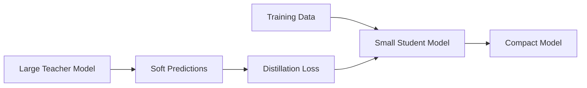

**증류 손실:**

$$
\mathcal{L}_{\text{distill}} = \alpha \cdot \mathcal{L}_{\text{CE}}(y, \sigma(z_s)) + (1-\alpha) \cdot \mathcal{L}_{\text{KL}}(\sigma(z_t/T), \sigma(z_s/T))
$$

여기서:
- $y$: 정답 레이블
- $z_t, z_s$: 티처/스튜던트 로짓(logit)
- $\sigma$: 소프트맥스
- $T$: 온도(temperature) (높을수록 소프트한 분포)
- $\alpha$: 하드/소프트 타겟 밸런스

**온도의 역할:**
- $T=1$: 일반 소프트맥스
- $T>1$: 확률 분포가 평평해짐, 클래스 간 관계 정보 포함
- $T \to \infty$: 균등 분포

**증류 변형:**
- **Feature Distillation**: 중간 레이어 표현도 매칭
- **Attention Distillation**: 어텐션 패턴 전달
- **Self-Distillation**: 같은 모델이 티처이자 스튜던트

#### 6.2.4. 로우랭크 팩토라이제이션

가중치 행렬을 두 개의 작은 행렬의 곱으로 근사한다.

$$
W \in \mathbb{R}^{m \times n} \approx U V^T, \quad U \in \mathbb{R}^{m \times r}, V \in \mathbb{R}^{n \times r}
$$

**파라미터 감소:**
- 원본: $mn$
- 팩토라이즈드: $r(m + n)$
- 압축률: $\frac{mn}{r(m+n)} = \frac{mn}{r(m+n)}$

$m=n=1000$, $r=50$인 경우: 10배 압축

**특잇값 분해(SVD) 기반:**

$$
W = U \Sigma V^T \approx U_r \Sigma_r V_r^T
$$

상위 $r$개 특잇값만 유지한다.

### 6.3. 효율적인 아키텍처 설계

#### 6.3.1. 모바일 최적화 트랜스포머

**MobileBERT:**
- 병목 구조(bottleneck structure): 넓은 히든 → 좁은 어텐션 → 넓은 히든
- 레이어 정규화 위치 최적화
- 지식 증류 활용

**TinyBERT:**
- 4레이어, 312 히든 차원
- BERT-base 대비 7.5배 작음, 9.4배 빠름
- 정확도 손실 <3%

**효율성 기법:**
- **레이어 공유(layer sharing)**: 같은 가중치를 여러 레이어에서 재사용
- **그룹 쿼리 어텐션(GQA)**: 키/밸류 헤드 수 감소
- **얕은 디코더(shallow decoder)**: 인코더는 깊게, 디코더는 얕게

#### 6.3.2. 믹스처 오브 엑스퍼츠

각 토큰을 전문화된 서브네트워크(expert) 중 일부만 활성화한다.

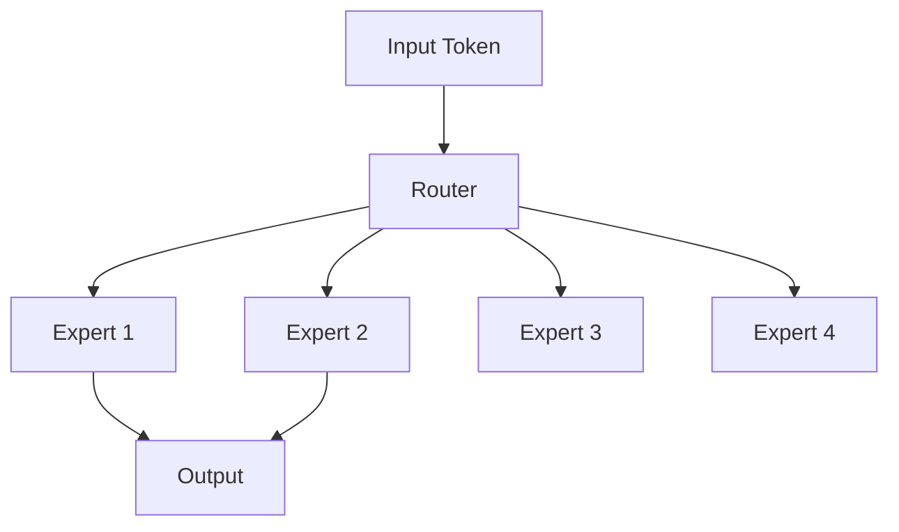

**라우팅 메커니즘:**

$$
\text{Output} = \sum_{i=1}^{n} G(x)_i \cdot E_i(x)
$$

여기서 $G(x) = \text{Softmax}(\text{TopK}(x \cdot W_g))$는 게이팅 함수(gating function)이다.

**장점:**
- 총 파라미터는 많지만, 활성 파라미터는 적음
- 파라미터 효율적 스케일링
- 조건부 컴퓨테이션(conditional computation)

**과제:**
- 로드 밸런싱(load balancing): 일부 엑스퍼트에 집중되는 문제
- 통신 오버헤드: 분산 시스템에서

#### 6.3.3. 어텐션 메커니즘 최적화

**멀티 쿼리 어텐션(MQA):**
- 모든 헤드가 같은 키/밸류 공유
- 메모리 사용량 대폭 감소

**그룹 쿼리 어텐션(GQA):**
- MQA와 멀티헤드 어텐션의 중간
- 헤드를 그룹으로 묶어 키/밸류 공유

**선형 어텐션(Linear Attention):**
- $O(n^2) \to O(n)$ 복잡도 감소
- 커널 트릭(kernel trick) 활용

$$
\text{Attention}(Q, K, V) = \phi(Q) (\phi(K)^T V)
$$

여기서 $\phi$는 특징 맵(feature map)이다.

### 6.4. 대표적인 소형 LLM

#### 6.4.1. Phi 시리즈

마이크로소프트의 소형 고성능 모델이다.

**Phi-3 (2024):**
- **Phi-3-mini**: 3.8B 파라미터, 스마트폰에서 실행 가능
- **Phi-3-small**: 7B 파라미터
- **Phi-3-medium**: 14B 파라미터

**특징:**
- 고품질 합성 데이터로 학습
- "Textbooks are all you need" 철학
- 큰 모델에 필적하는 추론 능력

**성능:**
- MMLU: Phi-3-mini 69%, Mixtral 8x7B 68.4%
- HumanEval: Phi-3-mini 59%, GPT-3.5 48%

#### 6.4.2. Gemma, Llama-3.2

**Gemma 2:**
- 구글의 오픈 모델
- 2B, 9B, 27B 사이즈
- Sliding window attention
- 안전성(safety) 중심 설계

**Llama-3.2:**
- 메타의 최신 소형 모델
- 1B, 3B 사이즈
- 멀티모달 버전(11B, 90B) 포함
- 온디바이스 최적화

**벤치마크 비교:**

| 모델 | 크기 | MMLU | GSM8K | HumanEval |
|------|------|------|-------|-----------|
| Phi-3-mini | 3.8B | 69.0 | 82.5 | 59.0 |
| Gemma 2 | 2B | 51.3 | 23.9 | 22.5 |
| Llama-3.2 | 3B | 63.4 | 81.7 | 48.0 |

#### 6.4.3. 성능 vs 크기 트레이드오프

**스케일링 트렌드:**
- 10배 파라미터 증가 → 약 2배 성능 향상 (감소하는 수익률)
- 데이터 품질이 크기보다 중요할 수 있음

**실용적 선택 가이드:**
- **1-3B**: 간단한 분류, 정보 추출, 채팅봇 (모바일)
- **7-13B**: 복잡한 NLU, 코드 생성, 요약 (데스크톱, 서버)
- **30B+**: 전문가 수준 태스크, 복잡한 추론 (클라우드)

### 6.5. 소형 LLM의 한계와 보완 전략

**주요 한계:**
- 제한된 세계 지식
- 복잡한 멀티스텝 추론 어려움
- 창의성과 다양성 부족
- 긴 컨텍스트 처리 제한

**보완 전략:**
- **RAG 통합**: 지식 부족을 외부 검색으로 보완
- **앙상블(ensemble)**: 여러 소형 모델 조합
- **스페셜라이제이션(specialization)**: 특정 도메인에 집중
- **하이브리드 시스템**: 간단한 쿼리는 소형 모델, 복잡한 쿼리는 큰 모델로 라우팅

---

## 7. LLM과 멀티모달 모델의 차이

### 7.1. 멀티모달리티의 개념

#### 7.1.1. 유니모달 vs 멀티모달

**유니모달(Unimodal):**
- 단일 모달리티(텍스트, 이미지, 오디오 등) 처리
- 전통적 LLM: 텍스트만 입력/출력
- 특정 도메인에 특화

**멀티모달(Multimodal):**
- 여러 모달리티 동시 처리
- 모달리티 간 관계 학습
- 인간과 유사한 다감각 이해

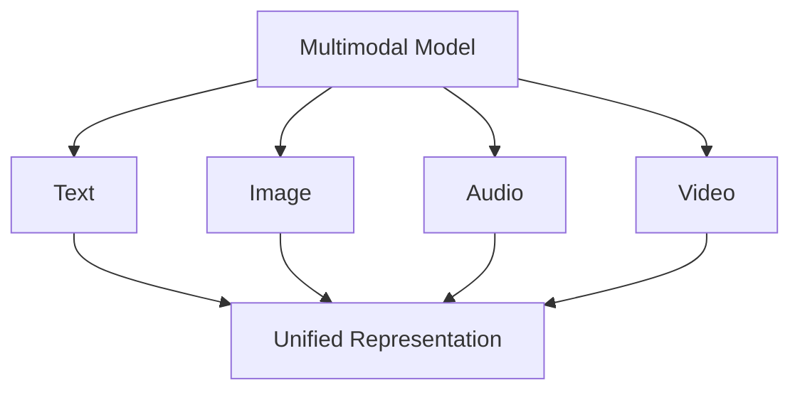

#### 7.1.2. 크로스모달 이해의 중요성

**크로스모달 태스크:**
- 이미지 캡셔닝: 이미지 → 텍스트
- 텍스트-이미지 생성: 텍스트 → 이미지
- 비주얼 질문 답변: 이미지 + 텍스트 → 텍스트
- 비디오 이해: 비디오 + 오디오 → 요약

**왜 중요한가?**
- 세상은 본질적으로 멀티모달
- 단일 모달리티는 불완전한 정보
- 모달리티 간 상호보완적 정보

**예시:**
```
텍스트만: "빨간색 물체가 테이블 위에 있다"
이미지만: [사과 그림]
멀티모달: "빨간 사과가 나무 테이블 위에 놓여 있다. 약간 멍이 들어있다."
```

### 7.2. 멀티모달 아키텍처

#### 7.2.1. 비전-랭귀지 모델

**기본 구조:**
```
이미지 → Vision Encoder → Visual Features → Projection → LLM → 텍스트
```

**비전 인코더:**
- ViT (Vision Transformer): 이미지를 패치로 분할하여 트랜스포머 처리
- CLIP Image Encoder: 대조 학습으로 학습된 이미지 인코더

$$
\text{Image Patches} = \text{Split}(I, p \times p)
$$

$$
\text{Visual Tokens} = \text{ViT}(\text{Image Patches})
$$

**프로젝션 레이어:**
- 비전 특징을 LLM의 임베딩 공간으로 매핑
- 선형 프로젝션 또는 경량 MLP

$$
h_{\text{visual}} = W_{\text{proj}} \cdot f_{\text{vision}}(I) + b
$$

#### 7.2.2. 얼리 퓨전 vs 레이트 퓨전

**얼리 퓨전(Early Fusion):**
- 모달리티를 초기 단계에서 결합
- 저수준 특징 상호작용
- 더 나은 통합, 높은 계산 비용

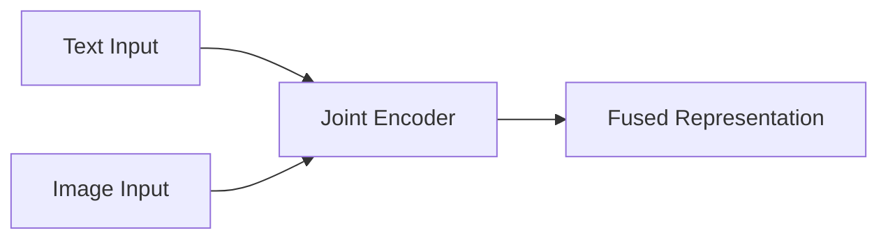

**레이트 퓨전(Late Fusion):**
- 각 모달리티를 독립적으로 인코딩
- 고수준에서 결합
- 모듈성, 효율성

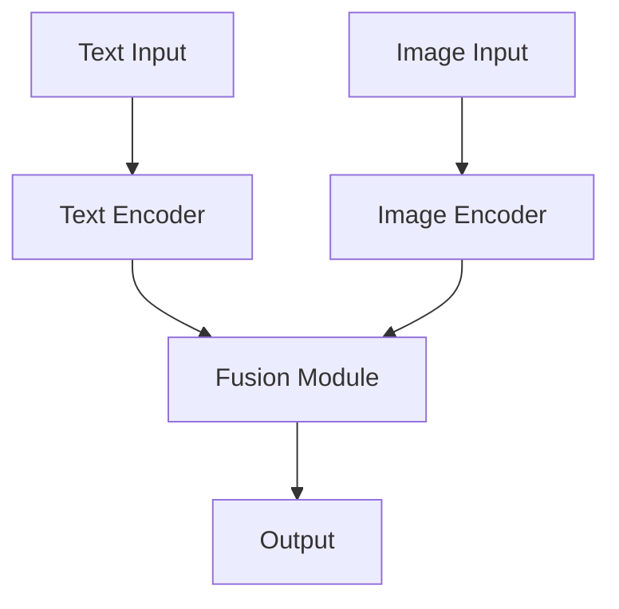

**하이브리드 접근:**
- 초기에는 독립 인코딩
- 중간 레이어에서 크로스 어텐션
- 대부분의 최신 모델이 사용

#### 7.2.3. 모달리티 얼라인먼트 기법

서로 다른 모달리티의 표현을 공통 공간에 정렬한다.

**대조 학습(Contrastive Learning):**

$$
\mathcal{L}_{\text{contrastive}} = -\log \frac{\exp(\text{sim}(v_i, t_i) / \tau)}{\sum_{j=1}^{N} \exp(\text{sim}(v_i, t_j) / \tau)}
$$

여기서 $v_i, t_i$는 매칭되는 이미지-텍스트 쌍, $\tau$는 온도 파라미터이다.

**CLIP의 성공:**
- 4억 개 이미지-텍스트 쌍으로 학습
- 제로샷 이미지 분류 가능
- 다운스트림 태스크의 강력한 백본

**얼라인먼트 과제:**
- **모달리티 갭(modality gap)**: 서로 다른 분포
- **세밀한 매칭(fine-grained matching)**: "빨간 셔츠를 입은 사람"
- **부정적 예시(negative examples)**: 어려운 네거티브 샘플링

### 7.3. 대표적인 멀티모달 모델

#### 7.3.1. CLIP, BLIP, Flamingo

**CLIP (OpenAI, 2021):**
- 이미지-텍스트 대조 학습
- 제로샷 전이 학습의 혁신
- 응용: 이미지 검색, 분류, 세그멘테이션

**BLIP (Salesforce, 2022):**
- 부트스트래핑(bootstrapping) 방식
- 캡셔닝과 필터링을 반복하여 고품질 데이터 생성
- BLIP-2: Q-Former로 효율적 정렬

**Flamingo (DeepMind, 2022):**
- 퓨샷 멀티모달 학습
- 인터리브드(interleaved) 이미지-텍스트 입력
- 크로스 어텐션 레이어로 비전 통합

#### 7.3.2. GPT-4V, Gemini, Claude 3

**GPT-4V (OpenAI):**
- GPT-4 + 비전 능력
- 차트, 다이어그램, 손글씨 이해
- 이미지 기반 추론

**Gemini (Google):**
- 네이티브 멀티모달 설계
- 텍스트, 이미지, 오디오, 비디오
- 긴 컨텍스트 윈도우 (1M 토큰)

**Claude 3 (Anthropic):**
- 이미지 이해 능력
- PDF, 차트, 스크린샷 분석
- 안전하고 도움이 되는 응답 중심

### 7.4. 멀티모달 모델의 응용 분야

#### 7.4.1. 비주얼 퀘스천 앤서링

이미지와 관련된 자유 형식 질문에 답변한다.

**예시:**
```
이미지: [해변 사진]
질문: "이 사진이 어느 계절에 촬영된 것 같나요?"
답변: "여름으로 보입니다. 맑은 하늘, 사람들의 반팔 옷차림, 
       그리고 활발한 해변 활동이 보이기 때문입니다."
```

**도전과제:**
- 미묘한 시각적 단서 포착
- 상식 추론 결합
- 이미지 전체의 맥락 이해

#### 7.4.2. 이미지 캡셔닝과 제너레이션

**이미지 → 텍스트:**
- 자동 alt-text 생성 (접근성)
- 소셜 미디어 자동 태깅
- 의료 영상 리포트 생성

**텍스트 → 이미지:**
- Stable Diffusion, DALL-E, Midjourney
- 디퓨전 모델(diffusion model) 기반

$$
p_\theta(x_{t-1}|x_t) = \mathcal{N}(x_{t-1}; \mu_\theta(x_t, t), \Sigma_\theta(x_t, t))
$$

#### 7.4.3. 비디오 언더스탠딩

**과제:**
- 시간적 연속성(temporal coherence) 모델링
- 장기 의존성(long-range dependency)
- 다중 프레임 정보 통합

**접근법:**
- 샘플링: 균등 간격으로 프레임 추출
- 시간적 어텐션: 프레임 간 관계 학습
- 3D 컨볼루션: 공간-시간 특징 추출

**응용:**
- 액션 인식
- 비디오 요약
- 이벤트 감지

### 7.5. 멀티모달 모델의 특수한 도전과제

#### 7.5.1. 모달리티 갭과 그라운딩

**모달리티 갭:**
- 서로 다른 모달리티의 표현이 공통 공간에서도 분리되는 현상
- 완벽한 정렬은 불가능

**그라운딩(Grounding):**
- 텍스트의 개념을 이미지의 영역에 매핑
- "빨간 셔츠를 입은 남자" → 이미지의 특정 영역

**해결 접근:**
- 어텐션 맵(attention map) 분석
- 리전 기반 특징(region-based features)
- 약한 지도 학습(weakly supervised learning)

#### 7.5.2. 컴포지셔널 제너럴리제이션

복잡한 개념을 구성 요소로 분해하고 새로운 조합을 이해하는 능력이다.

**문제 예시:**
- 학습: "빨간 자동차", "파란 트럭"
- 테스트: "빨간 트럭" → 모델이 제대로 일반화하는가?

**Winoground 벤치마크:**
- 미묘한 텍스트-이미지 매칭
- 컴포지셔널 이해 테스트
- 현재 모델들도 어려워함

**개선 방향:**
- 구조화된 표현(structured representation) 학습
- 뉴로-심볼릭(neuro-symbolic) 접근
- 더 많은 조합 데이터

---

## 8. LLM 윤리적 위험과 대응

### 8.1. 주요 윤리적 이슈

#### 8.1.1. 바이어스와 차별

LLM은 학습 데이터의 사회적 편견을 반영하고 증폭시킬 수 있다.

**바이어스의 표현:**
- **스테레오타입 강화**: "엔지니어는 남성이다", "간호사는 여성이다"
- **언어적 연관성**: 특정 인종/민족과 부정적 형용사 연결
- **기회 불평등**: 편향된 추천, 평가, 의사결정

**측정 방법:**

**WEAT (Word Embedding Association Test):**

$$
s(X, Y, A, B) = \sum_{x \in X} s(x, A, B) - \sum_{y \in Y} s(y, A, B)
$$

여기서 $s(w, A, B) = \text{mean}_{a \in A} \cos(w, a) - \text{mean}_{b \in B} \cos(w, b)$

**완화 전략:**
- 데이터 큐레이션: 편향된 콘텐츠 필터링
- 디바이어싱(debiasing) 기법: 임베딩 공간 조정
- 균형잡힌 파인 튜닝
- 지속적 모니터링 및 평가

#### 8.1.2. 허위정보 생성

LLM은 그럴듯하지만 거짓인 정보를 생성할 수 있다.

**위험 시나리오:**
- 가짜 뉴스 대량 생성
- 과학적 허위정보 확산
- 역사 수정주의
- 딥페이크 텍스트

**악화 요인:**
- 높은 유창성과 설득력
- 빠른 생성 속도
- 자동화 가능성
- 탐지의 어려움

**대응책:**
- 출처 제공: RAG 시스템
- 불확실성 표시: "확실하지 않음" 명시
- 팩트 체킹 통합
- 워터마킹과 출처 추적

#### 8.1.3. 프라이버시 침해와 데이터 유출

**멤버십 추론 공격(Membership Inference Attack):**
- 특정 데이터가 학습 세트에 포함되었는지 추론
- 민감한 개인정보 노출 위험

$$
\text{Attack Success} = P(\text{Classify as member} | x \in D_{\text{train}})
$$

**모델 인버전(Model Inversion):**
- 모델 출력으로부터 학습 데이터 재구성
- 얼굴, 의료 기록 등 복원 가능

**프라이버시 보호 기법:**
- **차분 프라이버시(Differential Privacy)**:

$$
P[\mathcal{M}(D) \in S] \leq e^\epsilon \cdot P[\mathcal{M}(D') \in S] + \delta
$$

여기서 $D, D'$는 한 샘플만 다른 데이터셋, $\epsilon$은 프라이버시 예산(budget)이다.

- **페더레이티드 러닝(Federated Learning)**: 데이터를 중앙으로 모으지 않음
- **시큐어 애그리게이션(Secure Aggregation)**: 암호화된 그래디언트 집계

#### 8.1.4. 저작권과 지적재산권 문제

**쟁점:**
- 학습 데이터의 저작권: 허가 없이 사용 가능한가?
- 생성물의 소유권: AI가 만든 콘텐츠는 누구 것인가?
- 기억과 재생산: 학습 데이터의 일부를 그대로 출력하는 경우

**법적 불확실성:**
- 공정 사용(fair use) 적용 여부
- 국가별 법률 차이
- 진행 중인 소송들 (GitHub Copilot, Stability AI 등)

**윤리적 접근:**
- 라이선스 존중 데이터셋 사용
- 옵트아웃(opt-out) 메커니즘 제공
- 생성물에 출처 표시
- 창작자 보상 모델 개발

### 8.2. 안전성 확보 기법

#### 8.2.1. 레드 티밍

적대적으로 모델을 테스트하여 취약점을 발견한다.

**프로세스:**
1. **공격 벡터 설계**: 유해 출력을 유도하는 프롬프트
2. **자동화된 테스트**: 수천-수만 개의 적대적 입력
3. **인간 레드 티머**: 창의적이고 미묘한 공격
4. **취약점 문서화**: 실패 사례 수집
5. **개선 및 재테스트**: 모델 강화 후 재평가

**공격 카테고리:**
- 탈옥(jailbreaking): 안전 가드레일 우회
- 프롬프트 인젝션: 악의적 지시 삽입
- 데이터 추출: 학습 데이터 유출 시도
- 편향 유발: 차별적 응답 유도

#### 8.2.2. 컨스티튜셔널 AI

**원리:**
- 명시적인 가치와 원칙을 모델에 인코딩
- 자기 비판과 수정 메커니즘

**2단계 프로세스:**

1. **Supervised Learning Phase:**
   - 모델이 유해 응답 생성
   - 헌법 원칙에 따라 자기 비판
   - 개선된 응답 생성
   - 이 쌍으로 학습

2. **RL Phase:**
   - AI 피드백으로 리워드 모델 학습
   - 인간 피드백 없이 정렬 강화

**헌법의 예시:**
```
- 도움이 되고, 정직하고, 무해해야 한다
- 불법적이거나 비윤리적 행동을 조장하지 않는다
- 모든 사람을 존중하고 공정하게 대한다
- 불확실할 때는 솔직히 인정한다
```

#### 8.2.3. 세이프티 파인 튜닝과 가드레일

**세이프티 파인 튜닝:**
- 거부 응답 데이터셋으로 학습
- 유해 프롬프트 → "죄송하지만 도와드릴 수 없습니다"

**가드레일 시스템:**
- 입력 필터: 위험한 쿼리 사전 차단
- 출력 필터: 유해 응답 후처리
- 컨텍스트 분석: 의도 파악

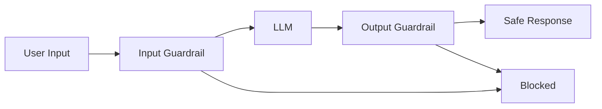

**멀티 레이어 방어:**
- 레이어 1: 프롬프트 검증
- 레이어 2: 모델 내부 안전성
- 레이어 3: 출력 검증
- 레이어 4: 사용자 피드백 루프

### 8.3. 디텍션과 워터마킹

#### 8.3.1. AI 생성 콘텐츠 탐지 기술

**통계적 특징 기반:**
- 퍼플렉시티(perplexity) 분포
- 버스티니스(burstiness): 문장 길이 변동성
- N-그램 빈도

**분류기 기반:**
- GPTZero, DetectGPT
- 인간/AI 텍스트로 학습된 분류 모델
- 한계: 적대적 예시에 취약

**제로샷 방법:**
- 로그 확률 분석
- 모델이 자기 텍스트를 높은 확률로 예측

$$
\text{AI-ness} = \frac{1}{N} \sum_{i=1}^{N} \log P_{\text{LLM}}(w_i | w_{<i})
$$

#### 8.3.2. 워터마크 임베딩 기법

텍스트 생성 시 탐지 가능한 패턴을 삽입한다.

**소프트 워터마킹:**
- 토큰 선택 확률을 미묘하게 조정
- "녹색 리스트" 토큰에 가중치 부여

$$
P_{\text{watermarked}}(w) \propto P_{\text{original}}(w) \cdot \exp(\delta \cdot \mathbb{1}[w \in \mathcal{G}])
$$

여기서 $\mathcal{G}$는 해시 함수로 결정된 녹색 리스트, $\delta$는 워터마크 강도이다.

**탐지:**
- 녹색 리스트 토큰의 비율 측정
- z-검정으로 통계적 유의성 평가

$$
z = \frac{|\mathcal{G}_T| / |T| - 0.5}{\sqrt{0.25 / |T|}}
$$

**장단점:**
- 장점: 모델 변경 최소, 텍스트 품질 유지
- 단점: 패러프레이징으로 우회 가능, 거짓 양성

### 8.4. 거버넌스와 규제

#### 8.4.1. AI Act와 국제 규제 동향

**EU AI Act (2024):**
- 위험 기반 분류: 최소, 제한적, 높음, 수용 불가
- 고위험 AI: 엄격한 요구사항 (문서화, 투명성, 인간 감독)
- 파운데이션 모델: 별도 규정 (시스템적 위험 평가)

**미국:**
- 행정명령: AI 안전성 및 보안 표준
- 섹터별 규제: FDA (의료), SEC (금융) 등

**중국:**
- 생성 AI 서비스 관리 조치
- 콘텐츠 심사 및 사용자 인증 의무

**국제 협력:**
- OECD AI 원칙
- G7 히로시마 AI 프로세스
- UN AI 거버넌스 논의

#### 8.4.2. 책임 있는 AI 개발 원칙

**주요 원칙:**
1. **투명성(Transparency)**: 작동 방식 설명 가능
2. **공정성(Fairness)**: 편향 최소화, 평등한 대우
3. **프라이버시(Privacy)**: 개인정보 보호
4. **안전성(Safety)**: 해를 끼치지 않음
5. **책임성(Accountability)**: 명확한 책임 소재

**구현 방법:**
- 모델 카드(model card): 성능, 한계, 편향 문서화
- 데이터시트(datasheet): 학습 데이터 출처 및 특성
- 임팩트 평가(impact assessment): 배포 전 위험 분석

#### 8.4.3. 투명성과 설명가능성

**설명가능성 기법:**
- **어텐션 시각화**: 모델이 주목하는 부분
- **LIME, SHAP**: 국소적 설명
- **프로브(probe)**: 내부 표현 분석

**한계:**
- LLM의 복잡성: 수십억 파라미터, 불투명한 내부 작동
- 설명과 이해의 간극: 설명이 항상 진정한 이해를 의미하지 않음
- 충실도(fidelity) vs 해석가능성 트레이드오프

**사용자 신뢰 구축:**
- 불확실성 표시
- 한계 명시
- 대안 제시
- 피드백 메커니즘

### 8.5. 개발자와 연구자의 윤리적 책임

**연구 윤리:**
- **듀얼 유즈(dual use) 고려**: 기술의 악용 가능성 평가
- **재현성(reproducibility)**: 코드 및 데이터 공개
- **편향 보고**: 모델의 한계와 편향 솔직하게 공개
- **IRB 승인**: 인간 대상 연구 시 윤리 심사

**배포 전 체크리스트:**
- [ ] 레드 티밍 수행
- [ ] 편향 평가 완료
- [ ] 모델 카드 작성
- [ ] 안전 가드레일 구현
- [ ] 남용 방지 메커니즘
- [ ] 사용자 교육 자료
- [ ] 모니터링 시스템 구축

**지속적 개선:**
- 사용자 피드백 수집
- 정기적 편향 감사(audit)
- 새로운 위험 모니터링
- 업데이트와 패치

---

## 9. 통합적 접근: 하이브리드 시스템

### 9.1. 여러 기법의 조합

#### 9.1.1. RAG + 파인 튜닝

두 기법의 장점을 결합한 시스템이다.

**아키텍처:**
```
Query → [도메인 파인 튜닝된 LLM] + [특화 벡터 DB] → Enhanced Response
```

**장점:**
- 파인 튜닝: 도메인 언어, 스타일, 추론 패턴 학습
- RAG: 최신 정보, 사실 검증, 출처 제공

**실제 사례:**
- 법률 AI: 법률 용어에 파인 튜닝 + 판례 데이터베이스 RAG
- 의료 AI: 의학 지식 파인 튜닝 + 최신 연구 논문 RAG
- 기업 어시스턴트: 회사 문화 파인 튜닝 + 내부 문서 RAG

**구현 전략:**
1. 먼저 도메인 데이터로 파인 튜닝
2. 특화된 벡터 데이터베이스 구축
3. 쿼리 라우팅: 일반 지식 vs 특정 문서 필요 판단
4. 통합 프롬프팅: RAG 결과를 파인 튜닝된 모델에 최적화된 형식으로 제공

#### 9.1.2. 추론 모델 + 툴 유즈

추론 능력과 외부 도구를 결합한다.

**툴 유즈(Tool Use):**
- 계산기: 정확한 산술 연산
- 코드 인터프리터: 프로그래밍 실행
- 웹 검색: 최신 정보
- 데이터베이스 쿼리: 구조화된 데이터 접근

**ReAct 패턴:**
```
Thought: 이 문제를 풀려면 현재 환율이 필요하다.
Action: search("USD to EUR exchange rate today")
Observation: 1 USD = 0.92 EUR
Thought: 이제 계산할 수 있다.
Action: calculate(1000 * 0.92)
Observation: 920
Answer: 1000 USD는 920 EUR입니다.
```

**추론 + 툴의 시너지:**
- 추론 모델: 복잡한 계획 수립
- 툴: 정확한 실행
- 반복적 정제: 결과 확인 후 계획 조정

#### 9.1.3. 에이전틱 시스템 구축

자율적으로 작동하는 AI 에이전트를 만든다.

**에이전트 구성 요소:**
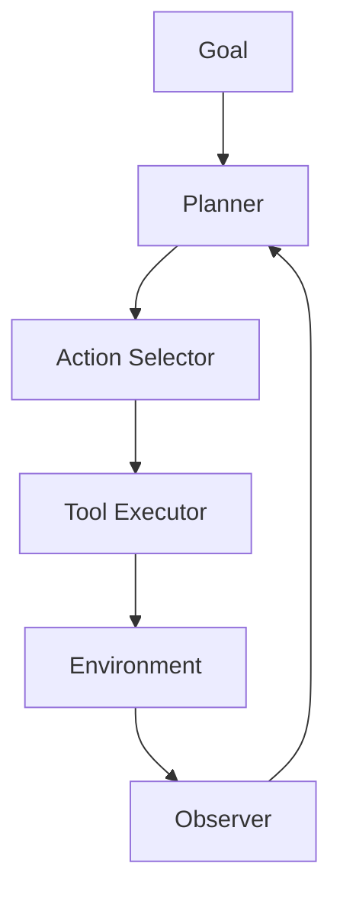

**AutoGPT 스타일 루프:**
1. 목표 설정
2. 현재 상태 분석
3. 다음 액션 계획
4. 액션 실행 (LLM 호출, 툴 사용 등)
5. 결과 평가
6. 목표 달성 시까지 반복

**응용 사례:**
- 자동 리서치: 주제를 받아 자동으로 조사, 요약
- 코딩 어시스턴트: 요구사항부터 테스트까지 자동화
- 비즈니스 분석: 데이터 수집, 분석, 보고서 생성

**도전과제:**
- 무한 루프 방지
- 비용 통제
- 환각 전파 (초기 오류가 누적)
- 안전성 보장

### 9.2. 실전 시스템 디자인 패턴

#### 9.2.1. 프로덕션 레벨 고려사항

**아키텍처 결정:**
```
User Request
    ↓
[입력 검증 & 안전성 체크]
    ↓
[의도 분류기] → Simple / Medium / Complex
    ↓               ↓           ↓
[소형 LLM]  [표준 LLM]  [추론 모델]
    ↓               ↓           ↓
[출력 검증]
    ↓
[캐싱 레이어]
    ↓
Response
```

**성능 최적화:**
- **캐싱**: 반복 쿼리의 응답 저장
- **배치 처리**: 여러 요청 묶어서 처리
- **스트리밍**: 토큰 단위 점진적 응답
- **로드 밸런싱**: 여러 모델 인스턴스 분산

**비용 최적화:**
- **티어링(tiering)**: 쿼리 복잡도별 모델 선택
- **캐싱**: API 호출 최소화
- **프롬프트 압축**: 토큰 수 줄이기
- **배치 디스카운트**: 오프피크 시간 활용

**신뢰성:**
- **폴백(fallback)**: 기본 모델 실패 시 대안
- **재시도 로직**: 일시적 오류 복구
- **서킷 브레이커(circuit breaker)**: 연쇄 실패 방지
- **그레이스풀 데그러데이션(graceful degradation)**: 부분 기능 유지

#### 9.2.2. 모니터링과 이터레이션

**메트릭 추적:**
- **응답 시간**: p50, p95, p99 레이턴시
- **정확도**: 사람 평가, 자동 평가
- **비용**: 토큰 사용량, API 비용
- **사용자 만족도**: 피드백, 재질문률

**A/B 테스팅:**
```python
# 예시 구조
if user_id % 2 == 0:
    response = model_A.generate(prompt)
else:
    response = model_B.generate(prompt)

log_metrics(user_id, model, response, user_feedback)
```

**지속적 개선 사이클:**
1. 메트릭 수집
2. 실패 사례 분석
3. 프롬프트 / 파이프라인 조정
4. A/B 테스트
5. 롤아웃
6. 반복

**사용자 피드백 루프:**
- 👍/👎 버튼
- 상세 피드백 양식
- 챗봇: "이 답변이 도움이 되었나요?"
- 행동 지표: 재질문, 세션 길이

**데이터 플라이휠(data flywheel):**
```
더 많은 사용 → 더 많은 피드백 → 모델 개선 → 더 나은 경험 → 더 많은 사용
```

---

## 10. 결론 및 향후 전망

### 10.1. LLM 기술의 진화 방향

**단기 트렌드 (1-2년):**
- **멀티모달 통합 심화**: 텍스트-이미지-오디오-비디오의 완전한 통합
- **추론 능력 강화**: 더 깊고 안정적인 사고 과정
- **효율성 향상**: 더 작고 빠른 모델로 동등한 성능
- **커스터마이제이션**: 개인 및 기업 맞춤형 LLM 보편화

**중기 전망 (3-5년):**
- **에이전트 경제**: 자율 AI 에이전트가 복잡한 태스크 수행
- **연속 학습**: 실시간 업데이트, 개인화 심화
- **모달리티 확장**: 로봇 제어, 센서 데이터 통합
- **설명가능성 돌파**: 내부 작동 메커니즘의 진정한 이해

**장기 비전 (5-10년):**
- **인공 일반 지능(AGI)로의 길**: 인간 수준의 범용 지능 근접
- **과학적 발견 가속**: AI가 주도하는 연구 혁신
- **교육 혁명**: 완전 개인화된 학습 경험
- **창의성의 확장**: 인간-AI 협업의 새로운 예술과 발명

### 10.2. 연구자/개발자를 위한 권고사항

**기술적 준비:**
- **기초 탄탄히**: 트랜스포머 아키텍처, 어텐션 메커니즘 깊이 이해
- **실습 중심**: 실제 모델 파인 튜닝, RAG 시스템 구축 경험
- **최신 동향 파악**: arXiv, 컨퍼런스 논문 정기 구독
- **오픈소스 기여**: 커뮤니티 참여로 실전 경험 쌓기

**책임 있는 개발:**
- **윤리 우선**: 모든 결정에서 사회적 영향 고려
- **투명성 실천**: 한계와 편향 솔직하게 공개
- **안전 장치**: 레드 티밍, 가드레일 필수 구현
- **지속적 감시**: 배포 후에도 모니터링 유지

**실용적 조언:**
- **작게 시작**: 전체 파인 튜닝보다 LoRA, 프롬프트 최적화부터
- **벤치마크 의존 경계**: 실제 사용 사례로 평가
- **비용 인식**: 토큰 사용량, 인프라 비용 추적
- **사용자 중심**: 기술보다 문제 해결에 집중

**커뮤니티 참여:**
- **지식 공유**: 블로그, 튜토리얼, 오픈소스 기여
- **협업**: 다양한 배경의 사람들과 협력
- **멘토링**: 후배 개발자 도움, 지식 전수
- **비판적 대화**: 한계와 위험에 대한 솔직한 논의

### 10.3. 미래의 도전과제

**기술적 도전:**
- **진정한 이해 vs 패턴 매칭**: LLM이 정말 "이해"하는가?
- **일반화의 한계**: 분포 외 데이터에 대한 강건성
- **계산 비용**: 지속 가능한 AI 발전 방법
- **긴 문맥 일관성**: 수백만 토큰 컨텍스트의 실용화

**윤리적 도전:**
- **일자리 영향**: 자동화로 인한 고용 변화
- **권력 집중**: 소수 기업의 AI 독점
- **글로벌 불평등**: AI 혜택의 불균등 분배
- **자율성과 책임**: AI 결정의 법적 책임 소재

**사회적 도전:**
- **진위 구별**: AI 생성 콘텐츠의 범람
- **프라이버시 재정의**: 개인정보의 새로운 의미
- **교육 재설계**: AI 시대에 맞는 교육 체계
- **규제와 혁신 균형**: 과도한 규제 vs 방임의 위험

**철학적 질문:**
- **의식과 감각성(sentience)**: AI가 의식을 가질 수 있는가?
- **창의성의 본질**: AI 작품은 진정한 예술인가?
- **인간성의 정의**: AI와 공존하는 시대의 인간 정체성
- **통제와 정렬**: 초지능 AI를 어떻게 통제할 것인가?

---

**맺음말:**

LLM 기술은 빠르게 진화하고 있으며, 그 잠재력과 위험 모두 막대하다. 파인 튜닝, RAG, 추론 모델, 소형화, 멀티모달 확장 등 다양한 접근을 통해 우리는 LLM의 한계를 극복하고 있다. 그러나 기술적 진보만큼 중요한 것은 책임 있는 개발과 배포이다.

AI 엔지니어로서 우리는 기술의 최전선에 서 있지만, 동시에 그 영향에 대한 책임도 짊어지고 있다. 이 문서에서 다룬 지식과 기법들이 더 나은, 더 안전하고, 더 공정한 AI 시스템을 만드는 데 기여하기를 바란다.

미래는 불확실하지만 한 가지는 분명하다: LLM은 우리 사회의 근본적인 부분이 될 것이며, 그 방향을 결정하는 것은 바로 오늘 우리의 선택이다.

---

## 11. 용어 목록

| 용어 | 영문 | 설명 |
|------|------|------|
| 가드레일 | Guardrail | LLM의 안전한 사용을 보장하기 위한 제약 시스템 |
| 강화학습 | Reinforcement Learning | 보상 신호를 통해 최적 행동을 학습하는 기계학습 방법 |
| 거버넌스 | Governance | AI 개발 및 배포를 규율하는 정책과 규제 체계 |
| 게이팅 함수 | Gating Function | MoE에서 입력을 적절한 전문가에게 라우팅하는 함수 |
| 그라운딩 | Grounding | 언어 표현을 실제 세계 개체나 개념에 연결하는 과정 |
| 그래디언트 | Gradient | 손실 함수의 파라미터에 대한 미분값 |
| 그룹 쿼리 어텐션 | GQA, Group Query Attention | 어텐션 헤드를 그룹화하여 키/밸류 공유 |
| 긴 문맥 | Long Context | 수만~수백만 토큰의 긴 입력 시퀀스 |
| 네거티브 샘플링 | Negative Sampling | 학습 시 부정적 예시를 선택하는 기법 |
| 다운스트림 | Downstream | 프리트레인 이후의 특정 응용 태스크 |
| 대조 학습 | Contrastive Learning | 유사한 것은 가깝게, 다른 것은 멀게 학습 |
| 데이터 큐레이션 | Data Curation | 데이터의 품질 관리 및 정제 |
| 데이터시트 | Datasheet | 데이터셋의 특성과 한계를 문서화한 자료 |
| 디듀플리케이션 | Deduplication | 중복 데이터 제거 |
| 디바이어싱 | Debiasing | 모델에서 편향을 제거하거나 완화하는 과정 |
| 디퓨전 모델 | Diffusion Model | 노이즈 제거 과정을 통해 이미지를 생성하는 모델 |
| 레이턴시 | Latency | 요청부터 응답까지의 지연 시간 |
| 레이어 드롭 | Layer Drop | 학습 시 일부 레이어를 무작위로 제거하는 정규화 기법 |
| 레이트 퓨전 | Late Fusion | 모달리티를 고수준에서 결합 |
| 로그 확률 | Log Probability | 확률의 로그값, 수치 안정성 향상 |
| 로드 밸런싱 | Load Balancing | 작업을 여러 자원에 균등 분배 |
| 로우랭크 | Low-rank | 행렬의 랭크가 낮은 상태, 압축 효과 |
| 로짓 | Logit | 소프트맥스 이전의 모델 출력값 |
| 롱테일 | Long-tail | 빈도가 낮은 희귀한 데이터나 사례 |
| 리랭커 | Re-ranker | 초기 검색 결과를 재정렬하는 모델 |
| 리트리버 | Retriever | 관련 문서를 검색하는 시스템 |
| 리워드 모델 | Reward Model | 응답 품질을 평가하는 모델 |
| 리플레이 | Replay | 이전 학습 데이터를 재사용하여 망각 방지 |
| 믹스드 프리시전 | Mixed Precision | 부동소수점 정밀도를 혼합 사용하여 효율성 향상 |
| 믹스처 오브 엑스퍼츠 | MoE, Mixture of Experts | 조건부로 활성화되는 전문가 네트워크 집합 |
| 바이너리 | Binary | 1비트 (0 또는 1) 정밀도 |
| 바이어스 | Bias | 데이터나 모델의 체계적 편향 |
| 배치 사이즈 | Batch Size | 한 번에 처리하는 샘플 수 |
| 버스티니스 | Burstiness | 문장 길이나 특징의 불규칙한 변동성 |
| 벡터 데이터베이스 | Vector Database | 임베딩 벡터를 저장하고 검색하는 DB |
| 벤치마크 | Benchmark | 모델 성능을 평가하는 표준 데이터셋 및 태스크 |
| 병목 구조 | Bottleneck Structure | 중간 레이어의 차원을 줄여 효율성 향상 |
| 분포 외 | Out-of-distribution | 학습 데이터와 다른 분포의 데이터 |
| 셀프 어텐션 | Self-attention | 입력 시퀀스 내부의 관계를 모델링하는 메커니즘 |
| 스케일링 법칙 | Scaling Law | 모델 크기와 성능 간의 경험적 관계 |
| 스파시티 | Sparsity | 가중치 중 0인 비율, 희소성 |
| 스파스 어텐션 | Sparse Attention | 일부 토큰만 어텐션 계산, 효율성 향상 |
| 슬라이딩 윈도우 | Sliding Window | 겹치는 윈도우로 문서 분할 |
| 시암 네트워크 | Siamese Network | 동일한 가중치를 공유하는 쌍둥이 네트워크 |
| 어댑터 | Adapter | 모델에 추가하는 경량 학습 가능 모듈 |
| 어드밴티지 | Advantage | 상태-행동 가치와 상태 가치의 차이 |
| 어텐션 맵 | Attention Map | 어텐션 가중치의 시각화 |
| 어텐션 헤드 | Attention Head | 멀티헤드 어텐션의 개별 어텐션 메커니즘 |
| 얼라인먼트 | Alignment | 모델을 인간의 가치와 의도에 맞추는 과정 |
| 얼리 퓨전 | Early Fusion | 모달리티를 저수준에서 결합 |
| 언서틴티 퀀티피케이션 | Uncertainty Quantification | 모델 예측의 불확실성 측정 |
| 업프로젝션 | Up-projection | 낮은 차원에서 높은 차원으로 변환 |
| 에이전트 | Agent | 자율적으로 목표를 추구하는 AI 시스템 |
| 엑스퍼트 | Expert | MoE의 전문화된 서브네트워크 |
| 엣지 디바이스 | Edge Device | 스마트폰, IoT 등 네트워크 가장자리의 기기 |
| 엘라스틱 웨이트 컨솔리데이션 | EWC, Elastic Weight Consolidation | 중요한 가중치 보호로 망각 방지 |
| 옵티마이저 | Optimizer | 그래디언트를 사용해 파라미터 업데이트하는 알고리즘 |
| 온디바이스 | On-device | 클라우드가 아닌 기기에서 직접 실행 |
| 온도 | Temperature | 소프트맥스 분포의 평평함을 조절하는 하이퍼파라미터 |
| 외삽 | Extrapolation | 학습 범위 밖의 데이터에 대한 일반화 |
| 워터마킹 | Watermarking | AI 생성 콘텐츠에 탐지 가능한 신호 삽입 |
| 위치 임베딩 | Positional Embedding | 토큰의 위치 정보를 인코딩하는 벡터 |
| 유니모달 | Unimodal | 단일 모달리티만 처리 |
| 의사결정 | Reasoning | 논리적 사고와 추론 과정 |
| 인과관계 | Causality | 원인과 결과의 관계 |
| 인컨텍스트 러닝 | In-context Learning | 프롬프트 내 예시로부터 학습 |
| 임베딩 | Embedding | 이산 토큰을 연속 벡터로 변환 |
| 잔차 연결 | Residual Connection | 입력을 출력에 더해 그래디언트 흐름 개선 |
| 제로샷 | Zero-shot | 예시 없이 새로운 태스크 수행 |
| 제너레이터 | Generator | 텍스트나 이미지를 생성하는 모델 |
| 제로 포인트 | Zero-point | 양자화에서 0에 해당하는 정수 값 |
| 조기 종료 | Early Stopping | 검증 성능이 악화되면 학습 중단 |
| 증류 | Distillation | 큰 모델의 지식을 작은 모델로 전달 |
| 지식 그래프 | Knowledge Graph | 개체와 관계를 그래프로 표현한 지식베이스 |
| 지식 베이스 | Knowledge Base | 구조화된 정보 저장소 |
| 지식 증류 | Knowledge Distillation | 티처 모델에서 스튜던트 모델로 지식 전이 |
| 차분 프라이버시 | Differential Privacy | 개별 데이터 기여를 숨기는 프라이버시 보호 기법 |
| 채팅봇 | Chatbot | 대화형 AI 시스템 |
| 청킹 | Chunking | 문서를 작은 단위로 분할 |
| 체인 오브 쏘트 | CoT, Chain-of-Thought | 단계적 추론 과정을 명시적으로 생성 |
| 체크포인팅 | Checkpointing | 메모리 절약을 위해 중간 활성화를 재계산 |
| 추론 | Inference | 학습된 모델로 예측 수행 |
| 컨시스턴시 | Consistency | 일관성, 여러 응답이 서로 모순되지 않음 |
| 컨텍스트 윈도우 | Context Window | 모델이 한 번에 처리할 수 있는 최대 토큰 수 |
| 컴플라이언스 | Compliance | 규제 및 표준 준수 |
| 컴포지셔널 | Compositional | 부분 개념을 조합하여 새로운 개념 이해 |
| 캐리 | Carry | 산술 연산에서 자리 올림 |
| 캐시 | Cache | 자주 사용되는 결과를 저장하여 재사용 |
| 캐태스트로픽 포게팅 | Catastrophic Forgetting | 새 학습 시 이전 지식을 급격히 망각 |
| 커널 트릭 | Kernel Trick | 내적을 비선형 특징 공간에서 수행 |
| 컷오프 | Cutoff | 모델의 학습 데이터 종료 시점 |
| 크로스모달 | Cross-modal | 모달리티 간 관계 및 변환 |
| 크로스 인코더 | Cross-encoder | 쿼리와 문서를 함께 인코딩하는 모델 |
| 큐레이션 | Curation | 데이터의 선별과 정리 |
| 클러스터링 | Clustering | 유사한 데이터를 그룹화 |
| 키 | Key | 어텐션에서 쿼리와 매칭되는 벡터 |
| 타임스텝 | Timestep | 시퀀스 생성의 각 단계 |
| 탐지 | Detection | AI 생성 콘텐츠를 식별 |
| 테스트 타임 컴퓨테이션 | Test-time Computation | 추론 시 투입하는 계산량 |
| 토큰 | Token | 텍스트의 기본 단위 (단어, 서브워드 등) |
| 툴 유즈 | Tool Use | LLM이 외부 도구를 호출하여 사용 |
| 트랜스포머 | Transformer | 어텐션 기반 신경망 아키텍처 |
| 트랜스퍼 러닝 | Transfer Learning | 한 태스크에서 학습한 지식을 다른 태스크에 전이 |
| 트레이드오프 | Trade-off | 상충 관계, 한쪽을 얻으면 다른 쪽 손실 |
| 틈새 | Niche | 특화되고 전문화된 분야 |
| 파라메트릭 | Parametric | 모델 가중치에 지식이 인코딩됨 |
| 파라미터 | Parameter | 모델의 학습 가능한 가중치 |
| 파인 튜닝 | Fine-tuning | 프리트레인 모델을 특정 태스크에 적응 |
| 패러프레이징 | Paraphrasing | 같은 의미를 다른 표현으로 바꿈 |
| 팩트 체킹 | Fact-checking | 사실 여부 검증 |
| 퍼플렉시티 | Perplexity | 언어 모델의 성능 지표, 낮을수록 좋음 |
| 페더레이티드 러닝 | Federated Learning | 데이터를 중앙에 모으지 않고 분산 학습 |
| 편향 | Bias | 특정 방향으로 치우침 |
| 포게팅 | Forgetting | 학습한 지식을 잊어버림 |
| 폴백 | Fallback | 실패 시 대안 방법 |
| 프라이버시 | Privacy | 개인정보 보호 |
| 프레임 | Frame | 비디오의 개별 이미지 |
| 프로브 | Probe | 모델 내부 표현을 분석하는 기법 |
| 프로덕션 | Production | 실제 서비스 환경 |
| 프로세스 슈퍼비전 | Process Supervision | 중간 단계마다 피드백 제공 |
| 프롬프트 | Prompt | 모델에 주는 입력 지시사항 |
| 프롬프트 엔지니어링 | Prompt Engineering | 효과적인 프롬프트 설계 기술 |
| 프루닝 | Pruning | 불필요한 가중치나 뉴런 제거 |
| 프리트레이닝 | Pre-training | 대규모 데이터로 모델 사전 학습 |
| 프리픽스 | Prefix | 입력 앞에 추가되는 학습 가능 벡터 |
| 플래닝 | Planning | 목표 달성을 위한 행동 계획 수립 |
| 플래시 어텐션 | Flash Attention | 메모리 효율적인 어텐션 구현 |
| 피셔 정보 | Fisher Information | 파라미터의 중요도를 나타내는 통계량 |
| 피처 | Feature | 데이터의 특징이나 속성 |
| 피팅 | Fitting | 모델이 데이터에 맞춰지는 과정 |
| 하이브리드 | Hybrid | 여러 방법을 결합한 접근 |
| 하이퍼파라미터 | Hyperparameter | 학습 전 설정하는 파라미터 |
| 할루시네이션 | Hallucination | 사실이 아닌 정보를 그럴듯하게 생성 |
| 핸드 크래프트 | Hand-crafted | 수작업으로 설계된 |
| 헌법 | Constitution | Constitutional AI의 윤리 원칙 |
| 헤드 | Head | 멀티헤드 어텐션의 개별 어텐션 |
| 휴리스틱 | Heuristic | 경험 기반의 간편한 규칙 |
| 히든 | Hidden | 모델 내부의 숨겨진 상태나 레이어 |

---

**문서 메타데이터:**
- **작성일**: 2025년 10월
- **버전**: 1.0
- **대상 독자**: AI 엔지니어, 딥러닝 연구자, 대학원생
- **난이도**: 중급~고급
- **예상 독서 시간**: 2-3시간
- **키워드**: LLM, 파인 튜닝, RAG, 추론 모델, 멀티모달, AI 윤리

**참고문헌 및 추가 자료:**
- Vaswani et al. (2017). "Attention Is All You Need"
- Wei et al. (2022). "Chain-of-Thought Prompting Elicits Reasoning in Large Language Models"
- Lewis et al. (2020). "Retrieval-Augmented Generation for Knowledge-Intensive NLP Tasks"
- Hu et al. (2021). "LoRA: Low-Rank Adaptation of Large Language Models"
- Anthropic (2024). "Constitutional AI: Harmlessness from AI Feedback"
