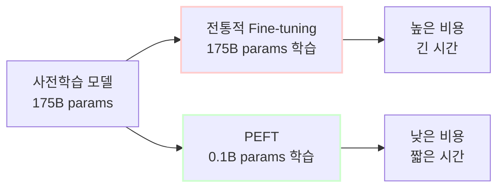
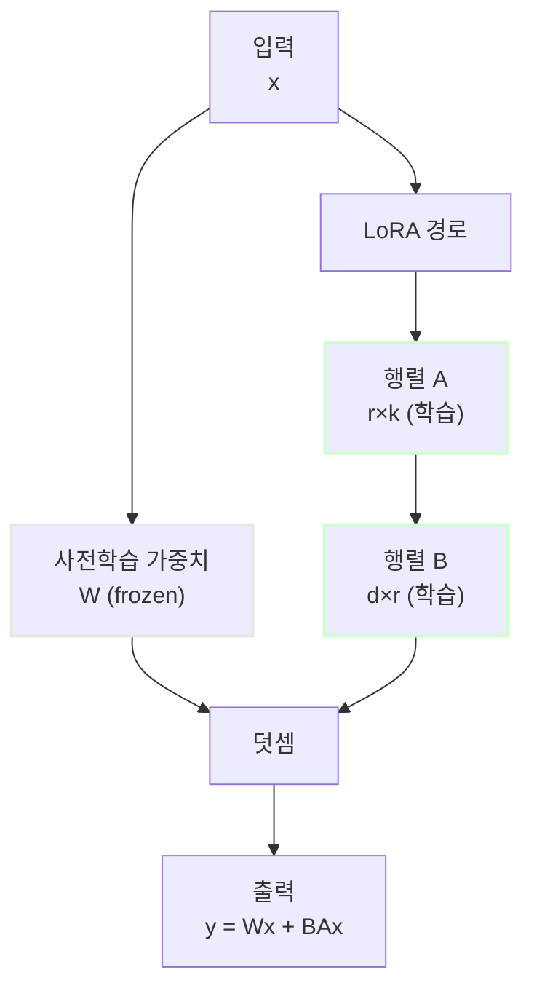
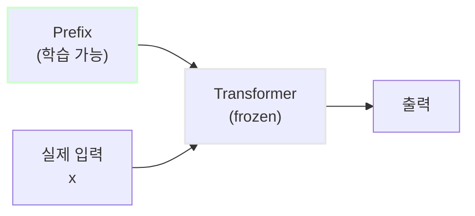
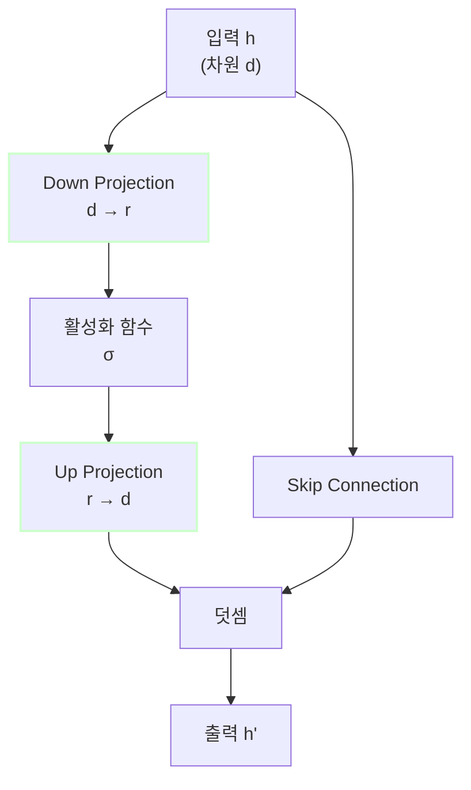
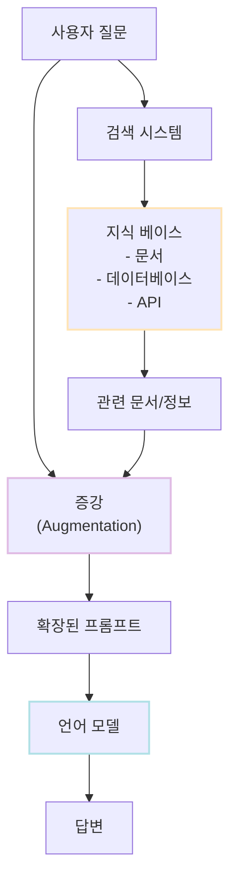
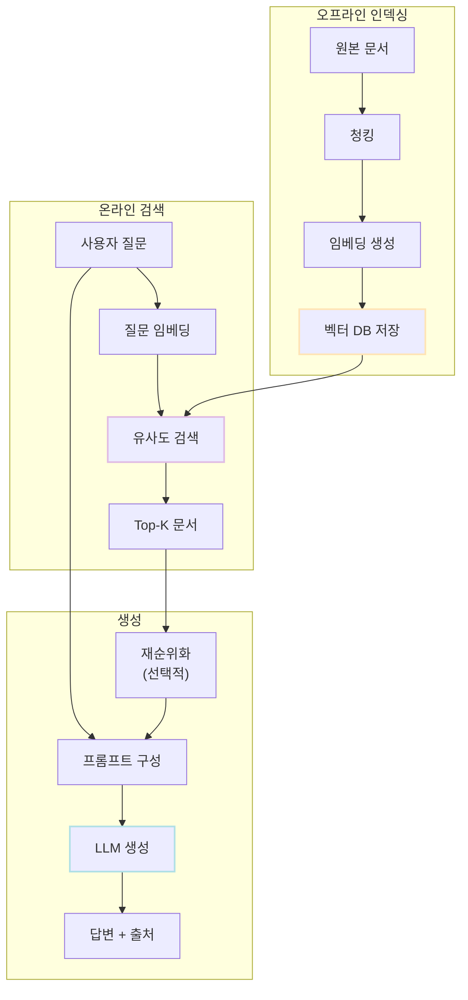
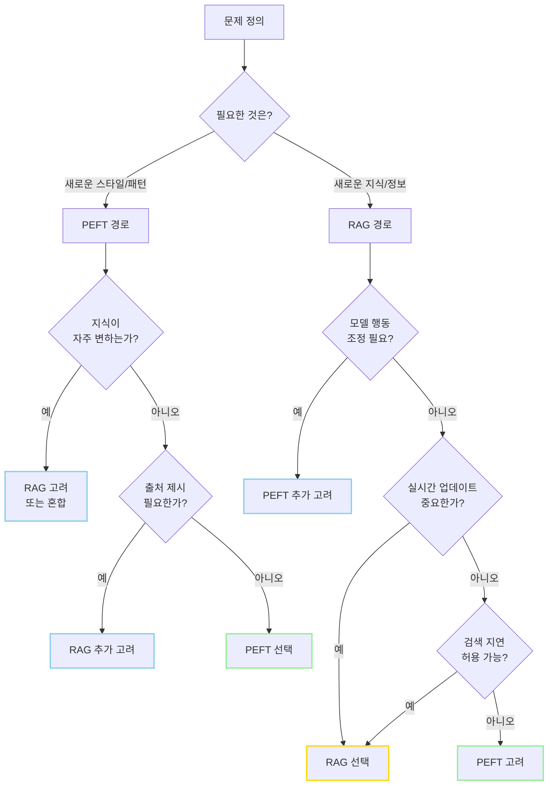

# PEFT와 RAG 완벽 가이드

## 목차

1. [개요](#1-개요)<br/>
2. [PEFT (Parameter-Efficient Fine-Tuning)](#2-peft-parameter-efficient-fine-tuning)<br/>
   - 2.1. [PEFT의 필요성과 배경](#21-peft의-필요성과-배경)<br/>
   - 2.2. [PEFT의 핵심 원리](#22-peft의-핵심-원리)<br/>
   - 2.3. [주요 PEFT 기법](#23-주요-peft-기법)<br/>
     - 2.3.1. [LoRA (Low-Rank Adaptation)](#231-lora-low-rank-adaptation)<br/>
     - 2.3.2. [Prefix Tuning](#232-prefix-tuning)<br/>
     - 2.3.3. [Adapter](#233-adapter)<br/>
   - 2.4. [PEFT 기법 비교](#24-peft-기법-비교)<br/>
   - 2.5. [PEFT 사용 사례](#25-peft-사용-사례)<br/>
3. [RAG (Retrieval-Augmented Generation)](#3-rag-retrieval-augmented-generation)<br/>
   - 3.1. [RAG의 필요성과 배경](#31-rag의-필요성과-배경)<br/>
   - 3.2. [RAG의 핵심 원리](#32-rag의-핵심-원리)<br/>
   - 3.3. [RAG 구성 요소](#33-rag-구성-요소)<br/>
     - 3.3.1. [Retrieval (검색)](#331-retrieval-검색)<br/>
     - 3.3.2. [Augmentation (증강)](#332-augmentation-증강)<br/>
     - 3.3.3. [Generation (생성)](#333-generation-생성)<br/>
   - 3.4. [RAG 파이프라인](#34-rag-파이프라인)<br/>
   - 3.5. [RAG 사용 사례](#35-rag-사용-사례)<br/>
4. [PEFT vs RAG 선택 가이드](#4-peft-vs-rag-선택-가이드)<br/>
   - 4.1. [비교 기준](#41-비교-기준)<br/>
   - 4.2. [의사결정 프로세스](#42-의사결정-프로세스)<br/>
5. [용어 목록](#5-용어-목록)<br/>

---

## 1. 개요

현대 대규모 언어 모델(LLM)을 실무에 적용할 때 두 가지 주요 기술적 도전 과제가 존재합니다.

**첫 번째 도전**: 모델을 특정 도메인이나 태스크에 맞게 조정하는 과정에서 발생하는 막대한 컴퓨팅 비용과 메모리 요구사항

**두 번째 도전**: 모델의 지식 업데이트 주기와 실시간 정보 접근의 한계

이 두 가지 문제를 해결하기 위해 등장한 것이 PEFT와 RAG입니다. 두 기술은 서로 다른 문제를 해결하며, 각각 독립적으로 사용됩니다.

---

## 2. PEFT (Parameter-Efficient Fine-Tuning)

### 2.1. PEFT의 필요성과 배경

전통적인 파인튜닝(Fine-tuning)은 사전 학습된 모델의 모든 파라미터를 업데이트합니다. 예를 들어 GPT-3 (175B 파라미터)를 파인튜닝하려면:

- 필요 메모리: 약 700GB (FP32 기준)
- 학습 시간: 수일에서 수주
- 비용: 수만 달러

PEFT는 전체 파라미터의 0.1~10%만 학습하여 동일하거나 유사한 성능을 달성합니다.



### 2.2. PEFT의 핵심 원리

PEFT는 다음 가정에 기반합니다:

**저차원 부분공간 가설 (Intrinsic Dimensionality Hypothesis)**

사전 학습된 모델을 특정 태스크에 적응시킬 때 필요한 파라미터 변화는 저차원 부분공간에 존재합니다.

수식으로 표현하면:

$$\Delta W = W_{fine-tuned} - W_{pretrained}$$

이때 $\Delta W$는 낮은 intrinsic rank를 가집니다. 즉, 전체 파라미터 공간보다 훨씬 작은 차원에서 효과적인 적응이 가능합니다.

**PEFT의 일반적 전략**:

1. **Additive Methods**: 새로운 파라미터를 추가 (Adapter, Prefix Tuning)
2. **Selective Methods**: 일부 파라미터만 학습 (BitFit)
3. **Reparameterization Methods**: 파라미터를 저차원으로 재표현 (LoRA)

### 2.3. 주요 PEFT 기법

#### 2.3.1. LoRA (Low-Rank Adaptation)

LoRA는 현재 가장 널리 사용되는 PEFT 기법입니다.

**핵심 아이디어**

가중치 행렬의 업데이트를 저랭크 분해(Low-Rank Decomposition)로 표현합니다.

원래 가중치 행렬 $W \in \mathbb{R}^{d \times k}$가 있을 때:

$$W' = W + \Delta W = W + BA$$

여기서:
- $B \in \mathbb{R}^{d \times r}$
- $A \in \mathbb{R}^{r \times k}$
- $r \ll \min(d, k)$ (rank)

**파라미터 절감 계산**

원래 파라미터: $d \times k$

LoRA 파라미터: $d \times r + r \times k = r(d + k)$

예시: $d=4096, k=4096, r=8$
- 원래: 16,777,216 파라미터
- LoRA: 65,536 파라미터 (0.39%)



**LoRA의 장점**

1. 메모리 효율: 학습 파라미터 0.1~1%
2. 추론 지연 없음: $W' = W + BA$를 사전 계산 가능
3. 모듈성: 태스크별로 다른 LoRA 가중치 교체 가능
4. 원본 모델 보존: 사전 학습 가중치 변경 없음

**적용 위치**

Transformer의 Attention 레이어에 주로 적용:
- Query, Key, Value 프로젝션 행렬
- Output 프로젝션 행렬

#### 2.3.2. Prefix Tuning

**핵심 아이디어**

입력 시퀀스 앞에 학습 가능한 연속적인 벡터(prefix)를 추가합니다.

$$h = \text{Transformer}([\text{Prefix}; x])$$

여기서 Prefix는 학습 가능한 파라미터이며, 모델 파라미터는 고정됩니다.

**동작 방식**

1. 각 Transformer 레이어에 prefix 벡터 추가
2. Prefix는 가상의 "토큰"처럼 작동
3. Attention 메커니즘을 통해 실제 입력에 영향

**파라미터 계산**

Prefix 길이 $l$, 레이어 수 $L$, 히든 차원 $d$:

$$\text{파라미터 수} = L \times l \times d$$

예시: $L=24, l=20, d=1024$
- Prefix Tuning: 491,520 파라미터



**장점**

1. 극도로 적은 파라미터 (0.01~0.1%)
2. 배치 내 다른 태스크 병렬 처리 가능
3. 생성 태스크에 효과적

**단점**

1. 긴 prefix는 입력 시퀀스 길이 감소
2. 최적 prefix 길이 찾기 어려움
3. 추론 시 항상 prefix 연산 필요

#### 2.3.3. Adapter

**핵심 아이디어**

Transformer 레이어 사이에 작은 병목 구조의 신경망 모듈을 삽입합니다.

**Adapter 구조**

$$h' = h + \text{Adapter}(h)$$

Adapter 내부:

$$\text{Adapter}(h) = W_{up} \cdot \sigma(W_{down} \cdot h)$$

여기서:
- $W_{down} \in \mathbb{R}^{d \times r}$: 다운 프로젝션
- $W_{up} \in \mathbb{R}^{r \times d}$: 업 프로젝션
- $r \ll d$: 병목 차원
- $\sigma$: 비선형 활성화 함수 (ReLU, GELU)



**삽입 위치**

각 Transformer 블록에서:
1. Multi-Head Attention 이후
2. Feed-Forward Network 이후

**파라미터 계산**

레이어당: $2 \times d \times r + r$ (bias 포함)

예시: $d=768, r=64, L=12$
- Adapter: 1,179,648 파라미터

**장점**

1. 원본 모델 구조 유지
2. 모듈식 설계로 태스크별 교체 용이
3. 안정적인 학습

**단점**

1. 추론 시 추가 연산 발생 (10~20% 지연)
2. LoRA보다 상대적으로 많은 파라미터

### 2.4. PEFT 기법 비교

| 기법 | 학습 파라미터 비율 | 추론 지연 | 메모리 효율 | 성능 | 구현 난이도 | 태스크 전환 |
|------|-------------------|----------|------------|------|------------|-----------|
| LoRA | 0.1~1% | 없음 | 매우 높음 | 높음 | 낮음 | 매우 쉬움 |
| Prefix Tuning | 0.01~0.1% | 있음 (소폭) | 극도로 높음 | 중~높음 | 중간 | 쉬움 |
| Adapter | 0.5~5% | 있음 (중간) | 높음 | 높음 | 낮음 | 쉬움 |

**선택 기준**

```mermaid
graph TD
    Start["PEFT 기법 선택"] --> Q1{"추론 속도가<br/>중요한가?"}
    Q1 -->|예| Q2{"극도의 메모리<br/>절약 필요?"}
    Q1 -->|아니오| Q3{"생성 태스크인가?"}
    
    Q2 -->|예| LoRA["LoRA 선택"]
    Q2 -->|아니오| LoRA
    
    Q3 -->|예| Prefix["Prefix Tuning<br/>고려"]
    Q3 -->|아니오| Q4{"모듈성이<br/>중요한가?"}
    
    Q4 -->|예| Adapter["Adapter 선택"]
    Q4 -->|아니오| LoRA2["LoRA 선택<br/>(기본 추천)"]
    
    style LoRA stroke-width:2px,stroke:#90EE90
    style LoRA2 stroke-width:2px,stroke:#90EE90
    style Prefix stroke-width:2px,stroke:#FFD700
    style Adapter stroke-width:2px,stroke:#87CEEB
```



### 2.5. PEFT 사용 사례

**사례 1: 고객 서비스 챗봇 (LoRA)**

**상황**: 일반 LLM을 회사 특화 고객 서비스에 적용

**요구사항**:
- 회사 정책, 제품 지식 학습
- 적은 학습 데이터 (1,000~5,000 샘플)
- 빠른 응답 속도 필수

**솔루션**: LoRA 적용
- Base: LLaMA-2 7B
- LoRA rank: 16
- 학습 파라미터: 4.2M (0.06%)
- 학습 시간: 2시간 (V100 1개)

**결과**:
- 고객 만족도 15% 증가
- 응답 정확도 92%
- 추론 지연 0ms 추가

**사례 2: 다국어 번역 서비스 (Adapter)**

**상황**: 하나의 모델로 20개 언어쌍 지원

**요구사항**:
- 언어쌍별 빠른 전환
- 언어별 독립적 업데이트
- 안정적인 성능

**솔루션**: 언어쌍별 Adapter
- Base: mT5-large
- Adapter 차원: 64
- 언어쌍당 파라미터: 1.5M

**결과**:
- 20개 언어쌍을 300MB에 저장
- 언어 전환 시간: 50ms
- BLEU 스코어 평균 +3.2

**사례 3: 코드 생성 (Prefix Tuning)**

**상황**: 프로그래밍 언어별 코드 생성

**요구사항**:
- 매우 적은 메모리 사용
- 동시에 여러 언어 처리
- 생성 품질 유지

**솔루션**: 언어별 Prefix
- Base: CodeGen 6B
- Prefix 길이: 20
- 언어당 파라미터: 500K

**결과**:
- 10개 언어를 5MB에 저장
- Pass@1 정확도 평균 68%
- 배치 처리로 처리량 3배 증가

---

## 3. RAG (Retrieval-Augmented Generation)

### 3.1. RAG의 필요성과 배경

대규모 언어 모델은 두 가지 근본적인 한계를 가집니다:

**한계 1: 지식 고정성 (Knowledge Cutoff)**

모델은 학습 시점까지의 데이터만 알고 있습니다. 학습 이후 발생한 사건, 업데이트된 정보는 알지 못합니다.

**한계 2: 환각 (Hallucination)**

모델은 그럴듯하지만 사실이 아닌 정보를 생성할 수 있습니다. 특히 잘 모르는 주제에서 빈번합니다.

**한계 3: 도메인 특화 지식**

일반적인 LLM은 회사 내부 문서, 전문 분야 지식, 개인 데이터에 접근할 수 없습니다.

RAG는 외부 지식 베이스를 실시간으로 검색하여 이러한 한계를 극복합니다.



### 3.2. RAG의 핵심 원리

RAG는 생성 모델을 비모수적 지식 베이스(Non-parametric Knowledge Base)와 결합합니다.

**전통적 LLM**:
$$P(y|x) = \text{LLM}(x)$$

**RAG**:
$$P(y|x) = \text{LLM}(x, \text{retrieve}(x))$$

여기서 $\text{retrieve}(x)$는 질문 $x$와 관련된 외부 문서를 검색하는 함수입니다.

**RAG의 3단계 프로세스**:

1. **Retrieval**: 질문과 관련된 문서 검색
2. **Augmentation**: 검색된 문서를 질문과 결합
3. **Generation**: 증강된 입력으로 답변 생성

### 3.3. RAG 구성 요소

#### 3.3.1. Retrieval (검색)

검색 단계는 질문과 의미적으로 유사한 문서를 찾습니다.

**임베딩 기반 검색**

문서와 질문을 벡터 공간에 매핑합니다:

$$\text{similarity}(q, d) = \cos(\mathbf{e}_q, \mathbf{e}_d) = \frac{\mathbf{e}_q \cdot \mathbf{e}_d}{||\mathbf{e}_q|| \cdot ||\mathbf{e}_d||}$$

여기서:
- $\mathbf{e}_q$: 질문 임베딩 벡터
- $\mathbf{e}_d$: 문서 임베딩 벡터

**검색 프로세스**

1. 오프라인 인덱싱:
   - 문서를 청크(chunk)로 분할
   - 각 청크를 임베딩 모델로 벡터화
   - 벡터 데이터베이스에 저장

2. 온라인 검색:
   - 질문을 임베딩으로 변환
   - 벡터 DB에서 유사도 기반 Top-K 검색
   - 관련 문서 청크 반환

**주요 벡터 데이터베이스**

- Pinecone: 클라우드 기반, 확장성 높음
- Weaviate: 오픈소스, 하이브리드 검색
- FAISS: Facebook AI, 로컬 사용
- Chroma: 경량, 개발 편의성

**청킹 전략**

문서를 효과적으로 나누는 방법:

1. **고정 크기**: 500~1000 토큰 단위
2. **문장 기반**: 의미 단위 유지
3. **슬라이딩 윈도우**: 중첩으로 문맥 보존
4. **의미 기반**: 주제별 분할

#### 3.3.2. Augmentation (증강)

검색된 문서를 질문과 결합하여 LLM에 제공합니다.

**기본 프롬프트 구조**

```
Context:
[검색된 문서 1]
[검색된 문서 2]
...

Question: [사용자 질문]

Answer:
```

**고급 증강 기법**

1. **재순위화 (Re-ranking)**
   - 초기 검색 결과를 더 정교한 모델로 재평가
   - Cross-encoder로 질문-문서 관련성 재점수화

2. **문서 압축**
   - 긴 문서를 요약하여 토큰 절약
   - 관련 없는 부분 제거

3. **메타데이터 활용**
   - 문서 출처, 날짜, 신뢰도 점수 포함
   - LLM이 출처별 가중치 조정 가능

#### 3.3.3. Generation (생성)

증강된 프롬프트로 LLM이 답변을 생성합니다.

**생성 시 고려사항**

1. **인용 (Citation)**
   - 답변에 출처 명시
   - 투명성과 검증 가능성 확보

2. **충돌 해결**
   - 여러 문서가 상충할 때 처리 전략
   - 최신성, 신뢰도 기반 우선순위

3. **환각 완화**
   - 문서에 없는 내용 생성 방지
   - "제공된 정보에 근거하면..." 형식 사용

### 3.4. RAG 파이프라인

전체 RAG 시스템의 데이터 흐름:



**파이프라인 최적화 포인트**

1. **임베딩 모델 선택**
   - BGE, E5, Instructor 등
   - 도메인 특화 파인튜닝 고려

2. **검색 매개변수**
   - Top-K 값 (보통 3~10)
   - 유사도 임계값

3. **프롬프트 엔지니어링**
   - 문서 배치 순서
   - 지시문 명확성

4. **캐싱**
   - 자주 묻는 질문 캐싱
   - 임베딩 캐싱

### 3.5. RAG 사용 사례

**사례 1: 기업 내부 지식베이스 Q&A**

**상황**: 5,000개 이상의 내부 문서를 가진 IT 회사

**요구사항**:
- 직원이 정책, 절차, 기술 문서에 빠르게 접근
- 정확한 출처 제공
- 실시간 문서 업데이트 반영

**솔루션**:
- 문서 저장: Confluence, Google Docs
- 벡터 DB: Pinecone
- 임베딩: text-embedding-3-large
- LLM: GPT-4
- 청크 크기: 512 토큰, 128 토큰 중첩

**결과**:
- 정보 검색 시간 80% 감소
- 답변 정확도 94%
- 월간 10만 쿼리 처리

**사례 2: 의료 진단 보조 시스템**

**상황**: 최신 의학 논문과 가이드라인 기반 진단 지원

**요구사항**:
- 최신 연구 결과 반영 (월 수천 편 논문)
- 높은 정확도와 신뢰성
- 명확한 근거 제시

**솔루션**:
- 지식 소스: PubMed, 임상 가이드라인
- 하이브리드 검색: 키워드 + 시맨틱
- 전문 용어 임베딩 파인튜닝
- 재순위화로 최신성 가중치

**결과**:
- 진단 제안 정확도 89%
- 의사 결정 시간 40% 단축
- 모든 답변에 논문 출처 포함

**사례 3: 고객 지원 챗봇**

**상황**: 전자상거래 플랫폼의 24시간 고객 지원

**요구사항**:
- 제품 정보, 주문 상태, 반품 정책 등
- 다양한 질문 유형 처리
- 빠른 응답 (3초 이내)

**솔루션**:
- 멀티 소스: 제품 DB + FAQ + 정책 문서
- 벡터 DB: Weaviate (하이브리드 검색)
- 임베딩 캐싱으로 속도 향상
- 폴백: 검색 실패 시 에스컬레이션

**결과**:
- 고객 문의 70% 자동 해결
- 평균 응답 시간 2.1초
- 고객 만족도 4.6/5.0

**사례 4: 법률 문서 분석**

**상황**: 로펌의 판례 및 법령 검색

**요구사항**:
- 수만 건의 판례에서 관련 사례 찾기
- 법률 용어의 정확한 해석
- 시간순 추이 분석

**솔루션**:
- 법률 전문 임베딩 모델
- 메타데이터: 날짜, 법원, 판결 결과
- 시간 가중 검색 알고리즘
- 인용 네트워크 활용

**결과**:
- 사례 검색 시간 90% 단축
- 관련 판례 발견율 95%
- 변호사당 생산성 2배 증가

---

## 4. PEFT vs RAG 선택 가이드

### 4.1. 비교 기준

PEFT와 RAG는 서로 다른 문제를 해결하는 독립적인 기술입니다.

| 비교 항목 | PEFT | RAG |
|----------|------|-----|
| **해결 문제** | 모델 행동/스타일 적응 | 지식 접근 및 업데이트 |
| **주요 사용 목적** | 특정 도메인/태스크 특화 | 최신 정보 제공, 외부 지식 활용 |
| **지식 소스** | 모델 파라미터 (내재화) | 외부 데이터베이스 (명시적) |
| **업데이트 비용** | 재학습 필요 (수시간~수일) | 문서 추가만 (즉시) |
| **추론 비용** | 낮음 | 중간~높음 (검색 오버헤드) |
| **정확도 근거** | 없음 (블랙박스) | 명확함 (출처 제시) |
| **초기 구축 비용** | 학습 데이터 준비 + 학습 | 문서 준비 + 인덱싱 |
| **운영 복잡도** | 낮음 | 중간 (검색 시스템 관리) |
| **적용 범위** | 도메인 언어, 응답 패턴 | 사실 정보, 최신 지식 |

**핵심 차이점**

PEFT는 "모델에게 새로운 행동을 가르치는 것"이고, RAG는 "모델에게 참고 자료를 제공하는 것"입니다.

### 4.2. 의사결정 프로세스



**시나리오별 선택 가이드**

| 시나리오 | 추천 기술 | 이유 |
|---------|----------|------|
| 의료 챗봇 (진단 보조) | RAG | 최신 논문, 가이드라인 필요. 출처 중요 |
| 의료 챗봇 (환자 응대) | PEFT | 공감적 어조, 의료 용어 사용 패턴 학습 |
| 법률 문서 작성 | PEFT | 법률 문서 특유의 문체와 구조 학습 |
| 법률 판례 검색 | RAG | 방대한 판례 DB 접근, 출처 필수 |
| 코드 생성 (특정 스타일) | PEFT | 회사 코딩 컨벤션, 패턴 학습 |
| 코드 생성 (API 문서) | RAG | 최신 API 문서, 예제 코드 참조 |
| 감성 분석 (특정 도메인) | PEFT | 도메인 특화 표현, 뉘앙스 학습 |
| 뉴스 요약 | RAG | 실시간 뉴스 기사 접근 |
| 번역 (전문 분야) | PEFT | 전문 용어, 문체 일관성 |
| 번역 (용어집 적용) | RAG | 회사 용어집, 번역 메모리 참조 |
| FAQ 챗봇 | RAG | FAQ DB 직접 검색, 정확한 답변 |
| 브랜드 톤앤매너 챗봇 | PEFT | 브랜드 보이스, 응답 스타일 학습 |

**혼합 사용 사례**

PEFT와 RAG를 함께 사용하는 경우:

1. **고급 고객 서비스**
   - RAG: 제품 정보, 정책 검색
   - PEFT: 브랜드 특화 응대 방식

2. **전문가 시스템**
   - RAG: 최신 연구, 데이터 접근
   - PEFT: 전문 분야 용어, 추론 패턴

3. **콘텐츠 생성**
   - RAG: 사실 정보, 통계 검색
   - PEFT: 특정 작가 스타일, 포맷

**선택 체크리스트**

PEFT를 선택하려면:
- [ ] 특정 스타일이나 패턴을 학습해야 함
- [ ] 학습 데이터를 확보할 수 있음
- [ ] 지식이 상대적으로 정적임
- [ ] 추론 지연이 중요함
- [ ] 출처 제시가 필수가 아님

RAG를 선택하려면:
- [ ] 최신 정보 접근이 필요함
- [ ] 방대한 문서 DB가 있음
- [ ] 출처 투명성이 중요함
- [ ] 지식이 자주 업데이트됨
- [ ] 검색 지연을 감수할 수 있음

---

## 5. 용어 목록

| 용어 | 설명 |
|------|------|
| Adapter | Transformer 레이어 사이에 삽입되는 작은 병목 구조의 신경망 모듈 |
| Additive Methods | 원본 모델에 새로운 파라미터를 추가하는 PEFT 방식 |
| Augmentation | RAG에서 검색된 문서를 질문과 결합하는 단계 |
| Attention Mechanism | Transformer의 핵심 구조로 입력 시퀀스 내 관계를 학습 |
| Base Model | 사전 학습된 원본 대규모 언어 모델 |
| BLEU Score | 기계 번역 품질 평가 지표 |
| Bottleneck Dimension | Adapter나 저랭크 분해에서 사용되는 축소된 중간 차원 |
| Chunk | 문서를 검색 가능한 단위로 나눈 조각 |
| Citation | 답변의 출처를 명시하는 것 |
| Cross-Encoder | 질문과 문서를 함께 입력받아 관련성을 평가하는 모델 |
| Embedding | 텍스트를 고차원 벡터 공간에 매핑한 표현 |
| FAISS | Facebook AI Similarity Search, 벡터 검색 라이브러리 |
| Fine-tuning | 사전 학습된 모델을 특정 태스크에 맞게 추가 학습 |
| Frozen | 학습 중 업데이트되지 않도록 고정된 파라미터 |
| Generation | RAG에서 증강된 입력으로 답변을 생성하는 단계 |
| Hallucination | LLM이 사실이 아닌 그럴듯한 정보를 생성하는 현象 |
| Hybrid Search | 키워드 검색과 시맨틱 검색을 결합한 방법 |
| Indexing | 문서를 검색 가능한 형태로 가공하여 저장하는 과정 |
| Intrinsic Dimensionality | 고차원 데이터가 실제로 존재하는 저차원 부분공간 |
| Knowledge Cutoff | 모델이 학습한 데이터의 시간적 한계 |
| LoRA | Low-Rank Adaptation, 저랭크 분해를 이용한 PEFT 기법 |
| Low-Rank Decomposition | 큰 행렬을 두 개의 작은 행렬의 곱으로 근사하는 기법 |
| Non-parametric Knowledge | 모델 파라미터가 아닌 외부에 명시적으로 저장된 지식 |
| PEFT | Parameter-Efficient Fine-Tuning, 파라미터 효율적 파인튜닝 |
| Prefix | 입력 시퀀스 앞에 추가되는 학습 가능한 벡터 시퀀스 |
| Prefix Tuning | Prefix를 학습하는 PEFT 기법 |
| RAG | Retrieval-Augmented Generation, 검색 증강 생성 |
| Rank | 행렬의 선형 독립인 행 또는 열의 최대 개수 |
| Re-ranking | 초기 검색 결과를 더 정교한 방법으로 재정렬 |
| Reparameterization Methods | 파라미터를 다른 형태로 재표현하는 PEFT 방식 |
| Retrieval | RAG에서 질문과 관련된 문서를 검색하는 단계 |
| Selective Methods | 모델의 일부 파라미터만 선택적으로 학습하는 PEFT 방식 |
| Semantic Search | 의미 기반 검색, 키워드가 아닌 의미적 유사도로 검색 |
| Skip Connection | 입력을 출력에 직접 더하는 잔차 연결 |
| Sliding Window | 중첩을 두고 이동하면서 데이터를 분할하는 방법 |
| Top-K | 유사도 기준 상위 K개 결과 선택 |
| Transformer | Attention 메커니즘 기반의 신경망 아키텍처 |
| Vector Database | 벡터 임베딩을 저장하고 유사도 검색을 지원하는 DB |
