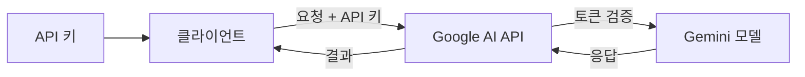
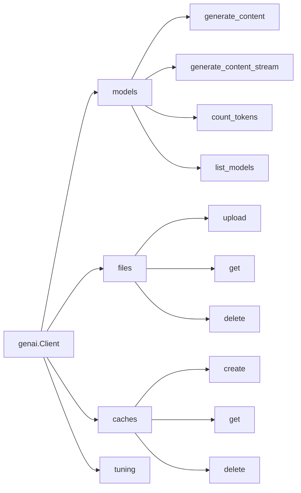
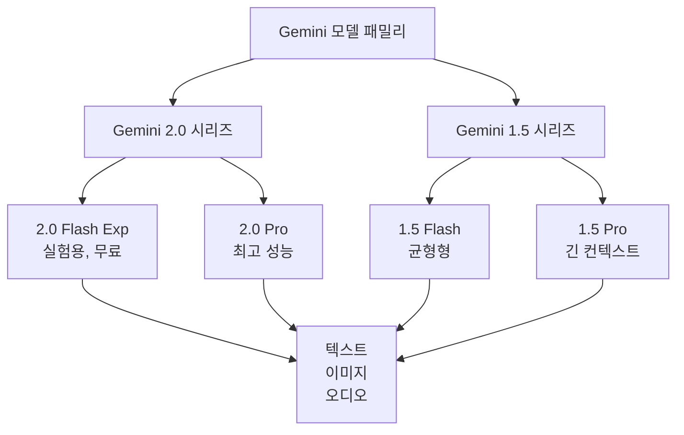
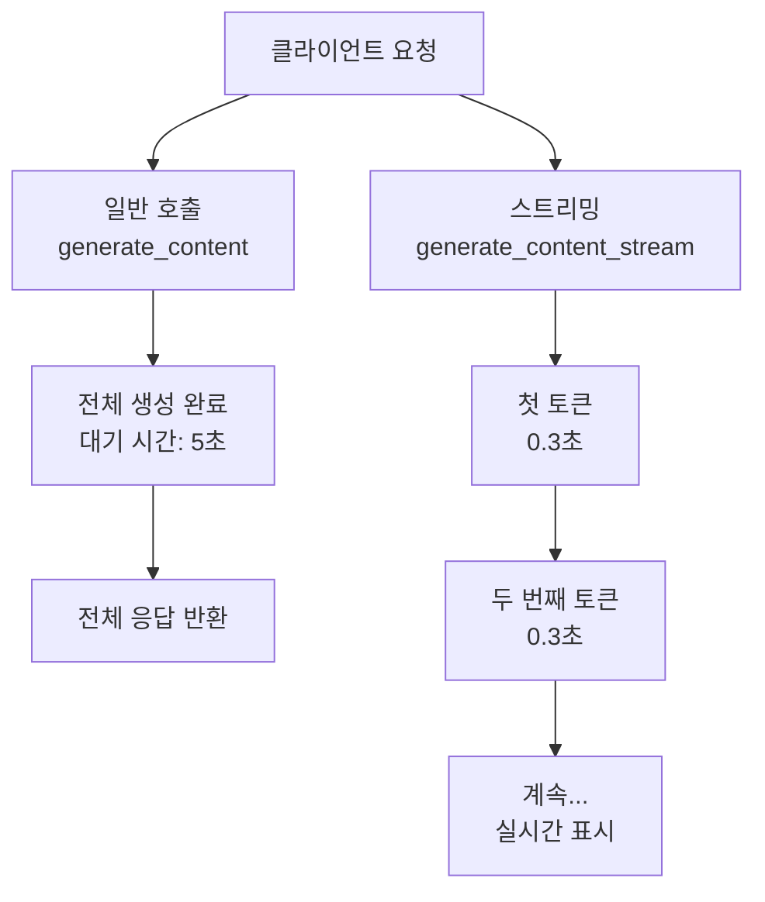
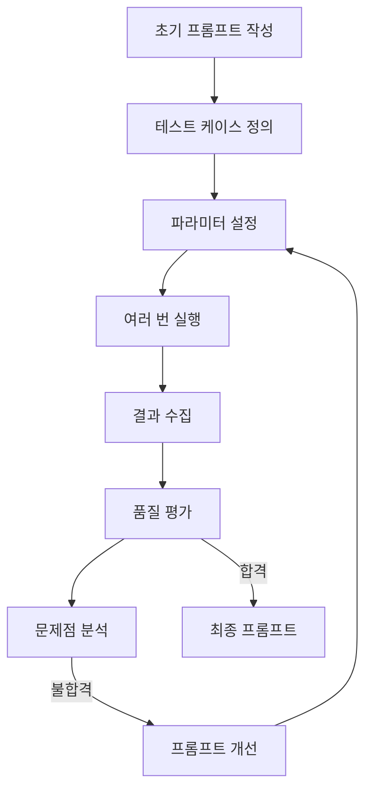
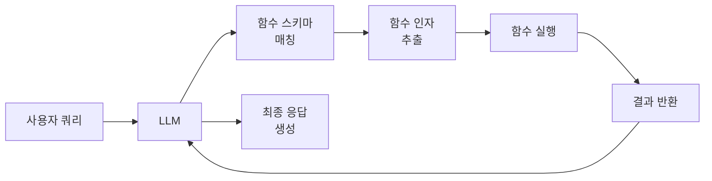
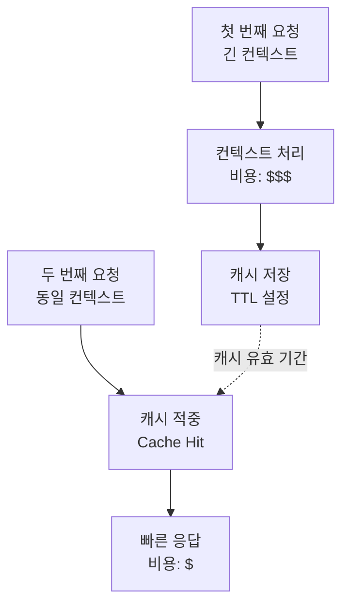
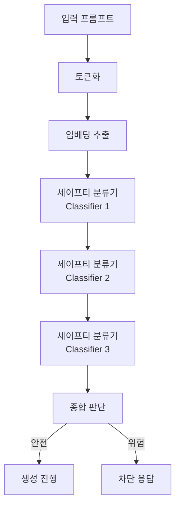
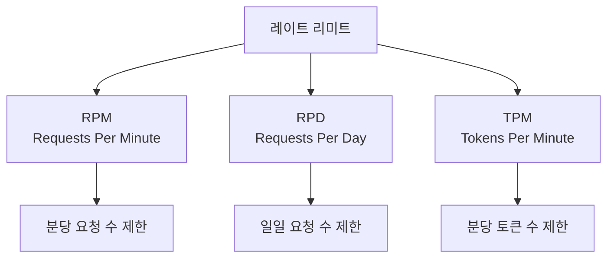

# Google GenAI 라이브러리 - 프롬프트 테스트 가이드

> AI 엔지니어 학생을 위한 실전 프롬프트 실험 가이드

---

## 목차

1. [Google GenAI 개요](#1-google-genai-개요)<br/>
   - 1.1. [GenAI 라이브러리란?](#11-genai-라이브러리란)<br/>
   - 1.2. [기존 google-generativeai와의 차이점](#12-기존-google-generativeai와의-차이점)<br/>
   - 1.3. [주요 특징](#13-주요-특징)<br/>
   - 1.4. [학습자 관점의 활용 시나리오](#14-학습자-관점의-활용-시나리오)<br/>

2. [환경 설정](#2-환경-설정)<br/>
   - 2.1. [설치 및 의존성](#21-설치-및-의존성)<br/>
   - 2.2. [API 키 발급 및 설정](#22-api-키-발급-및-설정)<br/>
   - 2.3. [인증 메커니즘](#23-인증-메커니즘)<br/>

3. [핵심 API 구조](#3-핵심-api-구조)<br/>
   - 3.1. [클라이언트 아키텍처](#31-클라이언트-아키텍처)<br/>
   - 3.2. [모델 계층 구조](#32-모델-계층-구조)<br/>
   - 3.3. [주요 파라미터](#33-주요-파라미터)<br/>
     - 3.3.1. [temperature, top_p, top_k의 수학적 배경](#331-temperature-top_p-top_k의-수학적-배경)<br/>
     - 3.3.2. [max_tokens와 토큰 계산](#332-max_tokens와-토큰-계산)<br/>
     - 3.3.3. [safety_settings](#333-safety_settings)<br/>

4. [기본 사용법](#4-기본-사용법)<br/>
   - 4.1. [텍스트 생성](#41-텍스트-생성)<br/>
   - 4.2. [스트리밍 응답](#42-스트리밍-응답)<br/>
   - 4.3. [멀티모달 입력](#43-멀티모달-입력)<br/>
   - 4.4. [채팅 세션 관리](#44-채팅-세션-관리)<br/>

5. [프롬프트 엔지니어링 실전](#5-프롬프트-엔지니어링-실전)<br/>
   - 5.1. [시스템 인스트럭션 활용](#51-시스템-인스트럭션-활용)<br/>
   - 5.2. [Few-shot 프롬프트 구성](#52-few-shot-프롬프트-구성)<br/>
   - 5.3. [JSON 모드와 구조화된 출력](#53-json-모드와-구조화된-출력)<br/>
   - 5.4. [프롬프트 테스트 워크플로우](#54-프롬프트-테스트-워크플로우)<br/>

6. [고급 기능](#6-고급-기능)<br/>
   - 6.1. [함수 호출 메커니즘](#61-함수-호출-메커니즘)<br/>
   - 6.2. [컨텍스트 캐싱 원리](#62-컨텍스트-캐싱-원리)<br/>
   - 6.3. [세이프티 필터 작동 방식](#63-세이프티-필터-작동-방식)<br/>

7. [에러 핸들링 및 베스트 프랙티스](#7-에러-핸들링-및-베스트-프랙티스)<br/>
   - 7.1. [예외 처리 패턴](#71-예외-처리-패턴)<br/>
   - 7.2. [레이트 리미트 이해](#72-레이트-리미트-이해)<br/>
   - 7.3. [비용 최적화 전략](#73-비용-최적화-전략)<br/>

8. [학습용 간단 예제](#8-학습용-간단-예제)<br/>
   - 8.1. [질의응답 프롬프트 테스트](#81-질의응답-프롬프트-테스트)<br/>
   - 8.2. [이미지 설명 생성](#82-이미지-설명-생성)<br/>
   - 8.3. [프롬프트 비교 실험](#83-프롬프트-비교-실험)<br/>

9. [용어 목록](#9-용어-목록)<br/>

---

## 1. Google GenAI 개요

### 1.1. GenAI 라이브러리란?

**Google GenAI**는 구글의 제미나이(Gemini) 모델 패밀리에 접근하기 위한 최신 파이썬(Python) SDK로, 2024년 후반에 공식 출시되었다.<br/>
이 라이브러리는 개발자와 연구자가 대규모 언어모델(LLM)의 기능을 간편하게 활용할 수 있도록 설계되었다.

**핵심 목적:**
- 제미나이 모델과의 통합 인터페이스(Interface) 제공
- 텍스트, 이미지, 오디오 등 멀티모달(Multimodal) 입력 지원
- 프롬프트 엔지니어링 실험을 위한 유연한 파라미터 제어
- 프로덕션(Production) 환경과 학습 환경 모두 지원

**제미나이 모델 패밀리 (2025년 기준):**

| 모델명 | 버전 | 특징 | 학습자 적합도 |
|--------|------|------|--------------|
| **Gemini 2.0 Flash Exp** | 실험(Experimental) | 최신 기능, 무료 티어, 빠른 응답 | ⭐⭐⭐⭐⭐ |
| Gemini 1.5 Flash | 안정(Stable) | 균형잡힌 성능, 낮은 레이턴시(Latency) | ⭐⭐⭐⭐ |
| Gemini 1.5 Pro | 안정(Stable) | 고성능, 긴 컨텍스트 윈도우 | ⭐⭐⭐ |
| Gemini 2.0 Pro | 최신(Latest) | 최고 성능, 프로덕션용 | ⭐⭐ |

**학습자 추천**: `gemini-2.0-flash-exp` - 무료 할당량이 크고 최신 기능을 테스트할 수 있음

### 1.2. 기존 google-generativeai와의 차이점

구글은 2023년부터 `google-generativeai` 라이브러리를 제공했으나, 2024년 후반 `google-genai`를 새롭게 출시하며 아키텍처를 대폭 개선했다.

**주요 차이점:**

| 측면 | google-generativeai (레거시) | google-genai (최신) |
|------|---------------------------|---------------------|
| **패키지 구조** | 단일 모듈 중심 | 객체지향 클라이언트 패턴 |
| **초기화 방식** | `genai.configure()` | `client = genai.Client()` |
| **API 호출** | 전역 함수 스타일 | 메서드 체이닝(Method Chaining) |
| **타입 힌팅** | 제한적 | 완전한 타입 안전성 |
| **비동기 지원** | 부분적 | 네이티브 async/await |
| **에러 핸들링** | 일반 예외 | 구조화된 예외 계층 |
| **문서화** | 분산된 레퍼런스 | 통합 API 문서 |

**마이그레이션(Migration) 예시:**

```python
# 레거시 방식 (google-generativeai)
import google.generativeai as genai
genai.configure(api_key='KEY')
model = genai.GenerativeModel('gemini-pro')
response = model.generate_content('Hello')

# 최신 방식 (google-genai)
from google import genai
client = genai.Client(api_key='KEY')
response = client.models.generate_content(
    model='gemini-2.0-flash-exp',
    contents='Hello'
)
```

### 1.3. 주요 특징

**1. 통합 클라이언트 인터페이스**

단일 클라이언트 객체를 통해 모든 모델과 기능에 접근할 수 있다. 이는 코드의 일관성을 높이고 의존성 관리를 단순화한다.

**2. 강력한 타입 시스템**

파이썬의 타입 힌팅(Type Hinting)을 완전히 활용하여 IDE(통합 개발 환경)의 자동완성과 오류 검출 기능을 지원한다.

**3. 멀티모달 네이티브 지원**

텍스트, 이미지, 오디오를 동일한 API로 처리할 수 있으며, 파일 업로드와 인라인(Inline) 데이터 모두 지원한다.

**4. 세밀한 설정 제어**

프롬프트 엔지니어링 실험을 위해 temperature, top_k, top_p 등의 파라미터를 세밀하게 조정할 수 있다.

**5. 스트리밍 퍼스트 디자인**

기본적으로 스트리밍 응답을 지원하여 실시간 사용자 경험을 제공할 수 있다.

**6. 컨텍스트 캐싱**

긴 프롬프트의 반복 사용 시 비용을 절감할 수 있는 캐싱 메커니즘을 내장했다.

### 1.4. 학습자 관점의 활용 시나리오

**프롬프트 엔지니어링 실험실**

GenAI 라이브러리는 학생들이 프롬프트 엔지니어링 이론을 실제로 테스트할 수 있는 이상적인 환경을 제공한다.

**활용 시나리오:**

1. **파라미터 실험**: 동일한 프롬프트에 대해 temperature 값을 변경하며 출력의 창의성 변화 관찰
2. **Few-shot 학습 검증**: 예시 개수에 따른 성능 변화 측정
3. **Chain-of-Thought 비교**: CoT 프롬프팅과 일반 프롬프팅의 추론 품질 비교
4. **멀티모달 이해**: 이미지와 텍스트를 결합한 프롬프트 실험
5. **세이프티 필터 이해**: 다양한 입력에 대한 안전성 필터링 동작 관찰

**학습 프로젝트 아이디어:**
- 프롬프트 품질 평가 도구 개발
- 다양한 프롬프트 기법의 벤치마킹(Benchmarking)
- 도메인별 최적 프롬프트 패턴 발견
- 할루시네이션(Hallucination) 감소 기법 연구

---

## 2. 환경 설정

### 2.1. 설치 및 의존성

**시스템 요구사항:**
- Python 3.9 이상
- pip 또는 poetry 패키지 매니저(Manager)
- 인터넷 연결 (API 호출용)

**설치 명령:**

```bash
# pip를 사용한 설치
pip install google-genai

# 특정 버전 설치
pip install google-genai==0.3.0

# 개발 의존성 포함 설치
pip install google-genai[dev]
```

**주요 의존성 라이브러리:**
- `google-auth`: 구글 클라우드 인증
- `protobuf`: 프로토콜(Protocol) 버퍼 직렬화(Serialization)
- `requests`: HTTP 클라이언트
- `typing-extensions`: 확장 타입 지원

**설치 확인:**

```python
from google import genai
print(genai.__version__)  # 예: 0.3.0
```

### 2.2. API 키 발급 및 설정

**API 키 발급 절차:**

1. **Google AI Studio 접속**: https://makersuite.google.com/app/apikey
2. **"Create API Key" 버튼 클릭**
3. **기존 GCP 프로젝트 선택 또는 신규 생성**
4. **생성된 API 키 복사 및 안전하게 보관**

**무료 할당량 (2025년 10월 기준):**

| 모델 | 분당 요청 수 | 일일 요청 수 | 분당 토큰 수 |
|------|-------------|-------------|-------------|
| Gemini 2.0 Flash Exp | 15 RPM | 1,500 RPD | 1M TPM |
| Gemini 1.5 Flash | 15 RPM | 1,500 RPD | 1M TPM |
| Gemini 1.5 Pro | 2 RPM | 50 RPD | 32K TPM |

> **RPM**: Requests Per Minute (분당 요청)  
> **RPD**: Requests Per Day (일일 요청)  
> **TPM**: Tokens Per Minute (분당 토큰)

**API 키 설정 방법:**

**방법 1: 환경 변수 사용 (권장)**

```bash
# Linux/macOS
export GOOGLE_API_KEY='your_api_key_here'

# Windows
set GOOGLE_API_KEY=your_api_key_here
```

```python
import os
from google import genai

# 환경 변수에서 자동 로드
client = genai.Client(api_key=os.getenv('GOOGLE_API_KEY'))
```

**방법 2: 코드에 직접 명시 (학습용)**

```python
from google import genai

# 주의: 프로덕션에서는 절대 사용 금지
client = genai.Client(api_key='AIzaSy...')
```

**방법 3: 설정 파일 사용**

```python
# config.json
{
  "api_key": "AIzaSy..."
}

# 코드
import json
from google import genai

with open('config.json') as f:
    config = json.load(f)

client = genai.Client(api_key=config['api_key'])
```

### 2.3. 인증 메커니즘

GenAI 라이브러리는 두 가지 인증 방식을 지원한다.

**1. API 키 기반 인증 (간단, 학습용)**

가장 간단한 방식으로, 단일 API 키로 모든 요청을 인증한다.



**특징:**
- 설정이 간단함
- 개인 프로젝트에 적합
- 키 노출 위험 존재
- 세밀한 권한 제어 불가

**2. OAuth 2.0 기반 인증 (프로덕션용)**

구글 클라우드 서비스 계정(Service Account)을 사용한 고급 인증 방식이다.

```python
from google import genai
from google.auth import default

# 자동으로 Application Default Credentials 사용
credentials, project = default()
client = genai.Client(credentials=credentials)
```

**특징:**
- 엔터프라이즈(Enterprise) 환경에 적합
- 세밀한 IAM 권한 제어 가능
- 자동 토큰 갱신
- 설정이 복잡함

**인증 플로우 비교:**

| 인증 방식 | 설정 난이도 | 보안 수준 | 적합한 환경 |
|----------|------------|---------|-----------|
| API 키 | ⭐ | ⭐⭐ | 학습, 프로토타입 |
| OAuth 2.0 | ⭐⭐⭐⭐ | ⭐⭐⭐⭐⭐ | 프로덕션, 팀 프로젝트 |

---

## 3. 핵심 API 구조

### 3.1. 클라이언트 아키텍처

GenAI 라이브러리는 **객체지향 클라이언트 패턴**을 사용한다. 모든 작업은 `Client` 인스턴스를 통해 수행되며, 이는 다음과 같은 네임스페이스(Namespace)를 제공한다.



**클라이언트 초기화:**

```python
from google import genai

# 기본 초기화
client = genai.Client(api_key='YOUR_API_KEY')

# 커스텀 설정
client = genai.Client(
    api_key='YOUR_API_KEY',
    http_options={
        'api_version': 'v1beta',  # API 버전 지정
        'timeout': 60.0,          # 타임아웃 (초)
    }
)
```

**주요 네임스페이스:**

1. **models**: 텍스트 생성, 토큰 계산 등 모델 관련 작업
2. **files**: 이미지, 오디오 등 파일 업로드 및 관리
3. **caches**: 컨텍스트 캐싱을 통한 비용 절감
4. **tuning**: 파인튜닝된 모델 관리 (고급 기능)

### 3.2. 모델 계층 구조

제미나이 모델은 계층적 구조로 조직화되어 있으며, 각 모델은 고유한 능력과 비용 구조를 가진다.

**모델 패밀리 다이어그램:**



**모델 스펙 비교:**

| 모델 | 컨텍스트 윈도우 | 출력 토큰 | 특징 | 비용 (1M 토큰) |
|------|----------------|----------|------|---------------|
| **gemini-2.0-flash-exp** | 1,048,576 | 8,192 | 최신 기능, 실험용 | 무료 |
| gemini-1.5-flash | 1,048,576 | 8,192 | 빠른 응답, 안정적 | $0.075 (입력)<br/>$0.30 (출력) |
| gemini-1.5-pro | 2,097,152 | 8,192 | 최고 품질, 긴 컨텍스트 | $1.25 (입력)<br/>$5.00 (출력) |
| gemini-2.0-pro | 1,048,576 | 8,192 | 프로덕션 최적화 | $1.25 (입력)<br/>$5.00 (출력) |

**모델 선택 가이드:**

```python
# 사용 가능한 모델 목록 조회
models = client.models.list()
for model in models:
    print(f"{model.name}: {model.description}")
```

**선택 기준:**

| 상황 | 추천 모델 | 이유 |
|------|----------|------|
| 프롬프트 실험 | gemini-2.0-flash-exp | 무료, 빠름 |
| 긴 문서 처리 | gemini-1.5-pro | 2M 컨텍스트 |
| 프로덕션 | gemini-1.5-flash | 비용/성능 균형 |
| 최고 품질 | gemini-2.0-pro | 최신 성능 |

### 3.3. 주요 파라미터

모델의 출력을 제어하는 파라미터는 프롬프트 엔지니어링에서 핵심적인 역할을 한다.

#### 3.3.1. temperature, top_p, top_k의 수학적 배경

**Temperature (온도)**

Temperature는 모델의 출력 분포를 조정하는 스케일링(Scaling) 파라미터이다. 소프트맥스 함수에 적용되어 확률 분포의 "뾰족함"을 제어한다.

**수식:**

$$P(x_i) = \frac{e^{z_i / T}}{\sum_{j=1}^{V} e^{z_j / T}}$$

여기서:
- $z_i$: 토큰 $i$의 로짓(Logit) 값
- $T$: Temperature 파라미터
- $V$: 어휘 사전(Vocabulary) 크기
- $P(x_i)$: 토큰 $i$가 선택될 확률

**Temperature 값에 따른 영향:**

| Temperature | 확률 분포 | 출력 특성 | 적합한 용도 |
|------------|----------|----------|-----------|
| **0.0** | 결정적(Deterministic) | 항상 동일, 안전함 | 사실 기반 질의응답 |
| **0.3-0.7** | 약간 집중 | 일관적이면서 다양함 | 일반적인 대화, 코드 생성 |
| **0.8-1.0** | 균형 | 창의적이지만 통제됨 | 콘텐츠 작성, 브레인스토밍 |
| **1.2-2.0** | 평평함 | 매우 창의적, 예측 불가 | 예술적 창작, 아이디어 생성 |

**시각적 이해:**

```
Temperature = 0.1 (낮음)
P(토큰) = [0.85, 0.10, 0.03, 0.01, 0.01]  ← 한 토큰이 압도적

Temperature = 1.0 (중간)
P(토큰) = [0.40, 0.25, 0.15, 0.12, 0.08]  ← 여러 토큰이 경쟁

Temperature = 2.0 (높음)
P(토큰) = [0.22, 0.21, 0.20, 0.19, 0.18]  ← 거의 균등 분포
```

**Top-k 샘플링**

상위 $k$개의 토큰만 고려하여 샘플링하는 기법이다.

**알고리즘:**

1. 모든 토큰을 확률 내림차순으로 정렬
2. 상위 $k$개 토큰만 유지
3. 나머지 토큰의 확률을 0으로 설정
4. 재정규화(Re-normalization)하여 샘플링

**수식:**

$$V_k = \{v_1, v_2, ..., v_k\} \text{ where } P(v_1) \geq P(v_2) \geq ... \geq P(v_k)$$

$$P'(v_i) = \begin{cases} 
\frac{P(v_i)}{\sum_{j=1}^{k} P(v_j)} & \text{if } v_i \in V_k \\
0 & \text{otherwise}
\end{cases}$$

**Top-k 값에 따른 영향:**

| Top-k | 효과 | 적합한 상황 |
|-------|------|-----------|
| **1** | 가장 가능성 높은 토큰만 선택 (Greedy) | 결정적 출력 필요 |
| **10-20** | 매우 제한적, 안전한 선택 | 사실 기반 작업 |
| **40-50** | 균형잡힌 다양성 | 일반적인 텍스트 생성 |
| **100+** | 높은 다양성 | 창의적 글쓰기 |

**Top-p 샘플링 (Nucleus Sampling)**

누적 확률이 $p$를 초과할 때까지의 토큰만 고려하는 동적 샘플링 기법이다.

**알고리즘:**

1. 토큰을 확률 내림차순으로 정렬
2. 누적 확률이 $p$를 초과하는 최소 집합 $V_p$ 구성
3. $V_p$ 내에서만 샘플링

**수식:**

$$V_p = \min_{V'} \left\{ V' : \sum_{v \in V'} P(v) \geq p \right\}$$

$$\text{Sample from } V_p \text{ with probabilities } P'(v) = \frac{P(v)}{\sum_{u \in V_p} P(u)}$$

**Top-p 값에 따른 영향:**

| Top-p | 선택 범위 | 특성 | 적합한 용도 |
|-------|----------|------|-----------|
| **0.1-0.3** | 매우 좁음 | 안전하고 예측 가능 | 코드, 기술 문서 |
| **0.5-0.7** | 중간 | 균형잡힌 창의성 | 일반 대화, 요약 |
| **0.8-0.9** | 넓음 | 다양하고 창의적 | 스토리텔링, 마케팅 |
| **0.95-1.0** | 거의 전체 | 최대 다양성 | 실험적 창작 |

**파라미터 조합 전략:**

```
보수적 설정 (사실 기반)
temperature = 0.3
top_p = 0.5
top_k = 20

균형 설정 (일반 용도)
temperature = 0.7
top_p = 0.8
top_k = 40

창의적 설정 (콘텐츠 생성)
temperature = 1.0
top_p = 0.95
top_k = None (비활성화)
```

#### 3.3.2. max_tokens와 토큰 계산

**토큰의 정의**

토큰은 모델이 처리하는 텍스트의 기본 단위로, 단어, 서브워드(Subword), 또는 문자일 수 있다. 제미나이는 **SentencePiece** 토크나이저(Tokenizer)를 사용한다.

**토큰화 예시:**

```
입력: "인공지능은 미래다"
토큰: ["▁인공", "지능", "은", "▁미래", "다"]
토큰 수: 5

입력: "Artificial intelligence is the future"
토큰: ["▁Artificial", "▁intelligence", "▁is", "▁the", "▁future"]
토큰 수: 5
```

> ▁ (언더스코어)는 공백을 나타내는 특수 기호

**토큰 수 예측 규칙:**

| 언어 | 대략적 비율 | 예시 |
|------|-----------|------|
| 영어 | 1 단어 ≈ 1.3 토큰 | "hello" → 1 토큰 |
| 한국어 | 1 음절 ≈ 1-2 토큰 | "안녕" → 2-3 토큰 |
| 숫자/기호 | 1 문자 ≈ 1 토큰 | "123" → 3 토큰 |
| 코드 | 1 단어 ≈ 1-2 토큰 | "def func():" → 5-7 토큰 |

**토큰 수 계산:**

```python
# 정확한 토큰 수 확인
result = client.models.count_tokens(
    model='gemini-2.0-flash-exp',
    contents='인공지능 기술의 발전은 놀랍습니다.'
)

print(f"토큰 수: {result.total_tokens}")
# 출력: 토큰 수: 12
```

**max_tokens (max_output_tokens) 파라미터**

생성될 출력의 최대 토큰 수를 제한한다. 이는 비용 제어와 응답 길이 관리에 필수적이다.

**설정 가이드:**

| 작업 유형 | 권장 max_tokens | 이유 |
|----------|---------------|------|
| 짧은 답변 (Yes/No, 분류) | 10-50 | 명확한 답변만 필요 |
| 요약 | 100-300 | 핵심만 추출 |
| 일반 대화 | 500-1000 | 자연스러운 응답 |
| 긴 설명, 에세이 | 1500-3000 | 상세한 내용 |
| 코드 생성 | 1000-2000 | 완전한 함수/클래스 |
| 최대 출력 | 8192 | 모델 한계 |

**비용 계산 수식:**

$$\text{Cost} = (N_{input} \times R_{input} + N_{output} \times R_{output}) \times 10^{-6}$$

여기서:
- $N_{input}$: 입력 토큰 수
- $N_{output}$: 출력 토큰 수
- $R_{input}$: 입력 토큰당 가격 (1M 토큰 기준)
- $R_{output}$: 출력 토큰당 가격 (1M 토큰 기준)

**예시 계산 (gemini-1.5-flash):**

```
입력: 1,000 토큰
출력: 500 토큰

비용 = (1000 × 0.075 + 500 × 0.30) / 1,000,000
     = (75 + 150) / 1,000,000
     = $0.000225 (약 0.02센트)
```

#### 3.3.3. safety_settings

제미나이는 유해한 콘텐츠를 필터링하기 위한 다층 세이프티 시스템을 갖추고 있다.

**세이프티 카테고리:**

| 카테고리 | 설명 | 예시 |
|---------|------|------|
| **HARM_CATEGORY_HARASSMENT** | 괴롭힘, 위협 | 모욕적 언어, 사이버 불링 |
| **HARM_CATEGORY_HATE_SPEECH** | 혐오 발언 | 인종, 성별 차별 |
| **HARM_CATEGORY_SEXUALLY_EXPLICIT** | 성적 콘텐츠 | 노골적 표현 |
| **HARM_CATEGORY_DANGEROUS_CONTENT** | 위험한 정보 | 폭력, 자해 조장 |

**필터 레벨:**

```python
from google.genai import types

safety_settings = [
    types.SafetySetting(
        category='HARM_CATEGORY_HARASSMENT',
        threshold='BLOCK_MEDIUM_AND_ABOVE'  # 중간 이상 차단
    ),
    types.SafetySetting(
        category='HARM_CATEGORY_HATE_SPEECH',
        threshold='BLOCK_ONLY_HIGH'  # 높은 수준만 차단
    ),
]

response = client.models.generate_content(
    model='gemini-2.0-flash-exp',
    contents='프롬프트 내용',
    config=types.GenerateContentConfig(
        safety_settings=safety_settings
    )
)
```

**필터 레벨 비교:**

| 레벨 | 설명 | 차단 강도 | 적합한 환경 |
|------|------|---------|-----------|
| **BLOCK_NONE** | 차단 없음 | 없음 | 연구 목적 (주의 필요) |
| **BLOCK_LOW_AND_ABOVE** | 낮은 위험 이상 | ⭐⭐⭐⭐⭐ | 교육, 공공 서비스 |
| **BLOCK_MEDIUM_AND_ABOVE** | 중간 위험 이상 | ⭐⭐⭐ | 일반 애플리케이션 (기본값) |
| **BLOCK_ONLY_HIGH** | 높은 위험만 | ⭐ | 성인 대상 콘텐츠 |

**차단 시 응답 처리:**

```python
response = client.models.generate_content(
    model='gemini-2.0-flash-exp',
    contents='potentially unsafe prompt'
)

# 안전성 등급 확인
for candidate in response.candidates:
    for rating in candidate.safety_ratings:
        print(f"{rating.category}: {rating.probability}")
        # 예: HARM_CATEGORY_HARASSMENT: NEGLIGIBLE
```

---

## 4. 기본 사용법

### 4.1. 텍스트 생성

가장 기본적인 텍스트 생성 API는 `generate_content` 메서드이다.

**기본 구조:**

```python
from google import genai

client = genai.Client(api_key='YOUR_API_KEY')

response = client.models.generate_content(
    model='gemini-2.0-flash-exp',
    contents='프롬프트 내용'
)

print(response.text)
```

**구조화된 설정:**

```python
from google.genai import types

response = client.models.generate_content(
    model='gemini-2.0-flash-exp',
    contents='양자컴퓨팅을 초등학생에게 설명해주세요.',
    config=types.GenerateContentConfig(
        temperature=0.7,
        top_p=0.9,
        top_k=40,
        max_output_tokens=500,
        stop_sequences=['끝', '마침'],  # 생성 중단 키워드
    )
)

print(response.text)
```

**프롬프트 구조화 예시:**

```python
# 역할 기반 프롬프트
prompt = """
당신은 경험 많은 파이썬 튜터입니다.

학생의 질문: "리스트 컴프리헨션이 뭔가요?"

다음 형식으로 답변해주세요:
1. 개념 설명 (2문장)
2. 간단한 예시 코드
3. 실무 활용 팁

답변:
"""

response = client.models.generate_content(
    model='gemini-2.0-flash-exp',
    contents=prompt,
    config=types.GenerateContentConfig(temperature=0.5)
)
```

### 4.2. 스트리밍 응답

실시간으로 토큰을 받아 사용자 경험을 개선할 수 있다.

**스트리밍 사용:**

```python
response_stream = client.models.generate_content_stream(
    model='gemini-2.0-flash-exp',
    contents='인공지능의 역사를 설명해주세요.'
)

# 청크(Chunk)별로 출력
for chunk in response_stream:
    print(chunk.text, end='', flush=True)

print()  # 줄바꿈
```

**스트리밍 vs 일반 호출 비교:**



**스트리밍의 장점:**

| 측면 | 일반 호출 | 스트리밍 |
|------|---------|---------|
| **체감 응답 시간** | 전체 생성 후 표시 | 즉시 표시 시작 |
| **사용자 경험** | 대기 시간 길게 느껴짐 | 실시간 진행 확인 |
| **취소 가능성** | 어려움 | 중간 중단 가능 |
| **메모리 사용** | 전체 응답 버퍼링 | 청크 단위 처리 |

### 4.3. 멀티모달 입력

제미나이는 텍스트와 이미지를 동시에 처리할 수 있는 멀티모달 모델이다.

**이미지 + 텍스트 프롬프트:**

```python
from google.genai import types
from pathlib import Path

# 이미지 파일 업로드
image_file = client.files.upload(
    path=Path('diagram.png')
)

# 멀티모달 프롬프트
response = client.models.generate_content(
    model='gemini-2.0-flash-exp',
    contents=[
        types.Content(
            parts=[
                types.Part.from_uri(
                    file_uri=image_file.uri,
                    mime_type='image/png'
                ),
                types.Part.from_text(
                    text='이 다이어그램을 설명하고 핵심 개념 3가지를 추출해주세요.'
                )
            ]
        )
    ]
)

print(response.text)
```

**지원 파일 형식:**

| 유형 | 지원 형식 | 최대 크기 |
|------|---------|---------|
| **이미지** | PNG, JPEG, WEBP, GIF | 20MB |
| **오디오** | WAV, MP3, FLAC | 20MB |
| **비디오** | MP4, MOV, AVI | 2GB |
| **문서** | PDF, TXT | 30MB |

**인라인 이미지 (Base64):**

```python
import base64

# 작은 이미지는 인라인으로 전송 가능
with open('small_image.png', 'rb') as f:
    image_data = base64.b64encode(f.read()).decode('utf-8')

response = client.models.generate_content(
    model='gemini-2.0-flash-exp',
    contents=[
        types.Content(
            parts=[
                types.Part.from_inline_data(
                    inline_data=types.Blob(
                        mime_type='image/png',
                        data=image_data
                    )
                ),
                types.Part.from_text(text='이 이미지의 주요 객체를 나열해주세요.')
            ]
        )
    ]
)
```

### 4.4. 채팅 세션 관리

멀티턴(Multi-turn) 대화를 위한 세션 관리는 수동으로 컨텍스트를 유지해야 한다.

**채팅 히스토리 관리:**

```python
from google.genai import types

# 대화 히스토리 초기화
chat_history = []

def send_message(user_input):
    # 사용자 메시지 추가
    chat_history.append(
        types.Content(
            role='user',
            parts=[types.Part.from_text(text=user_input)]
        )
    )
    
    # 전체 히스토리와 함께 요청
    response = client.models.generate_content(
        model='gemini-2.0-flash-exp',
        contents=chat_history
    )
    
    # 모델 응답 추가
    chat_history.append(
        types.Content(
            role='model',
            parts=[types.Part.from_text(text=response.text)]
        )
    )
    
    return response.text

# 대화 시작
print(send_message("안녕하세요, 파이썬을 배우고 싶어요."))
print(send_message("먼저 무엇부터 시작하면 좋을까요?"))
print(send_message("변수가 뭔가요?"))
```

**컨텍스트 윈도우 관리:**

긴 대화는 컨텍스트 한계에 도달할 수 있으므로, 오래된 메시지를 제거하거나 요약해야 한다.

```python
MAX_HISTORY_LENGTH = 20  # 최근 20개 메시지만 유지

def send_message_with_limit(user_input):
    chat_history.append(
        types.Content(role='user', parts=[types.Part.from_text(text=user_input)])
    )
    
    # 히스토리 길이 제한
    if len(chat_history) > MAX_HISTORY_LENGTH:
        # 시스템 메시지는 유지하고 오래된 대화 제거
        chat_history.pop(1)  # 두 번째 항목 제거 (첫 번째는 시스템 메시지)
    
    response = client.models.generate_content(
        model='gemini-2.0-flash-exp',
        contents=chat_history
    )
    
    chat_history.append(
        types.Content(role='model', parts=[types.Part.from_text(text=response.text)])
    )
    
    return response.text
```

---

## 5. 프롬프트 엔지니어링 실전

### 5.1. 시스템 인스트럭션 활용

**시스템 인스트럭션(System Instructions)**은 모델의 전반적인 행동을 정의하는 메타 프롬프트이다. 모든 사용자 입력에 앞서 적용된다.

**시스템 인스트럭션 설정:**

```python
from google.genai import types

# 전역 시스템 인스트럭션
system_instruction = """
당신은 초보 프로그래머를 위한 친절한 코딩 튜터입니다.

규칙:
1. 항상 예제 코드를 포함하세요
2. 전문 용어는 쉬운 말로 풀어서 설명하세요
3. 학습자가 스스로 생각할 수 있도록 힌트를 제공하세요
4. 긍정적이고 격려하는 톤을 유지하세요

형식:
- 개념 설명
- 코드 예시
- 연습 문제 (선택적)
"""

response = client.models.generate_content(
    model='gemini-2.0-flash-exp',
    contents='리스트와 튜플의 차이가 뭔가요?',
    config=types.GenerateContentConfig(
        system_instruction=system_instruction,
        temperature=0.6
    )
)
```

**시스템 인스트럭션 vs 일반 프롬프트:**

| 구분 | 시스템 인스트럭션 | 일반 프롬프트 |
|------|-----------------|-------------|
| **목적** | 전반적 행동 정의 | 특정 작업 요청 |
| **적용 범위** | 모든 사용자 입력 | 해당 요청만 |
| **수정 빈도** | 드물게 | 매번 다름 |
| **우선순위** | 높음 | 낮음 |
| **예시** | "당신은 전문가입니다" | "이 코드를 설명해주세요" |

**효과적인 시스템 인스트럭션 패턴:**

**1. 역할 정의 패턴**

```
당신은 [전문 분야] 전문가입니다.
배경: [관련 경험/지식]
목표: [사용자를 어떻게 도울 것인가]
```

**2. 제약 조건 패턴**

```
반드시 준수해야 할 규칙:
- 규칙 1
- 규칙 2
- 규칙 3

절대 하지 말아야 할 것:
- 금지 사항 1
- 금지 사항 2
```

**3. 출력 형식 패턴**

```
모든 응답은 다음 형식을 따르세요:

1. 요약 (1-2문장)
2. 상세 설명
3. 예시
4. 추가 자료 (선택적)
```

### 5.2. Few-shot 프롬프트 구성

**Few-shot 학습**은 모델에게 몇 가지 예시를 제공하여 패턴을 학습시키는 기법이다.

**Few-shot 프롬프트 템플릿:**

```python
few_shot_prompt = """
다음 예시를 참고하여 감정을 분석해주세요.

예시 1:
입력: "오늘 시험에 합격했어요!"
출력: {"sentiment": "긍정", "confidence": 0.95, "emotion": "기쁨"}

예시 2:
입력: "비가 와서 약속이 취소됐어요."
출력: {"sentiment": "부정", "confidence": 0.80, "emotion": "실망"}

예시 3:
입력: "오늘 점심은 파스타를 먹었어요."
출력: {"sentiment": "중립", "confidence": 0.90, "emotion": "평온"}

이제 다음 문장을 분석해주세요:
입력: "드디어 주말이다!"
출력:
"""

response = client.models.generate_content(
    model='gemini-2.0-flash-exp',
    contents=few_shot_prompt,
    config=types.GenerateContentConfig(temperature=0.3)
)

print(response.text)
# 예상 출력: {"sentiment": "긍정", "confidence": 0.92, "emotion": "기대감"}
```

**예시 개수에 따른 효과:**

| 예시 개수 | 학습 효과 | 토큰 비용 | 적합한 상황 |
|----------|---------|---------|-----------|
| **0 (Zero-shot)** | 낮음 | 최소 | 간단한 작업 |
| **1-2** | 중간 | 낮음 | 형식 지정 |
| **3-5** | 높음 | 중간 | 복잡한 패턴 |
| **6-10** | 매우 높음 | 높음 | 미세 조정 필요 |
| **10+** | 수익 체감 | 매우 높음 | 비추천 (파인튜닝 고려) |

**예시 품질 가이드:**

좋은 예시는 다음 특징을 가진다:
1. **다양성**: 여러 케이스를 커버
2. **명확성**: 입력과 출력이 분명
3. **일관성**: 동일한 형식 유지
4. **대표성**: 실제 데이터와 유사
5. **간결성**: 불필요한 정보 제거

**Few-shot 프롬프트 구조화:**

```python
def create_few_shot_prompt(examples, new_input):
    """Few-shot 프롬프트 생성 헬퍼 함수"""
    prompt = "다음 예시를 참고하여 작업을 수행해주세요.\n\n"
    
    for i, (input_text, output_text) in enumerate(examples, 1):
        prompt += f"예시 {i}:\n"
        prompt += f"입력: {input_text}\n"
        prompt += f"출력: {output_text}\n\n"
    
    prompt += f"이제 다음 입력을 처리해주세요:\n"
    prompt += f"입력: {new_input}\n"
    prompt += f"출력:"
    
    return prompt

# 사용 예시
examples = [
    ("Python is great", "긍정"),
    ("This is terrible", "부정"),
    ("The weather is okay", "중립"),
]

prompt = create_few_shot_prompt(examples, "I love machine learning!")

response = client.models.generate_content(
    model='gemini-2.0-flash-exp',
    contents=prompt
)
```

### 5.3. JSON 모드와 구조화된 출력

구조화된 데이터를 생성하기 위한 프롬프트 전략이다.

**JSON 출력 강제하기:**

```python
json_prompt = """
다음 정보를 JSON 형식으로 변환해주세요.

규칙:
- 순수 JSON만 출력하세요
- 마크다운 코드 블록을 사용하지 마세요
- 추가 설명을 포함하지 마세요

입력 텍스트:
"김철수는 30세 남성으로 서울에 거주하며 소프트웨어 엔지니어로 일합니다."

출력 형식:
{
  "name": "문자열",
  "age": 숫자,
  "gender": "문자열",
  "location": "문자열",
  "occupation": "문자열"
}

JSON 출력:
"""

response = client.models.generate_content(
    model='gemini-2.0-flash-exp',
    contents=json_prompt,
    config=types.GenerateContentConfig(
        temperature=0.1,  # 낮은 temperature로 일관성 보장
    )
)

# JSON 파싱
import json
data = json.loads(response.text)
print(data)
```

**스키마 기반 프롬프트:**

```python
schema_prompt = """
다음 스키마에 맞춰 데이터를 생성해주세요:

스키마:
{
  "title": "string (필수)",
  "author": "string (필수)",
  "published_date": "string (YYYY-MM-DD 형식)",
  "tags": ["string"] (배열),
  "summary": "string (100자 이내)",
  "rating": number (1-5)
}

주제: "딥러닝 입문서"

순수 JSON으로만 출력:
"""

response = client.models.generate_content(
    model='gemini-2.0-flash-exp',
    contents=schema_prompt,
    config=types.GenerateContentConfig(temperature=0.5)
)

# 검증
data = json.loads(response.text)
assert 'title' in data
assert 'author' in data
assert isinstance(data['tags'], list)
```

**구조화된 출력의 장점:**

| 장점 | 설명 | 활용 사례 |
|------|------|---------|
| **파싱 용이성** | 프로그래밍 언어로 쉽게 처리 | API 응답, 데이터베이스 삽입 |
| **검증 가능성** | 스키마로 유효성 검사 | 데이터 품질 보장 |
| **통합 편의성** | 다른 시스템과 연동 | 자동화 파이프라인 |
| **일관성** | 항상 동일한 구조 | 대규모 처리 |

### 5.4. 프롬프트 테스트 워크플로우

프롬프트 품질을 체계적으로 평가하고 개선하는 프로세스이다.

**프롬프트 테스트 플로우:**



**테스트 케이스 설계:**

```python
test_cases = [
    {
        "input": "긍정적인 텍스트",
        "expected": {"sentiment": "긍정"},
        "description": "명확한 긍정 케이스"
    },
    {
        "input": "애매한 텍스트",
        "expected": {"sentiment": "중립"},
        "description": "모호한 케이스"
    },
    {
        "input": "부정적인 텍스트",
        "expected": {"sentiment": "부정"},
        "description": "명확한 부정 케이스"
    },
    {
        "input": "반어적 표현",
        "expected": {"sentiment": "부정"},
        "description": "복잡한 케이스"
    },
]

def test_prompt(prompt_template, test_cases, runs=3):
    """프롬프트를 여러 테스트 케이스로 평가"""
    results = []
    
    for case in test_cases:
        case_results = []
        
        # 여러 번 실행하여 일관성 확인
        for run in range(runs):
            prompt = prompt_template.format(input=case["input"])
            
            response = client.models.generate_content(
                model='gemini-2.0-flash-exp',
                contents=prompt,
                config=types.GenerateContentConfig(temperature=0.7)
            )
            
            case_results.append({
                "run": run + 1,
                "output": response.text,
                "case": case["description"]
            })
        
        results.append({
            "test_case": case,
            "results": case_results
        })
    
    return results
```

**평가 지표:**

| 지표 | 측정 방법 | 목표 |
|------|---------|------|
| **정확도** | 정답률 | 95% 이상 |
| **일관성** | 동일 입력의 출력 변동성 | 낮을수록 좋음 |
| **완전성** | 요구사항 충족도 | 100% |
| **간결성** | 출력 길이 | 적절한 범위 내 |
| **레이턴시** | 응답 시간 | 3초 이하 |

**프롬프트 비교 실험:**

```python
def compare_prompts(prompts, test_input):
    """여러 프롬프트 버전을 비교"""
    results = {}
    
    for name, prompt in prompts.items():
        response = client.models.generate_content(
            model='gemini-2.0-flash-exp',
            contents=prompt.format(input=test_input),
            config=types.GenerateContentConfig(temperature=0.7)
        )
        
        results[name] = {
            "output": response.text,
            "token_count": len(response.text.split())  # 간단한 추정
        }
    
    return results

# 사용 예시
prompts = {
    "버전1_간단": "다음 텍스트를 요약하세요: {input}",
    "버전2_구조화": "다음 텍스트를 3문장 이내로 요약하세요:\n{input}\n\n요약:",
    "버전3_상세": """
당신은 전문 에디터입니다.
다음 텍스트의 핵심을 3문장으로 요약하세요.
각 문장은 20단어 이내로 작성하세요.

텍스트: {input}

요약:
    """
}

results = compare_prompts(prompts, "긴 텍스트 샘플...")
```

---

## 6. 고급 기능

### 6.1. 함수 호출 메커니즘

**함수 호출(Function Calling)**은 모델이 구조화된 출력을 생성하여 외부 도구나 API를 호출할 수 있게 하는 기능이다.

**작동 원리:**



**함수 정의:**

```python
from google.genai import types

# 함수 스키마 정의
get_weather_function = types.FunctionDeclaration(
    name='get_weather',
    description='현재 날씨 정보를 가져옵니다',
    parameters={
        'type': 'object',
        'properties': {
            'location': {
                'type': 'string',
                'description': '도시 이름 (예: 서울, 부산)'
            },
            'unit': {
                'type': 'string',
                'enum': ['celsius', 'fahrenheit'],
                'description': '온도 단위'
            }
        },
        'required': ['location']
    }
)

# 함수를 포함한 도구 정의
weather_tool = types.Tool(
    function_declarations=[get_weather_function]
)
```

**함수 호출 흐름:**

```python
# 1단계: 함수가 필요한 쿼리 전송
response = client.models.generate_content(
    model='gemini-2.0-flash-exp',
    contents='서울의 현재 날씨는 어때?',
    config=types.GenerateContentConfig(
        tools=[weather_tool]
    )
)

# 2단계: 모델이 함수 호출 제안
function_call = response.candidates[0].content.parts[0].function_call
print(f"함수: {function_call.name}")
print(f"인자: {function_call.args}")
# 출력: 함수: get_weather
#      인자: {'location': '서울', 'unit': 'celsius'}

# 3단계: 실제 함수 실행 (사용자가 구현)
def get_weather(location, unit='celsius'):
    # 실제로는 API 호출
    return f"{location}의 현재 온도는 22도입니다."

weather_data = get_weather(**function_call.args)

# 4단계: 결과를 모델에 전달하여 최종 응답 생성
final_response = client.models.generate_content(
    model='gemini-2.0-flash-exp',
    contents=[
        '서울의 현재 날씨는 어때?',
        response.candidates[0].content,
        types.Content(
            parts=[
                types.Part.from_function_response(
                    name='get_weather',
                    response={'result': weather_data}
                )
            ]
        )
    ],
    config=types.GenerateContentConfig(tools=[weather_tool])
)

print(final_response.text)
# 출력: "서울의 현재 온도는 22도로 쾌적한 날씨입니다."
```

**함수 호출의 활용:**

| 사용 사례 | 예시 | 이점 |
|----------|------|------|
| **외부 API 통합** | 날씨, 주가 조회 | 실시간 데이터 |
| **데이터베이스 쿼리** | 사용자 정보 검색 | 구조화된 데이터 |
| **계산 작업** | 복잡한 수식 처리 | 정확성 보장 |
| **액션 실행** | 이메일 전송, 예약 | 자동화 |

### 6.2. 컨텍스트 캐싱 원리

**컨텍스트 캐싱(Context Caching)**은 반복적으로 사용되는 긴 프롬프트의 처리 비용을 절감하는 기능이다.

**작동 원리:**



**캐싱 적용 조건:**

| 조건 | 요구사항 | 설명 |
|------|---------|------|
| **최소 토큰 수** | 32,768 토큰 이상 | 작은 프롬프트는 비효율적 |
| **반복 사용** | 5분 내 재사용 | TTL(Time To Live) 고려 |
| **고정 컨텍스트** | 변하지 않는 부분 | 가변 부분은 캐싱 불가 |

**비용 절감 수식:**

$$\text{Savings} = N_{cached} \times (C_{normal} - C_{cached}) \times R$$

여기서:
- $N_{cached}$: 캐시된 토큰 수
- $C_{normal}$: 일반 처리 비용
- $C_{cached}$: 캐시 사용 비용 (일반의 25%)
- $R$: 재사용 횟수

**예시 계산:**

```
긴 문서: 50,000 토큰
일반 비용: $0.075 per 1M tokens = $0.00375
캐시 비용: $0.01875 per 1M tokens (저장) + $0.0001875 (읽기)

10번 재사용 시:
- 캐싱 없음: $0.00375 × 10 = $0.0375
- 캐싱 사용: $0.01875 + ($0.0001875 × 10) = $0.020625

절감액: $0.016875 (45% 절감)
```

**캐싱 전략:**

1. **문서 기반 Q&A**: 긴 문서를 캐시하고 다양한 질문
2. **코드 리뷰**: 코드베이스를 캐시하고 여러 리뷰 요청
3. **교육 콘텐츠**: 강의 자료를 캐시하고 다양한 퀴즈 생성

### 6.3. 세이프티 필터 작동 방식

제미나이의 세이프티 시스템은 다층 분류기(Multi-layer Classifier)로 구성되어 있다.

**필터링 아키텍처:**



**분류 메커니즘:**

각 세이프티 카테고리마다 독립적인 이진 분류기가 작동한다.

$$P(\text{unsafe} | \text{input}, \text{category}) = \sigma(W \cdot h + b)$$

여기서:
- $h$: 입력의 임베딩 벡터
- $W, b$: 학습된 가중치와 편향
- $\sigma$: 시그모이드(Sigmoid) 함수

**확률 임계값:**

| 레벨 | 확률 임계값 (예상) | 차단 기준 |
|------|-------------------|---------|
| BLOCK_NONE | 없음 | 차단 안 함 |
| BLOCK_LOW_AND_ABOVE | P > 0.3 | 30% 이상 |
| BLOCK_MEDIUM_AND_ABOVE | P > 0.6 | 60% 이상 |
| BLOCK_ONLY_HIGH | P > 0.9 | 90% 이상 |

**세이프티 등급 해석:**

```python
response = client.models.generate_content(
    model='gemini-2.0-flash-exp',
    contents='potentially sensitive content'
)

for candidate in response.candidates:
    print(f"Finish Reason: {candidate.finish_reason}")
    # STOP: 정상 완료
    # SAFETY: 안전성 필터에 의해 차단
    # MAX_TOKENS: 토큰 한계 도달
    # RECITATION: 저작권 콘텐츠 감지
    
    for rating in candidate.safety_ratings:
        print(f"{rating.category}: {rating.probability}")
        # NEGLIGIBLE: 거의 없음
        # LOW: 낮음
        # MEDIUM: 중간
        # HIGH: 높음
```

**False Positive 처리:**

세이프티 필터가 안전한 콘텐츠를 잘못 차단하는 경우:

1. **프롬프트 재구성**: 다른 표현 사용
2. **컨텍스트 추가**: 의도를 명확히 설명
3. **필터 레벨 조정**: BLOCK_ONLY_HIGH로 완화 (주의 필요)

---

## 7. 에러 핸들링 및 베스트 프랙티스

### 7.1. 예외 처리 패턴

GenAI 라이브러리는 구조화된 예외 계층을 제공한다.

**주요 예외 유형:**

| 예외 클래스 | 발생 상황 | 대응 방법 |
|-----------|----------|---------|
| **ClientError** | API 키 오류, 인증 실패 | 키 확인, 재발급 |
| **ServerError** | 서버 일시적 장애 | 재시도(Retry) |
| **ResourceExhausted** | 할당량 초과 | 대기 후 재시도 |
| **InvalidArgument** | 잘못된 파라미터 | 입력 검증 |
| **NotFound** | 모델/파일 없음 | 리소스 확인 |

**견고한 예외 처리:**

```python
from google import genai
from google.genai import errors
import time

def safe_generate(prompt, max_retries=3):
    """재시도 로직이 포함된 안전한 생성 함수"""
    
    for attempt in range(max_retries):
        try:
            response = client.models.generate_content(
                model='gemini-2.0-flash-exp',
                contents=prompt,
                config=types.GenerateContentConfig(
                    temperature=0.7,
                    max_output_tokens=1000
                )
            )
            return response.text
            
        except errors.ResourceExhausted as e:
            # 할당량 초과: 대기 후 재시도
            wait_time = 2 ** attempt  # 지수 백오프
            print(f"할당량 초과. {wait_time}초 대기 중...")
            time.sleep(wait_time)
            
        except errors.ServerError as e:
            # 서버 오류: 짧은 대기 후 재시도
            print(f"서버 오류: {e}. 재시도 중...")
            time.sleep(1)
            
        except errors.InvalidArgument as e:
            # 잘못된 인자: 즉시 실패
            print(f"잘못된 입력: {e}")
            raise
            
        except errors.ClientError as e:
            # 클라이언트 오류: 즉시 실패
            print(f"클라이언트 오류: {e}")
            raise
            
        except Exception as e:
            # 예상치 못한 오류
            print(f"알 수 없는 오류: {e}")
            raise
    
    raise Exception(f"{max_retries}번 재시도 후 실패")

# 사용 예시
result = safe_generate("양자역학을 설명해주세요.")
```

**세이프티 차단 처리:**

```python
def generate_with_safety_fallback(prompt):
    """세이프티 차단 시 대체 프롬프트 사용"""
    
    try:
        response = client.models.generate_content(
            model='gemini-2.0-flash-exp',
            contents=prompt
        )
        
        # 세이프티 차단 확인
        if response.candidates[0].finish_reason == 'SAFETY':
            print("세이프티 필터에 의해 차단됨")
            
            # 대체 프롬프트 시도
            safe_prompt = f"다음 주제에 대해 교육적으로 설명해주세요: {prompt}"
            return generate_with_safety_fallback(safe_prompt)
        
        return response.text
        
    except Exception as e:
        print(f"생성 실패: {e}")
        return None
```

### 7.2. 레이트 리미트 이해

**레이트 리미트(Rate Limit)**는 API 남용을 방지하고 공정한 리소스 분배를 위한 제한이다.

**리미트 종류:**



**무료 티어 제한 (gemini-2.0-flash-exp):**

| 메트릭 | 제한 | 초과 시 |
|--------|------|--------|
| **RPM** | 15 | 429 에러, 1분 대기 |
| **RPD** | 1,500 | 429 에러, 24시간 대기 |
| **TPM** | 1,000,000 | 429 에러, 1분 대기 |

**레이트 리미트 회피 전략:**

**1. 토큰 버킷 알고리즘 (Token Bucket Algorithm)**

```python
import time
from collections import deque

class RateLimiter:
    def __init__(self, max_requests, time_window):
        self.max_requests = max_requests
        self.time_window = time_window  # 초 단위
        self.requests = deque()
    
    def allow_request(self):
        now = time.time()
        
        # 오래된 요청 제거
        while self.requests and self.requests[0] < now - self.time_window:
            self.requests.popleft()
        
        # 요청 가능 여부 확인
        if len(self.requests) < self.max_requests:
            self.requests.append(now)
            return True
        else:
            return False
    
    def wait_if_needed(self):
        while not self.allow_request():
            time.sleep(0.1)

# 사용 예시
limiter = RateLimiter(max_requests=15, time_window=60)  # 분당 15개

for i in range(100):
    limiter.wait_if_needed()
    response = client.models.generate_content(
        model='gemini-2.0-flash-exp',
        contents=f'질문 {i}'
    )
```

**2. 배치 처리 (Batch Processing)**

여러 요청을 하나로 묶어 효율성을 높인다.

```python
def batch_generate(prompts, batch_size=5):
    """여러 프롬프트를 배치로 처리"""
    results = []
    
    for i in range(0, len(prompts), batch_size):
        batch = prompts[i:i+batch_size]
        
        # 배치를 하나의 프롬프트로 결합
        combined_prompt = "\n\n".join([
            f"질문 {j+1}: {p}" for j, p in enumerate(batch)
        ])
        
        response = client.models.generate_content(
            model='gemini-2.0-flash-exp',
            contents=combined_prompt
        )
        
        results.append(response.text)
        time.sleep(1)  # 레이트 리미트 회피
    
    return results
```

### 7.3. 비용 최적화 전략

**비용 구조 이해:**

$$\text{Total Cost} = \sum_{i=1}^{n} (T_{input,i} \times R_{input} + T_{output,i} \times R_{output})$$

**최적화 전략:**

**1. 프롬프트 압축**

불필요한 토큰을 제거하여 비용 절감.

```python
def compress_prompt(prompt):
    """프롬프트 압축"""
    # 공백 제거
    prompt = ' '.join(prompt.split())
    
    # 반복 제거
    lines = []
    for line in prompt.split('\n'):
        if line not in lines:
            lines.append(line)
    
    return '\n'.join(lines)

# 압축 전: 150 토큰
verbose_prompt = """
안녕하세요. 저는 파이썬을 배우고 있습니다.
파이썬 프로그래밍 언어에 대해 설명해주세요.
파이썬이 무엇인지 알려주세요.
"""

# 압축 후: 80 토큰
compressed = compress_prompt(verbose_prompt)
```

**2. 출력 길이 제한**

`max_output_tokens`를 적절히 설정하여 불필요한 출력 방지.

| 작업 | 필요 토큰 | 설정값 |
|------|---------|--------|
| 분류 | 1-5 | 10 |
| 짧은 답변 | 20-50 | 100 |
| 요약 | 100-200 | 300 |
| 긴 설명 | 500-1000 | 1500 |

**3. 캐싱 활용**

반복되는 긴 컨텍스트는 캐싱하여 75% 비용 절감.

**4. 적절한 모델 선택**

| 시나리오 | 권장 모델 | 이유 |
|---------|---------|------|
| 학습/실험 | gemini-2.0-flash-exp | 무료 |
| 간단한 작업 | gemini-1.5-flash | 저비용 |
| 복잡한 추론 | gemini-1.5-pro | 고품질 |

**5. 배치 처리 및 비동기 호출**

여러 요청을 효율적으로 처리하여 전체 처리 시간과 비용 절감.

**비용 추적 코드:**

```python
class CostTracker:
    def __init__(self, input_rate, output_rate):
        self.input_rate = input_rate  # per 1M tokens
        self.output_rate = output_rate
        self.total_input_tokens = 0
        self.total_output_tokens = 0
    
    def track(self, input_tokens, output_tokens):
        self.total_input_tokens += input_tokens
        self.total_output_tokens += output_tokens
    
    def get_cost(self):
        input_cost = (self.total_input_tokens / 1_000_000) * self.input_rate
        output_cost = (self.total_output_tokens / 1_000_000) * self.output_rate
        return input_cost + output_cost
    
    def report(self):
        print(f"총 입력 토큰: {self.total_input_tokens:,}")
        print(f"총 출력 토큰: {self.total_output_tokens:,}")
        print(f"예상 비용: ${self.get_cost():.6f}")

# 사용 예시 (gemini-1.5-flash)
tracker = CostTracker(input_rate=0.075, output_rate=0.30)

# 요청 후 추적
result = client.models.count_tokens(
    model='gemini-1.5-flash',
    contents='프롬프트'
)
tracker.track(result.total_tokens, 500)  # 가정: 500 토큰 출력

tracker.report()
```

---

## 8. 학습용 간단 예제

### 8.1. 질의응답 프롬프트 테스트

**목표**: 다양한 프롬프트 구조가 답변 품질에 미치는 영향 실험

**실험 설계:**

```python
from google import genai
from google.genai import types

client = genai.Client(api_key='YOUR_API_KEY')

# 테스트할 프롬프트 변형
prompts = {
    "baseline": "양자컴퓨팅이 뭔가요?",
    
    "with_role": """
당신은 물리학 교수입니다.
양자컴퓨팅이 뭔가요?
    """,
    
    "structured": """
양자컴퓨팅을 설명해주세요.

형식:
1. 한 문장 정의
2. 핵심 원리 3가지
3. 활용 분야 2가지
    """,
    
    "audience_aware": """
고등학생에게 설명하듯이 양자컴퓨팅을 설명해주세요.
비유를 사용하고 전문 용어는 쉽게 풀어서 설명해주세요.
    """,
}

# 각 프롬프트 테스트
results = {}
for name, prompt in prompts.items():
    response = client.models.generate_content(
        model='gemini-2.0-flash-exp',
        contents=prompt,
        config=types.GenerateContentConfig(
            temperature=0.7,
            max_output_tokens=300
        )
    )
    
    results[name] = {
        'response': response.text,
        'length': len(response.text),
        'token_count': len(response.text.split())  # 근사치
    }

# 결과 비교
for name, data in results.items():
    print(f"\n{'='*50}")
    print(f"프롬프트: {name}")
    print(f"길이: {data['length']} 문자, {data['token_count']} 단어")
    print(f"응답:\n{data['response']}")
```

**평가 기준:**

| 기준 | 측정 방법 | 목표 |
|------|---------|------|
| 명확성 | 이해하기 쉬운가? | 주관적 평가 |
| 완전성 | 모든 질문에 답했는가? | 체크리스트 |
| 간결성 | 불필요한 내용이 없는가? | 길이 비교 |
| 구조화 | 논리적 흐름이 있는가? | 구조 분석 |

### 8.2. 이미지 설명 생성

**목표**: 멀티모달 입력으로 이미지 분석 능력 테스트

**실험 코드:**

```python
from google import genai
from google.genai import types
from pathlib import Path

client = genai.Client(api_key='YOUR_API_KEY')

# 이미지 업로드
image_file = client.files.upload(
    path=Path('test_image.jpg')
)

# 다양한 분석 프롬프트
prompts = {
    "basic": "이 이미지를 설명해주세요.",
    
    "detailed": """
이 이미지를 다음 관점에서 분석해주세요:
1. 주요 객체
2. 색상 구성
3. 분위기나 감정
4. 가능한 맥락
    """,
    
    "technical": """
이 이미지를 기술적으로 분석해주세요:
- 구도 (수평/수직선, 삼등분 법칙)
- 조명 (자연광/인공광, 방향)
- 초점과 피사계 심도
- 색 온도
    """,
}

# 각 프롬프트로 분석
for name, prompt in prompts.items():
    response = client.models.generate_content(
        model='gemini-2.0-flash-exp',
        contents=[
            types.Content(
                parts=[
                    types.Part.from_uri(
                        file_uri=image_file.uri,
                        mime_type='image/jpeg'
                    ),
                    types.Part.from_text(text=prompt)
                ]
            )
        ],
        config=types.GenerateContentConfig(temperature=0.5)
    )
    
    print(f"\n{'='*50}")
    print(f"프롬프트: {name}")
    print(f"분석 결과:\n{response.text}")

# 파일 정리
client.files.delete(name=image_file.name)
```

### 8.3. 프롬프트 비교 실험

**목표**: 파라미터 변화가 출력에 미치는 영향 정량적 측정

**실험 설계:**

```python
from google import genai
from google.genai import types
import statistics

client = genai.Client(api_key='YOUR_API_KEY')

# 고정 프롬프트
base_prompt = "인공지능의 미래에 대한 짧은 에세이를 작성해주세요."

# 테스트할 파라미터 조합
configs = [
    {"name": "보수적", "temp": 0.3, "top_p": 0.5, "top_k": 20},
    {"name": "균형", "temp": 0.7, "top_p": 0.8, "top_k": 40},
    {"name": "창의적", "temp": 1.2, "top_p": 0.95, "top_k": None},
]

# 각 설정을 5번씩 실행
results = {}
for config in configs:
    name = config["name"]
    results[name] = []
    
    for run in range(5):
        response = client.models.generate_content(
            model='gemini-2.0-flash-exp',
            contents=base_prompt,
            config=types.GenerateContentConfig(
                temperature=config["temp"],
                top_p=config["top_p"],
                top_k=config["top_k"],
                max_output_tokens=500
            )
        )
        
        results[name].append({
            'run': run + 1,
            'text': response.text,
            'length': len(response.text)
        })

# 통계 분석
for name, runs in results.items():
    lengths = [r['length'] for r in runs]
    
    print(f"\n{'='*50}")
    print(f"설정: {name}")
    print(f"평균 길이: {statistics.mean(lengths):.1f} 문자")
    print(f"표준 편차: {statistics.stdev(lengths):.1f} (일관성 지표)")
    print(f"최소/최대: {min(lengths)} / {max(lengths)}")
    
    # 첫 번째 실행 결과 샘플
    print(f"\n샘플 출력 (Run 1):")
    print(runs[0]['text'][:200] + "...")
```

**예상 결과 해석:**

| 설정 | 평균 길이 | 표준 편차 | 특징 |
|------|---------|---------|------|
| **보수적** | 380 | 15 | 짧고 일관적, 예측 가능 |
| **균형** | 450 | 35 | 중간 길이, 적당한 변동 |
| **창의적** | 490 | 70 | 길고 다양함, 예측 어려움 |

**실험 확장 아이디어:**

1. **다양성 측정**: 5개 출력의 어휘 중복도 계산
2. **품질 평가**: 사람이 선호하는 설정 투표
3. **작업별 최적화**: 코드 vs 창작 글쓰기에서 최적 파라미터 찾기

---

## 9. 용어 목록

| 용어 | 영문 | 설명 |
|------|------|------|
| 제미나이 | Gemini | 구글이 개발한 멀티모달 대규모 언어모델 |
| 멀티모달 | Multimodal | 텍스트, 이미지, 오디오 등 여러 형태의 데이터를 처리하는 능력 |
| 클라이언트 | Client | API와 통신하기 위한 소프트웨어 인터페이스 |
| 레이턴시 | Latency | 요청부터 응답까지의 시간 지연 |
| 토크나이저 | Tokenizer | 텍스트를 토큰으로 분할하는 알고리즘 |
| 서브워드 | Subword | 단어보다 작은 의미 단위 (예: "unhappy" → "un", "happy") |
| 로짓 | Logit | 소프트맥스 함수 적용 전의 원시 출력 값 |
| 소프트맥스 | Softmax | 로짓을 확률 분포로 변환하는 함수 |
| 샘플링 | Sampling | 확률 분포에서 토큰을 선택하는 과정 |
| 그리디 디코딩 | Greedy Decoding | 항상 확률이 가장 높은 토큰을 선택하는 방식 |
| 뉴클리어스 샘플링 | Nucleus Sampling | Top-p 샘플링의 다른 이름 |
| 컨텍스트 윈도우 | Context Window | 모델이 한 번에 처리할 수 있는 최대 토큰 수 |
| 시스템 인스트럭션 | System Instruction | 모델의 전반적 행동을 정의하는 메타 프롬프트 |
| 퓨샷 학습 | Few-shot Learning | 소수의 예시로 패턴을 학습하는 기법 |
| 제로샷 학습 | Zero-shot Learning | 예시 없이 태스크를 수행하는 방식 |
| 함수 호출 | Function Calling | 모델이 외부 도구를 호출하도록 하는 기능 |
| 캐싱 | Caching | 반복 사용되는 데이터를 저장하여 재사용하는 기법 |
| 세이프티 필터 | Safety Filter | 유해한 콘텐츠를 차단하는 시스템 |
| 할루시네이션 | Hallucination | 모델이 사실이 아닌 정보를 생성하는 현상 |
| 레이트 리미트 | Rate Limit | API 호출 빈도 제한 |
| 스로틀링 | Throttling | 과도한 요청을 제한하는 메커니즘 |
| 백오프 | Backoff | 재시도 간격을 점진적으로 늘리는 전략 |
| 배치 처리 | Batch Processing | 여러 작업을 묶어서 한 번에 처리하는 방식 |
| 스트리밍 | Streaming | 데이터를 청크 단위로 실시간 전송하는 방식 |
| 청크 | Chunk | 데이터의 작은 조각 단위 |
| 인라인 데이터 | Inline Data | Base64로 인코딩하여 요청에 직접 포함한 데이터 |
| 파일 URI | File URI | 업로드된 파일의 고유 식별자 |
| MIME 타입 | MIME Type | 파일 형식을 나타내는 표준 식별자 |
| 스키마 | Schema | 데이터 구조를 정의하는 명세 |
| 직렬화 | Serialization | 데이터를 전송 가능한 형식으로 변환하는 과정 |
| 프로토콜 버퍼 | Protocol Buffer | 구글이 개발한 데이터 직렬화 형식 |
| 객체지향 | Object-Oriented | 객체를 중심으로 프로그래밍하는 패러다임 |
| 메서드 체이닝 | Method Chaining | 메서드 호출을 연속적으로 연결하는 패턴 |
| 네임스페이스 | Namespace | 이름 충돌을 방지하기 위한 범위 |
| 비동기 | Asynchronous | 결과를 기다리지 않고 다음 작업을 수행하는 방식 |
| 타입 힌팅 | Type Hinting | 변수나 함수의 타입을 명시하는 기법 |
| IDE | Integrated Development Environment | 통합 개발 환경 |
| API | Application Programming Interface | 소프트웨어 간 통신을 위한 인터페이스 |
| SDK | Software Development Kit | 소프트웨어 개발 도구 모음 |
| GCP | Google Cloud Platform | 구글 클라우드 플랫폼 |
| OAuth | Open Authorization | 안전한 인증을 위한 표준 프로토콜 |
| IAM | Identity and Access Management | 신원 및 접근 관리 |
| TTL | Time To Live | 데이터의 유효 기간 |
| RPM | Requests Per Minute | 분당 요청 수 |
| RPD | Requests Per Day | 일일 요청 수 |
| TPM | Tokens Per Minute | 분당 토큰 수 |
| 인코딩 | Encoding | 데이터를 특정 형식으로 변환하는 과정 |
| Base64 | Base64 | 이진 데이터를 텍스트로 인코딩하는 방식 |
| JSON | JavaScript Object Notation | 데이터 교환을 위한 경량 형식 |
| 마이그레이션 | Migration | 시스템이나 데이터를 다른 환경으로 이전하는 과정 |
| 레거시 | Legacy | 오래되었지만 여전히 사용되는 시스템이나 코드 |
| 프로덕션 | Production | 실제 서비스 운영 환경 |
| 프로토타입 | Prototype | 초기 시험용 모델 |
| 벤치마킹 | Benchmarking | 성능을 측정하고 비교하는 과정 |
| 엔터프라이즈 | Enterprise | 대규모 기업용 |

---

## 참고문헌 및 추가 학습 자료

**공식 문서:**
- Google AI for Developers: https://ai.google.dev/
- GenAI Python SDK Documentation: https://googleapis.github.io/python-genai/
- Gemini API Quickstart: https://ai.google.dev/gemini-api/docs/quickstart

**논문:**
- Gemini Team (2024). "Gemini: A Family of Highly Capable Multimodal Models"
- Wei et al. (2022). "Chain-of-Thought Prompting Elicits Reasoning in Large Language Models"
- Brown et al. (2020). "Language Models are Few-Shot Learners"

**프롬프트 엔지니어링 리소스:**
- Google AI Prompt Engineering Guide: https://ai.google.dev/gemini-api/docs/prompting-strategies
- Anthropic Prompt Engineering Tutorial: https://docs.anthropic.com/claude/docs/prompt-engineering
- OpenAI Prompt Engineering Best Practices: https://platform.openai.com/docs/guides/prompt-engineering

**커뮤니티:**
- r/PromptEngineering (Reddit)
- Google AI Developer Community: https://discuss.ai.google.dev/
- Stack Overflow - [google-genai] 태그

**학습 프로젝트 아이디어:**
1. 프롬프트 품질 자동 평가 시스템 구축
2. 도메인별 프롬프트 라이브러리 큐레이션
3. Few-shot 예시 자동 생성 도구
4. 멀티모달 데이터 분석 파이프라인 개발
