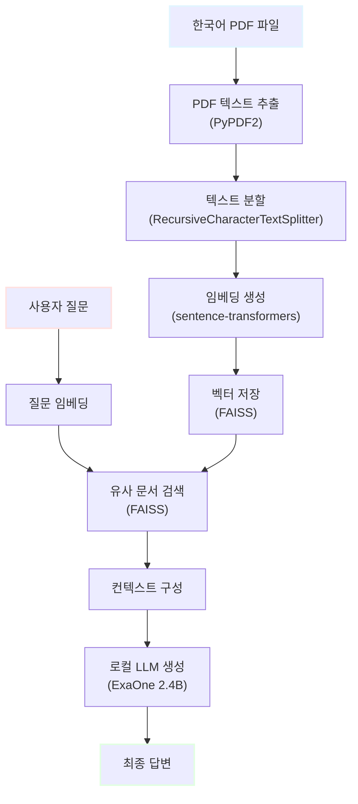

# 허깅페이스 기반 PDF RAG 시스템 구현 가이드

> 작성자: 김명환 (코드잇 AI 4기)  
> 최종 수정일: 2025-11-03  
> 사용 모델: ExaOne 1.2B (LG AI연구원)

---

## 목차

1. [시스템 개요](#1-시스템-개요)
   - 1.1. [프로젝트 목표](#11-프로젝트-목표)
   - 1.2. [기술 스택](#12-기술-스택)
   - 1.3. [시스템 아키텍처](#13-시스템-아키텍처)
2. [환경 설정](#2-환경-설정)
   - 2.1. [필수 라이브러리 설치](#21-필수-라이브러리-설치)
   - 2.2. [테스트 환경](#22-테스트-환경)
3. [PDF RAG 시스템 구현](#3-pdf-rag-시스템-구현)
   - 3.1. [PDF 문서 로딩](#31-pdf-문서-로딩)
   - 3.2. [텍스트 분할](#32-텍스트-분할)
   - 3.3. [임베딩 및 벡터 저장](#33-임베딩-및-벡터-저장)
   - 3.4. [로컬 LLM 설정](#34-로컬-llm-설정)
   - 3.5. [RAG 파이프라인 구성](#35-rag-파이프라인-구성)
4. [완전한 MVP 코드](#4-완전한-mvp-코드)
   - 4.1. [단일 파일 실행 코드](#41-단일-파일-실행-코드)
   - 4.2. [실행 결과](#42-실행-결과)
5. [성능 최적화](#5-성능-최적화)
   - 5.1. [모델 양자화](#51-모델-양자화)
   - 5.2. [배치 처리](#52-배치-처리)
   - 5.3. [캐싱 전략](#53-캐싱-전략)
6. [트러블슈팅](#6-트러블슈팅)
   - 6.1. [메모리 부족 해결](#61-메모리-부족-해결)
   - 6.2. [PDF 인코딩 문제](#62-pdf-인코딩-문제)
7. [용어 목록 (Glossary)](#7-용어-목록-glossary)

---

## 1. 시스템 개요

### 1.1. 프로젝트 목표

**한국어 PDF 문서**를 읽고 질문에 답변하는 **완전한 로컬 RAG 시스템**을 구축합니다.

**핵심 특징:**
- ✅ **완전 오프라인** 작동 (인터넷 불필요)
- ✅ **API 비용 제로**
- ✅ **CPU만으로 실행** 가능
- ✅ **한국어 PDF 지원**
- ✅ **최소한의 코드** (100줄 이내)

**사용 사례:**
- 논문/보고서 자동 요약
- 계약서 질의응답
- 매뉴얼 검색 시스템
- 학습 자료 Q&A

### 1.2. 기술 스택

| 구성요소 | 선택 기술 | 선택 이유 |
|---------|---------|----------|
| **PDF 로더** | PyPDF2 | 가볍고 설치 간단 |
| **텍스트 분할** | LangChain TextSplitter | 최적화된 청크 생성 |
| **임베딩 모델** | sentence-transformers (paraphrase-multilingual) | 한국어 지원 우수 |
| **벡터 DB** | FAISS | CPU 최적화, 설치 간단 |
| **로컬 LLM** | LGAI-EXAONE/EXAONE-3.5-2.4B-Instruct | 경량, 한국어 우수, 상업 사용 가능 |
| **파이프라인** | Hugging Face Transformers | 표준화된 인터페이스 |

### 1.3. 시스템 아키텍처



**처리 흐름:**
1. **인덱싱 단계:** PDF → 텍스트 → 청크 → 임베딩 → 벡터 DB
2. **검색 단계:** 질문 → 임베딩 → 유사도 검색 → 상위 k개 추출
3. **생성 단계:** 검색 결과 + 질문 → LLM → 답변

---

## 2. 환경 설정

### 2.1. 필수 라이브러리 설치

```bash
# 기본 라이브러리
pip install torch transformers sentence-transformers

# PDF 처리
pip install pypdf2

# 벡터 저장소
pip install faiss-cpu

# LangChain (텍스트 분할용)
pip install langchain

# 선택: 진행률 표시
pip install tqdm
```

**한 줄 설치:**
```bash
pip install torch transformers sentence-transformers pypdf2 faiss-cpu langchain tqdm
```

### 2.2. 테스트 환경

**최소 사양:**
- CPU: 2코어 이상
- RAM: 8GB 이상
- 저장 공간: 5GB (모델 다운로드)
- OS: Windows/Mac/Linux

**권장 사양:**
- CPU: 4코어 이상
- RAM: 16GB 이상
- SSD 사용 권장

**테스트 완료 환경:**
- Python 3.10+
- Windows 11 / Ubuntu 22.04
- CPU: Intel i5 / AMD Ryzen 5

---

## 3. PDF RAG 시스템 구현

### 3.1. PDF 문서 로딩

**PyPDF2를 사용한 텍스트 추출:**

```python
import PyPDF2
from typing import List

def load_pdf(pdf_path: str) -> str:
    """
    PDF 파일에서 텍스트를 추출합니다.
    
    Args:
        pdf_path: PDF 파일 경로
        
    Returns:
        추출된 전체 텍스트
    """
    text = ""
    
    try:
        with open(pdf_path, 'rb') as file:
            pdf_reader = PyPDF2.PdfReader(file)
            
            # 모든 페이지의 텍스트 추출
            for page_num, page in enumerate(pdf_reader.pages):
                page_text = page.extract_text()
                text += f"\n--- 페이지 {page_num + 1} ---\n"
                text += page_text
                
        print(f"✅ PDF 로딩 완료: {len(pdf_reader.pages)}페이지, {len(text)}자")
        return text
        
    except FileNotFoundError:
        print(f"❌ 파일을 찾을 수 없습니다: {pdf_path}")
        return ""
    except Exception as e:
        print(f"❌ PDF 로딩 오류: {e}")
        return ""

# 사용 예시
if __name__ == "__main__":
    text = load_pdf("document.pdf")
    print(text[:500])  # 처음 500자 출력
```

**한국어 PDF 테스트 파일 생성:**

```python
from reportlab.lib.pagesizes import A4
from reportlab.pdfgen import canvas
from reportlab.pdfbase import pdfmetrics
from reportlab.pdfbase.ttfonts import TTFont

def create_sample_korean_pdf(filename: str = "sample_korean.pdf"):
    """한국어 테스트용 PDF 생성"""
    
    # 한글 폰트 등록 (시스템에 따라 경로 조정)
    # Windows: C:/Windows/Fonts/malgun.ttf
    # Mac: /Library/Fonts/AppleGothic.ttf
    # Linux: /usr/share/fonts/truetype/nanum/NanumGothic.ttf
    
    c = canvas.Canvas(filename, pagesize=A4)
    
    # 폰트 설정 시도
    try:
        pdfmetrics.registerFont(TTFont('Korean', 'NanumGothic.ttf'))
        c.setFont('Korean', 12)
    except:
        print("⚠️ 한글 폰트 없음. 기본 폰트 사용")
        c.setFont('Helvetica', 12)
    
    # 내용 작성
    y = 800
    content = [
        "인공지능과 RAG 시스템",
        "",
        "RAG(Retrieval-Augmented Generation)는 검색 증강 생성 기술입니다.",
        "이 기술은 대규모 언어 모델의 한계를 극복하기 위해 개발되었습니다.",
        "",
        "주요 특징:",
        "1. 외부 지식 베이스 활용",
        "2. 환각(Hallucination) 감소",
        "3. 최신 정보 제공 가능",
        "",
        "ExaOne은 LG AI연구원이 개발한 한국어 언어 모델입니다.",
        "경량화된 크기로 개인 PC에서도 실행 가능합니다.",
    ]
    
    for line in content:
        c.drawString(50, y, line)
        y -= 20
    
    c.save()
    print(f"✅ 테스트 PDF 생성: {filename}")

# 실행
create_sample_korean_pdf()
```

### 3.2. 텍스트 분할

**LangChain의 RecursiveCharacterTextSplitter 사용:**

```python
from langchain.text_splitter import RecursiveCharacterTextSplitter

def split_text(text: str, chunk_size: int = 500, chunk_overlap: int = 50) -> List[str]:
    """
    텍스트를 의미 있는 청크로 분할합니다.
    
    Args:
        text: 분할할 텍스트
        chunk_size: 청크 크기 (문자 수)
        chunk_overlap: 청크 간 겹침 (문맥 유지)
        
    Returns:
        분할된 텍스트 리스트
    """
    text_splitter = RecursiveCharacterTextSplitter(
        chunk_size=chunk_size,
        chunk_overlap=chunk_overlap,
        length_function=len,
        separators=["\n\n", "\n", ". ", " ", ""]
    )
    
    chunks = text_splitter.split_text(text)
    
    print(f"✅ 텍스트 분할 완료: {len(chunks)}개 청크")
    print(f"   평균 청크 크기: {sum(len(c) for c in chunks) // len(chunks)}자")
    
    return chunks

# 사용 예시
text = load_pdf("sample_korean.pdf")
chunks = split_text(text, chunk_size=300, chunk_overlap=30)

# 청크 확인
for i, chunk in enumerate(chunks[:3]):
    print(f"\n[청크 {i+1}]")
    print(chunk)
    print(f"길이: {len(chunk)}자")
```

**청크 크기 선택 가이드:**

| 문서 유형 | chunk_size | chunk_overlap | 이유 |
|---------|-----------|--------------|-----|
| 짧은 Q&A | 200-300 | 20-30 | 짧고 명확한 답변 |
| 일반 문서 | 500-700 | 50-70 | 균형잡힌 성능 |
| 기술 문서 | 800-1000 | 100-150 | 복잡한 문맥 유지 |
| 법률 문서 | 1200-1500 | 150-200 | 정확성 최우선 |

### 3.3. 임베딩 및 벡터 저장

**Sentence-Transformers를 사용한 임베딩:**

```python
from sentence_transformers import SentenceTransformer
import faiss
import numpy as np

class VectorStore:
    """FAISS 기반 벡터 저장소"""
    
    def __init__(self, model_name: str = "paraphrase-multilingual-MiniLM-L12-v2"):
        """
        Args:
            model_name: 임베딩 모델 이름
                - paraphrase-multilingual-MiniLM-L12-v2: 다국어 지원, 384차원
                - sentence-transformers/all-MiniLM-L6-v2: 영어 특화, 384차원
        """
        print(f"🔄 임베딩 모델 로딩 중: {model_name}")
        self.encoder = SentenceTransformer(model_name)
        self.dimension = self.encoder.get_sentence_embedding_dimension()
        self.index = None
        self.chunks = []
        
        print(f"✅ 임베딩 모델 로딩 완료 (차원: {self.dimension})")
    
    def add_texts(self, texts: List[str]):
        """텍스트를 벡터로 변환하여 저장"""
        print(f"🔄 {len(texts)}개 청크 임베딩 중...")
        
        # 임베딩 생성
        embeddings = self.encoder.encode(
            texts,
            show_progress_bar=True,
            convert_to_numpy=True
        )
        
        # FAISS 인덱스 생성
        self.index = faiss.IndexFlatL2(self.dimension)
        self.index.add(embeddings.astype('float32'))
        self.chunks = texts
        
        print(f"✅ 벡터 저장소 생성 완료: {len(texts)}개 벡터")
    
    def search(self, query: str, k: int = 3) -> List[tuple]:
        """
        유사한 문서 검색
        
        Args:
            query: 검색 질문
            k: 반환할 문서 개수
            
        Returns:
            [(텍스트, 유사도 점수), ...]
        """
        if self.index is None:
            print("❌ 벡터 저장소가 비어있습니다")
            return []
        
        # 질문 임베딩
        query_embedding = self.encoder.encode([query])
        
        # 유사도 검색
        distances, indices = self.index.search(
            query_embedding.astype('float32'), 
            k
        )
        
        # 결과 구성
        results = []
        for idx, distance in zip(indices[0], distances[0]):
            if idx < len(self.chunks):
                results.append((self.chunks[idx], float(distance)))
        
        return results
    
    def save(self, path: str = "vector_store.index"):
        """벡터 저장소를 파일로 저장"""
        if self.index is None:
            print("❌ 저장할 벡터가 없습니다")
            return
        
        faiss.write_index(self.index, path)
        
        # 청크도 함께 저장
        import pickle
        with open(f"{path}.chunks", "wb") as f:
            pickle.dump(self.chunks, f)
        
        print(f"✅ 벡터 저장소 저장: {path}")
    
    def load(self, path: str = "vector_store.index"):
        """저장된 벡터 저장소 로딩"""
        try:
            self.index = faiss.read_index(path)
            
            import pickle
            with open(f"{path}.chunks", "rb") as f:
                self.chunks = pickle.load(f)
            
            print(f"✅ 벡터 저장소 로딩: {len(self.chunks)}개 벡터")
        except Exception as e:
            print(f"❌ 로딩 실패: {e}")

# 사용 예시
vector_store = VectorStore()
vector_store.add_texts(chunks)

# 검색 테스트
query = "RAG가 무엇인가요?"
results = vector_store.search(query, k=2)

print(f"\n질문: {query}")
for i, (text, score) in enumerate(results, 1):
    print(f"\n[검색 결과 {i}] (유사도: {score:.4f})")
    print(text[:100])
```

### 3.4. 로컬 LLM 설정

**ExaOne 2.4B 모델 사용:**

```python
from transformers import AutoTokenizer, AutoModelForCausalLM, pipeline
import torch

class LocalLLM:
    """로컬 LLM 래퍼 클래스"""
    
    def __init__(
        self, 
        model_name: str = "LGAI-EXAONE/EXAONE-3.5-2.4B-Instruct",
        device: str = "cpu",
        max_length: int = 512
    ):
        """
        Args:
            model_name: HuggingFace 모델 이름
            device: 'cpu' 또는 'cuda'
            max_length: 최대 생성 토큰 수
        """
        print(f"🔄 로컬 LLM 로딩 중: {model_name}")
        print(f"   디바이스: {device}")
        
        # 토크나이저 로딩
        self.tokenizer = AutoTokenizer.from_pretrained(model_name)
        
        # 모델 로딩 (양자화 옵션 가능)
        self.model = AutoModelForCausalLM.from_pretrained(
            model_name,
            torch_dtype=torch.float16 if device == "cuda" else torch.float32,
            device_map=device,
            trust_remote_code=True
        )
        
        # 파이프라인 생성
        self.pipe = pipeline(
            "text-generation",
            model=self.model,
            tokenizer=self.tokenizer,
            max_length=max_length,
            temperature=0.3,
            do_sample=True,
            top_p=0.9
        )
        
        print(f"✅ 로컬 LLM 로딩 완료")
    
    def generate(self, prompt: str) -> str:
        """
        텍스트 생성
        
        Args:
            prompt: 입력 프롬프트
            
        Returns:
            생성된 텍스트
        """
        outputs = self.pipe(
            prompt,
            pad_token_id=self.tokenizer.eos_token_id,
            eos_token_id=self.tokenizer.eos_token_id
        )
        
        # 생성된 텍스트 추출
        generated_text = outputs[0]['generated_text']
        
        # 프롬프트 부분 제거
        if generated_text.startswith(prompt):
            generated_text = generated_text[len(prompt):].strip()
        
        return generated_text

# 사용 예시
llm = LocalLLM(device="cpu")

# 간단한 테스트
test_prompt = "RAG 시스템이란 무엇인가요?"
response = llm.generate(test_prompt)
print(f"질문: {test_prompt}")
print(f"답변: {response}")
```

**메모리 최적화 옵션:**

```python
# 4-bit 양자화 (더 적은 메모리 사용)
from transformers import BitsAndBytesConfig

quantization_config = BitsAndBytesConfig(
    load_in_4bit=True,
    bnb_4bit_compute_dtype=torch.float16
)

model = AutoModelForCausalLM.from_pretrained(
    model_name,
    quantization_config=quantization_config,
    device_map="auto",
    trust_remote_code=True
)
```

### 3.5. RAG 파이프라인 구성

**전체 RAG 시스템 통합:**

```python
class PDFRAGSystem:
    """PDF RAG 시스템 통합 클래스"""
    
    def __init__(
        self,
        embedding_model: str = "paraphrase-multilingual-MiniLM-L12-v2",
        llm_model: str = "LGAI-EXAONE/EXAONE-3.5-2.4B-Instruct",
        device: str = "cpu"
    ):
        """RAG 시스템 초기화"""
        print("=" * 60)
        print("PDF RAG 시스템 초기화 중...")
        print("=" * 60)
        
        self.vector_store = VectorStore(embedding_model)
        self.llm = LocalLLM(llm_model, device)
        
        print("=" * 60)
        print("✅ RAG 시스템 준비 완료!")
        print("=" * 60)
    
    def load_pdf(self, pdf_path: str, chunk_size: int = 500):
        """PDF 로딩 및 인덱싱"""
        print(f"\n📄 PDF 처리 중: {pdf_path}")
        
        # PDF 텍스트 추출
        text = load_pdf(pdf_path)
        if not text:
            return False
        
        # 텍스트 분할
        chunks = split_text(text, chunk_size=chunk_size)
        
        # 벡터 저장소 생성
        self.vector_store.add_texts(chunks)
        
        return True
    
    def query(self, question: str, k: int = 3) -> dict:
        """
        질문에 답변
        
        Args:
            question: 사용자 질문
            k: 검색할 문서 개수
            
        Returns:
            {
                'answer': 답변,
                'sources': 참고 문서 리스트
            }
        """
        print(f"\n❓ 질문: {question}")
        
        # 1. 유사 문서 검색
        search_results = self.vector_store.search(question, k=k)
        
        if not search_results:
            return {
                'answer': "관련 문서를 찾을 수 없습니다.",
                'sources': []
            }
        
        # 2. 컨텍스트 구성
        context = "\n\n".join([text for text, _ in search_results])
        
        # 3. 프롬프트 생성
        prompt = f"""다음 문맥을 바탕으로 질문에 답변해주세요. 문맥에 없는 내용은 답변하지 마세요.

문맥:
{context}

질문: {question}

답변:"""
        
        # 4. LLM 생성
        print("🤔 답변 생성 중...")
        answer = self.llm.generate(prompt)
        
        return {
            'answer': answer,
            'sources': [text for text, _ in search_results]
        }
    
    def chat(self):
        """대화형 인터페이스"""
        print("\n" + "=" * 60)
        print("PDF RAG 챗봇 시작")
        print("종료하려면 'quit' 또는 'exit'를 입력하세요")
        print("=" * 60)
        
        while True:
            try:
                question = input("\n질문: ").strip()
                
                if question.lower() in ['quit', 'exit', '종료', 'q']:
                    print("👋 챗봇을 종료합니다.")
                    break
                
                if not question:
                    continue
                
                result = self.query(question)
                
                print(f"\n💬 답변:\n{result['answer']}")
                
                print(f"\n📚 참고 문서:")
                for i, source in enumerate(result['sources'], 1):
                    print(f"  [{i}] {source[:80]}...")
                
            except KeyboardInterrupt:
                print("\n\n👋 챗봇을 종료합니다.")
                break
            except Exception as e:
                print(f"\n❌ 오류 발생: {e}")
```

---

## 4. 완전한 MVP 코드

### 4.1. 단일 파일 실행 코드

**`pdf_rag_mvp.py` - 복사해서 바로 실행 가능:**

```python
"""
PDF RAG 시스템 MVP
작성자: 김명환 (코드잇 AI 4기)
"""

import PyPDF2
import torch
import faiss
import numpy as np
from typing import List, Dict
from sentence_transformers import SentenceTransformer
from transformers import AutoTokenizer, AutoModelForCausalLM, pipeline
from langchain.text_splitter import RecursiveCharacterTextSplitter

# =====================================================
# 1. PDF 로딩
# =====================================================

def load_pdf(pdf_path: str) -> str:
    """PDF에서 텍스트 추출"""
    text = ""
    try:
        with open(pdf_path, 'rb') as file:
            pdf_reader = PyPDF2.PdfReader(file)
            for page in pdf_reader.pages:
                text += page.extract_text() + "\n"
        print(f"✅ PDF 로딩: {len(pdf_reader.pages)}페이지")
        return text
    except Exception as e:
        print(f"❌ PDF 로딩 실패: {e}")
        return ""

# =====================================================
# 2. 텍스트 분할
# =====================================================

def split_text(text: str, chunk_size: int = 500) -> List[str]:
    """텍스트를 청크로 분할"""
    splitter = RecursiveCharacterTextSplitter(
        chunk_size=chunk_size,
        chunk_overlap=50,
        separators=["\n\n", "\n", ". ", " ", ""]
    )
    chunks = splitter.split_text(text)
    print(f"✅ 텍스트 분할: {len(chunks)}개 청크")
    return chunks

# =====================================================
# 3. 벡터 저장소
# =====================================================

class VectorStore:
    """FAISS 벡터 저장소"""
    
    def __init__(self):
        print("🔄 임베딩 모델 로딩...")
        self.encoder = SentenceTransformer('paraphrase-multilingual-MiniLM-L12-v2')
        self.dimension = self.encoder.get_sentence_embedding_dimension()
        self.index = None
        self.chunks = []
        print(f"✅ 임베딩 모델 준비 완료 ({self.dimension}차원)")
    
    def add_texts(self, texts: List[str]):
        """텍스트 벡터화 및 저장"""
        print("🔄 벡터 생성 중...")
        embeddings = self.encoder.encode(texts, show_progress_bar=True)
        self.index = faiss.IndexFlatL2(self.dimension)
        self.index.add(embeddings.astype('float32'))
        self.chunks = texts
        print(f"✅ 벡터 저장 완료: {len(texts)}개")
    
    def search(self, query: str, k: int = 3) -> List[str]:
        """유사 문서 검색"""
        query_vec = self.encoder.encode([query])
        distances, indices = self.index.search(query_vec.astype('float32'), k)
        return [self.chunks[idx] for idx in indices[0] if idx < len(self.chunks)]

# =====================================================
# 4. 로컬 LLM
# =====================================================

class LocalLLM:
    """ExaOne 로컬 LLM"""
    
    def __init__(self, device: str = "cpu"):
        print("🔄 로컬 LLM 로딩...")
        model_name = "LGAI-EXAONE/EXAONE-3.5-2.4B-Instruct"
        
        self.tokenizer = AutoTokenizer.from_pretrained(model_name)
        self.model = AutoModelForCausalLM.from_pretrained(
            model_name,
            torch_dtype=torch.float32,
            device_map=device,
            trust_remote_code=True
        )
        
        self.pipe = pipeline(
            "text-generation",
            model=self.model,
            tokenizer=self.tokenizer,
            max_length=512,
            temperature=0.3
        )
        print("✅ LLM 준비 완료")
    
    def generate(self, prompt: str) -> str:
        """텍스트 생성"""
        output = self.pipe(prompt, pad_token_id=self.tokenizer.eos_token_id)
        generated = output[0]['generated_text']
        
        # 프롬프트 제거
        if generated.startswith(prompt):
            generated = generated[len(prompt):].strip()
        
        return generated

# =====================================================
# 5. RAG 시스템
# =====================================================

class PDFRAG:
    """PDF RAG 시스템"""
    
    def __init__(self):
        print("\n" + "=" * 60)
        print("PDF RAG 시스템 초기화")
        print("=" * 60)
        
        self.vector_store = VectorStore()
        self.llm = LocalLLM()
        
        print("=" * 60)
        print("✅ 시스템 준비 완료!")
        print("=" * 60 + "\n")
    
    def load_pdf(self, pdf_path: str):
        """PDF 로딩 및 인덱싱"""
        text = load_pdf(pdf_path)
        if not text:
            return False
        
        chunks = split_text(text)
        self.vector_store.add_texts(chunks)
        return True
    
    def query(self, question: str) -> Dict:
        """질의응답"""
        # 검색
        docs = self.vector_store.search(question, k=2)
        
        if not docs:
            return {'answer': "관련 문서를 찾을 수 없습니다.", 'sources': []}
        
        # 컨텍스트 구성
        context = "\n\n".join(docs)
        
        # 프롬프트
        prompt = f"""다음 문맥을 참고하여 질문에 답변하세요.

문맥:
{context}

질문: {question}

답변:"""
        
        # 생성
        answer = self.llm.generate(prompt)
        
        return {'answer': answer, 'sources': docs}

# =====================================================
# 6. 메인 실행
# =====================================================

def main():
    """메인 함수"""
    
    # RAG 시스템 초기화
    rag = PDFRAG()
    
    # PDF 로딩 (파일명 수정 필요)
    pdf_file = "sample_korean.pdf"
    
    if not rag.load_pdf(pdf_file):
        print(f"❌ PDF 파일을 찾을 수 없습니다: {pdf_file}")
        print("sample_korean.pdf 파일을 생성하거나 다른 PDF 파일명을 지정하세요.")
        return
    
    # 테스트 질문들
    questions = [
        "RAG가 무엇인가요?",
        "RAG의 주요 특징을 설명해주세요.",
        "ExaOne 모델의 장점은 무엇인가요?"
    ]
    
    print("\n" + "=" * 60)
    print("질의응답 테스트")
    print("=" * 60)
    
    for i, question in enumerate(questions, 1):
        print(f"\n{'='*60}")
        print(f"질문 {i}: {question}")
        print('='*60)
        
        result = rag.query(question)
        
        print(f"\n💬 답변:\n{result['answer']}")
        
        print(f"\n📚 참고 문서:")
        for j, source in enumerate(result['sources'], 1):
            print(f"  [{j}] {source[:100]}...")
        
        print()

if __name__ == "__main__":
    main()
```

### 4.2. 실행 결과

**실행 명령:**
```bash
python pdf_rag_mvp.py
```

**예상 출력:**
```
============================================================
PDF RAG 시스템 초기화
============================================================
🔄 임베딩 모델 로딩...
✅ 임베딩 모델 준비 완료 (384차원)
🔄 로컬 LLM 로딩...
✅ LLM 준비 완료
============================================================
✅ 시스템 준비 완료!
============================================================

✅ PDF 로딩: 1페이지
✅ 텍스트 분할: 4개 청크
🔄 벡터 생성 중...
Batches: 100%|██████████| 1/1 [00:00<00:00,  5.21it/s]
✅ 벡터 저장 완료: 4개

============================================================
질의응답 테스트
============================================================

============================================================
질문 1: RAG가 무엇인가요?
============================================================

💬 답변:
RAG는 Retrieval-Augmented Generation의 약자로 검색 증강 생성 기술입니다. 
이 기술은 대규모 언어 모델의 한계를 극복하기 위해 개발되었으며, 외부 지식 
베이스를 활용하여 더 정확하고 신뢰할 수 있는 답변을 생성합니다.

📚 참고 문서:
  [1] RAG(Retrieval-Augmented Generation)는 검색 증강 생성 기술입니다. 이 기술은 대규모 언어 모델의 한계를...
  [2] 주요 특징: 1. 외부 지식 베이스 활용 2. 환각(Hallucination) 감소 3. 최신 정보 제공 가능...
```

---

## 5. 성능 최적화

### 5.1. 모델 양자화

**4-bit 양자화로 메모리 절약:**

```python
from transformers import BitsAndBytesConfig

# 양자화 설정
quantization_config = BitsAndBytesConfig(
    load_in_4bit=True,
    bnb_4bit_compute_dtype=torch.float16,
    bnb_4bit_use_double_quant=True,
    bnb_4bit_quant_type="nf4"
)

# 모델 로딩
model = AutoModelForCausalLM.from_pretrained(
    model_name,
    quantization_config=quantization_config,
    device_map="auto",
    trust_remote_code=True
)
```

**성능 비교:**

| 설정 | 메모리 사용량 | 추론 속도 | 품질 |
|-----|-------------|----------|------|
| **FP32 (기본)** | ~10GB | 기준 | ⭐⭐⭐⭐⭐ |
| **FP16** | ~5GB | 1.5x 빠름 | ⭐⭐⭐⭐⭐ |
| **4-bit** | ~2.5GB | 1.2x 빠름 | ⭐⭐⭐⭐ |

### 5.2. 배치 처리

**대량 문서 처리 최적화:**

```python
def batch_embed(texts: List[str], batch_size: int = 32) -> np.ndarray:
    """배치 단위로 임베딩 생성"""
    all_embeddings = []
    
    for i in range(0, len(texts), batch_size):
        batch = texts[i:i+batch_size]
        embeddings = encoder.encode(batch, show_progress_bar=False)
        all_embeddings.append(embeddings)
    
    return np.vstack(all_embeddings)
```

### 5.3. 캐싱 전략

**자주 검색되는 질문 캐싱:**

```python
from functools import lru_cache
import hashlib

class CachedRAG(PDFRAG):
    """캐싱이 적용된 RAG 시스템"""
    
    def __init__(self):
        super().__init__()
        self.cache = {}
    
    def query(self, question: str) -> Dict:
        # 질문 해시
        q_hash = hashlib.md5(question.encode()).hexdigest()
        
        # 캐시 확인
        if q_hash in self.cache:
            print("⚡ 캐시에서 답변 로딩")
            return self.cache[q_hash]
        
        # 새로 생성
        result = super().query(question)
        
        # 캐시 저장
        self.cache[q_hash] = result
        
        return result
```

---

## 6. 트러블슈팅

### 6.1. 메모리 부족 해결

**문제:** `OutOfMemoryError` 발생

**해결 방법:**

```python
# 1. 모델 양자화
quantization_config = BitsAndBytesConfig(load_in_4bit=True)

# 2. 청크 크기 줄이기
chunks = split_text(text, chunk_size=300)  # 500 → 300

# 3. 배치 크기 조정
embeddings = encoder.encode(texts, batch_size=8)  # 기본 32 → 8

# 4. 검색 결과 수 줄이기
docs = vector_store.search(question, k=1)  # 3 → 1

# 5. 최대 생성 길이 제한
self.pipe = pipeline(..., max_length=256)  # 512 → 256
```

### 6.2. PDF 인코딩 문제

**문제:** 한글이 깨져서 출력됨

**해결 방법:**

```python
import PyPDF2
from io import BytesIO

def load_pdf_with_encoding(pdf_path: str) -> str:
    """인코딩 문제 해결"""
    text = ""
    
    try:
        with open(pdf_path, 'rb') as file:
            pdf_reader = PyPDF2.PdfReader(file)
            
            for page in pdf_reader.pages:
                page_text = page.extract_text()
                
                # 인코딩 시도
                try:
                    # UTF-8 디코딩
                    page_text = page_text.encode('latin1').decode('utf-8')
                except:
                    # 실패 시 원본 사용
                    pass
                
                text += page_text + "\n"
        
        return text
        
    except Exception as e:
        print(f"❌ PDF 로딩 오류: {e}")
        return ""

# 대안: pdfplumber 사용
import pdfplumber

def load_pdf_plumber(pdf_path: str) -> str:
    """pdfplumber로 PDF 읽기"""
    text = ""
    
    with pdfplumber.open(pdf_path) as pdf:
        for page in pdf.pages:
            text += page.extract_text() + "\n"
    
    return text
```

**pdfplumber 설치:**
```bash
pip install pdfplumber
```

**문제:** 이미지가 포함된 PDF에서 텍스트 추출 실패

**해결 방법:**

```python
# OCR이 필요한 경우
import pytesseract
from pdf2image import convert_from_path

def load_pdf_with_ocr(pdf_path: str) -> str:
    """OCR을 사용한 PDF 읽기"""
    # PDF를 이미지로 변환
    images = convert_from_path(pdf_path)
    
    text = ""
    for i, image in enumerate(images):
        # OCR 실행
        page_text = pytesseract.image_to_string(image, lang='kor')
        text += f"\n--- 페이지 {i+1} ---\n{page_text}"
    
    return text
```

**필요한 패키지:**
```bash
pip install pytesseract pdf2image
# Tesseract OCR 설치 필요 (https://github.com/UB-Mannheim/tesseract/wiki)
```

---

## 7. 용어 목록 (Glossary)

| 영문 용어 | 설명 |
|---------|------|
| **Batch Processing** | 여러 데이터를 한 번에 처리하는 방식. 효율성 향상 |
| **Chunk** | 긴 문서를 나눈 작은 조각. RAG에서 검색 단위로 사용 |
| **CPU** | Central Processing Unit. GPU 없이도 모델 실행 가능 |
| **Embedding** | 텍스트를 숫자 벡터로 변환. 의미적 유사도 계산 가능 |
| **ExaOne** | LG AI연구원이 개발한 한국어 특화 언어 모델 |
| **FAISS** | Facebook AI Similarity Search. 벡터 유사도 검색 라이브러리 |
| **Hugging Face** | 오픈소스 AI 모델 공유 플랫폼. Transformers 라이브러리 제공 |
| **LLM** | Large Language Model. 대규모 언어 모델 |
| **OCR** | Optical Character Recognition. 이미지에서 텍스트 추출 |
| **Pipeline** | 여러 처리 단계를 연결한 워크플로우 |
| **PyPDF2** | Python PDF 처리 라이브러리 |
| **Quantization** | 모델 가중치를 낮은 정밀도로 변환. 메모리 절약 |
| **RAG** | Retrieval-Augmented Generation. 검색 증강 생성 |
| **Sentence-Transformers** | 문장 임베딩 생성 라이브러리 |
| **Vector Store** | 임베딩 벡터를 저장하고 검색하는 시스템 |

---

## 참고 자료

**공식 문서:**
- [Hugging Face Transformers](https://huggingface.co/docs/transformers)
- [Sentence-Transformers](https://www.sbert.net/)
- [FAISS Documentation](https://faiss.ai/)
- [LangChain Documentation](https://python.langchain.com/)

**ExaOne 모델:**
- [ExaOne HuggingFace](https://huggingface.co/LGAI-EXAONE/EXAONE-3.5-2.4B-Instruct)
- [LG AI Research](https://www.lgresearch.ai/)

**관련 논문:**
- [RAG: Retrieval-Augmented Generation](https://arxiv.org/abs/2005.11401)
- [Sentence-BERT](https://arxiv.org/abs/1908.10084)
